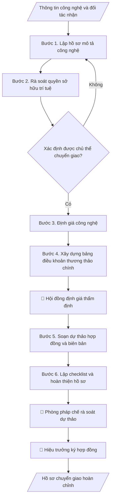

# Skill: Hồ sơ chuyển giao công nghệ

## Khi nào dùng
Khi Viện có kết quả nghiên cứu (sáng chế, giải pháp, quy trình, phần mềm...) sẵn sàng chuyển giao
cho doanh nghiệp/tổ chức: cần bộ hồ sơ gồm mô tả công nghệ, định giá, điều khoản thương thảo và
biên bản chuyển giao.

## Đầu vào (Input)

| Trường | Mô tả | Bắt buộc |
|---|---|---|
| `ten_cong_nghe` | Tên công nghệ/kết quả nghiên cứu | Có |
| `mo_ta` | Mô tả: nguyên lý, ưu điểm, phạm vi ứng dụng, mức sẵn sàng (TRL) | Có |
| `quyen_so_huu` | Tình trạng sở hữu trí tuệ (đã cấp/không, đồng sở hữu...) | Có |
| `doi_tac_nhan` | Tổ chức/doanh nghiệp nhận chuyển giao | Có |
| `hinh_thuc` | Chuyển nhượng quyền / Li-xăng độc quyền / Li-xăng không độc quyền / Góp vốn | Có |
| `pham_vi` | Phạm vi lãnh thổ, lĩnh vực, thời hạn | Có |

## Quy trình

**Bước 1. Lập hồ sơ mô tả công nghệ**
- Làm gì: Viết tài liệu mô tả: nguyên lý hoạt động, thông số kỹ thuật chính, ưu điểm vượt
  trội so với giải pháp hiện có (có số liệu so sánh), mức sẵn sàng công nghệ TRL 1–9 kèm
  bằng chứng đạt mức đó, phạm vi ứng dụng/lĩnh vực.
- Dùng input: `ten_cong_nghe`, `mo_ta`.
- Vai trò: Chuyên viên chuyển giao công nghệ · AI hỗ trợ: soạn dự thảo tài liệu mô tả công nghệ, nhóm nghiên cứu bổ sung thông số và bằng chứng TRL · ⏱ 2–4 giờ (ước tính)
- Lưu ý nghiệp vụ: TRL phải có minh chứng (kết quả thử nghiệm, báo cáo đánh giá) — không
  khai TRL cao hơn thực tế; phần "ưu điểm" phải định lượng được (%, lần, chi phí), tránh
  tính từ chung chung.
- → Kết quả bước: Tài liệu mô tả công nghệ (kèm bảng so sánh ưu điểm với giải pháp hiện có).

**Bước 2. Rà soát quyền sở hữu trí tuệ**
- Làm gì: Liệt kê toàn bộ văn bằng SHTT liên quan (sáng chế, giải pháp hữu ích, kiểu dáng,
  bản quyền phần mềm): số văn bằng, chủ sở hữu, tình trạng hiệu lực (đã đóng phí duy trì
  chưa); xác định tỷ lệ sở hữu của trường/nhóm tác giả/đối tác phối hợp; kết luận chủ thể
  có quyền ký chuyển giao.
- Dùng input: `quyen_so_huu`.
- Vai trò: Chuyên viên chuyển giao công nghệ · AI hỗ trợ: lập bảng rà soát văn bằng · ⏱ 1–2 giờ (ước tính)
- Lưu ý nghiệp vụ: nếu đồng sở hữu phải có văn bản đồng ý của các bên đồng sở hữu; nếu
  kết quả từ đề tài dùng vốn ngân sách nhà nước, kiểm tra quy định về quyền sở hữu và
  phân chia lợi ích trước khi chuyển giao.
- → Kết quả bước: Bảng rà soát SHTT + kết luận chủ thể có quyền chuyển giao.

**Bước 3. Định giá công nghệ**
- Làm gì: Áp dụng 1–3 phương pháp (chi phí / so sánh thị trường / thu nhập); với mỗi
  phương pháp nêu: dữ liệu đầu vào, giả định, cách tính; tổng hợp thành khoảng giá đề
  xuất; lập bảng tính chi tiết đính kèm.
- Dùng input: `ten_cong_nghe`, `hinh_thuc`, `pham_vi` (hình thức độc quyền/không độc
  quyền, lãnh thổ, thời hạn đều ảnh hưởng đến giá).
- Vai trò: Hội đồng định giá · AI hỗ trợ: tính toán theo 1–3 phương pháp định giá · ⏱ 1–2 ngày làm việc (ước tính)
- Lưu ý nghiệp vụ: nêu rõ mọi giả định và độ không chắc chắn; thiếu dữ liệu thị trường
  thì ghi rõ hạn chế, không bịa số liệu; giá phải tương xứng với hình thức chuyển giao
  (li-xăng độc quyền cao hơn không độc quyền).
- → Kết quả bước: Báo cáo định giá (phương pháp, giả định, khoảng giá đề xuất, bảng tính).

**Bước 4. Xây dựng bảng điều khoản thương thảo chính**
- Làm gì: Lập bảng các điều khoản cốt lõi để đàm phán: phí chuyển giao (cách tính, lịch
  thanh toán theo đợt), royalty (% doanh thu, cách tính, kỳ quyết toán), phạm vi li-xăng,
  nghĩa vụ đào tạo chuyển giao, hỗ trợ kỹ thuật (thời hạn), bảo mật/NDA, bảo hành công
  nghệ, xử lý vi phạm và chấm dứt. Mỗi điều khoản ghi: đề xuất của bên giao và mức
  sàn/trần chấp nhận được.
- Dùng input: `hinh_thuc`, `pham_vi`, `doi_tac_nhan` (đặc thù đối tác để điều chỉnh điều
  khoản).
- Vai trò: Hội đồng định giá · AI hỗ trợ: soạn bảng điều khoản thương thảo (term sheet) · ⏱ 2–3 giờ (ước tính)
- Lưu ý nghiệp vụ: mức sàn/trần phải được hội đồng định giá thông qua TRƯỚC khi đàm phán;
  lịch thanh toán theo đợt phải gắn với mốc bàn giao cụ thể, không thanh toán 100% trước.
- → Kết quả bước: Bảng điều khoản thương thảo (term sheet) có mức sàn/trần đã duyệt.

**Bước 5. Soạn dự thảo hợp đồng và biên bản**
- Làm gì: Chuyển term sheet đã thống nhất với đối tác thành dự thảo hợp đồng đầy đủ điều
  khoản; soạn kèm biên bản thương thảo và mẫu biên bản bàn giao công nghệ (danh mục tài
  liệu kỹ thuật sẽ bàn giao, checklist ký nhận).
- Dùng input: `doi_tac_nhan`, `hinh_thuc`, `pham_vi` + term sheet (kết quả bước 4).
- Vai trò: Chuyên viên chuyển giao công nghệ · AI hỗ trợ: chuyển term sheet thành dự thảo hợp đồng và biên bản mẫu, phòng pháp chế rà soát · ⏱ 2–4 giờ (ước tính)
- Lưu ý nghiệp vụ: dùng mẫu hợp đồng chuẩn của trường (nếu có); mọi con số trong dự thảo
  phải khớp báo cáo định giá và term sheet; ghi rõ danh mục tài liệu kỹ thuật bàn giao để
  tránh tranh chấp "đã giao đủ hay chưa".
- → Kết quả bước: Dự thảo hợp đồng + biên bản thương thảo + mẫu biên bản bàn giao công nghệ.

**Bước 6. Lập checklist và hoàn thiện hồ sơ**
- Làm gì: Đối chiếu hồ sơ với checklist: tờ trình, mô tả công nghệ (bước 1), báo cáo định
  giá (bước 3), dự thảo hợp đồng (bước 5), ý kiến pháp chế, biên bản thương thảo; đánh dấu
  đủ/thiếu từng mục; bổ sung mục còn thiếu trước khi trình ký; lưu hồ sơ theo quy định.
- Dùng input: (tổng hợp kết quả các bước 1–5).
- Vai trò: Chuyên viên chuyển giao công nghệ · AI hỗ trợ: đối chiếu hồ sơ với checklist và đánh dấu đủ/thiếu · ⏱ 30–60 phút (ước tính)
- Lưu ý nghiệp vụ: không trình ký khi checklist còn mục thiếu; mỗi tài liệu trong hồ sơ
  ghi rõ phiên bản/ngày để tránh nhầm bản cũ.
- → Kết quả bước: Checklist hồ sơ đầy đủ + bộ hồ sơ chuyển giao hoàn chỉnh.

## Luồng quy trình (Workflow)


## Đầu ra (Output)
- Hồ sơ chuyển giao: mô tả công nghệ, báo cáo định giá, bảng điều khoản thương thảo,
  dự thảo hợp đồng/biên bản chuyển giao, checklist.

**Cấu trúc output chuẩn** (bộ hồ sơ chuyển giao công nghệ — các phần theo đúng thứ tự):
1. Bìa hồ sơ: tên công nghệ, mã, bên giao, bên nhận chuyển giao.
2. Mô tả công nghệ: nguyên lý, thông số kỹ thuật chính, ưu điểm so với giải pháp hiện
   có, mức TRL (kèm bằng chứng), phạm vi ứng dụng.
3. Bảng rà soát quyền sở hữu SHTT: văn bằng, chủ sở hữu, hiệu lực, kết luận chủ thể
   chuyển giao.
4. Báo cáo định giá: phương pháp áp dụng, giả định, khoảng giá đề xuất, bảng tính.
5. Bảng điều khoản thương thảo chính: phí, royalty, thanh toán theo đợt, đào tạo, hỗ
   trợ kỹ thuật, bảo mật, bảo hành, xử lý vi phạm.
6. Dự thảo hợp đồng chuyển giao.
7. Biên bản thương thảo / biên bản bàn giao công nghệ (mẫu).
8. Checklist hồ sơ: tờ trình, các tài liệu trên, ý kiến pháp chế — đánh dấu đủ/thiếu.

## Checklist nghiệm thu

- [ ] Đủ 8 phần theo "Cấu trúc output chuẩn": bìa hồ sơ, mô tả công nghệ, rà soát SHTT, báo cáo định giá, bảng điều khoản thương thảo, dự thảo hợp đồng, biên bản mẫu, checklist hồ sơ.
- [ ] Mức TRL nêu trong hồ sơ có bằng chứng kèm theo, không khai cao hơn thực tế.
- [ ] Số liệu định giá khớp với Input; mọi giả định và độ không chắc chắn được nêu rõ, không bịa dữ liệu thị trường.
- [ ] Kết luận chủ thể chuyển giao phù hợp với tình trạng văn bằng SHTT (hiệu lực, đồng sở hữu).
- [ ] Mức sàn/trần điều khoản đã được hội đồng định giá thông qua TRƯỚC khi đàm phán.
- [ ] Lịch thanh toán theo đợt gắn với mốc bàn giao cụ thể, không thanh toán 100% trước.
- [ ] Dự thảo hợp đồng đúng mẫu chuẩn của trường; các con số khớp báo cáo định giá và term sheet.
- [ ] Căn cứ pháp lý đầy đủ, còn hiệu lực: Luật Chuyển giao công nghệ, Luật Sở hữu trí tuệ, quy định nội bộ về tài sản trí tuệ.
- [ ] Đã qua Human gate: hội đồng thẩm định định giá và điều khoản, phòng pháp chế rà soát, hiệu trưởng ký hợp đồng.

Tiêu chí đạt = tất cả các ô được đánh dấu.

## Ví dụ mô phỏng (dữ liệu giả lập)

> Tất cả tên trường, cá nhân, tổ chức, số liệu dưới đây đều là **giả lập**.

### Input mẫu

| Trường | Giá trị |
|---|---|
| `ten_cong_nghe` | Hệ thống tưới nhỏ giọt thông minh điều khiển qua IoT (mã CN-ĐHA-2026-07) |
| `mo_ta` | Cảm biến độ ẩm + van điều khiển tự động qua app; tiết kiệm 40% nước so với tưới truyền thống; TRL 7 |
| `quyen_so_huu` | 01 Giải pháp hữu ích đã được cấp; trường sở hữu 100% |
| `doi_tac_nhan` | Công ty Cổ phần Nông nghiệp B |
| `hinh_thuc` | Li-xăng độc quyền |
| `pham_vi` | Lãnh thổ Việt Nam, lĩnh vực nông nghiệp, thời hạn 5 năm |

### Output mẫu (trích các phần chính)

```
HỒ SƠ CHUYỂN GIAO CÔNG NGHỆ
Công nghệ: Hệ thống tưới nhỏ giọt thông minh điều khiển qua IoT (CN-ĐHA-2026-07)
Bên giao: Viện ĐMST & CGCN — Trường Đại học A
Bên nhận: Công ty Cổ phần Nông nghiệp B (giả lập)

1. MÔ TẢ CÔNG NGHỆ
   - Nguyên lý: cảm biến độ ẩm đất + van điện từ điều khiển qua ứng dụng di động.
   - Ưu điểm: tiết kiệm 40% lượng nước; giảm 30% nhân công tưới.
   - Mức sẵn sàng: TRL 7 (đã thử nghiệm thực tế tại 3 mô hình).

2. RÀ SOÁT QUYỀN SỞ HỮU SHTT
   - Văn bằng: 01 Giải pháp hữu ích đã được cấp, còn hiệu lực (đã đóng phí duy trì).
   - Chủ sở hữu: Trường Đại học A 100% (không đồng sở hữu).
   - Kết luận: Trường là chủ thể có đầy đủ quyền chuyển giao.

3. ĐỊNH GIÁ (phương pháp thu nhập, chiết khấu 12%)
   - Khoảng giá đề xuất: 800 – 1.000 triệu đồng cho 5 năm li-xăng độc quyền.
   - Giả định: thị phần mục tiêu 2.000 ha/năm, royalty 5% doanh thu thiết bị.

4. ĐIỀU KHOẢN THƯƠNG THẢO CHÍNH
   - Phí li-xăng: 900 triệu đồng, thanh toán 3 đợt (40%-30%-30%).
   - Royalty: 5% doanh thu thuần thiết bị hằng năm.
   - Bên giao đào tạo 10 kỹ thuật viên, hỗ trợ kỹ thuật 24 tháng.
   - Bảo mật: hai bên ký NDA trước khi trao tài liệu kỹ thuật chi tiết.

5. DỰ THẢO HỢP ĐỒNG: (các điều khoản chi tiết kèm theo)
6. BIÊN BẢN THƯƠNG THẢO / BÀN GIAO: (mẫu kèm theo)

7. CHECKLIST HỒ SƠ
   - Tờ trình: đủ | Mô tả công nghệ: đủ | Báo cáo định giá: đủ
   - Dự thảo hợp đồng: đủ | Ý kiến pháp chế: đang chờ
   - Biên bản thương thảo: bổ sung sau đàm phán
```

## Human gate (người kiểm duyệt)
- **Hội đồng chuyển giao/định giá của Viện** thẩm định báo cáo định giá và điều khoản.
- **Viện trưởng** trình và **Hiệu trưởng** ký hợp đồng chuyển giao theo thẩm quyền.
- **Phòng pháp chế** rà soát dự thảo hợp đồng trước khi ký.

## Giới hạn (guardrails)
- KHÔNG đưa ra tư vấn pháp lý cuối cùng thay cho phòng pháp chế/luật sư.
- KHÔNG cam kết, ký kết thay mặt nhà trường khi chưa được ủy quyền.
- KHÔNG tiết lộ tài liệu kỹ thuật chi tiết, bí mật công nghệ khi chưa có thỏa thuận bảo mật (NDA).
- KHÔNG định giá khi thiếu dữ liệu đầu vào — phải nêu rõ giả định và khoảng không chắc chắn.

## Căn cứ & lưu ý
- Luật Chuyển giao công nghệ; Luật Sở hữu trí tuệ; quy định nội bộ về quản lý tài sản trí tuệ của trường.
- Mọi số liệu định giá trong ví dụ đều giả lập, chỉ minh họa phương pháp.
- Không dùng tên thật của trường/cá nhân/tổ chức khi mô phỏng.
