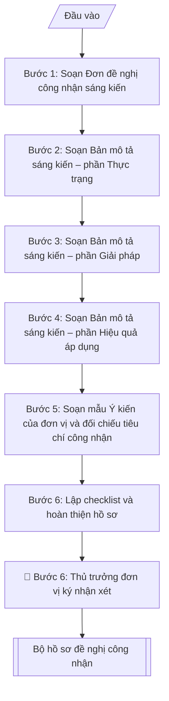

# Hồ sơ đề nghị công nhận sáng kiến kinh nghiệm

## Định dạng và file đầu ra

Định dạng đầu ra có thể chọn theo sản phẩm/yêu cầu: .docx, .pdf. Đọc mục “Định dạng bổ sung” trong quy cách đầu ra trước khi chọn.

**Phải tạo file thực tế để tải xuống, không chỉ trả nội dung trong chat.** Định dạng mặc định của skill: **.docx**. Nếu có bảng số liệu nghiệp vụ yêu cầu file bảng tính riêng, tạo thêm Excel theo yêu cầu; không tự tạo file kiểm tra. Không chờ người dùng yêu cầu xuất file lần nữa. Ưu tiên định dạng người dùng chỉ định; đọc quy tắc xuất file tại references/quy-cach-dau-ra.md.

## Quy cách đầu ra và thông tin thiếu
Đọc [quy cách và cấu trúc sản phẩm](references/quy-cach-dau-ra.md) trước khi soạn/xuất. File giao chỉ gồm sản phẩm nghiệp vụ được yêu cầu; kiểm tra nội bộ không xuất kèm. Thiếu thông tin thì giữ nguyên trường/mục và chỗ điền theo mẫu gốc (dòng dấu chấm, dấu gạch hoặc ô trống); không tự điền dữ liệu mẫu, số 0, mã chờ xác minh hay dòng chờ ký. Mẫu chuyên ngành còn áp dụng được ưu tiên về cấu trúc, mã biểu và người ký. Bản đầy đủ: [quy tắc chung](references/quy-tac-chung.md).

## Kiểm soát áp dụng và phê duyệt
Trước khi chạy, xác định `ngay_ap_dung`, `loai_hinh_truong`, `quy_che_noi_bo`, `nguon_du_lieu`, `nguoi_kiem_duyet`; chỉ hỏi thông tin liên quan nghiệp vụ, không dùng giá trị giả định thay dữ liệu bắt buộc. Đối chiếu căn cứ pháp lý với văn bản gốc, hiệu lực, điều khoản áp dụng và chuyển tiếp. Bản đầy đủ: [quy tắc chung](references/quy-tac-chung.md).

## Giới hạn và human gate
AI hỗ trợ chuẩn bị và đối chiếu; cán bộ phụ trách kiểm tra dữ liệu/căn cứ, người có thẩm quyền duyệt và ký. Không đánh dấu đã ký, đã duyệt, đã công bố khi chưa có chứng cứ. Dữ liệu sinh viên, sức khỏe, nhân sự, tài chính chỉ dùng theo mục đích và phân quyền, che thông tin định danh khi dùng ví dụ (Luật 91/2025/QH15, hiệu lực 01/01/2026); không tải dữ liệu lên dịch vụ ngoài khi chưa có quyền. Bản đầy đủ: [quy tắc chung](references/quy-tac-chung.md).

## Khi nào dùng
Khi cán bộ, giảng viên, nhân viên trường đại học đăng ký công nhận sáng kiến kinh nghiệm:
soạn đơn đề nghị, bản mô tả sáng kiến, lấy ý kiến đơn vị, chuẩn bị hồ sơ nộp Hội đồng
sáng kiến cấp trường (hoặc cấp trên).

## Đầu vào (Input)

| Trường | Mô tả | Bắt buộc |
|---|---|---|
| `ten_sang_kien` | Tên sáng kiến kinh nghiệm | Có |
| `tac_gia` | Họ tên, chức danh, đơn vị công tác của tác giả (đồng tác giả nếu có) | Có |
| `linh_vuc` | Lĩnh vực áp dụng (đào tạo, quản lý, NCKH, phục vụ...) | Có |
| `thuc_trang` | Thực trạng vấn đề trước khi có sáng kiến: hạn chế, khó khăn, số liệu minh họa | Có |
| `giai_phap` | Nội dung giải pháp: cách làm mới, các bước triển khai | Có |
| `thoi_gian_ap_dung` | Thời gian và phạm vi đã áp dụng thử (từ–đến, đơn vị áp dụng) | Có |
| `hieu_qua` | Hiệu quả áp dụng: số liệu so sánh trước–sau, lợi ích kinh tế/xã hội (nếu có) | Có |
| `cap_cong_nhan` | Cấp Trường / cấp Bộ, ngành | Có |
| `y_kien_don_vi` | Ý kiến nhận xét, đánh giá của thủ trưởng đơn vị | Không (soạn mẫu để xin ký) |

## Quy trình

**Bước 1. Soạn Đơn đề nghị công nhận sáng kiến**
- Làm gì: điền họ tên, chức danh, đơn vị từ `tac_gia`; ghi `ten_sang_kien`, `linh_vuc`, `thoi_gian_ap_dung`, `cap_cong_nhan`; viết lời cam kết: sáng kiến do tác giả nghiên cứu, triển khai, chưa được công nhận ở cấp đăng ký, nội dung trung thực; để trống chỗ ký, ghi rõ họ tên và ngày tháng.
- Dùng input: `tac_gia`, `ten_sang_kien`, `linh_vuc`, `thoi_gian_ap_dung`, `cap_cong_nhan`.
- Vai trò: Tác giả sáng kiến · AI hỗ trợ: soạn dự thảo đơn từ thông tin tác giả và lời cam kết · ⏱ ~15–20 phút (ước tính)
- Lưu ý nghiệp vụ: cam kết "chưa được công nhận ở cấp đăng ký" là điều kiện bắt buộc — sáng kiến đã được công nhận ở cùng cấp thì không đăng ký lại; có đồng tác giả thì tất cả cùng ký đơn.
- → Kết quả bước: dự thảo Đơn đề nghị công nhận sáng kiến.

**Bước 2. Soạn Bản mô tả sáng kiến – phần Thực trạng**
- Làm gì: từ `thuc_trang` viết phần I: mô tả vấn đề tồn tại trước khi có sáng kiến, nguyên nhân, hậu quả, kèm số liệu minh họa cụ thể.
- Dùng input: `thuc_trang`.
- Vai trò: Tác giả sáng kiến · AI hỗ trợ: viết phần I có minh họa cụ thể · ⏱ ~20–30 phút (ước tính)
- Lưu ý nghiệp vụ: thực trạng càng cụ thể (số liệu, thời gian, phạm vi) thì phần hiệu quả sau này càng dễ chứng minh — tránh mô tả chung chung kiểu "chất lượng chưa cao".
- → Kết quả bước: dự thảo phần I – Thực trạng.

**Bước 3. Soạn Bản mô tả sáng kiến – phần Giải pháp**
- Làm gì: từ `giai_phap` viết phần II: nội dung đổi mới, điểm mới so với cách làm cũ, các bước triển khai cụ thể theo trình tự thực hiện.
- Dùng input: `giai_phap`.
- Vai trò: Tác giả sáng kiến · AI hỗ trợ: viết phần II theo trình tự triển khai · ⏱ ~30–45 phút (ước tính)
- Lưu ý nghiệp vụ: phải chỉ rõ "tính mới" — cái gì khác so với cách làm cũ, vì đây là tiêu chí đầu tiên hội đồng chấm; các bước triển khai phải đủ chi tiết để đơn vị khác có thể làm theo (căn cứ đánh giá khả năng nhân rộng).
- → Kết quả bước: dự thảo phần II – Giải pháp.

**Bước 4. Soạn Bản mô tả sáng kiến – phần Hiệu quả áp dụng**
- Làm gì: từ `hieu_qua` và `thoi_gian_ap_dung` viết phần III: kết quả đạt được với số liệu so sánh trước–sau (lấy các chỉ số ở bước 2 làm mốc so sánh), phạm vi đã áp dụng, khả năng nhân rộng.
- Dùng input: `hieu_qua`, `thoi_gian_ap_dung`, kết quả bước 2.
- Vai trò: Tác giả sáng kiến · AI hỗ trợ: lập bảng so sánh và viết phần III · ⏱ ~20–30 phút (ước tính)
- Lưu ý nghiệp vụ: số liệu trước–sau phải cùng đơn vị đo và cùng phương pháp đo thì so sánh mới có giá trị; hiệu quả nên có cả định lượng (%, số liệu) và định tính (phản hồi người dùng).
- → Kết quả bước: dự thảo phần III – Hiệu quả áp dụng (có số liệu so sánh trước–sau).

**Bước 5. Soạn mẫu Ý kiến của đơn vị và đối chiếu tiêu chí công nhận**
- Làm gì: soạn mẫu ý kiến từ `y_kien_don_vi` (hoặc soạn mới nếu chưa có): nhận xét về tính mới, tính hiệu quả, khả năng nhân rộng; đề nghị mức công nhận; để trống phần ký tên, đóng dấu của thủ trưởng đơn vị; đối chiếu 4 tiêu chí công nhận: có tính mới / đã được áp dụng thử / mang lại hiệu quả (có số liệu) / có khả năng áp dụng rộng rãi.
- Dùng input: `y_kien_don_vi`, `cap_cong_nhan`, kết quả bước 2–4.
- Vai trò: Thủ trưởng đơn vị · AI hỗ trợ: soạn mẫu ý kiến và đối chiếu 4 tiêu chí · ⏱ ~30 phút (ước tính, kể cả thời gian chờ ký)
- Lưu ý nghiệp vụ: thiếu 1 trong 4 tiêu chí thì hồ sơ chắc chắn bị loại — phát hiện sớm ở bước này để bổ sung (quay lại bước 2–4) thay vì nộp rồi bị trả về.
- → Kết quả bước: mẫu Ý kiến của đơn vị + bảng đối chiếu 4 tiêu chí công nhận (đạt/chưa đạt từng tiêu chí).

**Bước 6. Lập checklist và hoàn thiện hồ sơ**
- Làm gì: lập checklist: đơn đề nghị, bản mô tả (đủ 3 phần), ý kiến đơn vị, minh chứng kèm theo (số liệu, hình ảnh, văn bản áp dụng...); trình thủ trưởng đơn vị ký nhận xét; xuất bộ hồ sơ hoàn chỉnh file theo định dạng đầu ra của skill, sẵn sàng in/ký và nộp Hội đồng sáng kiến.
- Dùng input: kết quả bước 1–5.
- Vai trò: Tác giả sáng kiến · AI hỗ trợ: lập checklist hồ sơ · ⏱ ~30 phút (ước tính, kể cả thời gian chờ ký)
- Lưu ý nghiệp vụ: minh chứng kèm theo (bảng điểm, kết quả khảo sát, văn bản áp dụng) phải được đơn vị xác nhận — minh chứng không có xác nhận dễ bị nghi ngờ tính xác thực.
- → Kết quả bước: bộ hồ sơ đề nghị công nhận sáng kiến hoàn chỉnh.

## Luồng quy trình (Workflow)

## Đầu ra

File nghiệp vụ thực tế theo định dạng mặc định ở đầu skill hoặc định dạng người dùng yêu cầu, kèm liên kết tải trong phản hồi cuối.

Sản phẩm nghiệp vụ hoàn chỉnh theo [quy cách và cấu trúc](references/quy-cach-dau-ra.md), giữ các trường chưa có dữ liệu ở trạng thái trống. Không xuất kèm checklist/phụ lục kiểm tra đầu ra.

## Kiểm tra nội bộ trước khi giao

- [ ] Đủ cấu trúc 3 văn bản theo chuẩn: Đơn đề nghị 6 phần (Quốc hiệu – Tiêu ngữ → tiêu đề → thông tin tác giả → tên/lĩnh vực/thời gian/cấp công nhận → cam kết → chữ ký) + Bản mô tả (tiêu đề → phần I, II, III) + Ý kiến đơn vị 4 phần
- [ ] Nội dung trong output khớp Input: tên sáng kiến, tác giả, lĩnh vực, thời gian áp dụng = `ten_sang_kien`, `tac_gia`, `linh_vuc`, `thoi_gian_ap_dung`
- [ ] Không bịa đặt số liệu so sánh trước–sau, minh chứng hiệu quả, ý kiến đánh giá
- [ ] Số liệu trước–sau cùng đơn vị đo và cùng phương pháp đo; bản mô tả có số liệu cụ thể, không nhận định chung chung
- [ ] Căn cứ pháp lý đầy đủ, còn hiệu lực (Nghị định 13/2012/NĐ-CP, văn bản hướng dẫn công nhận sáng kiến của trường)
- [ ] Đáp ứng đủ 4 tiêu chí công nhận: có tính mới / đã được áp dụng thử / mang lại hiệu quả có số liệu / có khả năng áp dụng rộng rãi
- [ ] Phần Giải pháp nêu rõ "tính mới" so với cách làm cũ và các bước đủ chi tiết để đơn vị khác làm theo; minh chứng kèm theo được đơn vị xác nhận
- [ ] Lời cam kết hợp lệ: sáng kiến do tác giả thực hiện, chưa được công nhận ở cấp đăng ký, nội dung trung thực; đồng tác giả (nếu có) cùng ký đơn
- [ ] Đã qua Human gate: tác giả ký đơn; thủ trưởng đơn vị ký nhận xét, đóng dấu

Tiêu chí đạt = tất cả các ô được đánh dấu.

## Căn cứ & lưu ý
- Nghị định 13/2012/NĐ-CP về sáng kiến và các văn bản hướng dẫn công nhận
  sáng kiến của Trường Đại học A.
- Bản mô tả phải có số liệu so sánh trước–sau cụ thể; tránh nhận định chung chung.
- Sáng kiến đã được công nhận ở cấp đăng ký thì không đăng ký lại cùng cấp.
- Không dùng tên thật của trường/cá nhân khi mô phỏng.

## Quản trị phiên bản
- Phiên bản gói `1.3.2` (cập nhật 2026-10-10); hồ sơ đầy đủ tại [references/version.json](references/version.json).
- Người phê duyệt nghiệp vụ: **chưa chỉ định**. Trạng thái: dự thảo nghiệp vụ; kiểm tra pháp lý trước thực thi. Ngày cập nhật không đồng nghĩa mọi văn bản đã được rà soát toàn văn.
- Giấy phép theo LICENSE của kho (bản quyền CES Global). Lịch sử thay đổi: CHANGELOG.md.
