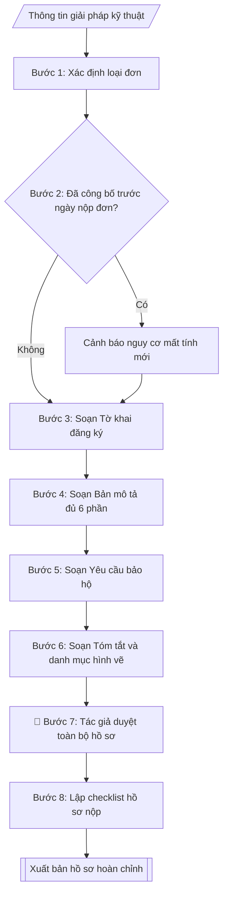

# Skill: Hồ sơ đăng ký sáng chế / giải pháp hữu ích

## Khi nào dùng
Khi giảng viên, nghiên cứu sinh, nhóm nghiên cứu của trường có kết quả nghiên cứu
(thiết bị, quy trình, phương pháp, sản phẩm) muốn đăng ký bảo hộ sáng chế hoặc
giải pháp hữu ích tại Cục Sở hữu trí tuệ: soạn tờ khai, bản mô tả, yêu cầu bảo hộ,
hình vẽ và kiểm tra khả năng đáp ứng điều kiện bảo hộ.

## Đầu vào (Input)

| Trường | Mô tả | Bắt buộc |
|---|---|---|
| `loai_don` | Sáng chế / Giải pháp hữu ích | Có |
| `ten_giai_phap` | Tên giải pháp kỹ thuật cần bảo hộ | Có |
| `tac_gia` | Họ tên, địa chỉ tác giả sáng chế | Có |
| `chu_don` | Tổ chức đứng đơn (Trường Đại học A) + địa chỉ | Có |
| `linh_vuc_ky_thuat` | Lĩnh vực kỹ thuật của giải pháp | Có |
| `tinh_trang_ky_thuat` | Tình trạng kỹ thuật đã biết (các giải pháp tương tự, hạn chế của chúng) | Có |
| `ban_chat_giai_phap` | Bản chất kỹ thuật: cấu tạo/nguyên lý/quy trình, điểm mới so với kỹ thuật đã biết | Có |
| `hieu_qua` | Hiệu quả kỹ thuật, kinh tế – xã hội có thể đạt được | Có |
| `vi_du_thuc_hien` | Ví dụ thực hiện tốt nhất (cấu tạo cụ thể, thông số, cách vận hành) | Có |
| `hinh_ve` | Mô tả các hình vẽ minh họa (đánh số hình, chú thích chi tiết từng hình) | Không |
| `cong_bo_truoc` | Các lần công bố/bộc lộ giải pháp trước ngày nộp đơn (bài báo, hội thảo...) | Không |

## Quy trình

**Bước 1. Xác định loại đơn đăng ký**
- Làm gì: căn cứ `loai_don` và tính chất giải pháp để xác nhận lựa chọn: Sáng chế (đòi hỏi tính mới + trình độ sáng tạo + khả năng áp dụng công nghiệp) hay Giải pháp hữu ích (đòi hỏi tính mới + khả năng áp dụng công nghiệp, không đòi hỏi trình độ sáng tạo cao như sáng chế); tư vấn lại cho tác giả nếu loại đơn đã chọn không phù hợp với trình độ sáng tạo của giải pháp.
- Dùng input: `loai_don`, `ban_chat_giai_phap`.
- Vai trò: Tác giả · AI hỗ trợ: phân tích đối chiếu · ⏱ ~30–45 phút (ước tính)
- Lưu ý nghiệp vụ: chọn sai loại đơn (VD: nộp sáng chế cho một cải tiến nhỏ) dẫn đến bị từ chối sau thẩm định nội dung, mất thời gian và lệ phí; giải pháp hữu ích có thời gian thẩm định nhanh hơn, phù hợp cải tiến kỹ thuật.
- → Kết quả bước: loại đơn đã xác nhận + căn cứ lựa chọn.

**Bước 2. Kiểm tra tính mới và rà soát công bố trước**
- Làm gì: từ `cong_bo_truoc` liệt kê mọi lần giải pháp bị bộc lộ trước ngày nộp đơn (bài báo, hội thảo, triển lãm, mạng xã hội, bảo vệ luận văn công khai...) kèm ngày cụ thể; đánh giá nguy cơ mất tính mới; nếu đã công bố thì cảnh báo và kiểm tra có thuộc trường hợp ngoại lệ được miễn trừ mất tính mới theo Luật SHTT không.
- Dùng input: `cong_bo_truoc`, `ten_giai_phap`.
- Vai trò: Tác giả · AI hỗ trợ: đánh giá nguy cơ từ danh sách công bố do tác giả cung cấp · ⏱ ~45–60 phút (ước tính)
- Lưu ý nghiệp vụ: tính mới là điều kiện sống còn — mọi công bố trước ngày nộp đơn đều có thể phá hủy tính mới; nguyên tắc vàng: nộp đơn trước khi công bố kết quả nghiên cứu.
- → Kết quả bước: báo cáo rà soát tính mới (danh sách công bố + đánh giá nguy cơ).

**Bước 3. Soạn Tờ khai đăng ký**
- Làm gì: điền thông tin `chu_don` (tên tổ chức, địa chỉ), `tac_gia` (họ tên, địa chỉ), `ten_giai_phap`, `loai_don`; liệt kê các tài liệu kèm theo; kê khai phí/lệ phí phải nộp.
- Dùng input: `chu_don`, `tac_gia`, `ten_giai_phap`, `loai_don`.
- Vai trò: Tác giả · AI hỗ trợ: soạn dự thảo tờ khai · ⏱ ~20–30 phút (ước tính)
- Lưu ý nghiệp vụ: chủ đơn là tổ chức (Trường) thì tờ khai phải có chữ ký người đại diện hợp pháp + đóng dấu; tác giả là cá nhân — ghi đúng họ tên theo giấy tờ tùy thân vì liên quan đến quyền nhân thân của tác giả.
- → Kết quả bước: dự thảo Tờ khai đăng ký (điền sẵn).

**Bước 4. Soạn Bản mô tả giải pháp kỹ thuật**
- Làm gì: viết đủ 6 phần theo đúng thứ tự: (1) tên giải pháp (`ten_giai_phap`); (2) lĩnh vực kỹ thuật (`linh_vuc_ky_thuat`); (3) tình trạng kỹ thuật đã biết (`tinh_trang_ky_thuat` — các giải pháp tương tự và hạn chế của chúng); (4) bản chất kỹ thuật (`ban_chat_giai_phap` — cấu tạo/nguyên lý/quy trình, nêu rõ điểm mới so với kỹ thuật đã biết); (5) ví dụ thực hiện tốt nhất (`vi_du_thuc_hien` — cấu tạo cụ thể, thông số, cách vận hành); (6) hiệu quả đạt được (`hieu_qua`).
- Dùng input: `ten_giai_phap`, `linh_vuc_ky_thuat`, `tinh_trang_ky_thuat`, `ban_chat_giai_phap`, `vi_du_thuc_hien`, `hieu_qua`.
- Vai trò: Tác giả · AI hỗ trợ: soạn dự thảo 6 phần · ⏱ ~1–2 giờ (ước tính)
- Lưu ý nghiệp vụ: phần (4) là linh hồn của bản mô tả — điểm mới phải được nêu rõ ràng, không để thẩm định viên phải "đoán"; thuật ngữ kỹ thuật phải nhất quán trong toàn bộ hồ sơ.
- → Kết quả bước: dự thảo Bản mô tả (đủ 6 phần theo thứ tự chuẩn).

**Bước 5. Soạn Yêu cầu bảo hộ**
- Làm gì: viết các điểm yêu cầu bảo hộ: 01 điểm độc lập (nêu đầy đủ các dấu hiệu kỹ thuật cơ bản tạo nên phạm vi bảo hộ) + các điểm phụ thuộc (chi tiết hóa, bổ sung dấu hiệu cho điểm độc lập); kiểm tra mỗi dấu hiệu trong yêu cầu bảo hộ đều đã được bộc lộ trong bản mô tả ở bước 4.
- Dùng input: kết quả bước 4 (`ban_chat_giai_phap`, `vi_du_thuc_hien`).
- Vai trò: Tác giả · AI hỗ trợ: soạn dự thảo điểm bảo hộ · ⏱ ~1–2 giờ (ước tính)
- Lưu ý nghiệp vụ: phạm vi bảo hộ càng rõ ràng càng dễ bảo vệ quyền khi tranh chấp; yêu cầu bảo hộ viết dấu hiệu không có trong bản mô tả sẽ bị từ chối — đối chiếu chéo với bước 4 trước khi chốt.
- → Kết quả bước: dự thảo Yêu cầu bảo hộ (điểm độc lập + điểm phụ thuộc, đánh số).

**Bước 6. Soạn Bản tóm tắt và danh mục hình vẽ**
- Làm gì: viết bản tóm tắt nêu bản chất giải pháp + hiệu quả chính, không quá 150 từ (đếm từ trước khi chốt); từ `hinh_ve` lập danh mục hình vẽ: đánh số hình, chú thích chi tiết từng hình; kiểm tra ký hiệu trên hình vẽ thống nhất với ký hiệu trong bản mô tả (bước 4).
- Dùng input: `hinh_ve`, kết quả bước 4.
- Vai trò: Tác giả · AI hỗ trợ: soạn dự thảo tóm tắt và danh mục hình vẽ · ⏱ ~30–45 phút (ước tính)
- Lưu ý nghiệp vụ: tóm tắt vượt 150 từ là lỗi hình thức bị yêu cầu sửa đổi; ký hiệu hình vẽ không thống nhất với bản mô tả là lỗi phổ biến gây kéo dài thời gian thẩm định.
- → Kết quả bước: dự thảo Bản tóm tắt (≤150 từ) + danh mục hình vẽ.

**Bước 7. Tác giả duyệt toàn bộ hồ sơ**
- Làm gì: trình tác giả đọc và duyệt toàn bộ: tờ khai, bản mô tả, yêu cầu bảo hộ, tóm tắt, hình vẽ; kiểm tra lần cuối tính nhất quán thuật ngữ, ký hiệu giữa các tài liệu; sửa theo ý kiến của tác giả.
- Dùng input: kết quả bước 3–6, `tac_gia`.
- Vai trò: Tác giả · AI hỗ trợ: chỉnh sửa theo ý kiến · ⏱ ~1–2 giờ (ước tính, phụ thuộc tác giả)
- Lưu ý nghiệp vụ: tác giả là người hiểu rõ nhất về kỹ thuật — đây là chốt chặn cuối cùng phát hiện sai sót kỹ thuật trước khi nộp; sau khi nộp đơn, việc sửa đổi bị hạn chế.
- → Kết quả bước: bộ hồ sơ đã được tác giả duyệt.

**Bước 8. Lập checklist và xuất bản**
- Làm gì: lập checklist hồ sơ nộp: tờ khai (02 bản), bản mô tả, yêu cầu bảo hộ, tóm tắt, hình vẽ, chứng từ nộp phí/lệ phí, giấy ủy quyền (nếu nộp qua đại diện); xuất bộ hồ sơ hoàn chỉnh ở dạng markdown, sẵn sàng in/ký và nộp Cục Sở hữu trí tuệ.
- Dùng input: kết quả bước 7.
- Vai trò: Tác giả · AI hỗ trợ: lập checklist và xuất bộ hồ sơ · ⏱ ~20–30 phút (ước tính)
- Lưu ý nghiệp vụ: nộp 02 bản tờ khai theo quy định; giữ lại 01 bộ sao có dấu "đã nhận" của Cục làm bằng chứng ngày nộp đơn (ngày nộp đơn quyết định việc đánh giá tính mới).
- → Kết quả bước: bộ hồ sơ đăng ký hoàn chỉnh + checklist hồ sơ nộp.

## Luồng quy trình (Workflow)


## Đầu ra (Output)
- Tờ khai đăng ký sáng chế/giải pháp hữu ích (mẫu điền sẵn).
- Bản mô tả giải pháp kỹ thuật (đủ 6 phần chuẩn).
- Yêu cầu bảo hộ (điểm độc lập + điểm phụ thuộc).
- Bản tóm tắt + danh mục hình vẽ.
- Checklist hồ sơ + cảnh báo rủi ro về tính mới (nếu có công bố trước).

**Cấu trúc output chuẩn:** khung cố định của bộ hồ sơ đăng ký (4 tài liệu), các phần bắt buộc theo đúng thứ tự xuất hiện:
- Tài liệu 1 – Tờ khai đăng ký:
  1. Tiêu đề "TỜ KHAI ĐĂNG KÝ SÁNG CHẾ" hoặc "TỜ KHAI ĐĂNG KÝ GIẢI PHÁP HỮU ÍCH"
  2. Thông tin chủ đơn (tên tổ chức, địa chỉ)
  3. Thông tin tác giả (họ tên, địa chỉ)
  4. Tên giải pháp + loại đơn đăng ký
  5. Danh mục tài liệu kèm theo
  6. Kê khai phí, lệ phí + chữ ký chủ đơn (ký, đóng dấu nếu là tổ chức)
- Tài liệu 2 – Bản mô tả (đủ 6 phần theo đúng thứ tự):
  1. Tên giải pháp
  2. Lĩnh vực kỹ thuật
  3. Tình trạng kỹ thuật đã biết
  4. Bản chất kỹ thuật (nêu rõ điểm mới so với kỹ thuật đã biết)
  5. Ví dụ thực hiện tốt nhất
  6. Hiệu quả đạt được
- Tài liệu 3 – Yêu cầu bảo hộ: các điểm yêu cầu đánh số (01 điểm độc lập + các điểm phụ thuộc)
- Tài liệu 4 – Bản tóm tắt (không quá 150 từ) + danh mục hình vẽ (đánh số hình, chú thích chi tiết, ký hiệu thống nhất với bản mô tả)

## Checklist nghiệm thu
- [ ] Đủ 4 tài liệu theo "Cấu trúc output chuẩn": tờ khai, bản mô tả, yêu cầu bảo hộ, tóm tắt + danh mục hình vẽ.
- [ ] Nội dung các tài liệu khớp với Input (tên giải pháp, tác giả, chủ đơn, số liệu kỹ thuật).
- [ ] Không bịa đặt số liệu, thông số kỹ thuật, minh chứng, trích dẫn.
- [ ] Bản mô tả đủ 6 phần theo đúng thứ tự chuẩn; bản tóm tắt không quá 150 từ.
- [ ] Căn cứ pháp lý đầy đủ, còn hiệu lực: Luật SHTT (sửa đổi 2009, 2019, 2022), Nghị định 65/2023/NĐ-CP.
- [ ] Đã qua Human gate: tác giả đã đọc và duyệt toàn bộ hồ sơ.
- [ ] Điểm yêu cầu bảo hộ chỉ nêu dấu hiệu đã được bộc lộ trong bản mô tả.
- [ ] Ký hiệu hình vẽ thống nhất với bản mô tả; tờ khai kê đủ 02 bản + chứng từ phí/lệ phí.
- [ ] Đã rà soát tính mới: cảnh báo công bố trước ngày nộp đơn (nếu có) đã được ghi rõ.

Tiêu chí đạt = tất cả các ô được đánh dấu.

## Ví dụ mô phỏng (dữ liệu giả lập)

> Tất cả tên trường, cá nhân, giải pháp, số liệu dưới đây đều là **giả lập**,
> không liên quan tổ chức/cá nhân có thật.

### Input mẫu

| Trường | Giá trị |
|---|---|
| `loai_don` | Giải pháp hữu ích |
| `ten_giai_phap` | Thiết bị sấy nông sản bằng năng lượng mặt trời kết hợp đối lưu cưỡng bức |
| `tac_gia` | PGS.TS. Trần Văn B; ThS. Đỗ Thị D |
| `chu_don` | Trường Đại học A, số 123 đường B, thành phố C |
| `linh_vuc_ky_thuat` | Thiết bị sấy nông sản, năng lượng tái tạo |
| `tinh_trang_ky_thuat` | Các thiết bị sấy năng lượng mặt trời hiện có phụ thuộc hoàn toàn vào nắng, thời gian sấy kéo dài 2–3 ngày, chất lượng không đồng đều khi trời âm u |
| `ban_chat_giai_phap` | Bổ sung quạt đối lưu cưỡng bức dùng điện mặt trời và van điều tiết ẩm tự động; điểm mới: cụm van điều tiết độ ẩm hoạt động độc lập với cường độ nắng |
| `hieu_qua` | Rút ngắn thời gian sấy còn 8–10 giờ, độ ẩm sản phẩm đồng đều ±2%, tiết kiệm 40% diện tích phơi so với phơi nắng truyền thống |
| `vi_du_thuc_hien` | Buồng sấy 2m×1,5m×1,8m, 4 khay inox, quạt 12V–30W, tấm pin 150W, van điều tiết ẩm theo ngưỡng 65% |
| `hinh_ve` | Hình 1: sơ đồ tổng thể thiết bị; Hình 2: cụm van điều tiết ẩm; Hình 3: sơ đồ luồng khí |
| `cong_bo_truoc` | Chưa công bố ở bất kỳ hình thức nào |

### Output mẫu

```
TỜ KHAI ĐĂNG KÝ GIẢI PHÁP HỮU ÍCH
Chủ đơn: Trường Đại học A
Địa chỉ: Số 123 đường B, thành phố C
Tác giả: PGS.TS. Trần Văn B; ThS. Đỗ Thị D
Tên giải pháp: Thiết bị sấy nông sản bằng năng lượng mặt trời
kết hợp đối lưu cưỡng bức
Tài liệu kèm theo: Bản mô tả (05 trang); Yêu cầu bảo hộ (02 trang);
Bản tóm tắt; Hình vẽ (03 hình); Chứng từ nộp phí, lệ phí.

BẢN MÔ TẢ
1. Tên giải pháp: Thiết bị sấy nông sản bằng năng lượng mặt trời
kết hợp đối lưu cưỡng bức.
2. Lĩnh vực kỹ thuật: sáng chế đề cập đến thiết bị sấy nông sản sử
dụng năng lượng tái tạo.
3. Tình trạng kỹ thuật: các thiết bị sấy năng lượng mặt trời hiện có
phụ thuộc hoàn toàn vào nắng; thời gian sấy kéo dài 2–3 ngày; chất lượng
không đồng đều khi trời âm u.
4. Bản chất kỹ thuật: giải pháp bổ sung quạt đối lưu cưỡng bức dùng điện
mặt trời và van điều tiết ẩm tự động. Điểm mới: cụm van điều tiết độ ẩm
hoạt động độc lập với cường độ nắng, duy trì độ ẩm buồng sấy dưới ngưỡng
65% trong mọi điều kiện thời tiết.
5. Ví dụ thực hiện tốt nhất: buồng sấy 2m×1,5m×1,8m, 4 khay inox, quạt
12V–30W, tấm pin năng lượng mặt trời 150W, van điều tiết ẩm theo ngưỡng 65%.
6. Hiệu quả: rút ngắn thời gian sấy còn 8–10 giờ; độ ẩm sản phẩm đồng đều
±2%; tiết kiệm 40% diện tích so với phơi nắng truyền thống.

YÊU CẦU BẢO HỘ
1. Thiết bị sấy nông sản bằng năng lượng mặt trời kết hợp đối lưu cưỡng
bức, bao gồm buồng sấy, quạt đối lưu dùng điện mặt trời và cụm van điều
tiết ẩm tự động, trong đó cụm van hoạt động độc lập với cường độ nắng.
2. Thiết bị theo điểm 1, trong đó van điều tiết duy trì độ ẩm buồng sấy
dưới ngưỡng 65%.

BẢN TÓM TẮT (112 từ)
Thiết bị sấy nông sản bằng năng lượng mặt trời kết hợp đối lưu cưỡng bức
gồm buồng sấy, quạt đối lưu dùng điện mặt trời và cụm van điều tiết ẩm tự
động hoạt động độc lập với cường độ nắng. Thiết bị rút ngắn thời gian sấy
còn 8–10 giờ, độ ẩm sản phẩm đồng đều ±2%, tiết kiệm 40% diện tích so với
phơi nắng truyền thống.

DANH MỤC HÌNH VẼ
- Hình 1: Sơ đồ tổng thể thiết bị (1-buồng sấy, 2-khay, 3-quạt, 4-tấm pin)
- Hình 2: Cụm van điều tiết ẩm (5-van, 6-cảm biến ẩm)
- Hình 3: Sơ đồ luồng khí đối lưu trong buồng sấy
```

### Checklist hồ sơ (output kèm theo)
- [x] Tờ khai đăng ký (02 bản, có chữ ký chủ đơn)
- [x] Bản mô tả (đủ 6 phần chuẩn)
- [x] Yêu cầu bảo hộ (01 điểm độc lập + 01 điểm phụ thuộc)
- [x] Bản tóm tắt (112 từ, dưới 150 từ)
- [x] Hình vẽ (03 hình, ký hiệu thống nhất với bản mô tả)
- [x] Chứng từ nộp phí, lệ phí
- [x] Rà soát tính mới: chưa công bố dưới mọi hình thức — ĐẠT

## Căn cứ & lưu ý
- Luật Sở hữu trí tuệ 2005 (sửa đổi, bổ sung 2009, 2019, 2022) và Nghị định
  65/2023/NĐ-CP quy định chi tiết về sở hữu công nghiệp.
- **Tính mới là điều kiện sống còn**: mọi công bố (bài báo, báo cáo hội thảo,
  đăng mạng xã hội) trước ngày nộp đơn đều có thể phá hủy tính mới — nộp đơn
  trước khi công bố kết quả nghiên cứu.
- Giải pháp hữu ích: thời gian thẩm định nhanh hơn sáng chế, phù hợp cải tiến
  kỹ thuật có tính mới nhưng trình độ sáng tạo chưa đạt mức sáng chế.
- Không dùng tên thật của trường/cá nhân khi mô phỏng.
