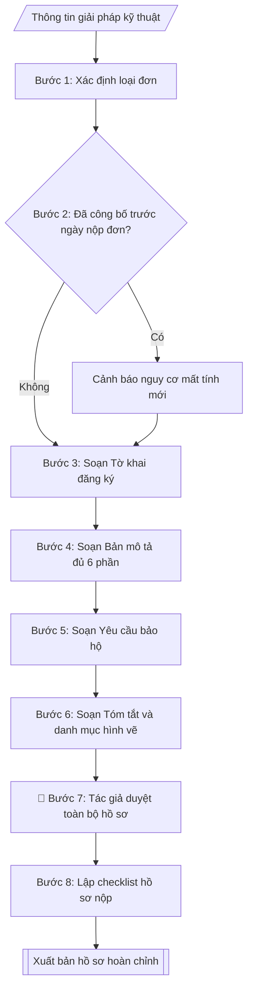

# Hồ sơ đăng ký sáng chế / giải pháp hữu ích

## Định dạng và file đầu ra

Định dạng đầu ra có thể chọn theo sản phẩm/yêu cầu: .docx, .pdf. Đọc mục “Định dạng bổ sung” trong quy cách đầu ra trước khi chọn.

**Phải tạo file thực tế để tải xuống, không chỉ trả nội dung trong chat.** Định dạng mặc định của skill: **.docx**. Nếu có bảng số liệu nghiệp vụ yêu cầu file bảng tính riêng, tạo thêm Excel theo yêu cầu; không tự tạo file kiểm tra. Không chờ người dùng yêu cầu xuất file lần nữa. Ưu tiên định dạng người dùng chỉ định; đọc quy tắc xuất file tại references/quy-cach-dau-ra.md.

## Quy cách đầu ra và thông tin thiếu
Khi dựng file Word/Excel, áp dụng mục “Thể thức và bảng biểu khi dựng file” trong quy cách đầu ra (cỡ chữ từng thành phần, bảng nhiều trang, số trang, phụ lục). Đọc [quy cách và cấu trúc sản phẩm](references/quy-cach-dau-ra.md) trước khi soạn/xuất. File giao chỉ gồm sản phẩm nghiệp vụ được yêu cầu; kiểm tra nội bộ không xuất kèm. Thiếu thông tin thì giữ nguyên trường/mục và chỗ điền theo mẫu gốc (dòng dấu chấm, dấu gạch hoặc ô trống); không tự điền dữ liệu mẫu, số 0, mã chờ xác minh hay dòng chờ ký. Mẫu chuyên ngành còn áp dụng được ưu tiên về cấu trúc, mã biểu và người ký. Bản đầy đủ: [quy tắc chung](references/quy-tac-chung.md).

## Kiểm soát áp dụng và phê duyệt
Trước khi chạy, xác định `ngay_ap_dung`, `loai_hinh_truong`, `quy_che_noi_bo`, `nguon_du_lieu`, `nguoi_kiem_duyet`; chỉ hỏi thông tin liên quan nghiệp vụ, không dùng giá trị giả định thay dữ liệu bắt buộc. Đối chiếu căn cứ pháp lý với văn bản gốc, hiệu lực, điều khoản áp dụng và chuyển tiếp. Bản đầy đủ: [quy tắc chung](references/quy-tac-chung.md).

## Giới hạn và human gate
AI hỗ trợ chuẩn bị và đối chiếu; cán bộ phụ trách kiểm tra dữ liệu/căn cứ, người có thẩm quyền duyệt và ký. Không đánh dấu đã ký, đã duyệt, đã công bố khi chưa có chứng cứ. Dữ liệu sinh viên, sức khỏe, nhân sự, tài chính chỉ dùng theo mục đích và phân quyền, che thông tin định danh khi dùng ví dụ (Luật 91/2025/QH15, hiệu lực 01/01/2026); không tải dữ liệu lên dịch vụ ngoài khi chưa có quyền. Bản đầy đủ: [quy tắc chung](references/quy-tac-chung.md).

## Khi nào dùng
Khi giảng viên, nghiên cứu sinh, nhóm nghiên cứu của trường có kết quả nghiên cứu
(thiết bị, quy trình, phương pháp, sản phẩm) muốn đăng ký bảo hộ sáng chế hoặc
giải pháp hữu ích tại Cục Sở hữu trí tuệ: soạn tờ khai, bản mô tả, yêu cầu bảo hộ,
hình vẽ và kiểm tra khả năng đáp ứng điều kiện bảo hộ.

## Đầu vào (Input)

| Trường | Mô tả | Bắt buộc |
|---|---|---|
| `loai_don` | Sáng chế / Giải pháp hữu ích | Có |
| `ten_giai_phap` | Tên giải pháp kỹ thuật cần bảo hộ | Có |
| `tac_gia` | Họ tên, địa chỉ tác giả sáng chế | Có |
| `chu_don` | Tổ chức đứng đơn (Trường Đại học A) + địa chỉ | Có |
| `linh_vuc_ky_thuat` | Lĩnh vực kỹ thuật của giải pháp | Có |
| `tinh_trang_ky_thuat` | Tình trạng kỹ thuật đã biết (các giải pháp tương tự, hạn chế của chúng) | Có |
| `ban_chat_giai_phap` | Bản chất kỹ thuật: cấu tạo/nguyên lý/quy trình, điểm mới so với kỹ thuật đã biết | Có |
| `hieu_qua` | Hiệu quả kỹ thuật, kinh tế – xã hội có thể đạt được | Có |
| `vi_du_thuc_hien` | Ví dụ thực hiện tốt nhất (cấu tạo cụ thể, thông số, cách vận hành) | Có |
| `hinh_ve` | Mô tả các hình vẽ minh họa (đánh số hình, chú thích chi tiết từng hình) | Không |
| `cong_bo_truoc` | Các lần công bố/bộc lộ giải pháp trước ngày nộp đơn (bài báo, hội thảo...) | Không |

## Quy trình

**Bước 1. Xác định loại đơn đăng ký**
- Làm gì: căn cứ `loai_don` và tính chất giải pháp để xác nhận lựa chọn: Sáng chế (đòi hỏi tính mới + trình độ sáng tạo + khả năng áp dụng công nghiệp) hay Giải pháp hữu ích (đòi hỏi tính mới + khả năng áp dụng công nghiệp, không đòi hỏi trình độ sáng tạo cao như sáng chế); tư vấn lại cho tác giả nếu loại đơn đã chọn không phù hợp với trình độ sáng tạo của giải pháp.
- Dùng input: `loai_don`, `ban_chat_giai_phap`.
- Vai trò: Tác giả · AI hỗ trợ: phân tích đối chiếu · ⏱ ~30–45 phút (ước tính)
- Lưu ý nghiệp vụ: chọn sai loại đơn (VD: nộp sáng chế cho một cải tiến nhỏ) dẫn đến bị từ chối sau thẩm định nội dung, mất thời gian và lệ phí; giải pháp hữu ích có thời gian thẩm định nhanh hơn, phù hợp cải tiến kỹ thuật.
- → Kết quả bước: loại đơn đã xác nhận + căn cứ lựa chọn.

**Bước 2. Kiểm tra tính mới và rà soát công bố trước**
- Làm gì: từ `cong_bo_truoc` liệt kê mọi lần giải pháp bị bộc lộ trước ngày nộp đơn (bài báo, hội thảo, triển lãm, mạng xã hội, bảo vệ luận văn công khai...) kèm ngày cụ thể; đánh giá nguy cơ mất tính mới; nếu đã công bố thì cảnh báo và kiểm tra có thuộc trường hợp ngoại lệ được miễn trừ mất tính mới theo Luật SHTT không.
- Dùng input: `cong_bo_truoc`, `ten_giai_phap`.
- Vai trò: Tác giả · AI hỗ trợ: đánh giá nguy cơ từ danh sách công bố do tác giả cung cấp · ⏱ ~45–60 phút (ước tính)
- Lưu ý nghiệp vụ: tính mới là điều kiện sống còn — mọi công bố trước ngày nộp đơn đều có thể phá hủy tính mới; nguyên tắc vàng: nộp đơn trước khi công bố kết quả nghiên cứu.
- → Kết quả bước: báo cáo rà soát tính mới (danh sách công bố + đánh giá nguy cơ).

**Bước 3. Soạn Tờ khai đăng ký**
- Làm gì: điền thông tin `chu_don` (tên tổ chức, địa chỉ), `tac_gia` (họ tên, địa chỉ), `ten_giai_phap`, `loai_don`; liệt kê các tài liệu kèm theo; kê khai phí/lệ phí phải nộp.
- Dùng input: `chu_don`, `tac_gia`, `ten_giai_phap`, `loai_don`.
- Vai trò: Tác giả · AI hỗ trợ: soạn dự thảo tờ khai · ⏱ ~20–30 phút (ước tính)
- Lưu ý nghiệp vụ: chủ đơn là tổ chức (Trường) thì tờ khai phải có chữ ký người đại diện hợp pháp + đóng dấu; tác giả là cá nhân — ghi đúng họ tên theo giấy tờ tùy thân vì liên quan đến quyền nhân thân của tác giả.
- → Kết quả bước: dự thảo Tờ khai đăng ký (điền sẵn).

**Bước 4. Soạn Bản mô tả giải pháp kỹ thuật**
- Làm gì: viết đủ 6 phần theo đúng thứ tự: (1) tên giải pháp (`ten_giai_phap`); (2) lĩnh vực kỹ thuật (`linh_vuc_ky_thuat`); (3) tình trạng kỹ thuật đã biết (`tinh_trang_ky_thuat` — các giải pháp tương tự và hạn chế của chúng); (4) bản chất kỹ thuật (`ban_chat_giai_phap` — cấu tạo/nguyên lý/quy trình, nêu rõ điểm mới so với kỹ thuật đã biết); (5) ví dụ thực hiện tốt nhất (`vi_du_thuc_hien` — cấu tạo cụ thể, thông số, cách vận hành); (6) hiệu quả đạt được (`hieu_qua`).
- Dùng input: `ten_giai_phap`, `linh_vuc_ky_thuat`, `tinh_trang_ky_thuat`, `ban_chat_giai_phap`, `vi_du_thuc_hien`, `hieu_qua`.
- Vai trò: Tác giả · AI hỗ trợ: soạn dự thảo 6 phần · ⏱ ~1–2 giờ (ước tính)
- Lưu ý nghiệp vụ: phần (4) là linh hồn của bản mô tả — điểm mới phải được nêu rõ ràng, không để thẩm định viên phải "đoán"; thuật ngữ kỹ thuật phải nhất quán trong toàn bộ hồ sơ.
- → Kết quả bước: dự thảo Bản mô tả (đủ 6 phần theo thứ tự chuẩn).

**Bước 5. Soạn Yêu cầu bảo hộ**
- Làm gì: viết các điểm yêu cầu bảo hộ: 01 điểm độc lập (nêu đầy đủ các dấu hiệu kỹ thuật cơ bản tạo nên phạm vi bảo hộ) + các điểm phụ thuộc (chi tiết hóa, bổ sung dấu hiệu cho điểm độc lập); kiểm tra mỗi dấu hiệu trong yêu cầu bảo hộ đều đã được bộc lộ trong bản mô tả ở bước 4.
- Dùng input: kết quả bước 4 (`ban_chat_giai_phap`, `vi_du_thuc_hien`).
- Vai trò: Tác giả · AI hỗ trợ: soạn dự thảo điểm bảo hộ · ⏱ ~1–2 giờ (ước tính)
- Lưu ý nghiệp vụ: phạm vi bảo hộ càng rõ ràng càng dễ bảo vệ quyền khi tranh chấp; yêu cầu bảo hộ viết dấu hiệu không có trong bản mô tả sẽ bị từ chối — đối chiếu chéo với bước 4 trước khi chốt.
- → Kết quả bước: dự thảo Yêu cầu bảo hộ (điểm độc lập + điểm phụ thuộc, đánh số).

**Bước 6. Soạn Bản tóm tắt và danh mục hình vẽ**
- Làm gì: viết bản tóm tắt nêu bản chất giải pháp + hiệu quả chính, không quá 150 từ (đếm từ trước khi chốt); từ `hinh_ve` lập danh mục hình vẽ: đánh số hình, chú thích chi tiết từng hình; kiểm tra ký hiệu trên hình vẽ thống nhất với ký hiệu trong bản mô tả (bước 4).
- Dùng input: `hinh_ve`, kết quả bước 4.
- Vai trò: Tác giả · AI hỗ trợ: soạn dự thảo tóm tắt và danh mục hình vẽ · ⏱ ~30–45 phút (ước tính)
- Lưu ý nghiệp vụ: tóm tắt vượt 150 từ là lỗi hình thức bị yêu cầu sửa đổi; ký hiệu hình vẽ không thống nhất với bản mô tả là lỗi phổ biến gây kéo dài thời gian thẩm định.
- → Kết quả bước: dự thảo Bản tóm tắt (≤150 từ) + danh mục hình vẽ.

**Bước 7. Tác giả duyệt toàn bộ hồ sơ**
- Làm gì: trình tác giả đọc và duyệt toàn bộ: tờ khai, bản mô tả, yêu cầu bảo hộ, tóm tắt, hình vẽ; kiểm tra lần cuối tính nhất quán thuật ngữ, ký hiệu giữa các tài liệu; sửa theo ý kiến của tác giả.
- Dùng input: kết quả bước 3–6, `tac_gia`.
- Vai trò: Tác giả · AI hỗ trợ: chỉnh sửa theo ý kiến · ⏱ ~1–2 giờ (ước tính, phụ thuộc tác giả)
- Lưu ý nghiệp vụ: tác giả là người hiểu rõ nhất về kỹ thuật — đây là chốt chặn cuối cùng phát hiện sai sót kỹ thuật trước khi nộp; sau khi nộp đơn, việc sửa đổi bị hạn chế.
- → Kết quả bước: bộ hồ sơ đã được tác giả duyệt.

**Bước 8. Lập checklist và xuất bản**
- Làm gì: lập checklist hồ sơ nộp: tờ khai (02 bản), bản mô tả, yêu cầu bảo hộ, tóm tắt, hình vẽ, chứng từ nộp phí/lệ phí, giấy ủy quyền (nếu nộp qua đại diện); xuất bộ hồ sơ hoàn chỉnh file theo định dạng đầu ra của skill, sẵn sàng in/ký và nộp Cục Sở hữu trí tuệ.
- Dùng input: kết quả bước 7.
- Vai trò: Tác giả · AI hỗ trợ: lập checklist và xuất bộ hồ sơ · ⏱ ~20–30 phút (ước tính)
- Lưu ý nghiệp vụ: nộp 02 bản tờ khai theo quy định; giữ lại 01 bộ sao có dấu "đã nhận" của Cục làm bằng chứng ngày nộp đơn (ngày nộp đơn quyết định việc đánh giá tính mới).
- → Kết quả bước: bộ hồ sơ đăng ký hoàn chỉnh + checklist hồ sơ nộp.

## Luồng quy trình (Workflow)

## Đầu ra

File nghiệp vụ thực tế theo định dạng mặc định ở đầu skill hoặc định dạng người dùng yêu cầu, kèm liên kết tải trong phản hồi cuối.

Sản phẩm nghiệp vụ hoàn chỉnh theo [quy cách và cấu trúc](references/quy-cach-dau-ra.md), giữ các trường chưa có dữ liệu ở trạng thái trống. Không xuất kèm checklist/phụ lục kiểm tra đầu ra.

## Kiểm tra nội bộ trước khi giao
- [ ] Bố cục khớp mẫu áp dụng và cấu trúc tại references/quy-cach-dau-ra.md.
- [ ] Nội dung các tài liệu khớp với Input (tên giải pháp, tác giả, chủ đơn, số liệu kỹ thuật).
- [ ] Không bịa đặt số liệu, thông số kỹ thuật, minh chứng, trích dẫn.
- [ ] Bản mô tả đủ 6 phần theo đúng thứ tự chuẩn; bản tóm tắt không quá 150 từ.
- [ ] Căn cứ pháp lý đầy đủ, còn hiệu lực: Luật SHTT (sửa đổi 2009, 2019, 2022), Nghị định 65/2023/NĐ-CP.
- [ ] Đã qua Human gate: tác giả đã đọc và duyệt toàn bộ hồ sơ.
- [ ] Điểm yêu cầu bảo hộ chỉ nêu dấu hiệu đã được bộc lộ trong bản mô tả.
- [ ] Ký hiệu hình vẽ thống nhất với bản mô tả; tờ khai kê đủ 02 bản + chứng từ phí/lệ phí.
- [ ] Đã rà soát tính mới: cảnh báo công bố trước ngày nộp đơn (nếu có) đã được ghi rõ.

Tiêu chí đạt = tất cả các ô được đánh dấu.

## Căn cứ & lưu ý
- Luật Sở hữu trí tuệ 2005 (sửa đổi, bổ sung 2009, 2019, 2022) và Nghị định
  65/2023/NĐ-CP quy định chi tiết về sở hữu công nghiệp.
- **Tính mới là điều kiện sống còn**: mọi công bố (bài báo, báo cáo hội thảo,
  đăng mạng xã hội) trước ngày nộp đơn đều có thể phá hủy tính mới — nộp đơn
  trước khi công bố kết quả nghiên cứu.
- Giải pháp hữu ích: thời gian thẩm định nhanh hơn sáng chế, phù hợp cải tiến
  kỹ thuật có tính mới nhưng trình độ sáng tạo chưa đạt mức sáng chế.
- Không dùng tên thật của trường/cá nhân khi mô phỏng.

## Quản trị phiên bản
- Phiên bản gói `1.3.2` (cập nhật 2026-10-10); hồ sơ đầy đủ tại [references/version.json](references/version.json).
- Người phê duyệt nghiệp vụ: **chưa chỉ định**. Trạng thái: dự thảo nghiệp vụ; kiểm tra pháp lý trước thực thi. Ngày cập nhật không đồng nghĩa mọi văn bản đã được rà soát toàn văn.
- Giấy phép theo LICENSE của kho (bản quyền CES Global). Lịch sử thay đổi: CHANGELOG.md.
