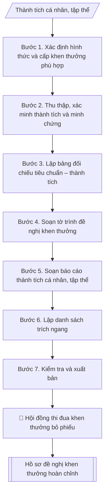

# Hồ sơ đề nghị khen thưởng các cấp

## Kiểm soát áp dụng và phê duyệt

Trước khi chạy quy trình, xác định `ngay_ap_dung`, `loai_hinh_truong`, `quy_che_noi_bo`, `nguon_du_lieu` và `nguoi_kiem_duyet`. Chỉ yêu cầu thông tin có liên quan đến nghiệp vụ; không dùng giá trị giả định thay dữ liệu bắt buộc. Hồ sơ có yếu tố pháp lý phải kèm văn bản gốc, tình trạng hiệu lực, điều khoản áp dụng và chuyển tiếp.

## Giới hạn và human gate

AI hỗ trợ chuẩn bị và đối chiếu. Cán bộ phụ trách kiểm tra dữ liệu/căn cứ, người có thẩm quyền duyệt và ký. Mọi đầu ra mặc định là **DỰ THẢO – CHỜ KIỂM DUYỆT**; không đánh dấu đã ký, đã duyệt hoặc đã công bố nếu chưa có chứng cứ. Dữ liệu sinh viên, sức khỏe, nhân sự và tài chính phải hạn chế theo mục đích, phân quyền và che thông tin định danh khi dùng ví dụ. Không tải dữ liệu lên dịch vụ ngoài khi chưa có quyền. Kiểm tra Luật 91/2025/QH15 về bảo vệ dữ liệu cá nhân (hiệu lực 01/01/2026) và quy định áp dụng trước xử lý/chia sẻ dữ liệu cá nhân.


## Khi nào dùng
Khi cần đề nghị khen thưởng cho cá nhân hoặc tập thể: Huân chương, Bằng khen của Thủ tướng,
Bằng khen Bộ/Giáo dục, Chiến sĩ thi đua, Giấy khen của Hiệu trưởng...; chuẩn bị tờ trình,
báo cáo thành tích và danh sách trích ngang gửi Hội đồng thi đua – khen thưởng cấp trên.

## Đầu vào (Input)

| Trường | Mô tả | Bắt buộc |
|---|---|---|
| `doi_tuong` | Cá nhân / Tập thể | Có |
| `ho_ten_tap_the` | Họ tên cá nhân hoặc tên tập thể đề nghị | Có |
| `chuc_vu_don_vi` | Chức vụ, đơn vị công tác (cá nhân) / đơn vị chủ quản (tập thể) | Có |
| `hinh_thuc_khen` | Huân chương / Bằng khen Thủ tướng / Bằng khen Bộ / CSTĐ / Giấy khen... | Có |
| `cap_trinh` | Cấp trình (Hiệu trưởng / Bộ GD&ĐT / Thủ tướng Chính phủ...) | Có |
| `thanh_tich` | Tóm tắt thành tích nổi bật theo năm, có số liệu minh chứng | Có |
| `thoi_gian_xet` | Giai đoạn xét thành tích (vd: 2021–2026) | Có |
| `can_cu` | Quy định, tiêu chuẩn của hình thức khen thưởng tương ứng | Có |
| `nguoi_ky` | Hiệu trưởng / Chủ tịch Hội đồng TĐKT trường | Có |

## Quy trình

**Bước 1. Xác định hình thức và cấp khen thưởng phù hợp**
- Làm gì: căn cứ `thanh_tich` và `hinh_thuc_khen` đề xuất, đối chiếu với tiêu chuẩn của từng
hình thức trong Luật Thi đua, khen thưởng và văn bản hướng dẫn (Huân chương, Bằng khen Thủ
tướng, Bằng khen Bộ, Chiến sĩ thi đua, Giấy khen...); xác định `cap_trinh` có thẩm quyền
xét tặng; kiểm tra đối tượng chưa từng được tặng cùng hình thức cho cùng thành tích.
- Dùng input: `doi_tuong`, `hinh_thuc_khen`, `cap_trinh`, `thanh_tich`, `can_cu`.
- Vai trò: Chuyên viên Phòng TCCB · AI hỗ trợ: phân tích input, xác định yêu cầu · ⏱ ~20–45 phút (ước tính)
- Lưu ý nghiệp vụ: bẫy thường gặp là đề nghị hình thức khen cao hơn tiêu chuẩn thành tích
thực tế (hồ sơ bị trả) hoặc đề nghị trùng hình thức đã được tặng cho cùng giai đoạn thành
tích; hình thức khen phải tương xứng và có tính kế thừa (không nhảy cóc từ Giấy khen lên
Huân chương).
- → Kết quả bước: phiếu xác định hình thức khen (hình thức đề nghị | tiêu chuẩn yêu cầu |
thành tích đối chiếu | kết luận phù hợp/không phù hợp).

**Bước 2. Thu thập, xác minh thành tích và minh chứng**
- Làm gì: thu thập chi tiết từng nội dung trong `thanh_tich` theo `thoi_gian_xet`: quá trình
công tác, thành tích từng năm (đề tài, bài báo, giải thưởng, sáng kiến, kết quả đánh giá
viên chức...), kèm minh chứng cho từng nội dung (quyết định nghiệm thu, bản sao bài báo,
quyết định công nhận danh hiệu...); kiểm tra giai đoạn xét liên tục, không trùng lặp thành
tích đã được khen ở cùng hình thức.
- Dùng input: `thanh_tich`, `thoi_gian_xet`, `ho_ten_tap_the`, `chuc_vu_don_vi`.
- Vai trò: Chuyên viên Phòng TCCB · AI hỗ trợ: xử lý sơ bộ theo quy trình · ⏱ ~20–45 phút (ước tính)
- Lưu ý nghiệp vụ: mọi con số trong báo cáo thành tích (số đề tài, số bài báo, số NCS)
đều phải có minh chứng đối chiếu được; thành tích tập thể và cá nhân phải tách bạch
(không lấy thành tích tập thể ghi cho cá nhân); kiểm tra kết quả đánh giá viên chức các
năm trong giai đoạn xét (thường yêu cầu hoàn thành tốt nhiệm vụ trở lên).
- → Kết quả bước: bảng tổng hợp thành tích đã xác minh (năm | nội dung thành tích |
minh chứng kèm theo).

**Bước 3. Lập bảng đối chiếu tiêu chuẩn – thành tích**
- Làm gì: liệt kê từng tiêu chuẩn của hình thức khen đã xác định ở Bước 1, đối chiếu với
thành tích đã xác minh ở Bước 2, đánh dấu từng tiêu chí: Đạt / Chưa đạt / Cần làm rõ;
ghi rõ căn cứ pháp lý của từng tiêu chuẩn (`can_cu`).
- Dùng input: `hinh_thuc_khen`, `can_cu` + kết quả Bước 1–2.
- Vai trò: Chuyên viên Phòng TCCB (Trưởng phòng kiểm tra lại) · AI hỗ trợ: lập bảng tính toán · ⏱ ~15–30 phút (ước tính)
- Lưu ý nghiệp vụ: đây là bước quyết định hồ sơ có đủ điều kiện trình hay không — nếu có
tiêu chí chưa đạt phải dừng lại và báo lại đơn vị, không cố soạn hồ sơ; tiêu chí "cần làm
rõ" phải được xử lý dứt điểm trước khi sang bước soạn thảo.
- → Kết quả bước: bảng đối chiếu tiêu chuẩn – thành tích (tiêu chuẩn | yêu cầu |
thực tế | kết quả) + kết luận đủ/không đủ điều kiện trình.

**Bước 4. Soạn tờ trình đề nghị khen thưởng**
- Làm gì: soạn tờ trình theo thể thức NĐ 30/2020: Quốc hiệu – Tiêu ngữ, tên trường, số/ký
hiệu, địa danh ngày tháng, tên loại "TỜ TRÌNH" + trích yếu (Về việc đề nghị tặng...);
Kính gửi `cap_trinh`; phần căn cứ (Luật Thi đua, khen thưởng; quy định của cấp trình;
kết quả bình xét của Hội đồng TĐKT trường — số, ngày họp); nội dung đề nghị (tặng hình
thức gì cho ai — họ tên/tên tập thể, chức vụ, đơn vị — kèm tóm tắt thành tích); nêu rõ
có danh sách trích ngang và báo cáo thành tích kèm theo; câu kết trình cấp có thẩm quyền
xem xét, quyết định; Nơi nhận; `nguoi_ky` ký.
- Dùng input: `doi_tuong`, `ho_ten_tap_the`, `chuc_vu_don_vi`, `hinh_thuc_khen`, `cap_trinh`, `thanh_tich`, `nguoi_ky`.
- Vai trò: Chuyên viên Phòng TCCB · AI hỗ trợ: soạn dự thảo đúng thể thức · ⏱ ~20–45 phút (ước tính)
- Lưu ý nghiệp vụ: trích yếu phải nêu đúng hình thức khen đề nghị; phần căn cứ bắt buộc có
kết quả bình xét của Hội đồng TĐKT trường (ngày họp, tỷ lệ bỏ phiếu) — thiếu căn cứ này
hồ sơ không hợp lệ; số lượng đề nghị trong tờ trình phải khớp tuyệt đối với danh sách
trích ngang.
- → Kết quả bước: dự thảo tờ trình đề nghị khen thưởng hoàn chỉnh.

**Bước 5. Soạn báo cáo thành tích cá nhân/tập thể**
- Làm gì: soạn báo cáo thành tích theo mẫu chuẩn: Quốc hiệu – Tiêu ngữ; tên báo cáo + hình
thức khen đề nghị; I. Sơ lược lý lịch (họ tên, chức vụ, đơn vị, trình độ — hoặc thông tin
tập thể); II. Thành tích đạt được trong `thoi_gian_xet` (trình bày theo năm hoặc theo nhóm
nội dung, nêu bật, có số liệu từ Bước 2); III. Các danh hiệu, hình thức khen thưởng đã được
tặng; lời cam đoan tính chính xác + chữ ký người báo cáo; phần xác nhận của thủ trưởng
đơn vị.
- Dùng input: `doi_tuong`, `ho_ten_tap_the`, `chuc_vu_don_vi`, `thanh_tich`, `thoi_gian_xet`, `hinh_thuc_khen`.
- Vai trò: Chuyên viên Phòng TCCB · AI hỗ trợ: soạn dự thảo đúng thể thức · ⏱ ~20–45 phút (ước tính)
- Lưu ý nghiệp vụ: thành tích trình bày theo thứ tự ưu tiên (nổi bật nhất trước), số liệu
khớp với bảng tổng hợp ở Bước 2; mục III phải kê khai trung thực các khen thưởng đã nhận
(cơ quan xét đối chiếu để tránh khen trùng); báo cáo cá nhân do chính cá nhân ký và cam đoan.
- → Kết quả bước: dự thảo báo cáo thành tích hoàn chỉnh.

**Bước 6. Lập danh sách trích ngang**
- Làm gì: lập bảng trích ngang kèm tờ trình với các cột: TT, họ tên (hoặc tên tập thể),
chức vụ/đơn vị, tóm tắt thành tích (ngắn gọn, nêu số liệu chính), hình thức đề nghị;
kiểm tra số thứ tự, họ tên, hình thức đề nghị khớp với tờ trình (Bước 4) và báo cáo thành
tích (Bước 5).
- Dùng input: `ho_ten_tap_the`, `chuc_vu_don_vi`, `thanh_tich`, `hinh_thuc_khen`.
- Vai trò: Chuyên viên Phòng TCCB · AI hỗ trợ: lập bảng tính toán · ⏱ ~20–45 phút (ước tính)
- Lưu ý nghiệp vụ: trích ngang là tài liệu cấp trên đọc đầu tiên — tóm tắt thành tích
không quá 2 dòng nhưng phải nêu được điểm nổi bật nhất; nếu nhiều đối tượng, sắp xếp theo
thứ tự ưu tiên đề nghị.
- → Kết quả bước: danh sách trích ngang đề nghị khen thưởng.

**Bước 7. Kiểm tra và xuất bản**
- Làm gì: soát toàn bộ hồ sơ: tiêu chuẩn hình thức khen khớp thành tích (kết quả Bước 3),
thời gian xét liên tục, minh chứng đầy đủ; họ tên/chức vụ/đơn vị thống nhất giữa tờ trình,
báo cáo thành tích và trích ngang; thẩm quyền trình đúng `cap_trinh`; thể thức văn bản
đúng NĐ 30/2020; `nguoi_ky` đúng thẩm quyền.
- Dùng input: toàn bộ input (tổng soát), `nguoi_ky`.
- Vai trò: Chuyên viên Phòng TCCB (Trưởng phòng kiểm tra lại) · AI hỗ trợ: quét lỗi theo checklist · ⏱ ~15–30 phút (ước tính)
- Lưu ý nghiệp vụ: lỗi phổ biến nhất là không thống nhất họ tên/chức danh giữa 3 tài liệu
(viết tắt ở trích ngang, viết đầy đủ ở tờ trình); kiểm tra lần cuối số lượng đối tượng
trong tờ trình = số dòng trong trích ngang = số báo cáo thành tích đính kèm.
- → Kết quả bước: bộ hồ sơ đề nghị khen thưởng hoàn chỉnh (tờ trình + báo cáo thành tích
+ danh sách trích ngang), sẵn sàng trình ký.

## Luồng quy trình (Workflow)



## Đầu ra (Output)
- Tờ trình đề nghị khen thưởng hoàn chỉnh.
- Báo cáo thành tích cá nhân/tập thể hoàn chỉnh.
- Danh sách trích ngang đề nghị khen thưởng.

**Cấu trúc output chuẩn:** (Tờ trình đề nghị khen thưởng — sản phẩm chính, theo thể thức NĐ 30/2020)
1. Quốc hiệu – Tiêu ngữ ("CỘNG HÒA XÃ HỘI CHỦ NGHĨA VIỆT NAM" / "Độc lập – Tự do – Hạnh phúc").
2. Tên cơ quan ban hành (Trường Đại học A).
3. Số, ký hiệu tờ trình.
4. Địa danh, ngày tháng năm ban hành.
5. Tên loại văn bản "TỜ TRÌNH" + trích yếu ("Về việc đề nghị tặng...").
6. Kính gửi (cấp có thẩm quyền xét tặng).
7. Phần căn cứ: Luật Thi đua, khen thưởng; quy định của cấp trình; kết quả bình xét của
Hội đồng Thi đua – Khen thưởng trường (ngày họp).
8. Nội dung đề nghị: hình thức khen đề nghị tặng cho ai (họ tên/tên tập thể, chức vụ, đơn
vị), tóm tắt thành tích; nêu rõ có danh sách trích ngang và báo cáo thành tích kèm theo.
9. Câu kết ("Kính trình ... xem xét, quyết định./.").
10. Nơi nhận (cấp trình; lưu VT, TCCB).
11. Chữ ký (Hiệu trưởng + họ tên).

## Checklist nghiệm thu

Tiêu chí đạt: tất cả các ô dưới đây được đánh dấu.

- [ ] Đủ các phần theo Cấu trúc output chuẩn: Quốc hiệu – Tiêu ngữ ("CỘNG HÒA XÃ HỘI CHỦ NGHĨA VIỆT NAM" / "Độc l…; Tên cơ quan ban hành (Trường Đại học A).; Số, ký hiệu tờ trình.; Địa danh, ngày tháng năm ban hành.; … (đủ 11 phần)
- [ ] Nội dung và số liệu trong output khớp đúng với Input đã cho (không thêm, bớt hay suy diễn)
- [ ] Không bịa đặt số liệu, minh chứng, trích dẫn hay căn cứ
- [ ] Đúng thể thức và định dạng theo Luật Thi đua, khen thưởng và các văn bản hướng dẫn thi hành.
- [ ] Căn cứ pháp lý được trích dẫn đầy đủ và còn hiệu lực
- [ ] Đã qua Human gate: người có thẩm quyền đã kiểm tra/duyệt trước khi phát hành
- [ ] Trích yếu phải nêu đúng hình thức khen đề nghị

## Ví dụ mô phỏng (dữ liệu giả lập)

> Tất cả tên trường, cá nhân, số liệu dưới đây đều là **giả lập**, không liên quan tổ chức/cá nhân có thật.

### Input mẫu

| Trường | Giá trị |
|---|---|
| `doi_tuong` | Cá nhân |
| `ho_ten_tap_the` | Trần Văn D |
| `chuc_vu_don_vi` | Phó Hiệu trưởng Trường Đại học A |
| `hinh_thuc_khen` | Bằng khen của Bộ trưởng Bộ Giáo dục và Đào tạo |
| `cap_trinh` | Bộ Giáo dục và Đào tạo |
| `thanh_tich` | Giai đoạn 2021–2026: chủ trì 03 đề tài cấp Bộ nghiệm thu xuất sắc; 25 bài báo khoa học (12 quốc tế); hướng dẫn 05 NCS bảo vệ thành công; 5 năm liên tục hoàn thành xuất sắc nhiệm vụ, đạt danh hiệu CSTĐ cơ sở |
| `thoi_gian_xet` | 2021–2026 |
| `can_cu` | Luật Thi đua, khen thưởng; tiêu chuẩn Bằng khen Bộ trưởng |
| `nguoi_ky` | Hiệu trưởng |

### Output mẫu

**1. TỜ TRÌNH**

```
TRƯỜNG ĐẠI HỌC A            CỘNG HÒA XÃ HỘI CHỦ NGHĨA VIỆT NAM
                                             Độc lập – Tự do – Hạnh phúc
      Số: 68/TTr-ĐHA-TCCB
                                                 Thành phố C, ngày 09 tháng 10 năm 2026

                         TỜ TRÌNH
         Về việc đề nghị tặng Bằng khen của Bộ trưởng
                Bộ Giáo dục và Đào tạo

Kính gửi: Bộ trưởng Bộ Giáo dục và Đào tạo

Căn cứ Luật Thi đua, khen thưởng;
Căn cứ quy định về công tác thi đua, khen thưởng của Bộ Giáo dục và Đào tạo;
Căn cứ kết quả bình xét của Hội đồng Thi đua – Khen thưởng Trường Đại học A
tại phiên họp ngày 05/10/2026,

Trường Đại học A trân trọng đề nghị Bộ trưởng Bộ Giáo dục và Đào tạo xem xét,
tặng Bằng khen cho 01 cá nhân có thành tích xuất sắc trong công tác giai đoạn 2021–2026
(có danh sách trích ngang và báo cáo thành tích kèm theo):

Ông Trần Văn D – Phó Hiệu trưởng Trường Đại học A.

Kính trình Bộ trưởng xem xét, quyết định./.

Nơi nhận:                                                      HIỆU TRƯỞNG
- Như trên;
- Lưu: VT, TCCB.                                                   [CHỜ KÝ]
```

**2. BÁO CÁO THÀNH TÍCH CÁ NHÂN**

```
CỘNG HÒA XÃ HỘI CHỦ NGHĨA VIỆT NAM
Độc lập – Tự do – Hạnh phúc

                 BÁO CÁO THÀNH TÍCH
Đề nghị tặng Bằng khen của Bộ trưởng Bộ Giáo dục và Đào tạo

I. SƠ LƯỢC LÝ LỊCH
- Họ và tên: Trần Văn D. Chức vụ: Phó Hiệu trưởng.
- Đơn vị công tác: Trường Đại học A.
- Trình độ: Tiến sĩ.

II. THÀNH TÍCH ĐẠT ĐƯỢC (giai đoạn 2021–2026)
1. Chủ trì 03 đề tài nghiên cứu khoa học cấp Bộ, nghiệm thu loại xuất sắc.
2. Công bố 25 bài báo khoa học, trong đó 12 bài trên tạp chí quốc tế uy tín.
3. Hướng dẫn thành công 05 nghiên cứu sinh bảo vệ luận án tiến sĩ.
4. 05 năm liên tục (2021–2025) hoàn thành xuất sắc nhiệm vụ, đạt danh hiệu
   Chiến sĩ thi đua cơ sở.

III. CÁC DANH HIỆU, HÌNH THỨC KHEN THƯỞNG ĐÃ ĐƯỢC TẶNG
- Chiến sĩ thi đua cơ sở các năm 2021, 2022, 2023, 2024, 2025.
- Giấy khen của Hiệu trưởng năm 2022.

Tôi cam đoan những nội dung báo cáo trên là đúng sự thật; nếu sai, tôi xin chịu
trách nhiệm trước pháp luật.

                                              Thành phố C, ngày 09 tháng 10 năm 2026
                                                   Người báo cáo
                                                      [CHỜ KÝ]

                                                  Trần Văn D

XÁC NHẬN CỦA THỦ TRƯỞNG ĐƠN VỊ
(Ý kiến xác nhận tính chính xác của báo cáo thành tích)

                                                      HIỆU TRƯỞNG
                                                         (đã ký, đóng dấu)
```

**3. DANH SÁCH TRÍCH NGANG**

| TT | Họ tên | Chức vụ, đơn vị | Tóm tắt thành tích | Hình thức đề nghị |
|----|--------|-----------------|--------------------|-------------------|
| 1 | Trần Văn D | Phó Hiệu trưởng, Trường ĐH A | 03 đề tài cấp Bộ XS; 25 bài báo (12 QT); 05 NCS; 5 năm HTXS nhiệm vụ | Bằng khen Bộ trưởng |

## Căn cứ & lưu ý
- Luật Thi đua, khen thưởng và các văn bản hướng dẫn thi hành.
- Quyết định 37/2018/QĐ-TTg về xét công nhận GS/PGS (tham chiếu khi thành tích liên quan
học hàm, học vị trong báo cáo thành tích).
- Nghị định 30/2020/NĐ-CP về công tác văn thư (thể thức văn bản).
- Thành tích phải có minh chứng, giai đoạn xét liên tục, không trùng lặp với thành tích
đã được khen thưởng ở cùng hình thức.
- Không dùng tên thật của trường/cá nhân khi mô phỏng.

## Quản trị phiên bản

- Phiên bản gói: `1.1.0`; ngày cập nhật: `2026-10-09`.
- Kho nguồn: https://github.com/phamtruong91/dh-skills
- Người duy trì trên GitHub: `phamtruong91` (Phạm Văn Trường). Người phê duyệt nghiệp vụ: **chưa chỉ định**.
- Commit nguồn trước cập nhật: `78fd1d51b8acd1a724d9b9af6c488460bc7551ad`. Commit chứa phiên bản này xem bằng `git log -1 -- skills/ho-so-de-nghi-khen-thuong`; không tự gán SHA chưa tạo.
- Giấy phép: theo LICENSE của kho; bản quyền CES Global.
- Lịch sử 1.1.0: bổ sung metadata giao diện, kiểm soát áp dụng, quản trị phiên bản.
- Trạng thái: dự thảo nghiệp vụ; kiểm tra pháp lý trước thực thi. Ngày cập nhật không đồng nghĩa mọi văn bản đã được rà soát toàn văn.
