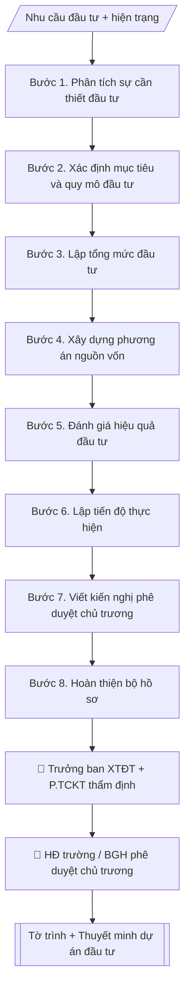

# Hồ sơ dự án đầu tư hạ tầng

## Quy cách đầu ra và thông tin thiếu

Đọc [quy cách và cấu trúc sản phẩm](references/quy-cach-dau-ra.md) trước khi soạn/xuất. File giao chỉ gồm văn bản hoặc sản phẩm nghiệp vụ được yêu cầu; kiểm tra nội bộ không xuất kèm. Thiếu thông tin giữ nguyên trường/mục và chỗ điền theo mẫu gốc (dòng dấu chấm, dấu gạch hoặc ô trống); không tự điền dữ liệu mẫu, số 0, mã chờ xác minh hoặc dòng chờ ký. Mẫu chuyên ngành còn áp dụng được ưu tiên về cấu trúc, mã biểu và người ký. Các trường “bắt buộc” là điều kiện hoàn thiện hồ sơ, không ngăn việc soạn bản có chỗ chừa để điền. Mọi chỉ dẫn “để trống” trong skill được hiểu là không điền dữ liệu và giữ cách chừa chỗ của mẫu gốc, không phải xóa dấu chấm của mẫu.

## Kiểm soát áp dụng và phê duyệt

Trước khi chạy quy trình, xác định `ngay_ap_dung`, `loai_hinh_truong`, `quy_che_noi_bo`, `nguon_du_lieu` và `nguoi_kiem_duyet`. Chỉ yêu cầu thông tin có liên quan đến nghiệp vụ; không dùng giá trị giả định thay dữ liệu bắt buộc. Đối chiếu nội bộ hồ sơ có yếu tố pháp lý với văn bản gốc, hiệu lực, điều khoản áp dụng và chuyển tiếp; không tự đính kèm bảng kiểm tra vào file giao.

## Giới hạn và human gate

AI hỗ trợ chuẩn bị và đối chiếu. Cán bộ phụ trách kiểm tra dữ liệu/căn cứ, người có thẩm quyền duyệt và ký. Văn bản soạn chưa được coi là đã ban hành; không tự chèn nhãn trạng thái kiểm duyệt vào file giao; không đánh dấu đã ký, đã duyệt hoặc đã công bố nếu chưa có chứng cứ. Dữ liệu sinh viên, sức khỏe, nhân sự và tài chính phải hạn chế theo mục đích, phân quyền và che thông tin định danh khi dùng ví dụ. Không tải dữ liệu lên dịch vụ ngoài khi chưa có quyền. Kiểm tra Luật 91/2025/QH15 về bảo vệ dữ liệu cá nhân (hiệu lực 01/01/2026) và quy định áp dụng trước xử lý/chia sẻ dữ liệu cá nhân.

## Khi nào dùng
Khi trường chuẩn bị một dự án đầu tư xây dựng/mua sắm hạ tầng (giảng đường, ký túc xá,
phòng lab, hạ tầng số...): cần bộ hồ sơ đề xuất đầy đủ để trình phê duyệt chủ trương đầu tư.

## Đầu vào (Input)

| Trường | Mô tả | Bắt buộc |
|---|---|---|
| `ten_du_an` | Tên dự án | Có |
| `muc_tieu` | Mục tiêu đầu tư, sự cần thiết | Có |
| `quy_mo` | Quy mô: diện tích, công suất, hạng mục chính | Có |
| `tong_muc_dau_tu` | Tổng mức đầu tư dự kiến và cơ cấu nguồn vốn | Có |
| `hinh_thuc_dau_tu` | Ngân sách / PPP / tài trợ / vốn tự có / kết hợp | Có |
| `tien_do` | Các giai đoạn và mốc thời gian dự kiến | Có |
| `hieu_qua` | Hiệu quả kinh tế – xã hội dự kiến | Không |

## Quy trình

**Bước 1. Phân tích sự cần thiết đầu tư**
- Làm gì: thu thập số liệu hiện trạng liên quan (quy mô sinh viên, công suất hiện hữu, mức độ thiếu hụt); mô tả bất cập cụ thể bằng số liệu; đối chiếu với quy hoạch/chiến lược phát triển trường để chứng minh tính cấp thiết.
- Dùng input: `muc_tieu`, `quy_mo`.
- Vai trò: Chuyên viên Ban Xúc tiến đầu tư · AI hỗ trợ: tổng hợp, chuẩn hóa dữ liệu, đối chiếu tự động, cảnh báo sai lệch · ⏱ ~30–60 phút (ước tính)
- Lưu ý nghiệp vụ: "sự cần thiết" phải trả lời được câu hỏi "không đầu tư thì sao" bằng số liệu, không viết định tính chung chung.
- → Kết quả bước: Bản phân tích sự cần thiết (hiện trạng – bất cập – nhu cầu, có số liệu).

**Bước 2. Xác định mục tiêu và quy mô đầu tư**
- Làm gì: từ `muc_tieu` và `quy_mo`, viết mục tiêu cụ thể (đáp ứng bao nhiêu % nhu cầu, đưa vào sử dụng khi nào); chi tiết hóa quy mô: hạng mục chính, diện tích/công suất, tiêu chuẩn kỹ thuật cơ bản.
- Dùng input: `muc_tieu`, `quy_mo` + bản phân tích sự cần thiết (Bước 1).
- Vai trò: Chuyên viên Ban Xúc tiến đầu tư · AI hỗ trợ: soạn dự thảo · ⏱ ~30–90 phút (ước tính)
- Lưu ý nghiệp vụ: quy mô phải tương xứng với nhu cầu đã chứng minh ở Bước 1 — tránh "làm quá to" hoặc "làm thiếu".
- → Kết quả bước: Mục tiêu và quy mô đầu tư đã chốt.

**Bước 3. Lập tổng mức đầu tư**
- Làm gì: từ `tong_muc_dau_tu`, bóc tách chi phí: xây dựng, thiết bị, tư vấn, quản lý dự án, dự phòng (tối thiểu 5–10%); ghi rõ cơ sở tính từng khoản (suất đầu tư, báo giá tham khảo, định mức); đối chiếu tổng các khoản với tổng mức.
- Dùng input: `tong_muc_dau_tu` + quy mô đầu tư (Bước 2).
- Vai trò: Chuyên viên Ban Xúc tiến đầu tư · AI hỗ trợ: đối chiếu tự động, cảnh báo sai lệch, tính toán, phân tích số liệu · ⏱ ~30–60 phút (ước tính)
- Lưu ý nghiệp vụ: khoản dự phòng thường bị "quên" — thiếu dự phòng là nguyên nhân phổ biến phải điều chỉnh tổng mức sau này.
- → Kết quả bước: Bảng tổng mức đầu tư chi tiết (kèm cơ sở tính từng khoản).

**Bước 4. Xây dựng phương án nguồn vốn**
- Làm gì: từ `hinh_thuc_dau_tu`, phân bổ nguồn vốn: nhà đầu tư/đối tác bao nhiêu %, trường đối ứng bao nhiêu (tiền + hiện vật như quỹ đất); nêu nghĩa vụ đối ứng cụ thể của trường và khả năng cân đối; đánh giá rủi ro nguồn vốn.
- Dùng input: `hinh_thuc_dau_tu` + bảng tổng mức (Bước 3).
- Vai trò: Chuyên viên Ban Xúc tiến đầu tư · AI hỗ trợ: lập bảng biểu, định dạng · ⏱ ~30–60 phút (ước tính)
- Lưu ý nghiệp vụ: phần đối ứng của trường phải có ý kiến của Phòng TCKT về khả năng cân đối; với PPP phải tuân thủ quy định về quản lý tài sản công.
- → Kết quả bước: Phương án nguồn vốn (cơ cấu – nghĩa vụ đối ứng – đánh giá rủi ro).

**Bước 5. Đánh giá hiệu quả đầu tư**
- Làm gì: từ `hieu_qua`, phân tích hiệu quả phục vụ đào tạo/NCKH (số người thụ hưởng/năm), hiệu quả kinh tế (doanh thu dự kiến, thời gian hoàn vốn với giả định rõ ràng), tác động xã hội; ghi rõ mọi con số là "dự kiến".
- Dùng input: `hieu_qua` + quy mô (Bước 2) + tổng mức (Bước 3).
- Vai trò: Chuyên viên Ban Xúc tiến đầu tư · AI hỗ trợ: tính toán, phân tích số liệu · ⏱ ~1–2 giờ (ước tính)
- Lưu ý nghiệp vụ: giả định tính hoàn vốn (tỷ lệ lấp đầy, giá thuê, lạm phát) phải ghi minh bạch — người thẩm định sẽ kiểm tra đầu tiên.
- → Kết quả bước: Bản đánh giá hiệu quả (kèm giả định tính toán minh bạch).

**Bước 6. Lập tiến độ thực hiện**
- Làm gì: từ `tien_do`, chi tiết hóa các giai đoạn: chuẩn bị đầu tư (phê duyệt, thiết kế) → thi công → nghiệm thu → bàn giao đưa vào sử dụng; mỗi giai đoạn ghi mốc thời gian và sản phẩm hoàn thành.
- Dùng input: `tien_do`.
- Vai trò: Chuyên viên Ban Xúc tiến đầu tư · AI hỗ trợ: lập bảng biểu, định dạng · ⏱ ~30–60 phút (ước tính)
- Lưu ý nghiệp vụ: tiến độ phải tính cả thời gian thủ tục phê duyệt (thường 3–6 tháng); mốc đưa vào sử dụng nên khớp năm học.
- → Kết quả bước: Bảng tiến độ thực hiện theo giai đoạn.

**Bước 7. Viết kiến nghị phê duyệt chủ trương**
- Làm gì: tổng hợp 6 nội dung trên thành phần kiến nghị: trình bày tóm tắt dự án (tên, quy mô, tổng mức, hình thức, tiến độ) và đề nghị cấp có thẩm quyền (HĐ trường/BGH) xem xét phê duyệt chủ trương đầu tư.
- Dùng input: toàn bộ bán thành phẩm Bước 1–6 + `ten_du_an`.
- Vai trò: Chuyên viên Ban Xúc tiến đầu tư · AI hỗ trợ: soạn dự thảo, tổng hợp, chuẩn hóa dữ liệu · ⏱ ~1–3 giờ (ước tính)
- Lưu ý nghiệp vụ: kiến nghị nêu đúng cấp phê duyệt theo phân cấp đầu tư; không kiến nghị vượt thẩm quyền.
- → Kết quả bước: Dự thảo kiến nghị phê duyệt chủ trương.

**Bước 8. Hoàn thiện bộ hồ sơ**
- Làm gì: đóng gói: tờ trình + thuyết minh dự án (đủ 7 nội dung: sự cần thiết, mục tiêu, quy mô, tổng mức, nguồn vốn, hiệu quả, tiến độ) + phụ lục (bảng tổng mức, tiến độ, phương án vốn); rà soát nhất quán số liệu giữa các tài liệu; gửi Trưởng ban XTĐT và Phòng TCKT thẩm định trước khi trình.
- Dùng input: toàn bộ bán thành phẩm Bước 1–7.
- Vai trò: Chuyên viên Ban Xúc tiến đầu tư · AI hỗ trợ: đối chiếu tự động, cảnh báo sai lệch, chuẩn bị hồ sơ trình đầy đủ · ⏱ ~1–3 giờ (ước tính)
- Lưu ý nghiệp vụ: số liệu trong tờ trình, thuyết minh và phụ lục phải khớp tuyệt đối — lệch 1 con số cũng bị trả hồ sơ.
- → Kết quả bước: Bộ hồ sơ dự án đầu tư hoàn chỉnh (sẵn sàng trình phê duyệt).

## Luồng quy trình (Workflow)

## Đầu ra

Sản phẩm nghiệp vụ hoàn chỉnh theo [quy cách và cấu trúc](references/quy-cach-dau-ra.md), giữ các trường chưa có dữ liệu ở trạng thái trống. Không xuất kèm checklist/phụ lục kiểm tra đầu ra.

## Kiểm tra nội bộ trước khi giao

- [ ] Bố cục khớp mẫu áp dụng và cấu trúc tại references/quy-cach-dau-ra.md.
- [ ] Có đầy đủ sản phẩm: Tờ trình + Thuyết minh đề xuất dự án đầu tư (đầy đủ 7 nội dung trên)
- [ ] Mọi số liệu, tên, ngày tháng trong output khớp với Input đã cung cấp (không thêm bớt, không suy đoán)
- [ ] Không bịa đặt số liệu, minh chứng, trích dẫn hay căn cứ
- [ ] Đúng thể thức, định dạng văn bản theo quy định hiện hành
- [ ] Căn cứ pháp lý nêu đầy đủ, còn hiệu lực tại thời điểm lập
- [ ] Đã qua Human gate: người có thẩm quyền đã kiểm tra/ký duyệt trước khi phát hành
- [ ] "sự cần thiết" phải trả lời được câu hỏi "không đầu tư thì sao" bằng số liệu, không viết định tính chung chung.
- [ ] Quy mô phải tương xứng với nhu cầu đã chứng minh ở Bước 1 — tránh "làm quá to" hoặc "làm thiếu".
- [ ] Khoản dự phòng thường bị "quên" — thiếu dự phòng là nguyên nhân phổ biến phải điều chỉnh tổng mức sau này.

> Tiêu chí đạt: tất cả các ô đều được đánh dấu.

## Human gate
- Trưởng Ban XTĐT thẩm định hồ sơ; Hội đồng trường/Ban Giám hiệu phê duyệt chủ trương đầu tư.
- Phòng TCKT thẩm định tổng mức đầu tư và phương án nguồn vốn.

## Giới hạn
- Không tự ý điều chỉnh tổng mức đầu tư, quy mô, hình thức đầu tư sau khi đã trình.
- Số liệu hiệu quả/hoàn vốn phải ghi rõ là "dự kiến", kèm giả định tính toán.
- Không cam kết với nhà đầu tư trước khi có phê duyệt chủ trương.

## Căn cứ & lưu ý
- Luật Đầu tư công, Luật PPP, Luật Xây dựng, quy định quản lý tài sản công và phân cấp đầu tư.
- Không dùng tên thật của trường/cá nhân khi mô phỏng.

## Quản trị phiên bản

- Phiên bản gói: `1.2.1`; ngày cập nhật: `2026-10-10`.
- Kho nguồn: https://github.com/phamtruong91/university-skills-framework
- Người duy trì trên GitHub: `phamtruong91` (Phạm Văn Trường). Người phê duyệt nghiệp vụ: **chưa chỉ định**.
- Commit nguồn trước cập nhật: `346719e6b0318ed034b4b016703f79733aa575e7`. Commit chứa phiên bản này xem bằng `git log -1 -- skills/ho-so-du-an-dau-tu-ha-tang`; không tự gán SHA chưa tạo.
- Giấy phép: theo LICENSE của kho; bản quyền CES Global.
- Lịch sử 1.1.0: bổ sung metadata giao diện, kiểm soát áp dụng, quản trị phiên bản.
- Trạng thái: dự thảo nghiệp vụ; kiểm tra pháp lý trước thực thi. Ngày cập nhật không đồng nghĩa mọi văn bản đã được rà soát toàn văn.
