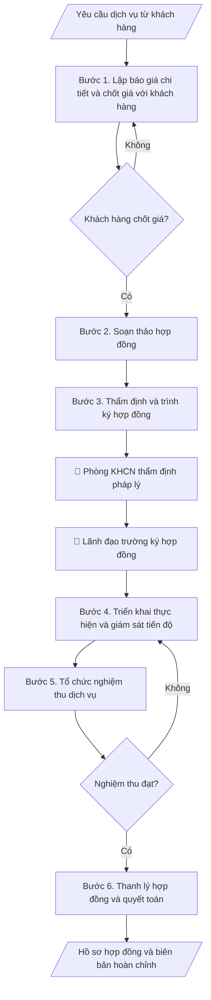

# Skill: Hồ sơ hợp đồng dịch vụ KHCN

## Khi nào dùng
Khi trung tâm/viện/phòng KHCN của trường cung cấp dịch vụ cho tổ chức, doanh nghiệp bên ngoài:
tư vấn kỹ thuật, phân tích – kiểm nghiệm mẫu, chuyển giao công nghệ, đào tạo theo đặt hàng...
cần lập báo giá, ký hợp đồng, nghiệm thu và thanh lý đúng quy định.

## Đầu vào (Input)

| Trường | Mô tả | Bắt buộc |
|---|---|---|
| `ten_dich_vu` | Tên dịch vụ KHCN cung cấp | Có |
| `khach_hang` | Tên, địa chỉ, người đại diện của bên thuê dịch vụ | Có |
| `don_vi_thuc_hien` | Đơn vị của trường thực hiện dịch vụ | Có |
| `pham_vi_cong_viec` | Nội dung công việc chi tiết, sản phẩm bàn giao | Có |
| `don_gia` | Báo giá chi tiết theo hạng mục | Có |
| `thoi_gian` | Thời gian thực hiện, các mốc bàn giao | Có |
| `dieu_khoan_thanh_toan` | Tạm ứng, thanh toán theo tiến độ, giữ lại | Không (mặc định: tạm ứng 30%, quyết toán sau nghiệm thu) |

## Quy trình

**Bước 1. Lập báo giá chi tiết và chốt giá với khách hàng**
- Làm gì: Bóc tách `pham_vi_cong_viec` thành các hạng mục công việc; mỗi hạng mục ghi: nội
  dung, đơn vị tính, số lượng, đơn giá, thành tiền; cộng tổng giá trị, ghi rõ đã/chưa bao
  gồm VAT; gửi khách hàng, thương thảo và chốt giá trị hợp đồng bằng văn bản (email xác
  nhận hoặc biên bản làm việc).
- Dùng input: `ten_dich_vu`, `pham_vi_cong_viec`, `don_gia`, `khach_hang`.
- Vai trò: Chuyên viên dịch vụ KHCN · AI hỗ trợ: bóc tách hạng mục và lập bảng báo giá dự thảo, đơn vị chốt đơn giá theo biểu giá đã duyệt · ⏱ 1–2 giờ (ước tính)
- Lưu ý nghiệp vụ: đơn giá theo biểu giá dịch vụ đã được trường phê duyệt (nếu có); chi
  phí phát sinh ngoài phạm vi phải ghi rõ cách tính ngay từ báo giá; không báo giá miệng —
  mọi chốt giá phải có văn bản để đối chiếu khi quyết toán.
- → Kết quả bước: Bảng báo giá chi tiết đã được khách hàng xác nhận bằng văn bản.

**Bước 2. Soạn thảo hợp đồng**
- Làm gì: Soạn hợp đồng đầy đủ các điều khoản bắt buộc: thông tin hai bên, đối tượng và
  phạm vi công việc, sản phẩm bàn giao, giá trị hợp đồng, tiến độ và các mốc bàn giao,
  điều khoản thanh toán, nghiệm thu, bảo hành/bảo mật, phạt vi phạm, chấm dứt hợp đồng,
  hiệu lực.
- Dùng input: `ten_dich_vu`, `khach_hang`, `don_vi_thuc_hien`, `pham_vi_cong_viec`,
  `don_gia`, `thoi_gian`, `dieu_khoan_thanh_toan`.
- Vai trò: Chuyên viên dịch vụ KHCN · AI hỗ trợ: soạn dự thảo hợp đồng theo mẫu chuẩn của trường · ⏱ 1–2 giờ (ước tính)
- Lưu ý nghiệp vụ: dùng mẫu hợp đồng chuẩn của trường (nếu có); số liệu giá trị, tiến độ
  phải khớp báo giá đã chốt ở bước 1; điều khoản phạt vi phạm phải cân đối hai chiều
  (cả bên cung cấp và bên thuê).
- → Kết quả bước: Dự thảo hợp đồng dịch vụ KHCN.

**Bước 3. Thẩm định và trình ký hợp đồng**
- Làm gì: Đơn vị thực hiện tự rà soát dự thảo → gửi phòng KHCN thẩm định tính pháp lý →
  trình lãnh đạo trường ký theo phân cấp ủy quyền; sau khi hai bên ký, lưu số hợp đồng,
  ngày ký, bản chính.
- Dùng input: (dự thảo hợp đồng — kết quả bước 2).
- Vai trò: Viện trưởng · AI hỗ trợ: tổng hợp danh mục kiểm tra, đối chiếu hồ sơ · ⏱ 3–5 ngày làm việc (ước tính)
- Lưu ý nghiệp vụ: kiểm tra người ký đúng thẩm quyền theo giá trị hợp đồng (phân cấp);
  hợp đồng chỉ có hiệu lực khi đủ chữ ký hai bên và đóng dấu; mỗi bên giữ ít nhất 01 bản
  chính.
- → Kết quả bước: Hợp đồng đã ký, đóng dấu (bản chính lưu tại đơn vị và phòng KHCN).

**Bước 4. Triển khai thực hiện và giám sát tiến độ**
- Làm gì: Lập kế hoạch triển khai chi tiết theo các mốc trong hợp đồng; theo dõi tiến độ
  từng hạng mục; lập biên bản làm việc/bàn giao từng phần có chữ ký hai bên (nếu hợp đồng
  chia nhiều đợt); ghi nhận phát sinh (nếu có) và xử lý theo điều khoản hợp đồng.
- Dùng input: `thoi_gian`, `pham_vi_cong_viec`.
- Vai trò: Chuyên viên dịch vụ KHCN · AI hỗ trợ: soạn nhật ký theo dõi và nhắc mốc · ⏱ 30–60 phút mỗi đợt theo dõi (ước tính)
- Lưu ý nghiệp vụ: mọi thay đổi phạm vi/tiến độ phải lập phụ lục hợp đồng, không thỏa
  thuận miệng; chậm mốc nào phải báo ngay cho khách hàng và ghi vào biên bản làm việc.
- → Kết quả bước: Nhật ký triển khai + biên bản bàn giao từng phần (nếu có).

**Bước 5. Tổ chức nghiệm thu dịch vụ**
- Làm gì: Thành lập hội đồng nghiệm thu có đại diện hai bên; kiểm tra sản phẩm bàn giao
  đối chiếu từng nội dung trong hợp đồng (số lượng, chất lượng, thời hạn); lập biên bản
  nghiệm thu ghi rõ: đạt/không đạt từng hạng mục, tồn tại cần khắc phục (nếu có) và thời
  hạn khắc phục.
- Dùng input: `pham_vi_cong_viec`, `thoi_gian` (làm tiêu chí nghiệm thu).
- Vai trò: Hội đồng nghiệm thu · AI hỗ trợ: tổng hợp danh mục kiểm tra, đối chiếu hồ sơ · ⏱ 0,5–1 ngày làm việc (ước tính)
- Lưu ý nghiệp vụ: chỉ nghiệm thu khi đủ sản phẩm theo hợp đồng; nếu không đạt, ghi rõ
  nội dung phải làm lại và hạn hoàn thành — không ký "nghiệm thu có điều kiện" chung chung.
- → Kết quả bước: Biên bản nghiệm thu dịch vụ (hai bên ký).

**Bước 6. Thanh lý hợp đồng và quyết toán**
- Làm gì: Đối chiếu giá trị thực hiện với hợp đồng (trừ tạm ứng đã nhận, phạt vi phạm nếu
  có); lập biên bản thanh lý hợp đồng; xuất hóa đơn VAT; hạch toán doanh thu và thực hiện
  nghĩa vụ tài chính theo quy định của trường; lưu trọn bộ hồ sơ.
- Dùng input: `dieu_khoan_thanh_toan`, `don_gia` (giá trị quyết toán).
- Vai trò: Chuyên viên dịch vụ KHCN · AI hỗ trợ: đối chiếu số liệu và soạn biên bản thanh lý, kế toán đối chiếu và xuất hóa đơn · ⏱ 1–2 giờ (ước tính)
- Lưu ý nghiệp vụ: chỉ thanh lý khi đã nghiệm thu đạt và đã thu đủ tiền (hoặc có cam kết
  thanh toán bằng văn bản); đối chiếu số liệu với phòng Tài chính trước khi xuất hóa đơn.
- → Kết quả bước: Biên bản thanh lý hợp đồng + hồ sơ quyết toán đầy đủ.

## Luồng quy trình (Workflow)


## Đầu ra (Output)
- Báo giá dịch vụ.
- Hợp đồng dịch vụ KHCN hoàn chỉnh.
- Biên bản nghiệm thu dịch vụ + biên bản thanh lý hợp đồng.

**Cấu trúc output chuẩn** (bộ hồ sơ hợp đồng dịch vụ KHCN — các phần theo đúng thứ tự):
1. Bảng báo giá dịch vụ: hạng mục công việc, đơn vị tính, số lượng, đơn giá, thành tiền,
   tổng giá trị (ghi rõ đã/chưa VAT), xác nhận của khách hàng.
2. Hợp đồng dịch vụ KHCN: đầy đủ điều khoản (đối tượng, phạm vi, sản phẩm bàn giao, giá
   trị, tiến độ, thanh toán, nghiệm thu, bảo mật, phạt vi phạm, chấm dứt), hai bên ký,
   đóng dấu.
3. Biên bản bàn giao từng phần (nếu hợp đồng chia nhiều đợt).
4. Biên bản nghiệm thu dịch vụ: đối chiếu từng hạng mục đạt/không đạt, hai bên ký.
5. Biên bản thanh lý hợp đồng + hồ sơ quyết toán (đối chiếu giá trị, hóa đơn).

## Checklist nghiệm thu

- [ ] Đủ 5 phần theo "Cấu trúc output chuẩn": bảng báo giá, hợp đồng, biên bản bàn giao từng phần (nếu có), biên bản nghiệm thu, biên bản thanh lý + quyết toán.
- [ ] Số liệu (giá trị, tiến độ) khớp với Input (báo giá, phạm vi công việc) đã cho.
- [ ] Không bịa đặt chữ ký, biên bản nghiệm thu hay xác nhận thanh toán không có thật.
- [ ] Báo giá chốt bằng văn bản của khách hàng; ghi rõ đã/chưa bao gồm VAT.
- [ ] Hợp đồng đầy đủ các điều khoản bắt buộc; người ký đúng thẩm quyền theo phân cấp; đủ chữ ký hai bên và đóng dấu.
- [ ] Nghiệm thu đối chiếu từng hạng mục hợp đồng; tồn tại cần khắc phục có hạn hoàn thành cụ thể.
- [ ] Thanh lý chỉ khi đã nghiệm thu đạt và đã thu đủ tiền (hoặc có cam kết thanh toán bằng văn bản).
- [ ] Căn cứ pháp lý đầy đủ, còn hiệu lực: Luật Khoa học và Công nghệ, quy định nội bộ về hoạt động dịch vụ KHCN.
- [ ] Đã qua Human gate: phòng KHCN thẩm định pháp lý, lãnh đạo trường ký hợp đồng, hội đồng hai bên ký biên bản nghiệm thu.

Tiêu chí đạt = tất cả các ô được đánh dấu.

## Ví dụ mô phỏng (dữ liệu giả lập)

> Tất cả tên trường, tổ chức, cá nhân, số liệu dưới đây đều là **giả lập**, không liên quan tổ chức/cá nhân có thật.

### Input mẫu

| Trường | Giá trị |
|---|---|
| `ten_dich_vu` | Phân tích chất lượng nước thải công nghiệp |
| `khach_hang` | Công ty TNHH B Xanh (giả lập) — ĐC: KCN A; ĐD: Ông Đặng Văn C |
| `don_vi_thuc_hien` | Trung tâm Phân tích – Môi trường, Trường Đại học A |
| `pham_vi_cong_viec` | Phân tích 12 chỉ tiêu/mẫu × 20 mẫu; báo cáo kết quả có đóng dấu |
| `don_gia` | 1.200.000 đ/mẫu × 20 mẫu = 24.000.000 đ (chưa VAT) |
| `thoi_gian` | 15 ngày kể từ ngày nhận mẫu và tạm ứng |

### Output mẫu

**1. BẢNG BÁO GIÁ** (đã được khách hàng xác nhận)

```
BÁO GIÁ DỊCH VỤ PHÂN TÍCH CHẤT LƯỢNG NƯỚC THẢI CÔNG NGHIỆP
Đơn vị báo giá: Trung tâm Phân tích – Môi trường, Trường Đại học A

| Hạng mục | Đơn vị tính | Số lượng | Đơn giá (đ) | Thành tiền (đ) |
|---|---|---|---|---|
| Phân tích 12 chỉ tiêu/mẫu nước thải | mẫu | 20 | 1.200.000 | 24.000.000 |
| TỔNG CỘNG (chưa VAT) | | | | 24.000.000 |

Khách hàng xác nhận: Công ty TNHH B Xanh (giả lập) — Ông Đặng Văn C (đã ký)
```

**2. HỢP ĐỒNG DỊCH VỤ KHCN** (trích các điều khoản chính)

```
CỘNG HÒA XÃ HỘI CHỦ NGHĨA VIỆT NAM
Độc lập – Tự do – Hạnh phúc
--------------
HỢP ĐỒNG DỊCH VỤ KHOA HỌC CÔNG NGHỆ
Số: 12/HĐDV-ĐHA/2026

Hôm nay, ngày 09 tháng 10 năm 2026, tại Trường Đại học A, chúng tôi gồm:

BÊN A (Bên cung cấp dịch vụ): TRƯỜNG ĐẠI HỌC A
Đại diện: Trung tâm Phân tích – Môi trường — Giám đốc: TS. Đỗ Thị A
BÊN B (Bên thuê dịch vụ): CÔNG TY TNHH SAO KHUÊ XANH (giả lập)
Đại diện: Ông Đặng Văn C — Chức vụ: Giám đốc

Điều 1. Đối tượng và phạm vi: Bên A thực hiện phân tích 12 chỉ tiêu/mẫu cho
20 mẫu nước thải do Bên B cung cấp; bàn giao báo cáo kết quả có đóng dấu.
Điều 2. Giá trị hợp đồng: 24.000.000 đồng (chưa bao gồm VAT).
Điều 3. Tiến độ: 15 ngày làm việc kể từ ngày Bên A nhận đủ mẫu và tạm ứng.
Điều 4. Thanh toán: tạm ứng 30% sau khi ký; 70% còn lại sau nghiệm thu 07 ngày.
Điều 5. Nghiệm thu: hội đồng 2 bên nghiệm thu sản phẩm theo Điều 1; lập biên bản.
Điều 6. Bảo mật: Bên A cam kết bảo mật số liệu mẫu phân tích của Bên B.
Điều 7. Phạt vi phạm: chậm tiến độ quá 05 ngày phạt 0,5%/ngày trên giá trị chậm.

ĐẠI DIỆN BÊN A                          ĐẠI DIỆN BÊN B
(đã ký, đóng dấu)                        (đã ký, đóng dấu)
```

**3. BIÊN BẢN NGHIỆM THU DỊCH VỤ** (trích)

```
BIÊN BẢN NGHIỆM THU DỊCH VỤ — Hợp đồng số 12/HĐDV-ĐHA/2026
Ngày nghiệm thu: 24/10/2026. Hội đồng: đại diện Bên A (TS. Đỗ Thị A)
và Bên B (Ông Đặng Văn C).
Kết quả: 20/20 mẫu đã phân tích đủ 12 chỉ tiêu; báo cáo kết quả có đóng dấu
đã bàn giao đủ. Kết luận: ĐẠT — đủ điều kiện thanh toán 70% còn lại.
```

**4. BIÊN BẢN THANH LÝ HỢP ĐỒNG** (trích)

```
BIÊN BẢN THANH LÝ HỢP ĐỒNG số 12/HĐDV-ĐHA/2026
- Giá trị hợp đồng: 24.000.000 đồng (chưa VAT); đã tạm ứng 7.200.000 đồng.
- Bên B đã thanh toán nốt 16.800.000 đồng ngày 31/10/2026 (hóa đơn số 0001234).
- Hai bên thống nhất thanh lý hợp đồng, không còn nghĩa vụ tồn đọng.
```

## Human gate
- **Lãnh đạo đơn vị thực hiện** thẩm định phạm vi công việc và báo giá trước khi trình.
- **Phòng KHCN** thẩm định tính pháp lý của hợp đồng.
- **Lãnh đạo trường** (theo phân cấp ủy quyền) ký hợp đồng; **hội đồng nghiệm thu 2 bên**
  ký biên bản nghiệm thu dịch vụ.

## Giới hạn
- AI không tự quyết giá dịch vụ thay đơn vị (giá do đơn vị đề xuất, lãnh đạo phê duyệt).
- Không cam kết tiến độ/chất lượng vượt năng lực thực tế của đơn vị.
- Không thay kế toán lập chứng từ thanh toán, xuất hóa đơn.

## Căn cứ & lưu ý
- Luật Khoa học và Công nghệ; quy định nội bộ về hoạt động dịch vụ KHCN của trường.
- Không dùng tên thật của trường/tổ chức/cá nhân khi mô phỏng.
