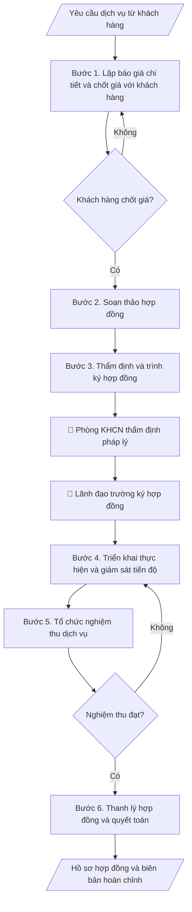

# Hồ sơ hợp đồng dịch vụ KHCN

## Quy cách đầu ra và thông tin thiếu

Đọc [quy cách và cấu trúc sản phẩm](references/quy-cach-dau-ra.md) trước khi soạn/xuất. File giao chỉ gồm văn bản hoặc sản phẩm nghiệp vụ được yêu cầu; kiểm tra nội bộ không xuất kèm. Thiếu thông tin giữ nguyên trường/mục và chỗ điền theo mẫu gốc (dòng dấu chấm, dấu gạch hoặc ô trống); không tự điền dữ liệu mẫu, số 0, mã chờ xác minh hoặc dòng chờ ký. Mẫu chuyên ngành còn áp dụng được ưu tiên về cấu trúc, mã biểu và người ký. Các trường “bắt buộc” là điều kiện hoàn thiện hồ sơ, không ngăn việc soạn bản có chỗ chừa để điền. Mọi chỉ dẫn “để trống” trong skill được hiểu là không điền dữ liệu và giữ cách chừa chỗ của mẫu gốc, không phải xóa dấu chấm của mẫu.

## Kiểm soát áp dụng và phê duyệt

Trước khi chạy quy trình, xác định `ngay_ap_dung`, `loai_hinh_truong`, `quy_che_noi_bo`, `nguon_du_lieu` và `nguoi_kiem_duyet`. Chỉ yêu cầu thông tin có liên quan đến nghiệp vụ; không dùng giá trị giả định thay dữ liệu bắt buộc. Đối chiếu nội bộ hồ sơ có yếu tố pháp lý với văn bản gốc, hiệu lực, điều khoản áp dụng và chuyển tiếp; không tự đính kèm bảng kiểm tra vào file giao.

## Giới hạn và human gate

AI hỗ trợ chuẩn bị và đối chiếu. Cán bộ phụ trách kiểm tra dữ liệu/căn cứ, người có thẩm quyền duyệt và ký. Văn bản soạn chưa được coi là đã ban hành; không tự chèn nhãn trạng thái kiểm duyệt vào file giao; không đánh dấu đã ký, đã duyệt hoặc đã công bố nếu chưa có chứng cứ. Dữ liệu sinh viên, sức khỏe, nhân sự và tài chính phải hạn chế theo mục đích, phân quyền và che thông tin định danh khi dùng ví dụ. Không tải dữ liệu lên dịch vụ ngoài khi chưa có quyền. Kiểm tra Luật 91/2025/QH15 về bảo vệ dữ liệu cá nhân (hiệu lực 01/01/2026) và quy định áp dụng trước xử lý/chia sẻ dữ liệu cá nhân.

## Khi nào dùng
Khi trung tâm/viện/phòng KHCN của trường cung cấp dịch vụ cho tổ chức, doanh nghiệp bên ngoài:
tư vấn kỹ thuật, phân tích – kiểm nghiệm mẫu, chuyển giao công nghệ, đào tạo theo đặt hàng...
cần lập báo giá, ký hợp đồng, nghiệm thu và thanh lý đúng quy định.

## Đầu vào (Input)

| Trường | Mô tả | Bắt buộc |
|---|---|---|
| `ten_dich_vu` | Tên dịch vụ KHCN cung cấp | Có |
| `khach_hang` | Tên, địa chỉ, người đại diện của bên thuê dịch vụ | Có |
| `don_vi_thuc_hien` | Đơn vị của trường thực hiện dịch vụ | Có |
| `pham_vi_cong_viec` | Nội dung công việc chi tiết, sản phẩm bàn giao | Có |
| `don_gia` | Báo giá chi tiết theo hạng mục | Có |
| `thoi_gian` | Thời gian thực hiện, các mốc bàn giao | Có |
| `dieu_khoan_thanh_toan` | Tạm ứng, thanh toán theo tiến độ, giữ lại | Không (mặc định: tạm ứng 30%, quyết toán sau nghiệm thu) |

## Quy trình

**Bước 1. Lập báo giá chi tiết và chốt giá với khách hàng**
- Làm gì: Bóc tách `pham_vi_cong_viec` thành các hạng mục công việc; mỗi hạng mục ghi: nội
  dung, đơn vị tính, số lượng, đơn giá, thành tiền; cộng tổng giá trị, ghi rõ đã/chưa bao
  gồm VAT; gửi khách hàng, thương thảo và chốt giá trị hợp đồng bằng văn bản (email xác
  nhận hoặc biên bản làm việc).
- Dùng input: `ten_dich_vu`, `pham_vi_cong_viec`, `don_gia`, `khach_hang`.
- Vai trò: Chuyên viên dịch vụ KHCN · AI hỗ trợ: bóc tách hạng mục và lập bảng báo giá dự thảo, đơn vị chốt đơn giá theo biểu giá đã duyệt · ⏱ 1–2 giờ (ước tính)
- Lưu ý nghiệp vụ: đơn giá theo biểu giá dịch vụ đã được trường phê duyệt (nếu có); chi
  phí phát sinh ngoài phạm vi phải ghi rõ cách tính ngay từ báo giá; không báo giá miệng —
  mọi chốt giá phải có văn bản để đối chiếu khi quyết toán.
- → Kết quả bước: Bảng báo giá chi tiết đã được khách hàng xác nhận bằng văn bản.

**Bước 2. Soạn thảo hợp đồng**
- Làm gì: Soạn hợp đồng đầy đủ các điều khoản bắt buộc: thông tin hai bên, đối tượng và
  phạm vi công việc, sản phẩm bàn giao, giá trị hợp đồng, tiến độ và các mốc bàn giao,
  điều khoản thanh toán, nghiệm thu, bảo hành/bảo mật, phạt vi phạm, chấm dứt hợp đồng,
  hiệu lực.
- Dùng input: `ten_dich_vu`, `khach_hang`, `don_vi_thuc_hien`, `pham_vi_cong_viec`,
  `don_gia`, `thoi_gian`, `dieu_khoan_thanh_toan`.
- Vai trò: Chuyên viên dịch vụ KHCN · AI hỗ trợ: soạn dự thảo hợp đồng theo mẫu chuẩn của trường · ⏱ 1–2 giờ (ước tính)
- Lưu ý nghiệp vụ: dùng mẫu hợp đồng chuẩn của trường (nếu có); số liệu giá trị, tiến độ
  phải khớp báo giá đã chốt ở bước 1; điều khoản phạt vi phạm phải cân đối hai chiều
  (cả bên cung cấp và bên thuê).
- → Kết quả bước: Dự thảo hợp đồng dịch vụ KHCN.

**Bước 3. Thẩm định và trình ký hợp đồng**
- Làm gì: Đơn vị thực hiện tự rà soát dự thảo → gửi phòng KHCN thẩm định tính pháp lý →
  trình lãnh đạo trường ký theo phân cấp ủy quyền; sau khi hai bên ký, lưu số hợp đồng,
  ngày ký, bản chính.
- Dùng input: (dự thảo hợp đồng — kết quả bước 2).
- Vai trò: Viện trưởng · AI hỗ trợ: tổng hợp danh mục kiểm tra, đối chiếu hồ sơ · ⏱ 3–5 ngày làm việc (ước tính)
- Lưu ý nghiệp vụ: kiểm tra người ký đúng thẩm quyền theo giá trị hợp đồng (phân cấp);
  hợp đồng chỉ có hiệu lực khi đủ chữ ký hai bên và đóng dấu; mỗi bên giữ ít nhất 01 bản
  chính.
- → Kết quả bước: Hợp đồng đã ký, đóng dấu (bản chính lưu tại đơn vị và phòng KHCN).

**Bước 4. Triển khai thực hiện và giám sát tiến độ**
- Làm gì: Lập kế hoạch triển khai chi tiết theo các mốc trong hợp đồng; theo dõi tiến độ
  từng hạng mục; lập biên bản làm việc/bàn giao từng phần có chữ ký hai bên (nếu hợp đồng
  chia nhiều đợt); ghi nhận phát sinh (nếu có) và xử lý theo điều khoản hợp đồng.
- Dùng input: `thoi_gian`, `pham_vi_cong_viec`.
- Vai trò: Chuyên viên dịch vụ KHCN · AI hỗ trợ: soạn nhật ký theo dõi và nhắc mốc · ⏱ 30–60 phút mỗi đợt theo dõi (ước tính)
- Lưu ý nghiệp vụ: mọi thay đổi phạm vi/tiến độ phải lập phụ lục hợp đồng, không thỏa
  thuận miệng; chậm mốc nào phải báo ngay cho khách hàng và ghi vào biên bản làm việc.
- → Kết quả bước: Nhật ký triển khai + biên bản bàn giao từng phần (nếu có).

**Bước 5. Tổ chức nghiệm thu dịch vụ**
- Làm gì: Thành lập hội đồng nghiệm thu có đại diện hai bên; kiểm tra sản phẩm bàn giao
  đối chiếu từng nội dung trong hợp đồng (số lượng, chất lượng, thời hạn); lập biên bản
  nghiệm thu ghi rõ: đạt/không đạt từng hạng mục, tồn tại cần khắc phục (nếu có) và thời
  hạn khắc phục.
- Dùng input: `pham_vi_cong_viec`, `thoi_gian` (làm tiêu chí nghiệm thu).
- Vai trò: Hội đồng nghiệm thu · AI hỗ trợ: tổng hợp danh mục kiểm tra, đối chiếu hồ sơ · ⏱ 0,5–1 ngày làm việc (ước tính)
- Lưu ý nghiệp vụ: chỉ nghiệm thu khi đủ sản phẩm theo hợp đồng; nếu không đạt, ghi rõ
  nội dung phải làm lại và hạn hoàn thành — không ký "nghiệm thu có điều kiện" chung chung.
- → Kết quả bước: Biên bản nghiệm thu dịch vụ (hai bên ký).

**Bước 6. Thanh lý hợp đồng và quyết toán**
- Làm gì: Đối chiếu giá trị thực hiện với hợp đồng (trừ tạm ứng đã nhận, phạt vi phạm nếu
  có); lập biên bản thanh lý hợp đồng; xuất hóa đơn VAT; hạch toán doanh thu và thực hiện
  nghĩa vụ tài chính theo quy định của trường; lưu trọn bộ hồ sơ.
- Dùng input: `dieu_khoan_thanh_toan`, `don_gia` (giá trị quyết toán).
- Vai trò: Chuyên viên dịch vụ KHCN · AI hỗ trợ: đối chiếu số liệu và soạn biên bản thanh lý, kế toán đối chiếu và xuất hóa đơn · ⏱ 1–2 giờ (ước tính)
- Lưu ý nghiệp vụ: chỉ thanh lý khi đã nghiệm thu đạt và đã thu đủ tiền (hoặc có cam kết
  thanh toán bằng văn bản); đối chiếu số liệu với phòng Tài chính trước khi xuất hóa đơn.
- → Kết quả bước: Biên bản thanh lý hợp đồng + hồ sơ quyết toán đầy đủ.

## Luồng quy trình (Workflow)

## Đầu ra

Sản phẩm nghiệp vụ hoàn chỉnh theo [quy cách và cấu trúc](references/quy-cach-dau-ra.md), giữ các trường chưa có dữ liệu ở trạng thái trống. Không xuất kèm checklist/phụ lục kiểm tra đầu ra.

## Kiểm tra nội bộ trước khi giao

- [ ] Bố cục khớp mẫu áp dụng và cấu trúc tại references/quy-cach-dau-ra.md.
- [ ] Số liệu (giá trị, tiến độ) khớp với Input (báo giá, phạm vi công việc) đã cho.
- [ ] Không bịa đặt chữ ký, biên bản nghiệm thu hay xác nhận thanh toán không có thật.
- [ ] Báo giá chốt bằng văn bản của khách hàng; ghi rõ đã/chưa bao gồm VAT.
- [ ] Hợp đồng đầy đủ các điều khoản bắt buộc; người ký đúng thẩm quyền theo phân cấp; đủ chữ ký hai bên và đóng dấu.
- [ ] Nghiệm thu đối chiếu từng hạng mục hợp đồng; tồn tại cần khắc phục có hạn hoàn thành cụ thể.
- [ ] Thanh lý chỉ khi đã nghiệm thu đạt và đã thu đủ tiền (hoặc có cam kết thanh toán bằng văn bản).
- [ ] Căn cứ pháp lý đầy đủ, còn hiệu lực: Luật Khoa học và Công nghệ, quy định nội bộ về hoạt động dịch vụ KHCN.
- [ ] Đã qua Human gate: phòng KHCN thẩm định pháp lý, lãnh đạo trường ký hợp đồng, hội đồng hai bên ký biên bản nghiệm thu.

Tiêu chí đạt = tất cả các ô được đánh dấu.

## Human gate
- **Lãnh đạo đơn vị thực hiện** thẩm định phạm vi công việc và báo giá trước khi trình.
- **Phòng KHCN** thẩm định tính pháp lý của hợp đồng.
- **Lãnh đạo trường** (theo phân cấp ủy quyền) ký hợp đồng; **hội đồng nghiệm thu 2 bên**
  ký biên bản nghiệm thu dịch vụ.

## Giới hạn
- AI không tự quyết giá dịch vụ thay đơn vị (giá do đơn vị đề xuất, lãnh đạo phê duyệt).
- Không cam kết tiến độ/chất lượng vượt năng lực thực tế của đơn vị.
- Không thay kế toán lập chứng từ thanh toán, xuất hóa đơn.

## Căn cứ & lưu ý
- Luật Khoa học và Công nghệ; quy định nội bộ về hoạt động dịch vụ KHCN của trường.
- Không dùng tên thật của trường/tổ chức/cá nhân khi mô phỏng.

## Quản trị phiên bản

- Phiên bản gói: `1.2.1`; ngày cập nhật: `2026-10-10`.
- Kho nguồn: https://github.com/phamtruong91/university-skills-framework
- Người duy trì trên GitHub: `phamtruong91` (Phạm Văn Trường). Người phê duyệt nghiệp vụ: **chưa chỉ định**.
- Commit nguồn trước cập nhật: `346719e6b0318ed034b4b016703f79733aa575e7`. Commit chứa phiên bản này xem bằng `git log -1 -- skills/ho-so-hop-dong-dich-vu-khcn`; không tự gán SHA chưa tạo.
- Giấy phép: theo LICENSE của kho; bản quyền CES Global.
- Lịch sử 1.1.0: bổ sung metadata giao diện, kiểm soát áp dụng, quản trị phiên bản.
- Trạng thái: dự thảo nghiệp vụ; kiểm tra pháp lý trước thực thi. Ngày cập nhật không đồng nghĩa mọi văn bản đã được rà soát toàn văn.
