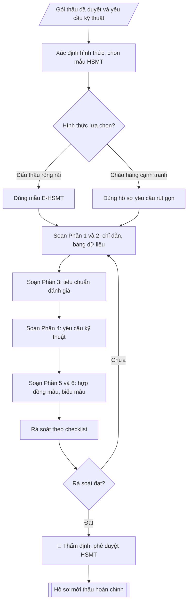

# Skill: Soạn hồ sơ mời thầu mua sắm thiết bị

## Khi nào dùng
Khi cần lập hồ sơ mời thầu (HSMT) hoặc hồ sơ yêu cầu cho gói mua sắm thiết bị đã được
phê duyệt trong kế hoạch mua sắm năm: đấu thầu rộng rãi, chào hàng cạnh tranh, mua sắm trực tiếp.

## Đầu vào (Input)

| Trường | Mô tả | Bắt buộc |
|---|---|---|
| `ten_goi_thau` | Tên gói thầu | Có |
| `chu_dau_tu` | Đơn vị làm chủ đầu tư (thường là trường) | Có |
| `gia_goi_thau` | Giá gói thầu (đồng) | Có |
| `hinh_thuc` | Đấu thầu rộng rãi / Chào hàng cạnh tranh / Mua sắm trực tiếp | Có |
| `tieu_chuan_ky_thuat` | Yêu cầu kỹ thuật của thiết bị (cấu hình, tiêu chuẩn) | Có |
| `tieu_chi_danh_gia` | Tiêu chí đánh giá E-HSDT: kỹ thuật (đạt/không đạt hoặc chấm điểm), giá | Có |
| `thoi_gian` | Thời gian phát hành, đóng thầu, thực hiện hợp đồng | Có |
| `bao_lanh` | Giá trị / hình thức bảo lãnh dự thầu (nếu có) | Không |

## Quy trình

**Bước 1. Xác định hình thức và chọn mẫu hồ sơ**
- Làm gì: căn cứ `hinh_thuc` và `gia_goi_thau`: đấu thầu rộng rãi → dùng mẫu E-HSMT;
  chào hàng cạnh tranh → dùng hồ sơ yêu cầu rút gọn; mua sắm trực tiếp → hồ sơ yêu cầu
  tương ứng; kiểm tra hình thức đã phù hợp với hạn mức và kế hoạch mua sắm đã duyệt.
- Dùng input: `hinh_thuc`, `gia_goi_thau`, `ten_goi_thau`.
- Vai trò: Chuyên viên Phòng Quản trị – Thiết bị · AI hỗ trợ: đối chiếu tự động, cảnh báo sai lệch · ⏱ ~1–2 giờ (ước tính)
- Lưu ý nghiệp vụ: chọn sai mẫu hồ sơ (ví dụ dùng mẫu rút gọn cho gói phải đấu thầu rộng
  rãi) là lỗi hình thức dẫn đến phải làm lại toàn bộ.
- → Kết quả bước: phiếu xác định hình thức (hình thức lựa chọn + mẫu hồ sơ áp dụng).

**Bước 2. Soạn Phần 1 – Chỉ dẫn nhà thầu và Phần 2 – Bảng dữ liệu**
- Làm gì: viết Phần 1 (tư cách hợp lệ của nhà thầu; bảo lãnh dự thầu: giá trị/hình thức
  `bao_lanh`, hiệu lực; ngôn ngữ, đồng tiền dự thầu, hiệu lực HSDT) và Phần 2 – Bảng dữ
  liệu (cụ thể hóa: giá gói thầu, thời điểm phát hành/đóng thầu, thời gian thực hiện hợp
  đồng từ `thoi_gian`, địa điểm, chủ đầu tư `chu_dau_tu`).
- Dùng input: `bao_lanh`, `gia_goi_thau`, `thoi_gian`, `chu_dau_tu`.
- Vai trò: Chuyên viên Phòng Quản trị – Thiết bị · AI hỗ trợ: soạn dự thảo, chuẩn bị bản phát hành · ⏱ ~30–60 phút (ước tính)
- Lưu ý nghiệp vụ: thời gian phát hành – đóng thầu phải tuân thủ thời hạn tối thiểu theo
  quy định tương ứng với từng hình thức; giá trị bảo lãnh dự thầu tính đúng tỷ lệ quy định.
- → Kết quả bước: dự thảo Phần 1 (Chỉ dẫn nhà thầu) và Phần 2 (Bảng dữ liệu).

**Bước 3. Soạn Phần 3 – Tiêu chuẩn đánh giá**
- Làm gì: cụ thể hóa `tieu_chi_danh_gia` thành 4 bước đánh giá theo trình tự: Bước 1 – tính
  hợp lệ của E-HSDT; Bước 2 – năng lực, kinh nghiệm (số hợp đồng tương tự, thời gian);
  Bước 3 – kỹ thuật (đánh giá đạt/không đạt hoặc chấm điểm); Bước 4 – tài chính
  (giá thấp nhất trong số đạt kỹ thuật, hoặc kết hợp kỹ thuật – giá).
- Dùng input: `tieu_chi_danh_gia`.
- Vai trò: Chuyên viên Phòng Quản trị – Thiết bị · AI hỗ trợ: soạn dự thảo, tính toán, phân tích số liệu · ⏱ ~1–2 giờ (ước tính)
- Lưu ý nghiệp vụ: tiêu chí phải rõ ràng, đo lường được, không hạn chế cạnh tranh; tiêu chí
  năng lực, kinh nghiệm không được đặt quá cao so với quy mô gói thầu.
- → Kết quả bước: dự thảo Phần 3 (Tiêu chuẩn đánh giá).

**Bước 4. Soạn Phần 4 – Yêu cầu kỹ thuật**
- Làm gì: lập bảng yêu cầu kỹ thuật chi tiết từ `tieu_chuan_ky_thuat`: danh mục, cấu hình
  tối thiểu từng hạng mục, tiêu chuẩn chất lượng, yêu cầu bảo hành; mỗi chỉ tiêu kỹ thuật
  ghi rõ mức "tối thiểu" để nhà thầu chào.
- Dùng input: `tieu_chuan_ky_thuat`.
- Vai trò: Chuyên viên Phòng Quản trị – Thiết bị · AI hỗ trợ: soạn dự thảo, lập bảng biểu, định dạng · ⏱ ~30–60 phút (ước tính)
- Lưu ý nghiệp vụ: không nêu nhãn hiệu, xuất xứ cụ thể gây hạn chế cạnh tranh — nếu cần
  tham chiếu thì ghi "hoặc tương đương"; yêu cầu kỹ thuật phải khớp với thông số trong kế
  hoạch mua sắm đã duyệt.
- → Kết quả bước: dự thảo Phần 4 (bảng yêu cầu kỹ thuật).

**Bước 5. Soạn Phần 5 – Điều kiện hợp đồng mẫu và Phần 6 – Biểu mẫu dự thầu**
- Làm gì: viết Phần 5 (điều kiện hợp đồng mẫu: giao hàng, nghiệm thu, thanh toán, phạt vi
  phạm, bảo hành) và Phần 6 (biểu mẫu dự thầu: đơn dự thầu, bảng tổng hợp giá, bảng kê chi
  tiết thiết bị, các cam kết).
- Dùng input: `thoi_gian` (tiến độ hợp đồng), `bao_lanh`, kết quả Bước 2 – 4.
- Vai trò: Chuyên viên Phòng Quản trị – Thiết bị · AI hỗ trợ: soạn dự thảo, tổng hợp, chuẩn hóa dữ liệu · ⏱ ~30–60 phút (ước tính)
- Lưu ý nghiệp vụ: điều kiện hợp đồng mẫu phải nhất quán với Phần 2 (thời gian, địa điểm)
  và Phần 4 (bảo hành); biểu mẫu phải đủ để nhà thầu chào giá đầy đủ, tránh thiếu mẫu
  dẫn đến HSDT không hợp lệ.
- → Kết quả bước: dự thảo Phần 5 và Phần 6 (hoàn thành toàn văn HSMT).

**Bước 6. Rà soát HSMT theo checklist**
- Làm gì: rà soát toàn văn HSMT theo checklist: giá gói thầu khớp kế hoạch mua sắm đã phê
  duyệt; tiêu chí kỹ thuật không nêu nhãn hiệu độc quyền (có "hoặc tương đương"); tiêu chí
  đánh giá rõ ràng, không hạn chế cạnh tranh; thời gian phát hành – đóng thầu đúng quy định;
  điều kiện hợp đồng mẫu đầy đủ; đánh dấu từng mục đạt/chưa đạt và ghi điểm cần sửa.
- Dùng input: toàn văn dự thảo Bước 2 – 5.
- Vai trò: Chuyên viên Phòng Quản trị – Thiết bị · AI hỗ trợ: đối chiếu tự động, cảnh báo sai lệch, chuẩn bị bản phát hành · ⏱ ~1–2 giờ (ước tính)
- Lưu ý nghiệp vụ: mọi điểm chưa đạt phải quay lại sửa ở đúng phần tương ứng (Bước 2 – 5),
  không sửa chữa chắp vá làm mất nhất quán giữa các phần.
- → Kết quả bước: checklist rà soát đã đánh dấu + danh sách điểm cần sửa (nếu có).

**Bước 7. Trình thẩm định, phê duyệt trước khi phát hành**
- Làm gì: trình HSMT đã rà soát để thẩm định và phê duyệt theo thẩm quyền; chỉ phát hành
  sau khi có phê duyệt bằng văn bản.
- Dùng input: kết quả Bước 6.
- Vai trò: Chuyên viên Phòng Quản trị – Thiết bị · AI hỗ trợ: đối chiếu tự động, cảnh báo sai lệch, chuẩn bị hồ sơ trình đầy đủ · ⏱ ~1–3 giờ (ước tính)
- Lưu ý nghiệp vụ: HSMT chưa được phê duyệt mà phát hành là vi phạm trình tự lựa chọn
  nhà thầu.
- → Kết quả bước: hồ sơ mời thầu / hồ sơ yêu cầu hoàn chỉnh, đã phê duyệt.

## Luồng quy trình (Workflow)



## Đầu ra (Output)
- Hồ sơ mời thầu / hồ sơ yêu cầu hoàn chỉnh.
- Checklist rà soát HSMT trước khi phát hành.

**Cấu trúc output chuẩn:** khung mẫu cố định của hồ sơ mời thầu, các phần theo đúng thứ
tự xuất hiện:
1. Bìa hồ sơ (tên gói thầu, chủ đầu tư, hình thức lựa chọn nhà thầu);
2. Phần 1: Chỉ dẫn nhà thầu (tư cách hợp lệ, bảo lãnh dự thầu, ngôn ngữ, đồng tiền,
   hiệu lực HSDT);
3. Phần 2: Bảng dữ liệu (giá gói thầu, thời điểm phát hành/đóng thầu, thời gian thực hiện
   hợp đồng, địa điểm);
4. Phần 3: Tiêu chuẩn đánh giá (hợp lệ → năng lực, kinh nghiệm → kỹ thuật → tài chính);
5. Phần 4: Yêu cầu kỹ thuật (bảng: hạng mục, yêu cầu tối thiểu, bảo hành);
6. Phần 5: Điều kiện hợp đồng mẫu;
7. Phần 6: Biểu mẫu dự thầu;
8. (Kèm theo) Checklist rà soát HSMT trước khi phát hành.

## Checklist nghiệm thu

- [ ] Đủ các phần theo "Cấu trúc output chuẩn": Bìa hồ sơ (tên gói thầu, chủ đầu tư, hình…; Phần 1; Phần 2; Phần 3; Phần 4; Phần 5; …
- [ ] Có đầy đủ sản phẩm: Hồ sơ mời thầu / hồ sơ yêu cầu hoàn chỉnh
- [ ] Có đầy đủ sản phẩm: Checklist rà soát HSMT trước khi phát hành
- [ ] Mọi số liệu, tên, ngày tháng trong output khớp với Input đã cung cấp (không thêm bớt, không suy đoán)
- [ ] Không bịa đặt số liệu, minh chứng, trích dẫn hay căn cứ
- [ ] Đúng thể thức, định dạng văn bản theo quy định hiện hành
- [ ] Căn cứ pháp lý nêu đầy đủ, còn hiệu lực tại thời điểm lập
- [ ] Đã qua Human gate: người có thẩm quyền đã kiểm tra/ký duyệt trước khi phát hành
- [ ] Chọn sai mẫu hồ sơ (ví dụ dùng mẫu rút gọn cho gói phải đấu thầu rộng
- [ ] Thời gian phát hành – đóng thầu phải tuân thủ thời hạn tối thiểu theo

> Tiêu chí đạt: tất cả các ô đều được đánh dấu.

## Ví dụ mô phỏng (dữ liệu giả lập)

> Tất cả tên trường, cá nhân, số liệu dưới đây đều là **giả lập**, không liên quan tổ chức/cá nhân có thật.

### Input mẫu

| Trường | Giá trị |
|---|---|
| `ten_goi_thau` | Mua sắm 40 máy tính để bàn cho phòng Lab A2 |
| `chu_dau_tu` | Trường Đại học A |
| `gia_goi_thau` | 2.400.000.000 đồng |
| `hinh_thuc` | Chào hàng cạnh tranh qua mạng |
| `tieu_chuan_ky_thuat` | CPU Core i5 thế hệ 13 trở lên, RAM 16GB, SSD 512GB, màn hình 24 inch; bảo hành 36 tháng |
| `tieu_chi_danh_gia` | Kỹ thuật: đạt/không đạt; Tài chính: giá thấp nhất trong số đạt kỹ thuật |
| `thoi_gian` | Phát hành: 10/03/2026; Đóng thầu: 20/03/2026; Thực hiện hợp đồng: 30 ngày |
| `bao_lanh` | 30.000.000 đồng (thư bảo lãnh ngân hàng) |

### Output mẫu (trích các phần chính)

```
HỒ SƠ YÊU CẦU
Gói thầu: Mua sắm 40 máy tính để bàn cho phòng Lab A2
Chủ đầu tư: Trường Đại học A
(Dữ liệu giả lập)

PHẦN 1. CHỈ DẪN NHÀ THẦU
1. Nhà thầu có tư cách hợp lệ theo quy định của Luật Đấu thầu.
2. Bảo lãnh dự thầu: 30.000.000 đồng bằng thư bảo lãnh của ngân hàng,
   hiệu lực 60 ngày kể từ thời điểm đóng thầu.
3. Ngôn ngữ: tiếng Việt. Đồng tiền dự thầu: VND.

PHẦN 2. BẢNG DỮ LIỆU
- Giá gói thầu: 2.400.000.000 đồng.
- Thời điểm đóng thầu: 09 giờ 00, ngày 20/03/2026 (qua mạng).
- Thời gian thực hiện hợp đồng: 30 ngày kể từ ngày hợp đồng có hiệu lực.

PHẦN 3. TIÊU CHUẨN ĐÁNH GIÁ
Bước 1 – Tính hợp lệ của E-HSDT.
Bước 2 – Năng lực, kinh nghiệm: đã thực hiện ít nhất 01 hợp đồng cung cấp
         thiết bị CNTT tương tự trong 03 năm gần nhất.
Bước 3 – Kỹ thuật: đánh giá Đạt / Không đạt theo bảng yêu cầu kỹ thuật.
Bước 4 – Tài chính: xếp hạng theo giá chào thấp nhất trong số nhà thầu
         đạt kỹ thuật.

PHẦN 4. YÊU CẦU KỸ THUẬT (tóm tắt)
| STT | Hạng mục | Yêu cầu tối thiểu |
|-----|----------|-------------------|
| 1 | CPU | Core i5 thế hệ 13 trở lên (hoặc tương đương) |
| 2 | RAM | 16GB DDR4 |
| 3 | Ổ cứng | SSD 512GB |
| 4 | Màn hình | 24 inch, Full HD |
| 5 | Bảo hành | 36 tháng tại nơi sử dụng |

PHẦN 5. ĐIỀU KIỆN HỢP ĐỒNG MẪU: (giao hàng, nghiệm thu, thanh toán 02 đợt,
phạt vi phạm 8% giá trị phần vi phạm...)

PHẦN 6. BIỂU MẪU DỰ THẦU: Đơn dự thầu; Bảng tổng hợp giá; Bảng kê chi tiết
thiết bị; Cam kết bảo hành; Cam kết không vi phạm...
```

### Checklist rà soát HSMT (output kèm theo)
- [x] Giá gói thầu khớp kế hoạch mua sắm đã phê duyệt
- [x] Tiêu chí kỹ thuật không nêu nhãn hiệu độc quyền (có "hoặc tương đương")
- [x] Tiêu chí đánh giá rõ ràng, không hạn chế cạnh tranh
- [x] Thời gian phát hành – đóng thầu đúng quy định
- [x] Điều kiện hợp đồng mẫu đầy đủ

## Căn cứ & lưu ý
- Luật Đấu thầu 2023 và các thông tư hướng dẫn về mẫu HSMT.
- HSMT phải được thẩm định, phê duyệt trước khi phát hành.
- Không dùng tên thật của trường/cá nhân khi mô phỏng.
