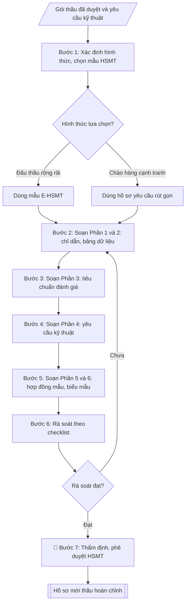

# Soạn hồ sơ mời thầu mua sắm thiết bị

## Định dạng và file đầu ra
Định dạng đầu ra có thể chọn theo sản phẩm/yêu cầu: .docx, .pdf. Đọc mục “Định dạng bổ sung” trong quy cách đầu ra trước khi chọn.

**Phải tạo file thực tế để tải xuống, không chỉ trả nội dung trong chat.** Định dạng mặc định của skill: **.docx**. Nếu có bảng số liệu nghiệp vụ yêu cầu file bảng tính riêng, tạo thêm Excel theo yêu cầu; không tự tạo file kiểm tra. Không chờ người dùng yêu cầu xuất file lần nữa. Ưu tiên định dạng người dùng chỉ định; đọc quy tắc xuất file tại references/quy-cach-dau-ra.md.

## Quy cách đầu ra và thông tin thiếu
Đọc [quy cách và cấu trúc sản phẩm](references/quy-cach-dau-ra.md) trước khi soạn/xuất. File giao chỉ gồm sản phẩm nghiệp vụ được yêu cầu; kiểm tra nội bộ không xuất kèm. Thiếu thông tin thì giữ nguyên trường/mục và chỗ điền theo mẫu gốc (dòng dấu chấm, dấu gạch hoặc ô trống); không tự điền dữ liệu mẫu, số 0, mã chờ xác minh hay dòng chờ ký. Mẫu chuyên ngành còn áp dụng được ưu tiên về cấu trúc, mã biểu và người ký. Bản đầy đủ: [quy tắc chung](references/quy-tac-chung.md).

## Kiểm soát áp dụng và phê duyệt
Trước khi chạy, xác định `ngay_ap_dung`, `loai_hinh_truong`, `quy_che_noi_bo`, `nguon_du_lieu`, `nguoi_kiem_duyet`; chỉ hỏi thông tin liên quan nghiệp vụ, không dùng giá trị giả định thay dữ liệu bắt buộc. Đối chiếu căn cứ pháp lý với văn bản gốc, hiệu lực, điều khoản áp dụng và chuyển tiếp. Bản đầy đủ: [quy tắc chung](references/quy-tac-chung.md).

Nếu có cập nhật pháp lý dưới đây, đọc [căn cứ và điều kiện áp dụng](references/phap-ly.md) trước khi làm. Quy trình dưới đây giữ nghiệp vụ từ bản gốc; mọi viện dẫn văn bản, mẫu biểu, điều khoản phải theo căn cứ đã chọn trong phap-ly.md, không theo văn bản cũ.

## Giới hạn và human gate
AI hỗ trợ chuẩn bị và đối chiếu; cán bộ phụ trách kiểm tra dữ liệu/căn cứ, người có thẩm quyền duyệt và ký. Không đánh dấu đã ký, đã duyệt, đã công bố khi chưa có chứng cứ. Dữ liệu sinh viên, sức khỏe, nhân sự, tài chính chỉ dùng theo mục đích và phân quyền, che thông tin định danh khi dùng ví dụ (Luật 91/2025/QH15, hiệu lực 01/01/2026); không tải dữ liệu lên dịch vụ ngoài khi chưa có quyền. Bản đầy đủ: [quy tắc chung](references/quy-tac-chung.md).

## Khi nào dùng
Khi cần lập hồ sơ mời thầu (HSMT) hoặc hồ sơ yêu cầu cho gói mua sắm thiết bị đã được
phê duyệt trong kế hoạch mua sắm năm: đấu thầu rộng rãi, chào hàng cạnh tranh, mua sắm trực tiếp.

## Đầu vào (Input)
| Trường | Mô tả | Bắt buộc |
|---|---|---|
| `ten_goi_thau` | Tên gói thầu | Có |
| `chu_dau_tu` | Đơn vị làm chủ đầu tư (thường là trường) | Có |
| `gia_goi_thau` | Giá gói thầu (đồng) | Có |
| `hinh_thuc` | Đấu thầu rộng rãi / Chào hàng cạnh tranh / Mua sắm trực tiếp | Có |
| `tieu_chuan_ky_thuat` | Yêu cầu kỹ thuật của thiết bị (cấu hình, tiêu chuẩn) | Có |
| `tieu_chi_danh_gia` | Tiêu chí đánh giá E-HSDT: kỹ thuật (đạt/không đạt hoặc chấm điểm), giá | Có |
| `thoi_gian` | Thời gian phát hành, đóng thầu, thực hiện hợp đồng | Có |
| `bao_lanh` | Giá trị / hình thức bảo lãnh dự thầu (nếu có) | Không |

## Quy trình
**Ràng buộc pháp lý khi thực hiện** (trích references/phap-ly.md; đối chiếu toàn văn và hiệu lực tại ngày nghiệp vụ):
- Nghị định 214/2025, sửa đổi 165/2026, 170/2026, 349/2026; VBHN 36/2026/VBHN-NĐ-BTC ngày 23/09/2026: Yêu cầu chủ thể, nguồn vốn, loại gói, dự toán được duyệt, phân cấp thẩm quyền, mua sắm tập trung, điều kiện áp dụng hình thức và thời điểm phát hành. Đối chiếu Luật Đấu thầu hợp nhất 74/VBHN-VPQH ngày 25/03/2026 và nghị định hiện hành. Không suy ra chỉ định thầu/mua sắm trực tiếp chỉ vì nhỏ lẻ hoặc cấp bách; ghi điều khoản và điều kiện từng gói, cán bộ thẩm định xác nhận. Không tự đặt hạn mức.
- Trước Bước 1: chọn căn cứ theo đối tượng, loại hình trường và chuyển tiếp; lập bảng văn bản / điều khoản / lý do áp dụng / bằng chứng. Thiếu văn bản gốc hoặc điều khoản thì ghi nhận nội bộ [CẦN XÁC MINH] (không đưa vào file giao), để trống phần tương ứng, chưa kết luận tuân thủ.

**Bước 1. Xác định hình thức và chọn mẫu hồ sơ**
- Làm gì: căn cứ `hinh_thuc` và `gia_goi_thau`: đấu thầu rộng rãi → dùng mẫu E-HSMT;
  chào hàng cạnh tranh → dùng hồ sơ yêu cầu rút gọn; mua sắm trực tiếp → hồ sơ yêu cầu
  tương ứng; kiểm tra hình thức đã phù hợp với hạn mức và kế hoạch mua sắm đã duyệt.
- Dùng input: `hinh_thuc`, `gia_goi_thau`, `ten_goi_thau`.
- Vai trò: Chuyên viên Phòng Quản trị – Thiết bị · AI hỗ trợ: đối chiếu tự động, cảnh báo sai lệch · ⏱ ~1–2 giờ (ước tính)
- Lưu ý nghiệp vụ: chọn sai mẫu hồ sơ (ví dụ dùng mẫu rút gọn cho gói phải đấu thầu rộng
  rãi) là lỗi hình thức dẫn đến phải làm lại toàn bộ.
- → Kết quả bước: phiếu xác định hình thức (hình thức lựa chọn + mẫu hồ sơ áp dụng).

**Bước 2. Soạn Phần 1 – Chỉ dẫn nhà thầu và Phần 2 – Bảng dữ liệu**
- Làm gì: viết Phần 1 (tư cách hợp lệ của nhà thầu; bảo lãnh dự thầu: giá trị/hình thức
  `bao_lanh`, hiệu lực; ngôn ngữ, đồng tiền dự thầu, hiệu lực HSDT) và Phần 2 – Bảng dữ
  liệu (cụ thể hóa: giá gói thầu, thời điểm phát hành/đóng thầu, thời gian thực hiện hợp
  đồng từ `thoi_gian`, địa điểm, chủ đầu tư `chu_dau_tu`).
- Dùng input: `bao_lanh`, `gia_goi_thau`, `thoi_gian`, `chu_dau_tu`.
- Vai trò: Chuyên viên Phòng Quản trị – Thiết bị · AI hỗ trợ: soạn dự thảo, chuẩn bị bản phát hành · ⏱ ~30–60 phút (ước tính)
- Lưu ý nghiệp vụ: thời gian phát hành – đóng thầu phải tuân thủ thời hạn tối thiểu theo
  quy định tương ứng với từng hình thức; giá trị bảo lãnh dự thầu tính đúng tỷ lệ quy định.
- → Kết quả bước: dự thảo Phần 1 (Chỉ dẫn nhà thầu) và Phần 2 (Bảng dữ liệu).

**Bước 3. Soạn Phần 3 – Tiêu chuẩn đánh giá**
- Làm gì: cụ thể hóa `tieu_chi_danh_gia` thành 4 bước đánh giá theo trình tự: Bước 1 – tính
  hợp lệ của E-HSDT; Bước 2 – năng lực, kinh nghiệm (số hợp đồng tương tự, thời gian);
  Bước 3 – kỹ thuật (đánh giá đạt/không đạt hoặc chấm điểm); Bước 4 – tài chính
  (giá thấp nhất trong số đạt kỹ thuật, hoặc kết hợp kỹ thuật – giá).
- Dùng input: `tieu_chi_danh_gia`.
- Vai trò: Chuyên viên Phòng Quản trị – Thiết bị · AI hỗ trợ: soạn dự thảo, tính toán, phân tích số liệu · ⏱ ~1–2 giờ (ước tính)
- Lưu ý nghiệp vụ: tiêu chí phải rõ ràng, đo lường được, không hạn chế cạnh tranh; tiêu chí
  năng lực, kinh nghiệm không được đặt quá cao so với quy mô gói thầu.
- → Kết quả bước: dự thảo Phần 3 (Tiêu chuẩn đánh giá).

**Bước 4. Soạn Phần 4 – Yêu cầu kỹ thuật**
- Làm gì: lập bảng yêu cầu kỹ thuật chi tiết từ `tieu_chuan_ky_thuat`: danh mục, cấu hình
  tối thiểu từng hạng mục, tiêu chuẩn chất lượng, yêu cầu bảo hành; mỗi chỉ tiêu kỹ thuật
  ghi rõ mức "tối thiểu" để nhà thầu chào.
- Dùng input: `tieu_chuan_ky_thuat`.
- Vai trò: Chuyên viên Phòng Quản trị – Thiết bị · AI hỗ trợ: soạn dự thảo, lập bảng biểu, định dạng · ⏱ ~30–60 phút (ước tính)
- Lưu ý nghiệp vụ: không nêu nhãn hiệu, xuất xứ cụ thể gây hạn chế cạnh tranh — nếu cần
  tham chiếu thì ghi "hoặc tương đương"; yêu cầu kỹ thuật phải khớp với thông số trong kế
  hoạch mua sắm đã duyệt.
- → Kết quả bước: dự thảo Phần 4 (bảng yêu cầu kỹ thuật).

**Bước 5. Soạn Phần 5 – Điều kiện hợp đồng mẫu và Phần 6 – Biểu mẫu dự thầu**
- Làm gì: viết Phần 5 (điều kiện hợp đồng mẫu: giao hàng, nghiệm thu, thanh toán, phạt vi
  phạm, bảo hành) và Phần 6 (biểu mẫu dự thầu: đơn dự thầu, bảng tổng hợp giá, bảng kê chi
  tiết thiết bị, các cam kết).
- Dùng input: `thoi_gian` (tiến độ hợp đồng), `bao_lanh`, kết quả Bước 2 – 4.
- Vai trò: Chuyên viên Phòng Quản trị – Thiết bị · AI hỗ trợ: soạn dự thảo, tổng hợp, chuẩn hóa dữ liệu · ⏱ ~30–60 phút (ước tính)
- Lưu ý nghiệp vụ: điều kiện hợp đồng mẫu phải nhất quán với Phần 2 (thời gian, địa điểm)
  và Phần 4 (bảo hành); biểu mẫu phải đủ để nhà thầu chào giá đầy đủ, tránh thiếu mẫu
  dẫn đến HSDT không hợp lệ.
- → Kết quả bước: dự thảo Phần 5 và Phần 6 (hoàn thành toàn văn HSMT).

**Bước 6. Rà soát HSMT theo checklist**
- Làm gì: rà soát toàn văn HSMT theo checklist: giá gói thầu khớp kế hoạch mua sắm đã phê
  duyệt; tiêu chí kỹ thuật không nêu nhãn hiệu độc quyền (có "hoặc tương đương"); tiêu chí
  đánh giá rõ ràng, không hạn chế cạnh tranh; thời gian phát hành – đóng thầu đúng quy định;
  điều kiện hợp đồng mẫu đầy đủ; đánh dấu từng mục đạt/chưa đạt và ghi điểm cần sửa.
- Dùng input: toàn văn dự thảo Bước 2 – 5.
- Vai trò: Chuyên viên Phòng Quản trị – Thiết bị · AI hỗ trợ: đối chiếu tự động, cảnh báo sai lệch, chuẩn bị bản phát hành · ⏱ ~1–2 giờ (ước tính)
- Lưu ý nghiệp vụ: mọi điểm chưa đạt phải quay lại sửa ở đúng phần tương ứng (Bước 2 – 5),
  không sửa chữa chắp vá làm mất nhất quán giữa các phần.
- → Kết quả bước: kết quả đối chiếu nội bộ (không xuất kèm file) + danh sách điểm cần sửa (nếu có).

**Bước 7. Trình thẩm định, phê duyệt trước khi phát hành**
- Làm gì: trình HSMT đã rà soát để thẩm định và phê duyệt theo thẩm quyền; chỉ phát hành
  sau khi có phê duyệt bằng văn bản.
- Dùng input: kết quả Bước 6.
- Vai trò: Chuyên viên Phòng Quản trị – Thiết bị · AI hỗ trợ: đối chiếu tự động, cảnh báo sai lệch, chuẩn bị hồ sơ trình đầy đủ · ⏱ ~1–3 giờ (ước tính)
- Lưu ý nghiệp vụ: HSMT chưa được phê duyệt mà phát hành là vi phạm trình tự lựa chọn
  nhà thầu.
- → Kết quả bước: hồ sơ mời thầu / hồ sơ yêu cầu hoàn chỉnh, đã phê duyệt.

## Luồng quy trình (Workflow)

## Đầu ra
- Hồ sơ mời thầu / hồ sơ yêu cầu hoàn chỉnh.
- Checklist rà soát HSMT trước khi phát hành.

**Cấu trúc output chuẩn:** khung mẫu cố định của hồ sơ mời thầu, các phần theo đúng thứ
tự xuất hiện:
1. Bìa hồ sơ (tên gói thầu, chủ đầu tư, hình thức lựa chọn nhà thầu);
2. Phần 1: Chỉ dẫn nhà thầu (tư cách hợp lệ, bảo lãnh dự thầu, ngôn ngữ, đồng tiền,
   hiệu lực HSDT);
3. Phần 2: Bảng dữ liệu (giá gói thầu, thời điểm phát hành/đóng thầu, thời gian thực hiện
   hợp đồng, địa điểm);
4. Phần 3: Tiêu chuẩn đánh giá (hợp lệ → năng lực, kinh nghiệm → kỹ thuật → tài chính);
5. Phần 4: Yêu cầu kỹ thuật (bảng: hạng mục, yêu cầu tối thiểu, bảo hành);
6. Phần 5: Điều kiện hợp đồng mẫu;
7. Phần 6: Biểu mẫu dự thầu;
8. (Kèm theo) Checklist rà soát HSMT trước khi phát hành.

File nghiệp vụ thực tế theo định dạng mặc định ở đầu skill hoặc định dạng người dùng yêu cầu, kèm liên kết tải trong phản hồi cuối.

Sản phẩm nghiệp vụ hoàn chỉnh theo [quy cách và cấu trúc](references/quy-cach-dau-ra.md), giữ các trường chưa có dữ liệu ở trạng thái trống. Không xuất kèm checklist/phụ lục kiểm tra đầu ra.

## Kiểm tra nội bộ trước khi giao
Các tiêu chí sau dùng để tự đối chiếu; không sao chép vào file xuất. Mục thiếu dữ liệu được để trống, không đánh dấu đã đạt hoặc đã duyệt.

- [ ] Đủ các phần theo "Cấu trúc output chuẩn": Bìa hồ sơ (tên gói thầu, chủ đầu tư, hình…; Phần 1; Phần 2; Phần 3; Phần 4; Phần 5; …
- [ ] Có đầy đủ sản phẩm: Hồ sơ mời thầu / hồ sơ yêu cầu hoàn chỉnh
- [ ] Có đầy đủ sản phẩm: Checklist rà soát HSMT trước khi phát hành
- [ ] Mọi số liệu, tên, ngày tháng trong output khớp với Input đã cung cấp (không thêm bớt, không suy đoán)
- [ ] Không bịa đặt số liệu, minh chứng, trích dẫn hay căn cứ
- [ ] Đúng thể thức, định dạng văn bản theo quy định hiện hành
- [ ] Căn cứ pháp lý nêu đầy đủ, còn hiệu lực tại thời điểm lập
- [ ] Đã qua Human gate: người có thẩm quyền đã kiểm tra/ký duyệt trước khi phát hành
- [ ] Chọn sai mẫu hồ sơ (ví dụ dùng mẫu rút gọn cho gói phải đấu thầu rộng
- [ ] Thời gian phát hành – đóng thầu phải tuân thủ thời hạn tối thiểu theo

## Căn cứ & lưu ý
- Luật Đấu thầu 2023 và các thông tư hướng dẫn về mẫu HSMT.
- HSMT phải được thẩm định, phê duyệt trước khi phát hành.
- Không dùng tên thật của trường/cá nhân khi mô phỏng.

## Tư liệu đối chiếu
Bản gốc trước cập nhật pháp lý (kèm ví dụ giả lập) lưu tại `references/quy-trinh-lich-su.md`, chỉ để đối chiếu hồ sơ lịch sử; không dùng căn cứ, mẫu hay số liệu trong đó làm chỉ dẫn hiện hành.

## Quản trị phiên bản
- Phiên bản gói `1.3.2` (cập nhật 2026-10-10); hồ sơ đầy đủ tại [references/version.json](references/version.json).
- Người phê duyệt nghiệp vụ: **chưa chỉ định**. Trạng thái: dự thảo nghiệp vụ; kiểm tra pháp lý trước thực thi. Ngày cập nhật không đồng nghĩa mọi văn bản đã được rà soát toàn văn.
- Giấy phép theo LICENSE của kho (bản quyền CES Global). Lịch sử thay đổi: CHANGELOG.md.
