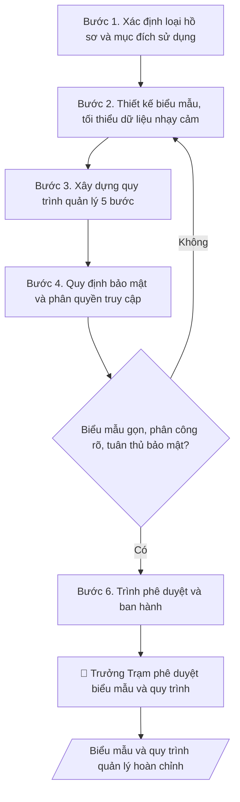

# Skill: Hồ sơ quản lý sức khỏe

## Khi nào dùng
Khi Trạm Y tế cần thiết lập hoặc chuẩn hóa: sổ theo dõi sức khỏe CBVC/sinh viên,
hồ sơ khám sức khỏe định kỳ, hồ sơ tham gia BHYT và quy trình quản lý – bảo mật các hồ sơ này.

## Đầu vào (Input)

| Trường | Mô tả | Bắt buộc |
|---|---|---|
| `doi_tuong` | CBVC / Sinh viên / Cả hai | Có |
| `loai_ho_so` | Sổ theo dõi sức khỏe / Hồ sơ khám định kỳ / Hồ sơ BHYT | Có |
| `truong_thong_tin` | Các trường thông tin cần thu thập (tổng quát, không chi tiết bệnh lý nhạy cảm) | Có |
| `che_do_bao_mat` | Cấp độ truy cập: chỉ Trạm Y tế / chia sẻ hạn chế khi có yêu cầu hợp lệ | Không (mặc định: chỉ Trạm Y tế) |

## Quy trình

**Bước 1. Xác định loại hồ sơ và mục đích sử dụng**
- Làm gì: chốt `loai_ho_so` (sổ theo dõi sức khỏe / hồ sơ khám định kỳ / hồ sơ BHYT)
  và `doi_tuong` áp dụng (CBVC / sinh viên / cả hai); xác định mục đích sử dụng cụ thể
  (theo dõi định kỳ, phục vụ đợt khám, đối chiếu BHYT) để quyết định độ chi tiết
  của biểu mẫu.
- Dùng input: `doi_tuong`, `loai_ho_so`.
- Vai trò: Cán bộ Trạm Y tế · AI hỗ trợ: chốt loại hồ sơ, đối tượng áp dụng và mục đích sử dụng · ⏱ 20–30 phút (ước tính)
- Lưu ý nghiệp vụ: mỗi loại hồ sơ một biểu mẫu riêng — không gộp sổ theo dõi sức khỏe
  chung với hồ sơ BHYT vì mục đích và thời hạn lưu khác nhau; mục đích phải nằm trong
  chức năng y tế học đường của Trạm.
- → Kết quả bước: loại hồ sơ, đối tượng và mục đích sử dụng đã chốt.

**Bước 2. Thiết kế biểu mẫu**
- Làm gì: dựng bảng biểu mẫu từ `truong_thong_tin`; mỗi hồ sơ được cấp mã ẩn danh
  (VD: SK-2026-0001), không dùng họ tên làm khóa chính khi tổng hợp; loại bỏ mọi
  trường thu thập chi tiết bệnh lý nhạy cảm vượt quá phạm vi y tế học đường.
- Dùng input: `truong_thong_tin`, `doi_tuong`, `che_do_bao_mat`.
- Vai trò: Cán bộ Trạm Y tế · AI hỗ trợ: thiết kế dự thảo biểu mẫu với mã ẩn danh · ⏱ 1–2 giờ (ước tính)
- Lưu ý nghiệp vụ: nguyên tắc tối thiểu hóa dữ liệu — chỉ giữ trường thật sự cần cho
  mục đích đã chốt ở Bước 1; cột "ghi chú theo dõi" chỉ ghi chỉ định tái khám/theo dõi,
  không ghi chẩn đoán chi tiết.
- → Kết quả bước: dự thảo biểu mẫu (bảng + mã hồ sơ ẩn danh).

**Bước 3. Xây dựng quy trình quản lý 5 bước**
- Làm gì: viết quy trình theo 5 bước — (1) thu thập: ai lập hồ sơ, khi nào, chữ ký xác
  nhận của người được khám; (2) kiểm tra: người rà soát tính đầy đủ trong thời hạn
  bao lâu; (3) lưu trữ: tủ khóa / file đặt mật khẩu, vị trí lưu; (4) khai thác: thủ tục
  trích xuất, nhật ký truy cập; (5) tiêu hủy: thời hạn lưu, cách tiêu hủy, biên bản.
  Mỗi bước ghi rõ người chịu trách nhiệm.
- Dùng input: `loai_ho_so`, `che_do_bao_mat`.
- Vai trò: Cán bộ Trạm Y tế · AI hỗ trợ: soạn dự thảo quy trình 5 bước có phân công người chịu trách nhiệm · ⏱ 1–2 giờ (ước tính)
- Lưu ý nghiệp vụ: thời hạn lưu hồ sơ sức khỏe tuân thủ quy định lưu trữ của ngành;
  bước khai thác phải phân biệt trích xuất nội bộ Trạm và trích xuất ra ngoài Trạm
  (ngoài Trạm bắt buộc có phê duyệt của Trưởng Trạm).
- → Kết quả bước: dự thảo quy trình quản lý 5 bước có phân công người chịu trách nhiệm.

**Bước 4. Quy định bảo mật và phân quyền truy cập**
- Làm gì: cụ thể hóa `che_do_bao_mat` thành bảng phân quyền (vai trò – được xem gì –
  thủ tục xin trích xuất); quy định cấm sao chụp, mang hồ sơ ra khỏi Trạm khi chưa có
  phê duyệt bằng văn bản của Trưởng Trạm; quy định xử lý khi vi phạm bảo mật.
- Dùng input: `che_do_bao_mat`.
- Vai trò: Trưởng Trạm Y tế · AI hỗ trợ: soạn bảng phân quyền và quy định bảo mật, Trưởng Trạm quyết định chế độ chia sẻ · ⏱ 1–2 giờ (ước tính)
- Lưu ý nghiệp vụ: mặc định "chỉ Trạm Y tế" — mọi chia sẻ hạn chế đều phải có yêu cầu
  hợp lệ bằng văn bản và được Trưởng Trạm phê duyệt từng trường hợp; tuyệt đối không
  dùng dữ liệu sức khỏe để đánh giá, kỷ luật CBVC/sinh viên.
- → Kết quả bước: bảng phân quyền truy cập + quy định bảo mật và xử lý vi phạm.

**Bước 5. Rà soát và hoàn thiện**
- Làm gì: kiểm tra chéo — biểu mẫu đã gọn (không trường thừa), quy trình 5 bước có
  người chịu trách nhiệm rõ ràng ở mỗi bước, quy định bảo mật phù hợp Luật Bảo vệ
  dữ liệu cá nhân 2025; chạy thử trên 3–5 hồ sơ mẫu để phát hiện trường thiếu/trùng.
- Dùng input: toàn bộ dự thảo các bước 2–4.
- Vai trò: Cán bộ Trạm Y tế · AI hỗ trợ: rà soát chéo biểu mẫu – quy trình – bảo mật · ⏱ 1–2 giờ (ước tính)
- Lưu ý nghiệp vụ: nếu chạy thử phát hiện phải bổ sung trường nhạy cảm thì quay lại
  Bước 2 và đánh giá lại tính cần thiết — không thêm trường "cho chắc".
- → Kết quả bước: bộ biểu mẫu + quy trình quản lý dự thảo hoàn chỉnh, đã chạy thử.

**Bước 6. Trình phê duyệt và ban hành**
- Làm gì: trình Trưởng Trạm Y tế phê duyệt biểu mẫu và quy trình; ban hành kèm quyết định
  (ghi số quyết định lên đầu biểu mẫu); phổ biến cho toàn bộ nhân sự Trạm và lưu hồ sơ
  ban hành.
- Dùng input: `loai_ho_so`, `doi_tuong` (để ghi phạm vi áp dụng trong quyết định).
- Vai trò: Trưởng Trạm Y tế · AI hỗ trợ: chuẩn bị dự thảo, tài liệu và số liệu phục vụ bước này · ⏱ 0,5–1 ngày làm việc (ước tính)
- Lưu ý nghiệp vụ: biểu mẫu chỉ có hiệu lực sau khi ban hành — hồ sơ lập trước thời điểm
  ban hành giữ nguyên mẫu cũ, không làm lại; mọi trích xuất hồ sơ ra ngoài Trạm sau này
  đều phải có phê duyệt bằng văn bản của Trưởng Trạm.
- → Kết quả bước: bộ biểu mẫu + quy trình quản lý và bảo mật hồ sơ sức khỏe
  đã phê duyệt, ban hành.

## Luồng quy trình (Workflow)



## Đầu ra (Output)
- Mẫu sổ/biểu mẫu theo dõi sức khỏe (markdown).
- Quy trình quản lý và bảo mật hồ sơ sức khỏe.

**Cấu trúc output chuẩn:** bộ hồ sơ gồm 2 phần, theo đúng thứ tự:
- Phần A — Mẫu biểu:
  1. Tiêu đề đơn vị + tên biểu mẫu + căn cứ ban hành (số quyết định).
  2. Bảng biểu mẫu: các cột theo trường thông tin đã chốt, có cột mã hồ sơ ẩn danh.
  3. Hướng dẫn ghi chép ngắn (ai ghi, ghi khi nào, ký xác nhận).
- Phần B — Quy trình quản lý và bảo mật:
  1. Phạm vi và đối tượng áp dụng.
  2. Quy trình 5 bước: thu thập → kiểm tra → lưu trữ → khai thác → tiêu hủy
     (mỗi bước: người thực hiện, cách làm, thời hạn).
  3. Quy định bảo mật và phân quyền truy cập (ai được xem, thủ tục trích xuất).
  4. Trách nhiệm và xử lý vi phạm.

## Checklist nghiệm thu

- [ ] Đủ 2 phần theo "Cấu trúc output chuẩn": Phần A — Mẫu biểu (tiêu đề + căn cứ ban hành, bảng biểu mẫu có cột mã hồ sơ ẩn danh, hướng dẫn ghi chép) và Phần B — Quy trình quản lý và bảo mật (phạm vi, quy trình 5 bước, bảo mật và phân quyền, trách nhiệm và xử lý vi phạm).
- [ ] Biểu mẫu khớp với Input: đúng đối tượng, loại hồ sơ, trường thông tin đã chốt và chế độ bảo mật.
- [ ] Không bịa đặt số liệu, minh chứng, trích dẫn.
- [ ] Đúng định dạng quy định: số quyết định ban hành ghi đúng trên đầu biểu mẫu.
- [ ] Căn cứ pháp lý đầy đủ, còn hiệu lực (Luật Khám bệnh, chữa bệnh; Luật Bảo vệ dữ liệu cá nhân 2025; quy định y tế trường học).
- [ ] Đã qua Human gate: Trưởng Trạm Y tế phê duyệt biểu mẫu và quy trình trước khi áp dụng.
- [ ] Biểu mẫu tuân thủ nguyên tắc tối thiểu hóa dữ liệu — không thu thập chi tiết bệnh lý nhạy cảm vượt phạm vi y tế học đường.
- [ ] Hồ sơ dùng mã ẩn danh, không dùng họ tên làm khóa chính khi tổng hợp.
- [ ] Quy trình 5 bước ghi rõ người chịu trách nhiệm ở mỗi bước; phân biệt trích xuất nội bộ Trạm và trích xuất ra ngoài Trạm.

Tiêu chí đạt = tất cả các ô được đánh dấu.

## Ví dụ mô phỏng (dữ liệu giả lập)

> Tất cả tên trường (Trường Đại học A), cá nhân, số liệu dưới đây đều là **giả lập**, không liên quan tổ chức/cá nhân có thật.

### Input mẫu

| Trường | Giá trị |
|---|---|
| `doi_tuong` | Sinh viên |
| `loai_ho_so` | Sổ theo dõi sức khỏe |
| `truong_thong_tin` | Mã SV (ẩn danh khi tổng hợp), khoa, năm nhập học, ngày khám, phân loại sức khỏe, ghi chú theo dõi, tình trạng BHYT |
| `che_do_bao_mat` | Chỉ Trạm Y tế |

### Output mẫu

```
TRƯỜNG ĐẠI HỌC A
TRẠM Y TẾ

MẪU SỔ THEO DÕI SỨC KHỎE SINH VIÊN (ban hành kèm Quyết định số .../QĐ-ĐHA)

| STT | Mã hồ sơ | Khoa | Năm NH | Ngày khám | Phân loại SK | Ghi chú theo dõi | BHYT |
|-----|----------|------|--------|-----------|--------------|------------------|------|
| 1 | SK-2026-0001 | CNTT | 2026 | 12/09/2026 | Loại II | Tái khám 6 tháng | Có |
| 2 | SK-2026-0002 | Kinh tế | 2026 | 12/09/2026 | Loại I | — | Có |

Hướng dẫn ghi chép: y sĩ trực tiếp khám lập hồ sơ ngay trong buổi khám; sinh viên
ký xác nhận vào sổ; mã hồ sơ dùng để tra cứu, không dùng họ tên khi tổng hợp.

QUY TRÌNH QUẢN LÝ VÀ BẢO MẬT HỒ SƠ SỨC KHỎE
Phạm vi áp dụng: toàn bộ hồ sơ sức khỏe sinh viên do Trạm Y tế quản lý.
1. Thu thập: Trạm Y tế trực tiếp lập hồ sơ khi khám; sinh viên ký xác nhận.
2. Kiểm tra: y sĩ phụ trách rà soát đầy đủ trường thông tin trong 3 ngày.
3. Lưu trữ: tủ hồ sơ có khóa; file điện tử đặt mật khẩu, chỉ máy tính của Trạm.
4. Khai thác: mọi trích xuất ghi vào nhật ký (người xin – mục đích – thời gian);
   trích xuất ngoài Trạm phải có phê duyệt của Trưởng Trạm.
5. Tiêu hủy: hồ sơ hết thời hạn lưu được tiêu hủy theo quy định, có biên bản.

Bảo mật và phân quyền: chỉ nhân sự Trạm Y tế được truy cập; cấm sao chụp, mang hồ
sơ ra khỏi Trạm khi chưa có phê duyệt bằng văn bản của Trưởng Trạm. Vi phạm bảo
mật bị xử lý theo quy định của trường và pháp luật về bảo vệ dữ liệu cá nhân.
```

## Human gate (người kiểm duyệt)
- Trưởng Trạm Y tế phê duyệt biểu mẫu và quy trình trước khi áp dụng.
- Mọi trích xuất hồ sơ ra ngoài Trạm phải có phê duyệt bằng văn bản của Trưởng Trạm.

## Giới hạn (guardrails)
- **Tuyệt đối không** thiết kế biểu mẫu thu thập thông tin sức khỏe vượt quá phạm vi
  cần thiết cho y tế học đường; không lưu chi tiết bệnh lý nhạy cảm khi không cần.
- **Tuyệt đối không** chia sẻ, xuất hay tổng hợp hồ sơ sức khỏe cá nhân cho bên thứ ba
  (kể cả nội bộ trường) khi chưa có phê duyệt và căn cứ hợp lệ.
- **Tuyệt đối không** dùng dữ liệu sức khỏe để đánh giá, kỷ luật CBVC/sinh viên.
- Mọi dữ liệu trong ví dụ đều giả lập.

## Căn cứ & lưu ý
- Luật Khám bệnh, chữa bệnh; Luật Bảo vệ dữ liệu cá nhân 2025; quy định về y tế trường học.
- Không dùng tên thật của trường/cá nhân khi mô phỏng.
