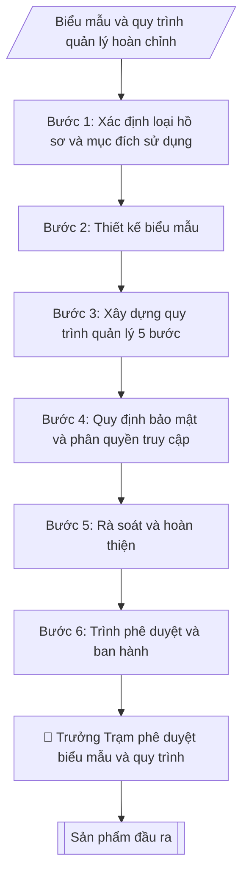

# Hồ sơ quản lý sức khỏe

## Định dạng và file đầu ra

Định dạng đầu ra có thể chọn theo sản phẩm/yêu cầu: .docx, .pdf. Đọc mục “Định dạng bổ sung” trong quy cách đầu ra trước khi chọn.

**Phải tạo file thực tế để tải xuống, không chỉ trả nội dung trong chat.** Định dạng mặc định của skill: **.docx**. Nếu có bảng số liệu nghiệp vụ yêu cầu file bảng tính riêng, tạo thêm Excel theo yêu cầu; không tự tạo file kiểm tra. Không chờ người dùng yêu cầu xuất file lần nữa. Ưu tiên định dạng người dùng chỉ định; đọc quy tắc xuất file tại references/quy-cach-dau-ra.md.

## Quy cách đầu ra và thông tin thiếu
Khi dựng file Word/Excel, áp dụng mục “Thể thức và bảng biểu khi dựng file” trong quy cách đầu ra (cỡ chữ từng thành phần, bảng nhiều trang, số trang, phụ lục). Đọc [quy cách và cấu trúc sản phẩm](references/quy-cach-dau-ra.md) trước khi soạn/xuất. File giao chỉ gồm sản phẩm nghiệp vụ được yêu cầu; kiểm tra nội bộ không xuất kèm. Thiếu thông tin thì giữ nguyên trường/mục và chỗ điền theo mẫu gốc (dòng dấu chấm, dấu gạch hoặc ô trống); không tự điền dữ liệu mẫu, số 0, mã chờ xác minh hay dòng chờ ký. Mẫu chuyên ngành còn áp dụng được ưu tiên về cấu trúc, mã biểu và người ký. Bản đầy đủ: [quy tắc chung](references/quy-tac-chung.md).

## Kiểm soát áp dụng và phê duyệt
Trước khi chạy, xác định `ngay_ap_dung`, `loai_hinh_truong`, `quy_che_noi_bo`, `nguon_du_lieu`, `nguoi_kiem_duyet`; chỉ hỏi thông tin liên quan nghiệp vụ, không dùng giá trị giả định thay dữ liệu bắt buộc. Đối chiếu căn cứ pháp lý với văn bản gốc, hiệu lực, điều khoản áp dụng và chuyển tiếp. Bản đầy đủ: [quy tắc chung](references/quy-tac-chung.md).

## Giới hạn và human gate
AI hỗ trợ chuẩn bị và đối chiếu; cán bộ phụ trách kiểm tra dữ liệu/căn cứ, người có thẩm quyền duyệt và ký. Không đánh dấu đã ký, đã duyệt, đã công bố khi chưa có chứng cứ. Dữ liệu sinh viên, sức khỏe, nhân sự, tài chính chỉ dùng theo mục đích và phân quyền, che thông tin định danh khi dùng ví dụ (Luật 91/2025/QH15, hiệu lực 01/01/2026); không tải dữ liệu lên dịch vụ ngoài khi chưa có quyền. Bản đầy đủ: [quy tắc chung](references/quy-tac-chung.md).

## Khi nào dùng
Khi Trạm Y tế cần thiết lập hoặc chuẩn hóa: sổ theo dõi sức khỏe CBVC/sinh viên,
hồ sơ khám sức khỏe định kỳ, hồ sơ tham gia BHYT và quy trình quản lý – bảo mật các hồ sơ này.

## Đầu vào (Input)

| Trường | Mô tả | Bắt buộc |
|---|---|---|
| `doi_tuong` | CBVC / Sinh viên / Cả hai | Có |
| `loai_ho_so` | Sổ theo dõi sức khỏe / Hồ sơ khám định kỳ / Hồ sơ BHYT | Có |
| `truong_thong_tin` | Các trường thông tin cần thu thập (tổng quát, không chi tiết bệnh lý nhạy cảm) | Có |
| `che_do_bao_mat` | Cấp độ truy cập: chỉ Trạm Y tế / chia sẻ hạn chế khi có yêu cầu hợp lệ | Không (mặc định: chỉ Trạm Y tế) |

## Quy trình

**Bước 1. Xác định loại hồ sơ và mục đích sử dụng**
- Làm gì: chốt `loai_ho_so` (sổ theo dõi sức khỏe / hồ sơ khám định kỳ / hồ sơ BHYT)
  và `doi_tuong` áp dụng (CBVC / sinh viên / cả hai); xác định mục đích sử dụng cụ thể
  (theo dõi định kỳ, phục vụ đợt khám, đối chiếu BHYT) để quyết định độ chi tiết
  của biểu mẫu.
- Dùng input: `doi_tuong`, `loai_ho_so`.
- Vai trò: Cán bộ Trạm Y tế · AI hỗ trợ: chốt loại hồ sơ, đối tượng áp dụng và mục đích sử dụng · ⏱ 20–30 phút (ước tính)
- Lưu ý nghiệp vụ: mỗi loại hồ sơ một biểu mẫu riêng — không gộp sổ theo dõi sức khỏe
  chung với hồ sơ BHYT vì mục đích và thời hạn lưu khác nhau; mục đích phải nằm trong
  chức năng y tế học đường của Trạm.
- → Kết quả bước: loại hồ sơ, đối tượng và mục đích sử dụng đã chốt.

**Bước 2. Thiết kế biểu mẫu**
- Làm gì: dựng bảng biểu mẫu từ `truong_thong_tin`; mỗi hồ sơ được cấp mã ẩn danh
  (VD: SK-2026-0001), không dùng họ tên làm khóa chính khi tổng hợp; loại bỏ mọi
  trường thu thập chi tiết bệnh lý nhạy cảm vượt quá phạm vi y tế học đường.
- Dùng input: `truong_thong_tin`, `doi_tuong`, `che_do_bao_mat`.
- Vai trò: Cán bộ Trạm Y tế · AI hỗ trợ: thiết kế dự thảo biểu mẫu với mã ẩn danh · ⏱ 1–2 giờ (ước tính)
- Lưu ý nghiệp vụ: nguyên tắc tối thiểu hóa dữ liệu — chỉ giữ trường thật sự cần cho
  mục đích đã chốt ở Bước 1; cột "ghi chú theo dõi" chỉ ghi chỉ định tái khám/theo dõi,
  không ghi chẩn đoán chi tiết.
- → Kết quả bước: dự thảo biểu mẫu (bảng + mã hồ sơ ẩn danh).

**Bước 3. Xây dựng quy trình quản lý 5 bước**
- Làm gì: viết quy trình theo 5 bước — (1) thu thập: ai lập hồ sơ, khi nào, chữ ký xác
  nhận của người được khám; (2) kiểm tra: người rà soát tính đầy đủ trong thời hạn
  bao lâu; (3) lưu trữ: tủ khóa / file đặt mật khẩu, vị trí lưu; (4) khai thác: thủ tục
  trích xuất, nhật ký truy cập; (5) tiêu hủy: thời hạn lưu, cách tiêu hủy, biên bản.
  Mỗi bước ghi rõ người chịu trách nhiệm.
- Dùng input: `loai_ho_so`, `che_do_bao_mat`.
- Vai trò: Cán bộ Trạm Y tế · AI hỗ trợ: soạn dự thảo quy trình 5 bước có phân công người chịu trách nhiệm · ⏱ 1–2 giờ (ước tính)
- Lưu ý nghiệp vụ: thời hạn lưu hồ sơ sức khỏe tuân thủ quy định lưu trữ của ngành;
  bước khai thác phải phân biệt trích xuất nội bộ Trạm và trích xuất ra ngoài Trạm
  (ngoài Trạm bắt buộc có phê duyệt của Trưởng Trạm).
- → Kết quả bước: dự thảo quy trình quản lý 5 bước có phân công người chịu trách nhiệm.

**Bước 4. Quy định bảo mật và phân quyền truy cập**
- Làm gì: cụ thể hóa `che_do_bao_mat` thành bảng phân quyền (vai trò – được xem gì –
  thủ tục xin trích xuất); quy định cấm sao chụp, mang hồ sơ ra khỏi Trạm khi chưa có
  phê duyệt bằng văn bản của Trưởng Trạm; quy định xử lý khi vi phạm bảo mật.
- Dùng input: `che_do_bao_mat`.
- Vai trò: Trưởng Trạm Y tế · AI hỗ trợ: soạn bảng phân quyền và quy định bảo mật, Trưởng Trạm quyết định chế độ chia sẻ · ⏱ 1–2 giờ (ước tính)
- Lưu ý nghiệp vụ: mặc định "chỉ Trạm Y tế" — mọi chia sẻ hạn chế đều phải có yêu cầu
  hợp lệ bằng văn bản và được Trưởng Trạm phê duyệt từng trường hợp; tuyệt đối không
  dùng dữ liệu sức khỏe để đánh giá, kỷ luật CBVC/sinh viên.
- → Kết quả bước: bảng phân quyền truy cập + quy định bảo mật và xử lý vi phạm.

**Bước 5. Rà soát và hoàn thiện**
- Làm gì: kiểm tra chéo — biểu mẫu đã gọn (không trường thừa), quy trình 5 bước có
  người chịu trách nhiệm rõ ràng ở mỗi bước, quy định bảo mật phù hợp Luật Bảo vệ
  dữ liệu cá nhân 2025; chạy thử trên 3–5 hồ sơ mẫu để phát hiện trường thiếu/trùng.
- Dùng input: toàn bộ dự thảo các bước 2–4.
- Vai trò: Cán bộ Trạm Y tế · AI hỗ trợ: rà soát chéo biểu mẫu – quy trình – bảo mật · ⏱ 1–2 giờ (ước tính)
- Lưu ý nghiệp vụ: nếu chạy thử phát hiện phải bổ sung trường nhạy cảm thì quay lại
  Bước 2 và đánh giá lại tính cần thiết — không thêm trường "cho chắc".
- → Kết quả bước: bộ biểu mẫu + quy trình quản lý dự thảo hoàn chỉnh, đã chạy thử.

**Bước 6. Trình phê duyệt và ban hành**
- Làm gì: trình Trưởng Trạm Y tế phê duyệt biểu mẫu và quy trình; ban hành kèm quyết định
  (ghi số quyết định lên đầu biểu mẫu); phổ biến cho toàn bộ nhân sự Trạm và lưu hồ sơ
  ban hành.
- Dùng input: `loai_ho_so`, `doi_tuong` (để ghi phạm vi áp dụng trong quyết định).
- Vai trò: Trưởng Trạm Y tế · AI hỗ trợ: chuẩn bị dự thảo, tài liệu và số liệu phục vụ bước này · ⏱ 0,5–1 ngày làm việc (ước tính)
- Lưu ý nghiệp vụ: biểu mẫu chỉ có hiệu lực sau khi ban hành — hồ sơ lập trước thời điểm
  ban hành giữ nguyên mẫu cũ, không làm lại; mọi trích xuất hồ sơ ra ngoài Trạm sau này
  đều phải có phê duyệt bằng văn bản của Trưởng Trạm.
- → Kết quả bước: bộ biểu mẫu + quy trình quản lý và bảo mật hồ sơ sức khỏe
  đã phê duyệt, ban hành.

## Luồng quy trình (Workflow)

## Đầu ra

File nghiệp vụ thực tế theo định dạng mặc định ở đầu skill hoặc định dạng người dùng yêu cầu, kèm liên kết tải trong phản hồi cuối.

Sản phẩm nghiệp vụ hoàn chỉnh theo [quy cách và cấu trúc](references/quy-cach-dau-ra.md), giữ các trường chưa có dữ liệu ở trạng thái trống. Không xuất kèm checklist/phụ lục kiểm tra đầu ra.

## Kiểm tra nội bộ trước khi giao

- [ ] Bố cục khớp mẫu áp dụng và cấu trúc tại references/quy-cach-dau-ra.md.
- [ ] Biểu mẫu khớp với Input: đúng đối tượng, loại hồ sơ, trường thông tin đã chốt và chế độ bảo mật.
- [ ] Không bịa đặt số liệu, minh chứng, trích dẫn.
- [ ] Đúng định dạng quy định: số quyết định ban hành ghi đúng trên đầu biểu mẫu.
- [ ] Căn cứ pháp lý đầy đủ, còn hiệu lực (Luật Khám bệnh, chữa bệnh; Luật Bảo vệ dữ liệu cá nhân 2025; quy định y tế trường học).
- [ ] Đã qua Human gate: Trưởng Trạm Y tế phê duyệt biểu mẫu và quy trình trước khi áp dụng.
- [ ] Biểu mẫu tuân thủ nguyên tắc tối thiểu hóa dữ liệu — không thu thập chi tiết bệnh lý nhạy cảm vượt phạm vi y tế học đường.
- [ ] Hồ sơ dùng mã ẩn danh, không dùng họ tên làm khóa chính khi tổng hợp.
- [ ] Quy trình 5 bước ghi rõ người chịu trách nhiệm ở mỗi bước; phân biệt trích xuất nội bộ Trạm và trích xuất ra ngoài Trạm.

Tiêu chí đạt = tất cả các ô được đánh dấu.

## Human gate (người kiểm duyệt)
- Trưởng Trạm Y tế phê duyệt biểu mẫu và quy trình trước khi áp dụng.
- Mọi trích xuất hồ sơ ra ngoài Trạm phải có phê duyệt bằng văn bản của Trưởng Trạm.

## Giới hạn (guardrails)
- **Tuyệt đối không** thiết kế biểu mẫu thu thập thông tin sức khỏe vượt quá phạm vi
  cần thiết cho y tế học đường; không lưu chi tiết bệnh lý nhạy cảm khi không cần.
- **Tuyệt đối không** chia sẻ, xuất hay tổng hợp hồ sơ sức khỏe cá nhân cho bên thứ ba
  (kể cả nội bộ trường) khi chưa có phê duyệt và căn cứ hợp lệ.
- **Tuyệt đối không** dùng dữ liệu sức khỏe để đánh giá, kỷ luật CBVC/sinh viên.
- Mọi dữ liệu trong ví dụ đều giả lập.

## Căn cứ & lưu ý
- Luật Khám bệnh, chữa bệnh; Luật Bảo vệ dữ liệu cá nhân 2025; quy định về y tế trường học.
- Không dùng tên thật của trường/cá nhân khi mô phỏng.

## Quản trị phiên bản
- Phiên bản gói `1.3.2` (cập nhật 2026-10-10); hồ sơ đầy đủ tại [references/version.json](references/version.json).
- Người phê duyệt nghiệp vụ: **chưa chỉ định**. Trạng thái: dự thảo nghiệp vụ; kiểm tra pháp lý trước thực thi. Ngày cập nhật không đồng nghĩa mọi văn bản đã được rà soát toàn văn.
- Giấy phép theo LICENSE của kho (bản quyền CES Global). Lịch sử thay đổi: CHANGELOG.md.
