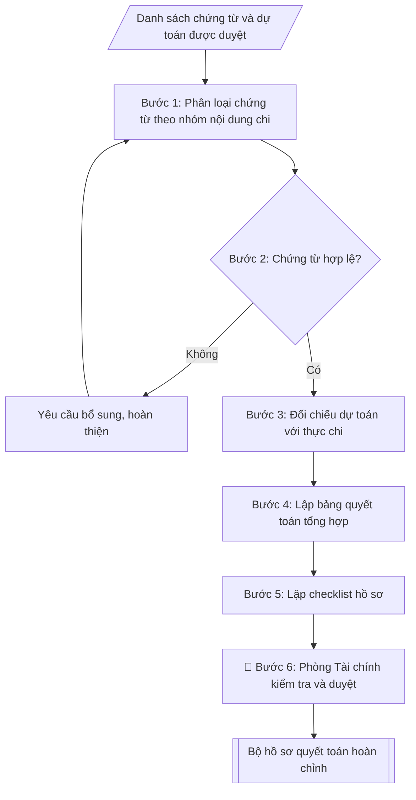

# Skill: Hồ sơ thanh quyết toán kinh phí đề tài

## Khi nào dùng
Khi đề tài/dự án nghiên cứu khoa học các cấp cần thanh quyết toán kinh phí: chuẩn bị hồ sơ
chứng từ thanh toán đợt, quyết toán khi đề tài kết thúc, đối chiếu chi thực tế với dự toán
được phê duyệt, kiểm tra trước khi nộp về Phòng KHCN / Phòng Tài chính.

## Đầu vào (Input)

| Trường | Mô tả | Bắt buộc |
|---|---|---|
| `ten_de_tai` | Tên đầy đủ của đề tài/dự án | Có |
| `ma_de_tai` | Mã số đề tài (nếu có) | Không |
| `chu_nhiem` | Họ tên, chức danh, đơn vị của chủ nhiệm đề tài | Có |
| `cap_de_tai` | Cấp Bộ / Tỉnh / Trường / cơ sở | Có |
| `tong_kinh_phi` | Tổng kinh phí được phê duyệt (VNĐ) | Có |
| `du_toan_chi_tiet` | Bảng dự toán theo từng nội dung chi: nội dung, số tiền, tỷ lệ | Có |
| `chung_tu` | Danh sách chứng từ phát sinh: ngày, nội dung chi, số tiền, loại chứng từ (hóa đơn/chứng từ thuê khoán/biên lai...) | Có |
| `dot_thanh_toan` | Đợt thanh toán (đợt 1/2/... hoặc quyết toán cuối kỳ) | Có |
| `thoi_gian_thuc_hien` | Thời gian thực hiện đề tài (từ–đến) | Không |

## Quy trình

**Bước 1. Phân loại chứng từ theo nhóm nội dung chi**
- Làm gì: từ `chung_tu` phân loại từng chứng từ vào 6 nhóm chuẩn: (1) thuê khoán chuyên môn; (2) vật tư, nguyên liệu, dụng cụ thí nghiệm; (3) hội thảo, hội nghị khoa học; (4) công tác phí; (5) in ấn, tài liệu, xuất bản; (6) quản lý chung, chi khác; mỗi chứng từ ghi rõ: ngày, nội dung chi, số tiền, loại chứng từ (hóa đơn/chứng từ thuê khoán/biên lai...).
- Dùng input: `chung_tu`, `ten_de_tai`, `ma_de_tai`.
- Vai trò: Chủ nhiệm đề tài · AI hỗ trợ: phân loại chứng từ vào 6 nhóm · ⏱ ~30–45 phút (ước tính, tùy số lượng chứng từ)
- Lưu ý nghiệp vụ: một chứng từ chỉ thuộc một nhóm — chứng từ "lưỡng tính" (VD: in tài liệu hội thảo) thì xếp theo mục đích chính và ghi chú rõ; sắp xếp chứng từ theo thứ tự thời gian trong từng nhóm.
- → Kết quả bước: bảng phân loại chứng từ (chứng từ – nhóm nội dung chi – số tiền).

**Bước 2. Kiểm tra tính hợp lệ từng chứng từ**
- Làm gì: kiểm tra từng chứng từ theo 5 tiêu chí: đúng mẫu quy định; đủ chữ ký (người đề nghị chi, kế toán, thủ trưởng); phát sinh trong `thoi_gian_thuc_hien` của đề tài; nội dung chi phù hợp mục đích đề tài; số tiền không vượt định mức; lập danh sách chứng từ đạt/không đạt — chứng từ không đạt thì yêu cầu bổ sung, hoàn thiện rồi kiểm tra lại.
- Dùng input: kết quả bước 1, `thoi_gian_thuc_hien`.
- Vai trò: Chủ nhiệm đề tài · AI hỗ trợ: lập bảng đạt/cần bổ sung · ⏱ ~45–60 phút (ước tính, tùy số lượng chứng từ)
- Lưu ý nghiệp vụ: 2 lỗi bị loại nhiều nhất — chứng từ phát sinh ngoài thời gian thực hiện đề tài và thiếu chữ ký/người duyệt; hóa đơn phải là hóa đơn hợp pháp (tra cứu được).
- → Kết quả bước: bảng kiểm tra hợp lệ từng chứng từ (đạt / cần bổ sung + lý do).

**Bước 3. Đối chiếu dự toán với thực chi**
- Làm gì: từ `du_toan_chi_tiet` và kết quả bước 2, lập bảng so sánh theo từng nội dung chi: Dự toán – Thực chi – Chênh lệch (số tiền và %); đánh dấu các khoản vượt dự toán hoặc chi sai nội dung; khoản vượt trong ngưỡng cho phép thì soạn thuyết minh điều chỉnh, vượt ngưỡng thì báo cáo xin điều chỉnh dự toán chính thức.
- Dùng input: `du_toan_chi_tiet`, `tong_kinh_phi`, kết quả bước 2.
- Vai trò: Chủ nhiệm đề tài · AI hỗ trợ: lập bảng đối chiếu dự toán – thực chi · ⏱ ~30–45 phút (ước tính)
- Lưu ý nghiệp vụ: mức điều chỉnh giữa các nội dung chi tuân theo quy định của cơ quan quản lý (thường ≤10–20% cần thuyết minh, vượt ngưỡng phải xin điều chỉnh dự toán) — không tự ý "cấn trừ" giữa các khoản mục.
- → Kết quả bước: bảng đối chiếu dự toán – thực chi – chênh lệch + danh sách khoản cần thuyết minh/điều chỉnh.

**Bước 4. Lập bảng quyết toán tổng hợp**
- Làm gì: tổng hợp từ kết quả bước 3: tổng thực chi, số kinh phí đã tạm ứng, số còn phải thanh toán hoặc số phải nộp trả ngân sách (nếu chi không hết); viết kết luận quyết toán (tiết kiệm/vượt chi bao nhiêu, tỷ lệ %).
- Dùng input: kết quả bước 3, `dot_thanh_toan`, `tong_kinh_phi`.
- Vai trò: Chủ nhiệm đề tài · AI hỗ trợ: tổng hợp số liệu và viết kết luận quyết toán · ⏱ ~15–20 phút (ước tính)
- Lưu ý nghiệp vụ: tổng thực chi không được vượt `tong_kinh_phi` đã phê duyệt; nếu là quyết toán cuối kỳ thì số liệu phải khớp với bảng quyết toán trong báo cáo tổng kết nghiệm thu.
- → Kết quả bước: bảng quyết toán tổng hợp + kết luận quyết toán.

**Bước 5. Lập checklist hồ sơ thanh quyết toán**
- Làm gì: lập checklist các thành phần: tờ trình đề nghị thanh toán/quyết toán; bảng quyết toán tổng hợp (có xác nhận chủ nhiệm); bảng đối chiếu dự toán – thực chi; bộ chứng từ gốc sắp xếp theo nhóm nội dung chi; thuyết minh điều chỉnh (nếu có ở bước 3); biên bản nghiệm thu (nếu quyết toán cuối kỳ); xác nhận của đơn vị chủ trì; đánh dấu đủ/thiếu từng thành phần.
- Dùng input: kết quả bước 1–4, `dot_thanh_toan`, `chu_nhiem`, `cap_de_tai`.
- Vai trò: Chủ nhiệm đề tài · AI hỗ trợ: lập checklist các thành phần hồ sơ theo đợt thanh toán · ⏱ ~15–20 phút (ước tính)
- Lưu ý nghiệp vụ: quyết toán cuối kỳ bắt buộc có biên bản nghiệm thu; thanh toán đợt giữa kỳ thì thay bằng báo cáo tiến độ đã được đánh giá đạt yêu cầu.
- → Kết quả bước: checklist hồ sơ (đánh dấu đủ/thiếu từng thành phần).

**Bước 6. Hoàn thiện và trình duyệt**
- Làm gì: trình chủ nhiệm ký xác nhận, đơn vị chủ trì xác nhận; nộp Phòng KHCN / Phòng Tài chính kiểm tra và duyệt; xuất bộ hồ sơ hoàn chỉnh ở dạng markdown, sẵn sàng in/ký và nộp.
- Dùng input: kết quả bước 4–5.
- Vai trò: Phòng KHCN, Phòng Tài chính · AI hỗ trợ: chuẩn bị hồ sơ trình ký, nhắc lịch và theo dõi tiến độ · ⏱ ~1–2 ngày làm việc (ước tính)
- Lưu ý nghiệp vụ: giữ lại 01 bộ chứng từ sao có đóng dấu của đơn vị; nộp bản gốc duy nhất mà không giữ bản lưu là rủi ro khi hồ sơ bị thất lạc.
- → Kết quả bước: bộ hồ sơ quyết toán hoàn chỉnh đã duyệt.

## Luồng quy trình (Workflow)



## Đầu ra (Output)
- Bảng quyết toán kinh phí đề tài (dự toán – thực chi – chênh lệch theo nội dung).
- Bảng phân loại chứng từ kèm trạng thái hợp lệ/thiếu sót của từng chứng từ.
- Checklist hồ sơ thanh quyết toán (đánh dấu đủ/thiếu từng thành phần).
- Danh sách các khoản cần điều chỉnh/thuyết minh bổ sung (nếu có).

**Cấu trúc output chuẩn:** khung cố định của bộ hồ sơ quyết toán, các phần bắt buộc theo đúng thứ tự xuất hiện:
1. Tiêu đề "BẢNG QUYẾT TOÁN KINH PHÍ ĐỀ TÀI" + đợt thanh toán
2. Khối thông tin: tên đề tài, mã số, chủ nhiệm, cấp đề tài, thời gian thực hiện
3. Bảng quyết toán: TT – Nội dung chi – Dự toán – Thực chi – Chênh lệch (theo 6 nhóm nội dung chi) + dòng tổng cộng
4. Kết luận quyết toán (tổng thực chi, tiết kiệm/vượt chi, tỷ lệ %)
5. Bảng phân loại chứng từ (nhóm nội dung chi – chứng từ – trạng thái hợp lệ)
6. Danh sách khoản cần điều chỉnh/thuyết minh bổ sung (nếu có)
7. Checklist hồ sơ thanh quyết toán (đánh dấu đủ/thiếu từng thành phần)

## Checklist nghiệm thu

- [ ] Đủ 7 phần theo "Cấu trúc output chuẩn": tiêu đề + đợt thanh toán → khối thông tin → bảng quyết toán → kết luận quyết toán → bảng phân loại chứng từ → khoản cần điều chỉnh/thuyết minh → checklist hồ sơ
- [ ] Số liệu trong output khớp Input: tổng kinh phí = `tong_kinh_phi`; dự toán theo khoản mục = `du_toan_chi_tiet`; danh sách chứng từ = `chung_tu`
- [ ] Không bịa đặt số tiền, chứng từ, nội dung chi
- [ ] Bảng quyết toán đúng mẫu (TT – nội dung chi – dự toán – thực chi – chênh lệch); tổng thực chi không vượt kinh phí được phê duyệt
- [ ] Căn cứ pháp lý đầy đủ, còn hiệu lực (Thông tư 02/2023/TT-BKHCN, quy chế quản lý đề tài, quyết định phê duyệt kinh phí)
- [ ] Mọi chứng từ phát sinh trong thời gian thực hiện đề tài, đủ chữ ký theo quy định, hóa đơn hợp pháp; khoản vượt dự toán trong ngưỡng có thuyết minh, vượt ngưỡng có văn bản điều chỉnh chính thức
- [ ] Quyết toán cuối kỳ: số liệu khớp bảng quyết toán trong báo cáo tổng kết nghiệm thu; hồ sơ kèm biên bản nghiệm thu
- [ ] Đã qua Human gate: chủ nhiệm và đơn vị chủ trì ký xác nhận; Phòng KHCN / Phòng Tài chính kiểm tra và duyệt

Tiêu chí đạt = tất cả các ô được đánh dấu.

## Ví dụ mô phỏng (dữ liệu giả lập)

> Tất cả tên trường, cá nhân, đề tài, số liệu dưới đây đều là **giả lập**, không liên quan
> tổ chức/cá nhân có thật.

### Input mẫu

| Trường | Giá trị |
|---|---|
| `ten_de_tai` | Nghiên cứu ứng dụng trí tuệ nhân tạo trong hỗ trợ chẩn đoán hình ảnh y khoa |
| `ma_de_tai` | ĐHA.KHCN.2025.014 |
| `chu_nhiem` | PGS.TS. Trần Văn B – Khoa Công nghệ thông tin |
| `cap_de_tai` | Cấp Trường |
| `tong_kinh_phi` | 350.000.000 VNĐ |
| `du_toan_chi_tiet` | Thuê khoán chuyên môn: 140.000.000; Vật tư, thiết bị: 90.000.000; Hội thảo khoa học: 40.000.000; Công tác phí: 30.000.000; In ấn, tài liệu: 15.000.000; Quản lý chung: 35.000.000 |
| `chung_tu` | 12 chứng từ: 4 hợp đồng thuê khoán (+ biên bản nghiệm thu), 3 hóa đơn vật tư, 2 bộ chứng từ hội thảo, 2 bộ công tác phí, 1 hóa đơn in ấn |
| `dot_thanh_toan` | Quyết toán cuối kỳ |
| `thoi_gian_thuc_hien` | 01/2025 – 09/2026 |

### Output mẫu

```
BẢNG QUYẾT TOÁN KINH PHÍ ĐỀ TÀI
Đề tài: Nghiên cứu ứng dụng trí tuệ nhân tạo trong hỗ trợ chẩn đoán hình ảnh y khoa
Mã số: ĐHA.KHCN.2025.014 | Chủ nhiệm: PGS.TS. Trần Văn B – Khoa CNTT
Cấp: Trường | Thời gian thực hiện: 01/2025 – 09/2026

| TT | Nội dung chi            | Dự toán (đ)   | Thực chi (đ)  | Chênh lệch (đ) |
|----|-------------------------|---------------|---------------|----------------|
| 1  | Thuê khoán chuyên môn   | 140.000.000   | 138.500.000   | -1.500.000     |
| 2  | Vật tư, thiết bị        | 90.000.000    | 91.200.000    | +1.200.000     |
| 3  | Hội thảo khoa học       | 40.000.000    | 38.700.000    | -1.300.000     |
| 4  | Công tác phí            | 30.000.000    | 29.450.000    | -550.000       |
| 5  | In ấn, tài liệu         | 15.000.000    | 14.800.000    | -200.000       |
| 6  | Quản lý chung           | 35.000.000    | 35.000.000    | 0              |
|    | TỔNG CỘNG               | 350.000.000   | 347.650.000   | -2.350.000     |

Kết luận: Tổng thực chi 347.650.000đ, tiết kiệm 2.350.000đ so với dự toán.
Khoản vượt: Vật tư, thiết bị vượt 1.200.000đ (1,3%) — trong phạm vi điều chỉnh
nội bộ cho phép, đã có thuyết minh kèm theo.

BẢNG PHÂN LOẠI CHỨNG TỪ (12 chứng từ)

| Nhóm nội dung chi | Chứng từ | Trạng thái |
|---|---|---|
| Thuê khoán chuyên môn | 4 hợp đồng thuê khoán + biên bản nghiệm thu | Hợp lệ |
| Vật tư, thiết bị | 3 hóa đơn | Hợp lệ |
| Hội thảo khoa học | 2 bộ chứng từ (quyết định tổ chức, danh sách đại biểu, chứng từ ăn ở, đi lại) | Hợp lệ |
| Công tác phí | 2 bộ chứng từ (quyết định cử đi công tác, vé, hóa đơn lưu trú) | Hợp lệ |
| In ấn, tài liệu | 1 hóa đơn | Hợp lệ |

DANH SÁCH KHOẢN CẦN THUYẾT MINH BỔ SUNG
- Vật tư, thiết bị vượt dự toán 1.200.000đ (1,3%): trong phạm vi điều chỉnh nội bộ,
đã có thuyết minh kèm theo — cần bổ sung chữ ký (xem checklist).

CHECKLIST HỒ SƠ QUYẾT TOÁN
- [x] Tờ trình đề nghị quyết toán kinh phí đề tài
- [x] Bảng quyết toán tổng hợp (có xác nhận chủ nhiệm)
- [x] Bảng đối chiếu dự toán – thực chi
- [x] 12 chứng từ gốc, sắp xếp theo 6 nhóm nội dung chi
- [x] Biên bản nghiệm thu đề tài cấp Trường
- [x] Xác nhận của Khoa Công nghệ thông tin
- [!] Thuyết minh điều chỉnh nội dung "Vật tư, thiết bị" — cần bổ sung chữ ký
```

## Căn cứ & lưu ý
- Thông tư 02/2023/TT-BKHCN về quản lý đề tài KHCN cấp Bộ và các văn bản quản lý
  đề tài cấp trường của Trường Đại học A.
- Chứng từ phải phát sinh trong thời gian thực hiện đề tài; chi ngoài thời gian
  không được quyết toán.
- Mức điều chỉnh giữa các nội dung chi tuân theo quy định của cơ quan quản lý
  đề tài (thường ≤ 10–20% cần thuyết minh, vượt ngưỡng phải xin điều chỉnh dự toán).
- Không dùng tên thật của trường/cá nhân khi mô phỏng.
