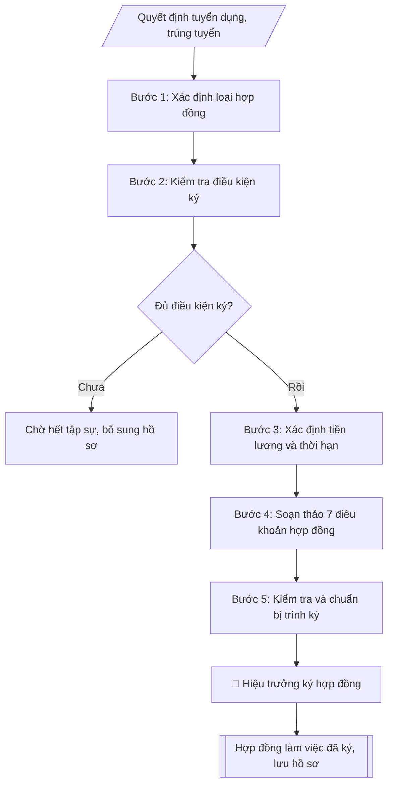

# Soạn hợp đồng làm việc / hợp đồng lao động

## Định dạng và file đầu ra
Định dạng đầu ra có thể chọn theo sản phẩm/yêu cầu: .docx, .pdf. Đọc mục “Định dạng bổ sung” trong quy cách đầu ra trước khi chọn.

**Phải tạo file thực tế để tải xuống, không chỉ trả nội dung trong chat.** Định dạng mặc định của skill: **.docx**. Nếu có bảng số liệu nghiệp vụ yêu cầu file bảng tính riêng, tạo thêm Excel theo yêu cầu; không tự tạo file kiểm tra. Không chờ người dùng yêu cầu xuất file lần nữa. Ưu tiên định dạng người dùng chỉ định; đọc quy tắc xuất file tại references/quy-cach-dau-ra.md.

## Quy cách đầu ra và thông tin thiếu
Đọc [quy cách và cấu trúc sản phẩm](references/quy-cach-dau-ra.md) trước khi soạn/xuất. File giao chỉ gồm sản phẩm nghiệp vụ được yêu cầu; kiểm tra nội bộ không xuất kèm. Thiếu thông tin thì giữ nguyên trường/mục và chỗ điền theo mẫu gốc (dòng dấu chấm, dấu gạch hoặc ô trống); không tự điền dữ liệu mẫu, số 0, mã chờ xác minh hay dòng chờ ký. Mẫu chuyên ngành còn áp dụng được ưu tiên về cấu trúc, mã biểu và người ký. Bản đầy đủ: [quy tắc chung](references/quy-tac-chung.md).

## Kiểm soát áp dụng và phê duyệt
Trước khi chạy, xác định `ngay_ap_dung`, `loai_hinh_truong`, `quy_che_noi_bo`, `nguon_du_lieu`, `nguoi_kiem_duyet`; chỉ hỏi thông tin liên quan nghiệp vụ, không dùng giá trị giả định thay dữ liệu bắt buộc. Đối chiếu căn cứ pháp lý với văn bản gốc, hiệu lực, điều khoản áp dụng và chuyển tiếp. Bản đầy đủ: [quy tắc chung](references/quy-tac-chung.md).

Nếu có cập nhật pháp lý dưới đây, đọc [căn cứ và điều kiện áp dụng](references/phap-ly.md) trước khi làm. Quy trình dưới đây giữ nghiệp vụ từ bản gốc; mọi viện dẫn văn bản, mẫu biểu, điều khoản phải theo căn cứ đã chọn trong phap-ly.md, không theo văn bản cũ.

## Giới hạn và human gate
AI hỗ trợ chuẩn bị và đối chiếu; cán bộ phụ trách kiểm tra dữ liệu/căn cứ, người có thẩm quyền duyệt và ký. Không đánh dấu đã ký, đã duyệt, đã công bố khi chưa có chứng cứ. Dữ liệu sinh viên, sức khỏe, nhân sự, tài chính chỉ dùng theo mục đích và phân quyền, che thông tin định danh khi dùng ví dụ (Luật 91/2025/QH15, hiệu lực 01/01/2026); không tải dữ liệu lên dịch vụ ngoài khi chưa có quyền. Bản đầy đủ: [quy tắc chung](references/quy-tac-chung.md).

## Khi nào dùng
Khi tuyển dụng viên chức mới trúng tuyển, hết thời gian tập sự, ký lại hợp đồng khi hết hạn,
chuyển từ hợp đồng xác định thời hạn sang hợp đồng không xác định thời hạn,
hoặc ký hợp đồng lao động với lao động hợp đồng (bảo vệ, tạp vụ, lái xe...).

## Đầu vào (Input)
| Trường | Mô tả | Bắt buộc |
|---|---|---|
| `loai_hop_dong` | Hợp đồng làm việc (viên chức) / Hợp đồng lao động (người lao động) | Có |
| `ho_ten_nld` | Họ tên người lao động | Có |
| `ngay_sinh` | Ngày tháng năm sinh | Có |
| `cccd` | Số CCCD, ngày cấp, nơi cấp | Có |
| `dia_chi` | Địa chỉ thường trú / nơi ở hiện nay | Có |
| `trinh_do` | Trình độ đào tạo (Cử nhân / Thạc sĩ / Tiến sĩ + chuyên ngành) | Có |
| `chuc_danh` | Chức danh nghề nghiệp (VD: Giảng viên hạng III – mã số V.07.01.03) | Có |
| `don_vi` | Đơn vị công tác (phòng / khoa / trung tâm) | Có |
| `cong_viec` | Mô tả công việc chính phải làm | Có |
| `thoi_han` | Xác định thời hạn (từ ngày... đến ngày...) / Không xác định thời hạn | Có |
| `ngay_bat_dau` | Ngày hợp đồng có hiệu lực | Có |
| `he_so_luong` | Hệ số lương + bậc (VD: bậc 2/9, hệ số 2,67) | Có |
| `muc_luong_toi_thieu` | Mức lương cơ sở áp dụng để tính (theo quy định hiện hành) | Có |
| `phu_cap` | Các khoản phụ cấp (chức vụ, ưu đãi nghề, thâm niên...) nếu có | Không |
| `thoi_gian_lam_viec` | Giờ làm việc, ngày nghỉ hằng tuần | Không (mặc định theo quy định của trường) |
| `nguoi_dai_dien` | Người đại diện trường ký hợp đồng (Hiệu trưởng) | Có |

## Quy trình
**Ràng buộc pháp lý khi thực hiện** (trích references/phap-ly.md; đối chiếu toàn văn và hiệu lực tại ngày nghiệp vụ):
- Luật 129/2025/QH15; Nghị định 259/2026/NĐ-CP; phạm vi: Viên chức đơn vị sự nghiệp công lập; kiểm tra chuyển tiếp và quy định riêng về nhà giáo: Cập nhật căn cứ tuyển dụng, hợp đồng làm việc, bổ nhiệm, điều động và đào tạo viên chức. Không tái sử dụng số điều hoặc mẫu phiếu của NĐ 115. Phải yêu cầu ngày tuyển dụng, ngày phê duyệt kế hoạch, loại hợp đồng, trạng thái hồ sơ và bản văn NĐ 259 để chọn điều khoản chuyển tiếp; không tự áp dụng điều22 Luật Viên chức2010. Các văn bản cũ chỉ là căn cứ lịch sử khi chuyển tiếp cho phép.
- Nghị định 235/2026/NĐ-CP; phạm vi: Hợp đồng lao động và dịch vụ thực hiện công việc trong đơn vị sự nghiệp công lập: Phân biệt hợp đồng làm việc của viên chức với hợp đồng lao động/dịch vụ. NĐ 235 cho công việc quản lý/chuyên môn/nghiệp vụ/hỗ trợ; công việc phục vụ như bảo vệ, lái xe ưu tiên tổ chức cung cấp dịch vụ theo điều kiện nghị định, không mặc định tất cả là hợp đồng lao động. Kiểm tra thẩm quyền ký theo nhóm vị trí.
- Luật Nhà giáo; Nghị định 93/2026/NĐ-CP; khoản 9 Điều 62 NĐ 259/2026; phạm vi: Viên chức là nhà giáo: Thêm input đối tượng là nhà giáo hay viên chức khác. Nếu pháp luật nhà giáo có quy định khác về thẩm quyền, tiêu chuẩn, điều kiện, trình tự, thủ tục tuyển dụng/sử dụng/quản lý, áp dụng quy định nhà giáo và hướng dẫn Bộ GDĐT thay vì quy tắc chung NĐ 259.
- Trước Bước 1: chọn căn cứ theo đối tượng, loại hình trường và chuyển tiếp; lập bảng văn bản / điều khoản / lý do áp dụng / bằng chứng. Thiếu văn bản gốc hoặc điều khoản thì ghi nhận nội bộ [CẦN XÁC MINH] (không đưa vào file giao), để trống phần tương ứng, chưa kết luận tuân thủ.

**Bước 1. Xác định loại hợp đồng**
- Làm gì: căn cứ đối tượng để phân loại: viên chức trúng tuyển theo văn bản hiện hành nêu tại phap-ly.md → Hợp đồng làm việc; lao động ngoài biên chế (bảo vệ, tạp vụ, lái xe...) → Hợp đồng lao động theo Bộ luật Lao động.
- Dùng input: `loai_hop_dong`, `chuc_danh`, `don_vi`.
- Vai trò: Chuyên viên Phòng TCCB · AI hỗ trợ: phân tích input, xác định yêu cầu · ⏱ ~20–45 phút (ước tính)
- Lưu ý nghiệp vụ: chọn sai loại hợp đồng thì sai toàn bộ căn cứ pháp lý (Hợp đồng làm việc căn cứ Luật Viên chức + văn bản hiện hành nêu tại phap-ly.md; Hợp đồng lao động căn cứ Bộ luật Lao động).
- → Kết quả bước: phiếu xác định loại hợp đồng.

**Bước 2. Kiểm tra điều kiện ký**
- Làm gì: kiểm tra quyết định tuyển dụng/trúng tuyển còn hiệu lực; xác nhận đã hết thời gian tập sự (nếu ký sau tập sự); kiểm tra thẩm quyền người ký (Hiệu trưởng); đối chiếu thông tin định danh hai bên (họ tên, ngày sinh, CCCD, địa chỉ, trình độ).
- Dùng input: `ho_ten_nld`, `ngay_sinh`, `cccd`, `dia_chi`, `trinh_do`, `nguoi_dai_dien`.
- Vai trò: Chuyên viên Phòng TCCB (Trưởng phòng kiểm tra lại) · AI hỗ trợ: quét lỗi theo checklist · ⏱ ~15–30 phút (ước tính)
- Lưu ý nghiệp vụ: chưa hết thời gian tập sự thì chưa ký hợp đồng chính thức; CCCD hết hạn phải yêu cầu cập nhật trước khi ký.
- → Kết quả bước: biên bản kiểm tra điều kiện ký (đủ điều kiện / nội dung cần bổ sung).

**Bước 3. Xác định tiền lương và thời hạn**
- Làm gì: đối chiếu chức danh nghề nghiệp + mã ngạch với bảng lương văn bản hiện hành nêu tại phap-ly.md để xác định bậc, hệ số đúng; xác định loại thời hạn (viên chức lần đầu: xác định thời hạn không quá 60 tháng; đủ điều kiện: không xác định thời hạn); xác định các khoản phụ cấp theo quy định; xác định thời giờ làm việc, ngày nghỉ hằng tuần.
- Dùng input: `chuc_danh`, `he_so_luong`, `muc_luong_toi_thieu`, `phu_cap`, `thoi_han`, `ngay_bat_dau`, `thoi_gian_lam_viec`.
- Vai trò: Chuyên viên Phòng TCCB · AI hỗ trợ: phân tích input, xác định yêu cầu · ⏱ ~20–45 phút (ước tính)
- Lưu ý nghiệp vụ: tra sai bậc/hệ số so với ngạch là lỗi phổ biến nhất — phải đối chiếu trực tiếp bảng lương; thời hạn lần đầu vượt 60 tháng là vi phạm quy định.
- → Kết quả bước: bảng tiền lương – thời hạn (bậc/hệ số, phụ cấp, thời hạn, ngày hiệu lực).

**Bước 4. Soạn thảo 7 điều khoản hợp đồng**
- Làm gì: soạn đầy đủ các điều khoản bắt buộc: Điều 1 – Công việc, chức danh, đơn vị công tác; Điều 2 – Thời hạn hợp đồng, ngày có hiệu lực; Điều 3 – Tiền lương (hệ số, bậc, cách tính), phụ cấp, hình thức trả lương, kỳ trả lương; Điều 4 – Thời giờ làm việc, thời giờ nghỉ ngơi; Điều 5 – Quyền và nghĩa vụ của người lao động / viên chức; Điều 6 – Quyền và nghĩa vụ của đơn vị sử dụng lao động (nhà trường); Điều 7 – Điều khoản thi hành (hiệu lực, số bản hợp đồng).
- Dùng input: `cong_viec` (điều khoản công việc) và toàn bộ input đã thu thập ở các bước 1–3.
- Vai trò: Chuyên viên Phòng TCCB · AI hỗ trợ: soạn dự thảo đúng thể thức · ⏱ ~20–45 phút (ước tính)
- Lưu ý nghiệp vụ: căn cứ pháp lý ở phần mở đầu phải đúng loại hợp đồng đã xác định ở Bước 1; nội dung Điều 3 phải khớp bảng tiền lương ở Bước 3.
- → Kết quả bước: dự thảo hợp đồng đầy đủ 7 điều khoản.

**Bước 5. Kiểm tra và chuẩn bị trình ký**
- Làm gì: kiểm tra lần cuối: hệ số lương đúng ngạch/chức danh, thời hạn đúng quy định, đầy đủ thông tin định danh hai bên, đủ 7 điều khoản, số bản hợp đồng ghi trong Điều 7; hoàn thiện dự thảo để trình Hiệu trưởng ký, đóng dấu.
- Dùng input: `nguoi_dai_dien`.
- Vai trò: Chuyên viên Phòng TCCB chuẩn bị, Hiệu trưởng phê duyệt · AI hỗ trợ: tổng hợp hồ sơ, soạn phiếu trình/tờ trình đầy đủ · ⏱ ~15–30 phút chuẩn bị + chờ duyệt (ước tính)
- Lưu ý nghiệp vụ: dùng checklist kiểm tra trước khi trình ký; hợp đồng chỉ có hiệu lực pháp lý sau khi ký và đóng dấu đầy đủ.
- → Kết quả bước: dự thảo hợp đồng đã kiểm tra + checklist kiểm tra (trình ký tại Human gate; sau khi ký: lập đủ số bản — thường 03 bản: Bên A giữ 02, Bên B giữ 01 — lưu 01 bản vào hồ sơ cán bộ).

## Luồng quy trình (Workflow)

## Đầu ra
- Hợp đồng hoàn chỉnh, đúng thể thức.
- Checklist kiểm tra các điều khoản bắt buộc (đã đủ/chưa).

File nghiệp vụ thực tế theo định dạng mặc định ở đầu skill hoặc định dạng người dùng yêu cầu, kèm liên kết tải trong phản hồi cuối.

Sản phẩm nghiệp vụ hoàn chỉnh theo [quy cách và cấu trúc](references/quy-cach-dau-ra.md), giữ các trường chưa có dữ liệu ở trạng thái trống. Không xuất kèm checklist/phụ lục kiểm tra đầu ra.

## Kiểm tra nội bộ trước khi giao
Các tiêu chí sau dùng để tự đối chiếu; không sao chép vào file xuất. Mục thiếu dữ liệu được để trống, không đánh dấu đã đạt hoặc đã duyệt.

- [ ] Đủ các phần theo Cấu trúc output chuẩn: Quốc hiệu – Tiêu ngữ; Tên loại "HỢP ĐỒNG LÀM VIỆC" (hoặc "HỢP ĐỒNG LAO ĐỘNG") + số hợp đồng; Phần căn cứ (văn bản pháp luật + quyết định tuyển dụng); Thời gian, địa điểm ký kết; … (đủ 8 phần)
- [ ] Nội dung và số liệu trong output khớp đúng với Input đã cho (không thêm, bớt hay suy diễn)
- [ ] Không bịa đặt số liệu, minh chứng, trích dẫn hay căn cứ
- [ ] Đúng thể thức và cấu trúc theo references/quy-cach-dau-ra.md và căn cứ đã chọn tại references/phap-ly.md.
- [ ] Căn cứ pháp lý được trích dẫn đầy đủ và còn hiệu lực
- [ ] Đã qua Human gate: người có thẩm quyền đã kiểm tra/duyệt trước khi phát hành
- [ ] CCCD hết hạn phải yêu cầu cập nhật trước khi ký
- [ ] Tra sai bậc/hệ số so với ngạch là lỗi phổ biến nhất — phải đối chiếu trực tiếp bảng lương
- [ ] Căn cứ pháp lý ở phần mở đầu phải đúng loại hợp đồng đã xác định ở Bước 1

## Căn cứ & lưu ý
- Căn cứ hiện hành: xem [căn cứ và điều kiện áp dụng](references/phap-ly.md); phải đối chiếu văn bản gốc, hiệu lực và chuyển tiếp tại ngày nghiệp vụ.
- Nghị định 30/2020/NĐ-CP về thể thức văn bản (áp dụng cho phần căn cứ, trình bày).
- Bộ luật Lao động hiện hành (đối với hợp đồng lao động).
- Lưu ý: không áp dụng hợp đồng làm việc cho lao động hợp đồng ngoài biên chế;
  thời hạn lần đầu của viên chức không quá 60 tháng; hết hạn phải đánh giá trước khi ký tiếp.
- Không dùng tên thật của trường/cá nhân khi mô phỏng.

## Tư liệu đối chiếu
Bản gốc trước cập nhật pháp lý (kèm ví dụ giả lập) lưu tại `references/quy-trinh-lich-su.md`, chỉ để đối chiếu hồ sơ lịch sử; không dùng căn cứ, mẫu hay số liệu trong đó làm chỉ dẫn hiện hành.

## Quản trị phiên bản
- Phiên bản gói `1.3.2` (cập nhật 2026-10-10); hồ sơ đầy đủ tại [references/version.json](references/version.json).
- Người phê duyệt nghiệp vụ: **chưa chỉ định**. Trạng thái: dự thảo nghiệp vụ; kiểm tra pháp lý trước thực thi. Ngày cập nhật không đồng nghĩa mọi văn bản đã được rà soát toàn văn.
- Giấy phép theo LICENSE của kho (bản quyền CES Global). Lịch sử thay đổi: CHANGELOG.md.
