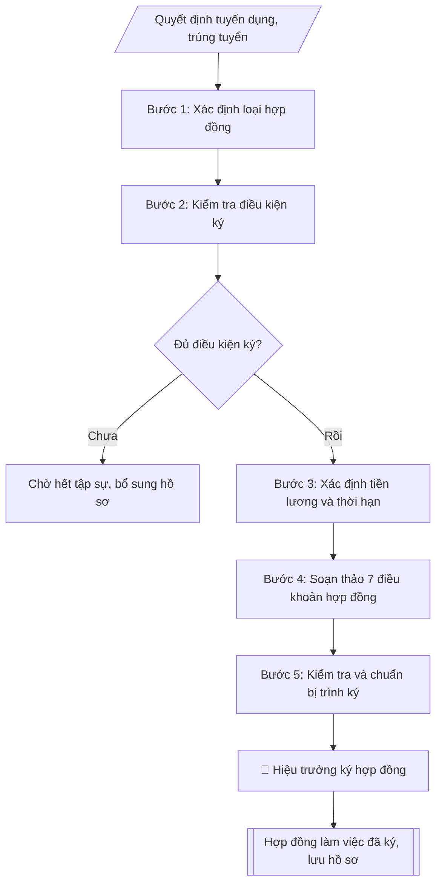

# Skill: Soạn hợp đồng làm việc / hợp đồng lao động

## Khi nào dùng
Khi tuyển dụng viên chức mới trúng tuyển, hết thời gian tập sự, ký lại hợp đồng khi hết hạn,
chuyển từ hợp đồng xác định thời hạn sang hợp đồng không xác định thời hạn,
hoặc ký hợp đồng lao động với lao động hợp đồng (bảo vệ, tạp vụ, lái xe...).

## Đầu vào (Input)

| Trường | Mô tả | Bắt buộc |
|---|---|---|
| `loai_hop_dong` | Hợp đồng làm việc (viên chức) / Hợp đồng lao động (người lao động) | Có |
| `ho_ten_nld` | Họ tên người lao động | Có |
| `ngay_sinh` | Ngày tháng năm sinh | Có |
| `cccd` | Số CCCD, ngày cấp, nơi cấp | Có |
| `dia_chi` | Địa chỉ thường trú / nơi ở hiện nay | Có |
| `trinh_do` | Trình độ đào tạo (Cử nhân / Thạc sĩ / Tiến sĩ + chuyên ngành) | Có |
| `chuc_danh` | Chức danh nghề nghiệp (VD: Giảng viên hạng III – mã số V.07.01.03) | Có |
| `don_vi` | Đơn vị công tác (phòng / khoa / trung tâm) | Có |
| `cong_viec` | Mô tả công việc chính phải làm | Có |
| `thoi_han` | Xác định thời hạn (từ ngày... đến ngày...) / Không xác định thời hạn | Có |
| `ngay_bat_dau` | Ngày hợp đồng có hiệu lực | Có |
| `he_so_luong` | Hệ số lương + bậc (VD: bậc 2/9, hệ số 2,67) | Có |
| `muc_luong_toi_thieu` | Mức lương cơ sở áp dụng để tính (theo quy định hiện hành) | Có |
| `phu_cap` | Các khoản phụ cấp (chức vụ, ưu đãi nghề, thâm niên...) nếu có | Không |
| `thoi_gian_lam_viec` | Giờ làm việc, ngày nghỉ hằng tuần | Không (mặc định theo quy định của trường) |
| `nguoi_dai_dien` | Người đại diện trường ký hợp đồng (Hiệu trưởng) | Có |

## Quy trình

**Bước 1. Xác định loại hợp đồng**
- Làm gì: căn cứ đối tượng để phân loại: viên chức trúng tuyển theo NĐ 115/2020 → Hợp đồng làm việc; lao động ngoài biên chế (bảo vệ, tạp vụ, lái xe...) → Hợp đồng lao động theo Bộ luật Lao động.
- Dùng input: `loai_hop_dong`, `chuc_danh`, `don_vi`.
- Vai trò: Chuyên viên Phòng TCCB · AI hỗ trợ: phân tích input, xác định yêu cầu · ⏱ ~20–45 phút (ước tính)
- Lưu ý nghiệp vụ: chọn sai loại hợp đồng thì sai toàn bộ căn cứ pháp lý (Hợp đồng làm việc căn cứ Luật Viên chức + NĐ 115/2020; Hợp đồng lao động căn cứ Bộ luật Lao động).
- → Kết quả bước: phiếu xác định loại hợp đồng.

**Bước 2. Kiểm tra điều kiện ký**
- Làm gì: kiểm tra quyết định tuyển dụng/trúng tuyển còn hiệu lực; xác nhận đã hết thời gian tập sự (nếu ký sau tập sự); kiểm tra thẩm quyền người ký (Hiệu trưởng); đối chiếu thông tin định danh hai bên (họ tên, ngày sinh, CCCD, địa chỉ, trình độ).
- Dùng input: `ho_ten_nld`, `ngay_sinh`, `cccd`, `dia_chi`, `trinh_do`, `nguoi_dai_dien`.
- Vai trò: Chuyên viên Phòng TCCB (Trưởng phòng kiểm tra lại) · AI hỗ trợ: quét lỗi theo checklist · ⏱ ~15–30 phút (ước tính)
- Lưu ý nghiệp vụ: chưa hết thời gian tập sự thì chưa ký hợp đồng chính thức; CCCD hết hạn phải yêu cầu cập nhật trước khi ký.
- → Kết quả bước: biên bản kiểm tra điều kiện ký (đủ điều kiện / nội dung cần bổ sung).

**Bước 3. Xác định tiền lương và thời hạn**
- Làm gì: đối chiếu chức danh nghề nghiệp + mã ngạch với bảng lương NĐ 204/2004 để xác định bậc, hệ số đúng; xác định loại thời hạn (viên chức lần đầu: xác định thời hạn không quá 60 tháng; đủ điều kiện: không xác định thời hạn); xác định các khoản phụ cấp theo quy định; xác định thời giờ làm việc, ngày nghỉ hằng tuần.
- Dùng input: `chuc_danh`, `he_so_luong`, `muc_luong_toi_thieu`, `phu_cap`, `thoi_han`, `ngay_bat_dau`, `thoi_gian_lam_viec`.
- Vai trò: Chuyên viên Phòng TCCB · AI hỗ trợ: phân tích input, xác định yêu cầu · ⏱ ~20–45 phút (ước tính)
- Lưu ý nghiệp vụ: tra sai bậc/hệ số so với ngạch là lỗi phổ biến nhất — phải đối chiếu trực tiếp bảng lương; thời hạn lần đầu vượt 60 tháng là vi phạm quy định.
- → Kết quả bước: bảng tiền lương – thời hạn (bậc/hệ số, phụ cấp, thời hạn, ngày hiệu lực).

**Bước 4. Soạn thảo 7 điều khoản hợp đồng**
- Làm gì: soạn đầy đủ các điều khoản bắt buộc: Điều 1 – Công việc, chức danh, đơn vị công tác; Điều 2 – Thời hạn hợp đồng, ngày có hiệu lực; Điều 3 – Tiền lương (hệ số, bậc, cách tính), phụ cấp, hình thức trả lương, kỳ trả lương; Điều 4 – Thời giờ làm việc, thời giờ nghỉ ngơi; Điều 5 – Quyền và nghĩa vụ của người lao động / viên chức; Điều 6 – Quyền và nghĩa vụ của đơn vị sử dụng lao động (nhà trường); Điều 7 – Điều khoản thi hành (hiệu lực, số bản hợp đồng).
- Dùng input: toàn bộ input đã thu thập ở các bước 1–3.
- Vai trò: Chuyên viên Phòng TCCB · AI hỗ trợ: soạn dự thảo đúng thể thức · ⏱ ~20–45 phút (ước tính)
- Lưu ý nghiệp vụ: căn cứ pháp lý ở phần mở đầu phải đúng loại hợp đồng đã xác định ở Bước 1; nội dung Điều 3 phải khớp bảng tiền lương ở Bước 3.
- → Kết quả bước: dự thảo hợp đồng đầy đủ 7 điều khoản.

**Bước 5. Kiểm tra và chuẩn bị trình ký**
- Làm gì: kiểm tra lần cuối: hệ số lương đúng ngạch/chức danh, thời hạn đúng quy định, đầy đủ thông tin định danh hai bên, đủ 7 điều khoản, số bản hợp đồng ghi trong Điều 7; hoàn thiện dự thảo để trình Hiệu trưởng ký, đóng dấu.
- Dùng input: `nguoi_dai_dien`.
- Vai trò: Chuyên viên Phòng TCCB chuẩn bị, Hiệu trưởng phê duyệt · AI hỗ trợ: tổng hợp hồ sơ, soạn phiếu trình/tờ trình đầy đủ · ⏱ ~15–30 phút chuẩn bị + chờ duyệt (ước tính)
- Lưu ý nghiệp vụ: dùng checklist kiểm tra trước khi trình ký; hợp đồng chỉ có hiệu lực pháp lý sau khi ký và đóng dấu đầy đủ.
- → Kết quả bước: dự thảo hợp đồng đã kiểm tra + checklist kiểm tra (trình ký tại Human gate; sau khi ký: lập đủ số bản — thường 03 bản: Bên A giữ 02, Bên B giữ 01 — lưu 01 bản vào hồ sơ cán bộ).

## Luồng quy trình (Workflow)



## Đầu ra (Output)
- Hợp đồng hoàn chỉnh, đúng thể thức.
- Checklist kiểm tra các điều khoản bắt buộc (đã đủ/chưa).

**Cấu trúc output chuẩn** (Hợp đồng làm việc / Hợp đồng lao động):
1. Quốc hiệu – Tiêu ngữ;
2. Tên loại "HỢP ĐỒNG LÀM VIỆC" (hoặc "HỢP ĐỒNG LAO ĐỘNG") + số hợp đồng;
3. Phần căn cứ (văn bản pháp luật + quyết định tuyển dụng);
4. Thời gian, địa điểm ký kết;
5. Thông tin Bên A — đơn vị sử dụng lao động (tên trường, địa chỉ, người đại diện, chức vụ);
6. Thông tin Bên B — người lao động (họ tên, ngày sinh, CCCD, địa chỉ, trình độ);
7. Các điều khoản: Điều 1 (công việc, chức danh, đơn vị công tác); Điều 2 (thời hạn hợp đồng, ngày hiệu lực);
   Điều 3 (tiền lương, phụ cấp, hình thức và kỳ trả lương); Điều 4 (thời giờ làm việc, thời giờ nghỉ ngơi);
   Điều 5 (quyền và nghĩa vụ của Bên B); Điều 6 (quyền và nghĩa vụ của Bên A);
   Điều 7 (điều khoản thi hành: hiệu lực, số bản hợp đồng);
8. Chữ ký hai bên, đóng dấu.

## Checklist nghiệm thu

Tiêu chí đạt: tất cả các ô dưới đây được đánh dấu.

- [ ] Đủ các phần theo Cấu trúc output chuẩn: Quốc hiệu – Tiêu ngữ; Tên loại "HỢP ĐỒNG LÀM VIỆC" (hoặc "HỢP ĐỒNG LAO ĐỘNG") + số hợp đồng; Phần căn cứ (văn bản pháp luật + quyết định tuyển dụng); Thời gian, địa điểm ký kết; … (đủ 8 phần)
- [ ] Nội dung và số liệu trong output khớp đúng với Input đã cho (không thêm, bớt hay suy diễn)
- [ ] Không bịa đặt số liệu, minh chứng, trích dẫn hay căn cứ
- [ ] Đúng thể thức và định dạng theo Nghị định 115/2020/NĐ-CP về tuyển dụng, sử dụng và quản lý viên chức.
- [ ] Căn cứ pháp lý được trích dẫn đầy đủ và còn hiệu lực
- [ ] Đã qua Human gate: người có thẩm quyền đã kiểm tra/duyệt trước khi phát hành
- [ ] CCCD hết hạn phải yêu cầu cập nhật trước khi ký
- [ ] Tra sai bậc/hệ số so với ngạch là lỗi phổ biến nhất — phải đối chiếu trực tiếp bảng lương
- [ ] Căn cứ pháp lý ở phần mở đầu phải đúng loại hợp đồng đã xác định ở Bước 1

## Ví dụ mô phỏng (dữ liệu giả lập)

> Tất cả tên trường, cá nhân, số liệu dưới đây đều là **giả lập**, không liên quan tổ chức/cá nhân có thật.

### Input mẫu

| Trường | Giá trị |
|---|---|
| `loai_hop_dong` | Hợp đồng làm việc (viên chức) |
| `ho_ten_nld` | Đỗ Thị A |
| `ngay_sinh` | 14/03/1998 |
| `cccd` | 0900 000 0017, cấp ngày 20/05/2021 tại Cục CSQLHC về TTXH |
| `dia_chi` | Số 123, đường B, thành phố C, quận Đống Đa, thành phố C |
| `trinh_do` | Thạc sĩ chuyên ngành Công nghệ thông tin |
| `chuc_danh` | Giảng viên hạng III – mã số V.07.01.03 |
| `don_vi` | Khoa Công nghệ thông tin |
| `cong_viec` | Giảng dạy các học phần thuộc ngành Công nghệ thông tin; nghiên cứu khoa học; tham gia công tác quản lý đào tạo theo phân công của Khoa |
| `thoi_han` | Xác định thời hạn: từ ngày 01/11/2026 đến ngày 31/10/2029 |
| `ngay_bat_dau` | 01/11/2026 |
| `he_so_luong` | Bậc 1/9, hệ số 2,34 |
| `muc_luong_toi_thieu` | Mức lương cơ sở theo quy định của Chính phủ tại thời điểm ký |
| `nguoi_dai_dien` | Hiệu trưởng Trường Đại học A |

### Output mẫu

```
CỘNG HÒA XÃ HỘI CHỦ NGHĨA VIỆT NAM
Độc lập – Tự do – Hạnh phúc
----------------

HỢP ĐỒNG LÀM VIỆC
Số: 47/HĐLV-ĐHA

Căn cứ Luật Viên chức số 58/2010/QH12 và Luật sửa đổi, bổ sung một số điều
của Luật Cán bộ, công chức và Luật Viên chức;
Căn cứ Nghị định số 115/2020/NĐ-CP ngày 25/9/2020 của Chính phủ về tuyển dụng,
sử dụng và quản lý viên chức;
Căn cứ Quyết định số 215/QĐ-ĐHA ngày 15/10/2026 của Hiệu trưởng Trường Đại học
A về việc tuyển dụng viên chức năm 2026,

Hôm nay, ngày 28 tháng 10 năm 2026, tại Trường Đại học A, chúng tôi gồm:

BÊN SỬ DỤNG LAO ĐỘNG (Bên A):
Trường Đại học A
Địa chỉ: Số 123, đường B, thành phố C, thành phố C
Đại diện: PGS.TS. Trần Văn B          Chức vụ: Hiệu trưởng

NGƯỜI LAO ĐỘNG (Bên B):
Ông (bà): Đỗ Thị A                 Sinh ngày: 14/03/1998
Số CCCD: 0900 000 0017, cấp ngày 20/05/2021 tại Cục CSQLHC về TTXH
Địa chỉ: Số 123, đường B, thành phố C, quận Đống Đa, thành phố C
Trình độ đào tạo: Thạc sĩ chuyên ngành Công nghệ thông tin

Hai bên thỏa thuận ký kết Hợp đồng làm việc với các điều khoản sau:

Điều 1. Công việc, chức danh và đơn vị công tác
Bên B được tuyển dụng giữ chức danh nghề nghiệp Giảng viên hạng III
(mã số V.07.01.03), công tác tại Khoa Công nghệ thông tin, thực hiện các
công việc: giảng dạy các học phần thuộc ngành Công nghệ thông tin; nghiên
cứu khoa học; tham gia công tác quản lý đào tạo theo phân công của Khoa.

Điều 2. Thời hạn hợp đồng
Hợp đồng làm việc xác định thời hạn: từ ngày 01/11/2026 đến ngày 31/10/2029.

Điều 3. Tiền lương và phụ cấp
1. Bên B được xếp lương bậc 1/9, hệ số 2,34; tiền lương tính theo mức lương
cơ sở do Chính phủ quy định tại từng thời điểm.
2. Các khoản phụ cấp (nếu có) được hưởng theo quy định hiện hành của Nhà nước
và của Nhà trường.
3. Hình thức trả lương: chuyển khoản; kỳ trả lương: 01 lần/tháng.

Điều 4. Thời giờ làm việc, thời giờ nghỉ ngơi
Thực hiện theo quy định của Bộ luật Lao động và Quy chế tổ chức, hoạt động
của Trường Đại học A.

Điều 5. Quyền và nghĩa vụ của Bên B
Bên B được bảo đảm các quyền và có nghĩa vụ theo quy định của Luật Viên chức,
Nghị định số 115/2020/NĐ-CP và các quy định của Nhà trường.

Điều 6. Quyền và nghĩa vụ của Bên A
Bên A bảo đảm điều kiện làm việc, trả lương đầy đủ, đúng hạn; thực hiện đầy đủ
các nghĩa vụ đối với viên chức theo quy định của pháp luật.

Điều 7. Điều khoản thi hành
1. Hợp đồng có hiệu lực từ ngày 01/11/2026.
2. Hợp đồng được lập thành 03 bản có giá trị như nhau: Bên A giữ 02 bản,
Bên B giữ 01 bản.

        ĐẠI DIỆN BÊN A                              NGƯỜI LAO ĐỘNG
          (Ký, đóng dấu)                              (Ký, ghi rõ họ tên)

        PGS.TS. Trần Văn B                        Đỗ Thị A
```

### Checklist kiểm tra (output kèm theo)
- [x] Đúng loại hợp đồng (Hợp đồng làm việc – viên chức)
- [x] Đủ thông tin định danh hai bên
- [x] Chức danh nghề nghiệp + mã số ngạch
- [x] Thời hạn hợp đồng đúng quy định (≤ 60 tháng lần đầu)
- [x] Hệ số, bậc lương đúng ngạch
- [x] Đủ 7 điều khoản bắt buộc
- [x] Thẩm quyền ký (Hiệu trưởng), số bản hợp đồng

## Căn cứ & lưu ý
- Nghị định 115/2020/NĐ-CP về tuyển dụng, sử dụng và quản lý viên chức.
- Nghị định 204/2004/NĐ-CP về chế độ tiền lương đối với cán bộ, công chức, viên chức.
- Nghị định 30/2020/NĐ-CP về thể thức văn bản (áp dụng cho phần căn cứ, trình bày).
- Bộ luật Lao động hiện hành (đối với hợp đồng lao động).
- Lưu ý: không áp dụng hợp đồng làm việc cho lao động hợp đồng ngoài biên chế;
  thời hạn lần đầu của viên chức không quá 60 tháng; hết hạn phải đánh giá trước khi ký tiếp.
- Không dùng tên thật của trường/cá nhân khi mô phỏng.
