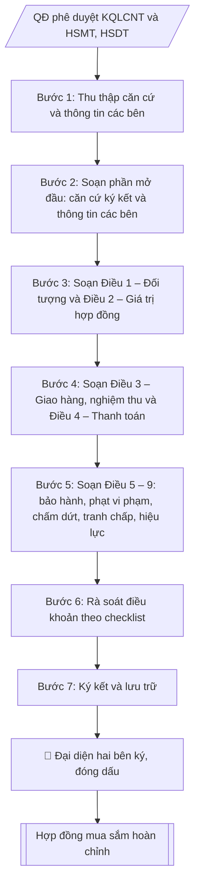

# Soạn hợp đồng mua sắm thiết bị

## Định dạng và file đầu ra
Định dạng đầu ra có thể chọn theo sản phẩm/yêu cầu: .docx, .pdf. Đọc mục “Định dạng bổ sung” trong quy cách đầu ra trước khi chọn.

**Phải tạo file thực tế để tải xuống, không chỉ trả nội dung trong chat.** Định dạng mặc định của skill: **.docx**. Nếu có bảng số liệu nghiệp vụ yêu cầu file bảng tính riêng, tạo thêm Excel theo yêu cầu; không tự tạo file kiểm tra. Không chờ người dùng yêu cầu xuất file lần nữa. Ưu tiên định dạng người dùng chỉ định; đọc quy tắc xuất file tại references/quy-cach-dau-ra.md.

## Quy cách đầu ra và thông tin thiếu
Đọc [quy cách và cấu trúc sản phẩm](references/quy-cach-dau-ra.md) trước khi soạn/xuất. File giao chỉ gồm sản phẩm nghiệp vụ được yêu cầu; kiểm tra nội bộ không xuất kèm. Thiếu thông tin thì giữ nguyên trường/mục và chỗ điền theo mẫu gốc (dòng dấu chấm, dấu gạch hoặc ô trống); không tự điền dữ liệu mẫu, số 0, mã chờ xác minh hay dòng chờ ký. Mẫu chuyên ngành còn áp dụng được ưu tiên về cấu trúc, mã biểu và người ký. Bản đầy đủ: [quy tắc chung](references/quy-tac-chung.md).

## Kiểm soát áp dụng và phê duyệt
Trước khi chạy, xác định `ngay_ap_dung`, `loai_hinh_truong`, `quy_che_noi_bo`, `nguon_du_lieu`, `nguoi_kiem_duyet`; chỉ hỏi thông tin liên quan nghiệp vụ, không dùng giá trị giả định thay dữ liệu bắt buộc. Đối chiếu căn cứ pháp lý với văn bản gốc, hiệu lực, điều khoản áp dụng và chuyển tiếp. Bản đầy đủ: [quy tắc chung](references/quy-tac-chung.md).

Nếu có cập nhật pháp lý dưới đây, đọc [căn cứ và điều kiện áp dụng](references/phap-ly.md) trước khi làm. Quy trình dưới đây giữ nghiệp vụ từ bản gốc; mọi viện dẫn văn bản, mẫu biểu, điều khoản phải theo căn cứ đã chọn trong phap-ly.md, không theo văn bản cũ.

## Giới hạn và human gate
AI hỗ trợ chuẩn bị và đối chiếu; cán bộ phụ trách kiểm tra dữ liệu/căn cứ, người có thẩm quyền duyệt và ký. Không đánh dấu đã ký, đã duyệt, đã công bố khi chưa có chứng cứ. Dữ liệu sinh viên, sức khỏe, nhân sự, tài chính chỉ dùng theo mục đích và phân quyền, che thông tin định danh khi dùng ví dụ (Luật 91/2025/QH15, hiệu lực 01/01/2026); không tải dữ liệu lên dịch vụ ngoài khi chưa có quyền. Bản đầy đủ: [quy tắc chung](references/quy-tac-chung.md).

## Khi nào dùng
Khi cần ký hợp đồng mua sắm thiết bị với nhà thầu trúng thầu / được chỉ định;
khi lập phụ lục điều chỉnh, bổ sung hợp đồng.

## Đầu vào (Input)
| Trường | Mô tả | Bắt buộc |
|---|---|---|
| `ben_a` | Thông tin trường (tên, địa chỉ, MST, người đại diện, chức vụ) | Có |
| `ben_b` | Thông tin nhà thầu (tên, địa chỉ, MST, người đại diện) | Có |
| `goi_thau` | Tên gói thầu, căn cứ kết quả lựa chọn nhà thầu (số quyết định phê duyệt) | Có |
| `danh_muc` | Danh mục thiết bị: tên, model, số lượng, đơn giá | Có |
| `gia_tri` | Giá trị hợp đồng (đồng, đã gồm VAT) | Có |
| `giao_hang` | Thời gian, địa điểm giao hàng | Có |
| `thanh_toan` | Số đợt, tỷ lệ, điều kiện thanh toán | Có |
| `bao_hanh` | Thời gian bảo hành, trách nhiệm bảo hành | Có |
| `phat_vi_pham` | Mức phạt chậm tiến độ / vi phạm chất lượng | Không (mặc định: theo quy định) |

## Quy trình
**Ràng buộc pháp lý khi thực hiện** (trích references/phap-ly.md; đối chiếu toàn văn và hiệu lực tại ngày nghiệp vụ):
- Nghị định 214/2025, sửa đổi 165/2026, 170/2026, 349/2026; VBHN 36/2026/VBHN-NĐ-BTC ngày 23/09/2026: Yêu cầu chủ thể, nguồn vốn, loại gói, dự toán được duyệt, phân cấp thẩm quyền, mua sắm tập trung, điều kiện áp dụng hình thức và thời điểm phát hành. Đối chiếu Luật Đấu thầu hợp nhất 74/VBHN-VPQH ngày 25/03/2026 và nghị định hiện hành. Không suy ra chỉ định thầu/mua sắm trực tiếp chỉ vì nhỏ lẻ hoặc cấp bách; ghi điều khoản và điều kiện từng gói, cán bộ thẩm định xác nhận. Không tự đặt hạn mức.
- Trước Bước 1: chọn căn cứ theo đối tượng, loại hình trường và chuyển tiếp; lập bảng văn bản / điều khoản / lý do áp dụng / bằng chứng. Thiếu văn bản gốc hoặc điều khoản thì ghi nhận nội bộ [CẦN XÁC MINH] (không đưa vào file giao), để trống phần tương ứng, chưa kết luận tuân thủ.

**Bước 1. Thu thập căn cứ và thông tin các bên**
- Làm gì: thu thập quyết định phê duyệt kết quả lựa chọn nhà thầu (`goi_thau`: số quyết định,
  ngày ban hành, tên gói thầu), HSMT và HSDT của nhà thầu trúng thầu; ghi nhận thông tin
  `ben_a` và `ben_b` (tên đầy đủ, địa chỉ, mã số thuế, tài khoản ngân hàng, người đại diện
  theo pháp luật, chức vụ); kiểm tra người đại diện có đúng thẩm quyền ký (giấy ủy quyền
  nếu người ký không phải người đại diện theo pháp luật).
- Dùng input: `ben_a`, `ben_b`, `goi_thau`.
- Vai trò: Chuyên viên Phòng Quản trị – Thiết bị · AI hỗ trợ: tổng hợp, chuẩn hóa dữ liệu, đối chiếu tự động, cảnh báo sai lệch · ⏱ ~1–2 giờ (ước tính)
- Lưu ý nghiệp vụ: hợp đồng ký với người không có thẩm quyền có nguy cơ vô hiệu — kiểm tra
  giấy phép/điều lệ hoặc giấy ủy quyền còn hiệu lực của bên B trước khi soạn.
- → Kết quả bước: hồ sơ căn cứ ký hợp đồng (QĐ phê duyệt KQLCNT, HSMT/HSDT, thông tin
  pháp lý hai bên đã kiểm tra thẩm quyền).

**Bước 2. Soạn phần mở đầu: căn cứ ký kết và thông tin các bên**
- Làm gì: viết phần căn cứ (Luật Đấu thầu, quyết định phê duyệt KQLCNT, HSMT/HSDT) và phần
  thông tin hai bên (Bên A – Bên mua, Bên B – Bên bán) đầy đủ theo hồ sơ Bước 1; ghi rõ
  thời gian, địa điểm ký kết.
- Dùng input: kết quả Bước 1.
- Vai trò: Chuyên viên Phòng Quản trị – Thiết bị · AI hỗ trợ: soạn dự thảo · ⏱ ~30–60 phút (ước tính)
- Lưu ý nghiệp vụ: trích dẫn căn cứ phải ghi đủ số, ngày, cơ quan ban hành của quyết định
  phê duyệt KQLCNT — đây là mắt xích pháp lý của toàn bộ hợp đồng.
- → Kết quả bước: dự thảo phần mở đầu hợp đồng.

**Bước 3. Soạn Điều 1 – Đối tượng và Điều 2 – Giá trị hợp đồng**
- Làm gì: viết Điều 1 (danh mục thiết bị từ `danh_muc`: tên, model, số lượng, đơn giá, thông
  số kỹ thuật — khớp với HSDT của nhà thầu trúng thầu) và Điều 2 (giá trị hợp đồng
  `gia_tri`, đã gồm VAT, ghi cả bằng số và bằng chữ).
- Dùng input: `danh_muc`, `gia_tri`, `goi_thau` (đối chiếu).
- Vai trò: Chuyên viên Phòng Quản trị – Thiết bị · AI hỗ trợ: soạn dự thảo · ⏱ ~30–60 phút (ước tính)
- Lưu ý nghiệp vụ: giá trị hợp đồng phải khớp tuyệt đối với giá trúng thầu trong quyết định
  phê duyệt KQLCNT; chênh lệch dù nhỏ cũng phải làm rõ trước khi ký.
- → Kết quả bước: dự thảo Điều 1 – 2.

**Bước 4. Soạn Điều 3 – Giao hàng, nghiệm thu và Điều 4 – Thanh toán**
- Làm gì: viết Điều 3 (thời gian, địa điểm giao hàng; thành phần và thủ tục nghiệm thu,
  bàn giao từ `giao_hang`) và Điều 4 (số đợt thanh toán, tỷ lệ, điều kiện từng đợt, hồ sơ
  thanh toán phải nộp từ `thanh_toan`).
- Dùng input: `giao_hang`, `thanh_toan`.
- Vai trò: Chuyên viên Phòng Quản trị – Thiết bị · AI hỗ trợ: soạn dự thảo · ⏱ ~0,5–1 ngày làm việc (ước tính)
- Lưu ý nghiệp vụ: điều kiện thanh toán phải gắn với mốc nghiệm thu/bàn giao cụ thể, tránh
  điều khoản "thanh toán khi có tiền"; hồ sơ thanh toán liệt kê rõ để sau này làm checklist
  chứng từ.
- → Kết quả bước: dự thảo Điều 3 – 4.

**Bước 5. Soạn Điều 5 – 9: bảo hành, phạt vi phạm, chấm dứt, tranh chấp, hiệu lực**
- Làm gì: viết Điều 5 (thời gian bảo hành, trách nhiệm khắc phục từ `bao_hanh`); Điều 6
  (mức phạt chậm tiến độ/vi phạm chất lượng từ `phat_vi_pham`, mặc định theo quy định nếu
  không chỉ định); Điều 7 (chấm dứt hợp đồng); Điều 8 (giải quyết tranh chấp); Điều 9
  (hiệu lực, số bản, nơi lưu).
- Dùng input: `bao_hanh`, `phat_vi_pham`.
- Vai trò: Chuyên viên Phòng Quản trị – Thiết bị · AI hỗ trợ: soạn dự thảo, lưu trữ hồ sơ · ⏱ ~30–60 phút (ước tính)
- Lưu ý nghiệp vụ: mức phạt vi phạm có trần tối đa theo quy định — không đặt vượt trần;
  điều khoản bảo hành ghi rõ thời gian phản ứng (ví dụ khắc phục trong 48 giờ) để có căn cứ
  xử lý sự cố.
- → Kết quả bước: dự thảo Điều 5 – 9 (hoàn thành toàn văn hợp đồng).

**Bước 6. Rà soát điều khoản theo checklist**
- Làm gì: rà soát toàn văn theo checklist: giá trị hợp đồng khớp quyết định phê duyệt KQLCNT;
  danh mục, thông số kỹ thuật khớp HSMT/HSDT; điều khoản giao hàng – nghiệm thu – thanh toán
  – bảo hành rõ ràng, khả thi; người đại diện hai bên đúng thẩm quyền; đánh dấu từng mục
  và ghi điểm cần sửa.
- Dùng input: toàn văn dự thảo Bước 2 – 5, kết quả Bước 1.
- Vai trò: Chuyên viên Phòng Quản trị – Thiết bị · AI hỗ trợ: đối chiếu tự động, cảnh báo sai lệch · ⏱ ~1–2 giờ (ước tính)
- Lưu ý nghiệp vụ: điểm chưa đạt thì quay lại sửa ở đúng điều khoản tương ứng, không sửa
  chắp vá gây mâu thuẫn giữa các điều.
- → Kết quả bước: kết quả đối chiếu nội bộ (không xuất kèm file) + danh sách điểm cần sửa (nếu có).

**Bước 7. Ký kết và lưu trữ**
- Làm gì: hai bên ký, đóng dấu; lập số bản theo thỏa thuận (mỗi bên giữ số bản như nhau);
  lưu hồ sơ hợp đồng làm căn cứ cho nghiệm thu, thanh toán và bảo hành về sau.
- Dùng input: kết quả Bước 6 (hợp đồng đã rà soát đạt).
- Vai trò: Đại diện hai bên ký (Bên A: Hiệu trưởng hoặc người được ủy quyền) · AI hỗ trợ: lưu trữ hồ sơ · ⏱ ~1–3 giờ (ước tính)
- Lưu ý nghiệp vụ: hợp đồng chỉ có hiệu lực pháp lý đầy đủ khi đã ký và đóng dấu hợp lệ
  của cả hai bên.
- → Kết quả bước: hợp đồng mua sắm thiết bị hoàn chỉnh, đã ký.

## Luồng quy trình (Workflow)

## Đầu ra
- Hợp đồng mua sắm thiết bị hoàn chỉnh.
- Checklist rà soát điều khoản trước khi ký.

**Cấu trúc output chuẩn:** khung mẫu cố định của hợp đồng mua sắm, các phần theo đúng
thứ tự xuất hiện:
1. Quốc hiệu – Tiêu ngữ;
2. Tiêu đề hợp đồng + số hợp đồng;
3. Căn cứ ký kết (Luật Đấu thầu, quyết định phê duyệt KQLCNT, HSMT/HSDT);
4. Thời gian, địa điểm ký kết; thông tin Bên A (Bên mua) và Bên B (Bên bán);
5. Các điều khoản: Điều 1 – Đối tượng hợp đồng; Điều 2 – Giá trị hợp đồng; Điều 3 – Giao
   hàng, nghiệm thu, bàn giao; Điều 4 – Thanh toán; Điều 5 – Bảo hành, bảo trì; Điều 6 –
   Phạt vi phạm, bồi thường thiệt hại; Điều 7 – Chấm dứt hợp đồng; Điều 8 – Giải quyết
   tranh chấp; Điều 9 – Hiệu lực (số bản, nơi lưu);
6. Chữ ký hai bên (ký, đóng dấu, ghi rõ họ tên, chức vụ);
7. (Kèm theo) Checklist rà soát điều khoản trước khi ký.

File nghiệp vụ thực tế theo định dạng mặc định ở đầu skill hoặc định dạng người dùng yêu cầu, kèm liên kết tải trong phản hồi cuối.

Sản phẩm nghiệp vụ hoàn chỉnh theo [quy cách và cấu trúc](references/quy-cach-dau-ra.md), giữ các trường chưa có dữ liệu ở trạng thái trống. Không xuất kèm checklist/phụ lục kiểm tra đầu ra.

## Kiểm tra nội bộ trước khi giao
Các tiêu chí sau dùng để tự đối chiếu; không sao chép vào file xuất. Mục thiếu dữ liệu được để trống, không đánh dấu đã đạt hoặc đã duyệt.

- [ ] Đủ các phần theo "Cấu trúc output chuẩn": Quốc hiệu; Tiêu đề hợp đồng + số hợp đồng;; Căn cứ ký kết (Luật Đấu thầu, quyết định phê…; Thời gian, địa điểm ký kết; thông tin Bên A…; Các điều khoản; Chữ ký hai bên (ký, đóng dấu, ghi rõ họ tên,…; …
- [ ] Có đầy đủ sản phẩm: Hợp đồng mua sắm thiết bị hoàn chỉnh
- [ ] Có đầy đủ sản phẩm: Checklist rà soát điều khoản trước khi ký
- [ ] Mọi số liệu, tên, ngày tháng trong output khớp với Input đã cung cấp (không thêm bớt, không suy đoán)
- [ ] Không bịa đặt số liệu, minh chứng, trích dẫn hay căn cứ
- [ ] Đúng thể thức, định dạng văn bản theo quy định hiện hành
- [ ] Căn cứ pháp lý nêu đầy đủ, còn hiệu lực tại thời điểm lập
- [ ] Đã qua Human gate: người có thẩm quyền đã kiểm tra/ký duyệt trước khi phát hành
- [ ] Hợp đồng ký với người không có thẩm quyền có nguy cơ vô hiệu — kiểm tra
- [ ] Trích dẫn căn cứ phải ghi đủ số, ngày, cơ quan ban hành của quyết định

## Căn cứ & lưu ý
- Luật Đấu thầu 2023; Bộ luật Dân sự 2015 (về hợp đồng).
- Hợp đồng là căn cứ pháp lý cho nghiệm thu, thanh toán và bảo hành về sau.
- Không dùng tên thật của trường/cá nhân khi mô phỏng.

## Tư liệu đối chiếu
Bản gốc trước cập nhật pháp lý (kèm ví dụ giả lập) lưu tại `references/quy-trinh-lich-su.md`, chỉ để đối chiếu hồ sơ lịch sử; không dùng căn cứ, mẫu hay số liệu trong đó làm chỉ dẫn hiện hành.

## Quản trị phiên bản
- Phiên bản gói `1.3.2` (cập nhật 2026-10-10); hồ sơ đầy đủ tại [references/version.json](references/version.json).
- Người phê duyệt nghiệp vụ: **chưa chỉ định**. Trạng thái: dự thảo nghiệp vụ; kiểm tra pháp lý trước thực thi. Ngày cập nhật không đồng nghĩa mọi văn bản đã được rà soát toàn văn.
- Giấy phép theo LICENSE của kho (bản quyền CES Global). Lịch sử thay đổi: CHANGELOG.md.
