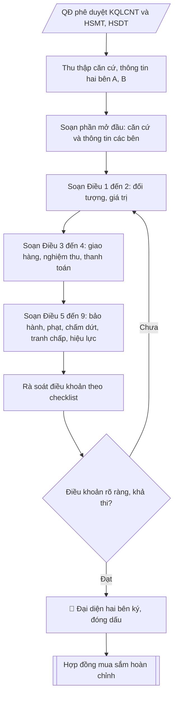

# Skill: Soạn hợp đồng mua sắm thiết bị

## Khi nào dùng
Khi cần ký hợp đồng mua sắm thiết bị với nhà thầu trúng thầu / được chỉ định;
khi lập phụ lục điều chỉnh, bổ sung hợp đồng.

## Đầu vào (Input)

| Trường | Mô tả | Bắt buộc |
|---|---|---|
| `ben_a` | Thông tin trường (tên, địa chỉ, MST, người đại diện, chức vụ) | Có |
| `ben_b` | Thông tin nhà thầu (tên, địa chỉ, MST, người đại diện) | Có |
| `goi_thau` | Tên gói thầu, căn cứ kết quả lựa chọn nhà thầu (số quyết định phê duyệt) | Có |
| `danh_muc` | Danh mục thiết bị: tên, model, số lượng, đơn giá | Có |
| `gia_tri` | Giá trị hợp đồng (đồng, đã gồm VAT) | Có |
| `giao_hang` | Thời gian, địa điểm giao hàng | Có |
| `thanh_toan` | Số đợt, tỷ lệ, điều kiện thanh toán | Có |
| `bao_hanh` | Thời gian bảo hành, trách nhiệm bảo hành | Có |
| `phat_vi_pham` | Mức phạt chậm tiến độ / vi phạm chất lượng | Không (mặc định: theo quy định) |

## Quy trình

**Bước 1. Thu thập căn cứ và thông tin các bên**
- Làm gì: thu thập quyết định phê duyệt kết quả lựa chọn nhà thầu (`goi_thau`: số quyết định,
  ngày ban hành, tên gói thầu), HSMT và HSDT của nhà thầu trúng thầu; ghi nhận thông tin
  `ben_a` và `ben_b` (tên đầy đủ, địa chỉ, mã số thuế, tài khoản ngân hàng, người đại diện
  theo pháp luật, chức vụ); kiểm tra người đại diện có đúng thẩm quyền ký (giấy ủy quyền
  nếu người ký không phải người đại diện theo pháp luật).
- Dùng input: `ben_a`, `ben_b`, `goi_thau`.
- Vai trò: Chuyên viên Phòng Quản trị – Thiết bị · AI hỗ trợ: tổng hợp, chuẩn hóa dữ liệu, đối chiếu tự động, cảnh báo sai lệch · ⏱ ~1–2 giờ (ước tính)
- Lưu ý nghiệp vụ: hợp đồng ký với người không có thẩm quyền có nguy cơ vô hiệu — kiểm tra
  giấy phép/điều lệ hoặc giấy ủy quyền còn hiệu lực của bên B trước khi soạn.
- → Kết quả bước: hồ sơ căn cứ ký hợp đồng (QĐ phê duyệt KQLCNT, HSMT/HSDT, thông tin
  pháp lý hai bên đã kiểm tra thẩm quyền).

**Bước 2. Soạn phần mở đầu: căn cứ ký kết và thông tin các bên**
- Làm gì: viết phần căn cứ (Luật Đấu thầu, quyết định phê duyệt KQLCNT, HSMT/HSDT) và phần
  thông tin hai bên (Bên A – Bên mua, Bên B – Bên bán) đầy đủ theo hồ sơ Bước 1; ghi rõ
  thời gian, địa điểm ký kết.
- Dùng input: kết quả Bước 1.
- Vai trò: Chuyên viên Phòng Quản trị – Thiết bị · AI hỗ trợ: soạn dự thảo · ⏱ ~30–60 phút (ước tính)
- Lưu ý nghiệp vụ: trích dẫn căn cứ phải ghi đủ số, ngày, cơ quan ban hành của quyết định
  phê duyệt KQLCNT — đây là mắt xích pháp lý của toàn bộ hợp đồng.
- → Kết quả bước: dự thảo phần mở đầu hợp đồng.

**Bước 3. Soạn Điều 1 – Đối tượng và Điều 2 – Giá trị hợp đồng**
- Làm gì: viết Điều 1 (danh mục thiết bị từ `danh_muc`: tên, model, số lượng, đơn giá, thông
  số kỹ thuật — khớp với HSDT của nhà thầu trúng thầu) và Điều 2 (giá trị hợp đồng
  `gia_tri`, đã gồm VAT, ghi cả bằng số và bằng chữ).
- Dùng input: `danh_muc`, `gia_tri`, `goi_thau` (đối chiếu).
- Vai trò: Chuyên viên Phòng Quản trị – Thiết bị · AI hỗ trợ: soạn dự thảo · ⏱ ~30–60 phút (ước tính)
- Lưu ý nghiệp vụ: giá trị hợp đồng phải khớp tuyệt đối với giá trúng thầu trong quyết định
  phê duyệt KQLCNT; chênh lệch dù nhỏ cũng phải làm rõ trước khi ký.
- → Kết quả bước: dự thảo Điều 1 – 2.

**Bước 4. Soạn Điều 3 – Giao hàng, nghiệm thu và Điều 4 – Thanh toán**
- Làm gì: viết Điều 3 (thời gian, địa điểm giao hàng; thành phần và thủ tục nghiệm thu,
  bàn giao từ `giao_hang`) và Điều 4 (số đợt thanh toán, tỷ lệ, điều kiện từng đợt, hồ sơ
  thanh toán phải nộp từ `thanh_toan`).
- Dùng input: `giao_hang`, `thanh_toan`.
- Vai trò: Chuyên viên Phòng Quản trị – Thiết bị · AI hỗ trợ: soạn dự thảo · ⏱ ~0,5–1 ngày làm việc (ước tính)
- Lưu ý nghiệp vụ: điều kiện thanh toán phải gắn với mốc nghiệm thu/bàn giao cụ thể, tránh
  điều khoản "thanh toán khi có tiền"; hồ sơ thanh toán liệt kê rõ để sau này làm checklist
  chứng từ.
- → Kết quả bước: dự thảo Điều 3 – 4.

**Bước 5. Soạn Điều 5 – 9: bảo hành, phạt vi phạm, chấm dứt, tranh chấp, hiệu lực**
- Làm gì: viết Điều 5 (thời gian bảo hành, trách nhiệm khắc phục từ `bao_hanh`); Điều 6
  (mức phạt chậm tiến độ/vi phạm chất lượng từ `phat_vi_pham`, mặc định theo quy định nếu
  không chỉ định); Điều 7 (chấm dứt hợp đồng); Điều 8 (giải quyết tranh chấp); Điều 9
  (hiệu lực, số bản, nơi lưu).
- Dùng input: `bao_hanh`, `phat_vi_pham`.
- Vai trò: Chuyên viên Phòng Quản trị – Thiết bị · AI hỗ trợ: soạn dự thảo, lưu trữ hồ sơ · ⏱ ~30–60 phút (ước tính)
- Lưu ý nghiệp vụ: mức phạt vi phạm có trần tối đa theo quy định — không đặt vượt trần;
  điều khoản bảo hành ghi rõ thời gian phản ứng (ví dụ khắc phục trong 48 giờ) để có căn cứ
  xử lý sự cố.
- → Kết quả bước: dự thảo Điều 5 – 9 (hoàn thành toàn văn hợp đồng).

**Bước 6. Rà soát điều khoản theo checklist**
- Làm gì: rà soát toàn văn theo checklist: giá trị hợp đồng khớp quyết định phê duyệt KQLCNT;
  danh mục, thông số kỹ thuật khớp HSMT/HSDT; điều khoản giao hàng – nghiệm thu – thanh toán
  – bảo hành rõ ràng, khả thi; người đại diện hai bên đúng thẩm quyền; đánh dấu từng mục
  và ghi điểm cần sửa.
- Dùng input: toàn văn dự thảo Bước 2 – 5, kết quả Bước 1.
- Vai trò: Chuyên viên Phòng Quản trị – Thiết bị · AI hỗ trợ: đối chiếu tự động, cảnh báo sai lệch · ⏱ ~1–2 giờ (ước tính)
- Lưu ý nghiệp vụ: điểm chưa đạt thì quay lại sửa ở đúng điều khoản tương ứng, không sửa
  chắp vá gây mâu thuẫn giữa các điều.
- → Kết quả bước: checklist rà soát đã đánh dấu + danh sách điểm cần sửa (nếu có).

**Bước 7. Ký kết và lưu trữ**
- Làm gì: hai bên ký, đóng dấu; lập số bản theo thỏa thuận (mỗi bên giữ số bản như nhau);
  lưu hồ sơ hợp đồng làm căn cứ cho nghiệm thu, thanh toán và bảo hành về sau.
- Dùng input: kết quả Bước 6 (hợp đồng đã rà soát đạt).
- Vai trò: Đại diện hai bên ký (Bên A: Hiệu trưởng hoặc người được ủy quyền) · AI hỗ trợ: lưu trữ hồ sơ · ⏱ ~1–3 giờ (ước tính)
- Lưu ý nghiệp vụ: hợp đồng chỉ có hiệu lực pháp lý đầy đủ khi đã ký và đóng dấu hợp lệ
  của cả hai bên.
- → Kết quả bước: hợp đồng mua sắm thiết bị hoàn chỉnh, đã ký.

## Luồng quy trình (Workflow)



## Đầu ra (Output)
- Hợp đồng mua sắm thiết bị hoàn chỉnh.
- Checklist rà soát điều khoản trước khi ký.

**Cấu trúc output chuẩn:** khung mẫu cố định của hợp đồng mua sắm, các phần theo đúng
thứ tự xuất hiện:
1. Quốc hiệu – Tiêu ngữ;
2. Tiêu đề hợp đồng + số hợp đồng;
3. Căn cứ ký kết (Luật Đấu thầu, quyết định phê duyệt KQLCNT, HSMT/HSDT);
4. Thời gian, địa điểm ký kết; thông tin Bên A (Bên mua) và Bên B (Bên bán);
5. Các điều khoản: Điều 1 – Đối tượng hợp đồng; Điều 2 – Giá trị hợp đồng; Điều 3 – Giao
   hàng, nghiệm thu, bàn giao; Điều 4 – Thanh toán; Điều 5 – Bảo hành, bảo trì; Điều 6 –
   Phạt vi phạm, bồi thường thiệt hại; Điều 7 – Chấm dứt hợp đồng; Điều 8 – Giải quyết
   tranh chấp; Điều 9 – Hiệu lực (số bản, nơi lưu);
6. Chữ ký hai bên (ký, đóng dấu, ghi rõ họ tên, chức vụ);
7. (Kèm theo) Checklist rà soát điều khoản trước khi ký.

## Checklist nghiệm thu

- [ ] Đủ các phần theo "Cấu trúc output chuẩn": Quốc hiệu; Tiêu đề hợp đồng + số hợp đồng;; Căn cứ ký kết (Luật Đấu thầu, quyết định phê…; Thời gian, địa điểm ký kết; thông tin Bên A…; Các điều khoản; Chữ ký hai bên (ký, đóng dấu, ghi rõ họ tên,…; …
- [ ] Có đầy đủ sản phẩm: Hợp đồng mua sắm thiết bị hoàn chỉnh
- [ ] Có đầy đủ sản phẩm: Checklist rà soát điều khoản trước khi ký
- [ ] Mọi số liệu, tên, ngày tháng trong output khớp với Input đã cung cấp (không thêm bớt, không suy đoán)
- [ ] Không bịa đặt số liệu, minh chứng, trích dẫn hay căn cứ
- [ ] Đúng thể thức, định dạng văn bản theo quy định hiện hành
- [ ] Căn cứ pháp lý nêu đầy đủ, còn hiệu lực tại thời điểm lập
- [ ] Đã qua Human gate: người có thẩm quyền đã kiểm tra/ký duyệt trước khi phát hành
- [ ] Hợp đồng ký với người không có thẩm quyền có nguy cơ vô hiệu — kiểm tra
- [ ] Trích dẫn căn cứ phải ghi đủ số, ngày, cơ quan ban hành của quyết định

> Tiêu chí đạt: tất cả các ô đều được đánh dấu.

## Ví dụ mô phỏng (dữ liệu giả lập)

> Tất cả tên trường, cá nhân, số liệu dưới đây đều là **giả lập**, không liên quan tổ chức/cá nhân có thật.

### Input mẫu

| Trường | Giá trị |
|---|---|
| `ben_a` | Trường Đại học A; Đ/c: 123 đường Giảng Võ, thành phố C; MST: 0900 000 002; Đại diện: PGS.TS. Phạm Văn A – Hiệu trưởng |
| `ben_b` | Công ty TNHH D; Đ/c: 45 đường Láng, thành phố C; MST: 0900 000 003; Đại diện: Ông Đỗ Quang Huy – Giám đốc |
| `goi_thau` | Mua sắm 40 máy tính để bàn cho phòng Lab A2; QĐ phê duyệt KQLCNT số 88/QĐ-ĐHA ngày 25/03/2026 |
| `danh_muc` | 40 bộ máy tính (CPU i5-13400, RAM 16GB, SSD 512GB, màn 24"); đơn giá 58.000.000 đ/bộ |
| `gia_tri` | 2.320.000.000 đồng (đã gồm VAT) |
| `giao_hang` | Trong 30 ngày kể từ ngày hợp đồng có hiệu lực; tại phòng Lab A2, Trường Đại học A |
| `thanh_toan` | 02 đợt: đợt 1 tạm ứng 30% sau khi ký; đợt 2 thanh toán 70% sau nghiệm thu |
| `bao_hanh` | 36 tháng kể từ ngày nghiệm thu; bảo hành tại nơi sử dụng trong 48 giờ |
| `phat_vi_pham` | Phạt 0,05%/ngày chậm giao trên giá trị phần chậm, tối đa 8% giá trị hợp đồng |

### Output mẫu (trích các điều khoản chính)

```
CỘNG HÒA XÃ HỘI CHỦ NGHĨA VIỆT NAM
Độc lập – Tự do – Hạnh phúc

HỢP ĐỒNG MUA SẮM THIẾT BỊ
Số: 12/2026/HĐMB-ĐHA
(Dữ liệu giả lập)

Căn cứ Luật Đấu thầu số 22/2023/QH15;
Căn cứ Quyết định số 88/QĐ-ĐHA ngày 25/03/2026 của Hiệu trưởng Trường Đại học
A về việc phê duyệt kết quả lựa chọn nhà thầu gói thầu "Mua sắm 40 máy
tính để bàn cho phòng Lab A2";

Hôm nay, ngày 28 tháng 03 năm 2026, chúng tôi gồm:

BÊN A (Bên mua): TRƯỜNG ĐẠI HỌC A
Địa chỉ: 123 đường Giảng Võ, thành phố C – MST: 0900 000 002
Đại diện: PGS.TS. Phạm Văn A – Chức vụ: Hiệu trưởng

BÊN B (Bên bán): CÔNG TY TNHH THIẾT BỊ SAO MAI
Địa chỉ: 45 đường Láng, thành phố C – MST: 0900 000 003
Đại diện: Ông Đỗ Quang Huy – Chức vụ: Giám đốc

Hai bên thống nhất ký kết hợp đồng với các điều khoản sau:

Điều 1. Đối tượng hợp đồng
Bên B cung cấp 40 bộ máy tính để bàn (CPU Intel Core i5-13400, RAM 16GB DDR4,
SSD 512GB, màn hình 24" Full HD), đơn giá 58.000.000 đồng/bộ.

Điều 2. Giá trị hợp đồng: 2.320.000.000 đồng (Bằng chữ: Hai tỷ ba trăm hai mươi
triệu đồng), đã bao gồm thuế VAT, chi phí vận chuyển, lắp đặt.

Điều 3. Giao hàng, nghiệm thu
1. Thời gian giao hàng: trong vòng 30 ngày kể từ ngày hợp đồng có hiệu lực.
2. Địa điểm: Phòng Lab A2, Trường Đại học A.
3. Hai bên lập biên bản nghiệm thu, bàn giao theo thực tế.

Điều 4. Thanh toán: 02 đợt.
- Đợt 1: tạm ứng 30% giá trị hợp đồng trong 07 ngày sau khi ký hợp đồng và
  nhận bảo lãnh tạm ứng.
- Đợt 2: thanh toán 70% còn lại trong 15 ngày sau khi nghiệm thu, bàn giao
  và nhận đủ hóa đơn, chứng từ hợp lệ.

Điều 5. Bảo hành: 36 tháng kể từ ngày nghiệm thu; Bên B khắc phục sự cố tại
nơi sử dụng trong vòng 48 giờ kể từ khi nhận thông báo.

Điều 6. Phạt vi phạm: chậm giao hàng phạt 0,05%/ngày trên giá trị phần chậm,
tối đa không quá 8% giá trị hợp đồng.

Điều 7. Chấm dứt hợp đồng: theo thỏa thuận hoặc khi một bên vi phạm nghiêm
trọng nghĩa vụ mà không khắc phục trong 15 ngày kể từ khi được thông báo.

Điều 8. Giải quyết tranh chấp: thương lượng, hòa giải; nếu không thành, đưa ra
Tòa án có thẩm quyền tại thành phố C giải quyết.

Điều 9. Hiệu lực: hợp đồng có hiệu lực kể từ ngày ký, lập thành 04 bản có giá
trị như nhau, mỗi bên giữ 02 bản.

ĐẠI DIỆN BÊN A                          ĐẠI DIỆN BÊN B
    (ký, đóng dấu)                          (ký, đóng dấu)

PGS.TS. Phạm Văn A                 Đỗ Quang Huy
```

### Checklist rà soát (output kèm theo)
- [x] Giá trị hợp đồng khớp quyết định phê duyệt KQLCNT
- [x] Danh mục, thông số kỹ thuật khớp HSMT/HSDT
- [x] Điều khoản giao hàng – nghiệm thu – thanh toán rõ ràng
- [x] Bảo hành, phạt vi phạm đầy đủ
- [x] Người đại diện đúng thẩm quyền

## Căn cứ & lưu ý
- Luật Đấu thầu 2023; Bộ luật Dân sự 2015 (về hợp đồng).
- Hợp đồng là căn cứ pháp lý cho nghiệm thu, thanh toán và bảo hành về sau.
- Không dùng tên thật của trường/cá nhân khi mô phỏng.
