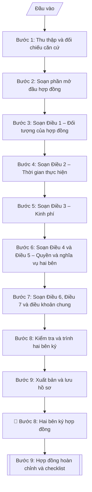

# Soạn hợp đồng thực hiện đề tài KHCN

## Định dạng và file đầu ra
Định dạng đầu ra có thể chọn theo sản phẩm/yêu cầu: .docx, .pdf. Đọc mục “Định dạng bổ sung” trong quy cách đầu ra trước khi chọn.

**Phải tạo file thực tế để tải xuống, không chỉ trả nội dung trong chat.** Định dạng mặc định của skill: **.docx**. Nếu có bảng số liệu nghiệp vụ yêu cầu file bảng tính riêng, tạo thêm Excel theo yêu cầu; không tự tạo file kiểm tra. Không chờ người dùng yêu cầu xuất file lần nữa. Ưu tiên định dạng người dùng chỉ định; đọc quy tắc xuất file tại references/quy-cach-dau-ra.md.

## Quy cách đầu ra và thông tin thiếu
Đọc [quy cách và cấu trúc sản phẩm](references/quy-cach-dau-ra.md) trước khi soạn/xuất. File giao chỉ gồm sản phẩm nghiệp vụ được yêu cầu; kiểm tra nội bộ không xuất kèm. Thiếu thông tin thì giữ nguyên trường/mục và chỗ điền theo mẫu gốc (dòng dấu chấm, dấu gạch hoặc ô trống); không tự điền dữ liệu mẫu, số 0, mã chờ xác minh hay dòng chờ ký. Mẫu chuyên ngành còn áp dụng được ưu tiên về cấu trúc, mã biểu và người ký. Bản đầy đủ: [quy tắc chung](references/quy-tac-chung.md).

## Kiểm soát áp dụng và phê duyệt
Trước khi chạy, xác định `ngay_ap_dung`, `loai_hinh_truong`, `quy_che_noi_bo`, `nguon_du_lieu`, `nguoi_kiem_duyet`; chỉ hỏi thông tin liên quan nghiệp vụ, không dùng giá trị giả định thay dữ liệu bắt buộc. Đối chiếu căn cứ pháp lý với văn bản gốc, hiệu lực, điều khoản áp dụng và chuyển tiếp. Bản đầy đủ: [quy tắc chung](references/quy-tac-chung.md).

## Giới hạn và human gate
AI hỗ trợ chuẩn bị và đối chiếu; cán bộ phụ trách kiểm tra dữ liệu/căn cứ, người có thẩm quyền duyệt và ký. Không đánh dấu đã ký, đã duyệt, đã công bố khi chưa có chứng cứ. Dữ liệu sinh viên, sức khỏe, nhân sự, tài chính chỉ dùng theo mục đích và phân quyền, che thông tin định danh khi dùng ví dụ (Luật 91/2025/QH15, hiệu lực 01/01/2026); không tải dữ liệu lên dịch vụ ngoài khi chưa có quyền. Bản đầy đủ: [quy tắc chung](references/quy-tac-chung.md).

## Khi nào dùng
Khi đề tài NCKH đã được hội đồng xét duyệt và có quyết định phê duyệt: Phòng KHCN
soạn hợp đồng để Hiệu trưởng (bên giao) ký với chủ nhiệm đề tài (bên nhận), làm căn cứ
pháp lý cho việc cấp kinh phí, kiểm tra tiến độ, nghiệm thu và thanh lý đề tài.

## Đầu vào (Input)
| Trường | Mô tả | Bắt buộc |
|---|---|---|
| `so_hop_dong` | Số, ký hiệu hợp đồng | Có |
| `ben_giao` | Tên cơ quan, người đại diện, chức vụ (VD: Hiệu trưởng) | Có |
| `ben_nhan` | Họ tên, học hàm/học vị, đơn vị của chủ nhiệm đề tài | Có |
| `ten_de_tai` | Tên đầy đủ của đề tài | Có |
| `ma_so_de_tai` | Mã số đề tài theo quyết định phê duyệt | Có |
| `quyet_dinh_phe_duyet` | Số, ngày quyết định phê duyệt đề tài | Có |
| `thoi_gian_thuc_hien` | Từ ngày/tháng/năm đến ngày/tháng/năm | Có |
| `tong_kinh_phi` | Tổng kinh phí (ghi cả số và chữ) | Có |
| `tien_do_cap_kinh_phi` | Các đợt cấp kinh phí (tỷ lệ %, điều kiện từng đợt) | Có |
| `san_pham_nghiem_thu` | Sản phẩm phải đạt khi nghiệm thu (đối chiếu thuyết minh đã duyệt) | Có |
| `dieu_khoan_dac_biet` | Thỏa thuận riêng nếu có (sở hữu trí tuệ, bảo mật...) | Không |
| `ngay_ky` | Địa danh, ngày tháng năm ký hợp đồng | Có |

## Quy trình
**Ràng buộc pháp lý khi thực hiện** (trích references/phap-ly.md; đối chiếu toàn văn và hiệu lực tại ngày nghiệp vụ):
- Luật 93/2025/QH15; Nghị định 265/2025 và 267/2025, hiệu lực 14/10/2025: Yêu cầu cấp nhiệm vụ, nguồn kinh phí, tài trợ/đặt hàng, ngày phê duyệt, quy chế cơ quan tài trợ, phương thức khoán và quyền sử dụng kết quả. Đối chiếu NĐ 265 về tài chính và NĐ 267 về nhiệm vụ; không cố định thang xếp loại hoặc thu hồi toàn bộ kinh phí cho mọi đề tài. Nghiệm thu dựa hợp đồng và tiêu chí được duyệt, hội đồng có thẩm quyền xác nhận.
- Trước Bước 1: chọn căn cứ theo đối tượng, loại hình trường và chuyển tiếp; lập bảng văn bản / điều khoản / lý do áp dụng / bằng chứng. Thiếu văn bản gốc hoặc điều khoản thì ghi nhận nội bộ [CẦN XÁC MINH] (không đưa vào file giao), để trống phần tương ứng, chưa kết luận tuân thủ.

**Bước 1. Thu thập và đối chiếu căn cứ**
- Làm gì: thu thập `quyet_dinh_phe_duyet`, thuyết minh và dự toán kinh phí đã duyệt; lập bảng đối chiếu các số liệu then chốt (tên đề tài, mã số, thời gian, tổng kinh phí, danh mục sản phẩm) — mọi số liệu đưa vào hợp đồng phải khớp 100% với các văn bản này; ghi lại số và ngày ban hành của quyết định phê duyệt để dùng ở phần căn cứ.
- Dùng input: `quyet_dinh_phe_duyet`, `ten_de_tai`, `ma_so_de_tai`, `thoi_gian_thuc_hien`, `tong_kinh_phi`, `san_pham_nghiem_thu`.
- Vai trò: Chuyên viên Phòng KHCN · AI hỗ trợ: lập bảng đối chiếu số liệu căn cứ · ⏱ ~30–45 phút (ước tính)
- Lưu ý nghiệp vụ: sai lệch số liệu giữa hợp đồng và quyết định phê duyệt là căn cứ để từ chối thanh toán sau này — bước này không được làm qua loa.
- → Kết quả bước: bảng đối chiếu số liệu căn cứ (đã xác nhận khớp).

**Bước 2. Soạn phần mở đầu hợp đồng**
- Làm gì: viết tiêu đề "HỢP ĐỒNG THỰC HIỆN ĐỀ TÀI KHOA HỌC CÔNG NGHỆ" + `so_hop_dong`; viết các dòng căn cứ (quy chế quản lý đề tài, `quyet_dinh_phe_duyet`, thuyết minh và dự toán kinh phí đã duyệt); điền đầy đủ thông tin `ben_giao` (tên cơ quan, người đại diện, chức vụ) và `ben_nhan` (họ tên, học hàm/học vị, đơn vị); ghi địa điểm và ngày ký trong câu mở đầu "Hôm nay, ngày...".
- Dùng input: `so_hop_dong`, `ben_giao`, `ben_nhan`, `quyet_dinh_phe_duyet`, `ngay_ky`.
- Vai trò: Chuyên viên Phòng KHCN · AI hỗ trợ: soạn dự thảo phần mở đầu (tiêu đề, căn cứ, thông tin hai bên) · ⏱ ~20–30 phút (ước tính)
- Lưu ý nghiệp vụ: người đại diện bên giao phải có thẩm quyền ký (Hiệu trưởng hoặc người được ủy quyền bằng văn bản); kiểm tra số hợp đồng không trùng với các hợp đồng đã ký.
- → Kết quả bước: dự thảo phần mở đầu (tiêu đề + căn cứ + thông tin hai bên).

**Bước 3. Soạn Điều 1 – Đối tượng của hợp đồng**
- Làm gì: ghi `ten_de_tai`, `ma_so_de_tai`, mục tiêu chính (trích nguyên văn từ thuyết minh đã duyệt), danh mục `san_pham_nghiem_thu` phải hoàn thành.
- Dùng input: `ten_de_tai`, `ma_so_de_tai`, `san_pham_nghiem_thu`, kết quả bước 1.
- Vai trò: Chuyên viên Phòng KHCN · AI hỗ trợ: chép nguyên văn từ thuyết minh đã duyệt · ⏱ ~20–30 phút (ước tính)
- Lưu ý nghiệp vụ: danh mục sản phẩm ở Điều 1 là căn cứ duy nhất để nghiệm thu — phải chép nguyên văn từ thuyết minh đã duyệt, không được viết lại theo cách hiểu khác.
- → Kết quả bước: dự thảo Điều 1.

**Bước 4. Soạn Điều 2 – Thời gian thực hiện**
- Làm gì: ghi ngày bắt đầu – ngày kết thúc từ `thoi_gian_thuc_hien`; quy định các mốc báo cáo tiến độ định kỳ (6 tháng/lần) mà bên nhận phải nộp về Phòng KHCN.
- Dùng input: `thoi_gian_thuc_hien`.
- Vai trò: Chuyên viên Phòng KHCN · AI hỗ trợ: soạn Điều 2 và quy định mốc báo cáo tiến độ định kỳ · ⏱ ~15–20 phút (ước tính)
- Lưu ý nghiệp vụ: thời gian trong hợp đồng phải khớp quyết định phê duyệt; nên ghi rõ báo cáo tiến độ là nghĩa vụ gắn với điều kiện cấp kinh phí đợt 2 (liên kết với Điều 3).
- → Kết quả bước: dự thảo Điều 2.

**Bước 5. Soạn Điều 3 – Kinh phí**
- Làm gì: ghi `tong_kinh_phi` cả số và chữ, nguồn kinh phí; chi tiết `tien_do_cap_kinh_phi` theo từng đợt (tỷ lệ % + điều kiện cụ thể từng đợt); ghi nguyên tắc sử dụng kinh phí đúng mục đích, đúng chế độ và quyết toán theo quy định.
- Dùng input: `tong_kinh_phi`, `tien_do_cap_kinh_phi`.
- Vai trò: Trưởng Phòng KHCN · AI hỗ trợ: soạn chi tiết từng đợt cấp · ⏱ ~30 phút (ước tính)
- Lưu ý nghiệp vụ: điều kiện mỗi đợt cấp phải đo lường được ("sau khi báo cáo giữa kỳ được đánh giá đạt yêu cầu" — cần rõ ai đánh giá, theo tiêu chí nào); tránh ghi chung chung "cấp theo tiến độ".
- → Kết quả bước: dự thảo Điều 3.

**Bước 6. Soạn Điều 4 và Điều 5 – Quyền và nghĩa vụ hai bên**
- Làm gì: Điều 4 (Bên giao): cấp kinh phí đúng tiến độ; kiểm tra, giám sát tiến độ và việc sử dụng kinh phí; hỗ trợ thủ tục hành chính; tổ chức nghiệm thu đúng hạn. Điều 5 (Bên nhận): triển khai đúng thuyết minh đã duyệt; nộp báo cáo tiến độ định kỳ và đột xuất khi được yêu cầu; sử dụng kinh phí đúng mục đích, đúng chế độ; chịu trách nhiệm khoa học về kết quả; không được chuyển giao toàn bộ hoặc một phần công việc khi chưa được đồng ý bằng văn bản.
- Dùng input: `ben_giao`, `ben_nhan`.
- Vai trò: Chuyên viên Phòng KHCN · AI hỗ trợ: soạn dự thảo Điều 4 và Điều 5 theo mẫu chuẩn · ⏱ ~20–30 phút (ước tính)
- Lưu ý nghiệp vụ: nghĩa vụ của Bên nhận phải tương ứng với quyền giám sát của Bên giao; điều khoản "không chuyển giao" cần ghi rõ hình thức đồng ý (bằng văn bản) để tránh tranh chấp.
- → Kết quả bước: dự thảo Điều 4 và Điều 5.

**Bước 7. Soạn Điều 6, Điều 7 và điều khoản chung**
- Làm gì: Điều 6 (Nghiệm thu): điều kiện nghiệm thu (hoàn thành sản phẩm, báo cáo tổng kết, quyết toán), thành lập hội đồng, các mức xếp loại (Xuất sắc/Đạt/Không đạt). Điều 7 (Thanh lý): điều kiện thanh lý; xử lý khi không hoàn thành hoặc vi phạm (tạm dừng cấp kinh phí, thu hồi kinh phí đã cấp, xem xét trách nhiệm). Điều khoản chung: hiệu lực hợp đồng, sửa đổi bổ sung phải lập thành văn bản, số bản có giá trị pháp lý như nhau, chữ ký hai bên. Bổ sung `dieu_khoan_dac_biet` (sở hữu trí tuệ, bảo mật...) nếu có.
- Dùng input: `san_pham_nghiem_thu`, `dieu_khoan_dac_biet`, `ngay_ky`.
- Vai trò: Chuyên viên Phòng KHCN · AI hỗ trợ: soạn dự thảo Điều 6, Điều 7 và điều khoản chung · ⏱ ~30–45 phút (ước tính)
- Lưu ý nghiệp vụ: mức "Không đạt" phải gắn hậu quả cụ thể (thu hồi kinh phí) thì điều khoản mới có sức ràng buộc; điều khoản SHTT nên ghi rõ quyền sở hữu kết quả thuộc về bên nào ngay từ đầu.
- → Kết quả bước: dự thảo Điều 6, Điều 7 và điều khoản chung.

**Bước 8. Kiểm tra và trình hai bên ký**
- Làm gì: chạy checklist kiểm tra: số liệu khớp quyết định phê duyệt và thuyết minh đã duyệt, đủ 7 điều khoản + điều khoản chung, chính tả, thẩm quyền ký của hai bên; trình hai bên ký hợp đồng.
- Dùng input: toàn bộ input + kết quả bước 2–7.
- Vai trò: Hai bên ký kết · AI hỗ trợ: chuẩn bị hồ sơ trình ký, nhắc lịch và theo dõi tiến độ · ⏱ ~1–2 giờ (ước tính, kể cả hẹn ký)
- Lưu ý nghiệp vụ: hợp đồng đề tài thường lập thành 04 bản (mỗi bên giữ 02 bản) — kiểm tra số bản ghi trong điều khoản chung khớp thực tế.
- → Kết quả bước: hợp đồng đã được hai bên ký + checklist kiểm tra điều khoản.

**Bước 9. Xuất bản và lưu hồ sơ**
- Làm gì: xuất hợp đồng hoàn chỉnh theo định dạng đầu ra của skill, sẵn sàng in/ký; lưu 01 bản vào hồ sơ quản lý đề tài tại Phòng KHCN làm căn cứ cấp kinh phí, kiểm tra tiến độ và nghiệm thu sau này.
- Dùng input: kết quả bước 8.
- Vai trò: Chuyên viên Phòng KHCN · AI hỗ trợ: xuất hợp đồng theo định dạng đầu ra của skill và lưu vào hồ sơ quản lý đề tài · ⏱ ~10–15 phút (ước tính)
- Lưu ý nghiệp vụ: hồ sơ quản lý đề tài phải có đủ: quyết định phê duyệt, thuyết minh đã duyệt, hợp đồng đã ký — thiếu 1 trong 3 thì không đủ căn cứ cấp kinh phí đợt 1.
- → Kết quả bước: hợp đồng hoàn chỉnh + checklist, đã lưu hồ sơ quản lý đề tài.

## Luồng quy trình (Workflow)

## Đầu ra
- Văn bản hợp đồng hoàn chỉnh (mở đầu + 7 điều khoản + điều khoản chung + chữ ký).
- Checklist kiểm tra điều khoản.

**Cấu trúc output chuẩn:** khung cố định của văn bản Hợp đồng, các phần bắt buộc theo đúng thứ tự xuất hiện:
1. Quốc hiệu – Tiêu ngữ
2. Tiêu đề "HỢP ĐỒNG THỰC HIỆN ĐỀ TÀI KHOA HỌC CÔNG NGHỆ" + Số hợp đồng
3. Các căn cứ (quy chế quản lý đề tài; quyết định phê duyệt; thuyết minh và dự toán kinh phí đã duyệt)
4. Câu mở đầu: thời gian, địa điểm ký + thông tin Bên giao (A) / Bên nhận (B)
5. Điều 1. Đối tượng của hợp đồng (tên đề tài, mã số, mục tiêu, danh mục sản phẩm)
6. Điều 2. Thời gian thực hiện (ngày bắt đầu – ngày kết thúc, mốc báo cáo tiến độ định kỳ)
7. Điều 3. Kinh phí (tổng mức số + chữ, nguồn kinh phí, tiến độ cấp theo đợt, nguyên tắc sử dụng và quyết toán)
8. Điều 4. Quyền và nghĩa vụ của Bên A (bên giao)
9. Điều 5. Quyền và nghĩa vụ của Bên B (bên nhận)
10. Điều 6. Nghiệm thu (điều kiện, hội đồng, các mức xếp loại)
11. Điều 7. Thanh lý hợp đồng (điều kiện thanh lý, xử lý vi phạm)
12. Điều khoản chung (hiệu lực, sửa đổi bổ sung, số bản có giá trị như nhau)
13. Khối chữ ký hai bên (chức danh, ký/đóng dấu, ghi rõ họ tên)

File nghiệp vụ thực tế theo định dạng mặc định ở đầu skill hoặc định dạng người dùng yêu cầu, kèm liên kết tải trong phản hồi cuối.

Sản phẩm nghiệp vụ theo [quy cách và cấu trúc](references/quy-cach-dau-ra.md); trường thiếu để trống, không kèm tài liệu kiểm tra đầu ra.

## Kiểm tra nội bộ trước khi giao
Các tiêu chí sau dùng để tự đối chiếu; không sao chép vào file xuất. Mục thiếu dữ liệu được để trống, không đánh dấu đã đạt hoặc đã duyệt.

- [ ] Đủ 13 phần theo "Cấu trúc output chuẩn": Quốc hiệu – Tiêu ngữ → tiêu đề + số hợp đồng → căn cứ → câu mở đầu + thông tin hai bên → Điều 1–7 → điều khoản chung → chữ ký hai bên
- [ ] Số liệu trong hợp đồng (tên đề tài, mã số, thời gian, tổng kinh phí, danh mục sản phẩm) khớp 100% với quyết định phê duyệt, thuyết minh và dự toán đã duyệt
- [ ] Không bịa đặt số/ngày quyết định phê duyệt, số hợp đồng, thông tin đại diện hai bên
- [ ] Đúng mẫu hợp đồng thực hiện đề tài theo quy chế quản lý đề tài của trường/cơ quan quản lý
- [ ] Căn cứ pháp lý đầy đủ, còn hiệu lực (quy chế quản lý đề tài, quyết định phê duyệt, thuyết minh và dự toán kinh phí đã duyệt)
- [ ] Điều 1 chép nguyên văn từ thuyết minh đã duyệt; điều kiện cấp từng đợt kinh phí cụ thể, đo lường được; số bản hợp đồng trong điều khoản chung khớp thực tế
- [ ] Người đại diện bên giao có thẩm quyền ký (Hiệu trưởng hoặc được ủy quyền bằng văn bản); số hợp đồng không trùng với các hợp đồng đã ký
- [ ] Đã qua Human gate: hai bên đã ký hợp đồng; 01 bản đã lưu vào hồ sơ quản lý đề tài

## Căn cứ & lưu ý
- Quy chế quản lý đề tài NCKH của Trường Đại học A (giả lập); Quyết định phê
  duyệt đề tài của Hiệu trưởng.
- Số liệu (kinh phí, thời gian, sản phẩm) trong hợp đồng phải khớp tuyệt đối với
  thuyết minh và dự toán đã duyệt — sai lệch là căn cứ để từ chối thanh toán.
- Nên quy định rõ điều kiện cấp từng đợt kinh phí để gắn trách nhiệm tiến độ của Bên B.
- Không dùng tên thật của trường/cá nhân khi mô phỏng.

## Tư liệu đối chiếu
Bản gốc trước cập nhật pháp lý (kèm ví dụ giả lập) lưu tại `references/quy-trinh-lich-su.md`, chỉ để đối chiếu hồ sơ lịch sử; không dùng căn cứ, mẫu hay số liệu trong đó làm chỉ dẫn hiện hành.

## Quản trị phiên bản
- Phiên bản gói `1.3.2` (cập nhật 2026-10-10); hồ sơ đầy đủ tại [references/version.json](references/version.json).
- Người phê duyệt nghiệp vụ: **chưa chỉ định**. Trạng thái: dự thảo nghiệp vụ; kiểm tra pháp lý trước thực thi. Ngày cập nhật không đồng nghĩa mọi văn bản đã được rà soát toàn văn.
- Giấy phép theo LICENSE của kho (bản quyền CES Global). Lịch sử thay đổi: CHANGELOG.md.
