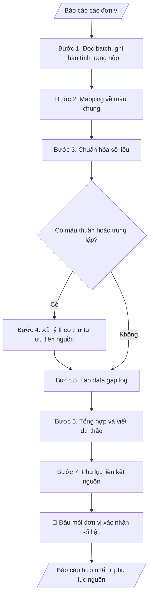

# Skill: Hợp nhất báo cáo nhiều đơn vị

## Khi nào dùng
Khi cần tổng hợp báo cáo từ nhiều khoa/phòng/trung tâm thành một báo cáo chung của trường:
báo cáo 3 công khai, báo cáo kiểm định, báo cáo tổng kết năm học, báo cáo đột xuất theo yêu cầu
cấp trên. Đặc biệt hữu ích khi các đơn vị nộp file rời rạc, mẫu biểu không thống nhất.

## Đầu vào (Input)

| Trường | Mô tả | Bắt buộc |
|---|---|---|
| `mau_bao_cao_chung` | Mẫu báo cáo tổng (các mục, chỉ tiêu, bảng biểu yêu cầu) | Có |
| `bao_cao_don_vi` | Danh sách báo cáo từng đơn vị (tên đơn vị + nội dung/số liệu) | Có |
| `dinh_nghia_chi_tieu` | Định nghĩa từng chỉ tiêu (cách tính, đơn vị tính, kỳ số liệu) | Có |
| `ky_bao_cao` | Kỳ báo cáo (VD: năm học 2026–2027; 6 tháng đầu năm 2026) | Có |
| `thu_tu_uu_tien_nguon` | Khi số liệu mâu thuẫn, ưu tiên nguồn nào (VD: số liệu Phòng Đào tạo > số liệu khoa) | Không |

## Quy trình

**Bước 1. Đọc batch và ghi nhận tình trạng nộp**
- Làm gì: đọc toàn bộ báo cáo trong `bao_cao_don_vi`; lập danh sách đơn vị đã nộp / chưa nộp / nộp bản nháp;
  ghi nhận kỳ số liệu mà mỗi đơn vị ghi trong báo cáo của mình.
- Dùng input: `bao_cao_don_vi`, `ky_bao_cao`.
- Vai trò: Đầu mối tổng hợp (Văn phòng/Phòng Đào tạo) · AI hỗ trợ: đọc batch, ghi nhận tình trạng nộp và kỳ số liệu từng đơn vị · ⏱ ~15–30 phút (ước tính)
- Lưu ý nghiệp vụ: phân biệt "chưa nộp" với "nộp bản nháp chưa xác minh" — bản nháp KHÔNG được đưa vào
  tổng hợp; kỳ số liệu lệch nhau giữa các đơn vị phải ghi nhận ngay để xử lý ở Bước 3.
- → Kết quả bước: bảng tình trạng nộp (đơn vị | trạng thái | kỳ số liệu ghi nhận).

**Bước 2. Mapping trường dữ liệu về mẫu chung**
- Làm gì: ánh xạ từng số liệu của mỗi đơn vị về đúng chỉ tiêu trong `mau_bao_cao_chung` theo
  `dinh_nghia_chi_tieu`; ghi lại các chỉ tiêu không mapping được và các số liệu của đơn vị không thuộc
  chỉ tiêu nào.
- Dùng input: `bao_cao_don_vi`, `mau_bao_cao_chung`, `dinh_nghia_chi_tieu`.
- Vai trò: Đầu mối tổng hợp (Văn phòng/Phòng Đào tạo) · AI hỗ trợ: mapping số liệu về chỉ tiêu mẫu chung theo định nghĩa, đánh dấu chỗ không chắc · ⏱ ~20–40 phút (ước tính)
- Lưu ý nghiệp vụ: mapping phải theo định nghĩa chỉ tiêu, không theo tên gọi — hai đơn vị có thể gọi
  khác nhau nhưng cùng một chỉ tiêu, hoặc ngược lại; chỗ nào không chắc thì ghi "cần xác minh", không đoán.
- → Kết quả bước: bảng mapping (đơn vị | số liệu gốc | chỉ tiêu mẫu chung | trạng thái mapping).

**Bước 3. Chuẩn hóa số liệu**
- Làm gì: thống nhất đơn vị tính, kỳ số liệu, quy tắc làm tròn giữa các đơn vị; thực hiện quy đổi khi cần
  và ghi rõ công thức quy đổi.
- Dùng input: bảng mapping (Bước 2), `dinh_nghia_chi_tieu`.
- Vai trò: Đầu mối tổng hợp (Văn phòng/Phòng Đào tạo) · AI hỗ trợ: chuẩn hóa đơn vị tính, kỳ số liệu, thực hiện quy đổi có ghi công thức · ⏱ ~15–30 phút (ước tính)
- Lưu ý nghiệp vụ: mọi quy đổi phải minh bạch công thức để đơn vị kiểm tra lại được; không làm tròn
  trung gian khi số liệu còn phải cộng dồn ở Bước 6.
- → Kết quả bước: bộ số liệu đã chuẩn hóa, sẵn sàng tổng hợp.

**Bước 4. Xử lý trùng lặp và mâu thuẫn**
- Làm gì: phát hiện số liệu trùng lặp (cùng đối tượng được hai đơn vị báo) hoặc mâu thuẫn giữa các đơn vị;
  áp `thu_tu_uu_tien_nguon` để chọn số liệu dùng; mọi chỗ mâu thuẫn đều ghi chú rõ, không tự ý chọn số "đẹp".
- Dùng input: số liệu đã chuẩn hóa (Bước 3), `thu_tu_uu_tien_nguon`.
- Vai trò: Đầu mối tổng hợp (Văn phòng/Phòng Đào tạo) · AI hỗ trợ: phát hiện trùng lặp/mâu thuẫn, áp thứ tự ưu tiên nguồn; chỗ không có thứ tự thì ghi "cần xác minh" · ⏱ ~15–30 phút (ước tính)
- Lưu ý nghiệp vụ: nếu không có thứ tự ưu tiên nguồn thì không tự chọn — ghi vào danh sách mâu thuẫn
  cần xác minh; trùng lặp phải loại trước khi cộng dồn, nếu không tổng sẽ bị đội lên.
- → Kết quả bước: danh sách mâu thuẫn đã xử lý (ghi nguồn được chọn + lý do) và danh sách mâu thuẫn
  cần xác minh thêm.

**Bước 5. Lập data gap log**
- Làm gì: liệt kê đơn vị nào thiếu chỉ tiêu nào, đơn vị nào chưa nộp báo cáo; đánh dấu các chỉ tiêu thiếu
  có ảnh hưởng đến kết quả tổng hợp.
- Dùng input: kết quả Bước 1 (tình trạng nộp), Bước 2 (chỉ tiêu không mapping được).
- Vai trò: Đầu mối tổng hợp (Văn phòng/Phòng Đào tạo) · AI hỗ trợ: lập data gap log (đơn vị thiếu chỉ tiêu nào, đơn vị nào chưa nộp) · ⏱ ~10–20 phút (ước tính)
- Lưu ý nghiệp vụ: gap log là cam kết minh bạch — "chưa có số liệu" phải ghi rõ, không để trống lặng lẽ;
  số liệu từ bản nháp chưa xác minh không đưa vào tổng.
- → Kết quả bước: data gap log (đơn vị | chỉ tiêu thiếu | trạng thái).

**Bước 6. Tổng hợp số liệu và viết dự thảo nhận xét**
- Làm gì: cộng dồn số liệu theo định nghĩa chỉ tiêu, điền vào các mục của `mau_bao_cao_chung`;
  viết phần nhận xét/đánh giá CHỈ dựa trên số liệu đã tổng hợp, mỗi nhận xét gắn với con số cụ thể.
- Dùng input: số liệu đã chuẩn hóa (Bước 3), `mau_bao_cao_chung`, `ky_bao_cao`.
- Vai trò: Đầu mối tổng hợp (Văn phòng/Phòng Đào tạo) · AI hỗ trợ: cộng dồn số liệu, điền mẫu chung, viết nhận xét chỉ dựa trên số liệu · ⏱ ~20–40 phút (ước tính)
- Lưu ý nghiệp vụ: cấm suy diễn vượt số liệu (không "dự báo", không gán "nguyên nhân" khi không có căn cứ);
  chỉ tiêu nào thiếu số liệu thì ghi "chưa có số liệu", không bỏ mục.
- → Kết quả bước: dự thảo báo cáo hợp nhất (số liệu đã điền + nhận xét dựa trên số liệu).

**Bước 7. Lập phụ lục liên kết nguồn**
- Làm gì: với mỗi con số trong báo cáo hợp nhất, ghi chú thích nguồn: đơn vị nào, báo cáo nào, trang/mục nào;
  kiểm tra không để con số nào "mồ côi" nguồn.
- Dùng input: dự thảo báo cáo (Bước 6), `bao_cao_don_vi`.
- Vai trò: Đầu mối tổng hợp (Văn phòng/Phòng Đào tạo); đầu mối từng đơn vị xác nhận số liệu đơn vị mình · AI hỗ trợ: lập phụ lục liên kết nguồn, kiểm tra không con số nào "mồ côi" nguồn · ⏱ ~15–25 phút (ước tính)
- Lưu ý nghiệp vụ: mất liên kết nguồn = số liệu không dùng được khi bị chất vấn; đây là bước kiểm tra
  cuối cùng trước khi chuyển human gate.
- → Kết quả bước: phụ lục liên kết nguồn đầy đủ + báo cáo hợp nhất hoàn chỉnh.
## Luồng quy trình (Workflow)

## Đầu ra (Output)
- Dự thảo báo cáo hợp nhất theo mẫu chung.
- Data gap log (đơn vị thiếu/chưa nộp theo từng chỉ tiêu).
- Phụ lục liên kết nguồn từng số liệu.
- Danh sách mâu thuẫn cần xác minh thêm.

**Cấu trúc output chuẩn** (sản phẩm chính: Dự thảo báo cáo hợp nhất):
1. Tiêu đề: tên báo cáo, kỳ báo cáo, đơn vị tổng hợp, ngày lập.
2. Phạm vi số liệu: đơn vị nào đã có số liệu / chưa nộp / nộp bản nháp (minh bạch ngay từ đầu).
3. Nội dung theo mẫu chung: từng mục gồm bảng số liệu (mỗi con số có chú thích nguồn) + nhận xét dựa trên số liệu.
4. Data gap log: đơn vị thiếu chỉ tiêu nào, trạng thái.
5. Danh sách mâu thuẫn cần xác minh thêm + hạn bổ sung.

## Checklist nghiệm thu

- [ ] Báo cáo hợp nhất đầy đủ 5 phần theo Cấu trúc output chuẩn: tiêu đề + kỳ báo cáo + ngày lập; phạm vi số liệu (đơn vị nào đã có số liệu / chưa nộp / nộp bản nháp); nội dung theo mẫu chung; data gap log; danh sách mâu thuẫn cần xác minh + hạn bổ sung.
- [ ] Số liệu trong output khớp với báo cáo các đơn vị trong Input; không bịa, không ước lượng, không "làm tròn cho đẹp".
- [ ] Mỗi con số trong báo cáo hợp nhất đều có chú thích nguồn (đơn vị, báo cáo, mục) trong phụ lục liên kết nguồn.
- [ ] Số liệu từ bản nháp chưa xác minh KHÔNG đưa vào tổng; chỉ tiêu thiếu ghi rõ "chưa có số liệu", không bỏ mục.
- [ ] Trùng lặp đã loại trước khi cộng dồn; mâu thuẫn ghi rõ nguồn được chọn + lý do theo thứ tự ưu tiên nguồn.
- [ ] Nhận xét/đánh giá chỉ dựa trên số liệu đã tổng hợp — không suy diễn vượt số liệu (không dự báo, không gán nguyên nhân khi không có căn cứ).
- [ ] Đã qua Human gate: đầu mối từng đơn vị đã xác nhận số liệu đơn vị mình; lãnh đạo đã duyệt báo cáo cuối trước khi ban hành/gửi cấp trên.

> Tiêu chí đạt: tất cả các ô được đánh dấu.

## Ví dụ mô phỏng (dữ liệu giả lập)

> Tất cả tên trường, cá nhân, số liệu dưới đây đều là **giả lập**.
> Ví dụ: hợp nhất số liệu tuyển sinh từ 3 khoa để phục vụ báo cáo 3 công khai.

### Input mẫu

| Trường | Giá trị |
|---|---|
| `mau_bao_cao_chung` | Mục II. Quy mô đào tạo: tổng chỉ tiêu, tổng nhập học (chia theo khoa) |
| `bao_cao_don_vi` | Khoa CNTT: chỉ tiêu 500, nhập học 487. Khoa Kinh tế: chỉ tiêu 400, nhập học 392. Khoa Ngoại ngữ: mới nộp bản nháp, ghi "khoảng 300 nhập học", chưa có chỉ tiêu |
| `dinh_nghia_chi_tieu` | Nhập học = số SV làm thủ tục nhập học tính đến 30/9/2026 |
| `ky_bao_cao` | Năm học 2026–2027 |

### Output mẫu

**BÁO CÁO HỢP NHẤT — Tuyển sinh năm học 2026–2027** (đơn vị tổng hợp: Phòng Đào tạo; ngày lập: 09/10/2026)

**Phạm vi số liệu:** 2/3 khoa có số liệu chính thức (CNTT, Kinh tế); Khoa Ngoại ngữ mới nộp bản nháp — KHÔNG đưa vào tổng.

**Báo cáo hợp nhất (trích Mục II):**
- Tổng chỉ tiêu (2 khoa có số liệu): 900
- Tổng nhập học (2 khoa có số liệu): 879 — đạt 97,7% chỉ tiêu
- Khoa Ngoại ngữ: CHƯA CÓ SỐ LIỆU CHÍNH THỨC (xem gap log)

**Data gap log:**
| Đơn vị | Chỉ tiêu thiếu | Trạng thái |
|---|---|---|
| Khoa Ngoại ngữ | Chỉ tiêu tuyển sinh; số nhập học chính thức | Mới nộp bản nháp, số "khoảng 300" chưa xác minh — KHÔNG đưa vào tổng |

**Phụ lục nguồn:** 500 (Khoa CNTT, BC-TS2026, mục 1) + 400 (Khoa Kinh tế, BC-TS2026, mục 1)...

**Cần xác minh:** Khoa Ngoại ngữ nộp lại số liệu chính thức trước 15/10/2026.

## Human gate (người kiểm duyệt)
1. **Đầu mối từng đơn vị**: xác nhận số liệu của đơn vị mình trong bản hợp nhất (đặc biệt các chỗ
   bị chuẩn hóa/quy đổi hoặc mâu thuẫn).
2. **Đầu mối tổng hợp** (thường là Văn phòng/Phòng Đào tạo): duyệt gap log và danh sách mâu thuẫn,
   quyết định có chờ bổ sung hay báo cáo với ghi chú thiếu.
3. **Lãnh đạo**: duyệt báo cáo cuối cùng trước khi ban hành/gửi cấp trên.

## Giới hạn (guardrails)
- KHÔNG bịa, ước lượng hay "làm tròn cho đẹp" bất kỳ số liệu nào còn thiếu.
- KHÔNG tự điền số liệu thay đơn vị chưa nộp — ghi rõ "chưa có số liệu".
- Mọi con số phải giữ liên kết về nguồn gốc (đơn vị, báo cáo, mục); mất liên kết = số liệu không dùng được.
- KHÔNG viết nhận xét, đánh giá vượt quá những gì số liệu chứng minh được.

## Căn cứ & lưu ý
- Định nghĩa chỉ tiêu do đơn vị chủ trì báo cáo ban hành là chuẩn duy nhất để mapping.
- Quy tắc minh bạch số liệu này áp dụng cho mọi loại báo cáo tổng hợp trong trường.
- Mọi ví dụ đều giả lập; không dùng tên thật của trường/cá nhân.
