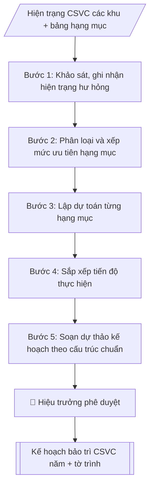

# Lập kế hoạch bảo trì cơ sở vật chất

## Kiểm soát áp dụng và phê duyệt

Trước khi chạy quy trình, xác định `ngay_ap_dung`, `loai_hinh_truong`, `quy_che_noi_bo`, `nguon_du_lieu` và `nguoi_kiem_duyet`. Chỉ yêu cầu thông tin có liên quan đến nghiệp vụ; không dùng giá trị giả định thay dữ liệu bắt buộc. Hồ sơ có yếu tố pháp lý phải kèm văn bản gốc, tình trạng hiệu lực, điều khoản áp dụng và chuyển tiếp.

## Giới hạn và human gate

AI hỗ trợ chuẩn bị và đối chiếu. Cán bộ phụ trách kiểm tra dữ liệu/căn cứ, người có thẩm quyền duyệt và ký. Mọi đầu ra mặc định là **DỰ THẢO – CHỜ KIỂM DUYỆT**; không đánh dấu đã ký, đã duyệt hoặc đã công bố nếu chưa có chứng cứ. Dữ liệu sinh viên, sức khỏe, nhân sự và tài chính phải hạn chế theo mục đích, phân quyền và che thông tin định danh khi dùng ví dụ. Không tải dữ liệu lên dịch vụ ngoài khi chưa có quyền. Kiểm tra Luật 91/2025/QH15 về bảo vệ dữ liệu cá nhân (hiệu lực 01/01/2026) và quy định áp dụng trước xử lý/chia sẻ dữ liệu cá nhân.


## Khi nào dùng
Khi xây dựng kế hoạch bảo trì, sửa chữa CSVC hằng năm; khi lập kế hoạch sửa chữa
đột xuất (hư hỏng ảnh hưởng an toàn, giảng dạy).

## Đầu vào (Input)

| Trường | Mô tả | Bắt buộc |
|---|---|---|
| `nam_ke_hoach` | Năm thực hiện | Có |
| `hang_muc` | Bảng hạng mục: công trình/hệ thống, hiện trạng hư hỏng, mức độ ảnh hưởng | Có |
| `muc_do_uu_tien` | Khẩn cấp / Ưu tiên / Thường xuyên (hoặc để skill tự phân loại) | Không |
| `du_toan` | Dự toán kinh phí từng hạng mục | Có |
| `tien_do` | Tiến độ thực hiện dự kiến | Không |

## Quy trình

**Bước 1. Khảo sát, ghi nhận hiện trạng hư hỏng**
- Làm gì: kiểm tra thực tế từng khu vực: phòng học, giảng đường, ký túc xá, hệ thống điện – nước, PCCC, thang máy, sân bãi; tại mỗi điểm ghi rõ công trình/hệ thống, vị trí cụ thể, hiện trạng hư hỏng quan sát được, mức độ ảnh hưởng tới an toàn và giảng dạy; chụp ảnh minh chứng kèm theo.
- Dùng input: `hang_muc` (đối chiếu với kết quả khảo sát, bổ sung hạng mục còn thiếu), `nam_ke_hoach`.
- Vai trò: Cán bộ Phòng Quản trị – Thiết bị (thực hiện trực tiếp) · AI hỗ trợ: đối chiếu tự động, cảnh báo sai lệch · ⏱ ~0,5–1 ngày làm việc (ước tính)
- Lưu ý nghiệp vụ: ưu tiên kiểm tra các điểm nóng theo đề xuất của đơn vị và sự cố năm trước; hệ thống PCCC, điện phải do người có chuyên môn kiểm tra; hạng mục ảnh hưởng an toàn con người phải ghi nhận riêng và báo ngay, không chờ lập kế hoạch.
- → Kết quả bước: Bảng khảo sát hiện trạng (danh mục hư hỏng có vị trí, mức ảnh hưởng, ảnh minh chứng).

**Bước 2. Phân loại và xếp mức ưu tiên hạng mục**
- Làm gì: với từng hạng mục trong bảng khảo sát, xếp vào 1 trong 3 loại: bảo trì thường xuyên (vệ sinh, kiểm tra định kỳ) / sửa chữa định kỳ (sơn sửa, chống thấm, thay thiết bị hao mòn) / sửa chữa đột xuất (hư hỏng ảnh hưởng an toàn); sau đó xếp mức ưu tiên: Khẩn cấp (PCCC, điện, kết cấu) → Ưu tiên (phòng học, PTN phục vụ giảng dạy) → Thường xuyên (các hạng mục còn lại).
- Dùng input: `hang_muc`, `muc_do_uu_tien` (nếu có; nếu để trống thì tự phân loại theo quy tắc trên).
- Vai trò: Chuyên viên Phòng Quản trị – Thiết bị · AI hỗ trợ: đối chiếu tự động, cảnh báo sai lệch · ⏱ ~30–60 phút (ước tính)
- Lưu ý nghiệp vụ: hạng mục vừa định kỳ vừa liên quan an toàn thì xếp theo mức cao hơn; ghi rõ tiêu chí phân loại để bảo vệ khi trình duyệt.
- → Kết quả bước: Bảng hạng mục đã phân loại và xếp mức ưu tiên (Khẩn cấp / Ưu tiên / Thường xuyên).

**Bước 3. Lập dự toán từng hạng mục**
- Làm gì: với từng hạng mục đã phân loại, lập dự toán chi tiết: khối lượng công việc, đơn giá tham khảo thị trường/định mức, thành tiền; tổng hợp tổng dự toán năm; đánh dấu hạng mục vượt hạn mức phải lựa chọn nhà thầu theo Luật Đấu thầu.
- Dùng input: `du_toan` (làm cơ sở; kiểm tra tính hợp lý, điều chỉnh nếu chênh lệch lớn), `hang_muc`, `muc_do_uu_tien`.
- Vai trò: Chuyên viên Phòng Quản trị – Thiết bị · AI hỗ trợ: tổng hợp, chuẩn hóa dữ liệu · ⏱ ~30–60 phút (ước tính)
- Lưu ý nghiệp vụ: đơn giá phải có nguồn tham chiếu; dự phòng 5–10% cho phát sinh; hạng mục vượt hạn mức ghi chú riêng về thủ tục đấu thầu.
- → Kết quả bước: Bảng dự toán chi tiết từng hạng mục + tổng dự toán, kèm ghi chú đấu thầu.

**Bước 4. Sắp xếp tiến độ thực hiện**
- Làm gì: gán thời gian thực hiện (quý/tháng) cho từng hạng mục: hạng mục khẩn cấp làm ngay; tránh thi công gây ồn trong kỳ thi kết thúc học phần và tuần khai giảng; ưu tiên thi công lớn vào dịp hè; đối chiếu với lịch năm học trước khi chốt.
- Dùng input: `tien_do` (nếu có), `nam_ke_hoach`, `muc_do_uu_tien`.
- Vai trò: Chuyên viên Phòng Quản trị – Thiết bị · AI hỗ trợ: đối chiếu tự động, cảnh báo sai lệch · ⏱ ~1–2 giờ (ước tính)
- Lưu ý nghiệp vụ: hạng mục PCCC không được dời tùy tiện qua mùa khô/mùa mưa; luôn để dự phòng thời gian cho sửa chữa đột xuất phát sinh trong năm.
- → Kết quả bước: Lịch tiến độ thực hiện theo quý/tháng.

**Bước 5. Soạn dự thảo kế hoạch theo cấu trúc chuẩn**
- Làm gì: lắp các bán thành phẩm (bảng hạng mục đã phân loại, bảng dự toán, lịch tiến độ) vào văn bản kế hoạch theo cấu trúc output chuẩn; viết phần tổ chức thực hiện (đơn vị chủ trì, đơn vị phối hợp, nguyên tắc thi công, bố trí kinh phí).
- Dùng input: `nam_ke_hoach`.
- Vai trò: Chuyên viên Phòng Quản trị – Thiết bị · AI hỗ trợ: soạn dự thảo · ⏱ ~30–60 phút (ước tính)
- Lưu ý nghiệp vụ: tên hạng mục, dự toán, tiến độ phải khớp 100% giữa các bảng; ghi rõ thẩm quyền phê duyệt từng phần.
- → Kết quả bước: Dự thảo Kế hoạch bảo trì, sửa chữa CSVC năm.

**Bước 6. Trình phê duyệt**
- Làm gì: soạn tờ trình kèm dự thảo kế hoạch, trình Hiệu trưởng ký ban hành; sau phê duyệt gửi các đơn vị liên quan để phối hợp triển khai; lưu hồ sơ.
- Dùng input: (kết quả Bước 5).
- Vai trò: Chuyên viên Phòng Quản trị – Thiết bị (chuẩn bị hồ sơ trình); Hiệu trưởng (người ký) ban hành · AI hỗ trợ: soạn dự thảo, chuẩn bị hồ sơ trình đầy đủ · ⏱ ~1–3 giờ (ước tính)
- Lưu ý nghiệp vụ: tờ trình nêu rõ tổng kinh phí và nguồn kinh phí; hạng mục đột xuất phát sinh sau phê duyệt xử lý theo quy trình riêng, không tự ý chèn vào kế hoạch.
- → Kết quả bước: Kế hoạch đã phê duyệt + tờ trình phê duyệt.

## Luồng quy trình (Workflow)


```

## Đầu ra (Output)
- Kế hoạch bảo trì, sửa chữa CSVC năm.
- Tờ trình phê duyệt kế hoạch.

**Cấu trúc output chuẩn:** Kế hoạch bảo trì, sửa chữa CSVC năm gồm các phần bắt buộc theo đúng thứ tự sau:
1. Phần đầu: quốc hiệu – tiêu ngữ, tên đơn vị lập (Phòng Quản trị – Thiết bị), địa danh – ngày tháng, tên văn bản "KẾ HOẠCH BẢO TRÌ, SỬA CHỮA CƠ SỞ VẬT CHẤT NĂM ..." (+ ghi chú giả lập nếu mô phỏng).
2. I. Danh mục hạng mục: bảng STT – Hạng mục – Hiện trạng – Mức độ ưu tiên – Dự toán – Tiến độ, có dòng tổng dự toán.
3. II. Tổ chức thực hiện: đơn vị chủ trì/phối hợp, nguyên tắc thi công (tránh kỳ thi), bố trí kinh phí.
4. Phần cuối: nơi nhận, chữ ký và họ tên người ký.

## Checklist nghiệm thu

- [ ] Đủ các phần theo "Cấu trúc output chuẩn": Phần đầu; I. Danh mục hạng mục; II. Tổ chức thực hiện; Phần cuối
- [ ] Có đầy đủ sản phẩm: Kế hoạch bảo trì, sửa chữa CSVC năm
- [ ] Có đầy đủ sản phẩm: Tờ trình phê duyệt kế hoạch
- [ ] Mọi số liệu, tên, ngày tháng trong output khớp với Input đã cung cấp (không thêm bớt, không suy đoán)
- [ ] Không bịa đặt số liệu, minh chứng, trích dẫn hay căn cứ
- [ ] Đúng thể thức, định dạng văn bản theo quy định hiện hành
- [ ] Căn cứ pháp lý nêu đầy đủ, còn hiệu lực tại thời điểm lập
- [ ] Đã qua Human gate: người có thẩm quyền đã kiểm tra/ký duyệt trước khi phát hành
- [ ] Ưu tiên kiểm tra các điểm nóng theo đề xuất của đơn vị và sự cố năm trước
- [ ] Hạng mục vừa định kỳ vừa liên quan an toàn thì xếp theo mức cao hơn

> Tiêu chí đạt: tất cả các ô đều được đánh dấu.

## Ví dụ mô phỏng (dữ liệu giả lập)

> Tất cả tên trường, cá nhân, số liệu dưới đây đều là **giả lập**, không liên quan tổ chức/cá nhân có thật.

### Input mẫu

| Trường | Giá trị |
|---|---|
| `nam_ke_hoach` | 2026 |
| `hang_muc` | 1. Chống thấm mái nhà A3 (dột 5 phòng học). 2. Bảo trì hệ thống PCCC toàn trường (định kỳ). 3. Sơn sửa 20 phòng học khu B. 4. Sửa hệ thống cấp nước KTX (rò rỉ tầng 3). |
| `du_toan` | 1: 450tr; 2: 200tr; 3: 600tr; 4: 150tr. Tổng: 1,4 tỷ |
| `tien_do` | Quý II (trước mùa mưa): mục 1, 4; Hè: mục 3; Quý III: mục 2 |

### Output mẫu

```
TRƯỜNG ĐẠI HỌC A            CỘNG HÒA XÃ HỘI CHỦ NGHĨA VIỆT NAM
PHÒNG QUẢN TRỊ – THIẾT BỊ                Độc lập – Tự do – Hạnh phúc
                                                    Thành phố C, ngày 10 tháng 12 năm 2025

KẾ HOẠCH BẢO TRÌ, SỬA CHỮA CƠ SỞ VẬT CHẤT NĂM 2026
(Dữ liệu giả lập)

I. DANH MỤC HẠNG MỤC

| STT | Hạng mục | Hiện trạng | Mức độ | Dự toán (đ) | Tiến độ |
|-----|----------|------------|--------|-------------|---------|
| 1 | Chống thấm mái nhà A3 | Dột 05 phòng học | Ưu tiên | 450.000.000 | Quý II |
| 2 | Bảo trì hệ thống PCCC toàn trường | Đến kỳ bảo trì định kỳ | Ưu tiên | 200.000.000 | Quý III |
| 3 | Sơn sửa 20 phòng học khu B | Xuống cấp | Thường xuyên | 600.000.000 | Hè (Quý III) |
| 4 | Sửa hệ thống cấp nước KTX | Rò rỉ tầng 3 | Khẩn cấp | 150.000.000 | Quý II |
| **Tổng** | | | | **1.400.000.000** | |

II. TỔ CHỨC THỰC HIỆN
1. Phòng Quản trị – Thiết bị chủ trì triển khai, giám sát chất lượng, nghiệm thu.
2. Không thi công gây tiếng ồn trong thời gian thi kết thúc học phần.
3. Phòng Tài chính – Kế toán bố trí kinh phí theo tiến độ.

Nơi nhận:                                      TRƯỞNG PHÒNG
- Ban Giám hiệu (b/c);                            [CHỜ KÝ]
- Các đơn vị liên quan;
- Lưu: VT, QTTB.

                                        ThS. Vũ Văn C
```

## Căn cứ & lưu ý
- Quy chế quản lý, sử dụng cơ sở vật chất nội bộ của trường; quy định về PCCC.
- Hạng mục sửa chữa lớn vượt hạn mức phải thực hiện lựa chọn nhà thầu theo Luật Đấu thầu.
- Không dùng tên thật của trường/cá nhân khi mô phỏng.

## Quản trị phiên bản

- Phiên bản gói: `1.1.0`; ngày cập nhật: `2026-10-09`.
- Kho nguồn: https://github.com/phamtruong91/dh-skills
- Người duy trì trên GitHub: `phamtruong91` (Phạm Văn Trường). Người phê duyệt nghiệp vụ: **chưa chỉ định**.
- Commit nguồn trước cập nhật: `78fd1d51b8acd1a724d9b9af6c488460bc7551ad`. Commit chứa phiên bản này xem bằng `git log -1 -- skills/ke-hoach-bao-tri-csvc`; không tự gán SHA chưa tạo.
- Giấy phép: theo LICENSE của kho; bản quyền CES Global.
- Lịch sử 1.1.0: bổ sung metadata giao diện, kiểm soát áp dụng, quản trị phiên bản.
- Trạng thái: dự thảo nghiệp vụ; kiểm tra pháp lý trước thực thi. Ngày cập nhật không đồng nghĩa mọi văn bản đã được rà soát toàn văn.
