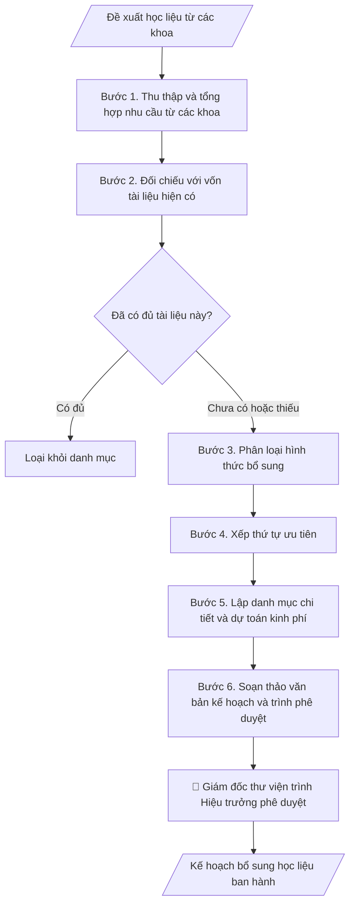

# Kế hoạch bổ sung, số hóa học liệu

## Định dạng và file đầu ra
Định dạng đầu ra có thể chọn theo sản phẩm/yêu cầu: .docx, .pdf. Đọc mục “Định dạng bổ sung” trong quy cách đầu ra trước khi chọn.

**Phải tạo file thực tế để tải xuống, không chỉ trả nội dung trong chat.** Định dạng mặc định của skill: **.docx**. Nếu có bảng số liệu nghiệp vụ yêu cầu file bảng tính riêng, tạo thêm Excel theo yêu cầu; không tự tạo file kiểm tra. Không chờ người dùng yêu cầu xuất file lần nữa. Ưu tiên định dạng người dùng chỉ định; đọc quy tắc xuất file tại references/quy-cach-dau-ra.md.

## Quy cách đầu ra và thông tin thiếu
Đọc [quy cách và cấu trúc sản phẩm](references/quy-cach-dau-ra.md) trước khi soạn/xuất. File giao chỉ gồm sản phẩm nghiệp vụ được yêu cầu; kiểm tra nội bộ không xuất kèm. Thiếu thông tin thì giữ nguyên trường/mục và chỗ điền theo mẫu gốc (dòng dấu chấm, dấu gạch hoặc ô trống); không tự điền dữ liệu mẫu, số 0, mã chờ xác minh hay dòng chờ ký. Mẫu chuyên ngành còn áp dụng được ưu tiên về cấu trúc, mã biểu và người ký. Bản đầy đủ: [quy tắc chung](references/quy-tac-chung.md).

## Kiểm soát áp dụng và phê duyệt
Trước khi chạy, xác định `ngay_ap_dung`, `loai_hinh_truong`, `quy_che_noi_bo`, `nguon_du_lieu`, `nguoi_kiem_duyet`; chỉ hỏi thông tin liên quan nghiệp vụ, không dùng giá trị giả định thay dữ liệu bắt buộc. Đối chiếu căn cứ pháp lý với văn bản gốc, hiệu lực, điều khoản áp dụng và chuyển tiếp. Bản đầy đủ: [quy tắc chung](references/quy-tac-chung.md).

## Giới hạn và human gate
AI hỗ trợ chuẩn bị và đối chiếu; cán bộ phụ trách kiểm tra dữ liệu/căn cứ, người có thẩm quyền duyệt và ký. Không đánh dấu đã ký, đã duyệt, đã công bố khi chưa có chứng cứ. Dữ liệu sinh viên, sức khỏe, nhân sự, tài chính chỉ dùng theo mục đích và phân quyền, che thông tin định danh khi dùng ví dụ (Luật 91/2025/QH15, hiệu lực 01/01/2026); không tải dữ liệu lên dịch vụ ngoài khi chưa có quyền. Bản đầy đủ: [quy tắc chung](references/quy-tac-chung.md).

## Khi nào dùng
Khi thư viện cần lập kế hoạch mua sắm, tiếp nhận và số hóa học liệu phục vụ
chương trình đào tạo, nghiên cứu khoa học trong năm.

## Đầu vào (Input)
| Trường | Mô tả | Bắt buộc |
|---|---|---|
| `nam_ke_hoach` | Năm kế hoạch | Có |
| `nhu_cau_cac_khoa` | Bảng nhu cầu học liệu do các khoa đề xuất (tên tài liệu, số lượng, phục vụ học phần nào) | Có |
| `hinh_thuc_bo_sung` | Mua mới / Số hóa / Tiếp nhận tài trợ / Mua quyền truy cập CSDL | Có |
| `ngan_sach` | Ngân sách dự kiến | Không |
| `chi_tieu_so_hoa` | Số đầu tài liệu số hóa trong năm | Không |

## Quy trình
**Ràng buộc pháp lý khi thực hiện** (trích references/phap-ly.md; đối chiếu toàn văn và hiệu lực tại ngày nghiệp vụ):
- Luật 131/2025/QH15 sửa đổi sở hữu trí tuệ, hiệu lực 01/04/2026: Yêu cầu chủ thể quyền, nguồn tài trợ, hợp đồng và loại tài sản trí tuệ; đối chiếu sửa đổi 131/2025 theo thời điểm. Không mặc định quyền thuộc trường hay tác giả khi chưa có căn cứ; rà soát quyền sử dụng học liệu trước chia sẻ/chuyển giao.
- Trước Bước 1: chọn căn cứ theo đối tượng, loại hình trường và chuyển tiếp; lập bảng văn bản / điều khoản / lý do áp dụng / bằng chứng. Thiếu văn bản gốc hoặc điều khoản thì ghi nhận nội bộ [CẦN XÁC MINH] (không đưa vào file giao), để trống phần tương ứng, chưa kết luận tuân thủ.

**Bước 1. Thu thập và tổng hợp nhu cầu từ các khoa**
- Làm gì: Thu phiếu đề xuất của các khoa: tên tài liệu, tác giả/NXB, số lượng, phục vụ
  học phần/CTĐT nào, lý do đề xuất; gộp các đề xuất trùng nhau giữa các khoa (cộng dồn
  số lượng); trả lại đề xuất thiếu thông tin để khoa bổ sung.
- Dùng input: `nam_ke_hoach`, `nhu_cau_cac_khoa`.
- Vai trò: Cán bộ Thư viện · AI hỗ trợ: soạn biểu mẫu và tổng hợp đề xuất, các khoa cung cấp nhu cầu và bổ sung thông tin thiếu · ⏱ 2–3 giờ (ước tính)
- Lưu ý nghiệp vụ: mỗi đề xuất phải gắn với học phần/CTĐT cụ thể — đề xuất chung chung
  kiểu "sách tham khảo ngành" thì yêu cầu khoa làm rõ; đặt hạn chót nhận đề xuất để kịp
  tiến độ lập kế hoạch năm.
- → Kết quả bước: Bảng tổng hợp nhu cầu (đã gộp trùng, phân theo khoa, gắn học phần).

**Bước 2. Đối chiếu với vốn tài liệu hiện có**
- Làm gì: Tra cứu từng đầu tài liệu trong hệ thống quản lý thư viện: đã có chưa, có bao
  nhiêu bản, tình trạng bản in (còn mới/cũ nát), đã có bản điện tử/quyền CSDL chưa; đánh
  dấu từng đầu: "đã có đủ" (loại), "có nhưng thiếu bản" (giữ lại với số lượng bổ sung),
  "chưa có" (giữ lại).
- Dùng input: `nhu_cau_cac_khoa` + bảng tổng hợp (kết quả bước 1).
- Vai trò: Cán bộ Thư viện · AI hỗ trợ: tra cứu hệ thống ILS và đánh dấu giữ/loại, thủ thư kiểm tra trường hợp tên khác cùng nội dung · ⏱ 2–4 giờ (ước tính)
- Lưu ý nghiệp vụ: kiểm tra cả trường hợp tên khác nhau nhưng cùng nội dung (tái bản,
  bản dịch khác); tài liệu đã có bản điện tử đầy đủ thì ưu tiên không mua bản in trùng;
  ghi rõ căn cứ loại trừ để giải trình với khoa.
- → Kết quả bước: Bảng đối chiếu (tài liệu × tình trạng hiện có × quyết định giữ/loại).

**Bước 3. Phân loại hình thức bổ sung**
- Làm gì: Với từng tài liệu còn lại sau bước 2, xếp vào một trong các hình thức
  (`hinh_thuc_bo_sung`): mua mới (sách/giáo trình in), số hóa (tài liệu nội sinh, luận
  văn, tài liệu quý hiếm), mua quyền truy cập CSDL điện tử, tiếp nhận tài trợ/tặng; ghi
  lý do chọn hình thức cho từng nhóm.
- Dùng input: `hinh_thuc_bo_sung`, `chi_tieu_so_hoa` (giới hạn số đầu số hóa trong năm).
- Vai trò: Cán bộ Thư viện · AI hỗ trợ: gợi ý phân loại hình thức bổ sung, thư viện quyết định hình thức cho từng nhóm · ⏱ 1–2 giờ (ước tính)
- Lưu ý nghiệp vụ: chỉ số hóa tài liệu thuộc quyền của trường hoặc được phép (tuân thủ
  pháp luật SHTT); CSDL mua quyền phải kiểm tra trùng lặp với CSDL đã mua các năm trước;
  tài liệu nội sinh (giáo trình, luận văn của trường) ưu tiên số hóa thay vì mua.
- → Kết quả bước: Danh mục tài liệu đã phân loại theo hình thức bổ sung.

**Bước 4. Xếp thứ tự ưu tiên**
- Làm gì: Chấm ưu tiên từng nhóm tài liệu theo tiêu chí: phục vụ ngành đào tạo mới, học
  phần chưa có tài liệu chính, lượt mượn/truy cập cao, tài liệu quý có nguy cơ hư hỏng
  (đối với số hóa); sắp xếp danh mục theo thứ tự ưu tiên để có căn cứ cắt giảm khi ngân
  sách không đủ.
- Dùng input: `ngan_sach` (mức ngân sách → xác định ranh giới cắt), `nhu_cau_cac_khoa`.
- Vai trò: Giám đốc Thư viện · AI hỗ trợ: chấm điểm ưu tiên theo tiêu chí · ⏱ 1–2 giờ (ước tính)
- Lưu ý nghiệp vụ: ranh giới "ngân sách đáp ứng đến đâu" phải rõ ràng — khi bị cắt giảm
  thì cắt từ cuối danh sách; ưu tiên phải có căn cứ số liệu (lượt mượn, học phần thiếu
  tài liệu), không theo cảm tính.
- → Kết quả bước: Danh mục đã xếp hạng ưu tiên (có vạch cắt theo ngân sách).

**Bước 5. Lập danh mục chi tiết và dự toán kinh phí**
- Làm gì: Lập bảng danh mục cuối cùng: tên tài liệu, hình thức, số lượng, đơn giá dự kiến,
  thành tiền; tính tổng dự toán theo từng hình thức và tổng chung; đối chiếu với
  `ngan_sach` — nếu vượt thì cắt theo thứ tự ưu tiên bước 4 và ghi rõ phần chưa thực hiện
  được chuyển sang năm sau.
- Dùng input: `ngan_sach`.
- Vai trò: Cán bộ Thư viện · AI hỗ trợ: lập bảng danh mục và tính dự toán, thư viện đối chiếu ngân sách và chốt phần cắt · ⏱ 2–3 giờ (ước tính)
- Lưu ý nghiệp vụ: đơn giá dự kiến lấy từ báo giá nhà cung cấp hoặc giá mua năm trước +
  trượt giá; dự toán tách rõ từng hình thức để lãnh đạo dễ phê duyệt từng phần; phần bị
  cắt phải có danh sách dự phòng cho năm sau.
- → Kết quả bước: Bảng danh mục chi tiết + dự toán kinh phí (đã đối chiếu ngân sách).

**Bước 6. Soạn thảo văn bản kế hoạch và trình phê duyệt**
- Làm gì: Soạn văn bản kế hoạch theo cấu trúc chuẩn (mục tiêu, nội dung theo từng hình
  thức, tiến độ quý, tổ chức thực hiện); đính kèm danh mục + dự toán (kết quả bước 5);
  trình Giám đốc thư viện ký và Hiệu trưởng phê duyệt; sau phê duyệt, giao nhiệm vụ triển
  khai theo tiến độ quý.
- Dùng input: `nam_ke_hoach` (năm kế hoạch trong văn bản).
- Vai trò: Giám đốc Thư viện · AI hỗ trợ: soạn văn bản đúng thể thức · ⏱ 1–2 giờ (ước tính)
- Lưu ý nghiệp vụ: văn bản phải đủ thể thức (số hiệu, ngày ban hành, nơi nhận); kế hoạch
  năm phải ban hành trước quý 1 để kịp triển khai đợt mua sắm đầu năm.
- → Kết quả bước: Văn bản kế hoạch bổ sung, số hóa học liệu đã được phê duyệt.

## Luồng quy trình (Workflow)

## Đầu ra
- Văn bản kế hoạch bổ sung, số hóa học liệu hoàn chỉnh.
- Bảng danh mục học liệu + dự toán kinh phí.

File nghiệp vụ thực tế theo định dạng mặc định ở đầu skill hoặc định dạng người dùng yêu cầu, kèm liên kết tải trong phản hồi cuối.

Sản phẩm nghiệp vụ theo [quy cách và cấu trúc](references/quy-cach-dau-ra.md); trường thiếu để trống, không kèm tài liệu kiểm tra đầu ra.

## Kiểm tra nội bộ trước khi giao
Các tiêu chí sau dùng để tự đối chiếu; không sao chép vào file xuất. Mục thiếu dữ liệu được để trống, không đánh dấu đã đạt hoặc đã duyệt.

- [ ] Đủ 7 phần theo "Cấu trúc output chuẩn": tiêu đề hành chính, tên kế hoạch + năm, mục tiêu, nội dung theo hình thức, tiến độ theo quý, tổ chức thực hiện, nơi nhận + chữ ký.
- [ ] Danh mục và dự toán khớp với Input: nhu cầu các khoa, ngân sách, chỉ tiêu số hóa.
- [ ] Không bịa đặt đơn giá, báo giá nhà cung cấp hay nhu cầu không có trong đề xuất của khoa.
- [ ] Mỗi đề xuất gắn với học phần/CTĐT cụ thể; đã gộp các đề xuất trùng nhau giữa các khoa.
- [ ] Đã đối chiếu vốn tài liệu hiện có: đầu đã có đủ bị loại có ghi căn cứ; phát hiện trường hợp tên khác nhưng cùng nội dung.
- [ ] Danh mục xếp ưu tiên có vạch cắt rõ theo ngân sách; phần bị cắt có danh sách dự phòng cho năm sau.
- [ ] Số hóa chỉ với tài liệu thuộc quyền của trường hoặc được phép (tuân thủ pháp luật sở hữu trí tuệ).
- [ ] Đúng thể thức: số hiệu văn bản, ngày ban hành, nơi nhận đầy đủ.
- [ ] Đã qua Human gate: giám đốc thư viện ký, hiệu trưởng phê duyệt kế hoạch.

## Căn cứ & lưu ý
- Chiến lược phát triển Trường Đại học A (giả lập); quy định về công tác
  thư viện trường đại học.
- Ưu tiên học liệu phục vụ ngành mở mới và học phần chưa có tài liệu chính.
- Tuân thủ pháp luật sở hữu trí tuệ khi số hóa tài liệu (chỉ số hóa tài liệu thuộc
  quyền của trường hoặc được phép).
- Không dùng tên thật của trường/cá nhân khi mô phỏng.

## Tư liệu đối chiếu
Bản gốc trước cập nhật pháp lý (kèm ví dụ giả lập) lưu tại `references/quy-trinh-lich-su.md`, chỉ để đối chiếu hồ sơ lịch sử; không dùng căn cứ, mẫu hay số liệu trong đó làm chỉ dẫn hiện hành.

## Quản trị phiên bản
- Phiên bản gói `1.3.2` (cập nhật 2026-10-10); hồ sơ đầy đủ tại [references/version.json](references/version.json).
- Người phê duyệt nghiệp vụ: **chưa chỉ định**. Trạng thái: dự thảo nghiệp vụ; kiểm tra pháp lý trước thực thi. Ngày cập nhật không đồng nghĩa mọi văn bản đã được rà soát toàn văn.
- Giấy phép theo LICENSE của kho (bản quyền CES Global). Lịch sử thay đổi: CHANGELOG.md.
