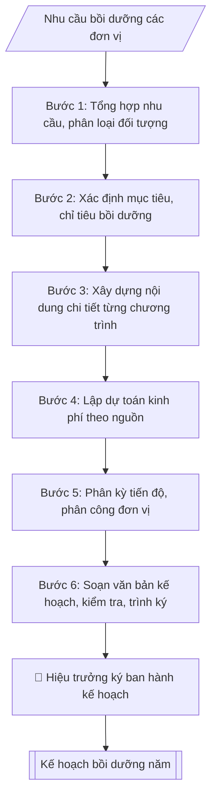

# Skill: Kế hoạch đào tạo, bồi dưỡng cán bộ năm

## Khi nào dùng
Khi cần xây dựng kế hoạch năm về đào tạo, bồi dưỡng cán bộ, viên chức, giảng viên:
tổng hợp nhu cầu từ các đơn vị, xác định đối tượng – nội dung – hình thức – kinh phí,
trình Hiệu trưởng phê duyệt để làm căn cứ triển khai.

## Đầu vào (Input)

| Trường | Mô tả | Bắt buộc |
|---|---|---|
| `nam_ke_hoach` | Năm áp dụng kế hoạch (vd: 2026) | Có |
| `muc_tieu` | Mục tiêu chung của công tác bồi dưỡng trong năm | Có |
| `nhu_cau_don_vi` | Tổng hợp nhu cầu từ các đơn vị: đối tượng, số lượng, nội dung đề xuất | Có |
| `noi_dung_boi_duong` | Các nội dung/chương trình: nghiệp vụ sư phạm, phương pháp giảng dạy, ngoại ngữ, tin học, quản lý... | Có |
| `hinh_thuc` | Tập huấn trong nước / gửi đi đào tạo / bồi dưỡng trực tuyến / liên kết đơn vị... | Có |
| `kinh_phi_du_kien` | Tổng kinh phí và nguồn (ngân sách nhà nước / nguồn thu / học phí hỗ trợ...) | Có |
| `tien_do` | Phân kỳ thực hiện theo quý/tháng | Không |
| `don_vi_chu_tri` | Đơn vị chủ trì, phối hợp | Không (mặc định: Phòng Tổ chức – Cán bộ) |
| `nguoi_ky` | Hiệu trưởng / Phó Hiệu trưởng | Có |

## Quy trình

**Bước 1. Tổng hợp nhu cầu từ các đơn vị**
- Làm gì: thu thập phiếu khảo sát nhu cầu bồi dưỡng của các đơn vị; phân loại theo đối tượng (giảng viên, viên chức quản lý, nhân viên) và theo nội dung; loại bỏ nhu cầu trùng lặp, gộp các nhu cầu tương đồng thành một chương trình.
- Dùng input: `nhu_cau_don_vi`.
- Vai trò: Chuyên viên Phòng TCCB · AI hỗ trợ: tổng hợp và chuẩn hóa dữ liệu · ⏱ ~20–45 phút (ước tính)
- Lưu ý nghiệp vụ: nhu cầu phải xuất phát từ yêu cầu của vị trí việc làm / chuẩn chức danh, không theo nguyện vọng cá nhân đơn thuần; nhu cầu không có đơn vị đề xuất thì không đưa vào kế hoạch.
- → Kết quả bước: bảng tổng hợp nhu cầu phân loại theo đối tượng – nội dung.

**Bước 2. Xác định mục tiêu, chỉ tiêu**
- Làm gì: xác định mục tiêu chung của công tác bồi dưỡng trong năm; cụ thể hóa thành chỉ tiêu đo đếm được: số lượng cán bộ được bồi dưỡng, tỷ lệ đạt chuẩn (chứng chỉ nghiệp vụ sư phạm, trình độ tiến sĩ, chứng chỉ ngoại ngữ/tin học...); gắn với chiến lược phát triển đội ngũ của trường.
- Dùng input: `muc_tieu`, `nam_ke_hoach`.
- Vai trò: Chuyên viên Phòng TCCB · AI hỗ trợ: phân tích input, xác định yêu cầu · ⏱ ~20–45 phút (ước tính)
- Lưu ý nghiệp vụ: chỉ tiêu phải đo đếm được (số lượng, tỷ lệ %, thời hạn hoàn thành); mục tiêu chung chung không kiểm tra được khi tổng kết cuối năm.
- → Kết quả bước: bộ mục tiêu – chỉ tiêu của năm kế hoạch.

**Bước 3. Xây dựng nội dung chi tiết từng chương trình**
- Làm gì: thiết kế từng chương trình bồi dưỡng: tên chương trình, đối tượng, số lượng, hình thức (tập huấn tại trường / gửi đi bồi dưỡng / học trực tuyến), thời gian, địa điểm, đơn vị thực hiện.
- Dùng input: `noi_dung_boi_duong`, `hinh_thuc`.
- Vai trò: Chuyên viên Phòng TCCB · AI hỗ trợ: soạn dự thảo đúng thể thức · ⏱ ~20–45 phút (ước tính)
- Lưu ý nghiệp vụ: đối tượng các chương trình không trùng lặp gây lãng phí nguồn lực; hình thức phải phù hợp nội dung (kỹ năng thực hành ưu tiên tập huấn tập trung, kiến thức lý thuyết có thể trực tuyến).
- → Kết quả bước: bảng kế hoạch chi tiết (chương trình | đối tượng | số lượng | hình thức | thời gian | kinh phí | đơn vị thực hiện).

**Bước 4. Lập dự toán kinh phí**
- Làm gì: tính chi phí từng chương trình (thù lao giảng viên/báo cáo viên, tài liệu, đi lại, ăn ở...); tổng hợp theo nguồn kinh phí (ngân sách nhà nước / nguồn thu sự nghiệp / kinh phí đề tài, dự án...); đối chiếu tổng dự toán với dự toán được giao.
- Dùng input: `kinh_phi_du_kien`.
- Vai trò: Chuyên viên Phòng TCCB · AI hỗ trợ: lập bảng tính toán · ⏱ ~20–45 phút (ước tính)
- Lưu ý nghiệp vụ: tổng kinh phí các chương trình phải khớp tổng các nguồn; vượt dự toán được giao thì cắt giảm nội dung hoặc điều chỉnh quy mô, không "vẽ" thêm nguồn.
- → Kết quả bước: bảng dự toán kinh phí theo nguồn (khớp với tổng kinh phí).

**Bước 5. Phân kỳ tiến độ và phân công thực hiện**
- Làm gì: xếp các chương trình theo quý/tháng trong năm; phân công đơn vị chủ trì – phối hợp từng chương trình; quy định chế độ báo cáo (định kỳ 6 tháng và cả năm).
- Dùng input: `tien_do`, `don_vi_chu_tri`.
- Vai trò: Chuyên viên Phòng TCCB · AI hỗ trợ: xử lý sơ bộ theo quy trình · ⏱ ~20–30 phút (ước tính)
- Lưu ý nghiệp vụ: tránh dồn quá nhiều chương trình vào quý IV; tiến độ phải khả thi với năng lực của đơn vị chủ trì (mặc định: Phòng Tổ chức – Cán bộ).
- → Kết quả bước: lịch tiến độ theo quý + phân công trách nhiệm chủ trì, phối hợp.

**Bước 6. Soạn văn bản kế hoạch và chuẩn bị trình ký**
- Làm gì: soạn Quyết định ban hành kế hoạch theo thể thức NĐ 30/2020 — Điều 1: ban hành kế hoạch kèm theo; Điều 2: tổng kinh phí + nguồn kinh phí; Điều 3: tổ chức thực hiện, chế độ báo cáo; Điều 4: hiệu lực, trách nhiệm thi hành — và soạn kế hoạch chi tiết kèm theo (I. Mục tiêu; II. Nội dung thực hiện dạng bảng; III. Kinh phí; IV. Tổ chức thực hiện); kiểm tra lần cuối: kinh phí trong quyết định khớp bảng dự toán, đối tượng không trùng lặp, thẩm quyền ký đúng; hoàn thiện để trình ký.
- Dùng input: `nguoi_ky` và kết quả các bước 1–5.
- Vai trò: Chuyên viên Phòng TCCB chuẩn bị, Hiệu trưởng phê duyệt · AI hỗ trợ: tổng hợp hồ sơ, soạn phiếu trình/tờ trình đầy đủ · ⏱ ~15–30 phút chuẩn bị + chờ duyệt (ước tính)
- Lưu ý nghiệp vụ: số kinh phí ghi bằng số và bằng chữ trong Điều 2 phải khớp nhau và khớp bảng dự toán; kế hoạch chi tiết là phụ lục kèm theo, phải ghi rõ số/ký hiệu quyết định ban hành.
- → Kết quả bước: quyết định + kế hoạch chi tiết hoàn chỉnh, sẵn sàng trình ký (trình ký tại Human gate).

## Luồng quy trình (Workflow)



## Đầu ra (Output)
- Quyết định ban hành kế hoạch đào tạo, bồi dưỡng cán bộ năm (hoàn chỉnh, trình ký).
- Bảng kế hoạch chi tiết kèm theo (chương trình | đối tượng | số lượng | hình thức | thời gian | kinh phí | đơn vị thực hiện).
- Bảng dự toán kinh phí tổng hợp theo nguồn.

**Cấu trúc output chuẩn** (Quyết định ban hành kế hoạch + Kế hoạch chi tiết kèm theo):
- *Phần Quyết định:* 1. Quốc hiệu – Tiêu ngữ; 2. Tên cơ quan, số/ký hiệu; 3. Địa danh, ngày tháng;
  4. Tên loại "QUYẾT ĐỊNH" + trích yếu; 5. Người ban hành (Hiệu trưởng); 6. Phần "Căn cứ...";
  7. Phần "Xét..."; 8. Nội dung "QUYẾT ĐỊNH:": Điều 1 (ban hành kế hoạch kèm theo),
  Điều 2 (tổng kinh phí + nguồn kinh phí), Điều 3 (tổ chức thực hiện, chế độ báo cáo),
  Điều 4 (hiệu lực, trách nhiệm thi hành); 9. Nơi nhận; 10. Chữ ký.
- *Phần Kế hoạch chi tiết (kèm theo quyết định):* I. Mục tiêu; II. Nội dung thực hiện
  (bảng: chương trình | đối tượng | số lượng | hình thức | thời gian | kinh phí | đơn vị thực hiện);
  III. Kinh phí (tổng kinh phí + nguồn); IV. Tổ chức thực hiện.

## Checklist nghiệm thu

Tiêu chí đạt: tất cả các ô dưới đây được đánh dấu.

- [ ] Đủ các phần theo Cấu trúc output chuẩn: Tên loại "QUYẾT ĐỊNH" + trích yếu; 5. Người ban hành (Hiệu trưởng);…; Phần "Xét..."; 8. Nội dung "QUYẾT ĐỊNH:": Điều 1 (ban hành kế hoạch…
- [ ] Nội dung và số liệu trong output khớp đúng với Input đã cho (không thêm, bớt hay suy diễn)
- [ ] Không bịa đặt số liệu, minh chứng, trích dẫn hay căn cứ
- [ ] Đúng thể thức và định dạng theo Nghị định 30/2020/NĐ-CP về công tác văn thư (thể thức văn bản).
- [ ] Căn cứ pháp lý được trích dẫn đầy đủ và còn hiệu lực
- [ ] Đã qua Human gate: người có thẩm quyền đã kiểm tra/duyệt trước khi phát hành
- [ ] Nhu cầu phải xuất phát từ yêu cầu của vị trí việc làm / chuẩn chức danh, không theo nguyện vọng cá nhân đơn thuần
- [ ] Chỉ tiêu phải đo đếm được (số lượng, tỷ lệ %, thời hạn hoàn thành)
- [ ] Mục tiêu chung chung không kiểm tra được khi tổng kết cuối năm

## Ví dụ mô phỏng (dữ liệu giả lập)

> Tất cả tên trường, cá nhân, số liệu dưới đây đều là **giả lập**, không liên quan tổ chức/cá nhân có thật.

### Input mẫu

| Trường | Giá trị |
|---|---|
| `nam_ke_hoach` | 2026 |
| `muc_tieu` | Nâng cao năng lực đội ngũ, phấn đấu 100% giảng viên có chứng chỉ nghiệp vụ sư phạm, 60% viên chức quản lý được bồi dưỡng kỹ năng quản lý |
| `nhu_cau_don_vi` | Khoa CNTT: 12 GV cần bồi dưỡng phương pháp giảng dạy tích cực; Khoa Kinh tế: 8 GV cần bồi dưỡng ngoại ngữ chuyên ngành; các đơn vị hành chính: 20 viên chức cần bồi dưỡng kỹ năng văn phòng |
| `noi_dung_boi_duong` | 1. Nghiệp vụ sư phạm cho giảng viên. 2. Phương pháp giảng dạy tích cực và ứng dụng AI. 3. Ngoại ngữ chuyên ngành (B2). 4. Kỹ năng quản lý hành chính |
| `hinh_thuc` | Tập huấn tại trường; gửi đi bồi dưỡng tại cơ sở đào tạo; học trực tuyến |
| `kinh_phi_du_kien` | 480 triệu đồng (nguồn thu sự nghiệp 350 triệu; ngân sách nhà nước 130 triệu) |
| `tien_do` | Quý I–II: 2 chương trình; Quý III: 1 chương trình; Quý IV: 1 chương trình |
| `nguoi_ky` | Hiệu trưởng |

### Output mẫu

```
TRƯỜNG ĐẠI HỌC A            CỘNG HÒA XÃ HỘI CHỦ NGHĨA VIỆT NAM
                                             Độc lập – Tự do – Hạnh phúc
      Số: 95/QĐ-ĐHA-TCCB
                                                 Thành phố C, ngày 09 tháng 10 năm 2026

                            QUYẾT ĐỊNH
   Về việc ban hành Kế hoạch đào tạo, bồi dưỡng cán bộ, viên chức năm 2026

                                    HIỆU TRƯỞNG
                          TRƯỜNG ĐẠI HỌC A

Căn cứ Quyết định số 12/QĐ-BGDĐT ngày 05/01/2020 của Bộ trưởng Bộ Giáo dục và Đào tạo
về việc thành lập Trường Đại học A;
Căn cứ Quy chế tổ chức và hoạt động của Trường Đại học A;
Căn cứ nhu cầu đào tạo, bồi dưỡng của các đơn vị trực thuộc Nhà trường năm 2026;
Xét đề nghị của Trưởng phòng Tổ chức – Cán bộ,

                                 QUYẾT ĐỊNH:

Điều 1. Ban hành kèm theo Quyết định này Kế hoạch đào tạo, bồi dưỡng cán bộ,
viên chức Trường Đại học A năm 2026.

Điều 2. Tổng kinh phí thực hiện kế hoạch: 480.000.000 đồng (Bốn trăm tám mươi triệu
đồng), trong đó: nguồn thu sự nghiệp 350.000.000 đồng; ngân sách nhà nước 130.000.000 đồng.

Điều 3. Phòng Tổ chức – Cán bộ chủ trì, phối hợp với Phòng Tài chính – Kế toán và các
đơn vị liên quan tổ chức thực hiện kế hoạch; báo cáo Hiệu trưởng kết quả thực hiện
định kỳ 6 tháng và cả năm.

Điều 4. Quyết định này có hiệu lực kể từ ngày ký.
Trưởng phòng Tổ chức – Cán bộ, Trưởng phòng Tài chính – Kế toán, thủ trưởng các đơn vị
có liên quan chịu trách nhiệm thi hành Quyết định này./.

Nơi nhận:                                                      HIỆU TRƯỞNG
- Như Điều 4;
- Lưu: VT, TCCB.                                                   (đã ký)

                                                              TS. Trần Văn D


                    KẾ HOẠCH CHI TIẾT (kèm theo Quyết định số 95/QĐ-ĐHA-TCCB)

I. MỤC TIÊU
1. 100% giảng viên có chứng chỉ nghiệp vụ sư phạm.
2. 60% viên chức quản lý được bồi dưỡng kỹ năng quản lý hành chính.
3. Nâng cao năng lực ứng dụng AI trong giảng dạy cho đội ngũ giảng viên.

II. NỘI DUNG THỰC HIỆN

| TT | Chương trình | Đối tượng | Số lượng | Hình thức | Thời gian | Kinh phí (tr.đ) | Đơn vị thực hiện |
|----|--------------|-----------|----------|-----------|-----------|-----------------|-------------------|
| 1 | Nghiệp vụ sư phạm cho giảng viên | Giảng viên chưa có chứng chỉ | 25 | Tập huấn tại trường | Quý I/2026 | 90 | P. TCCB + Viện SPKT |
| 2 | Phương pháp giảng dạy tích cực, ứng dụng AI | Giảng viên các khoa | 40 | Tập huấn tại trường | Quý II/2026 | 120 | P. TCCB |
| 3 | Ngoại ngữ chuyên ngành (trình độ B2) | Giảng viên Khoa Kinh tế, CNTT | 20 | Gửi đi bồi dưỡng | Quý III/2026 | 180 | P. TCCB + Trung tâm NN |
| 4 | Kỹ năng quản lý hành chính | Viên chức quản lý | 20 | Trực tuyến + tập trung | Quý IV/2026 | 90 | P. TCCB |

III. KINH PHÍ: 480.000.000 đồng (nguồn thu sự nghiệp: 350 triệu; NSNN: 130 triệu).

IV. TỔ CHỨC THỰC HIỆN: Phòng Tổ chức – Cán bộ chủ trì; Phòng Tài chính – Kế toán
bảo đảm kinh phí; các đơn vị cử cán bộ tham gia đầy đủ theo kế hoạch.
```

## Căn cứ & lưu ý
- Nghị định 30/2020/NĐ-CP về công tác văn thư (thể thức văn bản).
- Quy chế tổ chức và hoạt động của trường; chiến lược phát triển đội ngũ cán bộ, giảng viên.
- Kinh phí phải phù hợp với dự toán được giao và phân cấp quản lý tài chính hiện hành.
- Không dùng tên thật của trường/cá nhân khi mô phỏng.
