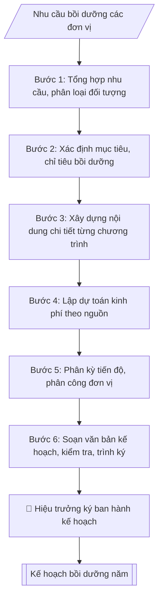

# Kế hoạch đào tạo, bồi dưỡng cán bộ năm

## Quy cách đầu ra và thông tin thiếu

Đọc [quy cách và cấu trúc sản phẩm](references/quy-cach-dau-ra.md) trước khi soạn/xuất. File giao chỉ gồm văn bản hoặc sản phẩm nghiệp vụ được yêu cầu; kiểm tra nội bộ không xuất kèm. Thiếu thông tin giữ nguyên trường/mục và chỗ điền theo mẫu gốc (dòng dấu chấm, dấu gạch hoặc ô trống); không tự điền dữ liệu mẫu, số 0, mã chờ xác minh hoặc dòng chờ ký. Mẫu chuyên ngành còn áp dụng được ưu tiên về cấu trúc, mã biểu và người ký. Các trường “bắt buộc” là điều kiện hoàn thiện hồ sơ, không ngăn việc soạn bản có chỗ chừa để điền. Mọi chỉ dẫn “để trống” trong skill được hiểu là không điền dữ liệu và giữ cách chừa chỗ của mẫu gốc, không phải xóa dấu chấm của mẫu.

## Kiểm soát áp dụng và phê duyệt

Trước khi chạy quy trình, xác định `ngay_ap_dung`, `loai_hinh_truong`, `quy_che_noi_bo`, `nguon_du_lieu` và `nguoi_kiem_duyet`. Chỉ yêu cầu thông tin có liên quan đến nghiệp vụ; không dùng giá trị giả định thay dữ liệu bắt buộc. Đối chiếu nội bộ hồ sơ có yếu tố pháp lý với văn bản gốc, hiệu lực, điều khoản áp dụng và chuyển tiếp; không tự đính kèm bảng kiểm tra vào file giao.

## Giới hạn và human gate

AI hỗ trợ chuẩn bị và đối chiếu. Cán bộ phụ trách kiểm tra dữ liệu/căn cứ, người có thẩm quyền duyệt và ký. Văn bản soạn chưa được coi là đã ban hành; không tự chèn nhãn trạng thái kiểm duyệt vào file giao; không đánh dấu đã ký, đã duyệt hoặc đã công bố nếu chưa có chứng cứ. Dữ liệu sinh viên, sức khỏe, nhân sự và tài chính phải hạn chế theo mục đích, phân quyền và che thông tin định danh khi dùng ví dụ. Không tải dữ liệu lên dịch vụ ngoài khi chưa có quyền. Kiểm tra Luật 91/2025/QH15 về bảo vệ dữ liệu cá nhân (hiệu lực 01/01/2026) và quy định áp dụng trước xử lý/chia sẻ dữ liệu cá nhân.

## Khi nào dùng
Khi cần xây dựng kế hoạch năm về đào tạo, bồi dưỡng cán bộ, viên chức, giảng viên:
tổng hợp nhu cầu từ các đơn vị, xác định đối tượng – nội dung – hình thức – kinh phí,
trình Hiệu trưởng phê duyệt để làm căn cứ triển khai.

## Đầu vào (Input)

| Trường | Mô tả | Bắt buộc |
|---|---|---|
| `nam_ke_hoach` | Năm áp dụng kế hoạch (vd: 2026) | Có |
| `muc_tieu` | Mục tiêu chung của công tác bồi dưỡng trong năm | Có |
| `nhu_cau_don_vi` | Tổng hợp nhu cầu từ các đơn vị: đối tượng, số lượng, nội dung đề xuất | Có |
| `noi_dung_boi_duong` | Các nội dung/chương trình: nghiệp vụ sư phạm, phương pháp giảng dạy, ngoại ngữ, tin học, quản lý... | Có |
| `hinh_thuc` | Tập huấn trong nước / gửi đi đào tạo / bồi dưỡng trực tuyến / liên kết đơn vị... | Có |
| `kinh_phi_du_kien` | Tổng kinh phí và nguồn (ngân sách nhà nước / nguồn thu / học phí hỗ trợ...) | Có |
| `tien_do` | Phân kỳ thực hiện theo quý/tháng | Không |
| `don_vi_chu_tri` | Đơn vị chủ trì, phối hợp | Không (mặc định: Phòng Tổ chức – Cán bộ) |
| `nguoi_ky` | Hiệu trưởng / Phó Hiệu trưởng | Có |

## Quy trình

**Bước 1. Tổng hợp nhu cầu từ các đơn vị**
- Làm gì: thu thập phiếu khảo sát nhu cầu bồi dưỡng của các đơn vị; phân loại theo đối tượng (giảng viên, viên chức quản lý, nhân viên) và theo nội dung; loại bỏ nhu cầu trùng lặp, gộp các nhu cầu tương đồng thành một chương trình.
- Dùng input: `nhu_cau_don_vi`.
- Vai trò: Chuyên viên Phòng TCCB · AI hỗ trợ: tổng hợp và chuẩn hóa dữ liệu · ⏱ ~20–45 phút (ước tính)
- Lưu ý nghiệp vụ: nhu cầu phải xuất phát từ yêu cầu của vị trí việc làm / chuẩn chức danh, không theo nguyện vọng cá nhân đơn thuần; nhu cầu không có đơn vị đề xuất thì không đưa vào kế hoạch.
- → Kết quả bước: bảng tổng hợp nhu cầu phân loại theo đối tượng – nội dung.

**Bước 2. Xác định mục tiêu, chỉ tiêu**
- Làm gì: xác định mục tiêu chung của công tác bồi dưỡng trong năm; cụ thể hóa thành chỉ tiêu đo đếm được: số lượng cán bộ được bồi dưỡng, tỷ lệ đạt chuẩn (chứng chỉ nghiệp vụ sư phạm, trình độ tiến sĩ, chứng chỉ ngoại ngữ/tin học...); gắn với chiến lược phát triển đội ngũ của trường.
- Dùng input: `muc_tieu`, `nam_ke_hoach`.
- Vai trò: Chuyên viên Phòng TCCB · AI hỗ trợ: phân tích input, xác định yêu cầu · ⏱ ~20–45 phút (ước tính)
- Lưu ý nghiệp vụ: chỉ tiêu phải đo đếm được (số lượng, tỷ lệ %, thời hạn hoàn thành); mục tiêu chung chung không kiểm tra được khi tổng kết cuối năm.
- → Kết quả bước: bộ mục tiêu – chỉ tiêu của năm kế hoạch.

**Bước 3. Xây dựng nội dung chi tiết từng chương trình**
- Làm gì: thiết kế từng chương trình bồi dưỡng: tên chương trình, đối tượng, số lượng, hình thức (tập huấn tại trường / gửi đi bồi dưỡng / học trực tuyến), thời gian, địa điểm, đơn vị thực hiện.
- Dùng input: `noi_dung_boi_duong`, `hinh_thuc`.
- Vai trò: Chuyên viên Phòng TCCB · AI hỗ trợ: soạn dự thảo đúng thể thức · ⏱ ~20–45 phút (ước tính)
- Lưu ý nghiệp vụ: đối tượng các chương trình không trùng lặp gây lãng phí nguồn lực; hình thức phải phù hợp nội dung (kỹ năng thực hành ưu tiên tập huấn tập trung, kiến thức lý thuyết có thể trực tuyến).
- → Kết quả bước: bảng kế hoạch chi tiết (chương trình | đối tượng | số lượng | hình thức | thời gian | kinh phí | đơn vị thực hiện).

**Bước 4. Lập dự toán kinh phí**
- Làm gì: tính chi phí từng chương trình (thù lao giảng viên/báo cáo viên, tài liệu, đi lại, ăn ở...); tổng hợp theo nguồn kinh phí (ngân sách nhà nước / nguồn thu sự nghiệp / kinh phí đề tài, dự án...); đối chiếu tổng dự toán với dự toán được giao.
- Dùng input: `kinh_phi_du_kien`.
- Vai trò: Chuyên viên Phòng TCCB · AI hỗ trợ: lập bảng tính toán · ⏱ ~20–45 phút (ước tính)
- Lưu ý nghiệp vụ: tổng kinh phí các chương trình phải khớp tổng các nguồn; vượt dự toán được giao thì cắt giảm nội dung hoặc điều chỉnh quy mô, không "vẽ" thêm nguồn.
- → Kết quả bước: bảng dự toán kinh phí theo nguồn (khớp với tổng kinh phí).

**Bước 5. Phân kỳ tiến độ và phân công thực hiện**
- Làm gì: xếp các chương trình theo quý/tháng trong năm; phân công đơn vị chủ trì – phối hợp từng chương trình; quy định chế độ báo cáo (định kỳ 6 tháng và cả năm).
- Dùng input: `tien_do`, `don_vi_chu_tri`.
- Vai trò: Chuyên viên Phòng TCCB · AI hỗ trợ: xử lý sơ bộ theo quy trình · ⏱ ~20–30 phút (ước tính)
- Lưu ý nghiệp vụ: tránh dồn quá nhiều chương trình vào quý IV; tiến độ phải khả thi với năng lực của đơn vị chủ trì (mặc định: Phòng Tổ chức – Cán bộ).
- → Kết quả bước: lịch tiến độ theo quý + phân công trách nhiệm chủ trì, phối hợp.

**Bước 6. Soạn văn bản kế hoạch và chuẩn bị trình ký**
- Làm gì: soạn Quyết định ban hành kế hoạch theo thể thức NĐ 30/2020 — Điều 1: ban hành kế hoạch kèm theo; Điều 2: tổng kinh phí + nguồn kinh phí; Điều 3: tổ chức thực hiện, chế độ báo cáo; Điều 4: hiệu lực, trách nhiệm thi hành — và soạn kế hoạch chi tiết kèm theo (I. Mục tiêu; II. Nội dung thực hiện dạng bảng; III. Kinh phí; IV. Tổ chức thực hiện); kiểm tra lần cuối: kinh phí trong quyết định khớp bảng dự toán, đối tượng không trùng lặp, thẩm quyền ký đúng; hoàn thiện để trình ký.
- Dùng input: `nguoi_ky` và kết quả các bước 1–5.
- Vai trò: Chuyên viên Phòng TCCB chuẩn bị, Hiệu trưởng phê duyệt · AI hỗ trợ: tổng hợp hồ sơ, soạn phiếu trình/tờ trình đầy đủ · ⏱ ~15–30 phút chuẩn bị + chờ duyệt (ước tính)
- Lưu ý nghiệp vụ: số kinh phí ghi bằng số và bằng chữ trong Điều 2 phải khớp nhau và khớp bảng dự toán; kế hoạch chi tiết là phụ lục kèm theo, phải ghi rõ số/ký hiệu quyết định ban hành.
- → Kết quả bước: quyết định + kế hoạch chi tiết hoàn chỉnh, sẵn sàng trình ký (trình ký tại Human gate).

## Luồng quy trình (Workflow)

## Đầu ra

Sản phẩm nghiệp vụ hoàn chỉnh theo [quy cách và cấu trúc](references/quy-cach-dau-ra.md), giữ các trường chưa có dữ liệu ở trạng thái trống. Không xuất kèm checklist/phụ lục kiểm tra đầu ra.

## Kiểm tra nội bộ trước khi giao

Các tiêu chí sau dùng để tự đối chiếu; không sao chép vào file xuất. Mục thiếu dữ liệu được để trống, không đánh dấu đã đạt hoặc đã duyệt.

- [ ] Bố cục khớp mẫu áp dụng và cấu trúc tại references/quy-cach-dau-ra.md.
- [ ] Nội dung và số liệu trong output khớp đúng với Input đã cho (không thêm, bớt hay suy diễn)
- [ ] Không bịa đặt số liệu, minh chứng, trích dẫn hay căn cứ
- [ ] Đúng thể thức và định dạng theo Nghị định 30/2020/NĐ-CP về công tác văn thư (thể thức văn bản).
- [ ] Căn cứ pháp lý được trích dẫn đầy đủ và còn hiệu lực
- [ ] Không coi bản soạn là đã ký/đã duyệt; việc phê duyệt thuộc người có thẩm quyền trước phát hành
- [ ] Nhu cầu phải xuất phát từ yêu cầu của vị trí việc làm / chuẩn chức danh, không theo nguyện vọng cá nhân đơn thuần
- [ ] Chỉ tiêu phải đo đếm được (số lượng, tỷ lệ %, thời hạn hoàn thành)
- [ ] Mục tiêu chung chung không kiểm tra được khi tổng kết cuối năm

## Căn cứ & lưu ý
- Nghị định 30/2020/NĐ-CP về công tác văn thư (thể thức văn bản).
- Quy chế tổ chức và hoạt động của trường; chiến lược phát triển đội ngũ cán bộ, giảng viên.
- Kinh phí phải phù hợp với dự toán được giao và phân cấp quản lý tài chính hiện hành.
- Không dùng tên thật của trường/cá nhân khi mô phỏng.

## Quản trị phiên bản

- Phiên bản gói: `1.2.1`; ngày cập nhật: `2026-10-10`.
- Kho nguồn: https://github.com/phamtruong91/university-skills-framework
- Người duy trì trên GitHub: `phamtruong91` (Phạm Văn Trường). Người phê duyệt nghiệp vụ: **chưa chỉ định**.
- Commit nguồn trước cập nhật: `346719e6b0318ed034b4b016703f79733aa575e7`. Commit chứa phiên bản này xem bằng `git log -1 -- skills/ke-hoach-boi-duong`; không tự gán SHA chưa tạo.
- Giấy phép: theo LICENSE của kho; bản quyền CES Global.
- Lịch sử 1.1.0: bổ sung metadata giao diện, kiểm soát áp dụng, quản trị phiên bản.
- Trạng thái: dự thảo nghiệp vụ; kiểm tra pháp lý trước thực thi. Ngày cập nhật không đồng nghĩa mọi văn bản đã được rà soát toàn văn.
