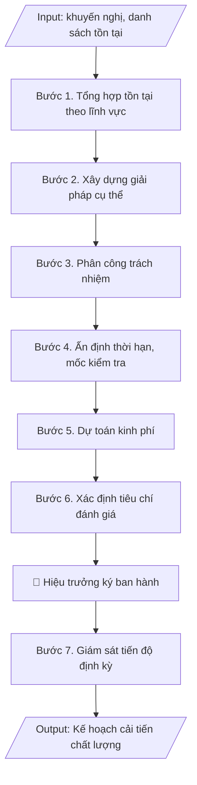

# Kế hoạch cải tiến chất lượng

## Định dạng và file đầu ra
Định dạng đầu ra có thể chọn theo sản phẩm/yêu cầu: .docx, .pdf. Đọc mục “Định dạng bổ sung” trong quy cách đầu ra trước khi chọn.

**Phải tạo file thực tế để tải xuống, không chỉ trả nội dung trong chat.** Định dạng mặc định của skill: **.docx**. Nếu có bảng số liệu nghiệp vụ yêu cầu file bảng tính riêng, tạo thêm Excel theo yêu cầu; không tự tạo file kiểm tra. Không chờ người dùng yêu cầu xuất file lần nữa. Ưu tiên định dạng người dùng chỉ định; đọc quy tắc xuất file tại references/quy-cach-dau-ra.md.

## Quy cách đầu ra và thông tin thiếu
Đọc [quy cách và cấu trúc sản phẩm](references/quy-cach-dau-ra.md) trước khi soạn/xuất. File giao chỉ gồm sản phẩm nghiệp vụ được yêu cầu; kiểm tra nội bộ không xuất kèm. Thiếu thông tin thì giữ nguyên trường/mục và chỗ điền theo mẫu gốc (dòng dấu chấm, dấu gạch hoặc ô trống); không tự điền dữ liệu mẫu, số 0, mã chờ xác minh hay dòng chờ ký. Mẫu chuyên ngành còn áp dụng được ưu tiên về cấu trúc, mã biểu và người ký. Bản đầy đủ: [quy tắc chung](references/quy-tac-chung.md).

## Kiểm soát áp dụng và phê duyệt
Trước khi chạy, xác định `ngay_ap_dung`, `loai_hinh_truong`, `quy_che_noi_bo`, `nguon_du_lieu`, `nguoi_kiem_duyet`; chỉ hỏi thông tin liên quan nghiệp vụ, không dùng giá trị giả định thay dữ liệu bắt buộc. Đối chiếu căn cứ pháp lý với văn bản gốc, hiệu lực, điều khoản áp dụng và chuyển tiếp. Bản đầy đủ: [quy tắc chung](references/quy-tac-chung.md).

Nếu có cập nhật pháp lý dưới đây, đọc [căn cứ và điều kiện áp dụng](references/phap-ly.md) trước khi làm. Quy trình dưới đây giữ nghiệp vụ từ bản gốc; mọi viện dẫn văn bản, mẫu biểu, điều khoản phải theo căn cứ đã chọn trong phap-ly.md, không theo văn bản cũ.

## Giới hạn và human gate
AI hỗ trợ chuẩn bị và đối chiếu; cán bộ phụ trách kiểm tra dữ liệu/căn cứ, người có thẩm quyền duyệt và ký. Không đánh dấu đã ký, đã duyệt, đã công bố khi chưa có chứng cứ. Dữ liệu sinh viên, sức khỏe, nhân sự, tài chính chỉ dùng theo mục đích và phân quyền, che thông tin định danh khi dùng ví dụ (Luật 91/2025/QH15, hiệu lực 01/01/2026); không tải dữ liệu lên dịch vụ ngoài khi chưa có quyền. Bản đầy đủ: [quy tắc chung](references/quy-tac-chung.md).

## Khi nào dùng
Khi có kết quả tự đánh giá hoặc kết luận của đoàn đánh giá ngoài, cần chuyển các khuyến nghị /
tồn tại thành kế hoạch hành động cụ thể.

## Đầu vào (Input)
| Trường | Mô tả | Bắt buộc |
|---|---|---|
| `nguon_khuyen_nghi` | Báo cáo tự đánh giá / Kết luận đoàn đánh giá ngoài (số, ngày) | Có |
| `danh_sach_ton_tai` | Bảng: tiêu chí, nội dung tồn tại/khuyến nghị | Có |
| `don_vi_thuc_hien` | Các phòng/khoa được giao | Có |
| `thoi_han_chung` | Thời hạn hoàn thành toàn bộ kế hoạch | Có |
| `kinh_phi_du_kien` | Tổng kinh phí dự kiến (nếu có) | Không |

## Quy trình
**Ràng buộc pháp lý khi thực hiện** (trích references/phap-ly.md; đối chiếu toàn văn và hiệu lực tại ngày nghiệp vụ):
- Thông tư 20/2026/TT-BGDĐT, hiệu lực 15/05/2026: Yêu cầu ngày hoàn tất tự đánh giá, ngày đăng ký đánh giá ngoài, khung tiêu chuẩn và minh chứng. Điều 51: chỉ cơ sở đã tự đánh giá VÀ đăng ký đánh giá ngoài trước 15/05/2026 được tiếp tục khung 12/2017, hoàn tất chậm nhất 31/12/2026. Ngoài chuyển tiếp dùng 20/2026; không chuyển thang điểm cơ học.
- Thông tư 04/2025/TT-BGDĐT, hiệu lực 04/04/2025: Tách kiểm định chương trình khỏi kiểm định cơ sở. Yêu cầu phiên bản tiêu chuẩn, ngày đăng ký và bộ minh chứng; trích tiêu chí từ phụ lục hiện hành. Không mặc định khung 11 tiêu chuẩn của 04/2016 là khung hiện hành; đối chiếu chuyển tiếp trước khi tiếp tục hồ sơ cũ.
- Trước Bước 1: chọn căn cứ theo đối tượng, loại hình trường và chuyển tiếp; lập bảng văn bản / điều khoản / lý do áp dụng / bằng chứng. Thiếu văn bản gốc hoặc điều khoản thì ghi nhận nội bộ [CẦN XÁC MINH] (không đưa vào file giao), để trống phần tương ứng, chưa kết luận tuân thủ.

**Bước 1. Tổng hợp tồn tại/khuyến nghị**
- Làm gì: Trích toàn bộ tồn tại và khuyến nghị từ `nguon_khuyen_nghi` (báo cáo tự đánh giá / kết luận đoàn đánh giá ngoài: số, ngày ban hành); nhóm các nội dung theo lĩnh vực (đào tạo, NCKH, đội ngũ, CSVC, quản trị...); loại bỏ nội dung trùng lặp, đánh số thứ tự từng tồn tại.
- Dùng input: `nguon_khuyen_nghi`, `danh_sach_ton_tai`.
- Vai trò: Chuyên viên Phòng Khảo thí & ĐBCL · AI hỗ trợ: trích và nhóm tồn tại/khuyến nghị theo lĩnh vực, loại nội dung trùng lặp · ⏱ ~1 giờ (ước tính)
- Lưu ý nghiệp vụ: mỗi khuyến nghị của đoàn đánh giá ngoài đều phải có trong danh sách — sót khuyến nghị là lỗi nghiêm trọng khi tái kiểm định; ghi rõ khuyến nghị thuộc tiêu chí nào để tiện đối chiếu.
- → Kết quả bước: Bảng tổng hợp tồn tại/khuyến nghị đã nhóm theo lĩnh vực, đánh số thứ tự.

**Bước 2. Xây dựng giải pháp cho từng nội dung**
- Làm gì: Với mỗi tồn tại, xây dựng 01 hoặc nhiều giải pháp cụ thể, đo lường được (trả lời: làm gì, làm như thế nào, đạt mức nào); mỗi giải pháp phải gắn với tiêu chí đánh giá sẽ nêu ở Bước 6.
- Dùng input: `danh_sach_ton_tai`.
- Vai trò: Đơn vị chuyên môn phụ trách lĩnh vực (rà soát tính khả thi) · AI hỗ trợ: đề xuất giải pháp sơ bộ cho từng tồn tại · ⏱ ~2 giờ (ước tính)
- Lưu ý nghiệp vụ: bẫy thường gặp — giải pháp chung chung ("nâng cao chất lượng đội ngũ") không thực thi được; giải pháp phải cụ thể đến mức có thể kiểm chứng hoàn thành hay chưa.
- → Kết quả bước: Bảng tồn tại – giải pháp tương ứng (dự thảo cột 1–2 của bảng hành động).

**Bước 3. Phân công trách nhiệm**
- Làm gì: Với mỗi giải pháp, chỉ định 01 đơn vị chủ trì và các đơn vị phối hợp từ danh sách `don_vi_thuc_hien`; gửi dự thảo để các đơn vị góp ý, xác nhận khả năng thực hiện trước khi chốt.
- Dùng input: `don_vi_thuc_hien`.
- Vai trò: Lãnh đạo trường (chốt phân công sau khi các đơn vị góp ý) · AI hỗ trợ: tổng hợp ý kiến góp ý của các đơn vị trước khi chốt · ⏱ ~2 ngày làm việc (ước tính)
- Lưu ý nghiệp vụ: mỗi giải pháp chỉ có 01 đơn vị chủ trì duy nhất để rõ trách nhiệm; đơn vị phối hợp phải được hỏi ý kiến trước, tránh giao việc mà đơn vị không biết.
- → Kết quả bước: Bảng giải pháp đã gắn đơn vị chủ trì/phối hợp (dự thảo cột 3).

**Bước 4. Ấn định thời hạn và mốc kiểm tra**
- Làm gì: Ấn định thời hạn hoàn thành cho từng giải pháp (không vượt quá `thoi_han_chung`); đặt các mốc kiểm tra giữa kỳ cho giải pháp dài hạn (VD: giải pháp 12 tháng thì có mốc 6 tháng); ghi thời hạn theo tháng/năm cụ thể.
- Dùng input: `thoi_han_chung`.
- Vai trò: Lãnh đạo trường (quyết định thời hạn và mốc kiểm tra) · AI hỗ trợ: gợi ý thời hạn sơ bộ cho từng giải pháp · ⏱ ~2 giờ (ước tính)
- Lưu ý nghiệp vụ: thời hạn phải thực tế — quá gấp đơn vị không làm được, quá dài mất tính cam kết; mốc kiểm tra giữa kỳ là cơ sở để Phòng KT&ĐBCL giám sát.
- → Kết quả bước: Bảng giải pháp đã có thời hạn và mốc kiểm tra (dự thảo cột 4).

**Bước 5. Dự toán kinh phí**
- Làm gì: Lập dự toán kinh phí cho từng giải pháp (nếu có): nội dung chi, số tiền, nguồn kinh phí (ngân sách trường/dự án/tài trợ); tổng hợp thành tổng kinh phí của kế hoạch, đối chiếu với `kinh_phi_du_kien` (nếu có).
- Dùng input: `kinh_phi_du_kien`.
- Vai trò: Phòng Tài chính (thẩm tra kinh phí) · AI hỗ trợ: lập bảng dự toán sơ bộ theo từng giải pháp · ⏱ ~4 giờ (ước tính)
- Lưu ý nghiệp vụ: giải pháp không có kinh phí vẫn phải ghi rõ "không sử dụng kinh phí" thay vì để trống; kinh phí lớn cần có ý kiến của Phòng Tài chính trước khi ban hành.
- → Kết quả bước: Bảng dự toán kinh phí theo từng giải pháp + tổng kinh phí (dự thảo cột 5).

**Bước 6. Xác định tiêu chí đánh giá**
- Làm gì: Với mỗi giải pháp, xác định kết quả đầu ra mong đợi dưới dạng đo lường được (con số, tỷ lệ, sản phẩm cụ thể) và cách kiểm chứng (minh chứng nào chứng minh đã hoàn thành); ghi vào cột tiêu chí đánh giá của bảng hành động.
- Dùng input: `danh_sach_ton_tai`.
- Vai trò: Chuyên viên Phòng Khảo thí & ĐBCL · AI hỗ trợ: gợi ý tiêu chí đo lường và minh chứng kiểm chứng cho từng giải pháp · ⏱ ~2 giờ (ước tính)
- Lưu ý nghiệp vụ: tiêu chí đánh giá phải đo lường được, tránh định tính ("tốt hơn", "nâng cao"); mỗi tiêu chí nên gắn với 01 minh chứng cụ thể để đoàn kiểm định tái kiểm tra.
- → Kết quả bước: Bảng hành động hoàn chỉnh 6 cột (nội dung – giải pháp – đơn vị – thời hạn – kinh phí – tiêu chí đánh giá).

**Bước 7. Ban hành và giám sát**
- Làm gì: Hoàn thiện văn bản kế hoạch (căn cứ, mục tiêu, bảng hành động, tổ chức thực hiện), trình Hiệu trưởng ký ban hành; Phòng KT&ĐBCL làm đầu mối theo dõi tiến độ, đôn đốc các đơn vị báo cáo định kỳ (6 tháng/lần); tổng hợp báo cáo tiến độ, lưu đầy đủ minh chứng hoàn thành từng giải pháp.
- Dùng input: `nguon_khuyen_nghi`, `thoi_han_chung`.
- Vai trò: Hiệu trưởng ký ban hành, Phòng Khảo thí & ĐBCL theo dõi tiến độ định kỳ · AI hỗ trợ: soạn văn bản kế hoạch hoàn chỉnh, tổng hợp báo cáo tiến độ định kỳ · ⏱ ~1 tuần (ước tính)
- Lưu ý nghiệp vụ: kế hoạch cải tiến là minh chứng bắt buộc trong chu kỳ kiểm định tiếp theo — phải lưu đầy đủ báo cáo tiến độ và minh chứng hoàn thành, không chỉ lưu văn bản kế hoạch.
- → Kết quả bước: Kế hoạch cải tiến chất lượng đã ban hành + cơ chế giám sát tiến độ định kỳ.

## Luồng quy trình (Workflow)

## Đầu ra
- Văn bản kế hoạch cải tiến chất lượng hoàn chỉnh.
- Bảng hành động chi tiết (nội dung – giải pháp – đơn vị – thời hạn – kinh phí – tiêu chí đánh giá).

**Cấu trúc output chuẩn:** văn bản kế hoạch gồm các phần bắt buộc theo đúng thứ tự:
1. Quốc hiệu, tên cơ quan ban hành, số/ký hiệu văn bản, địa danh và ngày tháng năm ban hành;
2. Tên loại văn bản (KẾ HOẠCH) + trích yếu nội dung (cải tiến chất lượng sau đánh giá, giai đoạn thực hiện);
3. Phần I – Căn cứ (kết luận đoàn đánh giá ngoài / báo cáo tự đánh giá: số, ngày);
4. Phần II – Mục tiêu (số tồn tại cần khắc phục, mức đạt kỳ vọng);
5. Phần III – Nội dung hành động: bảng chi tiết gồm các cột STT – Tồn tại/khuyến nghị – Giải pháp – Đơn vị chủ trì (phối hợp) – Thời hạn – Kinh phí – Tiêu chí đánh giá;
6. Phần IV – Tổ chức thực hiện (đơn vị đầu mối theo dõi, trách nhiệm các đơn vị chủ trì, chế độ báo cáo tiến độ, thời hạn báo cáo kết quả);
7. Nơi nhận;
8. Chức vụ người ký, chữ ký, họ tên người ký.

File nghiệp vụ thực tế theo định dạng mặc định ở đầu skill hoặc định dạng người dùng yêu cầu, kèm liên kết tải trong phản hồi cuối.

Sản phẩm nghiệp vụ hoàn chỉnh theo [quy cách và cấu trúc](references/quy-cach-dau-ra.md), giữ các trường chưa có dữ liệu ở trạng thái trống. Không xuất kèm checklist/phụ lục kiểm tra đầu ra.

## Kiểm tra nội bộ trước khi giao
Các tiêu chí sau dùng để tự đối chiếu; không sao chép vào file xuất. Mục thiếu dữ liệu được để trống, không đánh dấu đã đạt hoặc đã duyệt.

- [ ] Đủ 8 phần theo "Cấu trúc output chuẩn": quốc hiệu + số/ký hiệu + địa danh, ngày tháng; KẾ HOẠCH + trích yếu; Phần I – Căn cứ; Phần II – Mục tiêu; Phần III – Nội dung hành động (bảng 7 cột: STT – Tồn tại/khuyến nghị – Giải pháp – Đơn vị chủ trì (phối hợp) – Thời hạn – Kinh phí – Tiêu chí đánh giá); Phần IV – Tổ chức thực hiện; Nơi nhận; chức vụ/chữ ký/họ tên người ký.
- [ ] Toàn bộ khuyến nghị của đoàn đánh giá ngoài đều có trong danh sách (không sót), ghi rõ thuộc tiêu chí nào; số liệu khớp với Input.
- [ ] Không bịa đặt tồn tại, giải pháp, kinh phí.
- [ ] Đúng thể thức văn bản hành chính theo Nghị định 30/2020/NĐ-CP.
- [ ] Căn cứ (kết luận đoàn đánh giá ngoài / báo cáo tự đánh giá: số, ngày ban hành) đầy đủ, còn hiệu lực.
- [ ] Đã qua Human gate: người có thẩm quyền theo quy trình đã duyệt.
- [ ] Mỗi giải pháp có 01 đơn vị chủ trì duy nhất đã được hỏi ý kiến trước; thời hạn không vượt quá thời hạn chung, có mốc kiểm tra giữa kỳ cho giải pháp dài hạn.
- [ ] Tiêu chí đánh giá đo lường được (con số, tỷ lệ, sản phẩm cụ thể) và gắn minh chứng kiểm chứng; giải pháp không dùng kinh phí ghi rõ "không sử dụng kinh phí" thay vì để trống.

## Căn cứ & lưu ý
- Căn cứ hiện hành: xem [căn cứ và điều kiện áp dụng](references/phap-ly.md); phải đối chiếu văn bản gốc, hiệu lực và chuyển tiếp tại ngày nghiệp vụ.
- Kế hoạch cải tiến là minh chứng bắt buộc trong chu kỳ kiểm định tiếp theo — phải lưu
  đầy đủ báo cáo tiến độ và minh chứng hoàn thành.
- Mỗi giải pháp cần gắn với 01 tiêu chí đánh giá đo lường được, tránh chung chung.
- Không dùng tên thật của trường/cá nhân khi mô phỏng.

## Tư liệu đối chiếu
Bản gốc trước cập nhật pháp lý (kèm ví dụ giả lập) lưu tại `references/quy-trinh-lich-su.md`, chỉ để đối chiếu hồ sơ lịch sử; không dùng căn cứ, mẫu hay số liệu trong đó làm chỉ dẫn hiện hành.

## Quản trị phiên bản
- Phiên bản gói `1.3.2` (cập nhật 2026-10-10); hồ sơ đầy đủ tại [references/version.json](references/version.json).
- Người phê duyệt nghiệp vụ: **chưa chỉ định**. Trạng thái: dự thảo nghiệp vụ; kiểm tra pháp lý trước thực thi. Ngày cập nhật không đồng nghĩa mọi văn bản đã được rà soát toàn văn.
- Giấy phép theo LICENSE của kho (bản quyền CES Global). Lịch sử thay đổi: CHANGELOG.md.
