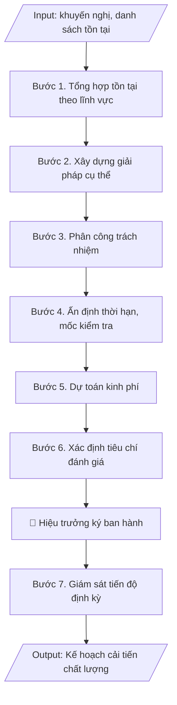

# Skill: Kế hoạch cải tiến chất lượng

## Khi nào dùng
Khi có kết quả tự đánh giá hoặc kết luận của đoàn đánh giá ngoài, cần chuyển các khuyến nghị /
tồn tại thành kế hoạch hành động cụ thể.

## Đầu vào (Input)

| Trường | Mô tả | Bắt buộc |
|---|---|---|
| `nguon_khuyen_nghi` | Báo cáo tự đánh giá / Kết luận đoàn đánh giá ngoài (số, ngày) | Có |
| `danh_sach_ton_tai` | Bảng: tiêu chí, nội dung tồn tại/khuyến nghị | Có |
| `don_vi_thuc_hien` | Các phòng/khoa được giao | Có |
| `thoi_han_chung` | Thời hạn hoàn thành toàn bộ kế hoạch | Có |
| `kinh_phi_du_kien` | Tổng kinh phí dự kiến (nếu có) | Không |

## Quy trình

**Bước 1. Tổng hợp tồn tại/khuyến nghị**
- Làm gì: Trích toàn bộ tồn tại và khuyến nghị từ `nguon_khuyen_nghi` (báo cáo tự đánh giá / kết luận đoàn đánh giá ngoài: số, ngày ban hành); nhóm các nội dung theo lĩnh vực (đào tạo, NCKH, đội ngũ, CSVC, quản trị...); loại bỏ nội dung trùng lặp, đánh số thứ tự từng tồn tại.
- Dùng input: `nguon_khuyen_nghi`, `danh_sach_ton_tai`.
- Vai trò: Chuyên viên Phòng Khảo thí & ĐBCL · AI hỗ trợ: trích và nhóm tồn tại/khuyến nghị theo lĩnh vực, loại nội dung trùng lặp · ⏱ ~1 giờ (ước tính)
- Lưu ý nghiệp vụ: mỗi khuyến nghị của đoàn đánh giá ngoài đều phải có trong danh sách — sót khuyến nghị là lỗi nghiêm trọng khi tái kiểm định; ghi rõ khuyến nghị thuộc tiêu chí nào để tiện đối chiếu.
- → Kết quả bước: Bảng tổng hợp tồn tại/khuyến nghị đã nhóm theo lĩnh vực, đánh số thứ tự.

**Bước 2. Xây dựng giải pháp cho từng nội dung**
- Làm gì: Với mỗi tồn tại, xây dựng 01 hoặc nhiều giải pháp cụ thể, đo lường được (trả lời: làm gì, làm như thế nào, đạt mức nào); mỗi giải pháp phải gắn với tiêu chí đánh giá sẽ nêu ở Bước 6.
- Dùng input: `danh_sach_ton_tai`.
- Vai trò: Đơn vị chuyên môn phụ trách lĩnh vực (rà soát tính khả thi) · AI hỗ trợ: đề xuất giải pháp sơ bộ cho từng tồn tại · ⏱ ~2 giờ (ước tính)
- Lưu ý nghiệp vụ: bẫy thường gặp — giải pháp chung chung ("nâng cao chất lượng đội ngũ") không thực thi được; giải pháp phải cụ thể đến mức có thể kiểm chứng hoàn thành hay chưa.
- → Kết quả bước: Bảng tồn tại – giải pháp tương ứng (dự thảo cột 1–2 của bảng hành động).

**Bước 3. Phân công trách nhiệm**
- Làm gì: Với mỗi giải pháp, chỉ định 01 đơn vị chủ trì và các đơn vị phối hợp từ danh sách `don_vi_thuc_hien`; gửi dự thảo để các đơn vị góp ý, xác nhận khả năng thực hiện trước khi chốt.
- Dùng input: `don_vi_thuc_hien`.
- Vai trò: Lãnh đạo trường (chốt phân công sau khi các đơn vị góp ý) · AI hỗ trợ: tổng hợp ý kiến góp ý của các đơn vị trước khi chốt · ⏱ ~2 ngày làm việc (ước tính)
- Lưu ý nghiệp vụ: mỗi giải pháp chỉ có 01 đơn vị chủ trì duy nhất để rõ trách nhiệm; đơn vị phối hợp phải được hỏi ý kiến trước, tránh giao việc mà đơn vị không biết.
- → Kết quả bước: Bảng giải pháp đã gắn đơn vị chủ trì/phối hợp (dự thảo cột 3).

**Bước 4. Ấn định thời hạn và mốc kiểm tra**
- Làm gì: Ấn định thời hạn hoàn thành cho từng giải pháp (không vượt quá `thoi_han_chung`); đặt các mốc kiểm tra giữa kỳ cho giải pháp dài hạn (VD: giải pháp 12 tháng thì có mốc 6 tháng); ghi thời hạn theo tháng/năm cụ thể.
- Dùng input: `thoi_han_chung`.
- Vai trò: Lãnh đạo trường (quyết định thời hạn và mốc kiểm tra) · AI hỗ trợ: gợi ý thời hạn sơ bộ cho từng giải pháp · ⏱ ~2 giờ (ước tính)
- Lưu ý nghiệp vụ: thời hạn phải thực tế — quá gấp đơn vị không làm được, quá dài mất tính cam kết; mốc kiểm tra giữa kỳ là cơ sở để Phòng KT&ĐBCL giám sát.
- → Kết quả bước: Bảng giải pháp đã có thời hạn và mốc kiểm tra (dự thảo cột 4).

**Bước 5. Dự toán kinh phí**
- Làm gì: Lập dự toán kinh phí cho từng giải pháp (nếu có): nội dung chi, số tiền, nguồn kinh phí (ngân sách trường/dự án/tài trợ); tổng hợp thành tổng kinh phí của kế hoạch, đối chiếu với `kinh_phi_du_kien` (nếu có).
- Dùng input: `kinh_phi_du_kien`.
- Vai trò: Phòng Tài chính (thẩm tra kinh phí) · AI hỗ trợ: lập bảng dự toán sơ bộ theo từng giải pháp · ⏱ ~4 giờ (ước tính)
- Lưu ý nghiệp vụ: giải pháp không có kinh phí vẫn phải ghi rõ "không sử dụng kinh phí" thay vì để trống; kinh phí lớn cần có ý kiến của Phòng Tài chính trước khi ban hành.
- → Kết quả bước: Bảng dự toán kinh phí theo từng giải pháp + tổng kinh phí (dự thảo cột 5).

**Bước 6. Xác định tiêu chí đánh giá**
- Làm gì: Với mỗi giải pháp, xác định kết quả đầu ra mong đợi dưới dạng đo lường được (con số, tỷ lệ, sản phẩm cụ thể) và cách kiểm chứng (minh chứng nào chứng minh đã hoàn thành); ghi vào cột tiêu chí đánh giá của bảng hành động.
- Dùng input: `danh_sach_ton_tai`.
- Vai trò: Chuyên viên Phòng Khảo thí & ĐBCL · AI hỗ trợ: gợi ý tiêu chí đo lường và minh chứng kiểm chứng cho từng giải pháp · ⏱ ~2 giờ (ước tính)
- Lưu ý nghiệp vụ: tiêu chí đánh giá phải đo lường được, tránh định tính ("tốt hơn", "nâng cao"); mỗi tiêu chí nên gắn với 01 minh chứng cụ thể để đoàn kiểm định tái kiểm tra.
- → Kết quả bước: Bảng hành động hoàn chỉnh 6 cột (nội dung – giải pháp – đơn vị – thời hạn – kinh phí – tiêu chí đánh giá).

**Bước 7. Ban hành và giám sát**
- Làm gì: Hoàn thiện văn bản kế hoạch (căn cứ, mục tiêu, bảng hành động, tổ chức thực hiện), trình Hiệu trưởng ký ban hành; Phòng KT&ĐBCL làm đầu mối theo dõi tiến độ, đôn đốc các đơn vị báo cáo định kỳ (6 tháng/lần); tổng hợp báo cáo tiến độ, lưu đầy đủ minh chứng hoàn thành từng giải pháp.
- Dùng input: `nguon_khuyen_nghi`, `thoi_han_chung`.
- Vai trò: Hiệu trưởng ký ban hành, Phòng Khảo thí & ĐBCL theo dõi tiến độ định kỳ · AI hỗ trợ: soạn văn bản kế hoạch hoàn chỉnh, tổng hợp báo cáo tiến độ định kỳ · ⏱ ~1 tuần (ước tính)
- Lưu ý nghiệp vụ: kế hoạch cải tiến là minh chứng bắt buộc trong chu kỳ kiểm định tiếp theo — phải lưu đầy đủ báo cáo tiến độ và minh chứng hoàn thành, không chỉ lưu văn bản kế hoạch.
- → Kết quả bước: Kế hoạch cải tiến chất lượng đã ban hành + cơ chế giám sát tiến độ định kỳ.

## Luồng quy trình (Workflow)


## Đầu ra (Output)
- Văn bản kế hoạch cải tiến chất lượng hoàn chỉnh.
- Bảng hành động chi tiết (nội dung – giải pháp – đơn vị – thời hạn – kinh phí – tiêu chí đánh giá).

**Cấu trúc output chuẩn:** văn bản kế hoạch gồm các phần bắt buộc theo đúng thứ tự:
1. Quốc hiệu, tên cơ quan ban hành, số/ký hiệu văn bản, địa danh và ngày tháng năm ban hành;
2. Tên loại văn bản (KẾ HOẠCH) + trích yếu nội dung (cải tiến chất lượng sau đánh giá, giai đoạn thực hiện);
3. Phần I – Căn cứ (kết luận đoàn đánh giá ngoài / báo cáo tự đánh giá: số, ngày);
4. Phần II – Mục tiêu (số tồn tại cần khắc phục, mức đạt kỳ vọng);
5. Phần III – Nội dung hành động: bảng chi tiết gồm các cột STT – Tồn tại/khuyến nghị – Giải pháp – Đơn vị chủ trì (phối hợp) – Thời hạn – Kinh phí – Tiêu chí đánh giá;
6. Phần IV – Tổ chức thực hiện (đơn vị đầu mối theo dõi, trách nhiệm các đơn vị chủ trì, chế độ báo cáo tiến độ, thời hạn báo cáo kết quả);
7. Nơi nhận;
8. Chức vụ người ký, chữ ký, họ tên người ký.

## Checklist nghiệm thu

- [ ] Đủ 8 phần theo "Cấu trúc output chuẩn": quốc hiệu + số/ký hiệu + địa danh, ngày tháng; KẾ HOẠCH + trích yếu; Phần I – Căn cứ; Phần II – Mục tiêu; Phần III – Nội dung hành động (bảng 7 cột: STT – Tồn tại/khuyến nghị – Giải pháp – Đơn vị chủ trì (phối hợp) – Thời hạn – Kinh phí – Tiêu chí đánh giá); Phần IV – Tổ chức thực hiện; Nơi nhận; chức vụ/chữ ký/họ tên người ký.
- [ ] Toàn bộ khuyến nghị của đoàn đánh giá ngoài đều có trong danh sách (không sót), ghi rõ thuộc tiêu chí nào; số liệu khớp với Input.
- [ ] Không bịa đặt tồn tại, giải pháp, kinh phí.
- [ ] Đúng thể thức văn bản hành chính theo Nghị định 30/2020/NĐ-CP.
- [ ] Căn cứ (kết luận đoàn đánh giá ngoài / báo cáo tự đánh giá: số, ngày ban hành) đầy đủ, còn hiệu lực.
- [ ] Đã qua Human gate: người có thẩm quyền theo quy trình đã duyệt.
- [ ] Mỗi giải pháp có 01 đơn vị chủ trì duy nhất đã được hỏi ý kiến trước; thời hạn không vượt quá thời hạn chung, có mốc kiểm tra giữa kỳ cho giải pháp dài hạn.
- [ ] Tiêu chí đánh giá đo lường được (con số, tỷ lệ, sản phẩm cụ thể) và gắn minh chứng kiểm chứng; giải pháp không dùng kinh phí ghi rõ "không sử dụng kinh phí" thay vì để trống.

Tiêu chí đạt = tất cả các ô được đánh dấu.

## Ví dụ mô phỏng (dữ liệu giả lập)

> Tất cả tên trường, cá nhân, số liệu dưới đây đều là **giả lập**, không liên quan tổ chức/cá nhân có thật.

### Input mẫu

| Trường | Giá trị |
|---|---|
| `nguon_khuyen_nghi` | Kết luận đoàn đánh giá ngoài CTĐT ngành CNTT ngày 20/09/2026 |
| `danh_sach_ton_tai` | 04 khuyến nghị (xem bảng mẫu) |
| `thoi_han_chung` | Hoàn thành trước 30/06/2027 |

### Output mẫu

```
TRƯỜNG ĐẠI HỌC A            CỘNG HÒA XÃ HỘI CHỦ NGHĨA VIỆT NAM
PHÒNG KHẢO THÍ & ĐBCL                    Độc lập – Tự do – Hạnh phúc
      Số: 82/KH-ĐHA-KTĐBCL
                                                 Thành phố C, ngày 09 tháng 10 năm 2026

KẾ HOẠCH
Cải tiến chất lượng chương trình đào tạo ngành Công nghệ thông tin
sau đánh giá ngoài (giai đoạn 2026–2027)

I. CĂN CỨ
- Kết luận của Đoàn đánh giá ngoài CTĐT ngành CNTT ngày 20/09/2026;
- Báo cáo tự đánh giá CTĐT ngành CNTT chu kỳ 2021–2026.

II. MỤC TIÊU
Khắc phục 04 tồn tại được chỉ ra, nâng mức đạt các tiêu chí liên quan,
chuẩn bị cho chu kỳ kiểm định tiếp theo.

III. NỘI DUNG HÀNH ĐỘNG

| STT | Tồn tại / khuyến nghị | Giải pháp | Đơn vị chủ trì (phối hợp) | Thời hạn | Kinh phí (tr.đ) | Tiêu chí đánh giá |
|---|---|---|---|---|---|---|
| 1 | Tỷ lệ giảng viên có trình độ tiến sĩ mới đạt 28% (khuyến nghị ≥ 35%) | Tuyển mới 04 TS; hỗ trợ 06 GV học NCS | P. TCCB (Khoa CNTT) | 06/2027 | 800 | Tỷ lệ TS đạt ≥ 35% |
| 2 | Phòng thí nghiệm chưa đáp ứng học phần AI | Đầu tư 01 phòng lab AI (30 máy trạm) | P. QTTB (Khoa CNTT) | 03/2027 | 1.500 | Phòng lab đưa vào sử dụng |
| 3 | Chưa có khảo sát nhà tuyển dụng định kỳ | Xây dựng quy trình + thực hiện khảo sát hằng năm | P. KT&ĐBCL | 12/2026 | 50 | Có báo cáo khảo sát 2026 |
| 4 | Tỷ lệ SV tốt nghiệp đúng hạn 68% (mục tiêu 75%) | Tăng cường cố vấn học tập; cảnh báo sớm SV nguy cơ | Khoa CNTT (P. Đào tạo) | 06/2027 | 30 | Tỷ lệ ≥ 75% |

IV. TỔ CHỨC THỰC HIỆN
- Phòng KT&ĐBCL: đầu mối theo dõi, báo cáo tiến độ 6 tháng/lần.
- Các đơn vị chủ trì chịu trách nhiệm hoàn thành đúng thời hạn; báo cáo
  kết quả về Phòng KT&ĐBCL trước ngày 15/06/2027.

Nơi nhận:                                          KT. HIỆU TRƯỞNG
- Ban Giám hiệu;                                    PHÓ HIỆU TRƯỞNG
- Các đơn vị có tên trong kế hoạch;                      (đã ký)
- Lưu: VT, KTĐBCL.
                                                 PGS.TS. Trần Văn B
```

## Căn cứ & lưu ý
- Thông tư 12/2017/TT-BGDĐT; Thông tư 04/2016/TT-BGDĐT (yêu cầu cải tiến liên tục).
- Kế hoạch cải tiến là minh chứng bắt buộc trong chu kỳ kiểm định tiếp theo — phải lưu
  đầy đủ báo cáo tiến độ và minh chứng hoàn thành.
- Mỗi giải pháp cần gắn với 01 tiêu chí đánh giá đo lường được, tránh chung chung.
- Không dùng tên thật của trường/cá nhân khi mô phỏng.
