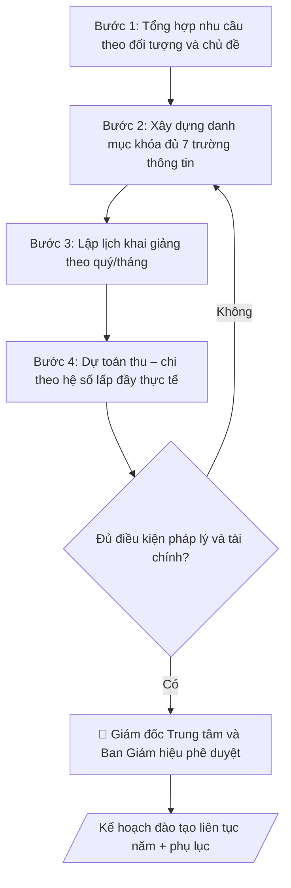

# Skill: Kế hoạch đào tạo liên tục

## Khi nào dùng
Khi Trung tâm Đào tạo liên tục / Trường bồi dưỡng cần lập kế hoạch năm: mở mới, duy trì hay
điều chỉnh các khóa đào tạo ngắn hạn, bồi dưỡng cho người đi làm, doanh nghiệp, xã hội.

## Đầu vào (Input)

| Trường | Mô tả | Bắt buộc |
|---|---|---|
| `nam_ke_hoach` | Năm kế hoạch | Có |
| `ket_qua_khao_sat` | Kết quả khảo sát nhu cầu (đối tượng, chủ đề quan tâm, số lượng dự kiến) | Có |
| `danh_muc_khoa` | Danh mục khóa học: tên khóa, thời lượng, hình thức (trực tiếp/trực tuyến), học phí dự kiến, số lớp dự kiến | Có |
| `nguon_luc` | Giảng viên, phòng học, hạ tầng hiện có | Có |
| `muc_tieu_tai_chinh` | Chỉ tiêu doanh thu / số học viên (nếu có) | Không |

## Quy trình

**Bước 1. Tổng hợp và phân nhóm nhu cầu đào tạo**
- Làm gì: đọc `ket_qua_khao_sat`; phân nhóm nhu cầu theo 3 đối tượng (cá nhân đi làm, doanh nghiệp, cơ quan nhà nước) và theo chủ đề; với mỗi nhóm, ước tính quy mô (số người quan tâm) và mức sẵn sàng chi trả (nếu khảo sát có hỏi); loại các chủ đề có nhu cầu quá nhỏ (không đủ mở 1 lớp tối thiểu) hoặc trùng lặp nhau.
- Dùng input: `ket_qua_khao_sat`.
- Vai trò: Cán bộ Trung tâm · AI hỗ trợ: phân nhóm nhu cầu theo đối tượng và chủ đề, ước tính quy mô, loại chủ đề không khả thi · ⏱ 2–3 giờ (ước tính)
- Lưu ý nghiệp vụ: phân biệt "quan tâm" với "sẵn sàng đăng ký và đóng học phí" — khảo sát thường phồng nhu cầu gấp 2–3 lần. Bẫy: doanh nghiệp "cần đào tạo" nhưng chưa có ngân sách — phải xác nhận đơn đặt hàng/hợp đồng nguyên tắc trước khi đưa vào kế hoạch.
- → Kết quả bước: bảng nhu cầu phân nhóm (đối tượng × chủ đề × quy mô ước tính × độ chắc chắn).

**Bước 2. Xây dựng danh mục khóa học**
- Làm gì: từ bảng nhu cầu ở Bước 1 và `danh_muc_khoa` (danh mục sơ bộ), chốt từng khóa với đủ 7 trường thông tin: tên khóa, mục tiêu/đối tượng, chuẩn đầu ra, thời lượng, hình thức (trực tiếp/trực tuyến/kết hợp), học phí dự kiến, số lớp dự kiến; loại hoặc gộp các khóa trùng chủ đề; đảm bảo mỗi khóa có ít nhất 1 giảng viên trong `nguon_luc` đủ năng lực phụ trách.
- Dùng input: `danh_muc_khoa`, `nguon_luc` (+ bảng nhu cầu ở Bước 1).
- Vai trò: Giảng viên · AI hỗ trợ: chốt danh mục khóa đủ 7 trường thông tin, gộp khóa trùng, đối chiếu nguồn lực giảng viên · ⏱ 2–4 giờ (ước tính)
- Lưu ý nghiệp vụ: học phí phải tính trên cơ sở chi phí cộng biên dự kiến, không đặt theo cảm tính; khóa "theo đơn đặt hàng" phải ghi rõ điều kiện mở lớp (số học viên tối thiểu theo hợp đồng). Khóa nào không có chuẩn đầu ra đo được thì không đưa vào kế hoạch.
- → Kết quả bước: danh mục khóa học chi tiết (mỗi khóa đủ 7 trường thông tin).

**Bước 3. Lập lịch khai giảng**
- Làm gì: phân bổ các lớp vào lịch quý/tháng của `nam_ke_hoach`; kiểm tra trùng lặp 2 chiều: giảng viên (1 người không dạy 2 lớp cùng khung giờ) và phòng học/lab (đối chiếu `nguon_luc`); ưu tiên xếp khóa theo đơn đặt hàng đúng tiến độ hợp đồng; lập phương án dự phòng cho lớp chưa đủ sĩ số (dời lịch thay vì hủy vội).
- Dùng input: `nam_ke_hoach`, `nguon_luc` (+ danh mục khóa ở Bước 2).
- Vai trò: Giảng viên · AI hỗ trợ: phân bổ lịch khai giảng theo quý/tháng, kiểm tra trùng giảng viên và phòng học · ⏱ 1–2 giờ (ước tính)
- Lưu ý nghiệp vụ: tránh dồn quá nhiều lớp vào cùng 1 quý (quá tải giảng viên, phòng học) — phân bổ đều nhưng ưu tiên quý có nhu cầu cao theo khảo sát. Bẫy: quên lịch nghỉ lễ/Tết khi xếp lớp cuối năm.
- → Kết quả bước: lịch khai giảng chi tiết theo quý/tháng (lớp – thời gian – giảng viên – phòng học).

**Bước 4. Dự toán thu – chi**
- Làm gì: tính thu từng khóa = học phí × số học viên dự kiến × số lớp, áp hệ số lấp đầy thực tế (70–80% sĩ số tối đa, không tính 100%); tính chi theo 5 nhóm: thù lao giảng viên, học liệu, hậu cần, marketing, quản lý; tổng hợp toàn trung tâm; đối chiếu với `muc_tieu_tai_chinh` (nếu có) — chênh lệch lớn thì quay lại điều chỉnh danh mục/lịch ở Bước 2–3.
- Dùng input: `muc_tieu_tai_chinh` (+ danh mục khóa ở Bước 2, lịch khai giảng ở Bước 3).
- Vai trò: Giảng viên · AI hỗ trợ: tính thu theo hệ số lấp đầy thực tế, tổng hợp chi theo 5 nhóm, đối chiếu mục tiêu tài chính · ⏱ 1–2 giờ (ước tính)
- Lưu ý nghiệp vụ: không lập dự toán thu trên giả định lấp đầy 100% — đây là bẫy phổ biến nhất khiến kế hoạch "lãi trên giấy". Chi phí marketing cho khóa mới phải tính đủ (thường 10–15% doanh thu khóa).
- → Kết quả bước: bảng dự toán thu – chi từng khóa và tổng hợp toàn năm.

**Bước 5. Rà soát pháp lý và điều kiện mở khóa**
- Làm gì: kiểm tra từng khóa trong danh mục: có thuộc danh mục được phép đào tạo của trung tâm không; mẫu chứng chỉ áp dụng đã được phê duyệt chưa; quy định thu – chi tài chính (mức thu, tỷ lệ trích nộp); khóa nào chưa đủ điều kiện thì chuyển sang diện "dự kiến, bổ sung sau khi hoàn thiện thủ tục", không đưa vào kế hoạch chính thức.
- Dùng input: danh mục khóa ở Bước 2.
- Vai trò: Giám đốc Trung tâm · AI hỗ trợ: tổng hợp danh mục kiểm tra, đối chiếu hồ sơ · ⏱ 2–3 ngày làm việc (ước tính)
- Lưu ý nghiệp vụ: tuyệt đối không đưa khóa chưa đủ điều kiện pháp lý vào kế hoạch chính thức — khi thanh tra, "kế hoạch đã ban hành" là căn cứ xử lý. Mẫu chứng chỉ phải khớp quy định hiện hành của Bộ/trường.
- → Kết quả bước: danh sách khóa đủ điều kiện + danh sách khóa "dự kiến bổ sung" kèm việc cần hoàn thiện.

**Bước 6. Trình duyệt và ban hành**
- Làm gì: lắp ráp văn bản kế hoạch theo cấu trúc chuẩn, kèm phụ lục (kết quả khảo sát nhu cầu, phân công chuẩn bị); trình Giám đốc Trung tâm duyệt danh mục và dự toán → Phòng Tài chính – Kế toán thẩm định dự toán → Ban Giám hiệu/Hiệu trưởng phê duyệt kế hoạch năm (human gate); ban hành và gửi các khoa, đơn vị liên quan.
- Dùng input: `nam_ke_hoach` (+ kết quả các Bước 1–5).
- Vai trò: Giám đốc Trung tâm · AI hỗ trợ: chuẩn bị dự thảo, tài liệu và số liệu phục vụ bước này · ⏱ 3–7 ngày làm việc (ước tính)
- Lưu ý nghiệp vụ: sau ban hành, mọi điều chỉnh (thêm khóa, đổi học phí) phải làm văn bản điều chỉnh kế hoạch, không tự ý sửa. Giữ số hiệu văn bản liên tục.
- → Kết quả bước: quyết định ban hành + kế hoạch đào tạo liên tục năm đã phê duyệt.

## Luồng quy trình (Workflow)



## Đầu ra (Output)
- Quyết định ban hành + Kế hoạch đào tạo liên tục năm (danh mục khóa, lịch khai giảng, dự toán).
- Phụ lục: kết quả khảo sát nhu cầu, phân công chuẩn bị.

**Cấu trúc output chuẩn** (sản phẩm chính: Kế hoạch đào tạo liên tục năm):
1. Tiêu đề hành chính: tên trường + tên trung tâm, quốc hiệu "CỘNG HÒA XÃ HỘI CHỦ NGHĨA VIỆT NAM / Độc lập – Tự do – Hạnh phúc", số hiệu văn bản, địa danh và ngày ban hành.
2. Tên văn bản: "KẾ HOẠCH — Đào tạo liên tục năm [năm]".
3. Phần I — Căn cứ và mục tiêu: căn cứ kết quả khảo sát nhu cầu (thời điểm, quy mô); mục tiêu số học viên và doanh thu.
4. Phần II — Danh mục khóa học: bảng gồm các cột STT | Tên khóa học | Thời lượng | Hình thức | Học phí | Số lớp | Khai giảng dự kiến.
5. Phần III — Dự toán thu – chi: tổng thu dự kiến; tổng chi dự kiến (cơ cấu theo nhóm: giảng viên, học liệu, hậu cần, marketing, quản lý); chênh lệch dự kiến.
6. Phần IV — Tổ chức thực hiện: đơn vị chủ trì, đơn vị phối hợp.
7. Nơi nhận + chữ ký Giám đốc Trung tâm.

## Checklist nghiệm thu

- [ ] Đủ 7 phần theo "Cấu trúc output chuẩn": tiêu đề hành chính, tên văn bản, Phần I — Căn cứ và mục tiêu, Phần II — Danh mục khóa học (bảng), Phần III — Dự toán thu – chi, Phần IV — Tổ chức thực hiện, nơi nhận + chữ ký.
- [ ] Nội dung khớp với Input: năm kế hoạch, kết quả khảo sát nhu cầu, danh mục khóa, nguồn lực, mục tiêu tài chính.
- [ ] Không bịa đặt số liệu, minh chứng, trích dẫn.
- [ ] Bảng danh mục mỗi khóa đủ 7 trường thông tin: tên khóa, mục tiêu/đối tượng, chuẩn đầu ra, thời lượng, hình thức, học phí dự kiến, số lớp dự kiến.
- [ ] Căn cứ pháp lý đầy đủ, còn hiệu lực (quy định đào tạo liên tục, bồi dưỡng ngắn hạn của Bộ GD&ĐT; quy chế nội bộ của trường).
- [ ] Đã qua Human gate: Giám đốc Trung tâm duyệt danh mục và dự toán; Phòng TCKT thẩm định dự toán; Ban Giám hiệu phê duyệt kế hoạch năm.
- [ ] Mọi khóa trong kế hoạch chính thức đều đủ điều kiện pháp lý (danh mục được phép, mẫu chứng chỉ đã phê duyệt); khóa chưa đủ điều kiện chuyển sang diện "dự kiến bổ sung".
- [ ] Dự toán thu tính theo hệ số lấp đầy 70–80% (không giả định 100%); chi phí marketing khóa mới tính đủ.
- [ ] Không có khóa trùng chủ đề chưa gộp; khóa theo đơn đặt hàng ghi rõ điều kiện mở lớp (số học viên tối thiểu theo hợp đồng).

Tiêu chí đạt = tất cả các ô được đánh dấu.

## Ví dụ mô phỏng (dữ liệu giả lập)

> Tất cả tên trường, cá nhân, số liệu dưới đây đều là **giả lập**, không liên quan tổ chức/cá nhân có thật.

### Input mẫu

| Trường | Giá trị |
|---|---|
| `nam_ke_hoach` | 2027 |
| `ket_qua_khao_sat` | 320 người đi làm quan tâm AI ứng dụng; 12 doanh nghiệp cần đào tạo kỹ năng số cho nhân sự |
| `danh_muc_khoa` | 1. "Ứng dụng AI trong công việc văn phòng" — 24 giờ, trực tiếp + trực tuyến, 2.500.000đ, 6 lớp. 2. "Kỹ năng số cho doanh nghiệp" — 16 giờ, theo đơn đặt hàng, 1.800.000đ, 4 lớp. 3. "Bồi dưỡng nghiệp vụ kế toán" — 40 giờ, trực tiếp, 3.200.000đ, 3 lớp. |
| `nguon_luc` | 08 giảng viên cơ hữu, 04 phòng học, 01 phòng lab máy tính |
| `muc_tieu_tai_chinh` | Doanh thu 2,4 tỷ đồng; 900 học viên |

### Output mẫu

```
TRƯỜNG ĐẠI HỌC A            CỘNG HÒA XÃ HỘI CHỦ NGHĨA VIỆT NAM
TRUNG TÂM ĐÀO TẠO LIÊN TỤC               Độc lập – Tự do – Hạnh phúc
      Số: 12/KH-ĐHA-ĐTLT
                                                 Thành phố C, ngày 09 tháng 10 năm 2026

                         KẾ HOẠCH
              Đào tạo liên tục năm 2027

I. CĂN CỨ VÀ MỤC TIÊU
- Căn cứ kết quả khảo sát nhu cầu tháng 9/2026 (320 cá nhân, 12 doanh nghiệp).
- Mục tiêu: 900 học viên, doanh thu 2,4 tỷ đồng.

II. DANH MỤC KHÓA HỌC

| STT | Tên khóa học | Thời lượng | Hình thức | Học phí (đ) | Số lớp | Khai giảng dự kiến |
|-----|--------------|------------|-----------|-------------|--------|--------------------|
| 1 | Ứng dụng AI trong công việc văn phòng | 24 giờ | Trực tiếp + trực tuyến | 2.500.000 | 6 | Quý I–II/2027 |
| 2 | Kỹ năng số cho doanh nghiệp | 16 giờ | Theo đơn đặt hàng | 1.800.000 | 4 | Theo hợp đồng |
| 3 | Bồi dưỡng nghiệp vụ kế toán | 40 giờ | Trực tiếp | 3.200.000 | 3 | Quý II–III/2027 |

III. DỰ TOÁN THU – CHI
- Tổng thu dự kiến: 2.400.000.000 đồng.
- Tổng chi dự kiến: 1.680.000.000 đồng (giảng viên 45%, học liệu 10%, hậu cần 15%, marketing 15%, quản lý 15%).
- Chênh lệch dự kiến: 720.000.000 đồng.

IV. TỔ CHỨC THỰC HIỆN
Trung tâm Đào tạo liên tục chủ trì, phối hợp các khoa chuyên môn và Phòng Tài chính – Kế toán triển khai./.

Nơi nhận:                                          GIÁM ĐỐC TRUNG TÂM
- Ban Giám hiệu (b/c);                                (đã ký)
- Các khoa; Phòng TCKT;
- Lưu: VT, ĐTLT.                                TS. Nguyễn Văn B
```

## Human gate
- Giám đốc Trung tâm duyệt danh mục khóa và dự toán; Ban Giám hiệu/Hiệu trưởng phê duyệt kế hoạch năm.
- Phòng Tài chính – Kế toán thẩm định dự toán thu chi.

## Giới hạn
- Không cam kết chất lượng đầu ra vượt quá chuẩn đã phê duyệt; không quảng cáo sai sự thật về khóa học.
- Không thu học phí ngoài mức đã công bố; mọi điều chỉnh học phí phải được phê duyệt lại.
- Không mở khóa đào tạo ngoài danh mục khi chưa bổ sung kế hoạch.

## Căn cứ & lưu ý
- Quy định về đào tạo liên tục, bồi dưỡng ngắn hạn của Bộ GD&ĐT và quy chế nội bộ của trường.
- Không dùng tên thật của trường/cá nhân khi mô phỏng.
