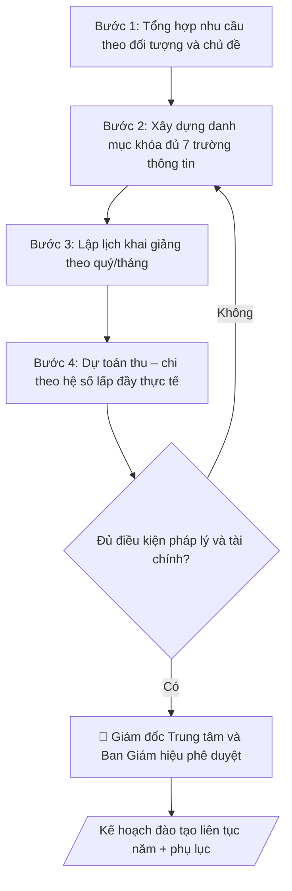

# Kế hoạch đào tạo liên tục

## Quy cách đầu ra và thông tin thiếu

Đọc [quy cách và cấu trúc sản phẩm](references/quy-cach-dau-ra.md) trước khi soạn/xuất. File giao chỉ gồm văn bản hoặc sản phẩm nghiệp vụ được yêu cầu; kiểm tra nội bộ không xuất kèm. Thiếu thông tin giữ nguyên trường/mục và chỗ điền theo mẫu gốc (dòng dấu chấm, dấu gạch hoặc ô trống); không tự điền dữ liệu mẫu, số 0, mã chờ xác minh hoặc dòng chờ ký. Mẫu chuyên ngành còn áp dụng được ưu tiên về cấu trúc, mã biểu và người ký. Các trường “bắt buộc” là điều kiện hoàn thiện hồ sơ, không ngăn việc soạn bản có chỗ chừa để điền. Mọi chỉ dẫn “để trống” trong skill được hiểu là không điền dữ liệu và giữ cách chừa chỗ của mẫu gốc, không phải xóa dấu chấm của mẫu.

## Kiểm soát áp dụng và phê duyệt

Trước khi chạy quy trình, xác định `ngay_ap_dung`, `loai_hinh_truong`, `quy_che_noi_bo`, `nguon_du_lieu` và `nguoi_kiem_duyet`. Chỉ yêu cầu thông tin có liên quan đến nghiệp vụ; không dùng giá trị giả định thay dữ liệu bắt buộc. Đối chiếu nội bộ hồ sơ có yếu tố pháp lý với văn bản gốc, hiệu lực, điều khoản áp dụng và chuyển tiếp; không tự đính kèm bảng kiểm tra vào file giao.

## Giới hạn và human gate

AI hỗ trợ chuẩn bị và đối chiếu. Cán bộ phụ trách kiểm tra dữ liệu/căn cứ, người có thẩm quyền duyệt và ký. Văn bản soạn chưa được coi là đã ban hành; không tự chèn nhãn trạng thái kiểm duyệt vào file giao; không đánh dấu đã ký, đã duyệt hoặc đã công bố nếu chưa có chứng cứ. Dữ liệu sinh viên, sức khỏe, nhân sự và tài chính phải hạn chế theo mục đích, phân quyền và che thông tin định danh khi dùng ví dụ. Không tải dữ liệu lên dịch vụ ngoài khi chưa có quyền. Kiểm tra Luật 91/2025/QH15 về bảo vệ dữ liệu cá nhân (hiệu lực 01/01/2026) và quy định áp dụng trước xử lý/chia sẻ dữ liệu cá nhân.

## Khi nào dùng
Khi Trung tâm Đào tạo liên tục / Trường bồi dưỡng cần lập kế hoạch năm: mở mới, duy trì hay
điều chỉnh các khóa đào tạo ngắn hạn, bồi dưỡng cho người đi làm, doanh nghiệp, xã hội.

## Đầu vào (Input)

| Trường | Mô tả | Bắt buộc |
|---|---|---|
| `nam_ke_hoach` | Năm kế hoạch | Có |
| `ket_qua_khao_sat` | Kết quả khảo sát nhu cầu (đối tượng, chủ đề quan tâm, số lượng dự kiến) | Có |
| `danh_muc_khoa` | Danh mục khóa học: tên khóa, thời lượng, hình thức (trực tiếp/trực tuyến), học phí dự kiến, số lớp dự kiến | Có |
| `nguon_luc` | Giảng viên, phòng học, hạ tầng hiện có | Có |
| `muc_tieu_tai_chinh` | Chỉ tiêu doanh thu / số học viên (nếu có) | Không |

## Quy trình

**Bước 1. Tổng hợp và phân nhóm nhu cầu đào tạo**
- Làm gì: đọc `ket_qua_khao_sat`; phân nhóm nhu cầu theo 3 đối tượng (cá nhân đi làm, doanh nghiệp, cơ quan nhà nước) và theo chủ đề; với mỗi nhóm, ước tính quy mô (số người quan tâm) và mức sẵn sàng chi trả (nếu khảo sát có hỏi); loại các chủ đề có nhu cầu quá nhỏ (không đủ mở 1 lớp tối thiểu) hoặc trùng lặp nhau.
- Dùng input: `ket_qua_khao_sat`.
- Vai trò: Cán bộ Trung tâm · AI hỗ trợ: phân nhóm nhu cầu theo đối tượng và chủ đề, ước tính quy mô, loại chủ đề không khả thi · ⏱ 2–3 giờ (ước tính)
- Lưu ý nghiệp vụ: phân biệt "quan tâm" với "sẵn sàng đăng ký và đóng học phí" — khảo sát thường phồng nhu cầu gấp 2–3 lần. Bẫy: doanh nghiệp "cần đào tạo" nhưng chưa có ngân sách — phải xác nhận đơn đặt hàng/hợp đồng nguyên tắc trước khi đưa vào kế hoạch.
- → Kết quả bước: bảng nhu cầu phân nhóm (đối tượng × chủ đề × quy mô ước tính × độ chắc chắn).

**Bước 2. Xây dựng danh mục khóa học**
- Làm gì: từ bảng nhu cầu ở Bước 1 và `danh_muc_khoa` (danh mục sơ bộ), chốt từng khóa với đủ 7 trường thông tin: tên khóa, mục tiêu/đối tượng, chuẩn đầu ra, thời lượng, hình thức (trực tiếp/trực tuyến/kết hợp), học phí dự kiến, số lớp dự kiến; loại hoặc gộp các khóa trùng chủ đề; đảm bảo mỗi khóa có ít nhất 1 giảng viên trong `nguon_luc` đủ năng lực phụ trách.
- Dùng input: `danh_muc_khoa`, `nguon_luc` (+ bảng nhu cầu ở Bước 1).
- Vai trò: Giảng viên · AI hỗ trợ: chốt danh mục khóa đủ 7 trường thông tin, gộp khóa trùng, đối chiếu nguồn lực giảng viên · ⏱ 2–4 giờ (ước tính)
- Lưu ý nghiệp vụ: học phí phải tính trên cơ sở chi phí cộng biên dự kiến, không đặt theo cảm tính; khóa "theo đơn đặt hàng" phải ghi rõ điều kiện mở lớp (số học viên tối thiểu theo hợp đồng). Khóa nào không có chuẩn đầu ra đo được thì không đưa vào kế hoạch.
- → Kết quả bước: danh mục khóa học chi tiết (mỗi khóa đủ 7 trường thông tin).

**Bước 3. Lập lịch khai giảng**
- Làm gì: phân bổ các lớp vào lịch quý/tháng của `nam_ke_hoach`; kiểm tra trùng lặp 2 chiều: giảng viên (1 người không dạy 2 lớp cùng khung giờ) và phòng học/lab (đối chiếu `nguon_luc`); ưu tiên xếp khóa theo đơn đặt hàng đúng tiến độ hợp đồng; lập phương án dự phòng cho lớp chưa đủ sĩ số (dời lịch thay vì hủy vội).
- Dùng input: `nam_ke_hoach`, `nguon_luc` (+ danh mục khóa ở Bước 2).
- Vai trò: Giảng viên · AI hỗ trợ: phân bổ lịch khai giảng theo quý/tháng, kiểm tra trùng giảng viên và phòng học · ⏱ 1–2 giờ (ước tính)
- Lưu ý nghiệp vụ: tránh dồn quá nhiều lớp vào cùng 1 quý (quá tải giảng viên, phòng học) — phân bổ đều nhưng ưu tiên quý có nhu cầu cao theo khảo sát. Bẫy: quên lịch nghỉ lễ/Tết khi xếp lớp cuối năm.
- → Kết quả bước: lịch khai giảng chi tiết theo quý/tháng (lớp – thời gian – giảng viên – phòng học).

**Bước 4. Dự toán thu – chi**
- Làm gì: tính thu từng khóa = học phí × số học viên dự kiến × số lớp, áp hệ số lấp đầy thực tế (70–80% sĩ số tối đa, không tính 100%); tính chi theo 5 nhóm: thù lao giảng viên, học liệu, hậu cần, marketing, quản lý; tổng hợp toàn trung tâm; đối chiếu với `muc_tieu_tai_chinh` (nếu có) — chênh lệch lớn thì quay lại điều chỉnh danh mục/lịch ở Bước 2–3.
- Dùng input: `muc_tieu_tai_chinh` (+ danh mục khóa ở Bước 2, lịch khai giảng ở Bước 3).
- Vai trò: Giảng viên · AI hỗ trợ: tính thu theo hệ số lấp đầy thực tế, tổng hợp chi theo 5 nhóm, đối chiếu mục tiêu tài chính · ⏱ 1–2 giờ (ước tính)
- Lưu ý nghiệp vụ: không lập dự toán thu trên giả định lấp đầy 100% — đây là bẫy phổ biến nhất khiến kế hoạch "lãi trên giấy". Chi phí marketing cho khóa mới phải tính đủ (thường 10–15% doanh thu khóa).
- → Kết quả bước: bảng dự toán thu – chi từng khóa và tổng hợp toàn năm.

**Bước 5. Rà soát pháp lý và điều kiện mở khóa**
- Làm gì: kiểm tra từng khóa trong danh mục: có thuộc danh mục được phép đào tạo của trung tâm không; mẫu chứng chỉ áp dụng đã được phê duyệt chưa; quy định thu – chi tài chính (mức thu, tỷ lệ trích nộp); khóa nào chưa đủ điều kiện thì chuyển sang diện "dự kiến, bổ sung sau khi hoàn thiện thủ tục", không đưa vào kế hoạch chính thức.
- Dùng input: danh mục khóa ở Bước 2.
- Vai trò: Giám đốc Trung tâm · AI hỗ trợ: tổng hợp danh mục kiểm tra, đối chiếu hồ sơ · ⏱ 2–3 ngày làm việc (ước tính)
- Lưu ý nghiệp vụ: tuyệt đối không đưa khóa chưa đủ điều kiện pháp lý vào kế hoạch chính thức — khi thanh tra, "kế hoạch đã ban hành" là căn cứ xử lý. Mẫu chứng chỉ phải khớp quy định hiện hành của Bộ/trường.
- → Kết quả bước: danh sách khóa đủ điều kiện + danh sách khóa "dự kiến bổ sung" kèm việc cần hoàn thiện.

**Bước 6. Trình duyệt và ban hành**
- Làm gì: lắp ráp văn bản kế hoạch theo cấu trúc chuẩn, kèm phụ lục (kết quả khảo sát nhu cầu, phân công chuẩn bị); trình Giám đốc Trung tâm duyệt danh mục và dự toán → Phòng Tài chính – Kế toán thẩm định dự toán → Ban Giám hiệu/Hiệu trưởng phê duyệt kế hoạch năm (human gate); ban hành và gửi các khoa, đơn vị liên quan.
- Dùng input: `nam_ke_hoach` (+ kết quả các Bước 1–5).
- Vai trò: Giám đốc Trung tâm · AI hỗ trợ: chuẩn bị dự thảo, tài liệu và số liệu phục vụ bước này · ⏱ 3–7 ngày làm việc (ước tính)
- Lưu ý nghiệp vụ: sau ban hành, mọi điều chỉnh (thêm khóa, đổi học phí) phải làm văn bản điều chỉnh kế hoạch, không tự ý sửa. Giữ số hiệu văn bản liên tục.
- → Kết quả bước: quyết định ban hành + kế hoạch đào tạo liên tục năm đã phê duyệt.

## Luồng quy trình (Workflow)

## Đầu ra

Sản phẩm nghiệp vụ hoàn chỉnh theo [quy cách và cấu trúc](references/quy-cach-dau-ra.md), giữ các trường chưa có dữ liệu ở trạng thái trống. Không xuất kèm checklist/phụ lục kiểm tra đầu ra.

## Kiểm tra nội bộ trước khi giao

- [ ] Bố cục khớp mẫu áp dụng và cấu trúc tại references/quy-cach-dau-ra.md.
- [ ] Nội dung khớp với Input: năm kế hoạch, kết quả khảo sát nhu cầu, danh mục khóa, nguồn lực, mục tiêu tài chính.
- [ ] Không bịa đặt số liệu, minh chứng, trích dẫn.
- [ ] Bảng danh mục mỗi khóa đủ 7 trường thông tin: tên khóa, mục tiêu/đối tượng, chuẩn đầu ra, thời lượng, hình thức, học phí dự kiến, số lớp dự kiến.
- [ ] Căn cứ pháp lý đầy đủ, còn hiệu lực (quy định đào tạo liên tục, bồi dưỡng ngắn hạn của Bộ GD&ĐT; quy chế nội bộ của trường).
- [ ] Đã qua Human gate: Giám đốc Trung tâm duyệt danh mục và dự toán; Phòng TCKT thẩm định dự toán; Ban Giám hiệu phê duyệt kế hoạch năm.
- [ ] Mọi khóa trong kế hoạch chính thức đều đủ điều kiện pháp lý (danh mục được phép, mẫu chứng chỉ đã phê duyệt); khóa chưa đủ điều kiện chuyển sang diện "dự kiến bổ sung".
- [ ] Dự toán thu tính theo hệ số lấp đầy 70–80% (không giả định 100%); chi phí marketing khóa mới tính đủ.
- [ ] Không có khóa trùng chủ đề chưa gộp; khóa theo đơn đặt hàng ghi rõ điều kiện mở lớp (số học viên tối thiểu theo hợp đồng).

Tiêu chí đạt = tất cả các ô được đánh dấu.

## Human gate
- Giám đốc Trung tâm duyệt danh mục khóa và dự toán; Ban Giám hiệu/Hiệu trưởng phê duyệt kế hoạch năm.
- Phòng Tài chính – Kế toán thẩm định dự toán thu chi.

## Giới hạn
- Không cam kết chất lượng đầu ra vượt quá chuẩn đã phê duyệt; không quảng cáo sai sự thật về khóa học.
- Không thu học phí ngoài mức đã công bố; mọi điều chỉnh học phí phải được phê duyệt lại.
- Không mở khóa đào tạo ngoài danh mục khi chưa bổ sung kế hoạch.

## Căn cứ & lưu ý
- Quy định về đào tạo liên tục, bồi dưỡng ngắn hạn của Bộ GD&ĐT và quy chế nội bộ của trường.
- Không dùng tên thật của trường/cá nhân khi mô phỏng.

## Quản trị phiên bản

- Phiên bản gói: `1.2.1`; ngày cập nhật: `2026-10-10`.
- Kho nguồn: https://github.com/phamtruong91/university-skills-framework
- Người duy trì trên GitHub: `phamtruong91` (Phạm Văn Trường). Người phê duyệt nghiệp vụ: **chưa chỉ định**.
- Commit nguồn trước cập nhật: `346719e6b0318ed034b4b016703f79733aa575e7`. Commit chứa phiên bản này xem bằng `git log -1 -- skills/ke-hoach-dao-tao-lien-tuc`; không tự gán SHA chưa tạo.
- Giấy phép: theo LICENSE của kho; bản quyền CES Global.
- Lịch sử 1.1.0: bổ sung metadata giao diện, kiểm soát áp dụng, quản trị phiên bản.
- Trạng thái: dự thảo nghiệp vụ; kiểm tra pháp lý trước thực thi. Ngày cập nhật không đồng nghĩa mọi văn bản đã được rà soát toàn văn.
