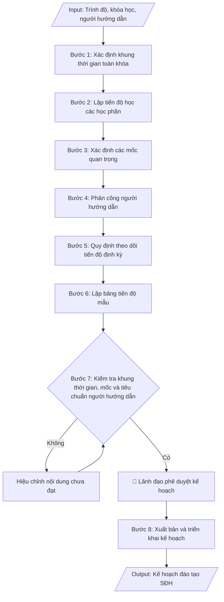

# Skill: Kế hoạch đào tạo sau đại học (tiến độ học viên/NCS)

## Khi nào dùng
Khi cần lập kế hoạch đào tạo và theo dõi tiến độ cho một khóa/lớp cao học hoặc một
nghiên cứu sinh: xác định khung thời gian toàn khóa, các mốc quan trọng, phân công người
hướng dẫn và lịch kiểm tra tiến độ định kỳ.

## Đầu vào (Input)

| Trường | Mô tả | Bắt buộc |
|---|---|---|
| `trinh_do` | Thạc sĩ / Tiến sĩ | Có |
| `khoa_lop` | Khóa/lớp cao học hoặc tên NCS và khóa đào tạo | Có |
| `nganh` | Ngành đào tạo | Có |
| `thoi_gian_bat_dau` | Thời điểm bắt đầu khóa đào tạo | Có |
| `thoi_gian_dao_tao` | Thời gian đào tạo chuẩn (thạc sĩ 2 năm; tiến sĩ 3–4 năm) | Có |
| `nguoi_huong_dan` | Người hướng dẫn khoa học (đủ tiêu chuẩn theo quy chế) | Có |
| `hoc_phan` | Danh mục học phần và học kỳ dự kiến hoàn thành | Không |
| `moc_quan_trong` | Các mốc: bảo vệ đề cương, seminar chuyên đề, bảo vệ luận văn/luận án | Không |
| `chu_ky_bao_cao` | Chu kỳ báo cáo tiến độ (6 tháng / hằng năm) | Không (mặc định: 6 tháng) |

## Quy trình

**Bước 1. Xác định khung thời gian toàn khóa**
- Làm gì: xác định thời điểm bắt đầu (ngày nhập học) và thời điểm kết thúc dự kiến (bảo vệ luận
  văn/luận án); đối chiếu tổng thời gian với thời gian đào tạo chuẩn theo quy chế (thạc sĩ 2 năm;
  tiến sĩ 3–4 năm tùy đối tượng đầu vào).
- Dùng input: `trinh_do`, `khoa_lop`, `thoi_gian_bat_dau`, `thoi_gian_dao_tao`
- Vai trò: Chuyên viên Phòng Sau đại học · AI hỗ trợ: xác định khung thời gian toàn khóa từ ngày nhập học · ⏱ ~30 phút (ước tính)
- Lưu ý nghiệp vụ: khung thời gian phải nằm trong giới hạn tối đa của quy chế (kể cả thời gian
  được gia hạn); ghi rõ hình thức đào tạo (tập trung/không tập trung).
- → Kết quả bước: khung thời gian toàn khóa đã chốt (ngày bắt đầu – ngày kết thúc dự kiến).

**Bước 2. Lập tiến độ học các học phần**
- Làm gì: phân bổ các học phần bắt buộc và tự chọn vào từng học kỳ; ghi rõ học phần nào là điều
  kiện tiên quyết của học phần sau (nếu có); sắp xếp sao cho học viên hoàn thành học phần trước
  khi bước vào giai đoạn làm luận văn/luận án.
- Dùng input: `hoc_phan`, `trinh_do`
- Vai trò: Khoa quản lý chuyên ngành/Chuyên viên Phòng Sau đại học · AI hỗ trợ: phân bổ học phần bắt buộc và tự chọn vào từng học kỳ · ⏱ ~1 giờ (ước tính)
- Lưu ý nghiệp vụ: học phần phương pháp nghiên cứu khoa học nên xếp sớm để phục vụ làm đề cương;
  tránh dồn quá nhiều học phần vào một học kỳ.
- → Kết quả bước: bảng phân bổ học phần theo từng học kỳ (học kỳ – thời gian – danh mục học phần).

**Bước 3. Xác định các mốc quan trọng**
- Làm gì: liệt kê đầy đủ các mốc theo trình độ, gắn thời hạn dự kiến cho từng mốc:
  - Học viên cao học: hoàn thành học phần → giao đề tài → bảo vệ đề cương luận văn → seminar
    giữa kỳ → nộp luận văn hoàn chỉnh → bảo vệ luận văn;
  - Nghiên cứu sinh: hoàn thành học phần tiến sĩ → bảo vệ đề cương luận án → thực hiện chuyên đề
    tiến sĩ/seminar → công bố khoa học theo quy định → viết luận án → bảo vệ luận án cấp cơ sở →
    bảo vệ luận án cấp trường.
- Dùng input: `moc_quan_trong`, `trinh_do`
- Vai trò: Chuyên viên Phòng Sau đại học · AI hỗ trợ: liệt kê các mốc (báo cáo tiến độ, bảo vệ) theo trình độ · ⏱ ~30 phút (ước tính)
- Lưu ý nghiệp vụ: các mốc phải sắp xếp logic, không chồng chéo thời gian; mốc bảo vệ luận án cấp
  trường của NCS phải sau bảo vệ cấp cơ sở và sau khi hoàn thành công bố khoa học.
- → Kết quả bước: bảng các mốc quan trọng (mốc công việc – thời hạn dự kiến) theo trình độ.

**Bước 4. Phân công người hướng dẫn**
- Làm gì: ghi rõ họ tên, học hàm/học vị, đơn vị công tác của người hướng dẫn chính (và đồng hướng
  dẫn nếu có) cho từng học viên/NCS; kiểm tra người hướng dẫn đủ tiêu chuẩn theo quy chế và không
  vượt số lượng học viên/NCS được hướng dẫn đồng thời.
- Dùng input: `nguoi_huong_dan`, `khoa_lop`
- Vai trò: Phòng Sau đại học · AI hỗ trợ: lập danh sách đề xuất người hướng dẫn, kiểm tra tiêu chuẩn và giới hạn số HV/NCS hướng dẫn · ⏱ ~1 giờ (ước tính)
- Lưu ý nghiệp vụ: người hướng dẫn tiến sĩ phải đáp ứng tiêu chuẩn cao hơn (có công trình công bố,
  đã hướng dẫn thành công); kiểm tra số lượng đang hướng dẫn tại thời điểm phân công, không chỉ
  dựa vào khai báo.
- → Kết quả bước: danh sách phân công người hướng dẫn (học viên/NCS – người hướng dẫn –
  số lượng đang hướng dẫn).

**Bước 5. Quy định theo dõi tiến độ định kỳ**
- Làm gì: quy định chu kỳ báo cáo tiến độ (mặc định 6 tháng); quy định trách nhiệm: học viên/NCS
  nộp báo cáo theo mẫu, người hướng dẫn nhận xét và đánh giá, Phòng Đào tạo SĐH tổng hợp;
  quy định cơ chế cảnh báo các trường hợp chậm tiến độ và biện pháp xử lý (gia hạn, cảnh báo
  học vụ, thôi học theo quy chế).
- Dùng input: `chu_ky_bao_cao`
- Vai trò: Phòng Sau đại học · AI hỗ trợ: soạn dự thảo quy định chu kỳ báo cáo tiến độ và trách nhiệm các bên · ⏱ ~1 giờ (ước tính)
- Lưu ý nghiệp vụ: phải quy định rõ "chậm tiến độ" được đo bằng tiêu chí nào (chậm bao nhiêu mốc/
  bao lâu); biện pháp xử lý phải có căn cứ quy chế, không xử lý cảm tính.
- → Kết quả bước: quy định theo dõi tiến độ định kỳ (chu kỳ, trách nhiệm các bên, cơ chế cảnh báo
  và xử lý).

**Bước 6. Lập bảng tiến độ mẫu**
- Làm gì: lập bảng theo dõi với các cột: họ tên học viên/NCS – đề tài – người hướng dẫn –
  từng mốc công việc (hoàn thành học phần, bảo vệ đề cương, seminar, nộp luận văn/luận án,
  bảo vệ) – ghi chú; bảng này được cập nhật sau mỗi kỳ báo cáo.
- Dùng input: `khoa_lop`, `nguoi_huong_dan`
- Vai trò: Chuyên viên Phòng Sau đại học · AI hỗ trợ: lập bảng theo dõi tiến độ mẫu đầy đủ các cột · ⏱ ~20 phút (ước tính)
- Lưu ý nghiệp vụ: bảng phải bao phủ đầy đủ 100% học viên/NCS của khóa; các mốc trong bảng phải
  khớp với bảng mốc ở Bước 3.
- → Kết quả bước: bảng theo dõi tiến độ mẫu (sẵn sàng điền và cập nhật định kỳ).

**Bước 7. Kiểm tra khung thời gian, mốc và tiêu chuẩn người hướng dẫn**
- Làm gì: kiểm tra lần cuối: khung thời gian toàn khóa đúng thời gian đào tạo chuẩn theo quy chế;
  các mốc quan trọng đầy đủ, logic, không chồng chéo; người hướng dẫn đủ tiêu chuẩn và trong giới
  hạn số lượng; bảng tiến độ đầy đủ học viên/NCS. Nội dung chưa đạt thì hiệu chỉnh rồi kiểm tra lại.
- Dùng input: `thoi_gian_dao_tao`, `nguoi_huong_dan`, `moc_quan_trong`
- Vai trò: Trưởng phòng Sau đại học · AI hỗ trợ: kiểm tra chéo khung thời gian, học phần và quy chế · ⏱ ~1 giờ (ước tính)
- Lưu ý nghiệp vụ: đây là điểm kiểm tra cuối trước khi trình duyệt — lỗi mốc chồng chéo hoặc người
  hướng dẫn quá tải nếu lọt qua sẽ gây khó khăn cho cả khóa đào tạo.
- → Kết quả bước: kế hoạch đã qua kiểm tra, đạt yêu cầu, sẵn sàng trình phê duyệt.

**Bước 8. Xuất bản và triển khai kế hoạch**
- Làm gì: hoàn thiện kế hoạch ở định dạng markdown kèm bảng tiến độ mẫu; trình lãnh đạo phê duyệt;
  sau khi duyệt, gửi kế hoạch đến lớp/khóa, người hướng dẫn và các đơn vị liên quan để triển khai.
- Dùng input: `khoa_lop`, `nganh`
- Vai trò: Hiệu trưởng/Phó Hiệu trưởng phụ trách phê duyệt · AI hỗ trợ: chuẩn bị hồ sơ trình ký, soạn thông báo triển khai · ⏱ ~1 giờ (ước tính)
- Lưu ý nghiệp vụ: lưu bản kế hoạch đã phê duyệt làm căn cứ đối chiếu tiến độ các kỳ sau; mọi điều
  chỉnh kế hoạch sau phê duyệt phải được ghi nhận bằng văn bản.
- → Kết quả bước: kế hoạch đào tạo SĐH đã phê duyệt, đã gửi các bên liên quan để triển khai.

## Luồng quy trình (Workflow)


## Đầu ra (Output)
- Kế hoạch đào tạo SĐH hoàn chỉnh (khung thời gian, các mốc, phân công hướng dẫn,
  cơ chế theo dõi).
- Bảng tiến độ mẫu để cập nhật định kỳ.

**Cấu trúc output chuẩn:** khung mẫu cố định của kế hoạch đào tạo sau đại học, các phần theo đúng thứ tự:
1. Phần đầu văn bản: tên trường + đơn vị (Phòng Đào tạo Sau đại học); quốc hiệu – tiêu ngữ;
   số, ký hiệu; địa danh, ngày tháng năm ban hành.
2. Tên kế hoạch + đối tượng áp dụng (khóa/lớp cao học hoặc NCS, ngành, thời gian đào tạo).
3. Phần căn cứ: Quy chế tuyển sinh và đào tạo trình độ thạc sĩ (TT 23/2021) / tiến sĩ (TT 18/2021).
4. Nội dung chính theo thứ tự: I. Khung thời gian toàn khóa; II. Tiến độ học các học phần
   (bảng theo học kỳ); III. Các mốc quan trọng (bảng mốc công việc – thời hạn dự kiến);
   IV. Phân công người hướng dẫn; V. Theo dõi tiến độ định kỳ (chu kỳ, trách nhiệm, cơ chế
   cảnh báo); VI. Bảng theo dõi tiến độ (mẫu).
5. Phần cuối: nơi nhận; chữ ký, họ tên người ký.


## Checklist nghiệm thu
- [ ] Đủ các phần theo "Cấu trúc output chuẩn": phần đầu văn bản; tên kế hoạch + đối tượng áp dụng; phần căn cứ (TT 23/2021 / TT 18/2021); nội dung I–VI (khung thời gian; tiến độ học phần; các mốc quan trọng; phân công hướng dẫn; theo dõi tiến độ định kỳ; bảng theo dõi mẫu); nơi nhận, chữ ký.
- [ ] Số liệu/nội dung trong output khớp với Input đã cho (trình độ, khóa/lớp, ngành, thời gian, người hướng dẫn, học phần, các mốc, chu kỳ báo cáo).
- [ ] Không bịa đặt số liệu, minh chứng, trích dẫn.
- [ ] Đúng thể thức văn bản hành chính của kế hoạch.
- [ ] Căn cứ pháp lý đầy đủ, còn hiệu lực (Thông tư 23/2021/TT-BGDĐT đối với thạc sĩ; Thông tư 18/2021/TT-BGDĐT đối với tiến sĩ).
- [ ] Đã qua Human gate: lãnh đạo đã phê duyệt kế hoạch; bản đã phê duyệt được lưu làm căn cứ đối chiếu tiến độ.
- [ ] Khung thời gian toàn khóa nằm trong giới hạn tối đa của quy chế (kể cả thời gian được gia hạn); các mốc sắp xếp logic, không chồng chéo.
- [ ] Mốc bảo vệ luận án cấp trường sau bảo vệ cấp cơ sở và sau khi hoàn thành công bố khoa học (đối với NCS); các mốc trong bảng tiến độ khớp bảng mốc ở mục III.
- [ ] Người hướng dẫn đủ tiêu chuẩn quy chế và không vượt số lượng HV/NCS được hướng dẫn đồng thời; bảng tiến độ bao phủ 100% học viên/NCS của khóa; "chậm tiến độ" có tiêu chí đo cụ thể, biện pháp xử lý có căn cứ quy chế.
Tiêu chí đạt = tất cả các ô được đánh dấu.

## Ví dụ mô phỏng (dữ liệu giả lập)

> Tất cả tên trường, cá nhân, số liệu dưới đây đều là **giả lập**, không liên quan tổ chức/cá nhân có thật.

### Input mẫu

| Trường | Giá trị |
|---|---|
| `trinh_do` | Thạc sĩ |
| `khoa_lop` | Lớp Cao học Quản trị kinh doanh K12 (2026 – 2028) |
| `nganh` | Quản trị kinh doanh |
| `thoi_gian_bat_dau` | 15/6/2026 |
| `thoi_gian_dao_tao` | 2 năm |
| `nguoi_huong_dan` | TS. Trần Văn D (Trưởng phòng Đào tạo SĐH) – hướng dẫn 05 học viên |
| `hoc_phan` | HK1: Quản trị học nâng cao, Kinh tế học quản lý; HK2: Quản trị marketing, Quản trị tài chính, Phương pháp nghiên cứu khoa học; HK3: 02 học phần tự chọn |
| `chu_ky_bao_cao` | 6 tháng |

### Output mẫu

```
TRƯỜNG ĐẠI HỌC A            CỘNG HÒA XÃ HỘI CHỦ NGHĨA VIỆT NAM
PHÒNG ĐÀO TẠO SAU ĐẠI HỌC                    Độc lập – Tự do – Hạnh phúc
      Số: 40/KH-ĐHA-SĐH
                                                 Thành phố C, ngày 20 tháng 6 năm 2026

              KẾ HOẠCH ĐÀO TẠO SAU ĐẠI HỌC
     Lớp Cao học Quản trị kinh doanh K12 (2026 – 2028)

Căn cứ Quy chế tuyển sinh và đào tạo trình độ thạc sĩ ban hành kèm theo Thông tư
số 23/2021/TT-BGDĐT của Bộ trưởng Bộ Giáo dục và Đào tạo,
Phòng Đào tạo Sau đại học xây dựng kế hoạch đào tạo lớp Cao học Quản trị kinh
doanh K12 như sau:

I. KHUNG THỜI GIAN TOÀN KHÓA
- Thời gian đào tạo: 02 năm (từ 15/6/2026 đến 15/6/2028).
- Hình thức đào tạo: tập trung theo học kỳ.

II. TIẾN ĐỘ HỌC CÁC HỌC PHẦN

| Học kỳ | Thời gian       | Học phần |
|--------|-----------------|----------|
| HK1    | 6 – 12/2026     | Quản trị học nâng cao; Kinh tế học quản lý |
| HK2    | 1 – 6/2027      | Quản trị marketing; Quản trị tài chính; Phương pháp nghiên cứu khoa học |
| HK3    | 7 – 12/2027     | 02 học phần tự chọn; giao đề tài và bảo vệ đề cương luận văn |

III. CÁC MỐC QUAN TRỌNG

| TT | Mốc công việc                  | Thời hạn dự kiến |
|----|--------------------------------|------------------|
| 1  | Hoàn thành các học phần        | 12/2027          |
| 2  | Giao đề tài luận văn           | 01/2028          |
| 3  | Bảo vệ đề cương luận văn       | 03/2028          |
| 4  | Seminar giữa kỳ (báo cáo tiến độ) | 04/2028       |
| 5  | Nộp luận văn hoàn chỉnh        | 05/2028          |
| 6  | Bảo vệ luận văn thạc sĩ        | 06/2028          |

IV. PHÂN CÔNG NGƯỜI HƯỚNG DẪN
- Người hướng dẫn: TS. Trần Văn D – Trưởng phòng Đào tạo Sau đại học.
- Số học viên hướng dẫn: 05 học viên (trong giới hạn quy định).
- Trách nhiệm: hướng dẫn học viên thực hiện đề cương, luận văn; nhận xét tiến
  độ định kỳ 6 tháng/lần.

V. THEO DÕI TIẾN ĐỘ ĐỊNH KỲ
- Học viên báo cáo tiến độ 6 tháng/lần (tháng 12 và tháng 6 hằng năm) theo mẫu
  của Phòng Đào tạo SĐH.
- Người hướng dẫn nhận xét, đánh giá mức độ hoàn thành.
- Phòng Đào tạo SĐH tổng hợp, cảnh báo các trường hợp chậm tiến độ quá 01 học
  kỳ và đề xuất biện pháp xử lý theo quy chế (gia hạn, cảnh báo học vụ).

VI. BẢNG THEO DÕI TIẾN ĐỘ (mẫu)

| TT | Họ tên học viên | Đề tài luận văn | Người hướng dẫn | Hoàn thành HP | Bảo vệ đề cương | Seminar | Nộp luận văn | Bảo vệ | Ghi chú |
|----|-----------------|-----------------|-----------------|---------------|-----------------|---------|--------------|--------|---------|
| 1  | Nguyễn Văn A    | ...             | TS. Trần Văn D| ☐             | ☐               | ☐       | ☐            | ☐      |         |
| 2  | Trần Thị B      | ...             | TS. Trần Văn D| ☐             | ☐               | ☐       | ☐            | ☐      |         |
| 3  | Phạm Văn C      | ...             | TS. Trần Văn D| ☐             | ☐               | ☐       | ☐            | ☐      |         |
| 4  | Lê Thị D        | ...             | TS. Trần Văn D| ☐             | ☐               | ☐       | ☐            | ☐      |         |
| 5  | Hoàng Văn E     | ...             | TS. Trần Văn D| ☐             | ☐               | ☐       | ☐            | ☐      |         |

Nơi nhận:                                        TRƯỞNG PHÒNG ĐÀO TẠO SĐH
- Lớp CH QTKD K12;
- Người hướng dẫn;                                        (đã ký)
- Lưu: VT, SĐH.
                                                     TS. Trần Văn D
```

### Checklist kiểm tra (output kèm theo)
- [x] Khung thời gian toàn khóa đúng thời gian đào tạo chuẩn theo quy chế
- [x] Học phần phân bổ hợp lý theo từng học kỳ
- [x] Các mốc quan trọng đầy đủ, logic, không chồng chéo
- [x] Người hướng dẫn đủ tiêu chuẩn, trong giới hạn số lượng hướng dẫn
- [x] Cơ chế báo cáo tiến độ định kỳ rõ ràng
- [x] Bảng theo dõi tiến độ đầy đủ học viên/NCS của khóa

## Căn cứ & lưu ý
- Thông tư 23/2021/TT-BGDĐT (Quy chế tuyển sinh và đào tạo trình độ thạc sĩ).
- Thông tư 18/2021/TT-BGDĐT (Quy chế tuyển sinh và đào tạo trình độ tiến sĩ).
- Đối với nghiên cứu sinh, bổ sung các mốc: bảo vệ đề cương luận án, thực hiện
  chuyên đề tiến sĩ, công bố khoa học theo quy định, bảo vệ luận án cấp cơ sở và
  cấp trường.
- Người hướng dẫn phải đáp ứng tiêu chuẩn theo quy chế và không vượt quá số
  lượng học viên/nghiên cứu sinh được hướng dẫn đồng thời.
- Không dùng tên thật của trường/cá nhân khi mô phỏng.
