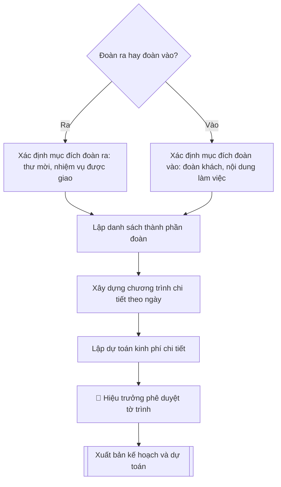

# Kế hoạch đoàn ra / đoàn vào

## Định dạng và file đầu ra

Định dạng đầu ra có thể chọn theo sản phẩm/yêu cầu: .docx, .pdf. Đọc mục “Định dạng bổ sung” trong quy cách đầu ra trước khi chọn.

**Phải tạo file thực tế để tải xuống, không chỉ trả nội dung trong chat.** Định dạng mặc định của skill: **.docx**. Nếu có bảng số liệu nghiệp vụ yêu cầu file bảng tính riêng, tạo thêm Excel theo yêu cầu; không tự tạo file kiểm tra. Không chờ người dùng yêu cầu xuất file lần nữa. Ưu tiên định dạng người dùng chỉ định; đọc quy tắc xuất file tại references/quy-cach-dau-ra.md.

## Quy cách đầu ra và thông tin thiếu

Đọc [quy cách và cấu trúc sản phẩm](references/quy-cach-dau-ra.md) trước khi soạn/xuất. File giao chỉ gồm văn bản hoặc sản phẩm nghiệp vụ được yêu cầu; kiểm tra nội bộ không xuất kèm. Thiếu thông tin giữ nguyên trường/mục và chỗ điền theo mẫu gốc (dòng dấu chấm, dấu gạch hoặc ô trống); không tự điền dữ liệu mẫu, số 0, mã chờ xác minh hoặc dòng chờ ký. Mẫu chuyên ngành còn áp dụng được ưu tiên về cấu trúc, mã biểu và người ký. Các trường “bắt buộc” là điều kiện hoàn thiện hồ sơ, không ngăn việc soạn bản có chỗ chừa để điền. Mọi chỉ dẫn “để trống” trong skill được hiểu là không điền dữ liệu và giữ cách chừa chỗ của mẫu gốc, không phải xóa dấu chấm của mẫu.

## Kiểm soát áp dụng và phê duyệt

Trước khi chạy quy trình, xác định `ngay_ap_dung`, `loai_hinh_truong`, `quy_che_noi_bo`, `nguon_du_lieu` và `nguoi_kiem_duyet`. Chỉ yêu cầu thông tin có liên quan đến nghiệp vụ; không dùng giá trị giả định thay dữ liệu bắt buộc. Đối chiếu nội bộ hồ sơ có yếu tố pháp lý với văn bản gốc, hiệu lực, điều khoản áp dụng và chuyển tiếp; không tự đính kèm bảng kiểm tra vào file giao.

## Giới hạn và human gate

AI hỗ trợ chuẩn bị và đối chiếu. Cán bộ phụ trách kiểm tra dữ liệu/căn cứ, người có thẩm quyền duyệt và ký. Văn bản soạn chưa được coi là đã ban hành; không tự chèn nhãn trạng thái kiểm duyệt vào file giao; không đánh dấu đã ký, đã duyệt hoặc đã công bố nếu chưa có chứng cứ. Dữ liệu sinh viên, sức khỏe, nhân sự và tài chính phải hạn chế theo mục đích, phân quyền và che thông tin định danh khi dùng ví dụ. Không tải dữ liệu lên dịch vụ ngoài khi chưa có quyền. Kiểm tra Luật 91/2025/QH15 về bảo vệ dữ liệu cá nhân (hiệu lực 01/01/2026) và quy định áp dụng trước xử lý/chia sẻ dữ liệu cá nhân.

## Khi nào dùng
Khi cần lập kế hoạch cho **đoàn ra** (cán bộ, giảng viên của Trường đi công tác, học tập,
dự hội nghị ở nước ngoài) hoặc **đoàn vào** (đón tiếp đoàn đối tác, chuyên gia quốc tế
đến thăm và làm việc tại Trường), phục vụ trình duyệt, xin chủ trương và dự toán kinh phí.

## Đầu vào (Input)

| Trường | Mô tả | Bắt buộc |
|---|---|---|
| `loai_doan` | Đoàn ra / Đoàn vào | Có |
| `muc_dich` | Mục đích chuyến đi / chuyến thăm (ký MOU, dự hội thảo, khảo sát, làm việc...) | Có |
| `doi_tac` | Tên đối tác, quốc gia (đoàn ra: nơi đến; đoàn vào: đoàn khách) | Có |
| `thoi_gian` | Thời gian dự kiến (ngày đi – ngày về / ngày đón – ngày tiễn) | Có |
| `thanh_phan` | Danh sách thành viên: họ tên, chức danh, đơn vị, vai trò trong đoàn | Có |
| `chuong_trinh` | Chương trình chi tiết theo từng ngày: thời gian, nội dung, địa điểm, người phụ trách | Có |
| `nguon_kinh_phi` | Nguồn kinh phí: ngân sách trường / đối tác tài trợ / đề tài / cá nhân tự túc | Có |
| `don_vi_dau_moi` | Đơn vị đầu mối tổ chức (thường là Phòng KHCN&HTQT phối hợp đơn vị liên quan) | Không |

## Quy trình

**Bước 1. Xác định loại đoàn và mục đích**
- Làm gì: căn cứ `loai_doan` để chốt hướng soạn: đoàn ra phải nêu rõ yêu cầu của phía mời (thư mời chính thức) hoặc nhiệm vụ được giao; đoàn vào phải nêu rõ thành phần đoàn khách và nội dung làm việc đề xuất; ghi rõ `muc_dich` và thông tin `doi_tac` (tên đối tác, quốc gia).
- Dùng input: `loai_doan`, `muc_dich`, `doi_tac`.
- Vai trò: Chuyên viên Phòng KHCN và HTQT · AI hỗ trợ: soạn · ⏱ ~20–30 phút (ước tính)
- Lưu ý nghiệp vụ: đoàn ra đi nước ngoài bắt buộc phải có thư mời chính thức của đối tác — thiếu thư mời thì kế hoạch không đủ căn cứ trình; đoàn vào phải xác nhận lại số lượng và thành phần đoàn khách với đối tác trước khi lập chương trình.
- → Kết quả bước: tờ xác định loại đoàn (thư mời/nhiệm vụ được giao đối với đoàn ra; thành phần đoàn khách + nội dung làm việc đối với đoàn vào).

**Bước 2. Lập danh sách thành phần**
- Làm gì: lập danh sách đầy đủ họ tên, chức danh, đơn vị, vai trò trong đoàn: đoàn ra ghi rõ trưởng đoàn, từng thành viên và nhiệm vụ của từng người; đoàn vào ghi rõ đầu mối đón tiếp phía Trường tương ứng với từng thành viên đoàn khách.
- Dùng input: `thanh_phan`, `loai_doan`.
- Vai trò: Chuyên viên Phòng KHCN và HTQT · AI hỗ trợ: lập danh sách · ⏱ ~30–45 phút (ước tính)
- Lưu ý nghiệp vụ: trưởng đoàn ra phải là người có thẩm quyền quyết định nội dung làm việc; đoàn vào phải bố trí phiên dịch đi cùng suốt chương trình nếu đoàn khách không dùng tiếng Việt.
- → Kết quả bước: danh sách thành phần đoàn (họ tên – chức danh – đơn vị – vai trò/nhiệm vụ).

**Bước 3. Xây dựng chương trình chi tiết theo ngày**
- Làm gì: xếp lịch từng ngày trong `thoi_gian`: mỗi ngày liệt kê giờ giấc, nội dung (làm việc, tham quan, hội đàm, ký kết...), địa điểm, người phụ trách; đoàn vào bổ sung phương án đón/tiễn sân bay, bố trí ăn ở, phiên dịch.
- Dùng input: `chuong_trinh`, `thoi_gian`, `doi_tac`.
- Vai trò: Trưởng Phòng KHCN và HTQT · AI hỗ trợ: xếp chương trình theo ngày · ⏱ ~1–2 giờ (ước tính)
- Lưu ý nghiệp vụ: giờ bay đến/đi của đoàn vào phải khớp với phương án đón/tiễn; không xếp lịch làm việc dày đặc ngay sau chuyến bay dài; mỗi buổi làm việc chính thức cần có người chủ trì phía Trường được chỉ định rõ.
- → Kết quả bước: bảng chương trình chi tiết theo ngày (ngày – giờ – nội dung – địa điểm – người phụ trách).

**Bước 4. Lập dự toán kinh phí chi tiết**
- Làm gì: liệt kê từng khoản chi (vé máy bay, visa, khách sạn, ăn uống, đi lại nội địa, lệ phí hội nghị, quà tặng đối ngoại, phiên dịch, in ấn khánh tiết...) kèm số lượng, đơn giá, thành tiền; ghi rõ `nguon_kinh_phi` và cơ chế thanh quyết toán.
- Dùng input: `nguon_kinh_phi`, `thanh_phan`, `thoi_gian`.
- Vai trò: Chuyên viên Phòng KHCN và HTQT · AI hỗ trợ: lập bảng dự toán · ⏱ ~1–2 giờ (ước tính)
- Lưu ý nghiệp vụ: đơn giá phải theo khung quy định chi tiêu nội bộ (khách sạn, công tác phí); tổng dự toán không được vượt nguồn đã khai; đoàn vào phải tính đủ chi phí đón tiếp phát sinh (xe, tiệc chiêu đãi, quà tặng).
- → Kết quả bước: bảng dự toán kinh phí (khoản mục – số lượng – đơn giá – thành tiền – nguồn kinh phí).

**Bước 5. Hoàn thiện tờ trình xin chủ trương**
- Làm gì: đặt toàn bộ kết quả các Bước 1–4 vào thể thức tờ trình: tiêu đề cơ quan, tên tờ trình, trích yếu, kính gửi Hiệu trưởng, căn cứ (thư mời/MOU/quy chế), các mục Mục đích – Thành phần – Thời gian – Chương trình – Dự toán – Kiến nghị; ghi rõ `don_vi_dau_moi` chịu trách nhiệm triển khai.
- Dùng input: `don_vi_dau_moi`, kết quả các Bước 1–4.
- Vai trò: Chuyên viên Phòng KHCN và HTQT · AI hỗ trợ: ráp thể thức tờ trình · ⏱ ~45–60 phút (ước tính)
- Lưu ý nghiệp vụ: số liệu trong tờ trình (số người, số ngày, tổng kinh phí) phải khớp tuyệt đối với bảng chương trình và bảng dự toán — đây là lỗi bị trả về nhiều nhất.
- → Kết quả bước: dự thảo tờ trình kế hoạch đoàn hoàn chỉnh.

**Bước 6. Trình phê duyệt và xuất bản**
- Làm gì: trình Hiệu trưởng phê duyệt tờ trình; sau khi duyệt, xuất bản kế hoạch + dự toán hoàn chỉnh và chuyển cho các đơn vị phối hợp thực hiện.
- Dùng input: toàn bộ input (đối chiếu chéo).
- Vai trò: Hiệu trưởng · AI hỗ trợ: chuẩn bị hồ sơ trình ký, nhắc lịch và theo dõi tiến độ · ⏱ ~1–3 ngày làm việc (ước tính)
- Lưu ý nghiệp vụ: đoàn ra chỉ được triển khai sau khi có quyết định cử đi công tác của Hiệu trưởng; giữ lại 01 bộ hồ sơ đã duyệt tại đơn vị đầu mối để thanh quyết toán.
- → Kết quả bước: tờ trình đã phê duyệt + kế hoạch và dự toán hoàn chỉnh, sẵn sàng trình ký và chuyển các đơn vị phối hợp.

## Luồng quy trình (Workflow)

## Đầu ra

File nghiệp vụ thực tế theo định dạng mặc định ở đầu skill hoặc định dạng người dùng yêu cầu, kèm liên kết tải trong phản hồi cuối.

Sản phẩm nghiệp vụ hoàn chỉnh theo [quy cách và cấu trúc](references/quy-cach-dau-ra.md), giữ các trường chưa có dữ liệu ở trạng thái trống. Không xuất kèm checklist/phụ lục kiểm tra đầu ra.

## Kiểm tra nội bộ trước khi giao
- [ ] Bố cục khớp mẫu áp dụng và cấu trúc tại references/quy-cach-dau-ra.md.
- [ ] Số liệu khớp với Input: số người, số ngày, thời gian, địa điểm, tổng kinh phí, nguồn kinh phí.
- [ ] Không bịa đặt số liệu, đơn giá, thông tin đối tác, thành viên đoàn.
- [ ] Đúng thể thức tờ trình hành chính; bảng dự toán đủ cột (khoản mục – số lượng – đơn giá – thành tiền – nguồn).
- [ ] Căn cứ pháp lý đầy đủ, còn hiệu lực: quy chế quản lý đoàn ra/đoàn vào, quy chế chi tiêu nội bộ của Trường.
- [ ] Đã qua Human gate: Hiệu trưởng phê duyệt; đoàn ra có quyết định cử đi công tác.
- [ ] Đoàn ra có thư mời chính thức của đối tác; đoàn vào có phương án đón/tiễn khớp giờ bay và phiên dịch đầy đủ.
- [ ] Số liệu trong tờ trình khớp tuyệt đối với bảng chương trình và bảng dự toán.
- [ ] Đơn giá theo khung quy định chi tiêu nội bộ; tổng dự toán không vượt nguồn đã khai.

Tiêu chí đạt = tất cả các ô được đánh dấu.

## Căn cứ & lưu ý
- Quy chế quản lý đoàn ra, đoàn vào và Quy chế chi tiêu nội bộ của Trường Đại học A.
- Đoàn ra đi nước ngoài phải có thư mời chính thức của đối tác và quyết định cử đi công tác của Hiệu trưởng.
- Kinh phí đối ngoại thực hiện theo đúng dự toán được duyệt, thanh quyết toán đầy đủ chứng từ.
- Không dùng tên thật của trường/cá nhân khi mô phỏng.

## Quản trị phiên bản

- Phiên bản gói: `1.3.1`; ngày cập nhật: `2026-10-10`.
- Kho nguồn: https://github.com/phamtruong91/university-skills-framework
- Người duy trì trên GitHub: `phamtruong91` (Phạm Văn Trường). Người phê duyệt nghiệp vụ: **chưa chỉ định**.
- Commit nguồn trước cập nhật: `346719e6b0318ed034b4b016703f79733aa575e7`. Commit chứa phiên bản này xem bằng `git log -1 -- skills/ke-hoach-doan-ra-vao`; không tự gán SHA chưa tạo.
- Giấy phép: theo LICENSE của kho; bản quyền CES Global.
- Lịch sử 1.1.0: bổ sung metadata giao diện, kiểm soát áp dụng, quản trị phiên bản.
- Trạng thái: dự thảo nghiệp vụ; kiểm tra pháp lý trước thực thi. Ngày cập nhật không đồng nghĩa mọi văn bản đã được rà soát toàn văn.
