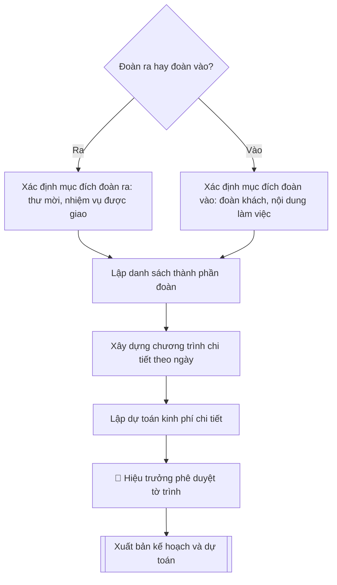

# Skill: Kế hoạch đoàn ra / đoàn vào

## Khi nào dùng
Khi cần lập kế hoạch cho **đoàn ra** (cán bộ, giảng viên của Trường đi công tác, học tập,
dự hội nghị ở nước ngoài) hoặc **đoàn vào** (đón tiếp đoàn đối tác, chuyên gia quốc tế
đến thăm và làm việc tại Trường), phục vụ trình duyệt, xin chủ trương và dự toán kinh phí.

## Đầu vào (Input)

| Trường | Mô tả | Bắt buộc |
|---|---|---|
| `loai_doan` | Đoàn ra / Đoàn vào | Có |
| `muc_dich` | Mục đích chuyến đi / chuyến thăm (ký MOU, dự hội thảo, khảo sát, làm việc...) | Có |
| `doi_tac` | Tên đối tác, quốc gia (đoàn ra: nơi đến; đoàn vào: đoàn khách) | Có |
| `thoi_gian` | Thời gian dự kiến (ngày đi – ngày về / ngày đón – ngày tiễn) | Có |
| `thanh_phan` | Danh sách thành viên: họ tên, chức danh, đơn vị, vai trò trong đoàn | Có |
| `chuong_trinh` | Chương trình chi tiết theo từng ngày: thời gian, nội dung, địa điểm, người phụ trách | Có |
| `nguon_kinh_phi` | Nguồn kinh phí: ngân sách trường / đối tác tài trợ / đề tài / cá nhân tự túc | Có |
| `don_vi_dau_moi` | Đơn vị đầu mối tổ chức (thường là Phòng KHCN&HTQT phối hợp đơn vị liên quan) | Không |

## Quy trình

**Bước 1. Xác định loại đoàn và mục đích**
- Làm gì: căn cứ `loai_doan` để chốt hướng soạn: đoàn ra phải nêu rõ yêu cầu của phía mời (thư mời chính thức) hoặc nhiệm vụ được giao; đoàn vào phải nêu rõ thành phần đoàn khách và nội dung làm việc đề xuất; ghi rõ `muc_dich` và thông tin `doi_tac` (tên đối tác, quốc gia).
- Dùng input: `loai_doan`, `muc_dich`, `doi_tac`.
- Vai trò: Chuyên viên Phòng KHCN và HTQT · AI hỗ trợ: soạn · ⏱ ~20–30 phút (ước tính)
- Lưu ý nghiệp vụ: đoàn ra đi nước ngoài bắt buộc phải có thư mời chính thức của đối tác — thiếu thư mời thì kế hoạch không đủ căn cứ trình; đoàn vào phải xác nhận lại số lượng và thành phần đoàn khách với đối tác trước khi lập chương trình.
- → Kết quả bước: tờ xác định loại đoàn (thư mời/nhiệm vụ được giao đối với đoàn ra; thành phần đoàn khách + nội dung làm việc đối với đoàn vào).

**Bước 2. Lập danh sách thành phần**
- Làm gì: lập danh sách đầy đủ họ tên, chức danh, đơn vị, vai trò trong đoàn: đoàn ra ghi rõ trưởng đoàn, từng thành viên và nhiệm vụ của từng người; đoàn vào ghi rõ đầu mối đón tiếp phía Trường tương ứng với từng thành viên đoàn khách.
- Dùng input: `thanh_phan`, `loai_doan`.
- Vai trò: Chuyên viên Phòng KHCN và HTQT · AI hỗ trợ: lập danh sách · ⏱ ~30–45 phút (ước tính)
- Lưu ý nghiệp vụ: trưởng đoàn ra phải là người có thẩm quyền quyết định nội dung làm việc; đoàn vào phải bố trí phiên dịch đi cùng suốt chương trình nếu đoàn khách không dùng tiếng Việt.
- → Kết quả bước: danh sách thành phần đoàn (họ tên – chức danh – đơn vị – vai trò/nhiệm vụ).

**Bước 3. Xây dựng chương trình chi tiết theo ngày**
- Làm gì: xếp lịch từng ngày trong `thoi_gian`: mỗi ngày liệt kê giờ giấc, nội dung (làm việc, tham quan, hội đàm, ký kết...), địa điểm, người phụ trách; đoàn vào bổ sung phương án đón/tiễn sân bay, bố trí ăn ở, phiên dịch.
- Dùng input: `chuong_trinh`, `thoi_gian`, `doi_tac`.
- Vai trò: Trưởng Phòng KHCN và HTQT · AI hỗ trợ: xếp chương trình theo ngày · ⏱ ~1–2 giờ (ước tính)
- Lưu ý nghiệp vụ: giờ bay đến/đi của đoàn vào phải khớp với phương án đón/tiễn; không xếp lịch làm việc dày đặc ngay sau chuyến bay dài; mỗi buổi làm việc chính thức cần có người chủ trì phía Trường được chỉ định rõ.
- → Kết quả bước: bảng chương trình chi tiết theo ngày (ngày – giờ – nội dung – địa điểm – người phụ trách).

**Bước 4. Lập dự toán kinh phí chi tiết**
- Làm gì: liệt kê từng khoản chi (vé máy bay, visa, khách sạn, ăn uống, đi lại nội địa, lệ phí hội nghị, quà tặng đối ngoại, phiên dịch, in ấn khánh tiết...) kèm số lượng, đơn giá, thành tiền; ghi rõ `nguon_kinh_phi` và cơ chế thanh quyết toán.
- Dùng input: `nguon_kinh_phi`, `thanh_phan`, `thoi_gian`.
- Vai trò: Chuyên viên Phòng KHCN và HTQT · AI hỗ trợ: lập bảng dự toán · ⏱ ~1–2 giờ (ước tính)
- Lưu ý nghiệp vụ: đơn giá phải theo khung quy định chi tiêu nội bộ (khách sạn, công tác phí); tổng dự toán không được vượt nguồn đã khai; đoàn vào phải tính đủ chi phí đón tiếp phát sinh (xe, tiệc chiêu đãi, quà tặng).
- → Kết quả bước: bảng dự toán kinh phí (khoản mục – số lượng – đơn giá – thành tiền – nguồn kinh phí).

**Bước 5. Hoàn thiện tờ trình xin chủ trương**
- Làm gì: đặt toàn bộ kết quả các Bước 1–4 vào thể thức tờ trình: tiêu đề cơ quan, tên tờ trình, trích yếu, kính gửi Hiệu trưởng, căn cứ (thư mời/MOU/quy chế), các mục Mục đích – Thành phần – Thời gian – Chương trình – Dự toán – Kiến nghị; ghi rõ `don_vi_dau_moi` chịu trách nhiệm triển khai.
- Dùng input: `don_vi_dau_moi`, kết quả các Bước 1–4.
- Vai trò: Chuyên viên Phòng KHCN và HTQT · AI hỗ trợ: ráp thể thức tờ trình · ⏱ ~45–60 phút (ước tính)
- Lưu ý nghiệp vụ: số liệu trong tờ trình (số người, số ngày, tổng kinh phí) phải khớp tuyệt đối với bảng chương trình và bảng dự toán — đây là lỗi bị trả về nhiều nhất.
- → Kết quả bước: dự thảo tờ trình kế hoạch đoàn hoàn chỉnh.

**Bước 6. Trình phê duyệt và xuất bản**
- Làm gì: trình Hiệu trưởng phê duyệt tờ trình; sau khi duyệt, xuất bản kế hoạch + dự toán hoàn chỉnh và chuyển cho các đơn vị phối hợp thực hiện.
- Dùng input: toàn bộ input (đối chiếu chéo).
- Vai trò: Hiệu trưởng · AI hỗ trợ: chuẩn bị hồ sơ trình ký, nhắc lịch và theo dõi tiến độ · ⏱ ~1–3 ngày làm việc (ước tính)
- Lưu ý nghiệp vụ: đoàn ra chỉ được triển khai sau khi có quyết định cử đi công tác của Hiệu trưởng; giữ lại 01 bộ hồ sơ đã duyệt tại đơn vị đầu mối để thanh quyết toán.
- → Kết quả bước: tờ trình đã phê duyệt + kế hoạch và dự toán hoàn chỉnh, sẵn sàng trình ký và chuyển các đơn vị phối hợp.

## Luồng quy trình (Workflow)


## Đầu ra (Output)
- Tờ trình kế hoạch đoàn ra / đoàn vào hoàn chỉnh (mục đích, thành phần, chương trình theo ngày).
- Bảng dự toán kinh phí chi tiết theo khoản mục.
- Danh sách đầu mối phối hợp.

**Cấu trúc output chuẩn:** khung mẫu cố định của sản phẩm chính — Tờ trình kế hoạch đoàn ra /
đoàn vào, các phần bắt buộc theo đúng thứ tự:
1. Tiêu đề cơ quan ban hành + tên tờ trình + trích yếu (V/v...).
2. Kính gửi (Hiệu trưởng).
3. Căn cứ (thư mời của đối tác / MOU / quy chế quản lý đoàn ra, đoàn vào).
4. Mục 1. Mục đích (chuyến đi / chuyến thăm).
5. Mục 2. Thành phần (đoàn ra: thành viên đoàn đi; đoàn vào: thành phần đoàn khách).
6. Mục 3. Thời gian.
7. Mục 4. Thành phần đón tiếp phía Trường (đoàn vào) / nhiệm vụ từng thành viên (đoàn ra).
8. Mục 5. Chương trình chi tiết theo ngày (ngày – giờ – nội dung – địa điểm – người phụ trách).
9. Mục 6. Dự toán kinh phí (bảng khoản mục – số lượng – đơn giá – thành tiền; nguồn kinh phí).
10. Mục 7. Kiến nghị.
11. Địa danh, ngày tháng năm; chức danh, chữ ký, họ tên người ký (đơn vị trình).
12. Sản phẩm kèm theo: bảng dự toán kinh phí chi tiết, danh sách đầu mối phối hợp.

## Checklist nghiệm thu
- [ ] Đủ các phần theo "Cấu trúc output chuẩn": tiêu đề cơ quan, kính gửi, căn cứ, mục 1–7, chữ ký đơn vị trình, bảng dự toán kèm theo.
- [ ] Số liệu khớp với Input: số người, số ngày, thời gian, địa điểm, tổng kinh phí, nguồn kinh phí.
- [ ] Không bịa đặt số liệu, đơn giá, thông tin đối tác, thành viên đoàn.
- [ ] Đúng thể thức tờ trình hành chính; bảng dự toán đủ cột (khoản mục – số lượng – đơn giá – thành tiền – nguồn).
- [ ] Căn cứ pháp lý đầy đủ, còn hiệu lực: quy chế quản lý đoàn ra/đoàn vào, quy chế chi tiêu nội bộ của Trường.
- [ ] Đã qua Human gate: Hiệu trưởng phê duyệt; đoàn ra có quyết định cử đi công tác.
- [ ] Đoàn ra có thư mời chính thức của đối tác; đoàn vào có phương án đón/tiễn khớp giờ bay và phiên dịch đầy đủ.
- [ ] Số liệu trong tờ trình khớp tuyệt đối với bảng chương trình và bảng dự toán.
- [ ] Đơn giá theo khung quy định chi tiêu nội bộ; tổng dự toán không vượt nguồn đã khai.

Tiêu chí đạt = tất cả các ô được đánh dấu.

## Ví dụ mô phỏng (dữ liệu giả lập)

> Tất cả tên trường, cá nhân, số liệu dưới đây đều là **giả lập**, không liên quan tổ chức/cá nhân có thật.

### Input mẫu

| Trường | Giá trị |
|---|---|
| `loai_doan` | Đoàn vào |
| `muc_dich` | Đón đoàn Trường Đại học C (Hà Lan) sang thăm, làm việc và ký kết MOU hợp tác |
| `doi_tac` | Trường Đại học Khoa học Ứng dụng C, Vương quốc Hà Lan – đoàn 04 người do GS. Willem Janssen, Hiệu trưởng, làm trưởng đoàn |
| `thoi_gian` | 18/11/2026 – 20/11/2026 (3 ngày) |
| `thanh_phan` | Phía Trường: PGS.TS. Trần Văn B (Phó Hiệu trưởng, trưởng đoàn đón tiếp), TS. Nguyễn Thị A (Trưởng phòng KHCN&HTQT), TS. Trần Văn D (Trưởng khoa CNTT), ThS. Đặng Thị A (chuyên viên đối ngoại, phiên dịch) |
| `chuong_trinh` | Ngày 1: đón sân bay, chào xã giao Ban Giám hiệu, tham quan trường. Ngày 2: hội đàm, ký MOU, tọa đàm với giảng viên – sinh viên Khoa CNTT. Ngày 3: tham quan thực tế, tiễn đoàn |
| `nguon_kinh_phi` | Ngân sách đối ngoại của Trường năm 2026 |

### Output mẫu

```
TRƯỜNG ĐẠI HỌC A
PHÒNG KHCN & HTQT

TỜ TRÌNH
V/v đón tiếp đoàn Trường Đại học C (Hà Lan) thăm và làm việc

Kính gửi: Hiệu trưởng Trường Đại học A

Căn cứ Biên bản ghi nhớ hợp tác đã thống nhất giữa hai trường; theo đề xuất
của Trường Đại học Khoa học Ứng dụng C (Vương quốc Hà Lan), Phòng
KHCN&HTQT kính trình Hiệu trưởng phê duyệt kế hoạch đón tiếp đoàn như sau:

1. Mục đích
Đón đoàn Trường Đại học C sang thăm, làm việc và ký kết Biên bản
ghi nhớ hợp tác (MOU) về đào tạo và nghiên cứu khoa học.

2. Thành phần đoàn khách (04 người)
- GS. Willem Janssen – Hiệu trưởng, Trưởng đoàn;
- TS. Anna de Vries – Trưởng khoa Công nghệ thông tin;
- TS. John B – Điều phối viên hợp tác quốc tế;
- Bà Maria Jansen – Trợ lý Hiệu trưởng.

3. Thời gian: từ ngày 18/11/2026 đến ngày 20/11/2026.

4. Thành phần đón tiếp phía Trường
- PGS.TS. Trần Văn B – Phó Hiệu trưởng, Trưởng đoàn đón tiếp;
- TS. Nguyễn Thị A – Trưởng phòng KHCN&HTQT;
- TS. Trần Văn D – Trưởng khoa Công nghệ thông tin;
- ThS. Đặng Thị A – Chuyên viên đối ngoại, phiên dịch tiếng Anh.

5. Chương trình chi tiết

Ngày 18/11/2026 (Thứ Tư):
- 10h30: Đón đoàn tại Sân bay quốc tế Nội Bài (ThS. Đặng Thị A).
- 14h00: Chào xã giao Ban Giám hiệu tại Phòng họp A (PGS.TS. Trần Văn B).
- 15h30: Tham quan cơ sở vật chất, phòng Lab AI của Khoa CNTT.

Ngày 19/11/2026 (Thứ Năm):
- 08h30: Hội đàm chính thức về nội dung hợp tác (Phòng họp A).
- 10h30: Lễ ký kết MOU (Hội trường tầng 3, Nhà A1).
- 14h00: Tọa đàm "AI trong giáo dục đại học" với giảng viên, sinh viên Khoa CNTT.
- 18h30: Tiệc chiêu đãi đoàn (Nhà khách trường).

Ngày 20/11/2026 (Thứ Sáu):
- 08h30: Tham quan thực tế tại Khu Công nghệ cao Hòa Lạc.
- 14h00: Tổng kết, trao quà lưu niệm; tiễn đoàn tại sân bay (chuyến bay 17h55).

6. Dự toán kinh phí (nguồn: ngân sách đối ngoại năm 2026)

| Khoản mục | Số lượng | Đơn giá (đ) | Thành tiền (đ) |
|---|---|---|---|
| Khách sạn (3 đêm × 4 phòng) | 12 phòng-đêm | 1.500.000 | 18.000.000 |
| Xe đón tiễn sân bay (2 lượt) | 2 lượt | 2.500.000 | 5.000.000 |
| Tiệc chiêu đãi (12 khách) | 12 suất | 800.000 | 9.600.000 |
| Quà tặng đối ngoại | 4 bộ | 1.000.000 | 4.000.000 |
| Phiên dịch, in ấn, khánh tiết | trọn gói | – | 5.000.000 |
| TỔNG CỘNG | | | 41.600.000 |

7. Kiến nghị
Kính đề nghị Hiệu trưởng phê duyệt kế hoạch và dự toán kinh phí nêu trên để
Phòng KHCN&HTQT phối hợp các đơn vị triển khai.

                                                Thành phố C, ngày 09 tháng 10 năm 2026
                                                TRƯỞNG PHÒNG KHCN&HTQT

                                                TS. Nguyễn Thị A
```

## Căn cứ & lưu ý
- Quy chế quản lý đoàn ra, đoàn vào và Quy chế chi tiêu nội bộ của Trường Đại học A.
- Đoàn ra đi nước ngoài phải có thư mời chính thức của đối tác và quyết định cử đi công tác của Hiệu trưởng.
- Kinh phí đối ngoại thực hiện theo đúng dự toán được duyệt, thanh quyết toán đầy đủ chứng từ.
- Không dùng tên thật của trường/cá nhân khi mô phỏng.
