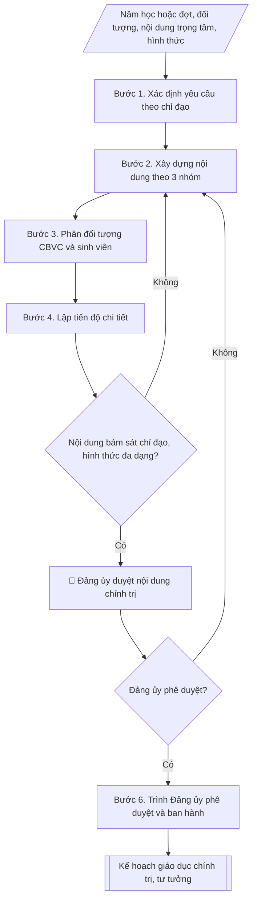

# Skill: Soạn kế hoạch giáo dục chính trị, tư tưởng

## Khi nào dùng
Khi đơn vị phụ trách công tác chính trị (Phòng Chính trị & CTSV hoặc Ban Tuyên giáo)
lập kế hoạch giáo dục chính trị, tư tưởng năm học hoặc kế hoạch đợt sinh hoạt chuyên đề
(học tập nghị quyết, kỷ niệm ngày lễ lớn, phòng chống "tự diễn biến", "tự chuyển hóa").

## Đầu vào (Input)

| Trường | Mô tả | Bắt buộc |
|---|---|---|
| `nam_hoc_dot` | Năm học hoặc đợt sinh hoạt | Có |
| `doi_tuong` | CBVC / Sinh viên / Cả hai (có thể chia nhóm) | Có |
| `noi_dung_trong_tam` | Các chuyên đề, nội dung giáo dục | Có |
| `hinh_thuc` | Hội nghị học tập, sinh hoạt chi bộ/chi đoàn, tọa đàm, trực tuyến... | Có |
| `don_vi_phoi_hop` | Đảng ủy, Đoàn Thanh niên, Hội Sinh viên, các khoa... | Không |

## Quy trình

**Bước 1. Xác định yêu cầu theo chỉ đạo**
- Làm gì: căn cứ chỉ đạo của Đảng ủy cấp trên và Đảng ủy trường về công tác tư tưởng trong
  năm học/đợt; xác định yêu cầu, trọng tâm, thời gian thực hiện.
- Dùng input: `nam_hoc_dot`.
- Vai trò: Văn phòng Đảng ủy · AI hỗ trợ: rà soát kỹ thuật, tổng hợp và lưu trữ hồ sơ · ⏱ ~1–2 giờ (ước tính)
- Lưu ý nghiệp vụ: mọi nội dung sau này phải bám sát chỉ đạo — không tự đặt chủ đề ngoài
  văn bản chỉ đạo.
- → Kết quả bước: khung yêu cầu công tác chính trị, tư tưởng của năm học/đợt.

**Bước 2. Xây dựng nội dung theo 3 nhóm**
- Làm gì: xây dựng nội dung theo 3 nhóm: (1) học tập, quán triệt nghị quyết, chỉ thị; (2)
  sinh hoạt chuyên đề tư tưởng, đạo đức, lối sống; (3) tuyên truyền kỷ niệm các ngày lễ lớn,
  đấu tranh phản bác quan điểm sai trái.
- Dùng input: `noi_dung_trong_tam`, khung yêu cầu (kết quả bước 1).
- Vai trò: Văn phòng Đảng ủy · AI hỗ trợ: soạn dự thảo nội dung · ⏱ ~2–3 giờ (ước tính)
- Lưu ý nghiệp vụ: nội dung bám sát văn kiện, nghị quyết, chỉ thị chính thức; tuyệt đối không
  tự diễn giải đường lối hoặc đưa quan điểm cá nhân.
- → Kết quả bước: dự thảo nội dung 3 nhóm.

**Bước 3. Phân đối tượng CBVC và sinh viên**
- Làm gì: phân nội dung, hình thức phù hợp riêng cho CBVC và sinh viên (có thể chia nhóm);
  xác định nội dung chung cho cả hai đối tượng.
- Dùng input: `doi_tuong`, dự thảo nội dung (kết quả bước 2).
- Vai trò: Văn phòng Đảng ủy · AI hỗ trợ: phân loại, đề xuất nội dung theo đối tượng CBVC/sinh viên · ⏱ ~1–2 giờ (ước tính)
- Lưu ý nghiệp vụ: với sinh viên ưu tiên hình thức sinh động (tọa đàm, thi trực tuyến, sinh
  hoạt chi đoàn); với CBVC ưu tiên hội nghị, sinh hoạt chi bộ.
- → Kết quả bước: bảng nội dung phân theo đối tượng (CBVC / sinh viên / chung).

**Bước 4. Lập tiến độ chi tiết**
- Làm gì: lập bảng tiến độ cho từng hoạt động: nội dung, đối tượng, hình thức, thời gian, địa
  điểm, đơn vị chủ trì, đơn vị phối hợp.
- Dùng input: `hinh_thuc`, `don_vi_phoi_hop`, bảng nội dung theo đối tượng (kết quả bước 3).
- Vai trò: Văn phòng Đảng ủy · AI hỗ trợ: lập bảng tiến độ chi tiết dự thảo · ⏱ ~2–3 giờ (ước tính)
- Lưu ý nghiệp vụ: thời gian không trùng các đợt cao điểm (thi cử, tuyển sinh); mỗi hoạt động
  có một đơn vị chủ trì chịu trách nhiệm duy nhất.
- → Kết quả bước: bảng tiến độ chi tiết từng hoạt động.

**Bước 5. Kiểm tra nội dung**
- Làm gì: kiểm tra nội dung bám sát chỉ đạo của Đảng ủy; hình thức đa dạng, tránh hình thức,
  phong trào; rà soát mọi trích dẫn văn kiện từ nguồn chính thức.
- Dùng input: dự thảo nội dung và tiến độ (kết quả bước 2–4).
- Vai trò: Văn phòng Đảng ủy · AI hỗ trợ: đối chiếu checklist · ⏱ ~1–2 giờ (ước tính)
- Lưu ý nghiệp vụ: chưa đạt thì quay lại điều chỉnh nội dung (bước 2); tuyệt đối không dùng
  AI "sáng tác" trích dẫn lãnh tụ, văn kiện.
- → Kết quả bước: dự thảo kế hoạch đã kiểm tra, đạt yêu cầu.

**Bước 6. Trình Đảng ủy phê duyệt và ban hành**
- Làm gì: trình Đảng ủy duyệt nội dung chính trị, tư tưởng (Human gate); sau khi phê duyệt,
  ban hành kế hoạch và triển khai trong toàn trường.
- Dùng input: dự thảo kế hoạch (kết quả bước 5).
- Vai trò: Đảng ủy · AI hỗ trợ: chuẩn bị hồ sơ trình ký, nhắc lịch và theo dõi tiến độ · ⏱ ~3–7 ngày làm việc (ước tính)
- Lưu ý nghiệp vụ: Đảng ủy chưa phê duyệt thì quay lại điều chỉnh; kế hoạch chỉ triển khai
  sau khi có phê duyệt.
- → Kết quả bước: kế hoạch giáo dục chính trị, tư tưởng hoàn chỉnh, đã phê duyệt.

## Luồng quy trình (Workflow)


## Đầu ra (Output)
- Kế hoạch giáo dục chính trị, tư tưởng (markdown) kèm bảng tiến độ chi tiết.

**Cấu trúc output chuẩn:** khung cố định của Kế hoạch giáo dục chính trị, tư tưởng:
1. Tiêu đề: tên trường + đơn vị chủ trì (Đảng ủy – Phòng Chính trị và CTSV) + tên kế hoạch
   ("KẾ HOẠCH" + "Giáo dục chính trị, tư tưởng ..." + `nam_hoc_dot`).
2. I. Mục đích, yêu cầu.
3. II. Nội dung và tiến độ: bảng TT | Nội dung | Đối tượng | Hình thức | Thời gian | Đơn vị
   chủ trì.
4. III. Tổ chức thực hiện (đơn vị chủ trì, đơn vị phối hợp, chế độ báo cáo Đảng ủy).
5. Chữ ký đơn vị ban hành.

## Checklist nghiệm thu

- [ ] Đủ 5 phần theo "Cấu trúc output chuẩn": tiêu đề (tên trường + đơn vị chủ trì + tên kế hoạch); I. Mục đích, yêu cầu; II. Nội dung và tiến độ (bảng TT | Nội dung | Đối tượng | Hình thức | Thời gian | Đơn vị chủ trì); III. Tổ chức thực hiện (đơn vị chủ trì, phối hợp, chế độ báo cáo Đảng ủy); chữ ký đơn vị ban hành.
- [ ] Nội dung đủ 3 nhóm: (1) học tập, quán triệt nghị quyết, chỉ thị; (2) sinh hoạt chuyên đề tư tưởng, đạo đức, lối sống; (3) tuyên truyền kỷ niệm ngày lễ lớn, đấu tranh phản bác quan điểm sai trái.
- [ ] Năm học/đợt, đối tượng, hình thức trong output khớp với Input đã cho.
- [ ] Không bịa đặt trích dẫn lãnh tụ, văn kiện; mọi trích dẫn đều kiểm chứng từ nguồn chính thức; không diễn giải đường lối hay đưa quan điểm cá nhân.
- [ ] Đúng thể thức văn bản kế hoạch của đơn vị chủ trì (Đảng ủy – Phòng Chính trị và CTSV).
- [ ] Căn cứ (văn kiện, nghị quyết của Đảng; chỉ đạo của Đảng ủy cấp trên và Đảng ủy trường) còn hiệu lực; nội dung bám sát chỉ đạo, không tự đặt chủ đề ngoài văn bản chỉ đạo.
- [ ] Đã qua Human gate: Đảng ủy trường duyệt nội dung chính trị, tư tưởng trước khi ban hành; kế hoạch chỉ triển khai sau khi được phê duyệt.
- [ ] Nội dung, hình thức phân theo đối tượng phù hợp (hội nghị, sinh hoạt chi bộ cho CBVC; tọa đàm, thi trực tuyến, sinh hoạt chi đoàn cho sinh viên); tiến độ không trùng đợt cao điểm (thi cử, tuyển sinh); mỗi hoạt động có một đơn vị chủ trì duy nhất.

Tiêu chí đạt = tất cả các ô được đánh dấu.


## Ví dụ mô phỏng (dữ liệu giả lập)

> Tất cả tên trường (Trường Đại học A), cá nhân, số liệu dưới đây đều là **giả lập**, không liên quan tổ chức/cá nhân có thật.

### Input mẫu

| Trường | Giá trị |
|---|---|
| `nam_hoc_dot` | Năm học 2026–2027 |
| `doi_tuong` | CBVC và sinh viên (chia 2 nhóm nội dung) |
| `noi_dung_trong_tam` | 1. Học tập nghị quyết TW. 2. Chuyên đề đạo đức, lối sống cho SV. 3. Tuyên truyền kỷ niệm ngày thành lập Đoàn. 4. Đấu tranh phản bác thông tin xấu độc trên mạng. |
| `hinh_thuc` | Hội nghị, sinh hoạt chi bộ/chi đoàn, tọa đàm, thi trực tuyến |
| `don_vi_phoi_hop` | Đảng ủy, Đoàn Thanh niên, Hội Sinh viên, các khoa |

### Output mẫu

```
TRƯỜNG ĐẠI HỌC A
ĐẢNG ỦY – PHÒNG CHÍNH TRỊ VÀ CTSV

                          KẾ HOẠCH
     Giáo dục chính trị, tư tưởng năm học 2026–2027

I. MỤC ĐÍCH, YÊU CẦU
Nâng cao nhận thức chính trị, củng cố niềm tin, xây dựng đạo đức, lối sống
lành mạnh cho CBVC và sinh viên; chủ động phòng ngừa "tự diễn biến",
"tự chuyển hóa".

II. NỘI DUNG VÀ TIẾN ĐỘ
| TT | Nội dung | Đối tượng | Hình thức | Thời gian | Đơn vị chủ trì |
|----|----------|-----------|-----------|-----------|----------------|
| 1 | Học tập, quán triệt nghị quyết TW | CBVC | Hội nghị | 10/2026 | Đảng ủy, P.CT&CTSV |
| 2 | Chuyên đề đạo đức, lối sống SV | Sinh viên | Sinh hoạt chi đoàn | 11/2026 | Đoàn TN, Hội SV |
| 3 | Kỷ niệm ngày thành lập Đoàn 26/3 | CBVC, SV | Tọa đàm, thi trực tuyến | 3/2027 | Đoàn TN |
| 4 | Nhận diện, phản bác thông tin xấu độc | CBVC, SV | Tập huấn, tài liệu | 4/2027 | P.CT&CTSV |

III. TỔ CHỨC THỰC HIỆN
Phòng Chính trị và CTSV chủ trì, phối hợp các đơn vị theo bảng trên; báo cáo
Đảng ủy kết quả từng đợt.
```

## Human gate (người kiểm duyệt)
- Đảng ủy trường duyệt nội dung chính trị, tư tưởng trước khi ban hành.
- Ban Giám hiệu phối hợp chỉ đạo triển khai trong toàn trường.

## Giới hạn (guardrails)
- Nội dung phải bám sát văn kiện, nghị quyết, chỉ thị chính thức; **tuyệt đối không**
  tự diễn giải, suy đoán đường lối hoặc đưa quan điểm cá nhân vào tài liệu giáo dục.
- Không dùng AI để "sáng tác" trích dẫn lãnh tụ, văn kiện — mọi trích dẫn phải kiểm chứng
  từ nguồn chính thức.
- Mọi dữ liệu trong ví dụ đều giả lập.

## Căn cứ & lưu ý
- Văn kiện, nghị quyết của Đảng; chỉ đạo của Đảng ủy cấp trên và Đảng ủy trường.
- Không dùng tên thật của trường/cá nhân khi mô phỏng.
