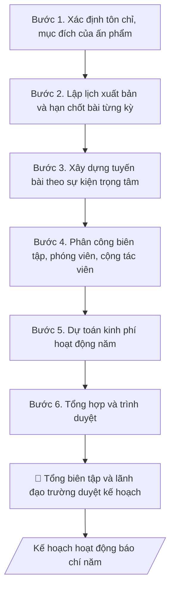

# Skill: Kế hoạch hoạt động báo chí

## Khi nào dùng
Đầu năm, cơ quan báo chí của trường (báo in, tạp chí nội bộ, bản tin điện tử) cần lập kế hoạch
hoạt động: số kỳ xuất bản, tuyến bài/chuyên mục trọng tâm gắn với sự kiện của trường và của
ngành, phân công nhân sự, dự toán kinh phí.

## Đầu vào (Input)

| Trường | Mô tả | Bắt buộc |
|---|---|---|
| `ten_an_pham` | Tên báo/tạp chí/bản tin, loại hình (in/điện tử) | Có |
| `nam_ke_hoach` | Năm áp dụng | Có |
| `ky_xuat_ban` | Số kỳ/năm, lịch phát hành dự kiến | Có |
| `chuyen_muc` | Các chuyên mục cố định và tuyến bài trọng tâm | Có |
| `su_kien_trong_tam` | Sự kiện lớn của trường/ngành trong năm cần tuyên truyền | Không |
| `nhan_su` | Tổng biên tập, biên tập viên, phóng viên, cộng tác viên | Có |
| `kinh_phi` | Dự toán kinh phí hoạt động năm | Không |

## Quy trình

**Bước 1. Xác định tôn chỉ, mục đích**
- Làm gì: viết tuyên bố tôn chỉ, mục đích của ấn phẩm bám sát nhiệm vụ chính trị –
  chuyên môn của trường (tuyên truyền chủ trương, phản ánh hoạt động đào tạo – NCKH,
  diễn đàn CBVC/SV); rà soát giấy phép hoạt động báo chí (loại hình, kỳ hạn, phạm vi
  phát hành) để kế hoạch không vượt giấy phép.
- Dùng input: `ten_an_pham`, `nam_ke_hoach`.
- Vai trò: Biên tập viên · AI hỗ trợ: soạn dự thảo tuyên bố tôn chỉ, mục đích theo giấy phép hoạt động báo chí · ⏱ 30–60 phút (ước tính)
- Lưu ý nghiệp vụ: mọi tuyến bài sau này phải soi lại tôn chỉ này — bài không phù hợp
  tôn chỉ thì loại ngay từ khâu lập tuyến; ghi đúng tên ấn phẩm theo giấy phép.
- → Kết quả bước: tuyên bố tôn chỉ – mục đích của ấn phẩm trong năm kế hoạch.

**Bước 2. Lập lịch xuất bản**
- Làm gì: cụ thể hóa `ky_xuat_ban` thành bảng lịch: số kỳ/năm, ngày phát hành từng kỳ,
  hạn chốt bài – chốt morat từng kỳ; đánh dấu các số đặc biệt gắn với sự kiện lớn.
- Dùng input: `ky_xuat_ban`, `su_kien_trong_tam`.
- Vai trò: Biên tập viên · AI hỗ trợ: lập bảng lịch xuất bản năm: kỳ, ngày phát hành, hạn chốt bài · ⏱ 1–2 giờ (ước tính)
- Lưu ý nghiệp vụ: hạn chốt bài phải trừ hao thời gian biên tập – chế bản – in ấn
  (báo in chốt sớm hơn bản điện tử); số đặc biệt cần lịch riêng dài hơn số thường.
- → Kết quả bước: bảng lịch xuất bản năm (kỳ – ngày phát hành – hạn chốt bài).

**Bước 3. Xây dựng tuyến bài**
- Làm gì: từ `chuyen_muc` và `su_kien_trong_tam`, dựng khung tuyến bài theo quý:
  chuyên mục cố định duy trì mỗi kỳ + bài trọng tâm theo sự kiện (khai giảng, tốt nghiệp,
  kiểm định, ngày nhà giáo...); phân công phóng viên/cộng tác viên theo dõi từng tuyến.
- Dùng input: `chuyen_muc`, `su_kien_trong_tam`, bảng lịch xuất bản (Bước 2).
- Vai trò: Tổng biên tập · AI hỗ trợ: dựng khung tuyến bài theo quý và phân công theo tuyến, Tổng biên tập duyệt tuyến bài · ⏱ 2–3 giờ (ước tính)
- Lưu ý nghiệp vụ: mỗi sự kiện trọng tâm phải có tuyến bài "trước – trong – sau",
  không chỉ đưa tin sau sự kiện; cân đối giữa tin hoạt động và bài chuyên sâu
  (gương điển hình, phân tích) để ấn phẩm không thành bản tin sự kiện đơn thuần.
- → Kết quả bước: khung tuyến bài theo quý + phân công phóng viên/cộng tác viên
  theo tuyến.

**Bước 4. Phân công nhân sự**
- Làm gì: phân công biên tập viên phụ trách từng mảng/chuyên mục; bố trí cộng tác viên
  theo đầu mối khoa/phòng; quy định quy trình duyệt bài (phóng viên → biên tập viên →
  Tổng biên tập) và trách nhiệm nội dung từng khâu.
- Dùng input: `nhan_su`, khung tuyến bài (Bước 3).
- Vai trò: Tổng biên tập · AI hỗ trợ: lập bảng phân công nhân sự và quy trình duyệt bài, Tổng biên tập chốt · ⏱ 1–2 giờ (ước tính)
- Lưu ý nghiệp vụ: mỗi bài phải có người chịu trách nhiệm nội dung ghi rõ họ tên —
  không để bài "vô chủ"; Tổng biên tập chịu trách nhiệm cuối cùng về nội dung từng kỳ.
- → Kết quả bước: bảng phân công nhân sự + quy trình duyệt bài.

**Bước 5. Dự toán kinh phí**
- Làm gì: lập dự toán theo `kinh_phi`: nhuận bút (theo khung nhuận bút hiện hành),
  in ấn – phát hành, chi phí tòa soạn (văn phòng phẩm, đi lại tác nghiệp); phân bổ
  theo quý, dành dự phòng cho số đặc biệt.
- Dùng input: `kinh_phi`, bảng lịch xuất bản (Bước 2).
- Vai trò: Biên tập viên · AI hỗ trợ: lập bảng dự toán kinh phí theo khung nhuận bút và phân bổ theo quý · ⏱ 1–2 giờ (ước tính)
- Lưu ý nghiệp vụ: nhuận bút tính đúng khung quy định, không tự đặt mức; số đặc biệt
  (tăng trang, in màu) dự toán riêng vì chi phí cao hơn số thường nhiều lần.
- → Kết quả bước: bảng dự toán kinh phí năm (hạng mục – mức – phân bổ theo quý).

**Bước 6. Tổng hợp và trình duyệt**
- Làm gì: gộp tôn chỉ (Bước 1), lịch xuất bản (Bước 2), tuyến bài (Bước 3), phân công
  (Bước 4), dự toán (Bước 5) thành kế hoạch hoàn chỉnh; Tổng biên tập duyệt nội dung,
  sau đó trình lãnh đạo trường (cơ quan chủ quản) phê duyệt kế hoạch năm và số đặc biệt.
- Dùng input: `ten_an_pham`, `nam_ke_hoach`, toàn bộ dự thảo các bước 1–5.
- Vai trò: Tổng biên tập · AI hỗ trợ: chuẩn bị dự thảo, tài liệu và số liệu phục vụ bước này · ⏱ 2–5 ngày làm việc (ước tính)
- Lưu ý nghiệp vụ: kế hoạch chỉ có hiệu lực sau khi lãnh đạo trường phê duyệt; mọi
  thay đổi tuyến bài lớn trong năm phải báo cáo Tổng biên tập trước khi thực hiện.
- → Kết quả bước: kế hoạch hoạt động báo chí năm hoàn chỉnh, đã phê duyệt.

## Luồng quy trình (Workflow)



## Đầu ra (Output)
- Kế hoạch hoạt động báo chí năm (markdown): lịch xuất bản, tuyến bài, phân công, kinh phí.

**Cấu trúc output chuẩn:** khung mẫu cố định của kế hoạch, các phần theo đúng thứ tự:
1. Tiêu đề: tên ấn phẩm + "Kế hoạch hoạt động năm..." (căn giữa).
2. I. Tôn chỉ, mục đích của ấn phẩm trong năm kế hoạch.
3. II. Kế hoạch xuất bản: số kỳ/năm, ngày phát hành, hạn chốt bài từng kỳ
   (đánh dấu số đặc biệt).
4. III. Tuyến bài trọng tâm: theo quý/sự kiện — chuyên mục cố định + bài trọng tâm,
   phân công phóng viên/cộng tác viên theo tuyến.
5. IV. Phân công nhân sự: biên tập viên phụ trách mảng, cộng tác viên theo đầu mối,
   quy trình duyệt bài.
6. V. Kinh phí dự kiến: tổng mức và phân bổ (nhuận bút, in ấn – phát hành, khác).
7. Chữ ký duyệt: Tổng biên tập; lãnh đạo trường (cơ quan chủ quản) phê duyệt.

## Checklist nghiệm thu

- [ ] Đủ 7 phần theo "Cấu trúc output chuẩn": tiêu đề ấn phẩm + năm, I. Tôn chỉ mục đích, II. Kế hoạch xuất bản, III. Tuyến bài trọng tâm, IV. Phân công nhân sự, V. Kinh phí dự kiến, chữ ký duyệt.
- [ ] Nội dung khớp với Input: tên ấn phẩm, năm, số kỳ/năm, chuyên mục, sự kiện trọng tâm, nhân sự.
- [ ] Không bịa đặt số liệu, minh chứng, trích dẫn.
- [ ] Đúng thể thức văn bản kế hoạch; kế hoạch không vượt giấy phép hoạt động báo chí (loại hình, kỳ hạn, phạm vi phát hành).
- [ ] Căn cứ pháp lý đầy đủ, còn hiệu lực (Luật Báo chí 2016, giấy phép hoạt động của ấn phẩm).
- [ ] Đã qua Human gate: Tổng biên tập duyệt nội dung; lãnh đạo trường (cơ quan chủ quản) phê duyệt kế hoạch năm và số đặc biệt.
- [ ] Mỗi sự kiện trọng tâm có tuyến bài "trước – trong – sau"; mỗi bài có người chịu trách nhiệm nội dung ghi rõ họ tên.
- [ ] Nhuận bút tính đúng khung quy định; số đặc biệt dự toán riêng.
- [ ] Hạn chốt bài trừ hao thời gian biên tập – chế bản – in ấn; số đặc biệt có lịch riêng dài hơn số thường.

Tiêu chí đạt = tất cả các ô được đánh dấu.

## Ví dụ mô phỏng (dữ liệu giả lập)

> Tất cả tên trường, ấn phẩm, cá nhân, số liệu dưới đây đều là **giả lập**, không liên quan tổ chức/cá nhân có thật.

### Input mẫu

| Trường | Giá trị |
|---|---|
| `ten_an_pham` | Bản tin A (bản in + điện tử) |
| `nam_ke_hoach` | 2027 |
| `ky_xuat_ban` | 12 kỳ/năm (mỗi tháng 01 kỳ, phát hành ngày 05) |
| `chuyen_muc` | Tin hoạt động, Gương điển hình, Khoa học & Đào tạo, Sinh viên |
| `su_kien_trong_tam` | Kỷ niệm 30 năm thành lập trường (11/2027); kiểm định cơ sở giáo dục (quý II) |
| `nhan_su` | 01 Tổng biên tập, 03 biên tập viên, 10 cộng tác viên |

### Output mẫu

```
BẢN TIN A — KẾ HOẠCH HOẠT ĐỘNG NĂM 2027

I. TÔN CHỈ, MỤC ĐÍCH: tuyên truyền chủ trương, đường lối của Đảng và chính sách
của Nhà nước trong giáo dục đại học; phản ánh hoạt động đào tạo, NCKH và đời sống
CBVC, sinh viên Trường Đại học A.
II. KẾ HOẠCH XUẤT BẢN: 12 kỳ/năm; phát hành ngày 05 hằng tháng; hạn chốt bài: 25 tháng trước.
III. TUYẾN BÀI TRỌNG TÂM
- Quý I: tuyển sinh 2027; gương SV nghiên cứu khoa học.
- Quý II: đợt kiểm định cơ sở giáo dục; ngày Khoa học Việt Nam 18/5.
- Quý III: khai giảng năm học mới; tân SV.
- Quý IV (trọng điểm): kỷ niệm 30 năm thành lập trường — số đặc biệt 24 trang.
IV. PHÂN CÔNG: mỗi biên tập viên phụ trách 01 mảng; cộng tác viên theo đầu mối khoa/phòng;
quy trình duyệt bài: phóng viên → biên tập viên → Tổng biên tập.
V. KINH PHÍ DỰ KIẾN: 240 triệu đồng (nhuận bút 40%, in ấn – phát hành 50%, còn lại 10%).

Duyệt:                                          TỔNG BIÊN TẬP
Lãnh đạo trường (cơ quan chủ quản) phê duyệt          (đã ký)
```

## Human gate
- **Tổng biên tập** chịu trách nhiệm nội dung từng kỳ, duyệt tuyến bài và bản thảo cuối.
- **Lãnh đạo trường** (cơ quan chủ quản) phê duyệt kế hoạch năm và số đặc biệt.

## Giới hạn
- AI không tự quyết đăng/xóa bài thay Tổng biên tập.
- Không đăng nội dung chưa kiểm chứng nguồn; không vi phạm bản quyền hình ảnh/bài viết.

## Căn cứ & lưu ý
- Luật Báo chí 2016; giấy phép hoạt động báo chí của ấn phẩm.
- Không dùng tên thật của trường/ấn phẩm/cá nhân khi mô phỏng.
