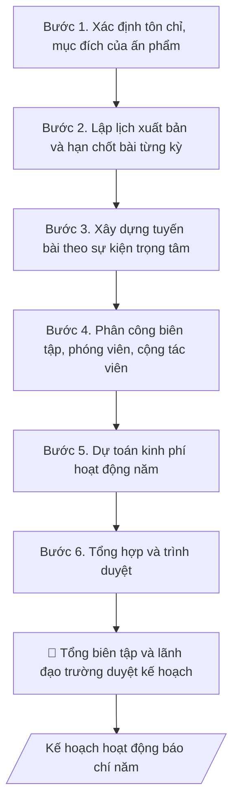

# Kế hoạch hoạt động báo chí

## Định dạng và file đầu ra

Định dạng đầu ra có thể chọn theo sản phẩm/yêu cầu: .docx, .pdf. Đọc mục “Định dạng bổ sung” trong quy cách đầu ra trước khi chọn.

**Phải tạo file thực tế để tải xuống, không chỉ trả nội dung trong chat.** Định dạng mặc định của skill: **.docx**. Nếu có bảng số liệu nghiệp vụ yêu cầu file bảng tính riêng, tạo thêm Excel theo yêu cầu; không tự tạo file kiểm tra. Không chờ người dùng yêu cầu xuất file lần nữa. Ưu tiên định dạng người dùng chỉ định; đọc quy tắc xuất file tại references/quy-cach-dau-ra.md.

## Quy cách đầu ra và thông tin thiếu
Khi dựng file Word/Excel, áp dụng mục “Thể thức và bảng biểu khi dựng file” trong quy cách đầu ra (cỡ chữ từng thành phần, bảng nhiều trang, số trang, phụ lục). Đọc [quy cách và cấu trúc sản phẩm](references/quy-cach-dau-ra.md) trước khi soạn/xuất. File giao chỉ gồm sản phẩm nghiệp vụ được yêu cầu; kiểm tra nội bộ không xuất kèm. Thiếu thông tin thì giữ nguyên trường/mục và chỗ điền theo mẫu gốc (dòng dấu chấm, dấu gạch hoặc ô trống); không tự điền dữ liệu mẫu, số 0, mã chờ xác minh hay dòng chờ ký. Mẫu chuyên ngành còn áp dụng được ưu tiên về cấu trúc, mã biểu và người ký. Bản đầy đủ: [quy tắc chung](references/quy-tac-chung.md).

Khi người dùng yêu cầu bộ slide (.pptx), đọc mục “Xuất PowerPoint (.pptx) khi được yêu cầu” trong quy cách đầu ra.

## Kiểm soát áp dụng và phê duyệt
Trước khi chạy, xác định `ngay_ap_dung`, `loai_hinh_truong`, `quy_che_noi_bo`, `nguon_du_lieu`, `nguoi_kiem_duyet`; chỉ hỏi thông tin liên quan nghiệp vụ, không dùng giá trị giả định thay dữ liệu bắt buộc. Đối chiếu căn cứ pháp lý với văn bản gốc, hiệu lực, điều khoản áp dụng và chuyển tiếp. Bản đầy đủ: [quy tắc chung](references/quy-tac-chung.md).

## Giới hạn và human gate
AI hỗ trợ chuẩn bị và đối chiếu; cán bộ phụ trách kiểm tra dữ liệu/căn cứ, người có thẩm quyền duyệt và ký. Không đánh dấu đã ký, đã duyệt, đã công bố khi chưa có chứng cứ. Dữ liệu sinh viên, sức khỏe, nhân sự, tài chính chỉ dùng theo mục đích và phân quyền, che thông tin định danh khi dùng ví dụ (Luật 91/2025/QH15, hiệu lực 01/01/2026); không tải dữ liệu lên dịch vụ ngoài khi chưa có quyền. Bản đầy đủ: [quy tắc chung](references/quy-tac-chung.md).

## Khi nào dùng
Đầu năm, cơ quan báo chí của trường (báo in, tạp chí nội bộ, bản tin điện tử) cần lập kế hoạch
hoạt động: số kỳ xuất bản, tuyến bài/chuyên mục trọng tâm gắn với sự kiện của trường và của
ngành, phân công nhân sự, dự toán kinh phí.

## Đầu vào (Input)

| Trường | Mô tả | Bắt buộc |
|---|---|---|
| `ten_an_pham` | Tên báo/tạp chí/bản tin, loại hình (in/điện tử) | Có |
| `nam_ke_hoach` | Năm áp dụng | Có |
| `ky_xuat_ban` | Số kỳ/năm, lịch phát hành dự kiến | Có |
| `chuyen_muc` | Các chuyên mục cố định và tuyến bài trọng tâm | Có |
| `su_kien_trong_tam` | Sự kiện lớn của trường/ngành trong năm cần tuyên truyền | Không |
| `nhan_su` | Tổng biên tập, biên tập viên, phóng viên, cộng tác viên | Có |
| `kinh_phi` | Dự toán kinh phí hoạt động năm | Không |

## Quy trình

**Bước 1. Xác định tôn chỉ, mục đích**
- Làm gì: viết tuyên bố tôn chỉ, mục đích của ấn phẩm bám sát nhiệm vụ chính trị –
  chuyên môn của trường (tuyên truyền chủ trương, phản ánh hoạt động đào tạo – NCKH,
  diễn đàn CBVC/SV); rà soát giấy phép hoạt động báo chí (loại hình, kỳ hạn, phạm vi
  phát hành) để kế hoạch không vượt giấy phép.
- Dùng input: `ten_an_pham`, `nam_ke_hoach`.
- Vai trò: Biên tập viên · AI hỗ trợ: soạn dự thảo tuyên bố tôn chỉ, mục đích theo giấy phép hoạt động báo chí · ⏱ 30–60 phút (ước tính)
- Lưu ý nghiệp vụ: mọi tuyến bài sau này phải soi lại tôn chỉ này — bài không phù hợp
  tôn chỉ thì loại ngay từ khâu lập tuyến; ghi đúng tên ấn phẩm theo giấy phép.
- → Kết quả bước: tuyên bố tôn chỉ – mục đích của ấn phẩm trong năm kế hoạch.

**Bước 2. Lập lịch xuất bản**
- Làm gì: cụ thể hóa `ky_xuat_ban` thành bảng lịch: số kỳ/năm, ngày phát hành từng kỳ,
  hạn chốt bài – chốt morat từng kỳ; đánh dấu các số đặc biệt gắn với sự kiện lớn.
- Dùng input: `ky_xuat_ban`, `su_kien_trong_tam`.
- Vai trò: Biên tập viên · AI hỗ trợ: lập bảng lịch xuất bản năm: kỳ, ngày phát hành, hạn chốt bài · ⏱ 1–2 giờ (ước tính)
- Lưu ý nghiệp vụ: hạn chốt bài phải trừ hao thời gian biên tập – chế bản – in ấn
  (báo in chốt sớm hơn bản điện tử); số đặc biệt cần lịch riêng dài hơn số thường.
- → Kết quả bước: bảng lịch xuất bản năm (kỳ – ngày phát hành – hạn chốt bài).

**Bước 3. Xây dựng tuyến bài**
- Làm gì: từ `chuyen_muc` và `su_kien_trong_tam`, dựng khung tuyến bài theo quý:
  chuyên mục cố định duy trì mỗi kỳ + bài trọng tâm theo sự kiện (khai giảng, tốt nghiệp,
  kiểm định, ngày nhà giáo...); phân công phóng viên/cộng tác viên theo dõi từng tuyến.
- Dùng input: `chuyen_muc`, `su_kien_trong_tam`, bảng lịch xuất bản (Bước 2).
- Vai trò: Tổng biên tập · AI hỗ trợ: dựng khung tuyến bài theo quý và phân công theo tuyến, Tổng biên tập duyệt tuyến bài · ⏱ 2–3 giờ (ước tính)
- Lưu ý nghiệp vụ: mỗi sự kiện trọng tâm phải có tuyến bài "trước – trong – sau",
  không chỉ đưa tin sau sự kiện; cân đối giữa tin hoạt động và bài chuyên sâu
  (gương điển hình, phân tích) để ấn phẩm không thành bản tin sự kiện đơn thuần.
- → Kết quả bước: khung tuyến bài theo quý + phân công phóng viên/cộng tác viên
  theo tuyến.

**Bước 4. Phân công nhân sự**
- Làm gì: phân công biên tập viên phụ trách từng mảng/chuyên mục; bố trí cộng tác viên
  theo đầu mối khoa/phòng; quy định quy trình duyệt bài (phóng viên → biên tập viên →
  Tổng biên tập) và trách nhiệm nội dung từng khâu.
- Dùng input: `nhan_su`, khung tuyến bài (Bước 3).
- Vai trò: Tổng biên tập · AI hỗ trợ: lập bảng phân công nhân sự và quy trình duyệt bài, Tổng biên tập chốt · ⏱ 1–2 giờ (ước tính)
- Lưu ý nghiệp vụ: mỗi bài phải có người chịu trách nhiệm nội dung ghi rõ họ tên —
  không để bài "vô chủ"; Tổng biên tập chịu trách nhiệm cuối cùng về nội dung từng kỳ.
- → Kết quả bước: bảng phân công nhân sự + quy trình duyệt bài.

**Bước 5. Dự toán kinh phí**
- Làm gì: lập dự toán theo `kinh_phi`: nhuận bút (theo khung nhuận bút hiện hành),
  in ấn – phát hành, chi phí tòa soạn (văn phòng phẩm, đi lại tác nghiệp); phân bổ
  theo quý, dành dự phòng cho số đặc biệt.
- Dùng input: `kinh_phi`, bảng lịch xuất bản (Bước 2).
- Vai trò: Biên tập viên · AI hỗ trợ: lập bảng dự toán kinh phí theo khung nhuận bút và phân bổ theo quý · ⏱ 1–2 giờ (ước tính)
- Lưu ý nghiệp vụ: nhuận bút tính đúng khung quy định, không tự đặt mức; số đặc biệt
  (tăng trang, in màu) dự toán riêng vì chi phí cao hơn số thường nhiều lần.
- → Kết quả bước: bảng dự toán kinh phí năm (hạng mục – mức – phân bổ theo quý).

**Bước 6. Tổng hợp và trình duyệt**
- Làm gì: gộp tôn chỉ (Bước 1), lịch xuất bản (Bước 2), tuyến bài (Bước 3), phân công
  (Bước 4), dự toán (Bước 5) thành kế hoạch hoàn chỉnh; Tổng biên tập duyệt nội dung,
  sau đó trình lãnh đạo trường (cơ quan chủ quản) phê duyệt kế hoạch năm và số đặc biệt.
- Dùng input: `ten_an_pham`, `nam_ke_hoach`, toàn bộ dự thảo các bước 1–5.
- Vai trò: Tổng biên tập · AI hỗ trợ: chuẩn bị dự thảo, tài liệu và số liệu phục vụ bước này · ⏱ 2–5 ngày làm việc (ước tính)
- Lưu ý nghiệp vụ: kế hoạch chỉ có hiệu lực sau khi lãnh đạo trường phê duyệt; mọi
  thay đổi tuyến bài lớn trong năm phải báo cáo Tổng biên tập trước khi thực hiện.
- → Kết quả bước: kế hoạch hoạt động báo chí năm hoàn chỉnh, đã phê duyệt.

## Luồng quy trình (Workflow)

## Đầu ra

File nghiệp vụ thực tế theo định dạng mặc định ở đầu skill hoặc định dạng người dùng yêu cầu, kèm liên kết tải trong phản hồi cuối.

Sản phẩm nghiệp vụ hoàn chỉnh theo [quy cách và cấu trúc](references/quy-cach-dau-ra.md), giữ các trường chưa có dữ liệu ở trạng thái trống. Không xuất kèm checklist/phụ lục kiểm tra đầu ra.

## Kiểm tra nội bộ trước khi giao

- [ ] Bố cục khớp mẫu áp dụng và cấu trúc tại references/quy-cach-dau-ra.md.
- [ ] Nội dung khớp với Input: tên ấn phẩm, năm, số kỳ/năm, chuyên mục, sự kiện trọng tâm, nhân sự.
- [ ] Không bịa đặt số liệu, minh chứng, trích dẫn.
- [ ] Đúng thể thức văn bản kế hoạch; kế hoạch không vượt giấy phép hoạt động báo chí (loại hình, kỳ hạn, phạm vi phát hành).
- [ ] Căn cứ pháp lý đầy đủ, còn hiệu lực (Luật Báo chí 2016, giấy phép hoạt động của ấn phẩm).
- [ ] Đã qua Human gate: Tổng biên tập duyệt nội dung; lãnh đạo trường (cơ quan chủ quản) phê duyệt kế hoạch năm và số đặc biệt.
- [ ] Mỗi sự kiện trọng tâm có tuyến bài "trước – trong – sau"; mỗi bài có người chịu trách nhiệm nội dung ghi rõ họ tên.
- [ ] Nhuận bút tính đúng khung quy định; số đặc biệt dự toán riêng.
- [ ] Hạn chốt bài trừ hao thời gian biên tập – chế bản – in ấn; số đặc biệt có lịch riêng dài hơn số thường.

Tiêu chí đạt = tất cả các ô được đánh dấu.

## Human gate
- **Tổng biên tập** chịu trách nhiệm nội dung từng kỳ, duyệt tuyến bài và bản thảo cuối.
- **Lãnh đạo trường** (cơ quan chủ quản) phê duyệt kế hoạch năm và số đặc biệt.

## Giới hạn
- AI không tự quyết đăng/xóa bài thay Tổng biên tập.
- Không đăng nội dung chưa kiểm chứng nguồn; không vi phạm bản quyền hình ảnh/bài viết.

## Căn cứ & lưu ý
- Luật Báo chí 2016; giấy phép hoạt động báo chí của ấn phẩm.
- Không dùng tên thật của trường/ấn phẩm/cá nhân khi mô phỏng.

## Quản trị phiên bản
- Phiên bản gói `1.3.2` (cập nhật 2026-10-10); hồ sơ đầy đủ tại [references/version.json](references/version.json).
- Người phê duyệt nghiệp vụ: **chưa chỉ định**. Trạng thái: dự thảo nghiệp vụ; kiểm tra pháp lý trước thực thi. Ngày cập nhật không đồng nghĩa mọi văn bản đã được rà soát toàn văn.
- Giấy phép theo LICENSE của kho (bản quyền CES Global). Lịch sử thay đổi: CHANGELOG.md.
