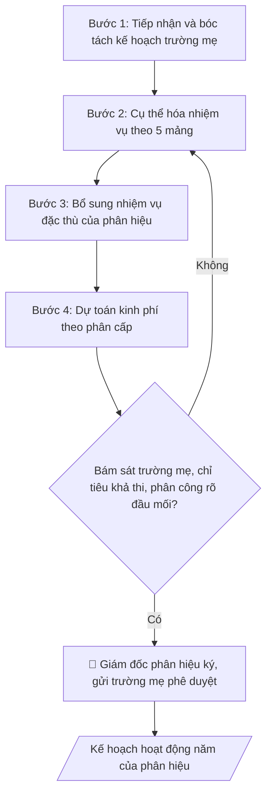

# Skill: Soạn kế hoạch hoạt động phân hiệu

## Khi nào dùng
Khi Phân hiệu / Cơ sở đào tạo lập kế hoạch hoạt động năm học, cụ thể hóa kế hoạch của
trường mẹ cho phù hợp điều kiện thực tế tại phân hiệu.

## Đầu vào (Input)

| Trường | Mô tả | Bắt buộc |
|---|---|---|
| `ten_phan_hieu` | Tên phân hiệu / cơ sở | Có |
| `nam_hoc` | Năm học áp dụng | Có |
| `ke_hoach_truong_me` | Các nhiệm vụ trọng tâm trường mẹ giao | Có |
| `quy_mo` | Quy mô đào tạo, nhân sự, cơ sở vật chất của phân hiệu | Có |
| `nhiem_vu_trong_tam` | Nhiệm vụ trọng tâm riêng của phân hiệu trong năm | Có |

## Quy trình

**Bước 1. Tiếp nhận và bóc tách kế hoạch trường mẹ**
- Làm gì: đọc toàn văn kế hoạch năm học của trường mẹ (`ke_hoach_truong_me`); đánh dấu từng nhiệm vụ thuộc trách nhiệm của phân hiệu bằng cách đối chiếu với quyết định phân cấp cho phân hiệu; lập "bảng bóc tách" gồm các cột: nhiệm vụ trường mẹ giao | có thuộc phân cấp phân hiệu không | ghi chú (cần trình trường mẹ / phân hiệu tự triển khai).
- Dùng input: `ke_hoach_truong_me`, `ten_phan_hieu`, `nam_hoc`.
- Vai trò: Cán bộ Phân hiệu · AI hỗ trợ: đọc kế hoạch trường mẹ, lập bảng bóc tách nhiệm vụ theo phân cấp · ⏱ 2–3 giờ (ước tính)
- Lưu ý nghiệp vụ: chỉ nhận nhiệm vụ trong phân cấp — nhiệm vụ vượt phân cấp (VD: mở ngành mới cần cấp có thẩm quyền phê duyệt) phải ghi rõ "trình trường mẹ quyết định", không tự đưa vào kế hoạch như việc đã chắc chắn. Bẫy: kế hoạch trường mẹ viết chung chung ("đẩy mạnh chuyển đổi số") — phải cụ thể hóa thành việc đo được ở Bước 2.
- → Kết quả bước: bảng bóc tách nhiệm vụ trường mẹ giao cho phân hiệu (phân loại: trong phân cấp / cần trình trường mẹ).

**Bước 2. Cụ thể hóa nhiệm vụ theo 5 mảng**
- Làm gì: với mỗi nhiệm vụ trong bảng bóc tách, viết thành dòng công việc cụ thể theo 5 mảng (đào tạo – CTSV – KHCN – tài chính – cơ sở vật chất); mỗi dòng ghi đủ 4 cột: nhiệm vụ | chỉ tiêu định lượng | đơn vị thực hiện (tổ/bộ phận thuộc phân hiệu) | thời gian (tháng/quý); đối chiếu chỉ tiêu với `quy_mo` (số sinh viên, CBVC, phòng học) để kiểm tra tính khả thi sơ bộ.
- Dùng input: `quy_mo` (+ bảng bóc tách ở Bước 1).
- Vai trò: Cán bộ Phân hiệu · AI hỗ trợ: cụ thể hóa thành bảng nhiệm vụ – chỉ tiêu – đơn vị thực hiện – thời gian theo 5 mảng · ⏱ 2–4 giờ (ước tính)
- Lưu ý nghiệp vụ: chỉ tiêu phải gắn với năng lực thực tế — VD: phân hiệu 1.800 sinh viên với 95 CBVC không thể đặt chỉ tiêu "10 bài báo quốc tế". Mỗi nhiệm vụ phải có đúng 1 đầu mối chịu trách nhiệm, không để nhiệm vụ "vô chủ".
- → Kết quả bước: bảng nhiệm vụ – chỉ tiêu – đơn vị thực hiện – thời gian, sắp xếp theo 5 mảng.

**Bước 3. Bổ sung nhiệm vụ đặc thù của phân hiệu**
- Làm gì: rà soát `nhiem_vu_trong_tam` (nhiệm vụ riêng của phân hiệu: tuyển sinh địa phương, liên kết vùng, mở ngành mới...); kiểm tra từng nhiệm vụ có nằm trong phân cấp được giao không; chèn vào bảng ở Bước 2 (đúng mảng tương ứng), ghi rõ nguồn gốc "nhiệm vụ đặc thù phân hiệu".
- Dùng input: `nhiem_vu_trong_tam`.
- Vai trò: Cán bộ Phân hiệu · AI hỗ trợ: chèn nhiệm vụ đặc thù vào bảng đúng mảng, lãnh đạo phân hiệu rà soát mâu thuẫn với kế hoạch trường mẹ · ⏱ 1–2 giờ (ước tính)
- Lưu ý nghiệp vụ: nhiệm vụ đặc thù không được mâu thuẫn với nhiệm vụ trường mẹ giao (VD: trường mẹ yêu cầu tinh gọn mà phân hiệu đòi mở thêm 3 ngành). Nếu mâu thuẫn, ưu tiên kế hoạch trường mẹ và ghi chú xin ý kiến.
- → Kết quả bước: bảng nhiệm vụ hoàn chỉnh (nhiệm vụ trường mẹ + nhiệm vụ đặc thù, đã gắn nhãn nguồn gốc từng dòng).

**Bước 4. Dự toán kinh phí theo phân cấp**
- Làm gì: với từng nhiệm vụ trong bảng, ước tính chi phí (nhân công, vật tư, thuê ngoài); tổng hợp theo nguồn: kinh phí trường mẹ cấp theo phân cấp và nguồn thu tự chủ của phân hiệu; đối chiếu tổng dự toán với hạn mức phân cấp tài chính — phần vượt hạn mức tách thành mục "đề nghị trường mẹ bổ sung".
- Dùng input: `quy_mo` (cơ sở vật chất, nhân sự hiện có để ước chi phí) (+ bảng nhiệm vụ ở Bước 3).
- Vai trò: Cán bộ Phân hiệu · AI hỗ trợ: ước tính chi phí từng nhiệm vụ, tổng hợp theo nguồn trong/hạn mức phân cấp · ⏱ 2–3 giờ (ước tính)
- Lưu ý nghiệp vụ: không lập dự toán cho nhiệm vụ chưa được phê duyệt (VD: mở ngành mới chưa có đề án duyệt thì chỉ ghi "dự kiến", không đưa số tiền cam kết). Bẫy: quên chi phí phát sinh (bảo trì, khấu hao CSVC) — phải có dòng dự phòng tối thiểu 5%.
- → Kết quả bước: bảng dự toán kinh phí theo nhiệm vụ + tổng hợp theo nguồn (trong phân cấp / đề nghị bổ sung).

**Bước 5. Kiểm tra chéo và hoàn thiện dự thảo**
- Làm gì: kiểm tra 3 điểm trước khi trình ký: (1) mọi nhiệm vụ trường mẹ giao đã có trong kế hoạch (đối chiếu ngược bảng bóc tách Bước 1); (2) chỉ tiêu khả thi với `quy_mo`; (3) phân công rõ đầu mối; sau đó lắp ráp thành văn bản kế hoạch theo cấu trúc chuẩn.
- Dùng input: toàn bộ kết quả các Bước 1–4.
- Vai trò: Giám đốc Phân hiệu · AI hỗ trợ: kiểm tra chéo 3 điểm · ⏱ 1–2 giờ (ước tính)
- Lưu ý nghiệp vụ: đây là "cửa" cuối trước khi trình ký — lỗi hay gặp nhất là chỉ tiêu trong bảng phân công khác với chỉ tiêu trong phần Nhiệm vụ trọng tâm. Phải đối chiếu 2 phần này khớp nhau 100%.
- → Kết quả bước: dự thảo kế hoạch hoàn chỉnh, sẵn sàng trình ký.

**Bước 6. Trình ký và gửi trường mẹ**
- Làm gì: trình Giám đốc phân hiệu ký kế hoạch (human gate); gửi văn bản chính thức cho Ban Giám hiệu trường mẹ để phê duyệt/theo dõi; phát hành nội bộ tới các tổ/bộ phận thuộc phân hiệu; lưu hồ sơ văn bản.
- Dùng input: `ten_phan_hieu`, `nam_hoc`.
- Vai trò: Giám đốc Phân hiệu · AI hỗ trợ: soạn dự thảo văn bản trình ký, kiểm tra thể thức · ⏱ 1–2 ngày làm việc (ước tính)
- Lưu ý nghiệp vụ: nội dung vượt phân cấp trong kế hoạch chỉ có hiệu lực sau khi trường mẹ phê duyệt — phải ghi rõ trong văn bản gửi kèm. Giữ số hiệu văn bản liên tục với hệ thống văn thư của phân hiệu.
- → Kết quả bước: kế hoạch hoạt động năm của phân hiệu đã ký + công văn gửi trường mẹ.

## Luồng quy trình (Workflow)



## Đầu ra (Output)
- Kế hoạch hoạt động năm của phân hiệu (markdown) kèm bảng nhiệm vụ – chỉ tiêu – tiến độ.

**Cấu trúc output chuẩn** (sản phẩm chính: Kế hoạch hoạt động năm của phân hiệu):
1. Tiêu đề hành chính: tên trường + tên phân hiệu, quốc hiệu "CỘNG HÒA XÃ HỘI CHỦ NGHĨA VIỆT NAM / Độc lập – Tự do – Hạnh phúc", số hiệu văn bản, địa danh và ngày ban hành.
2. Tên văn bản: "KẾ HOẠCH — Hoạt động năm học [năm học] của Phân hiệu [tên phân hiệu]".
3. Căn cứ: kế hoạch năm học của trường mẹ; điều kiện thực tế của phân hiệu (quy mô đào tạo, nhân sự, CSVC).
4. Phần I — Nhiệm vụ trọng tâm: danh sách nhiệm vụ (kế thừa từ trường mẹ + nhiệm vụ đặc thù của phân hiệu).
5. Phần II — Phân công thực hiện: bảng gồm các cột Nhiệm vụ | Chỉ tiêu | Đơn vị thực hiện | Thời gian, sắp xếp theo 5 mảng (đào tạo – CTSV – KHCN – tài chính – CSVC).
6. Phần III — Kinh phí: tổng dự toán theo phân cấp tài chính (trong phân cấp / đề nghị trường mẹ bổ sung).
7. Nơi nhận + chữ ký Giám đốc phân hiệu.

## Checklist nghiệm thu

- [ ] Đủ 7 phần theo "Cấu trúc output chuẩn": tiêu đề hành chính, tên văn bản, căn cứ, Phần I — Nhiệm vụ trọng tâm, Phần II — Phân công thực hiện (bảng), Phần III — Kinh phí, nơi nhận + chữ ký.
- [ ] Nội dung khớp với Input: tên phân hiệu, năm học, nhiệm vụ trường mẹ giao, quy mô, nhiệm vụ trọng tâm riêng.
- [ ] Không bịa đặt số liệu, minh chứng, trích dẫn.
- [ ] Đúng thể thức văn bản hành chính: quốc hiệu, số hiệu, địa danh, ngày ban hành, nơi nhận, chữ ký.
- [ ] Căn cứ pháp lý đầy đủ, còn hiệu lực (quy chế tổ chức và hoạt động của trường, quyết định thành lập và phân cấp cho phân hiệu).
- [ ] Đã qua Human gate: Giám đốc phân hiệu ký kế hoạch; nội dung vượt phân cấp đã được trường mẹ phê duyệt.
- [ ] Mọi nhiệm vụ trường mẹ giao đã có trong kế hoạch (đối chiếu ngược bảng bóc tách); nhiệm vụ vượt phân cấp ghi rõ "trình trường mẹ quyết định".
- [ ] Chỉ tiêu khả thi với quy mô thực tế; mỗi nhiệm vụ có đúng 1 đầu mối chịu trách nhiệm.
- [ ] Chỉ tiêu trong bảng phân công khớp 100% với chỉ tiêu trong phần Nhiệm vụ trọng tâm.

Tiêu chí đạt = tất cả các ô được đánh dấu.

## Ví dụ mô phỏng (dữ liệu giả lập)

> Tất cả tên trường, cá nhân, số liệu dưới đây đều là **giả lập**, không liên quan tổ chức/cá nhân có thật.

### Input mẫu

| Trường | Giá trị |
|---|---|
| `ten_phan_hieu` | Phân hiệu Trường Đại học A tại tỉnh Đồng Nai (giả lập) |
| `nam_hoc` | 2026–2027 |
| `ke_hoach_truong_me` | Tuyển sinh đạt 100% chỉ tiêu; triển khai kiểm định 2 chương trình; số hóa 50% hồ sơ |
| `quy_mo` | 1.800 sinh viên, 95 CBVC, 2 dãy nhà học |
| `nhiem_vu_trong_tam` | Mở thêm 1 ngành đào tạo mới; nâng cấp phòng thực hành |

### Output mẫu

```
TRƯỜNG ĐẠI HỌC A            CỘNG HÒA XÃ HỘI CHỦ NGHĨA VIỆT NAM
PHÂN HIỆU TẠI ĐỒNG NAI                    Độc lập – Tự do – Hạnh phúc
      Số: 08/KH-ĐHA-PHDN
                                                 Đồng Nai, ngày 20 tháng 8 năm 2026

                          KẾ HOẠCH
          Hoạt động năm học 2026–2027 của Phân hiệu

Căn cứ Kế hoạch năm học 2026–2027 của Trường Đại học A;
Xét điều kiện thực tế của Phân hiệu (1.800 sinh viên, 95 CBVC),

Phân hiệu xây dựng Kế hoạch hoạt động năm học 2026–2027 như sau:

I. NHIỆM VỤ TRỌNG TÂM
1. Tuyển sinh đạt 100% chỉ tiêu được giao (1.000 chỉ tiêu).
2. Triển khai tự đánh giá phục vụ kiểm định 2 chương trình đào tạo.
3. Số hóa 50% hồ sơ đào tạo, học vụ.
4. Mở thêm 1 ngành đào tạo mới theo đề án được phê duyệt.
5. Nâng cấp 2 phòng thực hành.

II. PHÂN CÔNG THỰC HIỆN (trích; bảng đầy đủ sắp xếp theo 5 mảng:
đào tạo – CTSV – KHCN – tài chính – CSVC)
| Nhiệm vụ | Chỉ tiêu | Đơn vị thực hiện | Thời gian |
|----------|----------|------------------|-----------|
| Tuyển sinh | 1.000 chỉ tiêu | Tổ Đào tạo PH | 3–9/2027 |
| Kiểm định 2 CTĐT | 2 báo cáo TĐG | Tổ ĐBCL PH | 10/2026–6/2027 |
| Số hóa hồ sơ | 50% | Tổ Hành chính PH | Cả năm |
| Mở ngành mới | 1 đề án | Tổ Đào tạo PH | 11/2026–3/2027 |

III. KINH PHÍ: theo phân cấp tài chính, tổng dự toán 4,2 tỷ đồng (giả lập).

Nơi nhận:                                          GIÁM ĐỐC PHÂN HIỆU
- Ban Giám hiệu (b/c);                                  (đã ký)
- Các tổ thuộc Phân hiệu;
- Lưu: VT, PHDN.                                  TS. Phạm Văn D
```

## Human gate (người kiểm duyệt)
- Giám đốc phân hiệu duyệt kế hoạch trước khi gửi trường mẹ.
- Ban Giám hiệu trường mẹ cho ý kiến/phê duyệt các nội dung vượt phân cấp.

## Giới hạn (guardrails)
- Không lập nhiệm vụ vượt quá thẩm quyền, phân cấp mà trường mẹ đã giao cho phân hiệu
  (tuyển sinh, mở ngành, tài chính... đều phải trong phân cấp).
- Không cam kết chỉ tiêu, kinh phí khi chưa có phê duyệt của trường mẹ.
- Mọi số liệu trong ví dụ đều giả lập.

## Căn cứ & lưu ý
- Quy chế tổ chức và hoạt động của trường; quyết định thành lập và phân cấp cho phân hiệu.
- Không dùng tên thật của trường/cá nhân khi mô phỏng.
