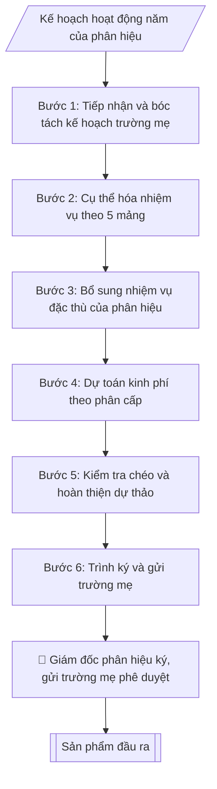

# Soạn kế hoạch hoạt động phân hiệu

## Định dạng và file đầu ra

Định dạng đầu ra có thể chọn theo sản phẩm/yêu cầu: .docx, .pdf. Đọc mục “Định dạng bổ sung” trong quy cách đầu ra trước khi chọn.

**Phải tạo file thực tế để tải xuống, không chỉ trả nội dung trong chat.** Định dạng mặc định của skill: **.docx**. Nếu có bảng số liệu nghiệp vụ yêu cầu file bảng tính riêng, tạo thêm Excel theo yêu cầu; không tự tạo file kiểm tra. Không chờ người dùng yêu cầu xuất file lần nữa. Ưu tiên định dạng người dùng chỉ định; đọc quy tắc xuất file tại references/quy-cach-dau-ra.md.

## Quy cách đầu ra và thông tin thiếu
Khi dựng file Word/Excel, áp dụng mục “Thể thức và bảng biểu khi dựng file” trong quy cách đầu ra (cỡ chữ từng thành phần, bảng nhiều trang, số trang, phụ lục). Đọc [quy cách và cấu trúc sản phẩm](references/quy-cach-dau-ra.md) trước khi soạn/xuất. File giao chỉ gồm sản phẩm nghiệp vụ được yêu cầu; kiểm tra nội bộ không xuất kèm. Thiếu thông tin thì giữ nguyên trường/mục và chỗ điền theo mẫu gốc (dòng dấu chấm, dấu gạch hoặc ô trống); không tự điền dữ liệu mẫu, số 0, mã chờ xác minh hay dòng chờ ký. Mẫu chuyên ngành còn áp dụng được ưu tiên về cấu trúc, mã biểu và người ký. Bản đầy đủ: [quy tắc chung](references/quy-tac-chung.md).

Khi người dùng yêu cầu bộ slide (.pptx), đọc mục “Xuất PowerPoint (.pptx) khi được yêu cầu” trong quy cách đầu ra.

## Kiểm soát áp dụng và phê duyệt
Trước khi chạy, xác định `ngay_ap_dung`, `loai_hinh_truong`, `quy_che_noi_bo`, `nguon_du_lieu`, `nguoi_kiem_duyet`; chỉ hỏi thông tin liên quan nghiệp vụ, không dùng giá trị giả định thay dữ liệu bắt buộc. Đối chiếu căn cứ pháp lý với văn bản gốc, hiệu lực, điều khoản áp dụng và chuyển tiếp. Bản đầy đủ: [quy tắc chung](references/quy-tac-chung.md).

## Giới hạn và human gate
AI hỗ trợ chuẩn bị và đối chiếu; cán bộ phụ trách kiểm tra dữ liệu/căn cứ, người có thẩm quyền duyệt và ký. Không đánh dấu đã ký, đã duyệt, đã công bố khi chưa có chứng cứ. Dữ liệu sinh viên, sức khỏe, nhân sự, tài chính chỉ dùng theo mục đích và phân quyền, che thông tin định danh khi dùng ví dụ (Luật 91/2025/QH15, hiệu lực 01/01/2026); không tải dữ liệu lên dịch vụ ngoài khi chưa có quyền. Bản đầy đủ: [quy tắc chung](references/quy-tac-chung.md).

## Khi nào dùng
Khi Phân hiệu / Cơ sở đào tạo lập kế hoạch hoạt động năm học, cụ thể hóa kế hoạch của
trường mẹ cho phù hợp điều kiện thực tế tại phân hiệu.

## Đầu vào (Input)

| Trường | Mô tả | Bắt buộc |
|---|---|---|
| `ten_phan_hieu` | Tên phân hiệu / cơ sở | Có |
| `nam_hoc` | Năm học áp dụng | Có |
| `ke_hoach_truong_me` | Các nhiệm vụ trọng tâm trường mẹ giao | Có |
| `quy_mo` | Quy mô đào tạo, nhân sự, cơ sở vật chất của phân hiệu | Có |
| `nhiem_vu_trong_tam` | Nhiệm vụ trọng tâm riêng của phân hiệu trong năm | Có |

## Quy trình

**Bước 1. Tiếp nhận và bóc tách kế hoạch trường mẹ**
- Làm gì: đọc toàn văn kế hoạch năm học của trường mẹ (`ke_hoach_truong_me`); đánh dấu từng nhiệm vụ thuộc trách nhiệm của phân hiệu bằng cách đối chiếu với quyết định phân cấp cho phân hiệu; lập "bảng bóc tách" gồm các cột: nhiệm vụ trường mẹ giao | có thuộc phân cấp phân hiệu không | ghi chú (cần trình trường mẹ / phân hiệu tự triển khai).
- Dùng input: `ke_hoach_truong_me`, `ten_phan_hieu`, `nam_hoc`.
- Vai trò: Cán bộ Phân hiệu · AI hỗ trợ: đọc kế hoạch trường mẹ, lập bảng bóc tách nhiệm vụ theo phân cấp · ⏱ 2–3 giờ (ước tính)
- Lưu ý nghiệp vụ: chỉ nhận nhiệm vụ trong phân cấp — nhiệm vụ vượt phân cấp (VD: mở ngành mới cần cấp có thẩm quyền phê duyệt) phải ghi rõ "trình trường mẹ quyết định", không tự đưa vào kế hoạch như việc đã chắc chắn. Bẫy: kế hoạch trường mẹ viết chung chung ("đẩy mạnh chuyển đổi số") — phải cụ thể hóa thành việc đo được ở Bước 2.
- → Kết quả bước: bảng bóc tách nhiệm vụ trường mẹ giao cho phân hiệu (phân loại: trong phân cấp / cần trình trường mẹ).

**Bước 2. Cụ thể hóa nhiệm vụ theo 5 mảng**
- Làm gì: với mỗi nhiệm vụ trong bảng bóc tách, viết thành dòng công việc cụ thể theo 5 mảng (đào tạo – CTSV – KHCN – tài chính – cơ sở vật chất); mỗi dòng ghi đủ 4 cột: nhiệm vụ | chỉ tiêu định lượng | đơn vị thực hiện (tổ/bộ phận thuộc phân hiệu) | thời gian (tháng/quý); đối chiếu chỉ tiêu với `quy_mo` (số sinh viên, CBVC, phòng học) để kiểm tra tính khả thi sơ bộ.
- Dùng input: `quy_mo` (+ bảng bóc tách ở Bước 1).
- Vai trò: Cán bộ Phân hiệu · AI hỗ trợ: cụ thể hóa thành bảng nhiệm vụ – chỉ tiêu – đơn vị thực hiện – thời gian theo 5 mảng · ⏱ 2–4 giờ (ước tính)
- Lưu ý nghiệp vụ: chỉ tiêu phải gắn với năng lực thực tế — VD: phân hiệu 1.800 sinh viên với 95 CBVC không thể đặt chỉ tiêu "10 bài báo quốc tế". Mỗi nhiệm vụ phải có đúng 1 đầu mối chịu trách nhiệm, không để nhiệm vụ "vô chủ".
- → Kết quả bước: bảng nhiệm vụ – chỉ tiêu – đơn vị thực hiện – thời gian, sắp xếp theo 5 mảng.

**Bước 3. Bổ sung nhiệm vụ đặc thù của phân hiệu**
- Làm gì: rà soát `nhiem_vu_trong_tam` (nhiệm vụ riêng của phân hiệu: tuyển sinh địa phương, liên kết vùng, mở ngành mới...); kiểm tra từng nhiệm vụ có nằm trong phân cấp được giao không; chèn vào bảng ở Bước 2 (đúng mảng tương ứng), ghi rõ nguồn gốc "nhiệm vụ đặc thù phân hiệu".
- Dùng input: `nhiem_vu_trong_tam`.
- Vai trò: Cán bộ Phân hiệu · AI hỗ trợ: chèn nhiệm vụ đặc thù vào bảng đúng mảng, lãnh đạo phân hiệu rà soát mâu thuẫn với kế hoạch trường mẹ · ⏱ 1–2 giờ (ước tính)
- Lưu ý nghiệp vụ: nhiệm vụ đặc thù không được mâu thuẫn với nhiệm vụ trường mẹ giao (VD: trường mẹ yêu cầu tinh gọn mà phân hiệu đòi mở thêm 3 ngành). Nếu mâu thuẫn, ưu tiên kế hoạch trường mẹ và ghi chú xin ý kiến.
- → Kết quả bước: bảng nhiệm vụ hoàn chỉnh (nhiệm vụ trường mẹ + nhiệm vụ đặc thù, đã gắn nhãn nguồn gốc từng dòng).

**Bước 4. Dự toán kinh phí theo phân cấp**
- Làm gì: với từng nhiệm vụ trong bảng, ước tính chi phí (nhân công, vật tư, thuê ngoài); tổng hợp theo nguồn: kinh phí trường mẹ cấp theo phân cấp và nguồn thu tự chủ của phân hiệu; đối chiếu tổng dự toán với hạn mức phân cấp tài chính — phần vượt hạn mức tách thành mục "đề nghị trường mẹ bổ sung".
- Dùng input: `quy_mo` (cơ sở vật chất, nhân sự hiện có để ước chi phí) (+ bảng nhiệm vụ ở Bước 3).
- Vai trò: Cán bộ Phân hiệu · AI hỗ trợ: ước tính chi phí từng nhiệm vụ, tổng hợp theo nguồn trong/hạn mức phân cấp · ⏱ 2–3 giờ (ước tính)
- Lưu ý nghiệp vụ: không lập dự toán cho nhiệm vụ chưa được phê duyệt (VD: mở ngành mới chưa có đề án duyệt thì chỉ ghi "dự kiến", không đưa số tiền cam kết). Bẫy: quên chi phí phát sinh (bảo trì, khấu hao CSVC) — phải có dòng dự phòng tối thiểu 5%.
- → Kết quả bước: bảng dự toán kinh phí theo nhiệm vụ + tổng hợp theo nguồn (trong phân cấp / đề nghị bổ sung).

**Bước 5. Kiểm tra chéo và hoàn thiện dự thảo**
- Làm gì: kiểm tra 3 điểm trước khi trình ký: (1) mọi nhiệm vụ trường mẹ giao đã có trong kế hoạch (đối chiếu ngược bảng bóc tách Bước 1); (2) chỉ tiêu khả thi với `quy_mo`; (3) phân công rõ đầu mối; sau đó lắp ráp thành văn bản kế hoạch theo cấu trúc chuẩn.
- Dùng input: toàn bộ kết quả các Bước 1–4.
- Vai trò: Giám đốc Phân hiệu · AI hỗ trợ: kiểm tra chéo 3 điểm · ⏱ 1–2 giờ (ước tính)
- Lưu ý nghiệp vụ: đây là "cửa" cuối trước khi trình ký — lỗi hay gặp nhất là chỉ tiêu trong bảng phân công khác với chỉ tiêu trong phần Nhiệm vụ trọng tâm. Phải đối chiếu 2 phần này khớp nhau 100%.
- → Kết quả bước: dự thảo kế hoạch hoàn chỉnh, sẵn sàng trình ký.

**Bước 6. Trình ký và gửi trường mẹ**
- Làm gì: trình Giám đốc phân hiệu ký kế hoạch (human gate); gửi văn bản chính thức cho Ban Giám hiệu trường mẹ để phê duyệt/theo dõi; phát hành nội bộ tới các tổ/bộ phận thuộc phân hiệu; lưu hồ sơ văn bản.
- Dùng input: `ten_phan_hieu`, `nam_hoc`.
- Vai trò: Giám đốc Phân hiệu · AI hỗ trợ: soạn dự thảo văn bản trình ký, kiểm tra thể thức · ⏱ 1–2 ngày làm việc (ước tính)
- Lưu ý nghiệp vụ: nội dung vượt phân cấp trong kế hoạch chỉ có hiệu lực sau khi trường mẹ phê duyệt — phải ghi rõ trong văn bản gửi kèm. Giữ số hiệu văn bản liên tục với hệ thống văn thư của phân hiệu.
- → Kết quả bước: kế hoạch hoạt động năm của phân hiệu đã ký + công văn gửi trường mẹ.

## Luồng quy trình (Workflow)

## Đầu ra

File nghiệp vụ thực tế theo định dạng mặc định ở đầu skill hoặc định dạng người dùng yêu cầu, kèm liên kết tải trong phản hồi cuối.

Sản phẩm nghiệp vụ hoàn chỉnh theo [quy cách và cấu trúc](references/quy-cach-dau-ra.md), giữ các trường chưa có dữ liệu ở trạng thái trống. Không xuất kèm checklist/phụ lục kiểm tra đầu ra.

## Kiểm tra nội bộ trước khi giao

- [ ] Bố cục khớp mẫu áp dụng và cấu trúc tại references/quy-cach-dau-ra.md.
- [ ] Nội dung khớp với Input: tên phân hiệu, năm học, nhiệm vụ trường mẹ giao, quy mô, nhiệm vụ trọng tâm riêng.
- [ ] Không bịa đặt số liệu, minh chứng, trích dẫn.
- [ ] Đúng thể thức văn bản hành chính: quốc hiệu, số hiệu, địa danh, ngày ban hành, nơi nhận, chữ ký.
- [ ] Căn cứ pháp lý đầy đủ, còn hiệu lực (quy chế tổ chức và hoạt động của trường, quyết định thành lập và phân cấp cho phân hiệu).
- [ ] Đã qua Human gate: Giám đốc phân hiệu ký kế hoạch; nội dung vượt phân cấp đã được trường mẹ phê duyệt.
- [ ] Mọi nhiệm vụ trường mẹ giao đã có trong kế hoạch (đối chiếu ngược bảng bóc tách); nhiệm vụ vượt phân cấp ghi rõ "trình trường mẹ quyết định".
- [ ] Chỉ tiêu khả thi với quy mô thực tế; mỗi nhiệm vụ có đúng 1 đầu mối chịu trách nhiệm.
- [ ] Chỉ tiêu trong bảng phân công khớp 100% với chỉ tiêu trong phần Nhiệm vụ trọng tâm.

Tiêu chí đạt = tất cả các ô được đánh dấu.

## Human gate (người kiểm duyệt)
- Giám đốc phân hiệu duyệt kế hoạch trước khi gửi trường mẹ.
- Ban Giám hiệu trường mẹ cho ý kiến/phê duyệt các nội dung vượt phân cấp.

## Giới hạn (guardrails)
- Không lập nhiệm vụ vượt quá thẩm quyền, phân cấp mà trường mẹ đã giao cho phân hiệu
  (tuyển sinh, mở ngành, tài chính... đều phải trong phân cấp).
- Không cam kết chỉ tiêu, kinh phí khi chưa có phê duyệt của trường mẹ.
- Mọi số liệu trong ví dụ đều giả lập.

## Căn cứ & lưu ý
- Quy chế tổ chức và hoạt động của trường; quyết định thành lập và phân cấp cho phân hiệu.
- Không dùng tên thật của trường/cá nhân khi mô phỏng.

## Quản trị phiên bản
- Phiên bản gói `1.3.2` (cập nhật 2026-10-10); hồ sơ đầy đủ tại [references/version.json](references/version.json).
- Người phê duyệt nghiệp vụ: **chưa chỉ định**. Trạng thái: dự thảo nghiệp vụ; kiểm tra pháp lý trước thực thi. Ngày cập nhật không đồng nghĩa mọi văn bản đã được rà soát toàn văn.
- Giấy phép theo LICENSE của kho (bản quyền CES Global). Lịch sử thay đổi: CHANGELOG.md.
