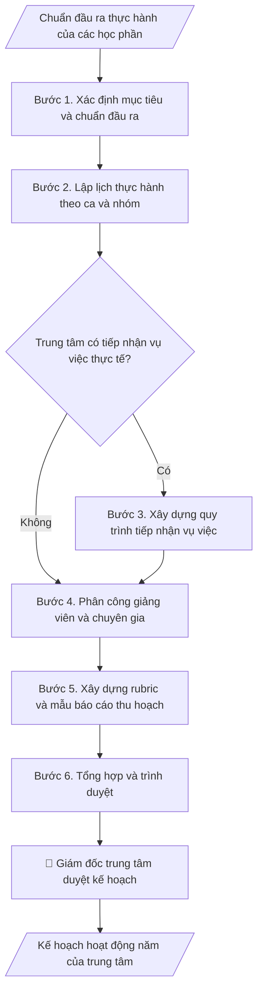

# Kế hoạch hoạt động trung tâm thực hành

## Quy cách đầu ra và thông tin thiếu

Đọc [quy cách và cấu trúc sản phẩm](references/quy-cach-dau-ra.md) trước khi soạn/xuất. File giao chỉ gồm văn bản hoặc sản phẩm nghiệp vụ được yêu cầu; kiểm tra nội bộ không xuất kèm. Thiếu thông tin giữ nguyên trường/mục và chỗ điền theo mẫu gốc (dòng dấu chấm, dấu gạch hoặc ô trống); không tự điền dữ liệu mẫu, số 0, mã chờ xác minh hoặc dòng chờ ký. Mẫu chuyên ngành còn áp dụng được ưu tiên về cấu trúc, mã biểu và người ký. Các trường “bắt buộc” là điều kiện hoàn thiện hồ sơ, không ngăn việc soạn bản có chỗ chừa để điền. Mọi chỉ dẫn “để trống” trong skill được hiểu là không điền dữ liệu và giữ cách chừa chỗ của mẫu gốc, không phải xóa dấu chấm của mẫu.

## Kiểm soát áp dụng và phê duyệt

Trước khi chạy quy trình, xác định `ngay_ap_dung`, `loai_hinh_truong`, `quy_che_noi_bo`, `nguon_du_lieu` và `nguoi_kiem_duyet`. Chỉ yêu cầu thông tin có liên quan đến nghiệp vụ; không dùng giá trị giả định thay dữ liệu bắt buộc. Đối chiếu nội bộ hồ sơ có yếu tố pháp lý với văn bản gốc, hiệu lực, điều khoản áp dụng và chuyển tiếp; không tự đính kèm bảng kiểm tra vào file giao.

## Giới hạn và human gate

AI hỗ trợ chuẩn bị và đối chiếu. Cán bộ phụ trách kiểm tra dữ liệu/căn cứ, người có thẩm quyền duyệt và ký. Văn bản soạn chưa được coi là đã ban hành; không tự chèn nhãn trạng thái kiểm duyệt vào file giao; không đánh dấu đã ký, đã duyệt hoặc đã công bố nếu chưa có chứng cứ. Dữ liệu sinh viên, sức khỏe, nhân sự và tài chính phải hạn chế theo mục đích, phân quyền và che thông tin định danh khi dùng ví dụ. Không tải dữ liệu lên dịch vụ ngoài khi chưa có quyền. Kiểm tra Luật 91/2025/QH15 về bảo vệ dữ liệu cá nhân (hiệu lực 01/01/2026) và quy định áp dụng trước xử lý/chia sẻ dữ liệu cá nhân.

## Khi nào dùng
Đầu năm học, trung tâm thực hành nghề nghiệp của trường (thực hành pháp luật, thực hành sư phạm,
phòng khám, xưởng...) cần lập kế hoạch: lịch thực hành mô phỏng theo học phần, tiếp nhận
vụ việc/ca thực tế, phân công giảng viên hướng dẫn và tiêu chí đánh giá sinh viên.

## Đầu vào (Input)

| Trường | Mô tả | Bắt buộc |
|---|---|---|
| `ten_trung_tam` | Tên trung tâm thực hành | Có |
| `nam_hoc` | Năm học áp dụng | Có |
| `hoc_phan_lien_quan` | Các học phần thực hành gắn với trung tâm | Có |
| `so_luong_sv` | Số SV tham gia thực hành trong năm | Có |
| `giang_vien` | Giảng viên hướng dẫn, chuyên gia thỉnh giảng | Có |
| `co_so_vat_chat` | Phòng mô phỏng, trang thiết bị hiện có | Không |

## Quy trình

**Bước 1. Xác định mục tiêu và chuẩn đầu ra**
- Làm gì: rà soát đề cương các học phần gắn với trung tâm, trích chuẩn đầu ra kỹ năng
  thực hành của từng học phần, quy đổi thành chỉ tiêu đo được (VD: mỗi SV tham gia
  tối thiểu 02 phiên mô phỏng và 01 vụ việc thực tế; tỷ lệ SV đạt chuẩn ≥ 90%).
  Trưởng khoa xác nhận chuẩn đầu ra gắn với CTĐT.
- Dùng input: `ten_trung_tam`, `nam_hoc`, `hoc_phan_lien_quan`.
- Vai trò: Trưởng khoa · AI hỗ trợ: trích chuẩn đầu ra và quy đổi thành chỉ tiêu đo được · ⏱ 1–2 giờ (ước tính)
- Lưu ý nghiệp vụ: chỉ tiêu phải khớp CTĐT đã kiểm định — không tự đặt chuẩn mới;
  không đặt chỉ tiêu vượt năng lực giám sát thực tế của giảng viên (VD: số vụ việc
  thực tế/SV phải tương xứng số giờ giám sát khả dụng).
- → Kết quả bước: bảng mục tiêu – chuẩn đầu ra – chỉ tiêu đo được của từng học phần.

**Bước 2. Lập lịch thực hành**
- Làm gì: chia SV thành ca/nhóm theo `so_luong_sv`; xếp lịch mô phỏng theo tuần của
  từng học kỳ (phiên tòa giả định, ca lâm sàng mô phỏng, vận hành xưởng...) khớp với
  thời khóa biểu chung; phân bổ phòng mô phỏng/trang thiết bị theo `co_so_vat_chat`,
  tính hệ số dự phòng khi trùng lịch.
- Dùng input: `so_luong_sv`, `hoc_phan_lien_quan`, `co_so_vat_chat`.
- Vai trò: Cán bộ Trung tâm Thực hành · AI hỗ trợ: xếp lịch thực hành dự thảo theo ca/nhóm, trung tâm chốt và kiểm tra trùng phòng/thiết bị · ⏱ 2–3 giờ (ước tính)
- Lưu ý nghiệp vụ: sĩ số mỗi nhóm không vượt quy định của học phần; mỗi nhóm phải
  được trải nghiệm đủ các vai trò trong mô phỏng (không để SV chỉ làm khán giả);
  kiểm tra không trùng phòng/thiết bị với đơn vị khác.
- → Kết quả bước: bảng lịch thực hành chi tiết (tuần – ca – nhóm – nội dung –
  phòng/thiết bị).

**Bước 3. Xây dựng quy trình tiếp nhận vụ việc thực tế**
- Làm gì: chỉ thực hiện khi trung tâm có mảng tiếp nhận vụ việc/ca thực tế (VD: tư vấn
  pháp luật miễn phí, khám chữa bệnh thực hành). Thiết kế quy trình: tiếp nhận →
  phân loại (mức độ phức tạp, rủi ro) → phân công SV xử lý dưới sự giám sát trực tiếp
  của giảng viên; kèm phiếu tiếp nhận và biên bản bàn giao vụ việc.
- Dùng input: `ten_trung_tam`, `nam_hoc` (xác định phạm vi áp dụng).
- Vai trò: Giám đốc Trung tâm Thực hành · AI hỗ trợ: soạn quy trình tiếp nhận và biểu mẫu · ⏱ 1–2 giờ (ước tính)
- Lưu ý nghiệp vụ: vụ việc liên quan đến con người/tài sản phải có giảng viên hoặc
  chuyên gia giám sát trực tiếp — tuyệt đối không để SV tự ý tư vấn, quyết định;
  từ chối tiếp nhận vụ việc vượt năng lực của trung tâm và chuyển tuyến phù hợp.
- → Kết quả bước: quy trình tiếp nhận – phân loại – phân công xử lý vụ việc thực tế
  + biểu mẫu phiếu tiếp nhận.

**Bước 4. Phân công giảng viên và chuyên gia hướng dẫn**
- Làm gì: phân công giảng viên phụ trách từng nhóm/ca theo lịch ở Bước 2; xếp lịch
  chuyên gia thỉnh giảng tham gia mô phỏng và phản biện; xác nhận khối lượng giờ
  với Trưởng khoa để tính vào giờ chuẩn giảng dạy.
- Dùng input: `giang_vien`, kết quả lịch thực hành (Bước 2).
- Vai trò: Giảng viên · AI hỗ trợ: lập bảng phân công dự thảo, trung tâm xác nhận và tránh trùng giờ lên lớp · ⏱ 1–2 giờ (ước tính)
- Lưu ý nghiệp vụ: mỗi nhóm/ca phải có giảng viên chịu trách nhiệm chính ghi rõ họ tên;
  chuyên gia thỉnh giảng cần có văn bản mời và xác nhận tham gia trước khi đưa vào
  kế hoạch; tránh phân công trùng giờ lên lớp của giảng viên.
- → Kết quả bước: bảng phân công hướng dẫn (nhóm/ca – giảng viên phụ trách –
  chuyên gia tham gia – thời gian).

**Bước 5. Xây dựng công cụ đánh giá**
- Làm gì: xây dựng rubric chấm kỹ năng thực hành theo chuẩn đầu ra ở Bước 1 (thang
  100 điểm, phân bổ trọng số từng tiêu chí: kỹ năng chuyên môn, soạn thảo/hồ sơ,
  đạo đức nghề nghiệp, báo cáo thu hoạch); thiết kế mẫu báo cáo thu hoạch của SV;
  quy định điều kiện đạt (điểm tối thiểu, số buổi tham gia tối thiểu).
- Dùng input: `hoc_phan_lien_quan`, bảng chuẩn đầu ra (Bước 1).
- Vai trò: Giảng viên · AI hỗ trợ: soạn khung rubric và mẫu báo cáo thu hoạch · ⏱ 1–2 giờ (ước tính)
- Lưu ý nghiệp vụ: rubric phải đo đúng chuẩn đầu ra đã công bố trong đề cương học phần;
  AI chỉ hỗ trợ soạn khung rubric — việc đánh giá năng lực thực hành của SV do giảng
  viên thực hiện; công bố rubric cho SV từ đầu kỳ.
- → Kết quả bước: rubric đánh giá kỹ năng thực hành + mẫu báo cáo thu hoạch của SV.

**Bước 6. Tổng hợp và trình duyệt**
- Làm gì: gộp mục tiêu (Bước 1), lịch (Bước 2), quy trình tiếp nhận (Bước 3, nếu có),
  phân công (Bước 4), công cụ đánh giá (Bước 5) và dự toán kinh phí thành kế hoạch
  hoàn chỉnh; kiểm tra tính khớp nối giữa các phần (lịch – phân công – rubric);
  trình Giám đốc trung tâm phê duyệt, gửi khoa và nhà trường.
- Dùng input: `ten_trung_tam`, `nam_hoc`.
- Vai trò: Giám đốc Trung tâm Thực hành · AI hỗ trợ: gộp kế hoạch và kiểm tra khớp nối các phần · ⏱ 1–2 giờ (ước tính)
- Lưu ý nghiệp vụ: kinh phí dự kiến phải tách rõ nguồn (ngân sách trường, học phí
  thực hành, tài trợ); kế hoạch chỉ có hiệu lực sau khi Giám đốc trung tâm ký duyệt.
- → Kết quả bước: kế hoạch hoạt động năm của trung tâm thực hành (hoàn chỉnh, đã duyệt).

## Luồng quy trình (Workflow)

## Đầu ra

Sản phẩm nghiệp vụ hoàn chỉnh theo [quy cách và cấu trúc](references/quy-cach-dau-ra.md), giữ các trường chưa có dữ liệu ở trạng thái trống. Không xuất kèm checklist/phụ lục kiểm tra đầu ra.

## Kiểm tra nội bộ trước khi giao

- [ ] Bố cục khớp mẫu áp dụng và cấu trúc tại references/quy-cach-dau-ra.md.
- [ ] Nội dung khớp với Input: số lượng SV, giảng viên, học phần, cơ sở vật chất.
- [ ] Không bịa đặt lịch, phân công giảng viên hay chuyên gia thỉnh giảng chưa có xác nhận tham gia.
- [ ] Chuẩn đầu ra khớp CTĐT đã kiểm định (có xác nhận của trưởng khoa); chỉ tiêu đo được.
- [ ] Lịch thực hành: sĩ số nhóm đúng quy định, không trùng phòng/thiết bị với đơn vị khác, mỗi nhóm trải đủ các vai trò.
- [ ] Vụ việc thực tế có giảng viên/chuyên gia giám sát trực tiếp; có cơ chế từ chối vụ việc vượt năng lực trung tâm.
- [ ] Rubric đo đúng chuẩn đầu ra trong đề cương học phần; công bố cho SV từ đầu kỳ.
- [ ] Kinh phí tách rõ nguồn; kế hoạch chỉ có hiệu lực sau khi giám đốc trung tâm ký duyệt.
- [ ] Đã qua Human gate: giám đốc trung tâm phê duyệt kế hoạch, trưởng khoa xác nhận chuẩn đầu ra.

Tiêu chí đạt = tất cả các ô được đánh dấu.

## Human gate
- **Giám đốc trung tâm** phê duyệt kế hoạch và phân công giảng viên.
- **Trưởng khoa** xác nhận chuẩn đầu ra thực hành gắn với CTĐT.
- **Giảng viên hướng dẫn** chịu trách nhiệm chuyên môn đối với vụ việc thực tế do SV xử lý.

## Giới hạn
- AI không thay giảng viên đánh giá năng lực thực hành của SV.
- Vụ việc thực tế liên quan đến con người phải có giảng viên/luật sư giám sát trực tiếp;
  không để SV tự ý tư vấn, quyết định.

## Căn cứ & lưu ý
- Chuẩn đầu ra CTĐT của ngành; quy định về thực hành, thực tập của Bộ GD&ĐT.
- Không dùng tên thật của trường/trung tâm/cá nhân khi mô phỏng.

## Quản trị phiên bản

- Phiên bản gói: `1.2.1`; ngày cập nhật: `2026-10-10`.
- Kho nguồn: https://github.com/phamtruong91/university-skills-framework
- Người duy trì trên GitHub: `phamtruong91` (Phạm Văn Trường). Người phê duyệt nghiệp vụ: **chưa chỉ định**.
- Commit nguồn trước cập nhật: `346719e6b0318ed034b4b016703f79733aa575e7`. Commit chứa phiên bản này xem bằng `git log -1 -- skills/ke-hoach-hoat-dong-trung-tam-thuc-hanh`; không tự gán SHA chưa tạo.
- Giấy phép: theo LICENSE của kho; bản quyền CES Global.
- Lịch sử 1.1.0: bổ sung metadata giao diện, kiểm soát áp dụng, quản trị phiên bản.
- Trạng thái: dự thảo nghiệp vụ; kiểm tra pháp lý trước thực thi. Ngày cập nhật không đồng nghĩa mọi văn bản đã được rà soát toàn văn.
