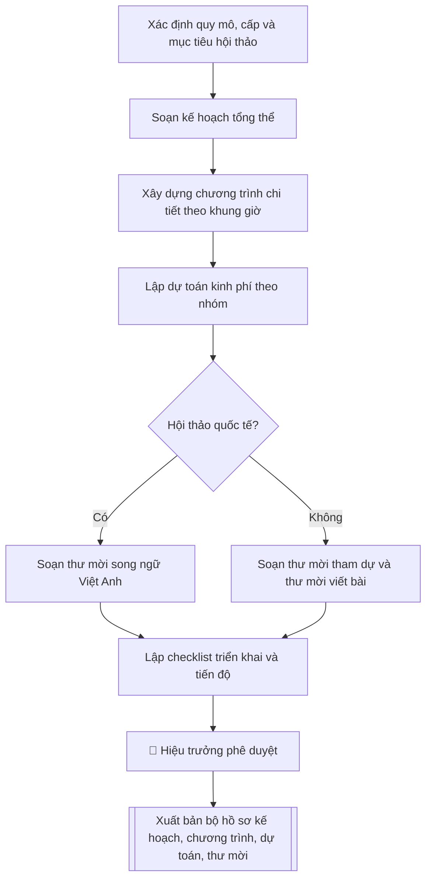

# Kế hoạch tổ chức hội thảo khoa học

## Kiểm soát áp dụng và phê duyệt

Trước khi chạy quy trình, xác định `ngay_ap_dung`, `loai_hinh_truong`, `quy_che_noi_bo`, `nguon_du_lieu` và `nguoi_kiem_duyet`. Chỉ yêu cầu thông tin có liên quan đến nghiệp vụ; không dùng giá trị giả định thay dữ liệu bắt buộc. Hồ sơ có yếu tố pháp lý phải kèm văn bản gốc, tình trạng hiệu lực, điều khoản áp dụng và chuyển tiếp.

## Giới hạn và human gate

AI hỗ trợ chuẩn bị và đối chiếu. Cán bộ phụ trách kiểm tra dữ liệu/căn cứ, người có thẩm quyền duyệt và ký. Mọi đầu ra mặc định là **DỰ THẢO – CHỜ KIỂM DUYỆT**; không đánh dấu đã ký, đã duyệt hoặc đã công bố nếu chưa có chứng cứ. Dữ liệu sinh viên, sức khỏe, nhân sự và tài chính phải hạn chế theo mục đích, phân quyền và che thông tin định danh khi dùng ví dụ. Không tải dữ liệu lên dịch vụ ngoài khi chưa có quyền. Kiểm tra Luật 91/2025/QH15 về bảo vệ dữ liệu cá nhân (hiệu lực 01/01/2026) và quy định áp dụng trước xử lý/chia sẻ dữ liệu cá nhân.


## Khi nào dùng
Khi trường/khoa/phòng được giao hoặc chủ động đề xuất tổ chức hội thảo khoa học
(cấp trường, cấp quốc gia, cấp quốc tế): xây dựng kế hoạch tổng thể, chương trình
chi tiết, dự toán kinh phí và thư mời để trình lãnh đạo phê duyệt và triển khai.

## Đầu vào (Input)

| Trường | Mô tả | Bắt buộc |
|---|---|---|
| `ten_hoi_thao` | Tên hội thảo (tiếng Việt; tiếng Anh nếu hội thảo quốc tế) | Có |
| `cap_hoi_thao` | Cấp Trường / Quốc gia / Quốc tế | Có |
| `chu_de` | Chủ đề và các tiểu ban/phân ban dự kiến | Có |
| `thoi_gian` | Thời gian tổ chức dự kiến (ngày, buổi) | Có |
| `dia_diem` | Địa điểm tổ chức | Có |
| `don_vi_to_chuc` | Đơn vị chủ trì, đơn vị phối hợp | Có |
| `thanh_phan` | Thành phần tham dự dự kiến: số lượng, đối tượng (nhà khoa học, giảng viên, doanh nghiệp...) | Có |
| `chuong_trinh_du_kien` | Các hoạt động chính: khai mạc, báo cáo phiên toàn thể, thảo luận phân ban, bế mạc | Không |
| `nguon_kinh_phi` | Nguồn kinh phí: ngân sách trường, tài trợ, phí tham dự... | Có |
| `yeu_cau_dac_biet` | Kỷ yếu, chỉ số xuất bản, khách mời quốc tế, phiên dịch... | Không |

## Quy trình

**Bước 1. Xác định quy mô, cấp và mục tiêu hội thảo**
- Làm gì: căn cứ `cap_hoi_thao` để chốt số lượng đại biểu mục tiêu, số báo cáo dự kiến, yêu cầu về kỷ yếu (có phản biện hay không, có chỉ số xuất bản ISBN hay không); đối chiếu với `thanh_phan` (đối tượng, số lượng) và `chu_de` (số tiểu ban) để kiểm tra tính khả thi.
- Dùng input: `ten_hoi_thao`, `cap_hoi_thao`, `chu_de`, `thanh_phan`, `yeu_cau_dac_biet`.
- Vai trò: Trưởng Phòng KHCN · AI hỗ trợ: đề xuất quy mô · ⏱ ~45–60 phút (ước tính)
- Lưu ý nghiệp vụ: hội thảo quốc tế cần thêm thư mời song ngữ, thủ tục đón khách quốc tế, phiên dịch, visa; kỷ yếu có ISBN phải đăng ký qua Nhà xuất bản trước ít nhất 30 ngày — nếu `thoi_gian` quá gần mà chưa đăng ký thì phải hạ yêu cầu kỷ yếu xuống bản nội bộ.
- → Kết quả bước: bảng xác định quy mô (cấp hội thảo, số đại biểu mục tiêu, số báo cáo, yêu cầu kỷ yếu, yêu cầu đặc biệt).

**Bước 2. Soạn kế hoạch tổng thể**
- Làm gì: viết dự thảo kế hoạch gồm tên, cấp, chủ đề và các tiểu ban, mục đích – yêu cầu, thời gian, địa điểm, đơn vị chủ trì/phối hợp, thành phần tham dự, nội dung hoạt động; lập tiến độ chuẩn bị với các mốc tính ngược từ ngày tổ chức: ban hành thông báo → hạn nhận bài → phản biện → in kỷ yếu → tổ chức.
- Dùng input: `ten_hoi_thao`, `cap_hoi_thao`, `chu_de`, `thoi_gian`, `dia_diem`, `don_vi_to_chuc`, `thanh_phan`, `chuong_trinh_du_kien`, `yeu_cau_dac_biet`.
- Vai trò: Đơn vị tổ chức · AI hỗ trợ: soạn dự thảo kế hoạch · ⏱ ~1–2 giờ (ước tính)
- Lưu ý nghiệp vụ: hạn nhận bài toàn văn phải cách ngày tổ chức ít nhất 25–30 ngày để kịp phản biện và in kỷ yếu; mốc nào phụ thuộc đơn vị ngoài (nhà in, báo cáo mời) thì cộng thêm thời gian dự phòng.
- → Kết quả bước: dự thảo kế hoạch tổng thể (markdown).

**Bước 3. Xây dựng chương trình chi tiết theo khung giờ**
- Làm gì: xếp lịch từng khung giờ trong ngày tổ chức: đón tiếp, khai mạc, báo cáo mời (keynote), báo cáo phiên toàn thể, thảo luận phân ban song song, giải lao, bế mạc – tổng kết; ghi rõ người điều hành/phụ trách từng phiên.
- Dùng input: `chuong_trinh_du_kien`, `thoi_gian`, `dia_diem`, `thanh_phan`.
- Vai trò: Ban Tổ chức · AI hỗ trợ: xếp chương trình khung giờ · ⏱ ~45–60 phút (ước tính)
- Lưu ý nghiệp vụ: mỗi báo cáo cần thời gian hỏi – đáp (tối thiểu 10 phút/báo cáo); phân ban song song phải bố trí đủ phòng và người điều hành riêng; báo cáo mời nên đặt buổi sáng ngay sau khai mạc.
- → Kết quả bước: bảng chương trình chi tiết theo khung giờ (giờ – nội dung – địa điểm – người phụ trách).

**Bước 4. Lập dự toán kinh phí theo nhóm**
- Làm gì: liệt kê chi phí theo nhóm: in ấn kỷ yếu/tài liệu, thù lao báo cáo mời và phản biện, ăn ở – đi lại đại biểu/khách mời, thuê hội trường – thiết bị, truyền thông, chi quản lý; mỗi khoản ghi số lượng, đơn giá, thành tiền và nguồn chi tương ứng.
- Dùng input: `nguon_kinh_phi`, `thanh_phan`, `chu_de`, `yeu_cau_dac_biet`.
- Vai trò: Kế toán · AI hỗ trợ: lập bảng dự toán · ⏱ ~1–2 giờ (ước tính)
- Lưu ý nghiệp vụ: tổng các khoản phải khớp đúng tỷ lệ nguồn đã khai (ví dụ ngân sách 70% / tài trợ 30%); thù lao báo cáo mời và phản biện phải theo khung quy định hiện hành, không tự đặt mức.
- → Kết quả bước: bảng dự toán kinh phí (khoản mục – số lượng – đơn giá – thành tiền – nguồn kinh phí).

**Bước 5. Soạn thư mời tham dự / thư mời viết bài**
- Làm gì: soạn mẫu thư gồm tên hội thảo, thời gian – địa điểm, chủ đề và tiểu ban, thời hạn gửi bài toàn văn, thể lệ bài viết, thông tin liên hệ của đơn vị tổ chức; nếu hội thảo quốc tế thì soạn thêm bản tiếng Anh.
- Dùng input: `ten_hoi_thao`, `cap_hoi_thao`, `chu_de`, `thoi_gian`, `dia_diem`, `don_vi_to_chuc`.
- Vai trò: Chuyên viên Phòng KHCN · AI hỗ trợ: soạn mẫu thư mời (thêm bản tiếng Anh nếu hội thảo quốc tế) · ⏱ ~20–30 phút (ước tính)
- Lưu ý nghiệp vụ: thời hạn gửi bài trong thư phải khớp mốc tiến độ ở Bước 2; thư mời viết bài và thư mời tham dự là hai mẫu khác nhau — không gộp thể lệ bài viết vào thư mời tham dự.
- → Kết quả bước: mẫu thư mời viết bài và mẫu thư mời tham dự (bản tiếng Việt; thêm bản tiếng Anh nếu hội thảo quốc tế).

**Bước 6. Lập checklist triển khai và tiến độ**
- Làm gì: phân công Ban Tổ chức, Ban Nội dung, Ban Hậu cần – Tài chính với đầu việc và người phụ trách cụ thể; liệt kê các mốc kiểm soát trước ngày tổ chức (duyệt kế hoạch, gửi thư mời, chốt báo cáo mời, ký tài trợ, in kỷ yếu, tổng duyệt hậu cần).
- Dùng input: `thoi_gian`, `don_vi_to_chuc`.
- Vai trò: Ban Tổ chức · AI hỗ trợ: lập checklist triển khai · ⏱ ~30–45 phút (ước tính)
- Lưu ý nghiệp vụ: mỗi mốc phải có người chịu trách nhiệm và ngày chốt cụ thể; các mốc phụ thuộc bên ngoài (tài trợ, báo cáo mời, nhà in) cần mốc dự phòng.
- → Kết quả bước: checklist triển khai (ban – đầu việc – người phụ trách – hạn hoàn thành).

**Bước 7. Rà soát, trình phê duyệt và xuất bản bộ hồ sơ**
- Làm gì: rà soát tính nhất quán toàn bộ (tên hội thảo, ngày, địa điểm, số liệu giữa kế hoạch – chương trình – dự toán – thư mời); trình Hiệu trưởng phê duyệt; xuất bản bộ hồ sơ hoàn chỉnh ở dạng markdown.
- Dùng input: toàn bộ input (đối chiếu chéo).
- Vai trò: Hiệu trưởng · AI hỗ trợ: rà soát nhất quán toàn bộ hồ sơ · ⏱ ~1–2 ngày làm việc (ước tính)
- Lưu ý nghiệp vụ: kiểm tra lần cuối các con số (số đại biểu, tổng dự toán, các mốc thời gian) — sai một con số ở kế hoạch sẽ kéo theo sai ở chương trình và dự toán.
- → Kết quả bước: bộ hồ sơ hoàn chỉnh (kế hoạch + chương trình + dự toán + thư mời + checklist), sẵn sàng trình phê duyệt và triển khai.

## Luồng quy trình (Workflow)


## Đầu ra (Output)
- Kế hoạch tổ chức hội thảo (văn bản hoàn chỉnh).
- Chương trình chi tiết theo khung giờ.
- Bảng dự toán kinh phí theo nhóm nội dung chi.
- Thư mời tham dự / thư mời viết bài (mẫu).
- Checklist triển khai và tiến độ các mốc chuẩn bị.

**Cấu trúc output chuẩn:** khung mẫu cố định của sản phẩm chính — Kế hoạch tổ chức hội thảo
(kèm các sản phẩm triển khai), các phần bắt buộc theo đúng thứ tự:
1. Tiêu đề văn bản: "KẾ HOẠCH TỔ CHỨC HỘI THẢO KHOA HỌC".
2. Khối thông tin định danh: tên hội thảo, cấp hội thảo, đơn vị chủ trì, đơn vị phối hợp, thời gian, địa điểm.
3. I. Mục đích – yêu cầu.
4. II. Nội dung (chủ đề và các tiểu ban).
5. III. Thành phần tham dự (số lượng, đối tượng).
6. IV. Tiến độ chuẩn bị (các mốc: thông báo – nhận bài – phản biện – in kỷ yếu – tổ chức).
7. Chương trình chi tiết theo khung giờ (giờ – nội dung – người phụ trách).
8. Dự toán kinh phí theo nhóm (khoản mục – thành tiền – nguồn kinh phí).
9. Thư mời tham dự / thư mời viết bài (mẫu; thêm bản tiếng Anh nếu hội thảo quốc tế).

## Checklist nghiệm thu
- [ ] Đủ các phần theo "Cấu trúc output chuẩn": tiêu đề văn bản, khối thông tin định danh, mục đích – yêu cầu, nội dung, thành phần, tiến độ, chương trình khung giờ, dự toán, thư mời.
- [ ] Số liệu khớp với Input: tên hội thảo, thời gian, địa điểm, số đại biểu, số tiểu ban, tỷ lệ nguồn kinh phí.
- [ ] Không bịa đặt số liệu, đơn giá, thông tin đối tác/tài trợ.
- [ ] Thể thức văn bản hành chính đúng quy định (tiêu đề, kính gửi, bố cục mục – tiểu mục).
- [ ] Căn cứ pháp lý đầy đủ, còn hiệu lực: quy chế tổ chức hội thảo của Trường, quy định quản lý kinh phí KHCN hiện hành.
- [ ] Đã qua Human gate: Hiệu trưởng phê duyệt kế hoạch trước khi triển khai.
- [ ] Các mốc tiến độ tính ngược hợp lý (nhận bài trước tổ chức ít nhất 25–30 ngày; kỷ yếu ISBN đăng ký trước ít nhất 30 ngày nếu có).
- [ ] Chương trình có thời gian hỏi – đáp cho mỗi báo cáo; dự toán đủ cột số lượng – đơn giá – thành tiền – nguồn kinh phí.
- [ ] Thư mời viết bài và thư mời tham dự là hai mẫu riêng; hội thảo quốc tế có bản tiếng Anh.

Tiêu chí đạt = tất cả các ô được đánh dấu.

## Ví dụ mô phỏng (dữ liệu giả lập)

> Tất cả tên trường, cá nhân, số liệu dưới đây đều là **giả lập**, không liên quan
> tổ chức/cá nhân có thật.

### Input mẫu

| Trường | Giá trị |
|---|---|
| `ten_hoi_thao` | Hội thảo khoa học "Trí tuệ nhân tạo trong giáo dục đại học" |
| `cap_hoi_thao` | Quốc gia |
| `chu_de` | 3 tiểu ban: (1) AI trong dạy – học; (2) AI trong quản trị đại học; (3) Đạo đức và chính sách AI |
| `thoi_gian` | Ngày 15/11/2026 (1 ngày) |
| `dia_diem` | Hội trường A, Trường Đại học A, thành phố C |
| `don_vi_to_chuc` | Chủ trì: Phòng KHCN; phối hợp: Khoa CNTT, Khoa Giáo dục |
| `thanh_phan` | 150 đại biểu: nhà khoa học, giảng viên các trường ĐH, đại diện doanh nghiệp công nghệ |
| `nguon_kinh_phi` | Ngân sách trường 70%, tài trợ doanh nghiệp 30% |

### Output mẫu

```
KẾ HOẠCH TỔ CHỨC HỘI THẢO KHOA HỌC
Tên hội thảo: "Trí tuệ nhân tạo trong giáo dục đại học"
Cấp: Quốc gia
Đơn vị chủ trì: Phòng Khoa học công nghệ – Trường Đại học A
Đơn vị phối hợp: Khoa Công nghệ thông tin, Khoa Giáo dục
Thời gian: Ngày 15/11/2026 | Địa điểm: Hội trường A, thành phố C

I. MỤC ĐÍCH – YÊU CẦU
- Tạo diễn đàn trao đổi học thuật về ứng dụng AI trong giáo dục đại học.
- Công bố kỷ yếu có phản biện, 40–50 bài báo cáo.
- Yêu cầu: tổ chức trang trọng, đúng tiến độ, đảm bảo chất lượng nội dung.

II. NỘI DUNG
- Tiểu ban 1: AI trong dạy – học
- Tiểu ban 2: AI trong quản trị đại học
- Tiểu ban 3: Đạo đức và chính sách AI

III. THÀNH PHẦN: 150 đại biểu (nhà khoa học, giảng viên, doanh nghiệp).

IV. TIẾN ĐỘ CHUẨN BỊ
- 20/09/2026: Ban hành thông báo và thư mời viết bài
- 20/10/2026: Hạn nhận bài toàn văn
- 30/10/2026: Hoàn thành phản biện và thông báo kết quả
- 10/11/2026: In kỷ yếu, hoàn tất hậu cần
- 15/11/2026: Tổ chức hội thảo

CHƯƠNG TRÌNH CHI TIẾT (15/11/2026)
08:00 – 08:30  Đón tiếp đại biểu
08:30 – 09:00  Khai mạc, phát biểu chào mừng
09:00 – 10:00  Báo cáo mời (keynote): GS.TS. Phạm Văn B
10:00 – 10:20  Giải lao
10:20 – 11:50  Báo cáo phiên toàn thể (3 báo cáo)
11:50 – 13:30  Nghỉ trưa
13:30 – 15:30  Thảo luận 3 tiểu ban song song
15:30 – 16:00  Giải lao
16:00 – 16:45  Tổng kết tiểu ban, thảo luận chung
16:45 – 17:00  Bế mạc, trao giấy chứng nhận

DỰ TOÁN KINH PHÍ (tổng: 180.000.000đ)
- In kỷ yếu và tài liệu: 45.000.000đ
- Thù lao báo cáo mời, phản biện: 35.000.000đ
- Ăn ở, đi lại đại biểu/khách mời: 50.000.000đ
- Hội trường, thiết bị, truyền thông: 30.000.000đ
- Chi quản lý: 20.000.000đ
Nguồn: ngân sách trường 70% (126.000.000đ), tài trợ 30% (54.000.000đ).

THƯ MỜI VIẾT BÀI (trích)
Kính gửi Quý nhà khoa học,
Trường Đại học A tổ chức Hội thảo khoa học quốc gia "Trí tuệ nhân
tạo trong giáo dục đại học" vào ngày 15/11/2026 tại thành phố C. Trân trọng kính
mời Quý vị gửi bài toàn văn trước ngày 20/10/2026 về địa chỉ
khcn@dha.edu.vn (địa chỉ giả lập). Bài được chấp nhận sẽ đăng trong
kỷ yếu hội thảo có phản biện.
```

### Checklist triển khai (output kèm theo)
- [x] Kế hoạch tổng thể trình Hiệu trưởng phê duyệt
- [x] Thành lập Ban Tổ chức, Ban Nội dung, Ban Hậu cần – Tài chính
- [x] Thư mời viết bài gửi trước 20/09/2026
- [x] Chương trình chi tiết theo khung giờ
- [x] Dự toán kinh phí theo nguồn (ngân sách + tài trợ)
- [!] Xác nhận keynote GS.TS. Phạm Văn B — đang liên hệ
- [!] Hợp đồng tài trợ doanh nghiệp — đang đàm phán

## Căn cứ & lưu ý
- Quy chế tổ chức hội thảo, hội nghị khoa học của Trường Đại học A
  và quy định quản lý kinh phí KHCN hiện hành.
- Hội thảo quốc tế cần thêm: thư mời song ngữ, thủ tục đón khách quốc tế,
  phiên dịch, visa (nếu cần).
- Kỷ yếu có chỉ số xuất bản (ISBN) phải đăng ký và biên tập theo quy định
  xuất bản phẩm.
- Không dùng tên thật của trường/cá nhân khi mô phỏng.

## Quản trị phiên bản

- Phiên bản gói: `1.1.0`; ngày cập nhật: `2026-10-09`.
- Kho nguồn: https://github.com/phamtruong91/dh-skills
- Người duy trì trên GitHub: `phamtruong91` (Phạm Văn Trường). Người phê duyệt nghiệp vụ: **chưa chỉ định**.
- Commit nguồn trước cập nhật: `78fd1d51b8acd1a724d9b9af6c488460bc7551ad`. Commit chứa phiên bản này xem bằng `git log -1 -- skills/ke-hoach-hoi-thao-khoa-hoc`; không tự gán SHA chưa tạo.
- Giấy phép: theo LICENSE của kho; bản quyền CES Global.
- Lịch sử 1.1.0: bổ sung metadata giao diện, kiểm soát áp dụng, quản trị phiên bản.
- Trạng thái: dự thảo nghiệp vụ; kiểm tra pháp lý trước thực thi. Ngày cập nhật không đồng nghĩa mọi văn bản đã được rà soát toàn văn.
