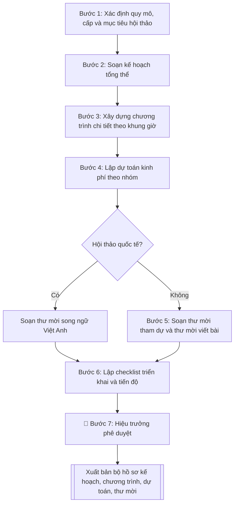

# Kế hoạch tổ chức hội thảo khoa học

## Định dạng và file đầu ra

Định dạng đầu ra có thể chọn theo sản phẩm/yêu cầu: .docx, .pdf. Đọc mục “Định dạng bổ sung” trong quy cách đầu ra trước khi chọn.

**Phải tạo file thực tế để tải xuống, không chỉ trả nội dung trong chat.** Định dạng mặc định của skill: **.docx**. Nếu có bảng số liệu nghiệp vụ yêu cầu file bảng tính riêng, tạo thêm Excel theo yêu cầu; không tự tạo file kiểm tra. Không chờ người dùng yêu cầu xuất file lần nữa. Ưu tiên định dạng người dùng chỉ định; đọc quy tắc xuất file tại references/quy-cach-dau-ra.md.

## Quy cách đầu ra và thông tin thiếu
Khi dựng file Word/Excel, áp dụng mục “Thể thức và bảng biểu khi dựng file” trong quy cách đầu ra (cỡ chữ từng thành phần, bảng nhiều trang, số trang, phụ lục). Đọc [quy cách và cấu trúc sản phẩm](references/quy-cach-dau-ra.md) trước khi soạn/xuất. File giao chỉ gồm sản phẩm nghiệp vụ được yêu cầu; kiểm tra nội bộ không xuất kèm. Thiếu thông tin thì giữ nguyên trường/mục và chỗ điền theo mẫu gốc (dòng dấu chấm, dấu gạch hoặc ô trống); không tự điền dữ liệu mẫu, số 0, mã chờ xác minh hay dòng chờ ký. Mẫu chuyên ngành còn áp dụng được ưu tiên về cấu trúc, mã biểu và người ký. Bản đầy đủ: [quy tắc chung](references/quy-tac-chung.md).

Khi người dùng yêu cầu bộ slide (.pptx), đọc mục “Xuất PowerPoint (.pptx) khi được yêu cầu” trong quy cách đầu ra.

## Kiểm soát áp dụng và phê duyệt
Trước khi chạy, xác định `ngay_ap_dung`, `loai_hinh_truong`, `quy_che_noi_bo`, `nguon_du_lieu`, `nguoi_kiem_duyet`; chỉ hỏi thông tin liên quan nghiệp vụ, không dùng giá trị giả định thay dữ liệu bắt buộc. Đối chiếu căn cứ pháp lý với văn bản gốc, hiệu lực, điều khoản áp dụng và chuyển tiếp. Bản đầy đủ: [quy tắc chung](references/quy-tac-chung.md).

## Giới hạn và human gate
AI hỗ trợ chuẩn bị và đối chiếu; cán bộ phụ trách kiểm tra dữ liệu/căn cứ, người có thẩm quyền duyệt và ký. Không đánh dấu đã ký, đã duyệt, đã công bố khi chưa có chứng cứ. Dữ liệu sinh viên, sức khỏe, nhân sự, tài chính chỉ dùng theo mục đích và phân quyền, che thông tin định danh khi dùng ví dụ (Luật 91/2025/QH15, hiệu lực 01/01/2026); không tải dữ liệu lên dịch vụ ngoài khi chưa có quyền. Bản đầy đủ: [quy tắc chung](references/quy-tac-chung.md).

## Khi nào dùng
Khi trường/khoa/phòng được giao hoặc chủ động đề xuất tổ chức hội thảo khoa học
(cấp trường, cấp quốc gia, cấp quốc tế): xây dựng kế hoạch tổng thể, chương trình
chi tiết, dự toán kinh phí và thư mời để trình lãnh đạo phê duyệt và triển khai.

## Đầu vào (Input)

| Trường | Mô tả | Bắt buộc |
|---|---|---|
| `ten_hoi_thao` | Tên hội thảo (tiếng Việt; tiếng Anh nếu hội thảo quốc tế) | Có |
| `cap_hoi_thao` | Cấp Trường / Quốc gia / Quốc tế | Có |
| `chu_de` | Chủ đề và các tiểu ban/phân ban dự kiến | Có |
| `thoi_gian` | Thời gian tổ chức dự kiến (ngày, buổi) | Có |
| `dia_diem` | Địa điểm tổ chức | Có |
| `don_vi_to_chuc` | Đơn vị chủ trì, đơn vị phối hợp | Có |
| `thanh_phan` | Thành phần tham dự dự kiến: số lượng, đối tượng (nhà khoa học, giảng viên, doanh nghiệp...) | Có |
| `chuong_trinh_du_kien` | Các hoạt động chính: khai mạc, báo cáo phiên toàn thể, thảo luận phân ban, bế mạc | Không |
| `nguon_kinh_phi` | Nguồn kinh phí: ngân sách trường, tài trợ, phí tham dự... | Có |
| `yeu_cau_dac_biet` | Kỷ yếu, chỉ số xuất bản, khách mời quốc tế, phiên dịch... | Không |

## Quy trình

**Bước 1. Xác định quy mô, cấp và mục tiêu hội thảo**
- Làm gì: căn cứ `cap_hoi_thao` để chốt số lượng đại biểu mục tiêu, số báo cáo dự kiến, yêu cầu về kỷ yếu (có phản biện hay không, có chỉ số xuất bản ISBN hay không); đối chiếu với `thanh_phan` (đối tượng, số lượng) và `chu_de` (số tiểu ban) để kiểm tra tính khả thi.
- Dùng input: `ten_hoi_thao`, `cap_hoi_thao`, `chu_de`, `thanh_phan`, `yeu_cau_dac_biet`.
- Vai trò: Trưởng Phòng KHCN · AI hỗ trợ: đề xuất quy mô · ⏱ ~45–60 phút (ước tính)
- Lưu ý nghiệp vụ: hội thảo quốc tế cần thêm thư mời song ngữ, thủ tục đón khách quốc tế, phiên dịch, visa; kỷ yếu có ISBN phải đăng ký qua Nhà xuất bản trước ít nhất 30 ngày — nếu `thoi_gian` quá gần mà chưa đăng ký thì phải hạ yêu cầu kỷ yếu xuống bản nội bộ.
- → Kết quả bước: bảng xác định quy mô (cấp hội thảo, số đại biểu mục tiêu, số báo cáo, yêu cầu kỷ yếu, yêu cầu đặc biệt).

**Bước 2. Soạn kế hoạch tổng thể**
- Làm gì: viết dự thảo kế hoạch gồm tên, cấp, chủ đề và các tiểu ban, mục đích – yêu cầu, thời gian, địa điểm, đơn vị chủ trì/phối hợp, thành phần tham dự, nội dung hoạt động; lập tiến độ chuẩn bị với các mốc tính ngược từ ngày tổ chức: ban hành thông báo → hạn nhận bài → phản biện → in kỷ yếu → tổ chức.
- Dùng input: `ten_hoi_thao`, `cap_hoi_thao`, `chu_de`, `thoi_gian`, `dia_diem`, `don_vi_to_chuc`, `thanh_phan`, `chuong_trinh_du_kien`, `yeu_cau_dac_biet`.
- Vai trò: Đơn vị tổ chức · AI hỗ trợ: soạn dự thảo kế hoạch · ⏱ ~1–2 giờ (ước tính)
- Lưu ý nghiệp vụ: hạn nhận bài toàn văn phải cách ngày tổ chức ít nhất 25–30 ngày để kịp phản biện và in kỷ yếu; mốc nào phụ thuộc đơn vị ngoài (nhà in, báo cáo mời) thì cộng thêm thời gian dự phòng.
- → Kết quả bước: dự thảo kế hoạch tổng thể.

**Bước 3. Xây dựng chương trình chi tiết theo khung giờ**
- Làm gì: xếp lịch từng khung giờ trong ngày tổ chức: đón tiếp, khai mạc, báo cáo mời (keynote), báo cáo phiên toàn thể, thảo luận phân ban song song, giải lao, bế mạc – tổng kết; ghi rõ người điều hành/phụ trách từng phiên.
- Dùng input: `chuong_trinh_du_kien`, `thoi_gian`, `dia_diem`, `thanh_phan`.
- Vai trò: Ban Tổ chức · AI hỗ trợ: xếp chương trình khung giờ · ⏱ ~45–60 phút (ước tính)
- Lưu ý nghiệp vụ: mỗi báo cáo cần thời gian hỏi – đáp (tối thiểu 10 phút/báo cáo); phân ban song song phải bố trí đủ phòng và người điều hành riêng; báo cáo mời nên đặt buổi sáng ngay sau khai mạc.
- → Kết quả bước: bảng chương trình chi tiết theo khung giờ (giờ – nội dung – địa điểm – người phụ trách).

**Bước 4. Lập dự toán kinh phí theo nhóm**
- Làm gì: liệt kê chi phí theo nhóm: in ấn kỷ yếu/tài liệu, thù lao báo cáo mời và phản biện, ăn ở – đi lại đại biểu/khách mời, thuê hội trường – thiết bị, truyền thông, chi quản lý; mỗi khoản ghi số lượng, đơn giá, thành tiền và nguồn chi tương ứng.
- Dùng input: `nguon_kinh_phi`, `thanh_phan`, `chu_de`, `yeu_cau_dac_biet`.
- Vai trò: Kế toán · AI hỗ trợ: lập bảng dự toán · ⏱ ~1–2 giờ (ước tính)
- Lưu ý nghiệp vụ: tổng các khoản phải khớp đúng tỷ lệ nguồn đã khai (ví dụ ngân sách 70% / tài trợ 30%); thù lao báo cáo mời và phản biện phải theo khung quy định hiện hành, không tự đặt mức.
- → Kết quả bước: bảng dự toán kinh phí (khoản mục – số lượng – đơn giá – thành tiền – nguồn kinh phí).

**Bước 5. Soạn thư mời tham dự / thư mời viết bài**
- Làm gì: soạn mẫu thư gồm tên hội thảo, thời gian – địa điểm, chủ đề và tiểu ban, thời hạn gửi bài toàn văn, thể lệ bài viết, thông tin liên hệ của đơn vị tổ chức; nếu hội thảo quốc tế thì soạn thêm bản tiếng Anh.
- Dùng input: `ten_hoi_thao`, `cap_hoi_thao`, `chu_de`, `thoi_gian`, `dia_diem`, `don_vi_to_chuc`.
- Vai trò: Chuyên viên Phòng KHCN · AI hỗ trợ: soạn mẫu thư mời (thêm bản tiếng Anh nếu hội thảo quốc tế) · ⏱ ~20–30 phút (ước tính)
- Lưu ý nghiệp vụ: thời hạn gửi bài trong thư phải khớp mốc tiến độ ở Bước 2; thư mời viết bài và thư mời tham dự là hai mẫu khác nhau — không gộp thể lệ bài viết vào thư mời tham dự.
- → Kết quả bước: mẫu thư mời viết bài và mẫu thư mời tham dự (bản tiếng Việt; thêm bản tiếng Anh nếu hội thảo quốc tế).

**Bước 6. Lập checklist triển khai và tiến độ**
- Làm gì: phân công Ban Tổ chức, Ban Nội dung, Ban Hậu cần – Tài chính với đầu việc và người phụ trách cụ thể; liệt kê các mốc kiểm soát trước ngày tổ chức (duyệt kế hoạch, gửi thư mời, chốt báo cáo mời, ký tài trợ, in kỷ yếu, tổng duyệt hậu cần).
- Dùng input: `thoi_gian`, `don_vi_to_chuc`.
- Vai trò: Ban Tổ chức · AI hỗ trợ: lập checklist triển khai · ⏱ ~30–45 phút (ước tính)
- Lưu ý nghiệp vụ: mỗi mốc phải có người chịu trách nhiệm và ngày chốt cụ thể; các mốc phụ thuộc bên ngoài (tài trợ, báo cáo mời, nhà in) cần mốc dự phòng.
- → Kết quả bước: checklist triển khai (ban – đầu việc – người phụ trách – hạn hoàn thành).

**Bước 7. Rà soát, trình phê duyệt và xuất bản bộ hồ sơ**
- Làm gì: rà soát tính nhất quán toàn bộ (tên hội thảo, ngày, địa điểm, số liệu giữa kế hoạch – chương trình – dự toán – thư mời); trình Hiệu trưởng phê duyệt; xuất bản bộ hồ sơ hoàn chỉnh file theo định dạng đầu ra của skill.
- Dùng input: toàn bộ input (đối chiếu chéo).
- Vai trò: Hiệu trưởng · AI hỗ trợ: rà soát nhất quán toàn bộ hồ sơ · ⏱ ~1–2 ngày làm việc (ước tính)
- Lưu ý nghiệp vụ: kiểm tra lần cuối các con số (số đại biểu, tổng dự toán, các mốc thời gian) — sai một con số ở kế hoạch sẽ kéo theo sai ở chương trình và dự toán.
- → Kết quả bước: bộ hồ sơ hoàn chỉnh (kế hoạch + chương trình + dự toán + thư mời + checklist), sẵn sàng trình phê duyệt và triển khai.

## Luồng quy trình (Workflow)

## Đầu ra

File nghiệp vụ thực tế theo định dạng mặc định ở đầu skill hoặc định dạng người dùng yêu cầu, kèm liên kết tải trong phản hồi cuối.

Sản phẩm nghiệp vụ hoàn chỉnh theo [quy cách và cấu trúc](references/quy-cach-dau-ra.md), giữ các trường chưa có dữ liệu ở trạng thái trống. Không xuất kèm checklist/phụ lục kiểm tra đầu ra.

## Kiểm tra nội bộ trước khi giao
- [ ] Bố cục khớp mẫu áp dụng và cấu trúc tại references/quy-cach-dau-ra.md.
- [ ] Số liệu khớp với Input: tên hội thảo, thời gian, địa điểm, số đại biểu, số tiểu ban, tỷ lệ nguồn kinh phí.
- [ ] Không bịa đặt số liệu, đơn giá, thông tin đối tác/tài trợ.
- [ ] Thể thức văn bản hành chính đúng quy định (tiêu đề, kính gửi, bố cục mục – tiểu mục).
- [ ] Căn cứ pháp lý đầy đủ, còn hiệu lực: quy chế tổ chức hội thảo của Trường, quy định quản lý kinh phí KHCN hiện hành.
- [ ] Đã qua Human gate: Hiệu trưởng phê duyệt kế hoạch trước khi triển khai.
- [ ] Các mốc tiến độ tính ngược hợp lý (nhận bài trước tổ chức ít nhất 25–30 ngày; kỷ yếu ISBN đăng ký trước ít nhất 30 ngày nếu có).
- [ ] Chương trình có thời gian hỏi – đáp cho mỗi báo cáo; dự toán đủ cột số lượng – đơn giá – thành tiền – nguồn kinh phí.
- [ ] Thư mời viết bài và thư mời tham dự là hai mẫu riêng; hội thảo quốc tế có bản tiếng Anh.

Tiêu chí đạt = tất cả các ô được đánh dấu.

## Căn cứ & lưu ý
- Quy chế tổ chức hội thảo, hội nghị khoa học của Trường Đại học A
  và quy định quản lý kinh phí KHCN hiện hành.
- Hội thảo quốc tế cần thêm: thư mời song ngữ, thủ tục đón khách quốc tế,
  phiên dịch, visa (nếu cần).
- Kỷ yếu có chỉ số xuất bản (ISBN) phải đăng ký và biên tập theo quy định
  xuất bản phẩm.
- Không dùng tên thật của trường/cá nhân khi mô phỏng.

## Quản trị phiên bản
- Phiên bản gói `1.3.2` (cập nhật 2026-10-10); hồ sơ đầy đủ tại [references/version.json](references/version.json).
- Người phê duyệt nghiệp vụ: **chưa chỉ định**. Trạng thái: dự thảo nghiệp vụ; kiểm tra pháp lý trước thực thi. Ngày cập nhật không đồng nghĩa mọi văn bản đã được rà soát toàn văn.
- Giấy phép theo LICENSE của kho (bản quyền CES Global). Lịch sử thay đổi: CHANGELOG.md.
