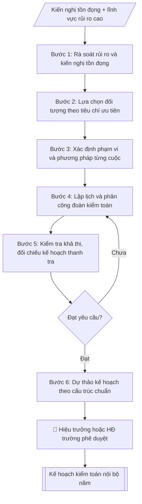

# Skill: Lập kế hoạch kiểm toán nội bộ

## Khi nào dùng
Đầu mỗi năm (hoặc đầu nhiệm kỳ), khi Ban Thanh tra, Pháp chế và Kiểm toán nội bộ cần xây dựng
kế hoạch kiểm toán nội bộ năm để trình Hiệu trưởng (hoặc Hội đồng trường) phê duyệt và tổ chức thực hiện.

## Đầu vào (Input)

| Trường | Mô tả | Bắt buộc |
|---|---|---|
| `nam_ke_hoach` | Năm thực hiện kiểm toán | Có |
| `doi_tuong_kiem_toan` | Danh sách đơn vị/hoạt động dự kiến kiểm toán (VD: thu học phí, mua sắm, đề tài NCKH) | Có |
| `tieu_chi_uu_tien` | Tiêu chí lựa chọn: rủi ro cao, kiến nghị tồn đọng, luân phiên bao phủ | Không |
| `nguon_luc` | Nhân sự kiểm toán, thời gian, kinh phí dự kiến | Có |
| `don_vi_chu_tri` | Ban Thanh tra, Pháp chế và Kiểm toán nội bộ | Có |

## Quy trình

**Bước 1. Rà soát rủi ro và kiến nghị tồn đọng**
- Làm gì: tổng hợp kiến nghị kiểm toán/kiểm tra các năm trước còn tồn đọng (chưa khắc phục); xác định các lĩnh vực rủi ro cao (tài chính, mua sắm, tuyển sinh, quản lý văn bằng, đề tài NCKH); lập bảng rủi ro sơ bộ theo lĩnh vực.
- Dùng input: `doi_tuong_kiem_toan` (danh mục sơ bộ để rà soát), `tieu_chi_uu_tien`.
- Vai trò: Chuyên viên Phòng Thanh tra – Pháp chế · AI hỗ trợ: tổng hợp, chuẩn hóa dữ liệu, đối chiếu tự động, cảnh báo sai lệch · ⏱ ~1–2 giờ (ước tính)
- Lưu ý nghiệp vụ: ưu tiên đối tượng có kiến nghị tồn đọng nhiều kỳ; lĩnh vực chưa được kiểm toán trong 3–5 năm phải được xem xét theo nguyên tắc luân phiên bao phủ.
- → Kết quả bước: Bảng rủi ro – kiến nghị tồn đọng theo lĩnh vực.

**Bước 2. Lựa chọn đối tượng kiểm toán**
- Làm gì: áp tiêu chí ưu tiên (mức độ rủi ro, tính trọng yếu, luân phiên bao phủ 3–5 năm) vào bảng rủi ro Bước 1 để chốt danh sách các cuộc kiểm toán trong năm; mỗi cuộc ghi rõ lý do lựa chọn.
- Dùng input: `tieu_chi_uu_tien`, `doi_tuong_kiem_toan`.
- Vai trò: Chuyên viên Phòng Thanh tra – Pháp chế · AI hỗ trợ: tính toán, phân tích số liệu · ⏱ ~30–90 phút (ước tính)
- Lưu ý nghiệp vụ: số cuộc phải phù hợp với nguồn lực; ghi rõ căn cứ lựa chọn để giải trình khi trình duyệt.
- → Kết quả bước: Danh mục cuộc kiểm toán đã chốt (đối tượng – lý do lựa chọn).

**Bước 3. Xác định phạm vi và phương pháp từng cuộc**
- Làm gì: với từng cuộc kiểm toán: xác định thời kỳ kiểm toán, nội dung kiểm tra trọng tâm; chọn phương pháp: kiểm tra chứng từ, đối chiếu sổ sách, phỏng vấn, kiểm tra thực tế chọn mẫu theo mức độ rủi ro.
- Dùng input: `doi_tuong_kiem_toan`.
- Vai trò: Chuyên viên Phòng Thanh tra – Pháp chế · AI hỗ trợ: đối chiếu tự động, cảnh báo sai lệch · ⏱ ~0,5–1 ngày làm việc (ước tính)
- Lưu ý nghiệp vụ: phạm vi phải đủ rộng để bao phủ rủi ro đã xác định nhưng vừa sức nguồn lực; chọn mẫu phải có cơ sở (rủi ro cao → cỡ mẫu lớn).
- → Kết quả bước: Bảng phạm vi – phương pháp của từng cuộc.

**Bước 4. Lập lịch và phân công đoàn kiểm toán**
- Làm gì: gán thời gian thực hiện (quý/tháng) cho từng cuộc; chỉ định trưởng đoàn và thành viên đoàn; xác định thời hạn hoàn thành báo cáo của từng cuộc.
- Dùng input: `nguon_luc`, `don_vi_chu_tri`.
- Vai trò: Trưởng phòng Thanh tra – Pháp chế (phân công đoàn kiểm toán) · AI hỗ trợ: xử lý sơ bộ, tổng hợp · ⏱ ~30–60 phút (ước tính)
- Lưu ý nghiệp vụ: không để kiểm toán viên kiểm toán đơn vị mình đang công tác; giãn lịch tránh dồn nhiều cuộc vào cùng thời điểm.
- → Kết quả bước: Lịch triển khai + phân công đoàn kiểm toán.

**Bước 5. Kiểm tra khả thi và đối chiếu kế hoạch thanh tra**
- Làm gì: kiểm tra 3 điểm: nguồn lực có đủ cho toàn bộ các cuộc không; có trùng lặp đối tượng/thời gian với kế hoạch thanh tra nội bộ năm không; độ bao phủ rủi ro đã đủ chưa; nếu chưa đạt thì quay lại điều chỉnh Bước 2–4.
- Dùng input: `nguon_luc`.
- Vai trò: Chuyên viên Phòng Thanh tra – Pháp chế · AI hỗ trợ: đối chiếu tự động, cảnh báo sai lệch · ⏱ ~1–2 giờ (ước tính)
- Lưu ý nghiệp vụ: trùng lặp với thanh tra gây lãng phí nguồn lực và phiền hà cho đơn vị → phải loại trừ trước khi trình duyệt.
- → Kết quả bước: Phiếu kiểm tra khả thi (đạt / chưa đạt + nội dung điều chỉnh).

**Bước 6. Dự thảo kế hoạch theo cấu trúc chuẩn**
- Làm gì: soạn văn bản kế hoạch: I. Căn cứ; II. Mục tiêu; III. Đối tượng, phạm vi và thời gian (bảng); IV. Phương pháp; V. Tổ chức thực hiện; kèm phụ lục danh mục các cuộc kiểm toán.
- Dùng input: `nam_ke_hoach`, `don_vi_chu_tri`, `nguon_luc`.
- Vai trò: Chuyên viên Phòng Thanh tra – Pháp chế · AI hỗ trợ: soạn dự thảo · ⏱ ~30–60 phút (ước tính)
- Lưu ý nghiệp vụ: số liệu giữa văn bản và phụ lục phải khớp nhau; thẩm quyền phê duyệt: Hiệu trưởng hoặc Hội đồng trường.
- → Kết quả bước: Dự thảo Kế hoạch kiểm toán nội bộ năm.

**Bước 7. Trình phê duyệt và công bố**
- Làm gì: trình Hiệu trưởng (hoặc Hội đồng trường) phê duyệt; công bố kế hoạch cho các đơn vị được kiểm toán biết để phối hợp; lưu hồ sơ.
- Dùng input: (kết quả Bước 6).
- Vai trò: Chuyên viên Phòng Thanh tra – Pháp chế (chuẩn bị hồ sơ trình); Hiệu trưởng (người ký) ban hành · AI hỗ trợ: chuẩn bị hồ sơ trình đầy đủ, lưu trữ hồ sơ · ⏱ ~1–3 giờ (ước tính)
- Lưu ý nghiệp vụ: Trưởng Ban soát xét toàn bộ kế hoạch trước khi trình; điều chỉnh giữa năm phải trình phê duyệt lại.
- → Kết quả bước: Kế hoạch kiểm toán nội bộ năm đã phê duyệt.

## Luồng quy trình (Workflow)


```

## Đầu ra (Output)
- Kế hoạch kiểm toán nội bộ năm hoàn chỉnh (markdown), sẵn sàng trình ký.
- Phụ lục: danh mục các cuộc kiểm toán (đối tượng, thời kỳ, thời gian, trưởng đoàn).

**Cấu trúc output chuẩn:** Kế hoạch kiểm toán nội bộ năm gồm các phần bắt buộc theo đúng thứ tự sau:
1. Phần đầu: quốc hiệu – tiêu ngữ, tên ban (Ban Thanh tra, Pháp chế và Kiểm toán nội bộ), số/ký hiệu, địa danh – ngày tháng, tên văn bản "KẾ HOẠCH Kiểm toán nội bộ năm ...".
2. I. Căn cứ (quy chế kiểm toán nội bộ, kết quả kiểm toán năm trước và kiến nghị tồn đọng).
3. II. Mục tiêu.
4. III. Đối tượng, phạm vi và thời gian: bảng STT – Cuộc kiểm toán – Đơn vị được kiểm toán – Thời kỳ kiểm toán – Thời gian thực hiện – Trưởng đoàn.
5. IV. Phương pháp.
6. V. Tổ chức thực hiện (nhân sự, kinh phí, trách nhiệm các bên, thời hạn báo cáo kết quả).
7. Phụ lục: danh mục các cuộc kiểm toán.
8. Phần cuối: nơi nhận, chữ ký người phê duyệt.

## Checklist nghiệm thu

- [ ] Đủ các phần theo "Cấu trúc output chuẩn": Phần đầu; I. Căn cứ (quy chế kiểm toán nội bộ, kết quả…; II. Mục tiêu.; III. Đối tượng, phạm vi và thời gian; IV. Phương pháp.; V. Tổ chức thực hiện (nhân sự, kinh phí,…; …
- [ ] Có đầy đủ sản phẩm: Kế hoạch kiểm toán nội bộ năm hoàn chỉnh (markdown), sẵn sàng trình ký
- [ ] Có đầy đủ sản phẩm: Phụ lục: danh mục các cuộc kiểm toán (đối tượng, thời kỳ, thời gian, trưởng đoàn)
- [ ] Mọi số liệu, tên, ngày tháng trong output khớp với Input đã cung cấp (không thêm bớt, không suy đoán)
- [ ] Không bịa đặt số liệu, minh chứng, trích dẫn hay căn cứ
- [ ] Đúng thể thức, định dạng văn bản theo quy định hiện hành
- [ ] Căn cứ pháp lý nêu đầy đủ, còn hiệu lực tại thời điểm lập
- [ ] Đã qua Human gate: người có thẩm quyền đã kiểm tra/ký duyệt trước khi phát hành
- [ ] Ưu tiên đối tượng có kiến nghị tồn đọng nhiều kỳ
- [ ] Số cuộc phải phù hợp với nguồn lực

> Tiêu chí đạt: tất cả các ô đều được đánh dấu.

## Ví dụ mô phỏng (dữ liệu giả lập)

> Tất cả tên trường, cá nhân, số liệu dưới đây đều là **giả lập**, không liên quan tổ chức/cá nhân có thật.

### Input mẫu

| Trường | Giá trị |
|---|---|
| `nam_ke_hoach` | 2027 |
| `doi_tuong_kiem_toan` | 1. Thu, quản lý và sử dụng học phí năm 2026 (Phòng Tài chính – Kế toán). 2. Mua sắm trang thiết bị 2025–2026 (Phòng Quản trị – Thiết bị). 3. Quản lý đề tài NCKH cấp trường năm 2026 (Phòng KHCN). |
| `tieu_chi_uu_tien` | Rủi ro cao + kiến nghị tồn đọng từ kiểm toán năm 2025 |
| `nguon_luc` | 04 kiểm toán viên, triển khai trong 09 tháng, kinh phí 120 triệu đồng |
| `don_vi_chu_tri` | Ban Thanh tra, Pháp chế và Kiểm toán nội bộ |

### Output mẫu

```
TRƯỜNG ĐẠI HỌC A            CỘNG HÒA XÃ HỘI CHỦ NGHĨA VIỆT NAM
BAN THANH TRA, PHÁP CHẾ                                Độc lập – Tự do – Hạnh phúc
VÀ KIỂM TOÁN NỘI BỘ
      Số: 12/KH-ĐHA-TTPCKTNB
                                                 Thành phố C, ngày 15 tháng 12 năm 2026

                          KẾ HOẠCH
                Kiểm toán nội bộ năm 2027

I. CĂN CỨ
- Quy chế kiểm toán nội bộ của Trường Đại học A;
- Kết quả kiểm toán nội bộ năm 2025 và các kiến nghị còn tồn đọng.

II. MỤC TIÊU
Đánh giá tính tuân thủ, tính kinh tế – hiệu quả trong quản lý tài chính, tài sản
và hoạt động NCKH; kiến nghị khắc phục tồn tại, phòng ngừa rủi ro.

III. ĐỐI TƯỢNG, PHẠM VI VÀ THỜI GIAN

| STT | Cuộc kiểm toán | Đơn vị được kiểm toán | Thời kỳ kiểm toán | Thời gian thực hiện | Trưởng đoàn |
|-----|----------------|----------------------|-------------------|---------------------|-------------|
| 1 | Thu, quản lý và sử dụng học phí năm 2026 | Phòng Tài chính – Kế toán | 01/2026–12/2026 | Quý I/2027 | Ông Trần Văn D |
| 2 | Mua sắm trang thiết bị 2025–2026 | Phòng Quản trị – Thiết bị | 01/2025–12/2026 | Quý II/2027 | Bà Bùi Thị A |
| 3 | Quản lý đề tài NCKH cấp trường năm 2026 | Phòng KHCN | 01/2026–12/2026 | Quý III/2027 | Ông Trần Văn D |

IV. PHƯƠNG PHÁP
Kiểm tra chứng từ, đối chiếu sổ sách, phỏng vấn cán bộ liên quan, kiểm tra thực tế
chọn mẫu theo mức độ rủi ro.

V. TỔ CHỨC THỰC HIỆN
1. Ban Thanh tra, Pháp chế và Kiểm toán nội bộ chủ trì, bố trí 04 kiểm toán viên
   triển khai trong 09 tháng, kinh phí 120 triệu đồng từ nguồn chi thường xuyên.
2. Các đơn vị được kiểm toán có trách nhiệm cung cấp đầy đủ hồ sơ, tài liệu.
3. Kết quả từng cuộc kiểm toán báo cáo Hiệu trưởng trong 15 ngày sau khi kết thúc.

Nơi nhận:                                          KT. HIỆU TRƯỞNG
- Ban Giám hiệu (để b/c);                    TRƯỞNG BAN THANH TRA,
- Các đơn vị được kiểm toán;                  PHÁP CHẾ VÀ KIỂM TOÁN NỘI BỘ
- Lưu: VT, TTPCKTNB.                                   (đã ký)

                                                     ThS. Nguyễn Văn D
```

## Human gate (người kiểm duyệt)
- Trưởng Ban Thanh tra, Pháp chế và Kiểm toán nội bộ soát xét toàn bộ kế hoạch trước khi trình.
- Hiệu trưởng (hoặc Hội đồng trường) là người duy nhất phê duyệt kế hoạch.

## Giới hạn (guardrails)
- AI không tự quyết định đối tượng/phạm vi kiểm toán thay lãnh đạo.
- AI không đưa ra kết luận về sai phạm khi chưa có bằng chứng kiểm toán.
- AI không thay thế kiểm toán viên trong việc thu thập và đánh giá bằng chứng.

## Căn cứ & lưu ý
- Quy chế kiểm toán nội bộ của trường (văn bản nội bộ).
- Nghị định 05/2019/NĐ-CP về kiểm toán nội bộ (áp dụng tham khảo nguyên tắc cho đơn vị sự nghiệp).
- Không dùng tên thật của trường/cá nhân khi mô phỏng.
