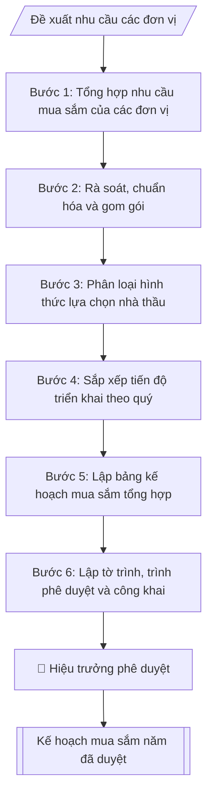

# Lập kế hoạch mua sắm trang thiết bị

## Định dạng và file đầu ra
Định dạng đầu ra có thể chọn theo sản phẩm/yêu cầu: .docx, .pdf. Đọc mục “Định dạng bổ sung” trong quy cách đầu ra trước khi chọn.

**Phải tạo file thực tế để tải xuống, không chỉ trả nội dung trong chat.** Định dạng mặc định của skill: **.docx**. Nếu có bảng số liệu nghiệp vụ yêu cầu file bảng tính riêng, tạo thêm Excel theo yêu cầu; không tự tạo file kiểm tra. Không chờ người dùng yêu cầu xuất file lần nữa. Ưu tiên định dạng người dùng chỉ định; đọc quy tắc xuất file tại references/quy-cach-dau-ra.md.

## Quy cách đầu ra và thông tin thiếu
Khi dựng file Word/Excel, áp dụng mục “Thể thức và bảng biểu khi dựng file” trong quy cách đầu ra (cỡ chữ từng thành phần, bảng nhiều trang, số trang, phụ lục). Đọc [quy cách và cấu trúc sản phẩm](references/quy-cach-dau-ra.md) trước khi soạn/xuất. File giao chỉ gồm sản phẩm nghiệp vụ được yêu cầu; kiểm tra nội bộ không xuất kèm. Thiếu thông tin thì giữ nguyên trường/mục và chỗ điền theo mẫu gốc (dòng dấu chấm, dấu gạch hoặc ô trống); không tự điền dữ liệu mẫu, số 0, mã chờ xác minh hay dòng chờ ký. Mẫu chuyên ngành còn áp dụng được ưu tiên về cấu trúc, mã biểu và người ký. Bản đầy đủ: [quy tắc chung](references/quy-tac-chung.md).

Khi người dùng yêu cầu bộ slide (.pptx), đọc mục “Xuất PowerPoint (.pptx) khi được yêu cầu” trong quy cách đầu ra.

## Kiểm soát áp dụng và phê duyệt
Trước khi chạy, xác định `ngay_ap_dung`, `loai_hinh_truong`, `quy_che_noi_bo`, `nguon_du_lieu`, `nguoi_kiem_duyet`; chỉ hỏi thông tin liên quan nghiệp vụ, không dùng giá trị giả định thay dữ liệu bắt buộc. Đối chiếu căn cứ pháp lý với văn bản gốc, hiệu lực, điều khoản áp dụng và chuyển tiếp. Bản đầy đủ: [quy tắc chung](references/quy-tac-chung.md).

Nếu có cập nhật pháp lý dưới đây, đọc [căn cứ và điều kiện áp dụng](references/phap-ly.md) trước khi làm. Quy trình dưới đây giữ nghiệp vụ từ bản gốc; mọi viện dẫn văn bản, mẫu biểu, điều khoản phải theo căn cứ đã chọn trong phap-ly.md, không theo văn bản cũ.

## Giới hạn và human gate
AI hỗ trợ chuẩn bị và đối chiếu; cán bộ phụ trách kiểm tra dữ liệu/căn cứ, người có thẩm quyền duyệt và ký. Không đánh dấu đã ký, đã duyệt, đã công bố khi chưa có chứng cứ. Dữ liệu sinh viên, sức khỏe, nhân sự, tài chính chỉ dùng theo mục đích và phân quyền, che thông tin định danh khi dùng ví dụ (Luật 91/2025/QH15, hiệu lực 01/01/2026); không tải dữ liệu lên dịch vụ ngoài khi chưa có quyền. Bản đầy đủ: [quy tắc chung](references/quy-tac-chung.md).

## Khi nào dùng
Khi cần tổng hợp nhu cầu mua sắm thiết bị của các đơn vị thành kế hoạch năm của trường;
khi điều chỉnh, bổ sung kế hoạch mua sắm giữa năm.

## Đầu vào (Input)
| Trường | Mô tả | Bắt buộc |
|---|---|---|
| `nam_ke_hoach` | Năm thực hiện kế hoạch (VD: 2026) | Có |
| `nhu_cau_don_vi` | Bảng nhu cầu: đơn vị đề xuất, danh mục thiết bị, thông số kỹ thuật cơ bản, số lượng, dự toán | Có |
| `nguon_von` | Nguồn vốn từng hạng mục: ngân sách nhà nước / học phí / dự án / tài trợ | Có |
| `hinh_thuc_lc` | Hình thức lựa chọn nhà thầu dự kiến: đấu thầu rộng rãi / chào hàng cạnh tranh / mua sắm trực tiếp / chỉ định thầu | Không (mặc định: xác định theo hạn mức Luật Đấu thầu) |
| `tien_do` | Tiến độ triển khai dự kiến theo quý | Không |

## Quy trình
**Ràng buộc pháp lý khi thực hiện** (trích references/phap-ly.md; đối chiếu toàn văn và hiệu lực tại ngày nghiệp vụ):
- Nghị định 214/2025, sửa đổi 165/2026, 170/2026, 349/2026; VBHN 36/2026/VBHN-NĐ-BTC ngày 23/09/2026: Yêu cầu chủ thể, nguồn vốn, loại gói, dự toán được duyệt, phân cấp thẩm quyền, mua sắm tập trung, điều kiện áp dụng hình thức và thời điểm phát hành. Đối chiếu Luật Đấu thầu hợp nhất 74/VBHN-VPQH ngày 25/03/2026 và nghị định hiện hành. Không suy ra chỉ định thầu/mua sắm trực tiếp chỉ vì nhỏ lẻ hoặc cấp bách; ghi điều khoản và điều kiện từng gói, cán bộ thẩm định xác nhận. Không tự đặt hạn mức.
- Nghị định 186/2025/NĐ-CP, hiệu lực 01/07/2025: Yêu cầu nguồn hình thành, chủ sở hữu, phân cấp quản lý và hồ sơ tài sản công; phân biệt mua sắm, kiểm kê, khai thác, thanh lý. Đối chiếu thẩm quyền và điều kiện theo NĐ 186, không tự quyết định xử lý tài sản.
- Trước Bước 1: chọn căn cứ theo đối tượng, loại hình trường và chuyển tiếp; lập bảng văn bản / điều khoản / lý do áp dụng / bằng chứng. Thiếu văn bản gốc hoặc điều khoản thì ghi nhận nội bộ [CẦN XÁC MINH] (không đưa vào file giao), để trống phần tương ứng, chưa kết luận tuân thủ.
- Các con số, thời hạn, số điều, số mức xếp loại, hệ số và mẫu biểu nêu trong các bước dưới đây được giữ từ quy trình gốc (trước cập nhật pháp lý); chỉ dùng khi đã đối chiếu đúng với căn cứ đã chọn, khác thì theo căn cứ. Danh sách điểm cần đối chiếu: docs/DIEM_CAN_DOI_CHIEU_PHAP_LY.md.

**Bước 1. Tổng hợp nhu cầu mua sắm của các đơn vị**
- Làm gì: thu thập đề xuất mua sắm của các phòng, khoa, trung tâm từ `nhu_cau_don_vi`;
  mỗi đề xuất phải ghi rõ: đơn vị đề xuất, danh mục thiết bị, thông số kỹ thuật cơ bản,
  số lượng, dự toán; kiểm tra đề xuất có chữ ký xác nhận của lãnh đạo đơn vị.
- Dùng input: `nhu_cau_don_vi`, `nam_ke_hoach`.
- Vai trò: Chuyên viên Phòng Quản trị – Thiết bị · AI hỗ trợ: tổng hợp, chuẩn hóa dữ liệu, đối chiếu tự động, cảnh báo sai lệch · ⏱ ~30–60 phút (ước tính)
- Lưu ý nghiệp vụ: đề xuất thiếu thông số kỹ thuật hoặc thiếu dự toán thì trả lại đơn vị
  hoàn thiện ngay từ đầu — không đưa vào tổng hợp để tránh phải làm lại.
- → Kết quả bước: bảng nhu cầu thô (tổng hợp nguyên trạng đề xuất các đơn vị).

**Bước 2. Rà soát, chuẩn hóa và gom gói**
- Làm gì: loại bỏ các đề xuất trùng lặp giữa các đơn vị; chuẩn hóa thông số kỹ thuật,
  đơn vị tính; kiểm tra tính hợp lý của dự toán bằng cách tham khảo giá thị trường;
  gom các nhu cầu cùng chủng loại thành gói thầu để tăng quy mô và hiệu quả lựa chọn
  nhà thầu.
- Dùng input: kết quả Bước 1, `nguon_von` (xác định nguồn vốn từng hạng mục: ngân sách
  nhà nước / học phí / dự án / tài trợ).
- Vai trò: Chuyên viên Phòng Quản trị – Thiết bị · AI hỗ trợ: đối chiếu tự động, cảnh báo sai lệch, tính toán, phân tích số liệu · ⏱ ~1–2 giờ (ước tính)
- Lưu ý nghiệp vụ: bẫy thường gặp là chia nhỏ gói thầu để né hạn mức đấu thầu — việc gom
  gói phải tuân thủ quy định, không được tách gói trái phép.
- → Kết quả bước: danh mục gói thầu đã chuẩn hóa (tên gói, danh mục, số lượng, dự toán
  đã kiểm tra giá, nguồn vốn).

**Bước 3. Phân loại hình thức lựa chọn nhà thầu**
- Làm gì: với mỗi gói thầu, xác định hình thức theo hạn mức Luật Đấu thầu 2023: giá trị
  lớn → đấu thầu rộng rãi; trong hạn mức → chào hàng cạnh tranh; mua sắm nhỏ lẻ, cấp bách
  → mua sắm trực tiếp / chỉ định thầu theo quy định (`hinh_thuc_lc` nếu đã chỉ định thì
  kiểm tra lại tính phù hợp).
- Dùng input: `hinh_thuc_lc`, kết quả Bước 2.
- Vai trò: Chuyên viên Phòng Quản trị – Thiết bị · AI hỗ trợ: đối chiếu tự động, cảnh báo sai lệch, tính toán, phân tích số liệu · ⏱ ~30–60 phút (ước tính)
- Lưu ý nghiệp vụ: hình thức lựa chọn nhà thầu phải phù hợp cả giá trị gói và nguồn vốn
  (vốn NSNN chịu ràng buộc chặt hơn); ghi rõ căn cứ áp dụng hạn mức cho từng gói.
- → Kết quả bước: bảng gói thầu kèm hình thức lựa chọn nhà thầu đã xác định.

**Bước 4. Sắp xếp tiến độ triển khai theo quý**
- Làm gì: phân bổ các gói thầu theo quý trong `tien_do`; ưu tiên thiết bị phục vụ đào tạo
  triển khai đầu năm học; kiểm tra tính khả thi của tiến độ (thời gian lựa chọn nhà thầu +
  giao hàng + nghiệm thu phải nằm gọn trong quý được phân bổ).
- Dùng input: `tien_do`, kết quả Bước 3.
- Vai trò: Chuyên viên Phòng Quản trị – Thiết bị · AI hỗ trợ: đối chiếu tự động, cảnh báo sai lệch, tính toán, phân tích số liệu · ⏱ ~0,5–1 ngày làm việc (ước tính)
- Lưu ý nghiệp vụ: gói đấu thầu rộng rãi cần 2–3 tháng cho lựa chọn nhà thầu — không xếp
  dồn vào quý IV nếu muốn giải ngân trong năm.
- → Kết quả bước: tiến độ triển khai theo quý của từng gói thầu.

**Bước 5. Lập bảng kế hoạch mua sắm tổng hợp**
- Làm gì: tổng hợp thành bảng gồm các cột: STT, danh mục thiết bị, đơn vị tính, số lượng,
  dự toán, nguồn vốn, hình thức lựa chọn nhà thầu, tiến độ, đơn vị sử dụng; cộng tổng dự
  toán toàn kế hoạch; kiểm tra số học.
- Dùng input: kết quả Bước 2 – 4.
- Vai trò: Chuyên viên Phòng Quản trị – Thiết bị · AI hỗ trợ: tổng hợp, chuẩn hóa dữ liệu, đối chiếu tự động, cảnh báo sai lệch · ⏱ ~30–60 phút (ước tính)
- Lưu ý nghiệp vụ: bảng kế hoạch là tài liệu pháp lý để lập hồ sơ mời thầu từng gói về sau
  — mọi cột đều bắt buộc, không để trống nguồn vốn hay hình thức LCNT.
- → Kết quả bước: bảng kế hoạch mua sắm trang thiết bị năm hoàn chỉnh.

**Bước 6. Lập tờ trình, trình phê duyệt và công khai**
- Làm gì: soạn tờ trình phê duyệt kèm bảng kế hoạch (Bước 5); trình Hiệu trưởng phê duyệt;
  công khai kế hoạch mua sắm theo quy định sau khi được duyệt.
- Dùng input: kết quả Bước 5.
- Vai trò: Chuyên viên Phòng Quản trị – Thiết bị (chuẩn bị hồ sơ trình); Hiệu trưởng (người ký) ban hành · AI hỗ trợ: soạn dự thảo, chuẩn bị hồ sơ trình đầy đủ · ⏱ ~1–3 giờ (ước tính)
- Lưu ý nghiệp vụ: kế hoạch mua sắm phải được phê duyệt trước khi lập hồ sơ mời thầu của
  từng gói; điều chỉnh, bổ sung giữa năm cũng phải trình phê duyệt lại.
- → Kết quả bước: kế hoạch mua sắm năm đã được phê duyệt (kèm tờ trình).

## Luồng quy trình (Workflow)

## Đầu ra
- Bảng kế hoạch mua sắm trang thiết bị năm.
- Tờ trình phê duyệt kế hoạch mua sắm.

File nghiệp vụ thực tế theo định dạng mặc định ở đầu skill hoặc định dạng người dùng yêu cầu, kèm liên kết tải trong phản hồi cuối.

Sản phẩm nghiệp vụ hoàn chỉnh theo [quy cách và cấu trúc](references/quy-cach-dau-ra.md), giữ các trường chưa có dữ liệu ở trạng thái trống. Không xuất kèm checklist/phụ lục kiểm tra đầu ra.

## Kiểm tra nội bộ trước khi giao
Các tiêu chí sau dùng để tự đối chiếu; không sao chép vào file xuất. Mục thiếu dữ liệu được để trống, không đánh dấu đã đạt hoặc đã duyệt.

- [ ] Đủ các phần và đúng bố cục theo cấu trúc tại references/quy-cach-dau-ra.md (không theo cấu trúc của bản gốc).
- [ ] Có đầy đủ sản phẩm: Bảng kế hoạch mua sắm trang thiết bị năm
- [ ] Có đầy đủ sản phẩm: Tờ trình phê duyệt kế hoạch mua sắm
- [ ] Mọi số liệu, tên, ngày tháng trong output khớp với Input đã cung cấp (không thêm bớt, không suy đoán)
- [ ] Không bịa đặt số liệu, minh chứng, trích dẫn hay căn cứ
- [ ] Đúng thể thức, định dạng văn bản theo quy định hiện hành
- [ ] Căn cứ pháp lý nêu đầy đủ, còn hiệu lực tại thời điểm lập
- [ ] Đã qua Human gate: người có thẩm quyền đã kiểm tra/ký duyệt trước khi phát hành
- [ ] Đề xuất thiếu thông số kỹ thuật hoặc thiếu dự toán thì trả lại đơn vị
- [ ] Bẫy thường gặp là chia nhỏ gói thầu để né hạn mức đấu thầu — việc gom

## Căn cứ & lưu ý
- Luật Đấu thầu 2023 (Luật số 22/2023/QH15) và các nghị định hướng dẫn.
- Kế hoạch mua sắm phải được phê duyệt trước khi lập hồ sơ mời thầu từng gói.
- Không dùng tên thật của trường/cá nhân khi mô phỏng.

## Tư liệu đối chiếu
Bản gốc trước cập nhật pháp lý (kèm ví dụ giả lập) lưu tại `references/quy-trinh-lich-su.md`, chỉ để đối chiếu hồ sơ lịch sử; không dùng căn cứ, mẫu hay số liệu trong đó làm chỉ dẫn hiện hành.

## Quản trị phiên bản
- Phiên bản gói `1.3.2` (cập nhật 2026-10-10); hồ sơ đầy đủ tại [references/version.json](references/version.json).
- Người phê duyệt nghiệp vụ: **chưa chỉ định**. Trạng thái: dự thảo nghiệp vụ; kiểm tra pháp lý trước thực thi. Ngày cập nhật không đồng nghĩa mọi văn bản đã được rà soát toàn văn.
- Giấy phép theo LICENSE của kho (bản quyền CES Global). Lịch sử thay đổi: CHANGELOG.md.
