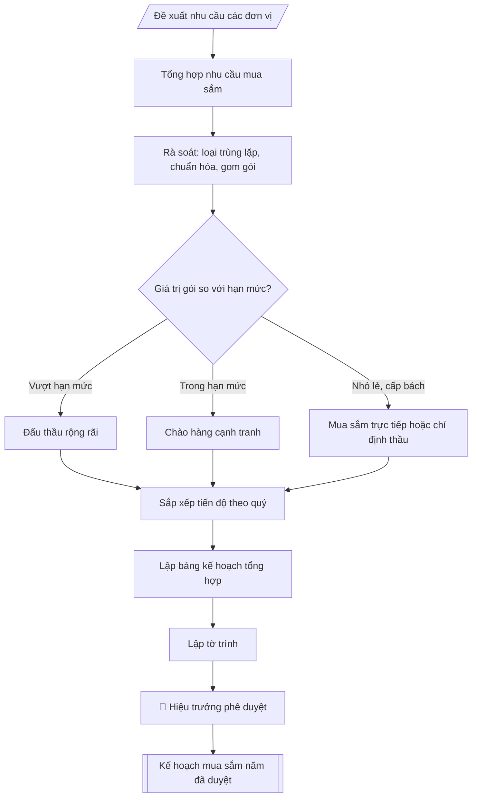

# Tư liệu lịch sử – không phải quy trình hiện hành

Nội dung từ phiên bản nguồn trước 1.1.0, giữ để đối chiếu dữ liệu đầu vào và thay đổi; căn cứ, điều kiện, mẫu và ví dụ có thể đã lỗi thời. Không dùng để thực hiện nghiệp vụ hiện tại.

## Khi nào dùng
Khi cần tổng hợp nhu cầu mua sắm thiết bị của các đơn vị thành kế hoạch năm của trường;
khi điều chỉnh, bổ sung kế hoạch mua sắm giữa năm.

## Đầu vào (Input)

| Trường | Mô tả | Bắt buộc |
|---|---|---|
| `nam_ke_hoach` | Năm thực hiện kế hoạch (VD: 2026) | Có |
| `nhu_cau_don_vi` | Bảng nhu cầu: đơn vị đề xuất, danh mục thiết bị, thông số kỹ thuật cơ bản, số lượng, dự toán | Có |
| `nguon_von` | Nguồn vốn từng hạng mục: ngân sách nhà nước / học phí / dự án / tài trợ | Có |
| `hinh_thuc_lc` | Hình thức lựa chọn nhà thầu dự kiến: đấu thầu rộng rãi / chào hàng cạnh tranh / mua sắm trực tiếp / chỉ định thầu | Không (mặc định: xác định theo hạn mức Luật Đấu thầu) |
| `tien_do` | Tiến độ triển khai dự kiến theo quý | Không |

## Quy trình

**Bước 1. Tổng hợp nhu cầu mua sắm của các đơn vị**
- Làm gì: thu thập đề xuất mua sắm của các phòng, khoa, trung tâm từ `nhu_cau_don_vi`;
  mỗi đề xuất phải ghi rõ: đơn vị đề xuất, danh mục thiết bị, thông số kỹ thuật cơ bản,
  số lượng, dự toán; kiểm tra đề xuất có chữ ký xác nhận của lãnh đạo đơn vị.
- Dùng input: `nhu_cau_don_vi`, `nam_ke_hoach`.
- Vai trò: Chuyên viên Phòng Quản trị – Thiết bị · AI hỗ trợ: tổng hợp, chuẩn hóa dữ liệu, đối chiếu tự động, cảnh báo sai lệch · ⏱ ~30–60 phút (ước tính)
- Lưu ý nghiệp vụ: đề xuất thiếu thông số kỹ thuật hoặc thiếu dự toán thì trả lại đơn vị
  hoàn thiện ngay từ đầu — không đưa vào tổng hợp để tránh phải làm lại.
- → Kết quả bước: bảng nhu cầu thô (tổng hợp nguyên trạng đề xuất các đơn vị).

**Bước 2. Rà soát, chuẩn hóa và gom gói**
- Làm gì: loại bỏ các đề xuất trùng lặp giữa các đơn vị; chuẩn hóa thông số kỹ thuật,
  đơn vị tính; kiểm tra tính hợp lý của dự toán bằng cách tham khảo giá thị trường;
  gom các nhu cầu cùng chủng loại thành gói thầu để tăng quy mô và hiệu quả lựa chọn
  nhà thầu.
- Dùng input: kết quả Bước 1, `nguon_von` (xác định nguồn vốn từng hạng mục: ngân sách
  nhà nước / học phí / dự án / tài trợ).
- Vai trò: Chuyên viên Phòng Quản trị – Thiết bị · AI hỗ trợ: đối chiếu tự động, cảnh báo sai lệch, tính toán, phân tích số liệu · ⏱ ~1–2 giờ (ước tính)
- Lưu ý nghiệp vụ: bẫy thường gặp là chia nhỏ gói thầu để né hạn mức đấu thầu — việc gom
  gói phải tuân thủ quy định, không được tách gói trái phép.
- → Kết quả bước: danh mục gói thầu đã chuẩn hóa (tên gói, danh mục, số lượng, dự toán
  đã kiểm tra giá, nguồn vốn).

**Bước 3. Phân loại hình thức lựa chọn nhà thầu**
- Làm gì: với mỗi gói thầu, xác định hình thức theo hạn mức Luật Đấu thầu 2023: giá trị
  lớn → đấu thầu rộng rãi; trong hạn mức → chào hàng cạnh tranh; mua sắm nhỏ lẻ, cấp bách
  → mua sắm trực tiếp / chỉ định thầu theo quy định (`hinh_thuc_lc` nếu đã chỉ định thì
  kiểm tra lại tính phù hợp).
- Dùng input: `hinh_thuc_lc`, kết quả Bước 2.
- Vai trò: Chuyên viên Phòng Quản trị – Thiết bị · AI hỗ trợ: đối chiếu tự động, cảnh báo sai lệch, tính toán, phân tích số liệu · ⏱ ~30–60 phút (ước tính)
- Lưu ý nghiệp vụ: hình thức lựa chọn nhà thầu phải phù hợp cả giá trị gói và nguồn vốn
  (vốn NSNN chịu ràng buộc chặt hơn); ghi rõ căn cứ áp dụng hạn mức cho từng gói.
- → Kết quả bước: bảng gói thầu kèm hình thức lựa chọn nhà thầu đã xác định.

**Bước 4. Sắp xếp tiến độ triển khai theo quý**
- Làm gì: phân bổ các gói thầu theo quý trong `tien_do`; ưu tiên thiết bị phục vụ đào tạo
  triển khai đầu năm học; kiểm tra tính khả thi của tiến độ (thời gian lựa chọn nhà thầu +
  giao hàng + nghiệm thu phải nằm gọn trong quý được phân bổ).
- Dùng input: `tien_do`, kết quả Bước 3.
- Vai trò: Chuyên viên Phòng Quản trị – Thiết bị · AI hỗ trợ: đối chiếu tự động, cảnh báo sai lệch, tính toán, phân tích số liệu · ⏱ ~0,5–1 ngày làm việc (ước tính)
- Lưu ý nghiệp vụ: gói đấu thầu rộng rãi cần 2–3 tháng cho lựa chọn nhà thầu — không xếp
  dồn vào quý IV nếu muốn giải ngân trong năm.
- → Kết quả bước: tiến độ triển khai theo quý của từng gói thầu.

**Bước 5. Lập bảng kế hoạch mua sắm tổng hợp**
- Làm gì: tổng hợp thành bảng gồm các cột: STT, danh mục thiết bị, đơn vị tính, số lượng,
  dự toán, nguồn vốn, hình thức lựa chọn nhà thầu, tiến độ, đơn vị sử dụng; cộng tổng dự
  toán toàn kế hoạch; kiểm tra số học.
- Dùng input: kết quả Bước 2 – 4.
- Vai trò: Chuyên viên Phòng Quản trị – Thiết bị · AI hỗ trợ: tổng hợp, chuẩn hóa dữ liệu, đối chiếu tự động, cảnh báo sai lệch · ⏱ ~30–60 phút (ước tính)
- Lưu ý nghiệp vụ: bảng kế hoạch là tài liệu pháp lý để lập hồ sơ mời thầu từng gói về sau
  — mọi cột đều bắt buộc, không để trống nguồn vốn hay hình thức LCNT.
- → Kết quả bước: bảng kế hoạch mua sắm trang thiết bị năm hoàn chỉnh.

**Bước 6. Lập tờ trình, trình phê duyệt và công khai**
- Làm gì: soạn tờ trình phê duyệt kèm bảng kế hoạch (Bước 5); trình Hiệu trưởng phê duyệt;
  công khai kế hoạch mua sắm theo quy định sau khi được duyệt.
- Dùng input: kết quả Bước 5.
- Vai trò: Chuyên viên Phòng Quản trị – Thiết bị (chuẩn bị hồ sơ trình); Hiệu trưởng (người ký) ban hành · AI hỗ trợ: soạn dự thảo, chuẩn bị hồ sơ trình đầy đủ · ⏱ ~1–3 giờ (ước tính)
- Lưu ý nghiệp vụ: kế hoạch mua sắm phải được phê duyệt trước khi lập hồ sơ mời thầu của
  từng gói; điều chỉnh, bổ sung giữa năm cũng phải trình phê duyệt lại.
- → Kết quả bước: kế hoạch mua sắm năm đã được phê duyệt (kèm tờ trình).

## Luồng quy trình (Workflow)



## Đầu ra (Output)
- Bảng kế hoạch mua sắm trang thiết bị năm.
- Tờ trình phê duyệt kế hoạch mua sắm.

**Cấu trúc output chuẩn:** khung mẫu cố định của kế hoạch mua sắm, các phần theo đúng
thứ tự xuất hiện:
1. Tiêu đề văn bản (tên trường, đơn vị lập, địa danh ngày tháng, tên kế hoạch, năm);
2. Phần I: Danh mục mua sắm (bảng: STT, danh mục thiết bị, đơn vị tính, số lượng, dự toán,
   nguồn vốn, hình thức lựa chọn nhà thầu, tiến độ, đơn vị sử dụng; dòng tổng cộng dự toán);
3. Phần II: Tổ chức thực hiện (phân công trách nhiệm các đơn vị);
4. Nơi nhận – chữ ký người có thẩm quyền (ghi rõ họ tên, chức vụ);
5. (Kèm theo) Tờ trình phê duyệt kế hoạch mua sắm.

## Checklist nghiệm thu

- [ ] Đủ các phần theo "Cấu trúc output chuẩn": Tiêu đề văn bản (tên trường, đơn vị lập, địa…; Phần I; Phần II; Nơi nhận; (Kèm theo) Tờ trình phê duyệt kế hoạch mua…
- [ ] Có đầy đủ sản phẩm: Bảng kế hoạch mua sắm trang thiết bị năm
- [ ] Có đầy đủ sản phẩm: Tờ trình phê duyệt kế hoạch mua sắm
- [ ] Mọi số liệu, tên, ngày tháng trong output khớp với Input đã cung cấp (không thêm bớt, không suy đoán)
- [ ] Không bịa đặt số liệu, minh chứng, trích dẫn hay căn cứ
- [ ] Đúng thể thức, định dạng văn bản theo quy định hiện hành
- [ ] Căn cứ pháp lý nêu đầy đủ, còn hiệu lực tại thời điểm lập
- [ ] Đã qua Human gate: người có thẩm quyền đã kiểm tra/ký duyệt trước khi phát hành
- [ ] Đề xuất thiếu thông số kỹ thuật hoặc thiếu dự toán thì trả lại đơn vị
- [ ] Bẫy thường gặp là chia nhỏ gói thầu để né hạn mức đấu thầu — việc gom

> Tiêu chí đạt: tất cả các ô đều được đánh dấu.

## Ví dụ mô phỏng (dữ liệu giả lập)

> Tất cả tên trường, cá nhân, số liệu dưới đây đều là **giả lập**, không liên quan tổ chức/cá nhân có thật.

### Input mẫu

| Trường | Giá trị |
|---|---|
| `nam_ke_hoach` | 2026 |
| `nhu_cau_don_vi` | 1. Khoa CNTT: 40 máy tính để bàn cho phòng Lab A2 (Core i5, RAM 16GB), dự toán 2,4 tỷ. 2. Phòng Đào tạo: 20 máy chiếu cho phòng học (cường độ 4000 ANSI Lumens), dự toán 800 triệu. 3. Khoa Hóa học: hệ thống thiết bị phân tích PTN (máy quang phổ, tủ hút...), dự toán 1,1 tỷ. |
| `nguon_von` | Học phí (mục 1, 2); Dự án tăng cường CSVC (mục 3) |
| `tien_do` | Quý I: mục 2; Quý II: mục 1; Quý III: mục 3 |

### Output mẫu

```
TRƯỜNG ĐẠI HỌC A            CỘNG HÒA XÃ HỘI CHỦ NGHĨA VIỆT NAM
PHÒNG QUẢN TRỊ – THIẾT BỊ                Độc lập – Tự do – Hạnh phúc
                                                    Thành phố C, ngày 15 tháng 12 năm 2025

KẾ HOẠCH MUA SẮM TRANG THIẾT BỊ NĂM 2026

I. DANH MỤC MUA SẮM

| STT | Danh mục thiết bị | ĐV tính | Số lượng | Dự toán (đồng) | Nguồn vốn | Hình thức LCNT | Tiến độ | Đơn vị sử dụng |
|-----|-------------------|---------|----------|----------------|-----------|----------------|---------|----------------|
| 1 | Máy tính để bàn phòng Lab (Core i5, RAM 16GB, SSD 512GB) | Bộ | 40 | 2.400.000.000 | Học phí | Chào hàng cạnh tranh | Quý II | Khoa CNTT |
| 2 | Máy chiếu phòng học (4000 ANSI Lumens) | Chiếc | 20 | 800.000.000 | Học phí | Chào hàng cạnh tranh | Quý I | Phòng Đào tạo |
| 3 | Thiết bị phân tích phòng thí nghiệm Hóa học | Gói | 01 | 1.100.000.000 | Dự án CSVC | Đấu thầu rộng rãi | Quý III | Khoa Hóa học |
| **Tổng cộng** | | | | **4.300.000.000** | | | | |

II. TỔ CHỨC THỰC HIỆN
1. Phòng Quản trị – Thiết bị chủ trì lập hồ sơ mời thầu, tổ chức lựa chọn nhà thầu theo quy định.
2. Các đơn vị sử dụng phối hợp nghiệm thu, tiếp nhận thiết bị.
3. Phòng Tài chính – Kế toán bố trí vốn, thanh toán theo tiến độ hợp đồng.

Nơi nhận:                                      TRƯỞNG PHÒNG
- Ban Giám hiệu (b/c);                            [CHỜ KÝ]
- Các đơn vị liên quan;
- Lưu: VT, QTTB.

                                        ThS. Vũ Văn C
```

### Tờ trình phê duyệt (output kèm theo)
- [x] Bảng kế hoạch đầy đủ các cột theo quy định
- [x] Nguồn vốn xác định cho từng hạng mục
- [x] Hình thức lựa chọn nhà thầu phù hợp hạn mức
- [x] Tiến độ khả thi, ưu tiên thiết bị phục vụ đào tạo

## Căn cứ & lưu ý
- Luật Đấu thầu 2023 (Luật số 22/2023/QH15) và các nghị định hướng dẫn.
- Kế hoạch mua sắm phải được phê duyệt trước khi lập hồ sơ mời thầu từng gói.
- Không dùng tên thật của trường/cá nhân khi mô phỏng.
