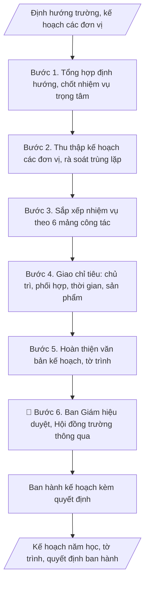

# Lập kế hoạch năm học toàn trường

## Định dạng và file đầu ra

Định dạng đầu ra có thể chọn theo sản phẩm/yêu cầu: .docx, .pdf. Đọc mục “Định dạng bổ sung” trong quy cách đầu ra trước khi chọn.

**Phải tạo file thực tế để tải xuống, không chỉ trả nội dung trong chat.** Định dạng mặc định của skill: **.docx**. Nếu có bảng số liệu nghiệp vụ yêu cầu file bảng tính riêng, tạo thêm Excel theo yêu cầu; không tự tạo file kiểm tra. Không chờ người dùng yêu cầu xuất file lần nữa. Ưu tiên định dạng người dùng chỉ định; đọc quy tắc xuất file tại references/quy-cach-dau-ra.md.

## Quy cách đầu ra và thông tin thiếu

Đọc [quy cách và cấu trúc sản phẩm](references/quy-cach-dau-ra.md) trước khi soạn/xuất. File giao chỉ gồm văn bản hoặc sản phẩm nghiệp vụ được yêu cầu; kiểm tra nội bộ không xuất kèm. Thiếu thông tin giữ nguyên trường/mục và chỗ điền theo mẫu gốc (dòng dấu chấm, dấu gạch hoặc ô trống); không tự điền dữ liệu mẫu, số 0, mã chờ xác minh hoặc dòng chờ ký. Mẫu chuyên ngành còn áp dụng được ưu tiên về cấu trúc, mã biểu và người ký. Các trường “bắt buộc” là điều kiện hoàn thiện hồ sơ, không ngăn việc soạn bản có chỗ chừa để điền. Mọi chỉ dẫn “để trống” trong skill được hiểu là không điền dữ liệu và giữ cách chừa chỗ của mẫu gốc, không phải xóa dấu chấm của mẫu.

## Kiểm soát áp dụng và phê duyệt

Trước khi chạy quy trình, xác định `ngay_ap_dung`, `loai_hinh_truong`, `quy_che_noi_bo`, `nguon_du_lieu` và `nguoi_kiem_duyet`. Chỉ yêu cầu thông tin có liên quan đến nghiệp vụ; không dùng giá trị giả định thay dữ liệu bắt buộc. Đối chiếu nội bộ hồ sơ có yếu tố pháp lý với văn bản gốc, hiệu lực, điều khoản áp dụng và chuyển tiếp; không tự đính kèm bảng kiểm tra vào file giao.

## Giới hạn và human gate

AI hỗ trợ chuẩn bị và đối chiếu. Cán bộ phụ trách kiểm tra dữ liệu/căn cứ, người có thẩm quyền duyệt và ký. Văn bản soạn chưa được coi là đã ban hành; không tự chèn nhãn trạng thái kiểm duyệt vào file giao; không đánh dấu đã ký, đã duyệt hoặc đã công bố nếu chưa có chứng cứ. Dữ liệu sinh viên, sức khỏe, nhân sự và tài chính phải hạn chế theo mục đích, phân quyền và che thông tin định danh khi dùng ví dụ. Không tải dữ liệu lên dịch vụ ngoài khi chưa có quyền. Kiểm tra Luật 91/2025/QH15 về bảo vệ dữ liệu cá nhân (hiệu lực 01/01/2026) và quy định áp dụng trước xử lý/chia sẻ dữ liệu cá nhân.

## Khi nào dùng
Khi xây dựng kế hoạch năm học mới (trước khi năm học bắt đầu); khi điều chỉnh kế hoạch
giữa năm học.

## Đầu vào (Input)

| Trường | Mô tả | Bắt buộc |
|---|---|---|
| `nam_hoc` | Năm học (VD: 2026–2027) | Có |
| `nhiem_vu_trong_tam` | Các nhiệm vụ trọng tâm do Ban Giám hiệu xác định | Có |
| `ke_hoach_don_vi` | Kế hoạch của các phòng, khoa, trung tâm | Có |
| `chi_tieu` | Chỉ tiêu cụ thể từng mảng (tuyển sinh, NCKH, kiểm định...) | Không |

## Quy trình

**Bước 1. Tổng hợp định hướng và chốt nhiệm vụ trọng tâm**
- Làm gì: Thu thập định hướng phát triển của trường, chỉ đạo của cơ quan chủ quản/Bộ
  GD&ĐT cho năm học mới; đề xuất danh sách nhiệm vụ trọng tâm (thường 3–5 nhiệm vụ);
  lấy ý kiến Ban Giám hiệu và chốt danh sách chính thức.
- Dùng input: `nam_hoc`, `nhiem_vu_trong_tam`
- Vai trò: Ban Giám hiệu · AI hỗ trợ: tổng hợp định hướng và đề xuất danh sách nhiệm vụ trọng tâm, Ban Giám hiệu chốt · ⏱ 2–3 ngày làm việc (lấy ý kiến) (ước tính)
- Lưu ý nghiệp vụ: Nhiệm vụ trọng tâm không nên quá 5 — càng nhiều "trọng tâm" thì
  càng không có trọng tâm; mỗi nhiệm vụ trọng tâm phải có sản phẩm/chỉ tiêu đo được,
  tránh nhiệm vụ dạng khẩu hiệu.
- → Kết quả bước: Danh sách nhiệm vụ trọng tâm năm học đã được Ban Giám hiệu chốt.

**Bước 2. Thu thập kế hoạch các đơn vị**
- Làm gì: Gửi văn bản yêu cầu các phòng, khoa, trung tâm gửi kế hoạch năm học của
  đơn vị (kèm biểu mẫu: nhiệm vụ, chỉ tiêu, thời gian); đôn đốc, tiếp nhận; lập bảng
  rà soát: phát hiện nhiệm vụ trùng lặp giữa các đơn vị, nhiệm vụ không gắn với nhiệm
  vụ trọng tâm.
- Dùng input: `ke_hoach_don_vi`
- Vai trò: Chuyên viên Văn phòng · AI hỗ trợ: hỗ trợ soạn văn bản và lập bảng rà soát trùng lặp, Văn phòng đôn đốc các đơn vị gửi kế hoạch · ⏱ 1–2 tuần (chờ đơn vị) (ước tính)
- Lưu ý nghiệp vụ: Trùng lặp nhiệm vụ giữa các đơn vị là chuyện thường (VD: cả Đào
  tạo và các khoa cùng đăng ký "xây dựng ngân hàng đề thi") — phải gộp và phân rõ
  chủ trì/phối hợp ngay ở bước này; đơn vị nào chưa gửi thì nhắc trước hạn 7 ngày.
- → Kết quả bước: Tập hợp kế hoạch các đơn vị + bảng rà soát trùng lặp.

**Bước 3. Sắp xếp nhiệm vụ theo 6 mảng công tác**
- Làm gì: Gom các nhiệm vụ đơn vị theo 6 mảng: (1) Đào tạo; (2) KHCN & HTQT;
  (3) Công tác sinh viên; (4) Tổ chức cán bộ; (5) Tài chính, CSVC; (6) Đảm bảo chất
  lượng; loại bỏ nhiệm vụ trùng lặp, gộp nhiệm vụ tương đồng; kiểm tra mỗi nhiệm vụ
  trọng tâm (Bước 1) đều có nhiệm vụ cụ thể đỡ đầu.
- Dùng input: `nhiem_vu_trong_tam`
- Vai trò: Chuyên viên Văn phòng · AI hỗ trợ: gom, loại trùng lặp và sắp xếp nhiệm vụ theo 6 mảng, Văn phòng kiểm tra kết quả · ⏱ 1–2 ngày làm việc (ước tính)
- Lưu ý nghiệp vụ: Nhiệm vụ trọng tâm nào không có nhiệm vụ cụ thể đi kèm thì phải
  bổ sung — nếu không kế hoạch sẽ "treo" nhiệm vụ trọng tâm trên giấy; giữ mỗi nhiệm
  vụ một dòng mô tả ngắn gọn, chi tiết để sang Bước 4.
- → Kết quả bước: Bảng nhiệm vụ phân theo 6 mảng (đã loại trùng lặp).

**Bước 4. Giao chỉ tiêu và phân công cụ thể**
- Làm gì: Với từng nhiệm vụ, ghi rõ 5 yếu tố: đơn vị chủ trì, đơn vị phối hợp, thời
  gian hoàn thành, sản phẩm đầu ra, chỉ tiêu đo lường (lấy từ `chi_tieu` nếu có);
  kiểm tra không có nhiệm vụ "vô chủ" (thiếu đơn vị chủ trì) và không có đơn vị bị
  quá tải (một đơn vị chủ trì quá nhiều nhiệm vụ lớn cùng kỳ).
- Dùng input: `chi_tieu`
- Vai trò: Ban Giám hiệu · AI hỗ trợ: lập bảng phân công dự thảo (chủ trì/phối hợp/thời gian/sản phẩm), Ban Giám hiệu quyết định phân công · ⏱ 3–5 giờ (ước tính)
- Lưu ý nghiệp vụ: Nguyên tắc "một nhiệm vụ — một chủ trì": nhiệm vụ có 2 đơn vị
  cùng chủ trì thì khi chậm tiến độ không ai chịu trách nhiệm; thời gian hoàn thành
  phải cụ thể đến tháng, tránh ghi "cả năm" cho nhiệm vụ có thể chia mốc.
- → Kết quả bước: Bảng nhiệm vụ chi tiết (STT, nhiệm vụ, chủ trì, phối hợp, thời gian,
  sản phẩm, chỉ tiêu).

**Bước 5. Hoàn thiện văn bản kế hoạch và tờ trình**
- Làm gì: Soạn thảo văn bản kế hoạch đầy đủ 3 phần: I. Nhiệm vụ trọng tâm; II. Nhiệm
  vụ cụ thể (bảng chi tiết từ Bước 4); III. Tổ chức thực hiện (trách nhiệm các đơn vị,
  chế độ báo cáo tiến độ hằng quý); soạn tờ trình ban hành kế hoạch; kiểm tra tính
  nhất quán giữa các phần.
- Dùng input: `nam_hoc`
- Vai trò: Chuyên viên Văn phòng · AI hỗ trợ: soạn dự thảo văn bản kế hoạch và tờ trình · ⏱ 3–5 giờ (ước tính)
- Lưu ý nghiệp vụ: Phần III không được viết cho có — phải quy định rõ đơn vị nào báo
  cáo tiến độ cho ai, định kỳ nào, theo mẫu nào; nếu không kế hoạch ban hành xong sẽ
  không ai theo dõi; kiểm tra tổng chỉ tiêu trong bảng khớp với chỉ tiêu đã chốt.
- → Kết quả bước: Bản thảo kế hoạch năm học + tờ trình ban hành.

**Bước 6. Trình phê duyệt và ban hành**
- Làm gì: Trình Ban Giám hiệu duyệt; trình Hội đồng trường thông qua (nếu quy định
  yêu cầu); ban hành kế hoạch kèm quyết định; gửi đến tất cả đơn vị; các đơn vị cụ
  thể hóa thành kế hoạch của đơn vị mình.
- Dùng input: (không dùng trường input mới)
- Vai trò: Hội đồng chuyên môn · AI hỗ trợ: chuẩn bị dự thảo, tài liệu và số liệu phục vụ bước này · ⏱ 1–2 tuần (ước tính)
- Lưu ý nghiệp vụ: Kế hoạch phải ban hành trước khi năm học bắt đầu đủ sớm (ít nhất
  2–4 tuần) để đơn vị kịp triển khai; lưu quyết định ban hành kèm kế hoạch thành một
  bộ hồ sơ để tra cứu, kiểm tra sau này.
- → Kết quả bước: Kế hoạch năm học toàn trường đã ban hành + quyết định ban hành.

## Luồng quy trình (Workflow)

## Đầu ra

File nghiệp vụ thực tế theo định dạng mặc định ở đầu skill hoặc định dạng người dùng yêu cầu, kèm liên kết tải trong phản hồi cuối.

Sản phẩm nghiệp vụ hoàn chỉnh theo [quy cách và cấu trúc](references/quy-cach-dau-ra.md), giữ các trường chưa có dữ liệu ở trạng thái trống. Không xuất kèm checklist/phụ lục kiểm tra đầu ra.

## Kiểm tra nội bộ trước khi giao

- [ ] Bố cục khớp mẫu áp dụng và cấu trúc tại references/quy-cach-dau-ra.md.
- [ ] Bảng Phần II có đúng 6 cột theo đúng thứ tự: STT | Nhiệm vụ | Đơn vị chủ trì | Đơn vị phối hợp | Thời gian hoàn thành | Sản phẩm.
- [ ] Nội dung khớp với Input: 3–5 nhiệm vụ trọng tâm, chỉ tiêu, kế hoạch của các đơn vị.
- [ ] Mỗi nhiệm vụ có đúng một đơn vị chủ trì; không có nhiệm vụ "vô chủ"; không có đơn vị bị quá tải.
- [ ] Mọi nhiệm vụ trọng tâm đều có nhiệm vụ cụ thể đỡ đầu; nhiệm vụ trùng lặp đã gộp và phân rõ chủ trì/phối hợp.
- [ ] Thời gian hoàn thành cụ thể đến tháng; chỉ tiêu đo lường được.
- [ ] Đúng thể thức: số ký hiệu, ngày tháng, chữ ký Hiệu trưởng, quyết định ban hành kèm theo.
- [ ] Đã qua Human gate: Ban Giám hiệu duyệt (và Hội đồng trường thông qua nếu quy định yêu cầu); kế hoạch đã gửi đến tất cả đơn vị.
- [ ] Kế hoạch ban hành trước năm học ít nhất 2–4 tuần để đơn vị kịp triển khai.

Tiêu chí đạt = tất cả các ô được đánh dấu.

## Căn cứ & lưu ý
- Chiến lược phát triển của trường; chỉ đạo của cơ quan chủ quản, Bộ GD&ĐT.
- Kế hoạch phải gắn chỉ tiêu đo lường được và đơn vị chịu trách nhiệm cụ thể.
- Không dùng tên thật của trường/cá nhân khi mô phỏng.

## Quản trị phiên bản

- Phiên bản gói: `1.3.1`; ngày cập nhật: `2026-10-10`.
- Kho nguồn: https://github.com/phamtruong91/university-skills-framework
- Người duy trì trên GitHub: `phamtruong91` (Phạm Văn Trường). Người phê duyệt nghiệp vụ: **chưa chỉ định**.
- Commit nguồn trước cập nhật: `346719e6b0318ed034b4b016703f79733aa575e7`. Commit chứa phiên bản này xem bằng `git log -1 -- skills/ke-hoach-nam-hoc-truong`; không tự gán SHA chưa tạo.
- Giấy phép: theo LICENSE của kho; bản quyền CES Global.
- Lịch sử 1.1.0: bổ sung metadata giao diện, kiểm soát áp dụng, quản trị phiên bản.
- Trạng thái: dự thảo nghiệp vụ; kiểm tra pháp lý trước thực thi. Ngày cập nhật không đồng nghĩa mọi văn bản đã được rà soát toàn văn.
