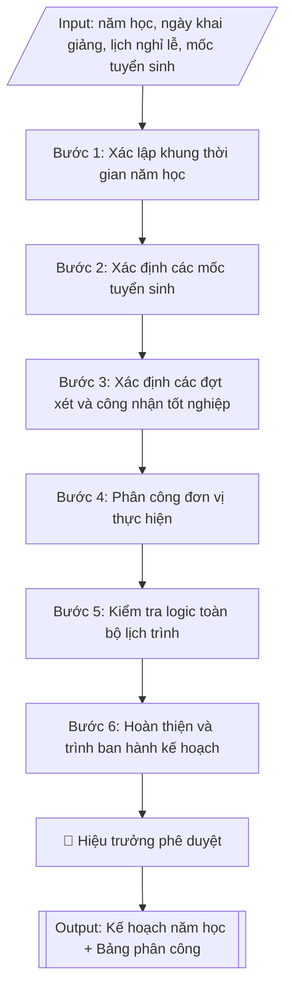

# Lập kế hoạch năm học

## Định dạng và file đầu ra
Định dạng đầu ra có thể chọn theo sản phẩm/yêu cầu: .docx, .pdf. Đọc mục “Định dạng bổ sung” trong quy cách đầu ra trước khi chọn.

**Phải tạo file thực tế để tải xuống, không chỉ trả nội dung trong chat.** Định dạng mặc định của skill: **.docx**. Nếu có bảng số liệu nghiệp vụ yêu cầu file bảng tính riêng, tạo thêm Excel theo yêu cầu; không tự tạo file kiểm tra. Không chờ người dùng yêu cầu xuất file lần nữa. Ưu tiên định dạng người dùng chỉ định; đọc quy tắc xuất file tại references/quy-cach-dau-ra.md.

## Quy cách đầu ra và thông tin thiếu
Khi dựng file Word/Excel, áp dụng mục “Thể thức và bảng biểu khi dựng file” trong quy cách đầu ra (cỡ chữ từng thành phần, bảng nhiều trang, số trang, phụ lục). Đọc [quy cách và cấu trúc sản phẩm](references/quy-cach-dau-ra.md) trước khi soạn/xuất. File giao chỉ gồm sản phẩm nghiệp vụ được yêu cầu; kiểm tra nội bộ không xuất kèm. Thiếu thông tin thì giữ nguyên trường/mục và chỗ điền theo mẫu gốc (dòng dấu chấm, dấu gạch hoặc ô trống); không tự điền dữ liệu mẫu, số 0, mã chờ xác minh hay dòng chờ ký. Mẫu chuyên ngành còn áp dụng được ưu tiên về cấu trúc, mã biểu và người ký. Bản đầy đủ: [quy tắc chung](references/quy-tac-chung.md).

## Kiểm soát áp dụng và phê duyệt
Trước khi chạy, xác định `ngay_ap_dung`, `loai_hinh_truong`, `quy_che_noi_bo`, `nguon_du_lieu`, `nguoi_kiem_duyet`; chỉ hỏi thông tin liên quan nghiệp vụ, không dùng giá trị giả định thay dữ liệu bắt buộc. Đối chiếu căn cứ pháp lý với văn bản gốc, hiệu lực, điều khoản áp dụng và chuyển tiếp. Bản đầy đủ: [quy tắc chung](references/quy-tac-chung.md).

Nếu có cập nhật pháp lý dưới đây, đọc [căn cứ và điều kiện áp dụng](references/phap-ly.md) trước khi làm. Quy trình dưới đây giữ nghiệp vụ từ bản gốc; mọi viện dẫn văn bản, mẫu biểu, điều khoản phải theo căn cứ đã chọn trong phap-ly.md, không theo văn bản cũ.

## Giới hạn và human gate
AI hỗ trợ chuẩn bị và đối chiếu; cán bộ phụ trách kiểm tra dữ liệu/căn cứ, người có thẩm quyền duyệt và ký. Không đánh dấu đã ký, đã duyệt, đã công bố khi chưa có chứng cứ. Dữ liệu sinh viên, sức khỏe, nhân sự, tài chính chỉ dùng theo mục đích và phân quyền, che thông tin định danh khi dùng ví dụ (Luật 91/2025/QH15, hiệu lực 01/01/2026); không tải dữ liệu lên dịch vụ ngoài khi chưa có quyền. Bản đầy đủ: [quy tắc chung](references/quy-tac-chung.md).

## Khi nào dùng
Khi cần xây dựng kế hoạch năm học mới (năm học đào tạo hệ chính quy) hoặc điều chỉnh
kế hoạch năm học hiện hành: xác định khung thời gian khai giảng, các học kỳ, lịch thi
kết thúc học phần, các kỳ nghỉ lễ/Tết, lịch bảo vệ khóa luận/đồ án tốt nghiệp, các đợt
xét và công nhận tốt nghiệp, mốc tuyển sinh và phân công đơn vị thực hiện từng đầu việc.

## Đầu vào (Input)
| Trường | Mô tả | Bắt buộc |
|---|---|---|
| `nam_hoc` | Năm học cần lập kế hoạch (ví dụ: 2026–2027) | Có |
| `so_hoc_ky` | Số học kỳ trong năm (2 hoặc 3, kể cả học kỳ hè nếu có) | Có |
| `ngay_khai_giang` | Ngày dự kiến khai giảng năm học | Có |
| `lich_nghi_le_tet` | Các đợt nghỉ lễ, Tết trong năm (Tết Dương lịch, Tết Nguyên đán, 30/4–1/5, Giỗ Tổ...) | Có |
| `moc_tuyen_sinh` | Các mốc tuyển sinh (nhập học tân sinh viên, xét tuyển đợt bổ sung...) | Có |
| `dot_xet_tot_nghiep` | Các đợt xét và công nhận tốt nghiệp dự kiến trong năm | Có |
| `he_dao_tao` | Hệ đào tạo áp dụng (chính quy / vừa làm vừa học / từ xa...) | Không (mặc định: chính quy) |
| `don_vi_phoi_hop` | Các đơn vị phối hợp thực hiện (các khoa, Phòng CTSV, Phòng KT&ĐBCL...) | Không |
| `nguoi_ky` | Hiệu trưởng / Phó Hiệu trưởng phụ trách đào tạo | Không (mặc định: Phó Hiệu trưởng) |

## Quy trình
**Ràng buộc pháp lý khi thực hiện** (trích references/phap-ly.md; đối chiếu toàn văn và hiệu lực tại ngày nghiệp vụ):
- Thông tư 56/2026/TT-BGDĐT, hiệu lực 07/07/2026: Yêu cầu khóa tuyển sinh, chương trình, ngày áp dụng và quy chế đào tạo nội bộ. Đối chiếu điều khoản chuyển tiếp trong toàn văn trước khi chọn quy tắc; không tự áp dụng quy định mới hồi tố cho mọi khóa. Không dùng điều/khoản, thang điểm hoặc điều kiện tốt nghiệp cũ như quy định hiện hành nếu chưa đối chiếu.
- Trước Bước 1: chọn căn cứ theo đối tượng, loại hình trường và chuyển tiếp; lập bảng văn bản / điều khoản / lý do áp dụng / bằng chứng. Thiếu văn bản gốc hoặc điều khoản thì ghi nhận nội bộ [CẦN XÁC MINH] (không đưa vào file giao), để trống phần tương ứng, chưa kết luận tuân thủ.
- Các con số, thời hạn, số điều, số mức xếp loại, hệ số và mẫu biểu nêu trong các bước dưới đây được giữ từ quy trình gốc (trước cập nhật pháp lý); chỉ dùng khi đã đối chiếu đúng với căn cứ đã chọn, khác thì theo căn cứ. Danh sách điểm cần đối chiếu: docs/DIEM_CAN_DOI_CHIEU_PHAP_LY.md.

**Bước 1. Xác lập khung thời gian năm học**
- Làm gì: từ `nam_hoc`, `ngay_khai_giang`, `so_hoc_ky`, `lich_nghi_le_tet` dựng khung thời gian:
  ngày khai giảng; ngày bắt đầu – kết thúc từng học kỳ (học kỳ 1, học kỳ 2, học kỳ hè nếu có);
  lịch thi kết thúc học phần cuối mỗi học kỳ (thường 2–3 tuần) kèm lịch thi lại/thi cải thiện;
  các kỳ nghỉ lễ/Tết; lịch bảo vệ khóa luận/đồ án tốt nghiệp theo từng đợt.
- Dùng input: `nam_hoc`, `ngay_khai_giang`, `so_hoc_ky`, `lich_nghi_le_tet`, `he_dao_tao`.
- Vai trò: Chuyên viên Phòng Đào tạo · AI hỗ trợ: dựng khung sơ bộ, đối chiếu khung kế hoạch thời gian của Bộ GD&ĐT · ⏱ ~1 giờ (ước tính)
- Lưu ý nghiệp vụ: khung thời gian năm học của trường phải nằm trong khung kế hoạch thời gian
  năm học do Bộ GD&ĐT ban hành hằng năm; đảm bảo đủ số tuần học theo quy định (thường
  ≥ 15 tuần/học kỳ chính); học kỳ hè không được đè lên thời gian của học kỳ chính.
- → Kết quả bước: khung thời gian năm học (khai giảng, các học kỳ, lịch thi, nghỉ lễ/Tết,
  bảo vệ tốt nghiệp) dạng bảng sơ bộ.

**Bước 2. Xác định các mốc tuyển sinh**
- Làm gì: từ `moc_tuyen_sinh` đưa vào khung thời gian Bước 1 các mốc: nhập học tân sinh viên
  (các đợt), xét tuyển bổ sung; kiểm tra mốc nhập học không trùng với tuần thi kết thúc học
  phần của sinh viên đang học.
- Dùng input: `moc_tuyen_sinh`, kết quả Bước 1 (khung thời gian).
- Vai trò: Chuyên viên Phòng Đào tạo · AI hỗ trợ: chèn mốc tuyển sinh vào khung, kiểm tra xung đột lịch · ⏱ ~30 phút (ước tính)
- Lưu ý nghiệp vụ: mốc xét tuyển bổ sung phải sau khi có kết quả xét tuyển đợt chính và còn
  trong thời hạn Bộ cho phép; tuần sinh hoạt công dân đầu khóa của tân sinh viên phải được
  bố trí ngay sau nhập học.
- → Kết quả bước: các mốc tuyển sinh đã chèn vào khung thời gian năm học.

**Bước 3. Xác định các đợt xét và công nhận tốt nghiệp**
- Làm gì: từ `dot_xet_tot_nghiep` xác định số đợt trong năm (thường 2–4 đợt), thời điểm họp
  Hội đồng xét tốt nghiệp và thời điểm trao bằng từng đợt; đặt các đợt xét sau khi đã có đủ
  điểm thi và điểm bảo vệ khóa luận của đợt tương ứng.
- Dùng input: `dot_xet_tot_nghiep`, kết quả Bước 1 (lịch thi, lịch bảo vệ).
- Vai trò: Chuyên viên Phòng Đào tạo · AI hỗ trợ: chèn mốc xét tốt nghiệp vào khung, kiểm tra thứ tự điểm thi/bảo vệ · ⏱ ~30 phút (ước tính)
- Lưu ý nghiệp vụ: bẫy thường gặp — đặt lịch họp Hội đồng xét tốt nghiệp trước khi có đủ
  điểm thi/bảo vệ, phải dời lịch; đợt xét cuối năm học phải xong trước ngày kết thúc năm học
  để kịp báo cáo.
- → Kết quả bước: các đợt xét tốt nghiệp đã chèn vào khung thời gian năm học.

**Bước 4. Phân công đơn vị thực hiện**
- Làm gì: với mỗi đầu việc chính trong khung thời gian, phân công từ `don_vi_phoi_hop`:
  đơn vị chủ trì và đơn vị phối hợp — Phòng Đào tạo chủ trì chung; các khoa (lên lịch học
  phần, phân công giảng viên); Phòng Khảo thí & ĐBCL (tổ chức thi); Phòng CTSV (công tác tân
  sinh viên); Phòng Tài chính (thu học phí).
- Dùng input: `don_vi_phoi_hop`, kết quả Bước 1–3 (danh sách đầu việc).
- Vai trò: Trưởng phòng Đào tạo quyết định phân công đơn vị · AI hỗ trợ: đề xuất phương án phân công chủ trì/phối hợp · ⏱ ~30 phút (ước tính)
- Lưu ý nghiệp vụ: mỗi đầu việc chỉ có một đơn vị chủ trì (tránh "cha chung không ai khóc");
  đầu việc liên quan thu học phí phải gắn với Phòng Tài chính ngay từ đầu để tránh chậm thu.
- → Kết quả bước: bảng phân công đơn vị thực hiện (đầu việc – đơn vị chủ trì – đơn vị phối hợp).

**Bước 5. Kiểm tra logic toàn bộ lịch trình**
- Làm gì: rà soát chéo khung thời gian: không trùng lịch thi với nghỉ lễ; học kỳ hè không đè
  lên học kỳ chính; đủ số tuần học theo quy định; thời gian xét tốt nghiệp đặt sau khi có đủ
  điểm; mốc tuyển sinh không xung đột với lịch thi; sửa các điểm chưa hợp lý.
- Dùng input: kết quả Bước 1–4 (toàn bộ khung thời gian và phân công).
- Vai trò: Chuyên viên Phòng Đào tạo · AI hỗ trợ: rà soát sơ bộ logic lịch trình, phát hiện xung đột · ⏱ ~45 phút (ước tính)
- Lưu ý nghiệp vụ: đây là cổng chặn lỗi cuối — nên vẽ lịch trên trục thời gian trực quan để
  phát hiện xung đột; đặc biệt kiểm tra các tuần "cao điểm" (vừa thi vừa nhập học vừa xét
  tốt nghiệp) để điều phối nguồn lực.
- → Kết quả bước: khung thời gian năm học đã kiểm tra logic, danh sách điều chỉnh (nếu có).

**Bước 6. Hoàn thiện và trình ban hành kế hoạch**
- Làm gì: xuất bản bảng tiến độ kế hoạch năm học hoàn chỉnh theo tháng/tuần (mốc thời gian –
  nội dung – đơn vị thực hiện) kèm bảng phân công và ghi chú điều chỉnh (học kỳ hè, nhiều đợt
  tuyển sinh nếu có); trình `nguoi_ky` (mặc định Phó Hiệu trưởng phụ trách đào tạo, hoặc Hiệu
  trưởng) phê duyệt ban hành; gửi các đơn vị triển khai.
- Dùng input: `nguoi_ky`, kết quả Bước 5.
- Vai trò: Phó Hiệu trưởng (phụ trách đào tạo) hoặc Hiệu trưởng phê duyệt; chuyên viên Phòng Đào tạo gửi các đơn vị · AI hỗ trợ: hoàn thiện kế hoạch, chuẩn bị tài liệu trình ký · ⏱ ~30 phút (ước tính)
- Lưu ý nghiệp vụ: kế hoạch phải được ban hành trước khi năm học bắt đầu đủ thời gian để các
  đơn vị chuẩn bị; mọi điều chỉnh sau ban hành phải có văn bản điều chỉnh, không sửa lặng lẽ.
- → Kết quả bước: kế hoạch năm học hoàn chỉnh đã ký ban hành, đã gửi các đơn vị.

## Luồng quy trình (Workflow)

## Đầu ra
- Kế hoạch năm học hoàn chỉnh dạng bảng tiến độ (theo tháng, nêu rõ mốc thời gian – nội dung – đơn vị thực hiện).
- Bảng phân công đơn vị thực hiện từng đầu việc chính.
- Ghi chú điều chỉnh (nếu năm học có học kỳ hè hoặc nhiều đợt tuyển sinh).

File nghiệp vụ thực tế theo định dạng mặc định ở đầu skill hoặc định dạng người dùng yêu cầu, kèm liên kết tải trong phản hồi cuối.

Sản phẩm nghiệp vụ hoàn chỉnh theo [quy cách và cấu trúc](references/quy-cach-dau-ra.md), giữ các trường chưa có dữ liệu ở trạng thái trống. Không xuất kèm checklist/phụ lục kiểm tra đầu ra.

## Kiểm tra nội bộ trước khi giao
Các tiêu chí sau dùng để tự đối chiếu; không sao chép vào file xuất. Mục thiếu dữ liệu được để trống, không đánh dấu đã đạt hoặc đã duyệt.

- [ ] Đủ các phần và đúng bố cục theo cấu trúc tại references/quy-cach-dau-ra.md (không theo cấu trúc của bản gốc).
- [ ] Khung thời gian nằm trong khung kế hoạch thời gian năm học của Bộ GD&ĐT; đủ số tuần học theo quy định (≥ 15 tuần/học kỳ chính).
- [ ] Không xung đột lịch: lịch thi không trùng nghỉ lễ; học kỳ hè không đè học kỳ chính; xét tốt nghiệp đặt sau khi có đủ điểm thi/bảo vệ; mốc tuyển sinh không xung đột với lịch thi.
- [ ] Mỗi đầu việc chỉ có một đơn vị chủ trì duy nhất; đầu việc thu học phí gắn với đơn vị tài chính.
- [ ] Thời gian, nội dung, đơn vị thực hiện khớp với Input đã cho.
- [ ] Không bịa đặt ngày tháng, văn bản của Bộ hay trích dẫn quy định.
- [ ] Kế hoạch được ban hành trước khi năm học bắt đầu; mọi điều chỉnh sau ban hành có văn bản điều chỉnh.
- [ ] Đã qua Human gate: Hiệu trưởng đã phê duyệt ban hành.

## Căn cứ & lưu ý
- Căn cứ hiện hành: xem [căn cứ và điều kiện áp dụng](references/phap-ly.md); phải đối chiếu văn bản gốc, hiệu lực và chuyển tiếp tại ngày nghiệp vụ.
- Khung kế hoạch thời gian năm học do Bộ GD&ĐT ban hành hằng năm.
- Khi mô phỏng không dùng tên thật của trường/cá nhân; kế hoạch phải trình Hiệu trưởng phê duyệt
  trước khi ban hành chính thức.

## Tư liệu đối chiếu
Bản gốc trước cập nhật pháp lý (kèm ví dụ giả lập) lưu tại `references/quy-trinh-lich-su.md`, chỉ để đối chiếu hồ sơ lịch sử; không dùng căn cứ, mẫu hay số liệu trong đó làm chỉ dẫn hiện hành.

## Quản trị phiên bản
- Phiên bản gói `1.3.2` (cập nhật 2026-10-10); hồ sơ đầy đủ tại [references/version.json](references/version.json).
- Người phê duyệt nghiệp vụ: **chưa chỉ định**. Trạng thái: dự thảo nghiệp vụ; kiểm tra pháp lý trước thực thi. Ngày cập nhật không đồng nghĩa mọi văn bản đã được rà soát toàn văn.
- Giấy phép theo LICENSE của kho (bản quyền CES Global). Lịch sử thay đổi: CHANGELOG.md.
