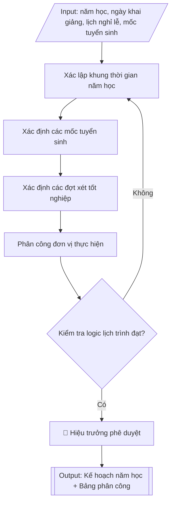

# Skill: Lập kế hoạch năm học

## Khi nào dùng
Khi cần xây dựng kế hoạch năm học mới (năm học đào tạo hệ chính quy) hoặc điều chỉnh
kế hoạch năm học hiện hành: xác định khung thời gian khai giảng, các học kỳ, lịch thi
kết thúc học phần, các kỳ nghỉ lễ/Tết, lịch bảo vệ khóa luận/đồ án tốt nghiệp, các đợt
xét và công nhận tốt nghiệp, mốc tuyển sinh và phân công đơn vị thực hiện từng đầu việc.

## Đầu vào (Input)

| Trường | Mô tả | Bắt buộc |
|---|---|---|
| `nam_hoc` | Năm học cần lập kế hoạch (ví dụ: 2026–2027) | Có |
| `so_hoc_ky` | Số học kỳ trong năm (2 hoặc 3, kể cả học kỳ hè nếu có) | Có |
| `ngay_khai_giang` | Ngày dự kiến khai giảng năm học | Có |
| `lich_nghi_le_tet` | Các đợt nghỉ lễ, Tết trong năm (Tết Dương lịch, Tết Nguyên đán, 30/4–1/5, Giỗ Tổ...) | Có |
| `moc_tuyen_sinh` | Các mốc tuyển sinh (nhập học tân sinh viên, xét tuyển đợt bổ sung...) | Có |
| `dot_xet_tot_nghiep` | Các đợt xét và công nhận tốt nghiệp dự kiến trong năm | Có |
| `he_dao_tao` | Hệ đào tạo áp dụng (chính quy / vừa làm vừa học / từ xa...) | Không (mặc định: chính quy) |
| `don_vi_phoi_hop` | Các đơn vị phối hợp thực hiện (các khoa, Phòng CTSV, Phòng KT&ĐBCL...) | Không |
| `nguoi_ky` | Hiệu trưởng / Phó Hiệu trưởng phụ trách đào tạo | Không (mặc định: Phó Hiệu trưởng) |

## Quy trình

**Bước 1. Xác lập khung thời gian năm học**
- Làm gì: từ `nam_hoc`, `ngay_khai_giang`, `so_hoc_ky`, `lich_nghi_le_tet` dựng khung thời gian:
  ngày khai giảng; ngày bắt đầu – kết thúc từng học kỳ (học kỳ 1, học kỳ 2, học kỳ hè nếu có);
  lịch thi kết thúc học phần cuối mỗi học kỳ (thường 2–3 tuần) kèm lịch thi lại/thi cải thiện;
  các kỳ nghỉ lễ/Tết; lịch bảo vệ khóa luận/đồ án tốt nghiệp theo từng đợt.
- Dùng input: `nam_hoc`, `ngay_khai_giang`, `so_hoc_ky`, `lich_nghi_le_tet`, `he_dao_tao`.
- Vai trò: Chuyên viên Phòng Đào tạo · AI hỗ trợ: dựng khung sơ bộ, đối chiếu khung kế hoạch thời gian của Bộ GD&ĐT · ⏱ ~1 giờ (ước tính)
- Lưu ý nghiệp vụ: khung thời gian năm học của trường phải nằm trong khung kế hoạch thời gian
  năm học do Bộ GD&ĐT ban hành hằng năm; đảm bảo đủ số tuần học theo quy định (thường
  ≥ 15 tuần/học kỳ chính); học kỳ hè không được đè lên thời gian của học kỳ chính.
- → Kết quả bước: khung thời gian năm học (khai giảng, các học kỳ, lịch thi, nghỉ lễ/Tết,
  bảo vệ tốt nghiệp) dạng bảng sơ bộ.

**Bước 2. Xác định các mốc tuyển sinh**
- Làm gì: từ `moc_tuyen_sinh` đưa vào khung thời gian Bước 1 các mốc: nhập học tân sinh viên
  (các đợt), xét tuyển bổ sung; kiểm tra mốc nhập học không trùng với tuần thi kết thúc học
  phần của sinh viên đang học.
- Dùng input: `moc_tuyen_sinh`, kết quả Bước 1 (khung thời gian).
- Vai trò: Chuyên viên Phòng Đào tạo · AI hỗ trợ: chèn mốc tuyển sinh vào khung, kiểm tra xung đột lịch · ⏱ ~30 phút (ước tính)
- Lưu ý nghiệp vụ: mốc xét tuyển bổ sung phải sau khi có kết quả xét tuyển đợt chính và còn
  trong thời hạn Bộ cho phép; tuần sinh hoạt công dân đầu khóa của tân sinh viên phải được
  bố trí ngay sau nhập học.
- → Kết quả bước: các mốc tuyển sinh đã chèn vào khung thời gian năm học.

**Bước 3. Xác định các đợt xét và công nhận tốt nghiệp**
- Làm gì: từ `dot_xet_tot_nghiep` xác định số đợt trong năm (thường 2–4 đợt), thời điểm họp
  Hội đồng xét tốt nghiệp và thời điểm trao bằng từng đợt; đặt các đợt xét sau khi đã có đủ
  điểm thi và điểm bảo vệ khóa luận của đợt tương ứng.
- Dùng input: `dot_xet_tot_nghiep`, kết quả Bước 1 (lịch thi, lịch bảo vệ).
- Vai trò: Chuyên viên Phòng Đào tạo · AI hỗ trợ: chèn mốc xét tốt nghiệp vào khung, kiểm tra thứ tự điểm thi/bảo vệ · ⏱ ~30 phút (ước tính)
- Lưu ý nghiệp vụ: bẫy thường gặp — đặt lịch họp Hội đồng xét tốt nghiệp trước khi có đủ
  điểm thi/bảo vệ, phải dời lịch; đợt xét cuối năm học phải xong trước ngày kết thúc năm học
  để kịp báo cáo.
- → Kết quả bước: các đợt xét tốt nghiệp đã chèn vào khung thời gian năm học.

**Bước 4. Phân công đơn vị thực hiện**
- Làm gì: với mỗi đầu việc chính trong khung thời gian, phân công từ `don_vi_phoi_hop`:
  đơn vị chủ trì và đơn vị phối hợp — Phòng Đào tạo chủ trì chung; các khoa (lên lịch học
  phần, phân công giảng viên); Phòng Khảo thí & ĐBCL (tổ chức thi); Phòng CTSV (công tác tân
  sinh viên); Phòng Tài chính (thu học phí).
- Dùng input: `don_vi_phoi_hop`, kết quả Bước 1–3 (danh sách đầu việc).
- Vai trò: Trưởng phòng Đào tạo quyết định phân công đơn vị · AI hỗ trợ: đề xuất phương án phân công chủ trì/phối hợp · ⏱ ~30 phút (ước tính)
- Lưu ý nghiệp vụ: mỗi đầu việc chỉ có một đơn vị chủ trì (tránh "cha chung không ai khóc");
  đầu việc liên quan thu học phí phải gắn với Phòng Tài chính ngay từ đầu để tránh chậm thu.
- → Kết quả bước: bảng phân công đơn vị thực hiện (đầu việc – đơn vị chủ trì – đơn vị phối hợp).

**Bước 5. Kiểm tra logic toàn bộ lịch trình**
- Làm gì: rà soát chéo khung thời gian: không trùng lịch thi với nghỉ lễ; học kỳ hè không đè
  lên học kỳ chính; đủ số tuần học theo quy định; thời gian xét tốt nghiệp đặt sau khi có đủ
  điểm; mốc tuyển sinh không xung đột với lịch thi; sửa các điểm chưa hợp lý.
- Dùng input: kết quả Bước 1–4 (toàn bộ khung thời gian và phân công).
- Vai trò: Chuyên viên Phòng Đào tạo · AI hỗ trợ: rà soát sơ bộ logic lịch trình, phát hiện xung đột · ⏱ ~45 phút (ước tính)
- Lưu ý nghiệp vụ: đây là cổng chặn lỗi cuối — nên vẽ lịch trên trục thời gian trực quan để
  phát hiện xung đột; đặc biệt kiểm tra các tuần "cao điểm" (vừa thi vừa nhập học vừa xét
  tốt nghiệp) để điều phối nguồn lực.
- → Kết quả bước: khung thời gian năm học đã kiểm tra logic, danh sách điều chỉnh (nếu có).

**Bước 6. Hoàn thiện và trình ban hành kế hoạch**
- Làm gì: xuất bản bảng tiến độ kế hoạch năm học hoàn chỉnh theo tháng/tuần (mốc thời gian –
  nội dung – đơn vị thực hiện) kèm bảng phân công và ghi chú điều chỉnh (học kỳ hè, nhiều đợt
  tuyển sinh nếu có); trình `nguoi_ky` (mặc định Phó Hiệu trưởng phụ trách đào tạo, hoặc Hiệu
  trưởng) phê duyệt ban hành; gửi các đơn vị triển khai.
- Dùng input: `nguoi_ky`, kết quả Bước 5.
- Vai trò: Phó Hiệu trưởng (phụ trách đào tạo) hoặc Hiệu trưởng phê duyệt; chuyên viên Phòng Đào tạo gửi các đơn vị · AI hỗ trợ: hoàn thiện kế hoạch, chuẩn bị tài liệu trình ký · ⏱ ~30 phút (ước tính)
- Lưu ý nghiệp vụ: kế hoạch phải được ban hành trước khi năm học bắt đầu đủ thời gian để các
  đơn vị chuẩn bị; mọi điều chỉnh sau ban hành phải có văn bản điều chỉnh, không sửa lặng lẽ.
- → Kết quả bước: kế hoạch năm học hoàn chỉnh đã ký ban hành, đã gửi các đơn vị.

## Luồng quy trình (Workflow)

## Đầu ra (Output)
- Kế hoạch năm học hoàn chỉnh dạng bảng tiến độ (theo tháng, nêu rõ mốc thời gian – nội dung – đơn vị thực hiện).
- Bảng phân công đơn vị thực hiện từng đầu việc chính.
- Ghi chú điều chỉnh (nếu năm học có học kỳ hè hoặc nhiều đợt tuyển sinh).

**Cấu trúc output chuẩn:** khung mẫu CỐ ĐỊNH của sản phẩm chính (Kế hoạch năm học), các phần
bắt buộc theo đúng thứ tự xuất hiện:
1. Tiêu đề: KẾ HOẠCH NĂM HỌC ... (ghi rõ tên trường và hệ đào tạo áp dụng).
2. Bảng tiến độ kế hoạch năm học: các cột Tháng – Thời gian – Nội dung công việc – Đơn vị
   thực hiện; sắp xếp theo trình tự thời gian từ khai giảng đến kết thúc năm học; bao gồm
   khai giảng, các học kỳ, lịch thi, nghỉ lễ/Tết, bảo vệ tốt nghiệp, các mốc tuyển sinh,
   các đợt xét tốt nghiệp.
3. Bảng phân công đơn vị thực hiện: các cột Đầu việc – Đơn vị chủ trì – Đơn vị phối hợp.
4. Ghi chú điều chỉnh (nếu có): học kỳ hè, nhiều đợt tuyển sinh hoặc nội dung đặc thù khác.

## Checklist nghiệm thu

- [ ] Đủ 4 phần theo "Cấu trúc output chuẩn": tiêu đề kế hoạch năm học (tên trường, hệ đào tạo), bảng tiến độ theo tháng/tuần, bảng phân công đơn vị thực hiện, ghi chú điều chỉnh (nếu có).
- [ ] Khung thời gian nằm trong khung kế hoạch thời gian năm học của Bộ GD&ĐT; đủ số tuần học theo quy định (≥ 15 tuần/học kỳ chính).
- [ ] Không xung đột lịch: lịch thi không trùng nghỉ lễ; học kỳ hè không đè học kỳ chính; xét tốt nghiệp đặt sau khi có đủ điểm thi/bảo vệ; mốc tuyển sinh không xung đột với lịch thi.
- [ ] Mỗi đầu việc chỉ có một đơn vị chủ trì duy nhất; đầu việc thu học phí gắn với đơn vị tài chính.
- [ ] Thời gian, nội dung, đơn vị thực hiện khớp với Input đã cho.
- [ ] Không bịa đặt ngày tháng, văn bản của Bộ hay trích dẫn quy định.
- [ ] Kế hoạch được ban hành trước khi năm học bắt đầu; mọi điều chỉnh sau ban hành có văn bản điều chỉnh.
- [ ] Đã qua Human gate: Hiệu trưởng đã phê duyệt ban hành.

Tiêu chí đạt = tất cả các ô được đánh dấu.

## Ví dụ mô phỏng (dữ liệu giả lập)

> Tất cả tên trường, cá nhân, số liệu dưới đây đều là **giả lập**, không liên quan tổ chức/cá nhân có thật.

### Input mẫu

| Trường | Giá trị |
|---|---|
| `nam_hoc` | 2026–2027 |
| `so_hoc_ky` | 3 (học kỳ 1, học kỳ 2, học kỳ hè) |
| `ngay_khai_giang` | 05/09/2026 |
| `lich_nghi_le_tet` | Tết Dương lịch (01–03/01/2027); Tết Nguyên đán (06–16/02/2027); Giỗ Tổ (25/04/2027); 30/4–03/05/2027; Quốc khánh 2/9 |
| `moc_tuyen_sinh` | Nhập học tân sinh viên đợt 1: 05–07/09/2026; xét tuyển bổ sung: 10–15/10/2026 |
| `dot_xet_tot_nghiep` | Đợt 1: tháng 01/2027; Đợt 2: tháng 06/2027; Đợt 3: tháng 09/2027 |
| `he_dao_tao` | Chính quy |

### Output mẫu

**KẾ HOẠCH NĂM HỌC 2026–2027**
*(Trường Đại học A — hệ chính quy)*

| Tháng | Thời gian | Nội dung công việc | Đơn vị thực hiện |
|---|---|---|---|
| 9/2026 | 05/09 | Khai giảng năm học 2026–2027 | Phòng HCTH, các đơn vị |
| 9/2026 | 05–07/09 | Nhập học tân sinh viên khóa 2026 (đợt 1) | Phòng Đào tạo, Phòng CTSV, các khoa |
| 9/2026 | 07/09 | Bắt đầu học kỳ 1 (tuần 1) | Các khoa |
| 10/2026 | 10–15/10 | Xét tuyển bổ sung, nhập học đợt 2 | Phòng Đào tạo |
| 12/2026 | 21/12–09/01 | Thi kết thúc học phần học kỳ 1 | Phòng KT&ĐBCL, các khoa |
| 01/2027 | 01–03/01 | Nghỉ Tết Dương lịch | Toàn trường |
| 01/2027 | 15/01 | Hội đồng xét tốt nghiệp đợt 1 | Phòng Đào tạo |
| 01/2027 | 18/01 | Bắt đầu học kỳ 2 (tuần 1) | Các khoa |
| 02/2027 | 06–16/02 | Nghỉ Tết Nguyên đán | Toàn trường |
| 04/2027 | 25/04 | Nghỉ Giỗ Tổ Hùng Vương | Toàn trường |
| 4–5/2027 | 30/04–03/05 | Nghỉ lễ 30/4–1/5 | Toàn trường |
| 05/2027 | 17/05–05/06 | Thi kết thúc học phần học kỳ 2 | Phòng KT&ĐBCL, các khoa |
| 06/2027 | 08–12/06 | Bảo vệ khóa luận tốt nghiệp đợt 2 | Các khoa |
| 06/2027 | 25/06 | Hội đồng xét tốt nghiệp đợt 2 | Phòng Đào tạo |
| 07/2027 | 05/07 | Bắt đầu học kỳ hè (tuần 1) | Các khoa |
| 08/2027 | 16–21/08 | Thi kết thúc học phần học kỳ hè | Phòng KT&ĐBCL |
| 09/2027 | 02/09 | Nghỉ Quốc khánh | Toàn trường |
| 09/2027 | 20/09 | Hội đồng xét tốt nghiệp đợt 3; kết thúc năm học | Phòng Đào tạo |

**Phân công đơn vị thực hiện (đầu việc chính):**

| Đầu việc | Đơn vị chủ trì | Đơn vị phối hợp |
|---|---|---|
| Xây dựng thời khóa biểu từng học kỳ | Phòng Đào tạo | Các khoa, Phòng QT-TB |
| Tổ chức thi kết thúc học phần | Phòng KT&ĐBCL | Các khoa, Phòng Đào tạo |
| Xét và công nhận tốt nghiệp | Phòng Đào tạo | Các khoa, Phòng CTSV, Phòng TC-KT |
| Công tác tân sinh viên, tuần SHCD | Phòng CTSV | Phòng Đào tạo, các khoa |
| Thu học phí theo học kỳ | Phòng TC-KT | Phòng Đào tạo |

## Căn cứ & lưu ý
- Quy chế đào tạo trình độ đại học (Thông tư 08/2021/TT-BGDĐT): đảm bảo số tuần học tối thiểu,
  khối lượng kiến thức và thời gian đào tạo theo từng ngành.
- Khung kế hoạch thời gian năm học do Bộ GD&ĐT ban hành hằng năm.
- Khi mô phỏng không dùng tên thật của trường/cá nhân; kế hoạch phải trình Hiệu trưởng phê duyệt
  trước khi ban hành chính thức.
