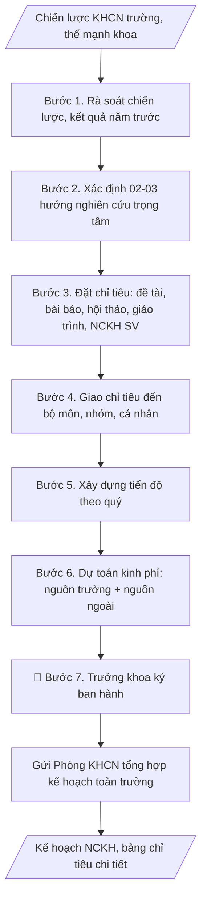

# Kế hoạch NCKH cấp khoa

## Định dạng và file đầu ra

Định dạng đầu ra có thể chọn theo sản phẩm/yêu cầu: .docx, .pdf. Đọc mục “Định dạng bổ sung” trong quy cách đầu ra trước khi chọn.

**Phải tạo file thực tế để tải xuống, không chỉ trả nội dung trong chat.** Định dạng mặc định của skill: **.docx**. Nếu có bảng số liệu nghiệp vụ yêu cầu file bảng tính riêng, tạo thêm Excel theo yêu cầu; không tự tạo file kiểm tra. Không chờ người dùng yêu cầu xuất file lần nữa. Ưu tiên định dạng người dùng chỉ định; đọc quy tắc xuất file tại references/quy-cach-dau-ra.md.

## Quy cách đầu ra và thông tin thiếu
Đọc [quy cách và cấu trúc sản phẩm](references/quy-cach-dau-ra.md) trước khi soạn/xuất. File giao chỉ gồm sản phẩm nghiệp vụ được yêu cầu; kiểm tra nội bộ không xuất kèm. Thiếu thông tin thì giữ nguyên trường/mục và chỗ điền theo mẫu gốc (dòng dấu chấm, dấu gạch hoặc ô trống); không tự điền dữ liệu mẫu, số 0, mã chờ xác minh hay dòng chờ ký. Mẫu chuyên ngành còn áp dụng được ưu tiên về cấu trúc, mã biểu và người ký. Bản đầy đủ: [quy tắc chung](references/quy-tac-chung.md).

## Kiểm soát áp dụng và phê duyệt
Trước khi chạy, xác định `ngay_ap_dung`, `loai_hinh_truong`, `quy_che_noi_bo`, `nguon_du_lieu`, `nguoi_kiem_duyet`; chỉ hỏi thông tin liên quan nghiệp vụ, không dùng giá trị giả định thay dữ liệu bắt buộc. Đối chiếu căn cứ pháp lý với văn bản gốc, hiệu lực, điều khoản áp dụng và chuyển tiếp. Bản đầy đủ: [quy tắc chung](references/quy-tac-chung.md).

## Giới hạn và human gate
AI hỗ trợ chuẩn bị và đối chiếu; cán bộ phụ trách kiểm tra dữ liệu/căn cứ, người có thẩm quyền duyệt và ký. Không đánh dấu đã ký, đã duyệt, đã công bố khi chưa có chứng cứ. Dữ liệu sinh viên, sức khỏe, nhân sự, tài chính chỉ dùng theo mục đích và phân quyền, che thông tin định danh khi dùng ví dụ (Luật 91/2025/QH15, hiệu lực 01/01/2026); không tải dữ liệu lên dịch vụ ngoài khi chưa có quyền. Bản đầy đủ: [quy tắc chung](references/quy-tac-chung.md).

## Khi nào dùng
Khi đầu năm học, khoa cần xây dựng kế hoạch nghiên cứu khoa học cho giảng viên
và sinh viên, làm căn cứ giao nhiệm vụ và đánh giá cuối năm.

## Đầu vào (Input)

| Trường | Mô tả | Bắt buộc |
|---|---|---|
| `khoa` | Tên khoa | Có |
| `nam_hoc` | Năm học kế hoạch | Có |
| `dinh_huong` | Định hướng nghiên cứu của khoa (gắn với chiến lược trường) | Có |
| `chi_tieu` | Chỉ tiêu: số đề tài (cấp bộ/trường), bài báo (quốc tế/trong nước), hội thảo, giáo trình | Có |
| `luc_luong` | Số GV tham gia, nhóm nghiên cứu mạnh | Không |

## Quy trình

**Bước 1. Rà soát chiến lược và kết quả năm trước**
- Làm gì: Thu thập chiến lược KHCN của trường (giai đoạn hiện hành), kế hoạch NCKH
  khoa năm trước và kết quả thực hiện (tỷ lệ hoàn thành chỉ tiêu từng mảng); xác định
  thế mạnh, nhóm nghiên cứu mạnh của khoa; ghi nhận các vướng mắc năm trước (kinh phí,
  nhân lực, thủ tục) để tránh lặp lại.
- Dùng input: `khoa`, `nam_hoc`, `dinh_huong`
- Vai trò: Giảng viên · AI hỗ trợ: tổng hợp kết quả năm trước, thế mạnh và vướng mắc thành báo cáo rà soát · ⏱ 2–3 giờ (ước tính)
- Lưu ý nghiệp vụ: Kế hoạch mới phải kế thừa, không "làm lại từ số 0" — chỉ tiêu năm
  trước không đạt thì năm nay phải có giải pháp cụ thể đi kèm, không chỉ nâng số;
  định hướng nghiên cứu phải gắn với chiến lược của trường, tránh đặt hướng "trên trời"
  không có lực lượng thực hiện.
- → Kết quả bước: Báo cáo rà soát (định hướng chiến lược, kết quả năm trước, thế
  mạnh/vướng mắc của khoa).

**Bước 2. Xác định hướng nghiên cứu trọng tâm**
- Làm gì: Căn cứ chiến lược trường và thế mạnh khoa, đề xuất 02–03 hướng nghiên cứu
  trọng tâm của năm học; lấy ý kiến các bộ môn/nhóm nghiên cứu; chốt danh sách hướng
  trọng tâm được tập thể khoa thống nhất.
- Dùng input: `dinh_huong`, `luc_luong`
- Vai trò: Giảng viên · AI hỗ trợ: đề xuất các hướng nghiên cứu trọng tâm, tập thể khoa thảo luận và thống nhất · ⏱ 1–2 ngày làm việc (lấy ý kiến bộ môn) (ước tính)
- Lưu ý nghiệp vụ: Mỗi hướng trọng tâm phải có ít nhất một nhóm nghiên cứu "đỡ đầu" —
  hướng không có lực lượng là hướng chết; số hướng không nên quá 3 để tránh dàn trải
  nguồn lực.
- → Kết quả bước: Danh sách 02–03 hướng nghiên cứu trọng tâm đã thống nhất.

**Bước 3. Đặt chỉ tiêu cụ thể từng mảng**
- Làm gì: Đặt chỉ tiêu định lượng cho 5 mảng: (1) Đề tài — số lượng theo cấp
  (bộ/trường), tiến độ đăng ký – nghiệm thu; (2) Bài báo — số bài quốc tế/trong nước,
  gắn với từng nhóm nghiên cứu; (3) Hội thảo — số hội thảo tổ chức/tham gia;
  (4) Giáo trình, bài giảng — số biên soạn mới/tái bản; (5) NCKH sinh viên — số đề tài
  SV, giải thưởng mục tiêu. Đối chiếu chỉ tiêu với năng lực thực tế của đội ngũ.
- Dùng input: `chi_tieu`, `luc_luong`
- Vai trò: Giảng viên · AI hỗ trợ: lập bảng chỉ tiêu dự thảo 5 mảng theo năng lực đội ngũ, lãnh đạo khoa quyết định chỉ tiêu · ⏱ 2–3 giờ (ước tính)
- Lưu ý nghiệp vụ: Chỉ tiêu phải vừa sức nhưng có tính phấn đấu — chỉ tiêu "an toàn"
  quá thấp sẽ bị đánh giá thiếu tham vọng khi tổng hợp toàn trường; bài báo quốc tế
  nên gắn tên nhóm/cá nhân cụ thể, tránh chỉ tiêu chung chung không ai chịu trách nhiệm.
- → Kết quả bước: Bảng chỉ tiêu chi tiết 5 mảng (đề tài, bài báo, hội thảo, giáo
  trình, NCKH sinh viên).

**Bước 4. Giao chỉ tiêu đến bộ môn, nhóm, cá nhân**
- Làm gì: Phân bổ chỉ tiêu từ Bước 3 xuống từng bộ môn/nhóm nghiên cứu/cá nhân theo
  năng lực và hướng trọng tâm; lập bảng phân công chi tiết; gửi dự thảo cho các bộ môn
  góp ý, điều chỉnh trước khi chốt.
- Dùng input: `chi_tieu`, `luc_luong`
- Vai trò: Giảng viên · AI hỗ trợ: phân bổ chỉ tiêu dự thảo xuống bộ môn/nhóm, các bộ môn góp ý và điều chỉnh trước khi chốt · ⏱ 2–3 ngày làm việc (ước tính)
- Lưu ý nghiệp vụ: Tổng chỉ tiêu các bộ môn cộng lại phải khớp với chỉ tiêu chung của
  khoa — lệch là lỗi hay gặp nhất; khi giao chỉ tiêu cho cá nhân phải gắn với đánh giá
  thi đua cuối năm thì mới có tính ràng buộc.
- → Kết quả bước: Bảng phân công chỉ tiêu theo bộ môn/nhóm nghiên cứu.

**Bước 5. Xây dựng tiến độ thực hiện theo quý**
- Làm gì: Lập lịch các mốc chính theo quý: đăng ký đề tài (thường Q4 năm trước/Q1),
  nộp bài báo (rải đều 4 quý), tổ chức/tham gia hội thảo, nghiệm thu giáo trình, tổng
  kết NCKH sinh viên; gắn mốc kiểm tra giữa kỳ (sơ kết 6 tháng) để điều chỉnh.
- Dùng input: `nam_hoc`
- Vai trò: Giảng viên · AI hỗ trợ: lập lịch tiến độ theo quý và mốc sơ kết giữa kỳ từ lịch chính thức của Phòng KHCN · ⏱ 1–2 giờ (ước tính)
- Lưu ý nghiệp vụ: Mốc đăng ký đề tài cấp bộ/cấp trường do cấp trên quy định — phải
  lấy lịch chính thức từ Phòng KHCN, không tự đặt; bài báo quốc tế cần thời gian phản
  biện dài, nên đặt mốc nộp sớm hơn mốc công bố ít nhất 2 quý.
- → Kết quả bước: Lịch tiến độ thực hiện theo quý (kèm mốc sơ kết giữa kỳ).

**Bước 6. Dự toán kinh phí**
- Làm gì: Dự toán chi tiết theo nguồn: nguồn của trường (đề tài cấp trường, hội thảo,
  hỗ trợ bài báo, NCKH sinh viên) và nguồn ngoài (đề tài cấp bộ, hợp tác doanh nghiệp,
  địa phương); đối chiếu với định mức chi của trường; tổng hợp thành bảng dự toán.
- Dùng input: `chi_tieu`
- Vai trò: Giảng viên · AI hỗ trợ: lập bảng dự toán theo định mức hiện hành, kế toán/khoa kiểm tra nguồn trường và nguồn ngoài · ⏱ 2–3 giờ (ước tính)
- Lưu ý nghiệp vụ: Nguồn ngoài chỉ ghi "dự kiến" kèm cơ sở (đề tài đã trúng tuyển,
  hợp đồng đã ký) — không ghi số "ảo" để làm đẹp kế hoạch; kinh phí hỗ trợ bài báo
  quốc tế phải theo đúng định mức hiện hành của trường.
- → Kết quả bước: Bảng dự toán kinh phí (nguồn trường + nguồn ngoài).

**Bước 7. Hoàn thiện văn bản, trình ký ban hành**
- Làm gì: Soạn thảo văn bản kế hoạch đầy đủ các phần (định hướng, chỉ tiêu, phân công,
  tiến độ, kinh phí, tổ chức thực hiện); kiểm tra tính nhất quán giữa các bảng;
  trình Trưởng khoa ký ban hành; gửi Phòng KHCN để tổng hợp kế hoạch toàn trường;
  phổ biến đến các bộ môn.
- Dùng input: `khoa`, `nam_hoc`
- Vai trò: Trưởng khoa · AI hỗ trợ: chuẩn bị dự thảo, tài liệu và số liệu phục vụ bước này · ⏱ 1–2 ngày làm việc (ước tính)
- Lưu ý nghiệp vụ: Kiểm tra lần cuối: tổng các bảng phân công khớp với bảng chỉ tiêu
  chung; số ký hiệu văn bản, ngày tháng đúng thể thức; kế hoạch phải ban hành trước
  khi năm học bắt đầu đủ sớm để các bộ môn kịp cụ thể hóa thành kế hoạch bộ môn.
- → Kết quả bước: Văn bản kế hoạch NCKH cấp khoa đã ký ban hành + bảng chỉ tiêu chi
  tiết theo bộ môn/nhóm nghiên cứu.

## Luồng quy trình (Workflow)

## Đầu ra

File nghiệp vụ thực tế theo định dạng mặc định ở đầu skill hoặc định dạng người dùng yêu cầu, kèm liên kết tải trong phản hồi cuối.

Sản phẩm nghiệp vụ hoàn chỉnh theo [quy cách và cấu trúc](references/quy-cach-dau-ra.md), giữ các trường chưa có dữ liệu ở trạng thái trống. Không xuất kèm checklist/phụ lục kiểm tra đầu ra.

## Kiểm tra nội bộ trước khi giao

- [ ] Bố cục khớp mẫu áp dụng và cấu trúc tại references/quy-cach-dau-ra.md.
- [ ] Nội dung khớp với Input: 02–03 hướng trọng tâm, chỉ tiêu 5 mảng (đề tài, bài báo, hội thảo, giáo trình, NCKH SV).
- [ ] Tổng chỉ tiêu các bộ môn cộng lại khớp với chỉ tiêu chung của khoa.
- [ ] Nguồn ngoài chỉ ghi "dự kiến" kèm cơ sở; kinh phí theo đúng định mức hiện hành của trường.
- [ ] Mỗi hướng trọng tâm có ít nhất một nhóm nghiên cứu "đỡ đầu".
- [ ] Bài báo quốc tế gắn tên nhóm/cá nhân cụ thể; mốc nộp sớm hơn mốc công bố ít nhất 2 quý.
- [ ] Mốc đăng ký đề tài cấp bộ/cấp trường lấy đúng lịch chính thức của Phòng KHCN.
- [ ] Đúng thể thức: số ký hiệu, ngày tháng, nơi nhận, chữ ký Trưởng khoa.
- [ ] Đã qua Human gate: Trưởng khoa đã ký ban hành; kế hoạch đã gửi Phòng KHCN và phổ biến đến các bộ môn.
- [ ] Kế hoạch ban hành đủ sớm để các bộ môn kịp cụ thể hóa thành kế hoạch bộ môn.

Tiêu chí đạt = tất cả các ô được đánh dấu.

## Căn cứ & lưu ý
- Chiến lược phát triển khoa học công nghệ của Trường Đại học A (giả lập).
- Chỉ tiêu NCKH gắn với đánh giá thi đua và là minh chứng cho tiêu chí về NCKH
  trong kiểm định chất lượng.
- Khuyến khích đề tài gắn với doanh nghiệp, địa phương để tăng tính ứng dụng
  và nguồn kinh phí ngoài ngân sách.
- Không dùng tên thật của trường/cá nhân khi mô phỏng.

## Quản trị phiên bản
- Phiên bản gói `1.3.2` (cập nhật 2026-10-10); hồ sơ đầy đủ tại [references/version.json](references/version.json).
- Người phê duyệt nghiệp vụ: **chưa chỉ định**. Trạng thái: dự thảo nghiệp vụ; kiểm tra pháp lý trước thực thi. Ngày cập nhật không đồng nghĩa mọi văn bản đã được rà soát toàn văn.
- Giấy phép theo LICENSE của kho (bản quyền CES Global). Lịch sử thay đổi: CHANGELOG.md.
