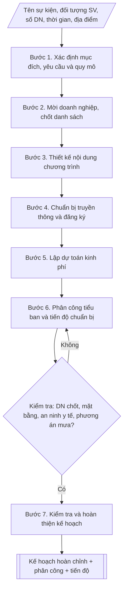

# Kế hoạch Ngày hội việc làm

## Định dạng và file đầu ra

Định dạng đầu ra có thể chọn theo sản phẩm/yêu cầu: .docx, .pdf. Đọc mục “Định dạng bổ sung” trong quy cách đầu ra trước khi chọn.

**Phải tạo file thực tế để tải xuống, không chỉ trả nội dung trong chat.** Định dạng mặc định của skill: **.docx**. Nếu có bảng số liệu nghiệp vụ yêu cầu file bảng tính riêng, tạo thêm Excel theo yêu cầu; không tự tạo file kiểm tra. Không chờ người dùng yêu cầu xuất file lần nữa. Ưu tiên định dạng người dùng chỉ định; đọc quy tắc xuất file tại references/quy-cach-dau-ra.md.

## Quy cách đầu ra và thông tin thiếu
Khi dựng file Word/Excel, áp dụng mục “Thể thức và bảng biểu khi dựng file” trong quy cách đầu ra (cỡ chữ từng thành phần, bảng nhiều trang, số trang, phụ lục). Đọc [quy cách và cấu trúc sản phẩm](references/quy-cach-dau-ra.md) trước khi soạn/xuất. File giao chỉ gồm sản phẩm nghiệp vụ được yêu cầu; kiểm tra nội bộ không xuất kèm. Thiếu thông tin thì giữ nguyên trường/mục và chỗ điền theo mẫu gốc (dòng dấu chấm, dấu gạch hoặc ô trống); không tự điền dữ liệu mẫu, số 0, mã chờ xác minh hay dòng chờ ký. Mẫu chuyên ngành còn áp dụng được ưu tiên về cấu trúc, mã biểu và người ký. Bản đầy đủ: [quy tắc chung](references/quy-tac-chung.md).

## Kiểm soát áp dụng và phê duyệt
Trước khi chạy, xác định `ngay_ap_dung`, `loai_hinh_truong`, `quy_che_noi_bo`, `nguon_du_lieu`, `nguoi_kiem_duyet`; chỉ hỏi thông tin liên quan nghiệp vụ, không dùng giá trị giả định thay dữ liệu bắt buộc. Đối chiếu căn cứ pháp lý với văn bản gốc, hiệu lực, điều khoản áp dụng và chuyển tiếp. Bản đầy đủ: [quy tắc chung](references/quy-tac-chung.md).

## Giới hạn và human gate
AI hỗ trợ chuẩn bị và đối chiếu; cán bộ phụ trách kiểm tra dữ liệu/căn cứ, người có thẩm quyền duyệt và ký. Không đánh dấu đã ký, đã duyệt, đã công bố khi chưa có chứng cứ. Dữ liệu sinh viên, sức khỏe, nhân sự, tài chính chỉ dùng theo mục đích và phân quyền, che thông tin định danh khi dùng ví dụ (Luật 91/2025/QH15, hiệu lực 01/01/2026); không tải dữ liệu lên dịch vụ ngoài khi chưa có quyền. Bản đầy đủ: [quy tắc chung](references/quy-tac-chung.md).

## Khi nào dùng
Khi trường cần tổ chức Ngày hội việc làm (Job Fair) nhằm kết nối sinh viên năm cuối /
sinh viên mới tốt nghiệp với doanh nghiệp tuyển dụng: gian hàng giới thiệu – tuyển
dụng, phỏng vấn thử, tọa đàm kỹ năng nghề nghiệp, ký kết hợp tác doanh nghiệp.

## Đầu vào (Input)

| Trường | Mô tả | Bắt buộc |
|---|---|---|
| `ten_su_kien` | Tên ngày hội (vd: Ngày hội việc làm năm 2027) | Có |
| `doi_tuong_sv` | Sinh viên năm cuối, sinh viên mới tốt nghiệp (ghi rõ khóa, ngành) | Có |
| `so_luong_dn` | Số lượng doanh nghiệp tham gia dự kiến | Có (mặc định: 20) |
| `thoi_gian` | Ngày tổ chức, khung giờ | Có |
| `dia_diem` | Sân trường / nhà thi đấu / hội trường | Có |
| `nganh_nghe` | Các nhóm ngành ưu tiên mời doanh nghiệp (theo ngành đào tạo của trường) | Không |
| `kinh_phi` | Nguồn kinh phí (ngân sách trường / tài trợ doanh nghiệp / kết hợp) | Không |

## Quy trình

**Bước 1. Xác định mục đích – yêu cầu và quy mô**
- Làm gì: chốt mục đích (cầu nối tuyển dụng trực tiếp; sinh viên tiếp cận thị trường lao
  động, rèn kỹ năng ứng tuyển; quảng bá thương hiệu, mở rộng mạng lưới đối tác doanh nghiệp);
  xác định quy mô: số doanh nghiệp (khuyến nghị ~20 gian hàng cho lần đầu hoặc trường quy mô
  vừa), số sinh viên tham dự dự kiến, số vị trí tuyển dụng dự kiến.
- Dùng input: `ten_su_kien`, `doi_tuong_sv`, `so_luong_dn`.
- Vai trò: Trưởng Phòng Công tác sinh viên · AI hỗ trợ: soạn khung dự thảo · ⏱ ~2–3 giờ (ước tính)
- Lưu ý nghiệp vụ: quy mô phải tương xứng năng lực mặt bằng và nhân sự tổ chức; lần đầu tổ
  chức không nên vượt 20–25 gian hàng.
- → Kết quả bước: khung mục đích – yêu cầu + quy mô sự kiện (số DN, số SV, số vị trí dự kiến).

**Bước 2. Mời doanh nghiệp, chốt danh sách**
- Làm gì: lập danh sách doanh nghiệp theo nhóm ngành đào tạo của trường (`nganh_nghe`: công
  nghệ thông tin, kinh tế – quản trị, kỹ thuật, ngoại ngữ...); gửi thư mời trước 4–6 tuần;
  chốt danh sách; thu thập thông tin tuyển dụng (vị trí, số lượng, yêu cầu, quyền lợi) của
  từng doanh nghiệp để in cẩm nang ngày hội.
- Dùng input: `so_luong_dn`, `nganh_nghe`.
- Vai trò: Trưởng Phòng Công tác sinh viên · AI hỗ trợ: tổng hợp và đối chiếu dữ liệu thu thập được · ⏱ ~2–3 tuần (ước tính)
- Lưu ý nghiệp vụ: mời dư khoảng 50% so với chỉ tiêu để dự phòng từ chối; chốt thông tin
  tuyển dụng trước ít nhất 2 tuần để kịp in cẩm nang.
- → Kết quả bước: danh sách doanh nghiệp chốt tham gia + bộ thông tin tuyển dụng từng doanh
  nghiệp.

**Bước 3. Thiết kế nội dung chương trình**
- Làm gì: thiết kế chi tiết: lễ khai mạc (phát biểu lãnh đạo trường, đại diện doanh nghiệp,
  ký kết hợp tác nếu có); khu gian hàng (mỗi DN 1 gian hàng: bàn, ghế, backdrop, điện);
  phỏng vấn thử (số bàn, thời lượng mỗi lượt, đăng ký trước); tọa đàm kỹ năng ("Kỹ năng viết
  CV và phỏng vấn", "Xu hướng thị trường lao động", "Khởi nghiệp cho sinh viên"); khu tư vấn
  hướng nghiệp 1–1.
- Dùng input: `thoi_gian`, `dia_diem`, danh sách doanh nghiệp (kết quả bước 2).
- Vai trò: Chuyên viên Phòng Công tác sinh viên · AI hỗ trợ: soạn dự thảo kịch bản chương trình theo khung giờ · ⏱ ~2–3 giờ (ước tính)
- Lưu ý nghiệp vụ: khung giờ các hoạt động không chồng chéo gây phân tán sinh viên; phỏng
  vấn thử giới hạn số lượng theo năng lực chuyên gia.
- → Kết quả bước: kịch bản chương trình chi tiết theo khung giờ.

**Bước 4. Chuẩn bị truyền thông và đăng ký**
- Làm gì: thiết kế poster, banner, bài đăng fanpage, email tới sinh viên; mở form đăng ký
  tham dự và đăng ký phỏng vấn thử trước 2 tuần.
- Dùng input: `ten_su_kien`, `thoi_gian`, `dia_diem`.
- Vai trò: Chuyên viên Phòng Công tác sinh viên · AI hỗ trợ: soạn nội dung · ⏱ ~2–3 ngày (ước tính)
- Lưu ý nghiệp vụ: truyền thông chạy ít nhất 2 tuần trước sự kiện; form đăng ký thu đủ thông
  tin để phân luồng (ngành, nhu cầu phỏng vấn thử).
- → Kết quả bước: bộ ấn phẩm truyền thông + form đăng ký tham dự/phỏng vấn thử (đang mở).

**Bước 5. Lập dự toán kinh phí**
- Làm gì: lập dự toán theo hạng mục: dựng gian hàng, backdrop – sân khấu; âm thanh – ánh
  sáng; in cẩm nang – băng rôn; thù lao MC – chuyên gia tọa đàm; nước uống, quà tặng doanh
  nghiệp, lễ tân; dự phòng; phân rõ nguồn (ngân sách trường / phí gian hàng doanh nghiệp /
  tài trợ).
- Dùng input: `kinh_phi`, `so_luong_dn`.
- Vai trò: Chuyên viên Phòng Công tác sinh viên · AI hỗ trợ: tính toán dự toán · ⏱ ~2–3 giờ (ước tính)
- Lưu ý nghiệp vụ: mức phí gian hàng phải được doanh nghiệp chấp thuận khi gửi thư mời; có
  khoản dự phòng tối thiểu 5–10%.
- → Kết quả bước: bảng dự toán kinh phí chi tiết theo hạng mục + phân nguồn.

**Bước 6. Phân công tiểu ban và tiến độ chuẩn bị**
- Làm gì: thành lập Ban Tổ chức và các tiểu ban (nội dung – chương trình; hậu cần – kỹ thuật
  – mặt bằng; truyền thông – lễ tân; an ninh – y tế; tài chính – tổng hợp); lập tiến độ theo
  mốc (T-6 tuần đến ngày G và T+1 tuần tổng kết).
- Dùng input: kết quả các bước 1–5.
- Vai trò: Trưởng Phòng Công tác sinh viên · AI hỗ trợ: lập bảng dự thảo · ⏱ ~1–2 giờ (ước tính)
- Lưu ý nghiệp vụ: mỗi tiểu ban có trưởng ban chịu trách nhiệm và đầu mối phối hợp; mốc T-1
  tuần phải tổng duyệt mặt bằng, kịch bản.
- → Kết quả bước: bảng phân công nhiệm vụ các tiểu ban + bảng tiến độ chuẩn bị theo mốc.

**Bước 7. Kiểm tra và hoàn thiện kế hoạch**
- Làm gì: kiểm tra danh sách doanh nghiệp đã chốt, sơ đồ mặt bằng gian hàng, kịch bản MC,
  phương án an ninh – y tế – PCCC, phương án mưa (nếu ngoài trời); hoàn thiện văn bản kế
  hoạch trình ký.
- Dùng input: `dia_diem`, kết quả các bước 2–6.
- Vai trò: Trưởng Phòng Công tác sinh viên · AI hỗ trợ: đối chiếu checklist · ⏱ ~2–3 giờ (ước tính, chưa kể thời gian chờ duyệt)
- Lưu ý nghiệp vụ: chưa đạt hạng mục nào thì quay lại điều chỉnh ở bước tương ứng; sau sự
  kiện phải có báo cáo tổng kết và thư cảm ơn doanh nghiệp.
- → Kết quả bước: văn bản kế hoạch hoàn chỉnh + phụ lục phân công, tiến độ, danh sách doanh
  nghiệp, sẵn sàng trình ký.

## Luồng quy trình (Workflow)

## Đầu ra

File nghiệp vụ thực tế theo định dạng mặc định ở đầu skill hoặc định dạng người dùng yêu cầu, kèm liên kết tải trong phản hồi cuối.

Sản phẩm nghiệp vụ hoàn chỉnh theo [quy cách và cấu trúc](references/quy-cach-dau-ra.md), giữ các trường chưa có dữ liệu ở trạng thái trống. Không xuất kèm checklist/phụ lục kiểm tra đầu ra.

## Kiểm tra nội bộ trước khi giao

- [ ] Bố cục khớp mẫu áp dụng và cấu trúc tại references/quy-cach-dau-ra.md.
- [ ] Kèm phụ lục: bảng phân công nhiệm vụ các tiểu ban, bảng tiến độ chuẩn bị theo mốc (T-6 tuần đến T+1 tuần), danh sách doanh nghiệp tham gia.
- [ ] Quy mô (số doanh nghiệp, số sinh viên, số vị trí tuyển dụng dự kiến), thời gian, địa điểm khớp với Input đã cho.
- [ ] Không bịa đặt tên doanh nghiệp, số liệu vị trí tuyển dụng, đơn giá trong dự toán.
- [ ] Đúng thể thức văn bản kế hoạch: số/ký hiệu, địa danh, ngày tháng năm.
- [ ] Nguồn kinh phí rõ ràng (ngân sách trường / phí gian hàng / tài trợ); dự toán có khoản dự phòng tối thiểu 5–10%.
- [ ] Đã qua Human gate: kế hoạch được lãnh đạo phê duyệt, đã tổng duyệt (T-1 tuần) trước ngày tổ chức.
- [ ] Có phương án an ninh – y tế – PCCC và phương án thời tiết (nếu tổ chức ngoài trời); khung giờ các hoạt động (gian hàng, phỏng vấn thử, tọa đàm) không chồng chéo gây phân tán sinh viên.

Tiêu chí đạt = tất cả các ô được đánh dấu.

## Căn cứ & lưu ý
- Kế hoạch năm học và chiến lược hợp tác doanh nghiệp của Nhà trường.
- Thư mời doanh nghiệp gửi trước 4–6 tuần; chốt danh sách và thông tin tuyển dụng
  trước ít nhất 2 tuần để in cẩm nang.
- Có phương án dự phòng thời tiết (mưa) khi tổ chức ngoài trời; bảo đảm an ninh,
  y tế, PCCC trong suốt sự kiện.
- Sau sự kiện: báo cáo tổng kết (số DN, số vị trí tuyển dụng, số hồ sơ nộp, số SV
  được hẹn phỏng vấn / nhận việc), gửi thư cảm ơn doanh nghiệp.
- Không dùng tên thật của trường/cá nhân/doanh nghiệp khi mô phỏng.

## Quản trị phiên bản
- Phiên bản gói `1.3.2` (cập nhật 2026-10-10); hồ sơ đầy đủ tại [references/version.json](references/version.json).
- Người phê duyệt nghiệp vụ: **chưa chỉ định**. Trạng thái: dự thảo nghiệp vụ; kiểm tra pháp lý trước thực thi. Ngày cập nhật không đồng nghĩa mọi văn bản đã được rà soát toàn văn.
- Giấy phép theo LICENSE của kho (bản quyền CES Global). Lịch sử thay đổi: CHANGELOG.md.
