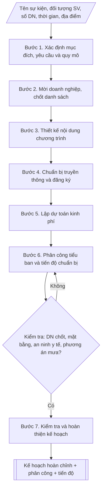

# Skill: Kế hoạch Ngày hội việc làm

## Khi nào dùng
Khi trường cần tổ chức Ngày hội việc làm (Job Fair) nhằm kết nối sinh viên năm cuối /
sinh viên mới tốt nghiệp với doanh nghiệp tuyển dụng: gian hàng giới thiệu – tuyển
dụng, phỏng vấn thử, tọa đàm kỹ năng nghề nghiệp, ký kết hợp tác doanh nghiệp.

## Đầu vào (Input)

| Trường | Mô tả | Bắt buộc |
|---|---|---|
| `ten_su_kien` | Tên ngày hội (vd: Ngày hội việc làm năm 2027) | Có |
| `doi_tuong_sv` | Sinh viên năm cuối, sinh viên mới tốt nghiệp (ghi rõ khóa, ngành) | Có |
| `so_luong_dn` | Số lượng doanh nghiệp tham gia dự kiến | Có (mặc định: 20) |
| `thoi_gian` | Ngày tổ chức, khung giờ | Có |
| `dia_diem` | Sân trường / nhà thi đấu / hội trường | Có |
| `nganh_nghe` | Các nhóm ngành ưu tiên mời doanh nghiệp (theo ngành đào tạo của trường) | Không |
| `kinh_phi` | Nguồn kinh phí (ngân sách trường / tài trợ doanh nghiệp / kết hợp) | Không |

## Quy trình

**Bước 1. Xác định mục đích – yêu cầu và quy mô**
- Làm gì: chốt mục đích (cầu nối tuyển dụng trực tiếp; sinh viên tiếp cận thị trường lao
  động, rèn kỹ năng ứng tuyển; quảng bá thương hiệu, mở rộng mạng lưới đối tác doanh nghiệp);
  xác định quy mô: số doanh nghiệp (khuyến nghị ~20 gian hàng cho lần đầu hoặc trường quy mô
  vừa), số sinh viên tham dự dự kiến, số vị trí tuyển dụng dự kiến.
- Dùng input: `ten_su_kien`, `doi_tuong_sv`, `so_luong_dn`.
- Vai trò: Trưởng Phòng Công tác sinh viên · AI hỗ trợ: soạn khung dự thảo · ⏱ ~2–3 giờ (ước tính)
- Lưu ý nghiệp vụ: quy mô phải tương xứng năng lực mặt bằng và nhân sự tổ chức; lần đầu tổ
  chức không nên vượt 20–25 gian hàng.
- → Kết quả bước: khung mục đích – yêu cầu + quy mô sự kiện (số DN, số SV, số vị trí dự kiến).

**Bước 2. Mời doanh nghiệp, chốt danh sách**
- Làm gì: lập danh sách doanh nghiệp theo nhóm ngành đào tạo của trường (`nganh_nghe`: công
  nghệ thông tin, kinh tế – quản trị, kỹ thuật, ngoại ngữ...); gửi thư mời trước 4–6 tuần;
  chốt danh sách; thu thập thông tin tuyển dụng (vị trí, số lượng, yêu cầu, quyền lợi) của
  từng doanh nghiệp để in cẩm nang ngày hội.
- Dùng input: `so_luong_dn`, `nganh_nghe`.
- Vai trò: Trưởng Phòng Công tác sinh viên · AI hỗ trợ: tổng hợp và đối chiếu dữ liệu thu thập được · ⏱ ~2–3 tuần (ước tính)
- Lưu ý nghiệp vụ: mời dư khoảng 50% so với chỉ tiêu để dự phòng từ chối; chốt thông tin
  tuyển dụng trước ít nhất 2 tuần để kịp in cẩm nang.
- → Kết quả bước: danh sách doanh nghiệp chốt tham gia + bộ thông tin tuyển dụng từng doanh
  nghiệp.

**Bước 3. Thiết kế nội dung chương trình**
- Làm gì: thiết kế chi tiết: lễ khai mạc (phát biểu lãnh đạo trường, đại diện doanh nghiệp,
  ký kết hợp tác nếu có); khu gian hàng (mỗi DN 1 gian hàng: bàn, ghế, backdrop, điện);
  phỏng vấn thử (số bàn, thời lượng mỗi lượt, đăng ký trước); tọa đàm kỹ năng ("Kỹ năng viết
  CV và phỏng vấn", "Xu hướng thị trường lao động", "Khởi nghiệp cho sinh viên"); khu tư vấn
  hướng nghiệp 1–1.
- Dùng input: `thoi_gian`, `dia_diem`, danh sách doanh nghiệp (kết quả bước 2).
- Vai trò: Chuyên viên Phòng Công tác sinh viên · AI hỗ trợ: soạn dự thảo kịch bản chương trình theo khung giờ · ⏱ ~2–3 giờ (ước tính)
- Lưu ý nghiệp vụ: khung giờ các hoạt động không chồng chéo gây phân tán sinh viên; phỏng
  vấn thử giới hạn số lượng theo năng lực chuyên gia.
- → Kết quả bước: kịch bản chương trình chi tiết theo khung giờ.

**Bước 4. Chuẩn bị truyền thông và đăng ký**
- Làm gì: thiết kế poster, banner, bài đăng fanpage, email tới sinh viên; mở form đăng ký
  tham dự và đăng ký phỏng vấn thử trước 2 tuần.
- Dùng input: `ten_su_kien`, `thoi_gian`, `dia_diem`.
- Vai trò: Chuyên viên Phòng Công tác sinh viên · AI hỗ trợ: soạn nội dung · ⏱ ~2–3 ngày (ước tính)
- Lưu ý nghiệp vụ: truyền thông chạy ít nhất 2 tuần trước sự kiện; form đăng ký thu đủ thông
  tin để phân luồng (ngành, nhu cầu phỏng vấn thử).
- → Kết quả bước: bộ ấn phẩm truyền thông + form đăng ký tham dự/phỏng vấn thử (đang mở).

**Bước 5. Lập dự toán kinh phí**
- Làm gì: lập dự toán theo hạng mục: dựng gian hàng, backdrop – sân khấu; âm thanh – ánh
  sáng; in cẩm nang – băng rôn; thù lao MC – chuyên gia tọa đàm; nước uống, quà tặng doanh
  nghiệp, lễ tân; dự phòng; phân rõ nguồn (ngân sách trường / phí gian hàng doanh nghiệp /
  tài trợ).
- Dùng input: `kinh_phi`, `so_luong_dn`.
- Vai trò: Chuyên viên Phòng Công tác sinh viên · AI hỗ trợ: tính toán dự toán · ⏱ ~2–3 giờ (ước tính)
- Lưu ý nghiệp vụ: mức phí gian hàng phải được doanh nghiệp chấp thuận khi gửi thư mời; có
  khoản dự phòng tối thiểu 5–10%.
- → Kết quả bước: bảng dự toán kinh phí chi tiết theo hạng mục + phân nguồn.

**Bước 6. Phân công tiểu ban và tiến độ chuẩn bị**
- Làm gì: thành lập Ban Tổ chức và các tiểu ban (nội dung – chương trình; hậu cần – kỹ thuật
  – mặt bằng; truyền thông – lễ tân; an ninh – y tế; tài chính – tổng hợp); lập tiến độ theo
  mốc (T-6 tuần đến ngày G và T+1 tuần tổng kết).
- Dùng input: kết quả các bước 1–5.
- Vai trò: Trưởng Phòng Công tác sinh viên · AI hỗ trợ: lập bảng dự thảo · ⏱ ~1–2 giờ (ước tính)
- Lưu ý nghiệp vụ: mỗi tiểu ban có trưởng ban chịu trách nhiệm và đầu mối phối hợp; mốc T-1
  tuần phải tổng duyệt mặt bằng, kịch bản.
- → Kết quả bước: bảng phân công nhiệm vụ các tiểu ban + bảng tiến độ chuẩn bị theo mốc.

**Bước 7. Kiểm tra và hoàn thiện kế hoạch**
- Làm gì: kiểm tra danh sách doanh nghiệp đã chốt, sơ đồ mặt bằng gian hàng, kịch bản MC,
  phương án an ninh – y tế – PCCC, phương án mưa (nếu ngoài trời); hoàn thiện văn bản kế
  hoạch trình ký.
- Dùng input: `dia_diem`, kết quả các bước 2–6.
- Vai trò: Trưởng Phòng Công tác sinh viên · AI hỗ trợ: đối chiếu checklist · ⏱ ~2–3 giờ (ước tính, chưa kể thời gian chờ duyệt)
- Lưu ý nghiệp vụ: chưa đạt hạng mục nào thì quay lại điều chỉnh ở bước tương ứng; sau sự
  kiện phải có báo cáo tổng kết và thư cảm ơn doanh nghiệp.
- → Kết quả bước: văn bản kế hoạch hoàn chỉnh + phụ lục phân công, tiến độ, danh sách doanh
  nghiệp, sẵn sàng trình ký.

## Luồng quy trình (Workflow)


## Đầu ra (Output)
- Văn bản kế hoạch Ngày hội việc làm hoàn chỉnh (mục đích, thời gian – địa điểm,
  thành phần, nội dung, kinh phí dự kiến, tổ chức thực hiện).
- Bảng phân công nhiệm vụ các tiểu ban + bảng tiến độ chuẩn bị theo mốc thời gian.

**Cấu trúc output chuẩn:** khung cố định của Kế hoạch Ngày hội việc làm:
1. Tiêu đề hành chính: Quốc hiệu – Tiêu ngữ; tên đơn vị; số, ký hiệu; địa danh, ngày tháng
   năm.
2. Tên kế hoạch: "KẾ HOẠCH" + "Tổ chức ..." (`ten_su_kien`).
3. I. Mục đích – yêu cầu.
4. II. Thời gian – địa điểm – thành phần (`thoi_gian`, `dia_diem`, `doi_tuong_sv`,
   `so_luong_dn`).
5. III. Nội dung chương trình (theo khung giờ: khai mạc, gian hàng, phỏng vấn thử, tọa đàm,
   tư vấn 1–1).
6. IV. Kinh phí dự kiến (bảng hạng mục + tổng cộng + phân nguồn).
7. V. Tổ chức thực hiện (Ban Tổ chức, các tiểu ban, tiến độ chuẩn bị).
8. Phụ lục 1 – Phân công nhiệm vụ chi tiết các tiểu ban; Phụ lục 2 – Tiến độ chuẩn bị theo
   mốc; danh sách doanh nghiệp tham gia.
9. Nơi nhận + chữ ký.

## Checklist nghiệm thu

- [ ] Đủ 9 phần theo "Cấu trúc output chuẩn": tiêu đề hành chính; tên kế hoạch; I. Mục đích – yêu cầu; II. Thời gian – địa điểm – thành phần; III. Nội dung chương trình; IV. Kinh phí dự kiến; V. Tổ chức thực hiện; các phụ lục (phân công tiểu ban, tiến độ, danh sách doanh nghiệp); Nơi nhận + chữ ký.
- [ ] Kèm phụ lục: bảng phân công nhiệm vụ các tiểu ban, bảng tiến độ chuẩn bị theo mốc (T-6 tuần đến T+1 tuần), danh sách doanh nghiệp tham gia.
- [ ] Quy mô (số doanh nghiệp, số sinh viên, số vị trí tuyển dụng dự kiến), thời gian, địa điểm khớp với Input đã cho.
- [ ] Không bịa đặt tên doanh nghiệp, số liệu vị trí tuyển dụng, đơn giá trong dự toán.
- [ ] Đúng thể thức văn bản kế hoạch: số/ký hiệu, địa danh, ngày tháng năm.
- [ ] Nguồn kinh phí rõ ràng (ngân sách trường / phí gian hàng / tài trợ); dự toán có khoản dự phòng tối thiểu 5–10%.
- [ ] Đã qua Human gate: kế hoạch được lãnh đạo phê duyệt, đã tổng duyệt (T-1 tuần) trước ngày tổ chức.
- [ ] Có phương án an ninh – y tế – PCCC và phương án thời tiết (nếu tổ chức ngoài trời); khung giờ các hoạt động (gian hàng, phỏng vấn thử, tọa đàm) không chồng chéo gây phân tán sinh viên.

Tiêu chí đạt = tất cả các ô được đánh dấu.


## Ví dụ mô phỏng (dữ liệu giả lập)

> Tất cả tên trường, cá nhân, doanh nghiệp, số liệu dưới đây đều là **giả lập**,
> không liên quan tổ chức/cá nhân/doanh nghiệp có thật.

### Input mẫu

| Trường | Giá trị |
|---|---|
| `ten_su_kien` | Ngày hội việc làm Trường Đại học A năm 2027 |
| `doi_tuong_sv` | Sinh viên năm cuối khóa K12 và sinh viên tốt nghiệp năm 2026 (dự kiến 2.500 SV) |
| `so_luong_dn` | 20 doanh nghiệp |
| `thoi_gian` | Thứ Bảy, ngày 20/3/2027, 8h00–16h30 |
| `dia_diem` | Sân trường + Nhà thi đấu đa năng |
| `nganh_nghe` | CNTT, Kinh tế – Quản trị kinh doanh, Kế toán, Marketing, Ngoại ngữ |
| `kinh_phi` | Ngân sách trường + phí gian hàng doanh nghiệp |

### Output mẫu

```
TRƯỜNG ĐẠI HỌC A            CỘNG HÒA XÃ HỘI CHỦ NGHĨA VIỆT NAM
PHÒNG CÔNG TÁC SINH VIÊN                Độc lập – Tự do – Hạnh phúc
       Số: 15/KH-ĐHA-CTSV
                                                 Thành phố C, ngày 10 tháng 01 năm 2027

KẾ HOẠCH
Tổ chức Ngày hội việc làm Trường Đại học A năm 2027

I. MỤC ĐÍCH – YÊU CẦU
1. Kết nối trực tiếp sinh viên năm cuối, sinh viên mới tốt nghiệp với doanh
nghiệp tuyển dụng; phấn đấu 20 doanh nghiệp tham gia với khoảng 400 vị trí
tuyển dụng.
2. Trang bị cho sinh viên kỹ năng viết CV, phỏng vấn, định hướng nghề nghiệp.
3. Mở rộng mạng lưới đối tác doanh nghiệp, ký kết hợp tác đào tạo – tuyển dụng.
4. Tổ chức chuyên nghiệp, an toàn, thiết thực, hiệu quả.

II. THỜI GIAN – ĐỊA ĐIỂM – THÀNH PHẦN
1. Thời gian: Thứ Bảy, ngày 20/3/2027, từ 8h00 đến 16h30.
2. Địa điểm: Sân trường (khu gian hàng) và Nhà thi đấu đa năng (lễ khai mạc,
tọa đàm, phỏng vấn thử).
3. Thành phần:
   - Đại biểu: Ban Giám hiệu, lãnh đạo các Khoa, Phòng, Trung tâm;
   - Khách mời: đại diện 20 doanh nghiệp, Sở Lao động – Thương binh và Xã hội;
   - Sinh viên: khoảng 2.500 sinh viên năm cuối khóa K12 và sinh viên tốt
     nghiệp năm 2026.

III. NỘI DUNG CHƯƠNG TRÌNH
1. 8h00–9h00: Lễ khai mạc (văn nghệ chào mừng, phát biểu của Hiệu trưởng,
phát biểu đại diện doanh nghiệp, ký kết biên bản ghi nhớ hợp tác với 03
doanh nghiệp).
2. 9h00–16h30: Khu gian hàng tuyển dụng (20 gian hàng): doanh nghiệp giới
thiệu, tư vấn và nhận hồ sơ ứng tuyển trực tiếp.
3. 9h30–11h30: Phỏng vấn thử (mock interview): 06 bàn phỏng vấn, mỗi lượt
15 phút, chuyên gia nhân sự góp ý CV và kỹ năng trả lời (120 sinh viên đăng
ký trước).
4. 13h30–15h00: Tọa đàm "Kỹ năng chinh phục nhà tuyển dụng": viết CV, trả
lời phỏng vấn, tác phong công sở.
5. 15h00–16h00: Tọa đàm "Xu hướng thị trường lao động và khởi nghiệp cho
sinh viên".
6. Cả ngày: Khu tư vấn hướng nghiệp 1–1 của Trung tâm Quan hệ doanh nghiệp
và Hỗ trợ sinh viên.

IV. KINH PHÍ DỰ KIẾN (giả lập)
| Hạng mục | Số tiền (đồng) |
|---|---|
| Dựng 20 gian hàng, backdrop, sân khấu | 60.000.000 |
| Âm thanh, ánh sáng, máy chiếu | 25.000.000 |
| In cẩm nang ngày hội (2.500 cuốn), băng rôn, poster | 30.000.000 |
| Thù lao MC, chuyên gia tọa đàm | 15.000.000 |
| Nước uống, quà tặng doanh nghiệp, chi phí lễ tân | 20.000.000 |
| Dự phòng | 10.000.000 |
| **Tổng cộng** | **160.000.000** |
Nguồn kinh phí: ngân sách Nhà trường 100.000.000 đồng; phí tham gia gian
hàng của doanh nghiệp (3.000.000 đồng/doanh nghiệp) 60.000.000 đồng.

V. TỔ CHỨC THỰC HIỆN
1. Ban Tổ chức do Phó Hiệu trưởng phụ trách CTSV làm Trưởng ban; Phòng CTSV
là thường trực.
2. Các Tiểu ban: Nội dung – chương trình; Hậu cần – kỹ thuật – mặt bằng;
Truyền thông – lễ tân; An ninh – y tế; Tài chính – tổng hợp (phân công chi
tiết tại Phụ lục 1).
3. Tiến độ chuẩn bị (Phụ lục 2): T-6 tuần gửi thư mời doanh nghiệp; T-4 tuần
chốt danh sách DN; T-2 tuần mở đăng ký sinh viên, hoàn thành truyền thông;
T-1 tuần tổng duyệt mặt bằng, kịch bản; ngày G tổ chức; T+1 tuần báo cáo
tổng kết.

Nơi nhận:                                    KT. HIỆU TRƯỞNG
- Ban Giám hiệu (b/c);                       PHÓ HIỆU TRƯỞNG
- Các Khoa, Phòng, Trung tâm;
- Lưu: VT, CTSV.                                 (đã ký)

                                         TS. Vũ Thị Lan

Phụ lục 1 – Phân công nhiệm vụ (trích):
- Tiểu ban Nội dung – chương trình (Phòng CTSV chủ trì): kịch bản MC, nội
  dung tọa đàm, điều phối phỏng vấn thử, cẩm nang ngày hội.
- Tiểu ban Hậu cần – kỹ thuật (Phòng Quản trị – Thiết bị chủ trì): mặt bằng,
  gian hàng, điện – nước, âm thanh – ánh sáng, phương án mưa.
- Tiểu ban Truyền thông – lễ tân (Đoàn – Hội SV chủ trì): poster, fanpage,
  đón tiếp đại biểu và doanh nghiệp, đội tình nguyện viên (50 SV).
- Tiểu ban An ninh – y tế (Phòng Bảo vệ chủ trì): phân luồng giao thông,
  giữ xe, trực y tế, PCCC.
- Tiểu ban Tài chính – tổng hợp (Phòng Tài chính – Kế toán chủ trì): dự
  toán, quyết toán, thu phí gian hàng, báo cáo tổng kết.

Phụ lục 2 – Tiến độ chuẩn bị (trích):
| Mốc | Công việc |
|---|---|
| T-6 tuần (06/02) | Gửi thư mời 35 doanh nghiệp; họp Ban Tổ chức lần 1 |
| T-4 tuần (20/02) | Chốt 20 doanh nghiệp; thu thông tin tuyển dụng in cẩm nang |
| T-2 tuần (06/03) | Mở form đăng ký SV + phỏng vấn thử; treo băng rôn, chạy truyền thông |
| T-1 tuần (13/03) | Chốt sơ đồ gian hàng, kịch bản MC; tổng duyệt kỹ thuật |
| Ngày G (20/03) | Tổ chức ngày hội |
| T+1 tuần (27/03) | Họp tổng kết, báo cáo Ban Giám hiệu, gửi thư cảm ơn doanh nghiệp |

Danh sách 20 doanh nghiệp tham gia (giả lập — tên hư cấu):
Công ty CP Công nghệ D, Công ty TNHH Phần mềm Ánh Dương, Công ty CP
Thương mại Đông Dương, Công ty TNHH Giải pháp số Hoàng Long, Công ty CP
Đầu tư Thiên Phú, Công ty TNHH Truyền thông Việt Star, Công ty CP Logistics
Bình Minh, Công ty TNHH Kế toán An Phát, Công ty CP Bất động sản Đại Cát,
Công ty TNHH Sản xuất Minh Khang, Công ty CP Du lịch Hương Sen, Công ty TNHH
Dược phẩm Ngọc Linh, Công ty CP Giáo dục Trí Việt, Công ty TNHH Thiết kế
Sáng Tạo, Công ty CP Năng lượng Xanh, Công ty TNHH Thực phẩm Hòa Bình,
Công ty CP Viễn thông Liên Việt, Công ty TNHH Kiểm toán Chính Xác, Công ty
CP Xây dựng Trường Thịnh, Công ty TNHH Thời trang Phong Cách.
```

## Căn cứ & lưu ý
- Kế hoạch năm học và chiến lược hợp tác doanh nghiệp của Nhà trường.
- Thư mời doanh nghiệp gửi trước 4–6 tuần; chốt danh sách và thông tin tuyển dụng
  trước ít nhất 2 tuần để in cẩm nang.
- Có phương án dự phòng thời tiết (mưa) khi tổ chức ngoài trời; bảo đảm an ninh,
  y tế, PCCC trong suốt sự kiện.
- Sau sự kiện: báo cáo tổng kết (số DN, số vị trí tuyển dụng, số hồ sơ nộp, số SV
  được hẹn phỏng vấn / nhận việc), gửi thư cảm ơn doanh nghiệp.
- Không dùng tên thật của trường/cá nhân/doanh nghiệp khi mô phỏng.
