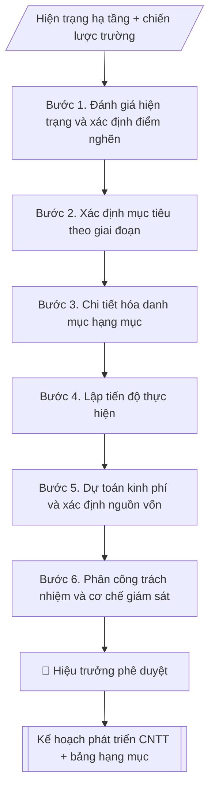

# Kế hoạch phát triển CNTT

## Định dạng và file đầu ra

Định dạng đầu ra có thể chọn theo sản phẩm/yêu cầu: .docx, .pdf. Đọc mục “Định dạng bổ sung” trong quy cách đầu ra trước khi chọn.

**Phải tạo file thực tế để tải xuống, không chỉ trả nội dung trong chat.** Định dạng mặc định của skill: **.docx**. Nếu có bảng số liệu nghiệp vụ yêu cầu file bảng tính riêng, tạo thêm Excel theo yêu cầu; không tự tạo file kiểm tra. Không chờ người dùng yêu cầu xuất file lần nữa. Ưu tiên định dạng người dùng chỉ định; đọc quy tắc xuất file tại references/quy-cach-dau-ra.md.

## Quy cách đầu ra và thông tin thiếu

Đọc [quy cách và cấu trúc sản phẩm](references/quy-cach-dau-ra.md) trước khi soạn/xuất. File giao chỉ gồm văn bản hoặc sản phẩm nghiệp vụ được yêu cầu; kiểm tra nội bộ không xuất kèm. Thiếu thông tin giữ nguyên trường/mục và chỗ điền theo mẫu gốc (dòng dấu chấm, dấu gạch hoặc ô trống); không tự điền dữ liệu mẫu, số 0, mã chờ xác minh hoặc dòng chờ ký. Mẫu chuyên ngành còn áp dụng được ưu tiên về cấu trúc, mã biểu và người ký. Các trường “bắt buộc” là điều kiện hoàn thiện hồ sơ, không ngăn việc soạn bản có chỗ chừa để điền. Mọi chỉ dẫn “để trống” trong skill được hiểu là không điền dữ liệu và giữ cách chừa chỗ của mẫu gốc, không phải xóa dấu chấm của mẫu.

## Kiểm soát áp dụng và phê duyệt

Trước khi chạy quy trình, xác định `ngay_ap_dung`, `loai_hinh_truong`, `quy_che_noi_bo`, `nguon_du_lieu` và `nguoi_kiem_duyet`. Chỉ yêu cầu thông tin có liên quan đến nghiệp vụ; không dùng giá trị giả định thay dữ liệu bắt buộc. Đối chiếu nội bộ hồ sơ có yếu tố pháp lý với văn bản gốc, hiệu lực, điều khoản áp dụng và chuyển tiếp; không tự đính kèm bảng kiểm tra vào file giao.

## Giới hạn và human gate

AI hỗ trợ chuẩn bị và đối chiếu. Cán bộ phụ trách kiểm tra dữ liệu/căn cứ, người có thẩm quyền duyệt và ký. Văn bản soạn chưa được coi là đã ban hành; không tự chèn nhãn trạng thái kiểm duyệt vào file giao; không đánh dấu đã ký, đã duyệt hoặc đã công bố nếu chưa có chứng cứ. Dữ liệu sinh viên, sức khỏe, nhân sự và tài chính phải hạn chế theo mục đích, phân quyền và che thông tin định danh khi dùng ví dụ. Không tải dữ liệu lên dịch vụ ngoài khi chưa có quyền. Kiểm tra Luật 91/2025/QH15 về bảo vệ dữ liệu cá nhân (hiệu lực 01/01/2026) và quy định áp dụng trước xử lý/chia sẻ dữ liệu cá nhân.

## Khi nào dùng
Khi cần lập kế hoạch đầu tư, nâng cấp hạ tầng và phần mềm CNTT của trường
theo năm hoặc theo giai đoạn (3–5 năm).

## Đầu vào (Input)

| Trường | Mô tả | Bắt buộc |
|---|---|---|
| `giai_doan` | Năm / giai đoạn kế hoạch (VD: 2026–2030) | Có |
| `hien_trang` | Hiện trạng hạ tầng, phần mềm (điểm mạnh, hạn chế) | Có |
| `hang_muc` | Danh sách hạng mục: hạ tầng mạng, SIS, LMS, tuyển sinh online, số hóa quy trình, ATTT... | Có |
| `muc_tieu` | Mục tiêu từng hạng mục | Có |
| `kinh_phi_du_kien` | Kinh phí dự kiến từng hạng mục | Không |
| `don_vi_thuc_hien` | Trung tâm CNTT phối hợp các đơn vị | Không |

## Quy trình

**Bước 1. Đánh giá hiện trạng và xác định điểm nghẽn**
- Làm gì: từ `hien_trang`, rà soát chi tiết: hạ tầng mạng (băng thông, độ phủ), phòng máy chủ, từng phần mềm (SIS, LMS, tuyển sinh...); đo/ghi nhận điểm nghẽn cụ thể (giờ cao điểm nghẽn ở đâu, dữ liệu chưa tích hợp ở khâu nào, nhân sự ATTT thiếu bao nhiêu người).
- Dùng input: `hien_trang`.
- Vai trò: Chuyên viên Trung tâm CNTT · AI hỗ trợ: đối chiếu tự động, cảnh báo sai lệch · ⏱ ~1–2 giờ (ước tính)
- Lưu ý nghiệp vụ: điểm nghẽn phải mô tả bằng số liệu đo được, không cảm tính ("chậm" là chậm bao nhiêu, ở đâu).
- → Kết quả bước: Báo cáo hiện trạng (điểm mạnh – điểm nghẽn có số liệu).

**Bước 2. Xác định mục tiêu theo giai đoạn**
- Làm gì: từ `muc_tieu`, viết mục tiêu cho từng mốc năm trong `giai_doan` (mốc 2028, mốc 2030...); mỗi mục tiêu gắn chỉ số đo được (VD: LMS phủ 100% học phần); đối chiếu với chiến lược phát triển trường và chương trình chuyển đổi số quốc gia.
- Dùng input: `muc_tieu`, `giai_doan` + báo cáo hiện trạng (Bước 1).
- Vai trò: Chuyên viên Trung tâm CNTT · AI hỗ trợ: soạn dự thảo, đối chiếu tự động, cảnh báo sai lệch · ⏱ ~1–2 giờ (ước tính)
- Lưu ý nghiệp vụ: mục tiêu phải giải quyết đúng điểm nghẽn đã xác định ở Bước 1; tránh mục tiêu "treo" không có chỉ số đo.
- → Kết quả bước: Khung mục tiêu theo năm (mốc thời gian – chỉ số đo).

**Bước 3. Chi tiết hóa danh mục hạng mục**
- Làm gì: từ `hang_muc`, mỗi hạng mục viết: nội dung chi tiết, phạm vi triển khai, đơn vị thụ hưởng, điều kiện tiên quyết (hạng mục nào phải xong trước); sắp xếp thứ tự ưu tiên: nền tảng (hạ tầng, ATTT) trước, ứng dụng sau.
- Dùng input: `hang_muc` + báo cáo hiện trạng (Bước 1).
- Vai trò: Chuyên viên Trung tâm CNTT · AI hỗ trợ: soạn dự thảo · ⏱ ~30–90 phút (ước tính)
- Lưu ý nghiệp vụ: bẫy phổ biến là triển khai ứng dụng khi hạ tầng chưa sẵn sàng — quy tắc "nền tảng trước, ứng dụng sau" là bắt buộc.
- → Kết quả bước: Danh mục hạng mục chi tiết (nội dung – phạm vi – thụ hưởng – tiên quyết).

**Bước 4. Lập tiến độ thực hiện**
- Làm gì: chia từng hạng mục theo năm/quý trong `giai_doan`; xác định hạng mục gối đầu (làm song song được) và hạng mục nối tiếp (phải chờ hạng mục trước); đánh dấu các mốc giám sát (milestone) để báo cáo.
- Dùng input: danh mục hạng mục (Bước 3) + `giai_doan`.
- Vai trò: Chuyên viên Trung tâm CNTT · AI hỗ trợ: lập bảng biểu, định dạng · ⏱ ~30–60 phút (ước tính)
- Lưu ý nghiệp vụ: tiến độ phải khớp năm tài chính và kế hoạch mua sắm; để dự phòng 10–15% thời gian cho hạng mục phức tạp.
- → Kết quả bước: Bảng tiến độ (hạng mục – năm/quý – mốc giám sát).

**Bước 5. Dự toán kinh phí và xác định nguồn vốn**
- Làm gì: từ `kinh_phi_du_kien`, chi tiết hóa kinh phí từng hạng mục (thiết bị, phần mềm, triển khai, đào tạo, dự phòng); xác định nguồn vốn cho từng hạng mục (ngân sách, đề án, xã hội hóa); tổng hợp và đối chiếu với khả năng cân đối.
- Dùng input: `kinh_phi_du_kien` + danh mục hạng mục (Bước 3).
- Vai trò: Chuyên viên Trung tâm CNTT · AI hỗ trợ: tổng hợp, chuẩn hóa dữ liệu, đối chiếu tự động, cảnh báo sai lệch · ⏱ ~1–2 giờ (ước tính)
- Lưu ý nghiệp vụ: chi phí đào tạo và vận hành sau triển khai thường bị bỏ quên — phải đưa vào dự toán; ghi rõ cơ sở tính từng khoản.
- → Kết quả bước: Bảng dự toán kinh phí (hạng mục – chi tiết – nguồn vốn).

**Bước 6. Phân công trách nhiệm và cơ chế giám sát**
- Làm gì: từ `don_vi_thuc_hien`, mỗi hạng mục ghi đơn vị chủ trì, đơn vị phối hợp, đầu mối chịu trách nhiệm; quy định chế độ báo cáo (6 tháng/lần), mẫu báo cáo tiến độ và người nhận báo cáo.
- Dùng input: `don_vi_thuc_hien` + bảng tiến độ (Bước 4).
- Vai trò: Chuyên viên Trung tâm CNTT · AI hỗ trợ: xử lý sơ bộ, tổng hợp · ⏱ ~30–90 phút (ước tính)
- Lưu ý nghiệp vụ: mỗi hạng mục chỉ có 1 đơn vị chủ trì duy nhất để tránh đùn đẩy; mốc giám sát gắn với mốc giải ngân.
- → Kết quả bước: Bảng phân công (hạng mục – chủ trì – phối hợp – chế độ báo cáo).

**Bước 7. Tổng hợp và hoàn thiện văn bản kế hoạch**
- Làm gì: ghép các bán thành phẩm Bước 1–6 thành văn bản kế hoạch theo thể thức (số ký hiệu, nơi nhận, chữ ký); rà soát nhất quán: mục tiêu – hạng mục – tiến độ – kinh phí – phân công.
- Dùng input: toàn bộ bán thành phẩm Bước 1–6.
- Vai trò: Chuyên viên Trung tâm CNTT · AI hỗ trợ: tổng hợp, chuẩn hóa dữ liệu, đối chiếu tự động, cảnh báo sai lệch · ⏱ ~30–60 phút (ước tính)
- Lưu ý nghiệp vụ: kiểm tra tổng kinh phí khớp giữa các bảng; số ký hiệu không trùng.
- → Kết quả bước: Văn bản kế hoạch phát triển CNTT hoàn chỉnh (sẵn sàng trình phê duyệt).

## Luồng quy trình (Workflow)

## Đầu ra

File nghiệp vụ thực tế theo định dạng mặc định ở đầu skill hoặc định dạng người dùng yêu cầu, kèm liên kết tải trong phản hồi cuối.

Sản phẩm nghiệp vụ hoàn chỉnh theo [quy cách và cấu trúc](references/quy-cach-dau-ra.md), giữ các trường chưa có dữ liệu ở trạng thái trống. Không xuất kèm checklist/phụ lục kiểm tra đầu ra.

## Kiểm tra nội bộ trước khi giao

- [ ] Bố cục khớp mẫu áp dụng và cấu trúc tại references/quy-cach-dau-ra.md.
- [ ] Có đầy đủ sản phẩm: Văn bản kế hoạch phát triển CNTT hoàn chỉnh
- [ ] Có đầy đủ sản phẩm: Bảng hạng mục chi tiết (nội dung – tiến độ – kinh phí – đơn vị thực hiện)
- [ ] Mọi số liệu, tên, ngày tháng trong output khớp với Input đã cung cấp (không thêm bớt, không suy đoán)
- [ ] Không bịa đặt số liệu, minh chứng, trích dẫn hay căn cứ
- [ ] Đúng thể thức, định dạng văn bản theo quy định hiện hành
- [ ] Căn cứ pháp lý nêu đầy đủ, còn hiệu lực tại thời điểm lập
- [ ] Đã qua Human gate: người có thẩm quyền đã kiểm tra/ký duyệt trước khi phát hành
- [ ] Điểm nghẽn phải mô tả bằng số liệu đo được, không cảm tính ("chậm" là chậm bao nhiêu, ở đâu).
- [ ] Mục tiêu phải giải quyết đúng điểm nghẽn đã xác định ở Bước 1

> Tiêu chí đạt: tất cả các ô đều được đánh dấu.

## Căn cứ & lưu ý
- Chiến lược phát triển Trường Đại học A giai đoạn 2026–2030 (giả lập).
- Chương trình chuyển đổi số quốc gia; khung kiến trúc chính phủ điện tử (tham khảo).
- Ưu tiên hạng mục nền tảng (hạ tầng, ATTT) trước khi triển khai ứng dụng.
- Không dùng tên thật của trường/cá nhân khi mô phỏng.

## Quản trị phiên bản

- Phiên bản gói: `1.3.1`; ngày cập nhật: `2026-10-10`.
- Kho nguồn: https://github.com/phamtruong91/university-skills-framework
- Người duy trì trên GitHub: `phamtruong91` (Phạm Văn Trường). Người phê duyệt nghiệp vụ: **chưa chỉ định**.
- Commit nguồn trước cập nhật: `346719e6b0318ed034b4b016703f79733aa575e7`. Commit chứa phiên bản này xem bằng `git log -1 -- skills/ke-hoach-phat-trien-cntt`; không tự gán SHA chưa tạo.
- Giấy phép: theo LICENSE của kho; bản quyền CES Global.
- Lịch sử 1.1.0: bổ sung metadata giao diện, kiểm soát áp dụng, quản trị phiên bản.
- Trạng thái: dự thảo nghiệp vụ; kiểm tra pháp lý trước thực thi. Ngày cập nhật không đồng nghĩa mọi văn bản đã được rà soát toàn văn.
