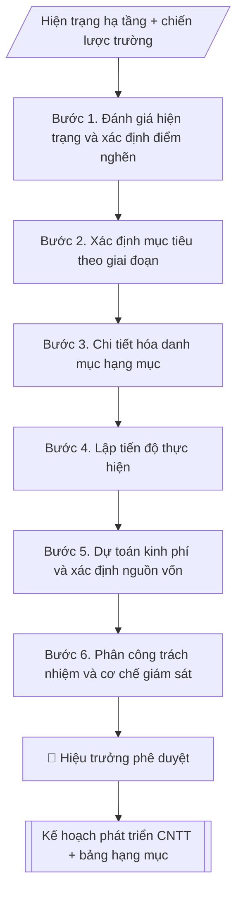

# Skill: Kế hoạch phát triển CNTT

## Khi nào dùng
Khi cần lập kế hoạch đầu tư, nâng cấp hạ tầng và phần mềm CNTT của trường
theo năm hoặc theo giai đoạn (3–5 năm).

## Đầu vào (Input)

| Trường | Mô tả | Bắt buộc |
|---|---|---|
| `giai_doan` | Năm / giai đoạn kế hoạch (VD: 2026–2030) | Có |
| `hien_trang` | Hiện trạng hạ tầng, phần mềm (điểm mạnh, hạn chế) | Có |
| `hang_muc` | Danh sách hạng mục: hạ tầng mạng, SIS, LMS, tuyển sinh online, số hóa quy trình, ATTT... | Có |
| `muc_tieu` | Mục tiêu từng hạng mục | Có |
| `kinh_phi_du_kien` | Kinh phí dự kiến từng hạng mục | Không |
| `don_vi_thuc_hien` | Trung tâm CNTT phối hợp các đơn vị | Không |

## Quy trình

**Bước 1. Đánh giá hiện trạng và xác định điểm nghẽn**
- Làm gì: từ `hien_trang`, rà soát chi tiết: hạ tầng mạng (băng thông, độ phủ), phòng máy chủ, từng phần mềm (SIS, LMS, tuyển sinh...); đo/ghi nhận điểm nghẽn cụ thể (giờ cao điểm nghẽn ở đâu, dữ liệu chưa tích hợp ở khâu nào, nhân sự ATTT thiếu bao nhiêu người).
- Dùng input: `hien_trang`.
- Vai trò: Chuyên viên Trung tâm CNTT · AI hỗ trợ: đối chiếu tự động, cảnh báo sai lệch · ⏱ ~1–2 giờ (ước tính)
- Lưu ý nghiệp vụ: điểm nghẽn phải mô tả bằng số liệu đo được, không cảm tính ("chậm" là chậm bao nhiêu, ở đâu).
- → Kết quả bước: Báo cáo hiện trạng (điểm mạnh – điểm nghẽn có số liệu).

**Bước 2. Xác định mục tiêu theo giai đoạn**
- Làm gì: từ `muc_tieu`, viết mục tiêu cho từng mốc năm trong `giai_doan` (mốc 2028, mốc 2030...); mỗi mục tiêu gắn chỉ số đo được (VD: LMS phủ 100% học phần); đối chiếu với chiến lược phát triển trường và chương trình chuyển đổi số quốc gia.
- Dùng input: `muc_tieu`, `giai_doan` + báo cáo hiện trạng (Bước 1).
- Vai trò: Chuyên viên Trung tâm CNTT · AI hỗ trợ: soạn dự thảo, đối chiếu tự động, cảnh báo sai lệch · ⏱ ~1–2 giờ (ước tính)
- Lưu ý nghiệp vụ: mục tiêu phải giải quyết đúng điểm nghẽn đã xác định ở Bước 1; tránh mục tiêu "treo" không có chỉ số đo.
- → Kết quả bước: Khung mục tiêu theo năm (mốc thời gian – chỉ số đo).

**Bước 3. Chi tiết hóa danh mục hạng mục**
- Làm gì: từ `hang_muc`, mỗi hạng mục viết: nội dung chi tiết, phạm vi triển khai, đơn vị thụ hưởng, điều kiện tiên quyết (hạng mục nào phải xong trước); sắp xếp thứ tự ưu tiên: nền tảng (hạ tầng, ATTT) trước, ứng dụng sau.
- Dùng input: `hang_muc` + báo cáo hiện trạng (Bước 1).
- Vai trò: Chuyên viên Trung tâm CNTT · AI hỗ trợ: soạn dự thảo · ⏱ ~30–90 phút (ước tính)
- Lưu ý nghiệp vụ: bẫy phổ biến là triển khai ứng dụng khi hạ tầng chưa sẵn sàng — quy tắc "nền tảng trước, ứng dụng sau" là bắt buộc.
- → Kết quả bước: Danh mục hạng mục chi tiết (nội dung – phạm vi – thụ hưởng – tiên quyết).

**Bước 4. Lập tiến độ thực hiện**
- Làm gì: chia từng hạng mục theo năm/quý trong `giai_doan`; xác định hạng mục gối đầu (làm song song được) và hạng mục nối tiếp (phải chờ hạng mục trước); đánh dấu các mốc giám sát (milestone) để báo cáo.
- Dùng input: danh mục hạng mục (Bước 3) + `giai_doan`.
- Vai trò: Chuyên viên Trung tâm CNTT · AI hỗ trợ: lập bảng biểu, định dạng · ⏱ ~30–60 phút (ước tính)
- Lưu ý nghiệp vụ: tiến độ phải khớp năm tài chính và kế hoạch mua sắm; để dự phòng 10–15% thời gian cho hạng mục phức tạp.
- → Kết quả bước: Bảng tiến độ (hạng mục – năm/quý – mốc giám sát).

**Bước 5. Dự toán kinh phí và xác định nguồn vốn**
- Làm gì: từ `kinh_phi_du_kien`, chi tiết hóa kinh phí từng hạng mục (thiết bị, phần mềm, triển khai, đào tạo, dự phòng); xác định nguồn vốn cho từng hạng mục (ngân sách, đề án, xã hội hóa); tổng hợp và đối chiếu với khả năng cân đối.
- Dùng input: `kinh_phi_du_kien` + danh mục hạng mục (Bước 3).
- Vai trò: Chuyên viên Trung tâm CNTT · AI hỗ trợ: tổng hợp, chuẩn hóa dữ liệu, đối chiếu tự động, cảnh báo sai lệch · ⏱ ~1–2 giờ (ước tính)
- Lưu ý nghiệp vụ: chi phí đào tạo và vận hành sau triển khai thường bị bỏ quên — phải đưa vào dự toán; ghi rõ cơ sở tính từng khoản.
- → Kết quả bước: Bảng dự toán kinh phí (hạng mục – chi tiết – nguồn vốn).

**Bước 6. Phân công trách nhiệm và cơ chế giám sát**
- Làm gì: từ `don_vi_thuc_hien`, mỗi hạng mục ghi đơn vị chủ trì, đơn vị phối hợp, đầu mối chịu trách nhiệm; quy định chế độ báo cáo (6 tháng/lần), mẫu báo cáo tiến độ và người nhận báo cáo.
- Dùng input: `don_vi_thuc_hien` + bảng tiến độ (Bước 4).
- Vai trò: Chuyên viên Trung tâm CNTT · AI hỗ trợ: xử lý sơ bộ, tổng hợp · ⏱ ~30–90 phút (ước tính)
- Lưu ý nghiệp vụ: mỗi hạng mục chỉ có 1 đơn vị chủ trì duy nhất để tránh đùn đẩy; mốc giám sát gắn với mốc giải ngân.
- → Kết quả bước: Bảng phân công (hạng mục – chủ trì – phối hợp – chế độ báo cáo).

**Bước 7. Tổng hợp và hoàn thiện văn bản kế hoạch**
- Làm gì: ghép các bán thành phẩm Bước 1–6 thành văn bản kế hoạch theo thể thức (số ký hiệu, nơi nhận, chữ ký); rà soát nhất quán: mục tiêu – hạng mục – tiến độ – kinh phí – phân công.
- Dùng input: toàn bộ bán thành phẩm Bước 1–6.
- Vai trò: Chuyên viên Trung tâm CNTT · AI hỗ trợ: tổng hợp, chuẩn hóa dữ liệu, đối chiếu tự động, cảnh báo sai lệch · ⏱ ~30–60 phút (ước tính)
- Lưu ý nghiệp vụ: kiểm tra tổng kinh phí khớp giữa các bảng; số ký hiệu không trùng.
- → Kết quả bước: Văn bản kế hoạch phát triển CNTT hoàn chỉnh (sẵn sàng trình phê duyệt).

## Luồng quy trình (Workflow)



## Đầu ra (Output)
- Văn bản kế hoạch phát triển CNTT hoàn chỉnh.
- Bảng hạng mục chi tiết (nội dung – tiến độ – kinh phí – đơn vị thực hiện).

**Cấu trúc output chuẩn** (khung mẫu cố định của sản phẩm chính — Kế hoạch phát triển CNTT):
1. Phần mở đầu hành chính (tên trường, đơn vị, số ký hiệu, ngày tháng).
2. Tên kế hoạch + giai đoạn áp dụng.
3. Hiện trạng (hạ tầng, phần mềm, hạn chế — có số liệu).
4. Mục tiêu (theo mốc năm, có chỉ số đo).
5. Bảng hạng mục thực hiện (STT – hạng mục – nội dung chính – tiến độ – kinh phí – đơn vị thực hiện).
6. Tổ chức thực hiện (đầu mối, chế độ báo cáo, trách nhiệm các đơn vị).
7. Nơi nhận, chữ ký.

## Checklist nghiệm thu

- [ ] Đủ các phần theo "Cấu trúc output chuẩn": Phần mở đầu hành chính (tên trường, đơn vị,…; Tên kế hoạch + giai đoạn áp dụng.; Hiện trạng (hạ tầng, phần mềm, hạn chế; Mục tiêu (theo mốc năm, có chỉ số đo).; Bảng hạng mục thực hiện (STT; Tổ chức thực hiện (đầu mối, chế độ báo cáo,…; …
- [ ] Có đầy đủ sản phẩm: Văn bản kế hoạch phát triển CNTT hoàn chỉnh
- [ ] Có đầy đủ sản phẩm: Bảng hạng mục chi tiết (nội dung – tiến độ – kinh phí – đơn vị thực hiện)
- [ ] Mọi số liệu, tên, ngày tháng trong output khớp với Input đã cung cấp (không thêm bớt, không suy đoán)
- [ ] Không bịa đặt số liệu, minh chứng, trích dẫn hay căn cứ
- [ ] Đúng thể thức, định dạng văn bản theo quy định hiện hành
- [ ] Căn cứ pháp lý nêu đầy đủ, còn hiệu lực tại thời điểm lập
- [ ] Đã qua Human gate: người có thẩm quyền đã kiểm tra/ký duyệt trước khi phát hành
- [ ] Điểm nghẽn phải mô tả bằng số liệu đo được, không cảm tính ("chậm" là chậm bao nhiêu, ở đâu).
- [ ] Mục tiêu phải giải quyết đúng điểm nghẽn đã xác định ở Bước 1

> Tiêu chí đạt: tất cả các ô đều được đánh dấu.

## Ví dụ mô phỏng (dữ liệu giả lập)

> Tất cả tên trường, cá nhân, số liệu dưới đây đều là **giả lập**, không liên quan tổ chức/cá nhân có thật.

### Input mẫu

| Trường | Giá trị |
|---|---|
| `giai_doan` | 2026–2030 |
| `hien_trang` | Mạng LAN 1Gbps đã phủ 80% khu vực; SIS quản lý điểm/danh sách SV; LMS mới thí điểm 20% học phần; chưa có tuyển sinh online |
| `hang_muc` | 06 hạng mục (xem bảng mẫu) |
| `muc_tieu` | Số hóa 100% quy trình đào tạo; LMS phủ 100% học phần vào 2028 |

### Output mẫu

```
TRƯỜNG ĐẠI HỌC A            CỘNG HÒA XÃ HỘI CHỦ NGHĨA VIỆT NAM
TRUNG TÂM CNTT                                Độc lập – Tự do – Hạnh phúc
      Số: 12/KH-ĐHA-CNTT
                                                 Thành phố C, ngày 09 tháng 10 năm 2026

KẾ HOẠCH
Phát triển công nghệ thông tin giai đoạn 2026–2030

I. HIỆN TRẠNG
- Hạ tầng: mạng LAN 1Gbps phủ 80% khu vực; 02 phòng máy chủ; wifi phủ 70% giảng đường.
- Phần mềm: hệ thống quản lý đào tạo (SIS) đáp ứng quản lý điểm, danh sách SV;
  LMS mới thí điểm 20% học phần; chưa có hệ thống tuyển sinh trực tuyến.
- Hạn chế: băng thông chưa đáp ứng giờ cao điểm; dữ liệu chưa tích hợp dùng chung;
  nhân sự ATTT còn mỏng.

II. MỤC TIÊU
1. Đến 2028: LMS phủ 100% học phần; tuyển sinh trực tuyến toàn trình.
2. Đến 2030: số hóa 100% quy trình đào tạo – khảo thí – văn thư; dữ liệu dùng chung
   toàn trường; đạt mức an toàn thông tin cấp độ 3.

III. HẠNG MỤC THỰC HIỆN

| STT | Hạng mục | Nội dung chính | Tiến độ | Kinh phí (tỷ đồng) | Đơn vị thực hiện |
|---|---|---|---|---|---|
| 1 | Nâng cấp hạ tầng mạng | LAN 10Gbps, wifi 6 phủ 100% | 2026–2027 | 8,0 | TT CNTT |
| 2 | Hệ thống LMS | Triển khai LMS cho 100% học phần, đào tạo GV | 2026–2028 | 3,5 | TT CNTT, P. Đào tạo |
| 3 | Tuyển sinh trực tuyến | Đăng ký, nộp hồ sơ, tra cứu kết quả online | 2027 | 2,0 | TT CNTT, P. Đào tạo |
| 4 | Số hóa quy trình | Văn thư, khảo thí, học vụ điện tử | 2027–2029 | 4,0 | TT CNTT, các phòng |
| 5 | Kho dữ liệu dùng chung | Data warehouse, dashboard quản trị | 2028–2029 | 2,5 | TT CNTT |
| 6 | An toàn thông tin | SOC, sao lưu, diễn tập ứng phó sự cố | 2026–2030 | 3,0 | TT CNTT |
| Tổng | | | | 23,0 | |

IV. TỔ CHỨC THỰC HIỆN
- Trung tâm CNTT: đầu mối, báo cáo tiến độ 6 tháng/lần.
- Phòng Tài chính – Kế toán: bố trí kinh phí theo tiến độ được duyệt.
- Các phòng/khoa: phối hợp triển khai các phân hệ liên quan.

Nơi nhận:                                        KT. HIỆU TRƯỞNG
- Ban Giám hiệu;                                 PHÓ HIỆU TRƯỞNG
- Các đơn vị;                                         (đã ký)
- Lưu: VT, CNTT.
                                              PGS.TS. Trần Văn B
```

## Căn cứ & lưu ý
- Chiến lược phát triển Trường Đại học A giai đoạn 2026–2030 (giả lập).
- Chương trình chuyển đổi số quốc gia; khung kiến trúc chính phủ điện tử (tham khảo).
- Ưu tiên hạng mục nền tảng (hạ tầng, ATTT) trước khi triển khai ứng dụng.
- Không dùng tên thật của trường/cá nhân khi mô phỏng.
