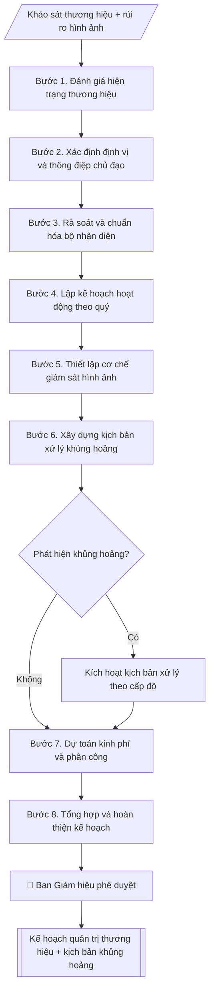

# Lập kế hoạch quản trị thương hiệu

## Kiểm soát áp dụng và phê duyệt

Trước khi chạy quy trình, xác định `ngay_ap_dung`, `loai_hinh_truong`, `quy_che_noi_bo`, `nguon_du_lieu` và `nguoi_kiem_duyet`. Chỉ yêu cầu thông tin có liên quan đến nghiệp vụ; không dùng giá trị giả định thay dữ liệu bắt buộc. Hồ sơ có yếu tố pháp lý phải kèm văn bản gốc, tình trạng hiệu lực, điều khoản áp dụng và chuyển tiếp.

## Giới hạn và human gate

AI hỗ trợ chuẩn bị và đối chiếu. Cán bộ phụ trách kiểm tra dữ liệu/căn cứ, người có thẩm quyền duyệt và ký. Mọi đầu ra mặc định là **DỰ THẢO – CHỜ KIỂM DUYỆT**; không đánh dấu đã ký, đã duyệt hoặc đã công bố nếu chưa có chứng cứ. Dữ liệu sinh viên, sức khỏe, nhân sự và tài chính phải hạn chế theo mục đích, phân quyền và che thông tin định danh khi dùng ví dụ. Không tải dữ liệu lên dịch vụ ngoài khi chưa có quyền. Kiểm tra Luật 91/2025/QH15 về bảo vệ dữ liệu cá nhân (hiệu lực 01/01/2026) và quy định áp dụng trước xử lý/chia sẻ dữ liệu cá nhân.


## Khi nào dùng
Khi đơn vị phụ trách truyền thông – thương hiệu cần xây dựng kế hoạch quản trị thương hiệu
năm/quý, hoặc khi cần củng cố hình ảnh trường sau một sự kiện/chiến dịch lớn.

## Đầu vào (Input)

| Trường | Mô tả | Bắt buộc |
|---|---|---|
| `muc_tieu` | Mục tiêu thương hiệu trong kỳ (VD: tăng nhận biết trong thí sinh THPT) | Có |
| `dinh_vi` | Định vị thương hiệu mong muốn (VD: đại học ứng dụng gắn với doanh nghiệp) | Có |
| `doi_tuong` | Nhóm đối tượng trọng tâm: thí sinh, phụ huynh, doanh nghiệp, cựu sinh viên... | Có |
| `kenh` | Kênh triển khai: website, fanpage, báo chí, sự kiện... | Không |
| `ngan_sach` | Dự toán kinh phí | Không |
| `rui_ro` | Các rủi ro hình ảnh đã nhận diện cần theo dõi | Không |

## Quy trình

**Bước 1. Đánh giá hiện trạng thương hiệu**
- Làm gì: tổng hợp dữ liệu hiện có: kết quả khảo sát nhận biết/thiện cảm (nếu có), thống kê truyền thông (lượt nhắc tích cực/tiêu cực trên báo chí, mạng xã hội); lập bảng điểm mạnh – điểm yếu hình ảnh theo từng nhóm `doi_tuong`.
- Dùng input: `doi_tuong`, `muc_tieu`.
- Vai trò: Chuyên viên Phòng Truyền thông – Tuyển sinh · AI hỗ trợ: tổng hợp, chuẩn hóa dữ liệu, lập bảng biểu, định dạng · ⏱ ~1–2 giờ (ước tính)
- Lưu ý nghiệp vụ: không bịa số liệu khảo sát — chưa có số liệu thì ghi "chưa có dữ liệu" và đề xuất khảo sát bổ sung trong kế hoạch.
- → Kết quả bước: Báo cáo hiện trạng thương hiệu (điểm mạnh/yếu theo nhóm đối tượng).

**Bước 2. Xác định định vị và thông điệp chủ đạo**
- Làm gì: từ `dinh_vi`, chốt câu định vị (≤ 15 từ) + 1 thông điệp chủ đạo cho kỳ kế hoạch; kiểm tra nhất quán với chiến lược phát triển trường và không mâu thuẫn với thông điệp các chiến dịch đang chạy.
- Dùng input: `dinh_vi`, `muc_tieu` + báo cáo hiện trạng (Bước 1).
- Vai trò: Chuyên viên Phòng Truyền thông – Tuyển sinh · AI hỗ trợ: đối chiếu tự động, cảnh báo sai lệch · ⏱ ~1–2 giờ (ước tính)
- Lưu ý nghiệp vụ: định vị phải khác biệt và chứng minh được bằng thực tế đào tạo; tránh khẩu hiệu chung chung.
- → Kết quả bước: Định vị và thông điệp chủ đạo đã chốt.

**Bước 3. Rà soát và chuẩn hóa bộ nhận diện**
- Làm gì: kiểm kê logo, màu sắc, slogan, mẫu văn bản/slide/backdrop hiện hành; đối chiếu với quy định sử dụng; lập danh sách điểm chưa chuẩn (sai màu, sai tỉ lệ logo, nhiều phiên bản slogan) và đề xuất chuẩn hóa/bổ sung.
- Dùng input: định vị và thông điệp chủ đạo (Bước 2).
- Vai trò: Chuyên viên Phòng Truyền thông – Tuyển sinh · AI hỗ trợ: đối chiếu tự động, cảnh báo sai lệch, lập bảng biểu, định dạng · ⏱ ~1–2 giờ (ước tính)
- Lưu ý nghiệp vụ: mọi ấn phẩm đối ngoại phải dùng đúng 1 bộ nhận diện; đề xuất ban hành "Sổ tay nhận diện thương hiệu" nếu chưa có.
- → Kết quả bước: Bảng rà soát nhận diện (hạng mục – hiện trạng – đề xuất chuẩn hóa).

**Bước 4. Lập kế hoạch hoạt động theo quý**
- Làm gì: từ `kenh`, thiết kế chiến dịch theo quý: mỗi quý 1 chủ đề lớn; mỗi chiến dịch ghi kênh chính, nội dung trọng tâm, sự kiện thương hiệu; gắn KPI từng quý (bài đăng, lượt tiếp cận, bài báo).
- Dùng input: `kenh`, `muc_tieu` + thông điệp chủ đạo (Bước 2).
- Vai trò: Chuyên viên Phòng Truyền thông – Tuyển sinh · AI hỗ trợ: lập bảng biểu, định dạng · ⏱ ~30–60 phút (ước tính)
- Lưu ý nghiệp vụ: hoạt động phải gắn với lịch tuyển sinh và sự kiện lớn của trường trong năm; KPI đo được, không chung chung.
- → Kết quả bước: Kế hoạch hoạt động theo quý (chiến dịch – kênh – KPI).

**Bước 5. Thiết lập cơ chế giám sát hình ảnh**
- Làm gì: quy định theo dõi hằng ngày báo chí/mạng xã hội (từ khóa theo dõi, đầu mối); mẫu báo cáo tuần; bộ chỉ số đo lường: lượt nhắc tích cực/tiêu cực, mức độ nhận biết (khảo sát 6 tháng/lần).
- Dùng input: `doi_tuong`, `rui_ro`.
- Vai trò: Chuyên viên Phòng Truyền thông – Tuyển sinh · AI hỗ trợ: xử lý sơ bộ, tổng hợp · ⏱ ~30–60 phút (ước tính)
- Lưu ý nghiệp vụ: phân công người trực giám sát cụ thể theo ca/ngày; tin tiêu cực phải được phát hiện trong vòng 4 giờ làm việc.
- → Kết quả bước: Quy chế giám sát hình ảnh (từ khóa – đầu mối – mẫu báo cáo – chỉ số).

**Bước 6. Xây dựng kịch bản xử lý khủng hoảng**
- Làm gì: từ `rui_ro`, phân 3 cấp độ sự cố; mỗi cấp độ quy định: dấu hiệu nhận biết, người phát ngôn, thời hạn phản ứng (cấp 1: phản hồi trong 4 giờ; cấp 2: thông cáo trong 24 giờ; cấp 3: báo cáo BGH ngay + phối hợp cơ quan chức năng), kênh phát ngôn chính thức, mẫu thông cáo khung.
- Dùng input: `rui_ro` + cơ chế giám sát (Bước 5).
- Vai trò: Chuyên viên Phòng Truyền thông – Tuyển sinh · AI hỗ trợ: lập bảng biểu, định dạng · ⏱ ~30–60 phút (ước tính)
- Lưu ý nghiệp vụ: chỉ người phát ngôn do Hiệu trưởng chỉ định được phát ngôn chính thức; ưu tiên phản hồi minh bạch thay vì xóa bình luận tiêu cực một cách tùy tiện.
- → Kết quả bước: Kịch bản xử lý khủng hoảng 3 cấp độ (kèm mẫu thông cáo khung).

**Bước 7. Dự toán kinh phí và phân công thực hiện**
- Làm gì: từ `ngan_sach`, phân bổ kinh phí cho từng hạng mục (chuẩn hóa nhận diện, chiến dịch theo quý, giám sát, dự phòng khủng hoảng); ghi đơn vị chủ trì/phối hợp, KPI và thời hạn từng hạng mục.
- Dùng input: `ngan_sach` + kế hoạch hoạt động (Bước 4) + bảng rà soát nhận diện (Bước 3).
- Vai trò: Chuyên viên Phòng Truyền thông – Tuyển sinh · AI hỗ trợ: xử lý sơ bộ, tổng hợp · ⏱ ~1–2 giờ (ước tính)
- Lưu ý nghiệp vụ: dành 10–15% ngân sách dự phòng cho xử lý khủng hoảng; tổng phân bổ khớp ngân sách được duyệt.
- → Kết quả bước: Bảng dự toán và phân công (hạng mục – kinh phí – đơn vị – KPI – thời hạn).

**Bước 8. Tổng hợp và hoàn thiện kế hoạch**
- Làm gì: ghép các bán thành phẩm Bước 1–7 thành văn bản kế hoạch theo thể thức hành chính (số ký hiệu, nơi nhận, chữ ký); rà soát tính nhất quán: mục tiêu – định vị – hoạt động – KPI – kinh phí.
- Dùng input: toàn bộ bán thành phẩm Bước 1–7.
- Vai trò: Chuyên viên Phòng Truyền thông – Tuyển sinh · AI hỗ trợ: tổng hợp, chuẩn hóa dữ liệu, đối chiếu tự động, cảnh báo sai lệch · ⏱ ~30–60 phút (ước tính)
- Lưu ý nghiệp vụ: kiểm tra số ký hiệu văn bản không trùng; nơi nhận đầy đủ các đơn vị phối hợp.
- → Kết quả bước: Kế hoạch quản trị thương hiệu hoàn chỉnh (sẵn sàng trình phê duyệt).

## Luồng quy trình (Workflow)



## Đầu ra (Output)
- Kế hoạch quản trị thương hiệu hoàn chỉnh (markdown).
- Phụ lục: bảng KPI đo lường + kịch bản xử lý khủng hoảng truyền thông.

**Cấu trúc output chuẩn** (khung mẫu cố định của sản phẩm chính — Kế hoạch quản trị thương hiệu):
1. Phần mở đầu hành chính (tên trường, đơn vị, số ký hiệu, ngày tháng).
2. Tên kế hoạch + kỳ áp dụng.
3. Mục tiêu.
4. Định vị và thông điệp chủ đạo.
5. Chuẩn hóa bộ nhận diện (danh mục rà soát + đề xuất).
6. Hoạt động theo quý (bảng: quý – chiến dịch – kênh chính – KPI).
7. Giám sát hình ảnh (cơ chế theo dõi, chỉ số đo lường).
8. Kịch bản xử lý khủng hoảng (3 cấp độ: dấu hiệu – người phát ngôn – thời hạn – kênh).
9. Kinh phí và tổ chức thực hiện.
10. Nơi nhận, chữ ký.
- Phụ lục: Bảng KPI đo lường chi tiết.

## Checklist nghiệm thu

- [ ] Đủ các phần theo "Cấu trúc output chuẩn": Phần mở đầu hành chính (tên trường, đơn vị,…; Tên kế hoạch + kỳ áp dụng.; Mục tiêu.; Định vị và thông điệp chủ đạo.; Chuẩn hóa bộ nhận diện (danh mục rà soát +…; Hoạt động theo quý (bảng; …
- [ ] Có đầy đủ sản phẩm: Kế hoạch quản trị thương hiệu hoàn chỉnh (markdown)
- [ ] Có đầy đủ sản phẩm: Phụ lục: bảng KPI đo lường + kịch bản xử lý khủng hoảng truyền thông
- [ ] Mọi số liệu, tên, ngày tháng trong output khớp với Input đã cung cấp (không thêm bớt, không suy đoán)
- [ ] Không bịa đặt số liệu, minh chứng, trích dẫn hay căn cứ
- [ ] Đúng thể thức, định dạng văn bản theo quy định hiện hành
- [ ] Căn cứ pháp lý nêu đầy đủ, còn hiệu lực tại thời điểm lập
- [ ] Đã qua Human gate: người có thẩm quyền đã kiểm tra/ký duyệt trước khi phát hành
- [ ] Không bịa số liệu khảo sát — chưa có số liệu thì ghi "chưa có dữ liệu" và đề xuất khảo sát bổ sung trong kế hoạch.
- [ ] Định vị phải khác biệt và chứng minh được bằng thực tế đào tạo

> Tiêu chí đạt: tất cả các ô đều được đánh dấu.

## Ví dụ mô phỏng (dữ liệu giả lập)

> Tất cả tên trường, cá nhân, số liệu dưới đây đều là **giả lập**, không liên quan tổ chức/cá nhân có thật.

### Input mẫu

| Trường | Giá trị |
|---|---|
| `muc_tieu` | Tăng 20% mức độ nhận biết trong học sinh THPT tại 5 tỉnh trọng điểm trong năm 2027 |
| `dinh_vi` | Đại học ứng dụng, đào tạo gắn với nhu cầu doanh nghiệp |
| `doi_tuong` | Học sinh lớp 11–12, phụ huynh, doanh nghiệp đối tác |
| `kenh` | Fanpage, TikTok, website, báo chí giáo dục, ngày hội tư vấn |
| `ngan_sach` | 800 triệu đồng |
| `rui_ro` | Tin đồn sai về điểm chuẩn; phản ánh tiêu cực về ký túc xá trên mạng xã hội |

### Output mẫu

```
TRƯỜNG ĐẠI HỌC A            CỘNG HÒA XÃ HỘI CHỦ NGHĨA VIỆT NAM
PHÒNG TRUYỀN THÔNG VÀ TUYỂN SINH         Độc lập – Tự do – Hạnh phúc
      Số: 34/KH-ĐHA-TTTTS
                                                 Thành phố C, ngày 10 tháng 12 năm 2026

                          KẾ HOẠCH
               Quản trị thương hiệu năm 2027

I. MỤC TIÊU
Tăng 20% mức độ nhận biết thương hiệu trong học sinh THPT tại 5 tỉnh trọng điểm
trong năm 2027.

II. ĐỊNH VỊ VÀ THÔNG ĐIỆP CHỦ ĐẠO
- Định vị: Đại học ứng dụng, đào tạo gắn với nhu cầu doanh nghiệp.
- Thông điệp chủ đạo: "Học thực tế – Làm được việc".

III. CHUẨN HÓA BỘ NHẬN DIỆN
1. Rà soát, ban hành Sổ tay nhận diện thương hiệu (logo, màu sắc, slogan, quy định
   sử dụng) trong Quý I/2027.
2. Chuẩn hóa mẫu văn bản, slide, backdrop sự kiện theo bộ nhận diện mới.

IV. HOẠT ĐỘNG THEO QUÝ
| Quý | Chiến dịch | Kênh chính | KPI |
|-----|-----------|------------|-----|
| I | Khởi động thương hiệu năm 2027 | Fanpage, website | 50 bài đăng, 1 triệu lượt tiếp cận |
| II | Đồng hành mùa thi THPT | TikTok, ngày hội tư vấn | 30 video, 15 trường THPT |
| III | Tuyển sinh đợt 1 | Báo chí, livestream | 10 bài báo, 8 livestream |
| IV | Tổng kết – tri ân | Fanpage, sự kiện | 01 gala tri ân đối tác |

V. GIÁM SÁT HÌNH ẢNH
- Theo dõi hằng ngày báo chí và mạng xã hội; báo cáo tuần về Ban Giám hiệu.
- Chỉ số: lượt nhắc tích cực/tiêu cực, mức độ nhận biết (khảo sát 6 tháng/lần).

VI. KỊCH BẢN XỬ LÝ KHỦNG HOẢNG (tóm tắt)
- Cấp độ 1 (tin đồn nhỏ): Phòng Truyền thông phản hồi trong 4 giờ trên kênh chính thức.
- Cấp độ 2 (lan rộng): thành lập tổ xử lý, người phát ngôn do Hiệu trưởng chỉ định,
  ra thông cáo trong 24 giờ.
- Cấp độ 3 (nghiêm trọng): báo cáo Ban Giám hiệu ngay, phối hợp cơ quan chức năng.

VII. KINH PHÍ VÀ TỔ CHỨC THỰC HIỆN
- Tổng dự toán: 800 triệu đồng từ nguồn chi sự nghiệp.
- Phòng Truyền thông và Tuyển sinh chủ trì, phối hợp các khoa, phòng liên quan.

Nơi nhận:                                          KT. HIỆU TRƯỞNG
- Ban Giám hiệu (để b/c);                   TRƯỞNG PHÒNG TRUYỀN THÔNG
- Các đơn vị (để phối hợp);                        VÀ TUYỂN SINH
- Lưu: VT, TTTTS.                                      [CHỜ KÝ]

                                                  ThS. Đỗ Thị A
```

## Human gate (người kiểm duyệt)
- Trưởng phòng Truyền thông (đơn vị phụ trách thương hiệu) soạn và chịu trách nhiệm nội dung.
- Ban Giám hiệu phê duyệt kế hoạch và ngân sách.
- Trong khủng hoảng: chỉ người phát ngôn do Hiệu trưởng chỉ định được phát ngôn chính thức.

## Giới hạn (guardrails)
- AI không tự phát ngôn thay trường, đặc biệt trong tình huống khủng hoảng.
- AI không bịa số liệu khảo sát thương hiệu; mọi con số phải có nguồn.
- AI không sử dụng hình ảnh, âm nhạc, tư liệu không rõ bản quyền.

## Căn cứ & lưu ý
- Quy chế phát ngôn và cung cấp thông tin của trường (văn bản nội bộ).
- Luật Báo chí khi làm việc với cơ quan báo chí.
- Không dùng tên thật của trường/cá nhân khi mô phỏng.

## Quản trị phiên bản

- Phiên bản gói: `1.1.0`; ngày cập nhật: `2026-10-09`.
- Kho nguồn: https://github.com/phamtruong91/dh-skills
- Người duy trì trên GitHub: `phamtruong91` (Phạm Văn Trường). Người phê duyệt nghiệp vụ: **chưa chỉ định**.
- Commit nguồn trước cập nhật: `78fd1d51b8acd1a724d9b9af6c488460bc7551ad`. Commit chứa phiên bản này xem bằng `git log -1 -- skills/ke-hoach-quan-tri-thuong-hieu`; không tự gán SHA chưa tạo.
- Giấy phép: theo LICENSE của kho; bản quyền CES Global.
- Lịch sử 1.1.0: bổ sung metadata giao diện, kiểm soát áp dụng, quản trị phiên bản.
- Trạng thái: dự thảo nghiệp vụ; kiểm tra pháp lý trước thực thi. Ngày cập nhật không đồng nghĩa mọi văn bản đã được rà soát toàn văn.
